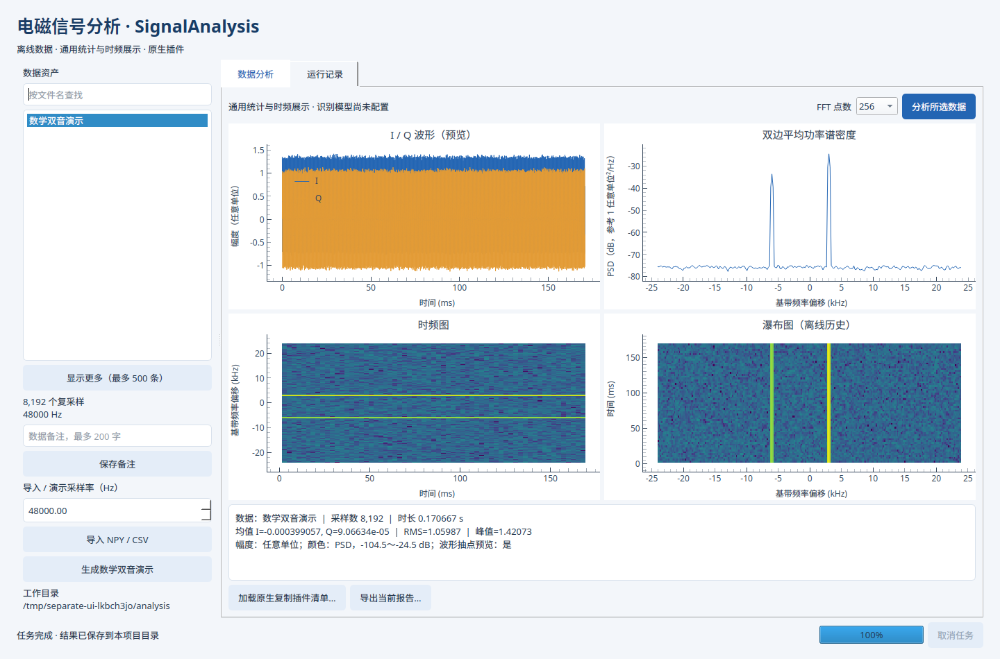
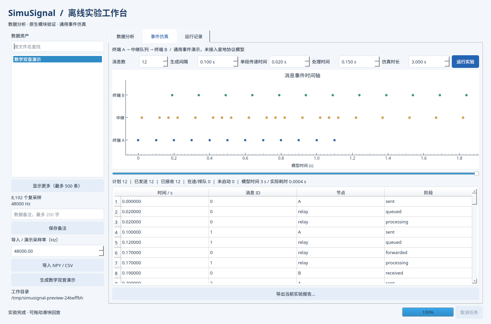

# SimuSignal 两项目工作区

本仓库按方案总览实现 **两个独立应用、一个共用基础库**。

| 项目 | 业务包 | 桌面入口 | 默认数据目录 |
| --- | --- | --- | --- |
| 电磁信号分析 | `src/signal_analysis` | `apps/analysis_desktop/main.py` | `workspace_data/analysis` |
| 通信仿真实验 | `src/communication_sim` | `apps/simulation_desktop/main.py` | `workspace_data/simulation` |
| 共用基础库 | `src/common` | 无业务启动入口 | 无共享业务数据库 |

## 开发安装与分别启动

在仓库根目录执行：

```bash
python3 -m venv .venv
source .venv/bin/activate
# 核心依赖 + gui + dev 
python -m pip install -e '.[gui,dev]' 
# 所有torch 体积很大，仅在需要训练时装
python -m pip install -e '.[gui,dev,ml,train]'
python -m signal_analysis gui
python -m communication_sim gui
```

Windows 用 `python -m venv .venv` 创建环境，PowerShell 中执行 `.venv\Scripts\Activate.ps1` 后使用同样的 Python 命令。根项目只用于统一开发，两套正式发布清单在各自的 `apps` 目录。

安装后也可分别运行 `signal-analysis gui`、`communication-sim gui`，或执行两个 `apps/.../main.py`。

## 电磁信号分析项目

支持一维数值 NPY、无表头 CSV（一列实数或两列 I,Q）、交织 IQ 二进制（.bin/.raw/.iq，显式指定 int16/float32 与大小端）、数学双音演示、通用统计、频谱/时频图与星座图/瀑布图、数据备注、运行历史、JSON/HTML 报告和原生复制示例插件。分析有两种方式：一键概览整段数据，或按可调速度实时播放。波形与频谱使用固定显示范围（幅度、时窗、频宽、动态范围），可在界面调整，播放时保持不变。数字/模拟判定为启发式，可在界面手动纠正；实数数据默认只显示非负频率。实时播放的瀑布图为固定时长的滚动窗口，时间窗可选 10 ms～20 s。

```bash
python -m signal_analysis demo --count 8192 --sample-rate 48000
python -m signal_analysis import data.npy --sample-rate 48000
python -m signal_analysis import iq.bin --sample-rate 48000 --binary-dtype int16 --endian little
python -m signal_analysis list
python -m signal_analysis analyze ASSET_ID --nfft 256
python -m signal_analysis export RUN_ID report.html
```

把 ID 替换为前一步输出。单文件限制为 512 MiB，最多 16,000,000 个采样点。采样率明确填写，不猜测未知 BIN 文件。

### 信号 IQ 生成（测试信号源）

界面"IQ 信号生成"页，用于生成测试检测、参数估计与调制识别算法的 IQ 基带信号：支持 AM、FM、SSB、2ASK、QPSK、16QAM、64QAM 与跳频信号（FH-2FSK 模拟遥控链路、FH-OFDM 模拟图传链路）。IQ 为复基带记录，不设置载频，"频点"指基带频率偏移。可设置信号持续时间、采样率、随机种子、每信号功率（dBFS）、目标带宽、频点、跳速、符号速率等；自动按调制样式与目标带宽推导消息带宽、频偏、滚降成形等参数。支持一次 IQ 中包含最多 16 种信号并独立设置参数，以及带限背景噪声。

噪声口径为**带内信噪比**：噪声功率在设定的噪声带宽内均匀分布（功率谱密度 `N0 = P_noise / B_noise`），信号的带内噪声取 `N0 × 该信号实际占用带宽`，因此某信号的带内 SNR = 其平均功率 ÷（`N0 × B_actual`）。界面填写的 `snr_db` 指最强的那个信号（按实测平均功率判定）的带内 SNR，其余信号按各自实际带宽与重叠频带折算，结果记录在摘要的 `signals[].snr_inband_db` 中；若噪声带宽未覆盖最强信号的占用频带会直接报错，避免实测 SNR 与填写值不符。纯噪声（无信号）时改为填写噪声的绝对总功率（dBFS）。摘要同时给出 `noise.power_dbfs_per_hz`、`noise.snr_definition`（当前为 `inband_snr_v1`）与 `noise.snr_reference_index` 以便复核。可导出 NPY、CSV（两列 I,Q）或交织 IQ 二进制（int16/float32、大小端可选）。

```bash
python -m signal_analysis --workspace /tmp/iqws generate spec.json
```

`spec.json` 形如 `{"sample_rate": 1e6, "duration": 0.2, "seed": 0, "noise": {"enabled": true, "bandwidth": 1e6, "snr_db": 20}, "signals": [{"mode": "qpsk", "offset": 100000, "power_dbfs": -10, "bandwidth": 200000}], "name": "QPSK测试", "export": {"format": "iq16", "endian": "little"}}`，生成结果保存为工作目录内数据资产并可同时导出到 `exports/`。

SigMF 双文件读写使用正式依赖 `sigmf==1.11.1`：在生成页选择“SigMF 双文件”，或把上述规格中的 `export` 改为 `{"format": "sigmf"}`。输出为同名 `.sigmf-meta`（元数据）与 `.sigmf-data`（小端 complex float32 IQ），两者须一起保存和分发。已有环境更新依赖可运行 `python -m pip install -e ".[gui]"`。

GUI 导入可选择 `.sigmf-meta` 或 `.sigmf-data`，自动读取采样率。CLI 示例：

```bash
python -m signal_analysis import path/to/recording.sigmf-meta
```

SigMF 不必指定 `--sample-rate`；显式指定时必须与文件一致。其他格式仍需该参数。导入支持单通道 `cf32/cf64/ci16` 的大小端连续 IQ 双文件，内部转换为 complex64；暂不支持 `.sigmf` 归档、多通道或外部数据引用。导入的原始元数据及生成摘要关联资产保存；生成摘要也写入导出文件的 `core:description`，不虚构射频载频。详细限制见设计文档 §4.1。

### 信号检测与参数估计（能量检测基线）

界面“信号检测”页，或 CLI `detect`：STFT 时频图 → 噪声本底估计 → 自适应门限 → 形态学闭运算合并 → 逐目标给出中心频率、占用带宽、时间范围、功率与带内 SNR；同一载波上的跳频信道按会话合并为一条记录。结果是冻结的 `detect_result_v1` 结构，可用 `evaluation.evaluate_detections` 与 IQ 生成摘要中的真值逐项评分（召回、精确率、中心频率 MAE、带宽相对误差）。

```bash
python -m signal_analysis detect ASSET_ID --nfft 512 --threshold-db 3 --max-detections 32
```

### AI 检测（可选，ONNX Runtime）

```bash
python -m pip install -e ".[ml]"           # onnxruntime；未安装时界面 AI 入口自动禁用
python -m signal_analysis ml-manifest model.onnx detector.json --image-size 1024 --nfft 512 \
    --framework yolox --license Apache-2.0 --dataset "本项目合成数据集"
python -m signal_analysis ml-detect ASSET_ID detector.json --score-threshold 0.25
```

模型清单声明输入图像契约（尺寸、STFT 点数、动态范围、归一化方式）与输出框格式，推理时强制与清单一致而不是静默改变输入；`ml-detect` 默认同时跑一遍能量检测基线，两条路径的指标可直接对照。训练、导出与验收脚本见 [`training/`](training/README.md)（该目录不随 wheel 分发，训练依赖 `.[train]`）。

### 调制识别（A09 六类）

界面“调制识别”页，或 CLI `amc-classify`：在检测结果给出的频带（或手工填写的中心频率/占用带宽）上把信号搬到零频、抽取到与带宽匹配的分析率，提取 34 维冻结特征（包络统计、瞬时频率/相位、高阶累积量、谱对称性等），再由模型输出 A09 六类字典 `FM / SSB / 2ASK / QPSK / 16QAM / 64QAM` 的分数与置信度。

```bash
python -m signal_analysis amc-classify ASSET_ID --offset-hz 40000 --bandwidth-hz 30000
python -m signal_analysis amc-classify ASSET_ID --model model.json          # 自带模型
python -m signal_analysis amc-manifest model.json amc.json --id dut --version 1.0.0
```

随包分发一个**线性基线**模型（`amc-linear-default`，34 维特征上的多项逻辑回归，含温度标定），无需 `.[ml]` 即可离线使用；仓库内实测（800 次/类合成场景，验证集）准确率 0.8250、macro F1 0.8246，带内 SNR ≥ 10 dB 时 ≥ 0.97，主要误差来自 10 dB 以下 16QAM 与 64QAM 之间的混淆。结果结构为冻结的 `amc_classify_v1`，同时给出传统启发式对照（数字/模拟、恒包络/非恒包络），字段 `pending` 明确列出**尚未确认项**：识别准确率的合格门限尚未确定，因此只报原始指标而不做通过/不通过判定。

生成数据会带上生成器真值并逐条计命中（`truth_hit`）；导入数据或原生插件产出没有真值，此时接口返回 `不适用` 并**保留失败样本计数**，不静默丢弃。`am` 与跳频样式不在 A09 六类字典内，按“不适用”计入统计而不算识别错误。训练、导出与验收脚本见 [`training/README.md`](training/README.md) §6。

### 算法对比与离线报告

界面“算法对比”页把同一对象在不同路径上的取值并排列出（环节 / 对象 / 指标 / 取值），便于直接看出差异而不是各看各的结果；某一侧没有产出时显示 `--`，不填 0、不猜测。

导出的 HTML 报告（`export RUN_ID report.html`，CLI 与冻结产物同接口）除页尾完整原始 JSON 外，按结果类型附指标表：检测与 AI 检测给出“检测结果 / 传统基线”两列的真实目标数、匹配、漏警、虚警、精确率、召回、F1、中心频率 MAE、带宽相对误差与带内信噪比 MAE；调制识别给出预测类别、置信度、置信度差、是否可靠、判定说明，以及真值命中与真值带内信噪比，并把 `pending` 中**尚未确认项**单列。真值不可用按“不适用”计数，缺失字段显示 `--`。所有文本经 HTML 转义，报告为自包含离线文件。



## 通信仿真项目

提供独立的通用消息中继队列实验、场景参数、事件回放和报告，不显示信号资产侧栏或原生信号插件按钮。

```bash
python -m communication_sim simulate --messages 12 --duration 3
python -m communication_sim list
python -m communication_sim export RUN_ID simulation.html
```

当前模型为 A→中继队列→B 的通用离散事件演示。专用星地协议、跳频、同步、TDMA、编码和语音模型尚未实现。



## 数据目录与旧数据

两个命令均支持在子命令前指定 `--workspace`，例如：

```bash
python -m signal_analysis --workspace /tmp/analysis-demo demo
python -m communication_sim --workspace /tmp/simulation-demo simulate
```

每个数据目录保存 `project.json` 标识所属项目，仿真数据库不创建分析资产表。

## 原生插件（分析项目）

```bash
cmake -S examples/native_plugin -B /tmp/simusignal-native-demo
cmake --build /tmp/simusignal-native-demo --config Release
python -m signal_analysis plugin-manifest /tmp/simusignal-native-demo/libdemo_plugin.so /tmp/simusignal-native-demo/plugin.json
python -m signal_analysis native ASSET_ID /tmp/simusignal-native-demo/plugin.json
```

也可在分析界面选择插件清单。Windows 编译步骤见[原生示例说明](examples/native_plugin/README.md)。当前为 `demo_copy_f32` 演示 ABI，正式生命周期 SDK 仍待开发。

## 按项目测试和基准

```bash
QT_QPA_PLATFORM=offscreen python -m pytest -q
python -m pytest tests/common -q
python -m pytest tests/analysis -q
python -m pytest tests/simulation -q
python benchmarks/run_smoke.py analysis
python benchmarks/run_smoke.py simulation
```

Windows PowerShell 先设置 `$env:QT_QPA_PLATFORM="offscreen"`。缺少 GUI 依赖或原生编译器的跳过项不能视为通过。基准脚本只记录基础流程耗时，不代表合同性能验收。

## 独立构建与发布

分别构建两个 wheel，源码从总览约定的 `src` 目录收集，项目元数据读取各自 `apps/.../pyproject.toml`：

```bash
python scripts/build_wheels.py analysis --compile-core
python scripts/build_wheels.py simulation
```

分析 wheel 包含 `common + signal_analysis`，核心 `_numeric.py` 编译为扩展并排除明文；仿真 wheel 包含 `common + communication_sim`，不依赖 SimPy 以外的业务计算库。GUI 依赖单独声明。建议在独立虚拟环境安装和升级各项目的 wheel；共用源码随各自 wheel 分发。

在 Linux CPython 3.12 上，使用生成的文件名分别构建目录式桌面程序：

```bash
python scripts/check_binary.py dist/wheels/signal_analysis-0.2.0-cp312-cp312-linux_x86_64.whl
python scripts/build_desktop.py analysis dist/wheels/signal_analysis-0.2.0-cp312-cp312-linux_x86_64.whl
python scripts/build_desktop.py simulation dist/wheels/communication_sim-0.2.0-py3-none-any.whl
```

输出分别为 `dist/SignalAnalysis`、`dist/CommunicationSim`，各自通过自身可执行文件启动 worker，外置插件不要求重打分析程序。Windows/麒麟需单独构建验证。当前仅分析数值模块完成 Cython 编译，仿真模块仍为 Python；源码包继续保留核心源码，不承诺二进制不可逆向。

## 设计与文件说明

- [方案总览与实际目录](docs/Python技术方案总览.md)
- [逐文件说明、依赖与测试](docs/基础工程实现与文件说明.md)
- [分析项目设计](docs/电磁信号分析识别系统_Python技术方案.md)
- [仿真项目设计](docs/某星通信仿真系统_Python技术方案.md)
- [二进制与原生插件设计](docs/核心模块二进制化与原生插件接口方案.md)

### 算法设计文档

信号检测与调制识别各自的传统算法、AI 算法独立成篇，内容包含算法思路、公式推导、流程图、
输入输出参数、当前参考文献、设计局限与可改进方向（含改进所需文献）：

| 任务 | 传统算法 | AI 算法 |
| --- | --- | --- |
| 信号检测（时频域） | [传统能量检测](docs/algorithms/信号检测_传统能量检测.md) | [AI 时频图检测](docs/algorithms/信号检测_AI时频图检测.md) |
| 调制识别（A09 六类） | [传统特征与启发式判定](docs/algorithms/调制识别_传统特征与启发式判定.md) | [AI 特征学习](docs/algorithms/调制识别_AI特征学习.md) |

四篇文档以**已实现代码**为准逐项核对公式与常量；其中 A09 调制识别的两条路径共用同一份
34 维确定性特征契约（`amc_feature_vector_v1`），因此“传统”与“AI”的差别只体现在最后的判别层，
两者可直接同口径比较。识别准确率的合格门限仍为**待确认项**，文档只给原始指标与局限，不作通过判定。
