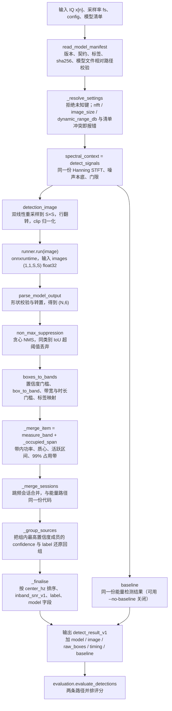
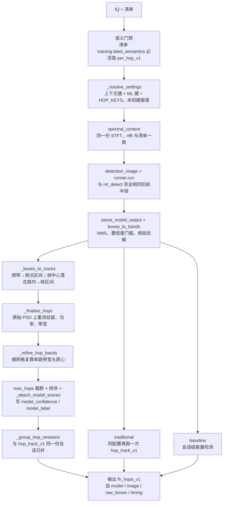

# 信号检测（AI 时频图检测）算法设计

| 项目 | 取值 |
| --- | --- |
| 算法标识 | 会话级 `ml_detect:<模型 id>`；逐跳 `ml_detect_hops:<模型 id>`（§7） |
| 结果契约 | 会话级 `detect_result_v1`（**与传统能量检测完全同一份契约**）；逐跳 `fh_hops_v1`（**与 `hop_track_v1` 同一份契约**） |
| 信噪比口径 | `inband_snr_v1`（由能量测量给出，不由网络给出；两条通路同口径） |
| 输入契约 | `tf_image_v1` |
| 图像排布 | `time_frequency_grayscale_v1` |
| 输出契约 | `normalized_boxes_v1` |
| 模型标签语义 | `session_v1`（一段传输一个框，默认）或 `per_hop_v1`（一跳一个框，§7） |
| 实现位置 | `src/signal_analysis/ml/detector.py`、`tensor.py`、`decode.py`、`manifest.py`、`runtime.py` |
| 训练/验收 | `training/build_dataset.py`、`train_yolox.py`、`tiny_detector.py`、`verify_onnx.py`（**不随 wheel 分发**） |
| 第三方框架接入 | `training/detectors/`（适配器）+ `training/export_contract.py`（统一命令行）；详见 `training/README.md` §9 / §10 |
| 调用入口 | CLI `signal-analysis ml-detect`（会话级）/ `ml-detect-hops`（逐跳）；GUI「信号检测 → AI 检测」与「跳频参数 → AI 估计逐跳参数」 |
| 文档日期 | 2026-09-11（§5 第 5 条、§6.3 与 §7 的逐跳通路内容为 2026-09-13 补入） |

> 本文档只描述**已实现**的代码路径。仓库内没有真实的 YOLOX / RT-DETR 权重，
> 训练侧提供的是自研最小无锚框检测头（`tiny`）作为**契约验收基线**；
> 精度模型的接入框架已经落地（`training/detectors/` + `training/export_contract.py`，
> 适配 `tiny` / `yolox` / `rtdetr` / `ultralytics` 四个框架），框架选型与许可证约束见 §6.1。
> 传统路径侧的会话级算法见[信号检测_传统能量检测](信号检测_传统能量检测.md)，
> 逐跳参数估计见[信号检测_跳频逐跳参数估计](信号检测_跳频逐跳参数估计.md)
> （两者均使用本文档同源的能量测量与 `inband_snr_v1` 口径）。

> **两条 AI 通路**：§1–§7 描述会话级 `ml_detect`（契约 `detect_result_v1`）；
> §7 描述 2026-09-13 落地的逐跳通路 `ml_detect_hops`（契约 `fh_hops_v1`）。
> 二者共用同一份时频图、同一套清单校验、同一个“网络只定位、物理量重测”的原则，
> 差别只在**标签语义**（一段传输一个框 vs 一跳一个框）与**后处理**（是否绕开会话合并）。
> 会话级模型清单不能被逐跳通路使用，反之亦然——清单里的 `training.label_semantics`
> 就是这个门禁（§7.4）。

---

## 1. 算法思路

核心设计原则是**"网络只做判决，辐射量仍由物理测量给出"**：

$$\underbrace{\text{有没有目标、在哪个时频块}}_{\text{ONNX 网络}}\ +\
\underbrace{\text{功率、带宽、带内信噪比}}_{\texttt{detect\_signals}\ \text{的同一份 STFT，同一口径}}$$

这样做的理由有三条：

1. **口径可比**。AI 路径的所有辐射量与能量检测路径**逐字段同源**（同一份 `psd`、同一个
   `noise_floor_db`、同一个 `inband_snr_v1` 公式），因此 §对比表里可以直接并排引用，
   而不是拿两种预处理下的分数互相比较。
2. **契约可复用**。结果仍是 `detect_result_v1`，GUI、CLI、报告、评分（`evaluate_detections`）
   一行代码都不用改。
3. **失败可解释**。网络输出为空 → 就是空；网络给出的框边界仍要落到门限/带宽/时长的硬门槛上，
   不会因为"网络说 0.9 置信度"就绕过最小带宽检查。

链路共 9 步：

1. **谱上下文**：`spectral_context()` 就是 `detect_signals()`，拿到 `spectrogram_db`、
   `frequency`、`frame_time`、`noise_floor_db`、`threshold_dbfs_per_hz` 等全部数组与摘要。
   **`nfft` 由模型清单强制**（清单里没写才用调用方传入的值）。
2. **渲染时频图**：`detection_image()` 把（帧 × 频点）的 PSD 双线性重采样到 $S\times S$ 网格，
   **行维翻转**（行 0 = 最高频，与 `imshow(origin="upper")` 一致），再按
   $\mathrm{clip}\big((\text{dB}-\text{NF})/D,0,1\big)$ 归一化成 float32 单通道图像。
   归一化以**噪声本底为基准**，因此与整段记录的绝对增益无关。
3. **推理**：`runner.run(image)` 通过 onnxruntime 跑图，输入形状 `(1,1,S,S)`、节点名 `images`。
4. **解析输出**：`parse_model_output()` 校验 `normalized_boxes_v1` 的列数与有限性，
   允许 `(N,6)` / `(1,N,6)` / `(1,6,N)` 三种形状并自动转置。
5. **NMS 与门槛**：`boxes_to_bands()` 先做贪心 NMS（按置信度降序、同类 IoU 超阈值即丢），
   再过置信度门槛，再 `box_to_band()` 反解频段/时间，再过最小带宽/最小时长门槛。
6. **频带测量**：`measure_band()` 在**同一份 STFT 谱**上量出带内功率、质心、活跃区间、
   99% 占用带；SNR 按 `inband_snr_v1` 计算。
7. **会话合并**：`_merge_sessions()` 与能量路径**同一份代码**，跳频仍是"一段会话一个实例"。
8. **置信度与标签**：合并只保留测量量，因此 `_group_sources()` 把组内最高置信度成员的
   `confidence` 与 `label` 还原回组上；`_finalise()` 排序并补齐 `label` / `model` 字段。
9. **基线对照**：默认在同一次调用里再给一遍能量检测结果（`summary["baseline"]`），
   两条路径用同一份真值与同一套会话合并口径，可并排评分。

---

## 2. 公式

### 2.1 图像栅格与双线性重采样

源网格 = STFT 的（帧时刻 × 频点），目标网格 = $S\times S$ 个**像格中心**：

$$t_j^{(\text{grid})}=\Big(j+\frac12\Big)\frac{T}{S},\qquad
f_i^{(\text{grid})}=-\frac{f_s}{2}+\Big(i+\frac12\Big)\frac{f_s}{S},\qquad j,i=0,\dots,S-1$$

**先时间、后频率**线性插值（`_interp_weights` 生成行和为 1 的权重矩阵，超出源范围的采样点
钳到最近端点）：

$$P_{\text{grid}}=\mathbf{W}_f\cdot P\cdot \mathbf{W}_t^{\!\top}$$

其中 $\mathbf{W}_f\in\mathbb{R}^{S\times M}$、$\mathbf{W}_t\in\mathbb{R}^{S\times J}$，每行和为 1。

### 2.2 行翻转与归一化

行索引 $i$ 对应频率 $f_i^{(\text{grid})}$（从 $-\frac{f_s}{2}$ 递增），翻转后**行 0 对应 $+\frac{f_s}{2}$**：

$$G_{r,c}=P_{\text{grid}}[\,S-1-r,\ c\,]$$

$$\boxed{\ \text{image}[r,c]=\mathrm{clip}\!\left(\frac{10\log_{10}G_{r,c}-\text{NF}}{D},\ 0,\ 1\right)\in[0,1]\ }$$

$$D=\texttt{dynamic\_range\_db}\in[10,120]\ \text{dB}\ (\text{默认 }60),\qquad S=\texttt{image\_size}\in\{64,\dots,2048\}\ (\text{默认 }1024)$$

图像元数据（`detection_image` 的 `meta`）：

$$\texttt{db\_floor}=\text{NF},\qquad \texttt{db\_ceiling}=\text{NF}+D$$

$$\texttt{image\_db}(\text{image})=\text{image}\cdot D+\text{NF}\quad(\text{逆变换，调试用})$$

> **三件套强绑定**：`image_size`、`spectrogram_nfft`、`dynamic_range_db` 必须与模型清单一致。
> 调用方若显式传入与之冲突的值，`_resolve_settings` **直接报错**，绝不静默改变输入
> ——否则同一个 `.onnx` 在不同参数下会得到语义不同的图像。

### 2.3 坐标契约（`normalized_boxes_v1`）

$$x_{\text{center}}=\frac{t_{\text{center}}-t_0}{T},\qquad
y_{\text{center}}=\frac{f_s/2-f_{\text{center}}}{f_s},\qquad
w=\frac{t_{\text{high}}-t_{\text{low}}}{T},\qquad
h=\frac{f_{\text{high}}-f_{\text{low}}}{f_s}$$

四列都是**边框坐标**（不是像格中心）：$x=0$ 对应 $t=0$ 的边框、$x=1$ 对应 $t=T$ 的边框，
$y$ 向下增大。第 5 列 `confidence` $\in[0,1]$，第 6 列 `class` 是清单 `labels` 的下标
（当前单类 `emitter`，恒为 0）。

反解（`box_to_band`，与 `band_to_box` **严格互逆**）：

$$t_{\text{start}}=(x_{\text{center}}-w/2)\,T+t_0,\qquad
t_{\text{end}}=(x_{\text{center}}+w/2)\,T+t_0$$

$$f_{\text{high}}=\frac{f_s}{2}-(y_{\text{center}}-h/2)f_s,\qquad
f_{\text{low}}=\frac{f_s}{2}-(y_{\text{center}}+h/2)f_s$$

### 2.4 训练侧解码（自研最小检测头）

`TinyDetector.forward` 直接输出 `(B, K, 6)`，因此导出后无需后处理：

$$\text{obj}=\sigma(z_0),\qquad
o_x,o_y = 1.5\,\sigma(z)-0.25\in(-0.25,1.25)$$

$$\text{size}_x,\text{size}_y=\mathrm{softplus}(z)\ (\ge 0)$$

取 obj 的 top-$K$ 后：

$$x_{\text{center}}=\frac{\text{col}+o_x}{W_{\text{grid}}},\qquad
y_{\text{center}}=\frac{\text{row}+o_y}{H_{\text{grid}}},\qquad
w=\frac{\text{size}_x}{W_{\text{grid}}},\qquad h=\frac{\text{size}_y}{H_{\text{grid}}}$$

主干为 `strides`（默认 4）次 stride-2 卷积 + BN + ReLU（通道数 $32,64,128,256$，上限 256），
输出头为 $3\times3$ 卷积 + $1\times1$ 卷积，通道数 $1+4+C$。
解码只用 `sigmoid / softplus / topk / gather / stack / clamp`——**全部是 ONNX 可导出算子**。

### 2.5 NMS、门槛与标签

IoU（中心式框）：

$$\text{IoU}(A,B)=\frac{\min(x_A^+ ,x_B^+)-\max(x_A^-,x_B^-)\ \text{的截断长度}
\cdot\min(y_A^+,y_B^+)-\max(y_A^-,y_B^-)\ \text{的截断长度}}{S_A+S_B-S_{\text{overlap}}}$$

贪心 NMS：按 `confidence` 降序遍历，与前序保留框**同类且 IoU > `iou_threshold`** 则丢弃。

$$\text{保留判据}:\quad c\ge \texttt{score\_threshold},\quad B\ge\texttt{min\_bandwidth\_hz},
\quad T_{\text{end}}-T_{\text{start}}\ge\texttt{min\_duration\_s}$$

标签：$\texttt{label}=\texttt{labels}[\ \text{round}(\text{class})\ ]$，索引用 `np.clip` 夹到合法范围。

### 2.6 频带测量与带内信噪比（与能量路径逐字段同源）

在 NMS 后的候选频段上取频点（半格向外扩张）：

$$k\in\mathcal{K}=\{k:\ \lvert f[k]-f_c\rvert\le B/2+\Delta f/2\}$$

$$P_{\text{frame}}(j)=\Big(\sum_{k\in\mathcal{K}}P(k,j)\Big)\Delta f,\qquad
P_{\text{band}}=\frac{1}{\lvert\mathcal{J}\rvert}\sum_{j\in\mathcal{J}}P_{\text{frame}}(j)$$

$\mathcal{J}$ 为落在候选时间范围内的帧（为空则取最近一帧）。

$$\boxed{\ \text{SNR}=10\log_{10}\frac{\max(P_{\text{band}}-N_0B,\ 10^{-30})}{N_0B}\ \ \text{，
下界 }-20\ \text{dB}\ },\qquad N_0=10^{\text{NF}/10}$$

活跃帧与区间（间隔按帧距的一半展开）：

$$\text{active}(j)=\big[\,P_{\text{frame}}(j)>N_0 B\,10^{\Delta_{\text{dB}}/10}\,\big],\qquad
\Delta_{\text{frame}}=\frac{T}{2J}$$

$$I_j=\Big[\max\big(t_j-\Delta_{\text{frame}},0\big),\ \min\big(t_j+\Delta_{\text{frame}},T\big)\Big]$$

质心与 99% 占用带与能量路径完全同一份实现（`_occupied_span`、功率加权质心）。

### 2.7 置信度

$$\text{confidence}=\mathrm{clip}\big(c_{\text{net}},\,0,\,1\big)$$

即**直接用网络的置信度**（保留 4 位小数），**不**再用 SNR 反算。这是 AI 路径与能量路径在
同名字段上的唯一语义差异，结果里同时给出二者（能量路径的置信度在 `baseline` 里），
**禁止拿两个 `confidence` 直接比大小**。

---

## 3. 流程图



---

## 4. 输入与输出参数

### 4.1 函数签名

```python
ml_detect(samples, sample_rate, config=None, model=None, runner=None,
          threads=None, with_baseline=True) -> (summary: dict, arrays: dict)
```

| 参数 | 说明 |
| --- | --- |
| `samples` / `sample_rate` | 同能量检测（一维 IQ + 采样率） |
| `config` | 见 §4.2；未知键报错 |
| `model` | `None` 时必须给 `runner`；也可传 ONNX 清单路径或清单 dict |
| `runner` | 推理会话对象（测试可注入假会话，无需 onnxruntime） |
| `threads` | onnxruntime 计算线程数 |
| `with_baseline` | 是否附带能量检测基线（默认 `True`，CLI 用 `--no-baseline` 关闭） |

### 4.2 配置项（`summary.config` 回显）

| 键 | 类型 | 范围 | 默认 | 来源 |
| --- | --- | --- | --- | --- |
| `nfft` | int | 16 – 4096 | 清单 `spectrogram_nfft` | 上下文（与清单冲突即报错） |
| `threshold_db` | float | 0 – 80 | 3.0 | 上下文（同时用于能量基线） |
| `band_threshold_db` | float | $\le$ `threshold_db` | $\max(1,0.5\Delta)$ | 上下文 |
| `min_bandwidth_hz` | float | $\ge0$ | 0 | 上下文（**AI 路径默认不设**，由网络定位） |
| `min_duration_s` | float | $\ge0$ | 0 | 上下文 |
| `max_detections` | int | 1 – 256 | 32 | 上下文 |
| `merge_bins` | int | 0 – $\lfloor M/4\rfloor$ | 按 `nfft` 推导 | 上下文 |
| `score_threshold` | float | 0 – 0.999 | 0.25 | ML（网络置信度门槛） |
| `iou_threshold` | float | 0 – 1 | 0.5 | ML（NMS 阈值） |
| `dynamic_range_db` | float | 10 – 120 | 清单值（60） | ML（与清单冲突即报错） |
| `image_size` | int | 64 – 4096 且 2 的幂；清单限 $\{64,\dots,2048\}$ | 清单值（1024） | ML（与清单冲突即报错） |
| `threads` | int | $\ge1$ | `None` | ML（onnxruntime 线程数） |
| `image_contract` | str | `tf_image_v1` | 清单值 | ML |

> `max_detections` 在内部先按 $4\times$ 放大给 NMS 后候选（下限 64），会话合并完成后再截断到
> 用户设定值——避免"网络给出很多候选、合并前就被截断"导致漏警。

### 4.3 模型清单（`read_model_manifest` 的强校验）

| 字段 | 必填 | 约束 |
| --- | --- | --- |
| `schema_version` | ✔ | 必须等于 1 |
| `contract` | ✔ | 必须等于 `tf_image_v1` |
| `runtime` | ✔ | 必须等于 `onnxruntime` |
| `runtime_min_version` | ✖ | 默认 `1.17`；运行时版本更低则拒绝 |
| `id` / `version` | ✔ | 非空文本，`version` 长度 $\le40$ |
| `sha256` | ✔ | 与 `library` 实际摘要**必须一致**，否则报"摘要与清单不符" |
| `library` | ✔ | **清单目录内的相对路径**；绝对路径、越出目录、文件缺失或为空均报错；$\le64$ KiB 清单 |
| `opset` | ✖ | 默认 0 |
| `input.name` | ✖ | 默认 `images`（导出图的实际输入节点名必须一致，由 `verify_onnx.py` 校验） |
| `input.image_size` | ✖ | 必须属于 $\{64,128,256,512,1024,2048\}$ |
| `input.channels` | ✖ | 必须为 1 |
| `input.spectrogram_nfft` | ✖ | 16 – 4096，默认 512 |
| `input.dynamic_range_db` | ✖ | 10 – 120，默认 60 |
| `input.layout` | ✖ | 必须等于 `time_frequency_grayscale_v1` |
| `output.name` | ✖ | 默认 `detections` |
| `output.layout` | ✖ | 必须等于 `normalized_boxes_v1` |
| `labels` | ✖ | 非空字符串列表，单项 $\le100$ 字符；默认 `["emitter"]` |
| `training` | ✖ | 对象（框架、许可证、数据集说明） |
| `notes` | ✖ | 字符串 |

`write_model_manifest()` 在写文件后**立刻重新读一遍自校验**，并补一个 `generated` 段
（Python 版本 / 平台 / 机器 / 位数），避免"写出一个自己都读不回来的清单"。

### 4.4 输出 `summary`

与能量检测相同的字段（`contract` / `snr_definition` / `frequency_reference` /
`sample_rate_hz` / `sample_count` / `duration_s` / `nfft` / `hop_samples` / `frame_count` /
`config` / `freq_resolution_hz` / `noise_floor_dbfs_per_hz` / `threshold_dbfs_per_hz` /
`detections`，字段含义见[传统能量检测 §5.3](信号检测_传统能量检测.md)），并追加：

| 字段 | 内容 |
| --- | --- |
| `algorithm` | `"ml_detect:<模型 id>"` |
| `model` | `{id, version, manifest_path, sha256, library, labels, training, runtime_version}` |
| `image` | `{layout, size, db_floor, db_ceiling}` |
| `raw_boxes` | `{output_shape, rows, candidates, score_threshold}`——模型原始输出行数、NMS 后候选数 |
| `timing` | `{context_ms, inference_ms, total_ms}` |
| `baseline` | `{algorithm, threshold_dbfs_per_hz, detections}`（`with_baseline=False` 时缺失） |

`detections[i]` 与能量路径字段完全相同，**追加两列**：

| 新增字段 | 说明 |
| --- | --- |
| `label` | 类别名（来自清单 `labels`） |
| `model` | 模型 id（便于报告里注明"这一行不是能量检测出来的"） |
| `method` | 恒为 `"ml"`（能量路径为 `"energy"`） |

### 4.5 输出 `arrays`

在能量检测的全部数组（`frequency`、`frame_time`、`spectrogram_db`、`spectrum_db`、
`threshold_db`、`noise_floor_db` …）之上追加：

| 键 | 形状 | 说明 |
| --- | --- | --- |
| `detection_boxes` | `(K,4)` | AI 目标框 `[f_low,f_high,t_start,t_end]` |
| `detection_id` / `detection_snr_db` / `detection_power_dbfs` | `(K,)` | 逐目标 id / SNR / 功率 |
| `model_boxes` | `(N,4)` | NMS 与门槛后的候选框（**未合并会话**） |
| `model_scores` / `model_labels` | `(N,)` | 候选置信度与类别名 |
| `baseline_detection_boxes` | `(M,4)` | 能量基线框（GUI 用灰色虚线叠加） |
| `image_size` | `(2,)` | 时频图像素尺寸 |

GUI 叠加显示 AI 实线框 + 基线灰色虚线框，两者共用同一张 `spectrogram_db`，
"看差距"是设计目标之一。

### 4.6 与能量路径的对照接口

| 对象 | 能量路径 | AI 路径 |
| --- | --- | --- |
| `method` | `"energy"` | `"ml"` |
| 判决来源 | 门限 + 形态学 | ONNX 网络 |
| `power_dbfs` / `snr_db` / `bandwidth_hz` | 实测 | **实测（同一份 STFT、同一公式）** |
| `confidence` | $\mathrm{clip}((\text{SNR}+5)/25,0,1)$ | 网络置信度 |
| 评分 | `evaluate_detections(truth, detections)` | 同一个函数 |

---

## 5. 设计局限

1. **仓库内没有真实精度模型。**
   `training/tiny_detector.py` 是自研最小无锚框检测头，其定位是**契约验收基线**：
   证明"训练 → ONNX 导出 → 推理解码 → 评分"整条链路可跑通，而**不是**一个可用精度的检测器。
   要有精度必须接入第三方检测框架并自行训练——接入通道已经建好
   （`training/export_contract.py`，见 §6.1 与 `training/README.md` §9），
   但**权重与训练数据仍需自行准备**；三个第三方框架（YOLOX / RT-DETR / Ultralytics）
   在本机均未安装，其数值路径是用合成 ONNX/torch 伪模型验证的。

2. **判决在网络上、辐射量在物理上——这既是优点也是边界。**
   网络给出"哪个时频块有目标"，但 `power_dbfs` / `snr_db` / `bandwidth_hz` 仍由门限法测量。
   因此：网络的框**不能**突破最小带宽/时长门槛；网络"看到了但门槛没过"的目标会被丢掉。
   该行为是有意设计的，但意味着**AI 路径的虚警/漏警仍受 `min_bandwidth_hz` 等传统参数影响**。

3. **无 onnxruntime 即不可用。**
   `onnxruntime`（额外依赖 `.[ml]`）未安装时：GUI 控件自动禁用并提示安装方式、CLI
   返回明确错误码（退出码 2），**不会回退到演示结果**。传统检测路径完全不受影响。

4. **训练数据全部是合成数据。**
   仓库内所有链路验证都基于本项目生成器（理想信道、白噪声、无多径、无频偏、无 IQ 不平衡、
   无相位噪声）。**没有真实采集数据、没有 SDR 实测**。模型对真实信道的泛化能力**未经验证**。

5. **标签语义有两种：默认的会话级，以及逐跳可选。**
   默认 `label_semantics = session_v1`（`build_dataset.py --labels session`）：一个信号一个框，
   跳频信号按“一段会话一个实例”定义，`t_start_s=0`、`t_end_s=duration`，于是 `width = 1.0`，
   网络实际主要学习**频率维定位**。需要同一会话内的多段突发定位（跳频逐跳参数），
   必须换用 `--labels hop`（`per_hop_v1`）：跳频会话的框改由 `evaluation.hop_truth` 生成，
   **一跳一个框**，其它波形仍给会话框；该语义写进 `dataset.json.contract.label_semantics`
   与模型清单的 `training.label_semantics`，供推理侧选通路（§7.4）。
   换成 `per_hop_v1` 后**必须同时解决量化约束**：训练输出网格的步长是 $2^{\text{strides}}$ 像素
   （`--strides 4`、$S=1024$ 时即 16 px），而一跳在图上往往只有十几像素，
   比一格还小的标签会在逐格编码（`encode_targets`）时被**静默丢弃**——训练照跑、指标照出，
   但对不上真值。因此 `train_yolox.py` 在开训前用 `dataset.json.statistics.labels` 的像素尺度做硬守卫：
   最小标签边小于网格步长就拒绝开训，并给出可用的 `--strides` 或要求提高 `--image-size`；
   每个样本的框数超过 `--max-boxes` 也拒绝（逐跳数据集默认 32 太小，实测需 128）。详见 §7.2。

6. **单类、单信噪比量纲、无旋转框。**
   当前 `labels` 只有 `emitter`（`class` 恒 0）；框是轴对齐的（`x/y/w/h`），
   对倾斜的时频脊（如扫频、chirp）只能用外接矩形近似，带宽与时长都会被高估。
   训练图像的动态范围是**全局**的（以 NF 为基准），同一张图里强弱目标共存的对比度受限。

7. **图像三件套与清单强绑定，灵活性受限。**
   `image_size` / `spectrogram_nfft` / `dynamic_range_db` 必须与清单一致，
   不能在下游"顺手改一改"；这是刻意的防错设计，但要让同一个 `.onnx` 支持多分辨率就得
   导出多个模型 + 多份清单。

8. **NaN / Inf 与 JSON 安全性靠硬约束保证。**
   结果必须能通过 `json.dumps(..., allow_nan=False)`；所有测量量都有显式地板
   （SNR 下界 $-20$ dB、功率钳到 $10^{-30}$），缺定义写 `null`，**不写 0 伪装成功**。

9. **置信度未标定，且与能量路径不同名不同义。**
   网络输出未做温度标定或保序回归，`score_threshold = 0.25` 只是工程默认值，
   **没有 ROC 支撑**；而能量路径的 `confidence` 是 SNR 的映射。两者同名不可比
   （文献 [27] 是这个问题的一般性证据）。

10. **验收脚本覆盖的是契约，不是精度。**
    `verify_onnx.py` 检查清单自洽、运行时版本、**图上真实输入输出形状与节点名**、
    确定性场景端到端、可复现性、以及与参考模型的数值一致性（最大绝对偏差）。
    它**不**给出"这个模型够不够用"的结论。

11. **训练侧脚本不随 wheel 分发。**
    `training/` 不在打包范围内（`[tool.setuptools.packages.find] where = ["src"]`），
    因此**用户机器上无法重新训练**；模型必须由交付方可信环境预先产出并随清单一起交付。

---

## 6. 可以改进的地方与相关文献

### 6.1 接入真实精度模型（最高优先级）

接入框架已实现，入口是 `training/export_contract.py`，它把"框架产物 → 契约图 + 清单"
这条胶水固化下来，只做两件事：**补输入预处理、补输出几何转换**，权重一个字节都不动。

```bash
# 先看有哪些框架、什么许可证；再看输出布局表决定 --layout
.venv/bin/python training/export_contract.py --list-frameworks
.venv/bin/python training/export_contract.py --list-layouts
```

两条路径：

1. `--dataset-only`：先导出框架原生数据集（YOLO / COCO 格式）对齐标注口径，
   **不需要安装任何第三方框架**；标签一律由 `record["boxes"]`（即 `band_to_box`）生成，
   **绝不另写一份 y 坐标公式**（否则框整体上下翻转）；
2. `--onnx`（主路径）：用框架自己的 trainer / exporter 产出 ONNX，再交给改写器
   烘入输入预处理、做几何转换 + 按置信度 TopK 截断到 `--max-boxes`，并生成模型清单。

**框架选型**（`training/README.md` §9.2 的适配器清单是权威表格）：

| 优先级 | 框架 | 许可证 | 理由 |
| --- | --- | --- | --- |
| **首选** | RT-DETR（lyuwenyu / PaddleDetection） | Apache-2.0 | 无 NMS、原生 `(1,300,6)` 端到端输出，与本契约几乎 1:1 |
| 备选 | YOLOX | Apache-2.0 | 生态成熟、`--decode_in_inference` 直出解码结果 |
| 仅内网基线 | Ultralytics YOLO11 / YOLO26 | **AGPL-3.0** | 传染性许可证，**不得进发行包**。若确要用，选 **YOLO26** 而非 YOLO11——`nms=False` 的端到端头直接给 `(1,300,6)`，省掉 NMS，且去掉 DFL 后 CPU 端 ONNX 推理显著更快 |

注意 YOLO26 端到端头候选框固定 300，`--max-boxes` 必须不超过 300（当前契约默认 32）。

**输入预处理不要凭印象写**（本项目落框架时真踩过这个坑）：三家上游的实际做法是
Ultralytics 只做 `.div_(255)`（**无** ImageNet 均值方差）、YOLOX 连 `/255` 都不做
（pad 114 + 等比 resize + HWC→CHW，仍是 `0–255` 的 BGR），而 RT-DETR 在
`rtdetr_paddle` / `rtdetr_pytorch` / `rtdetrv2_pytorch` 三个实现之间口径互不相同，
因此 RT-DETR 适配器**不给默认值**：缺 `--input-scale` 直接报错并打印分支表。
各框架的具体取值见 `training/README.md` §9.2，回归用例把它钉在
`tests/analysis/test_detector_adapters.py`。

契约面要求（框架无关）：opset 不低于 17、batch 等于 1、单输出 `detections`，
归一化 cxcywh 六列；多输出（如 RT-DETR 的 boxes / scores / labels）需在框架导出脚本里
先拼成单输出；框架自带的预处理由适配器声明、**烘进导出图第一层**，
Python 侧始终只喂 `[0,1]` 单通道时频图；最后用 `write_model_manifest` 生成清单、
`verify_onnx.py --reference` 做数值一致性回归。AGPL 框架的适配器带硬门禁：
不显式加 `--allow-copyleft` 一律拒绝，清单里写 `distributable: false`。

文献：[11] YOLOX、[12] RT-DETR、[7–10] YOLO/FCOS 系列、[15] CIoU、[16] Focal Loss。

### 6.2 数据规模与分布

- 参考量级：跑通链路 200–500 条；**要得到有意义的模型建议 2 万–10 万条**，且每种调制样式 /
  跳频样式、每个带内信噪比档位都要有足够样本（`build_dataset.py --count --snr-range --modes`）；
- **纯噪声场景占 12%**（`--noise-only-ratio`）用于压制虚警，这个比例本身也值得做消融；
- **提高多样性的低成本手段**：把 TorchSig（MIT）生成的场景经 `build_torchsig.py` 写成
  `torchsig_bundle_v1`，再用 `ingest_torchsig.py` 转成本项目的 `tf_image_v1` 检测数据集——
  时频图、STFT 点数、归一化与框式都与本项目推理端同一份代码，因此可以直接混训；
  bundle 与其生成物只落本地目录、不随产品分发（只允许会话级标签，逐跳标签会直接拒绝）。
- **领域自适应**：用少量真实采集数据做微调/校准
  —— Ganin, Y. et al. *Domain-adversarial training of neural networks.* JMLR **17**(59):1–35, 2016；
  Sun, B., Saenko, K. *Deep CORAL: correlation alignment for deep domain adaptation.* ECCV Workshops, 2016.
- **少样本/自监督**：Snell, J., Swersky, K., Zemel, R. *Prototypical networks for few-shot learning.* NeurIPS, 2017；
  Chen, T. et al. *A simple framework for contrastive learning of visual representations (SimCLR).* ICML, 2020；
  无线电领域的自监督预训练（如基于时频图掩码重建）可显著降低标注需求。

### 6.3 任务建模的升级

| 现状 | 可改进 | 文献 |
| --- | --- | --- |
| 轴对齐矩形框 | **旋转/倾斜框**（时频脊有斜率）→ OBB 检测、极坐标框 | Ding, J. et al. *Learning RoI transformer for oriented object detection.* CVPR, 2019；Yang, X. et al. *DOTA.* CVPR, 2018 |
| 单帧时频图独立判决 | 引入**时序上下文**：多帧/多分辨率金字塔 + 时序注意力；或 3D 卷积沿时间维 | [9] FPN；Wang, X. et al. *Non-local neural networks.* CVPR, 2018；Qiu, Z. et al. *Learning spatio-temporal representation with pseudo-3D residual networks.* ICCV, 2017 |
| 检测与识别分离 | **端到端联合**：一个网络同时输出频段 + 调制标签（多任务头） | [5] O'Shea 2018；Carion 2020 [13] |
| 单类 `emitter` | 扩展 `labels` 做**信号类别 / 平台类型**检测 | [11][12] |
| 单个框 = 一条链路 | **框 → 跳（已落地）**：`ml_detect_hops` 让网络直接出逐跳框，再把框合成轨道、由 `_finalise_hops` 在原始 PSD 上重测驻留/带宽/功率/SNR，输出 `fh_hops_v1`（§7）；训练侧用 `build_dataset.py --labels hop` 出逐跳标签 | [11][12]；见[信号检测_跳频逐跳参数估计](信号检测_跳频逐跳参数估计.md) 与本文 §7 |
| 单录音、单用户 | **联邦学习**，多站数据不出本地 | McMahan, B. et al. *Communication-efficient learning of deep networks from decentralized data.* AISTATS, 2017 |

### 6.4 物理约束与可解释性

- **物理引导损失**：把带宽一致性、时长一致性、功率非负性作为正则项加入训练损失
  —— Raissi, M., Perdikaris, P., Karniadakis, G. E. *Physics-informed neural networks.* J. Comput. Phys. **378**:686–707, 2019；
- **注意力可视化**：Grad-CAM 类方法定位"网络到底看的是哪块时频区域"
  —— Selvaraju, R. R. et al. *Grad-CAM: visual explanations from deep networks via gradient-based localization.* ICCV, 2017；
- **可解释模型对照**：把能量检测基线永远保留在同一张结果里（已实现），
  任何 AI 判决都能被物理量复核。

### 6.5 部署与性能

- **量化**：INT8 量化后体积与延迟显著下降（Jacob 2018 [21]）；量化引入的数值漂移必须用
  `verify_onnx.py --reference` 卡住；
- **多分辨率 / 动态形状**：`image_size` 与清单强绑定，若要弹性可导出多份模型，
  或改用全卷积 + 自适应池化以支持动态输入；
- **流水线耗时**：`summary["timing"]` 已分别给出 `context_ms`（STFT + 能量测量）与
  `inference_ms`。当 `context_ms` 占大头时，应优化 STFT（跳数精简、多锥度替代方案、
  或用 FFT 库的多线程），而不是去优化网络。

### 6.6 评测与验收

- 建立**固定验证集 + 分档指标**（按带内 SNR 分桶、按调制样式分桶、按目标数分桶），
  避免用单一总分掩盖薄弱环节；
- 指标口径对齐文献 [25][26]（AP/AR 与小目标处理的口径差异是常见踩坑点）；
- 置信度**必须标定后才谈阈值**（文献 [27]），否则 `score_threshold` 只是经验值；
- 引入**真实采集数据**做独立验证集，与合成数据结果**分列报告**，不混在一起给结论。

**已落地的验收工具**：`benchmarks/ai_detect_sweep.py` 把上面四条里可自动化的部分做成可复现扫描：
固定模型与数据集，按标称 SNR 网格 × 多种子生成场景，给出 **per-SNR 召回**、
**固定虚警率下的检测率**（纯噪声记录固定条数作虚警分母，默认按**每帧**挑工作点并同时报出**每秒**口径，
`--far-targets` 指定目标虚警率，`--far-basis` 切换口径）、工作点阈值与推理延迟；
输出契约 `ai_detect_sweep_v1`。它不依赖第三方检测框架（`onnxruntime` + 本项目生成器即可）。
每次运行还会把**候选框一致性自检**写进报告的 `candidate_selfcheck`
（`shipped` / `replayed` / `mismatch_records`：评测侧重放候选框的数量是否与推理侧一致、
有多少条记录对不上），用于发现"评测代码与部署代码悄悄漂移"——这是扫出来的数字能不能被信的
前提（本仓库实测为 `mismatch_records: 0`）。
注意：它只回答"这个模型在这批合成场景上的指标"，**不能替代实采验证**（第四条）。

---

## 7. 逐跳参数估计通路（`ml_detect_hops`）

> 本节描述 2026-09-13 落地的第二条 AI 通路。它与 §1–§7 的会话级 `ml_detect` **并列**：
> 共用 `spectral_context`（同一份 STFT）、同一套清单校验、同一个原则
> “网络只回答‘一跳在时频图的哪一块’，辐射量仍由物理测量给出”；
> 差别只在**标签语义**（一跳一个框）与**后处理**（绕开会话合并，改走逐跳测量）。
> 输出契约 `fh_hops_v1` 与 `hop_track_v1` 完全相同，因此 GUI「跳频参数」页、
> HTML 报告与逐跳评分器（`evaluation.hop_truth` + `evaluate_detections(contract=...)`）
> 一行代码都不用改即可同时渲染两条通路的结果。

### 7.1 为什么“只训练”不够

把 `ml_detect` 的清单换成一个逐跳模型并不能得到逐跳参数，必须同时补上四步：

| # | 步骤 | 落地位置 | 缺了会怎样 |
| --- | --- | --- | --- |
| 1 | **逐跳标签**：跳频会话改用 `evaluation.hop_truth` 出“一跳一个框”，非跳频波形仍给会话框 | `training/build_dataset.py --labels hop` | 框的宽度恒为整帧（`width = 1.0`），网络只能学频维定位 |
| 2 | **语义声明**：数据集与模型清单都写清标签粒度 | `dataset.json.contract.label_semantics`、清单 `training.label_semantics` | 下游无法判断该用哪条通路，会话级模型会被当成逐跳模型用 |
| 3 | **逐跳后处理**：框 → 轨道 → 物理量重测 → 会话归并（**必须绕开会话合并**） | `ml/detector.py::ml_detect_hops` | `_merge_sessions` 会把同一发射机的多跳并成一条，8 跳报成 1 跳 |
| 4 | **逐跳评分**：真值、指标、报告按“跳”而不是“条链路”计算 | `evaluation.hop_truth`、`evaluate_detections(contract="fh_hops_v1")` | 拿会话级真值评逐跳结果，精确率虚高（真值 1 条、检出 N 条） |

四步缺一都会得到“能跑、但数字对不上”的结果，这也是这条通路必须做成**独立 action**
（`ml_detect_hops` / CLI `ml-detect-hops`）而不是 `ml_detect` 一个开关的原因。

### 7.2 标签语义与量化约束

标签语义由 `build_dataset.py --labels {session,hop}` 选择，默认 `session`（向后兼容，
旧数据集没有该字段时同样按 `session_v1` 处理）：

| 语义 | 框的定义 | 适合 |
| --- | --- | --- |
| `session_v1` | 一个信号一个框；跳频信号的时间维恒为 `[0, duration]` | 会话级检测 `ml_detect` |
| `per_hop_v1` | 跳频会话里**每一跳一个框**（`hop_truth`），非跳频信号仍按会话出框 | 逐跳估计 `ml_detect_hops` |

逐跳标签比会话标签**小一两个数量级**（典型是“几毫秒 × 一跳带宽”），因此量化约束是
这条路线的核心工程风险。训练输出网格的步长是

$$\text{cell} = \frac{S}{S / 2^{\text{strides}}} = 2^{\text{strides}}\ \text{像素}$$

即 `--strides 4`、$S=1024$ 时步长 16 px；而 `encode_targets` **每个真值框只写进框心所在的那一格，
同格多框时只留面积最大的一个**——比一格还小的标签会被成片丢弃。`train_yolox.py::_grid_guard`
因此在开训前用 `dataset.json.statistics.labels` 的像素尺度硬拦：

- 最小标签边 $<\text{cell}$ → 直接报错，按 $\lfloor\log_2(\text{最小标签像素})\rfloor$ 给出
  可用的 `--strides`，或（当最小标签不足 1 px 时）要求提高 `--image-size` 后重建数据集；
- 单样本最多标签数 $>$ `--max-boxes` → 报错并提示逐跳数据集建议 `≥ 128`
  （默认 32 对跳频场景不够）。

实测（2026-09-13，`--min-bandwidth-ratio` 见下）：$S=1024$ 时一跳高度约 $9.8$ px，
`--strides 2`（cell = 4 px）通过、`--strides 4`（cell = 16 px）被拒。
另一个易踩的点是**单跳带宽相对于总带宽**：数据集里跳频总带宽取
`--min/max-bandwidth-ratio × 采样率`（默认 0.02～0.12），跳频点数量在 $2\sim 8$ 之间随机，
单跳带宽 `hop_bandwidth = 总带宽 / (跳频点数量 + 1)`；默认比例会让最窄的一跳只有 2 px 左右——
实测需要 `--min-bandwidth-ratio 0.06` 才能得到 9.8 px 的标签，否则守卫即使
`--strides 2` 也会拒绝。

### 7.3 推理：从框到跳

`ml_detect_hops(samples, sample_rate, config=None, model=None, runner=None,
threads=None, with_sessions=True, with_traditional=True)` 的链路：



三个关键点：

1. **模型只提供几何量**。`_boxes_to_tracks` 把每个候选框转成 `_finalise_hops` 需要的
   `runs`（频点区间，由 `band_bins` 反解）与 `first_frame` / `last_frame`
   （帧中心落在框内，至少保留一帧）；**驻留时间、功率、单跳带宽、带内信噪比**
   随后都由 `_finalise_hops` / `_refine_hop_bands` 在**原始 PSD** 上重新测量，
   与 `hop_track_v1` 逐字段同源。因此 AI 逐跳与传统逐跳的物理量**可以直接并排比大小**。
2. **不经过会话合并**。`_merge_sessions`（`ml_detect` 的最后一步）会把同一发射机的多跳
   并成一个实例，那是会话级契约该有的行为；逐跳结果改走 `_group_hop_sessions`。
3. **模型分数单独成列**。逐跳明细在 `fh_hops_v1` 的固定字段之外**多两个键**：
   `model_confidence`（网络给出的“这一跳存在吗”，由 `_attach_model_scores` 按
   “帧重叠最多→频带中心最近”把跳标回候选框）与 `model_label`；
   传统通路没有这两个键，界面与报告按“不适用”显示（报告里连列都不出现）。
   **禁止**把它与 `confidence`（由带内 SNR 换算的量测置信度）混为一谈。

### 7.4 清单语义门禁

`ml_detect_hops` 只接受 `label_semantics = per_hop_v1` 的清单，否则在**推理之前**直接报错：

```text
模型清单的标签语义是 session_v1（一段传输一个框），不能用于逐跳估计（本通路要求 per_hop_v1）；
请用 training/build_dataset.py --labels hop 重建数据集并重训，或改用 ml-detect（会话级检测）
```

门禁的理由与 §7.1 第 3 行一致：会话级模型在逐跳后处理下会给出“一跳 = 整段传输”的
**看似合理但完全错**的数字，宁可拒绝也不静默降级。清单字段由
`write_model_manifest(..., label_semantics=...)` 写入，`ml-manifest` 命令行用
`--label-semantics {session_v1,per_hop_v1}` 指定，`read_model_manifest` 只接受这两个取值
（缺字段按 `session_v1`）。

### 7.5 配置、输出与调用入口

**配置项**（`summary.config` 回显；除 `nfft` 外全部为逐跳键，未知键直接报错）：

| 键 | 默认 | 说明 |
| --- | --- | --- |
| `nfft` | 清单值 | 与产出 PSD 的 STFT 网格强一致，传别的值会让带宽/驻留换算整体错位 |
| `threshold_db` | 6.0 | 逐帧检测门限（相对本底），用于驻留时间的门限穿越重测 |
| `score_threshold` | 0.25 | 网络置信度门槛 |
| `iou_threshold` | 0.5 | NMS 阈值（**归一化图像空间与物理 (f,t) 空间的 IoU 等价**——映射是仿射的，因此不需要再做一次物理坐标 NMS） |
| `smooth_frames` | 4 | 显示用功率谱的时间平滑帧数（测量仍在未平滑帧功率上做） |
| `min_bandwidth_hz` | 3 个频点 | 最小单跳带宽 |
| `min_dwell_s` | 4 帧 | 最小驻留（可分辨性下限与默认值推导见[信号检测_跳频逐跳参数估计](信号检测_跳频逐跳参数估计.md) §3.9、§5.2） |
| `merge_bins` / `max_gap_frames` / `max_gap_bins` | 按 `nfft` 推导 / 1 / `merge_bins` | 频域闭运算半径与丢帧粘合门限 |
| `max_hops` | 256 | 最大跳数；同时用于候选解码上限（`max(64, min(512, max_hops))`），避免“一跳一个框”的模型在解码阶段被截断 |

**输出**：`summary` 与 `detect_hops` 的 `fh_hops_v1` **键集逐位对齐**
（`contract` / `algorithm` / `snr_definition` / `frequency_reference` / 全部 STFT 描述量 /
`resolvable` / `reason` / `transition_frames` / `config` / `hops` / `sessions`），
只在上面追加：

| 字段 | 内容 |
| --- | --- |
| `algorithm` | `"ml_detect_hops:<模型 id>"` |
| `model` / `image` / `raw_boxes` / `timing` | 与 `ml_detect` 同名同义（`raw_boxes` 含候选数） |
| `baseline` | 会话级能量检测（`with_sessions=False` 时缺失） |
| `traditional` | **同配置的传统逐跳基线**（`with_traditional=False` 时缺失） |

`hops[i]` 在 `fh_hops_v1` 固定字段之上追加 `model_confidence` / `model_label`。
`arrays` 是 `detect_hops` 数组的超集，追加 `spectrogram_raw_db`（未平滑）、
`model_boxes` / `model_scores` / `model_labels`（NMS 后候选框）与 `image_size`。
`transition_frames` 在 AI 通路的语义是**被多于一个跳覆盖的帧数**（等价于传统通路的
“多游程帧”，即跳变帧的计数），保证两条通路的读数可比。

**调用入口**：CLI `signal-analysis [--workspace 目录] ml-detect-hops <asset_id> <清单.json>`
（`--workspace` 是**全局**选项，必须在子命令之前；清单是**位置参数**），
GUI 在「跳频参数」页的 AI 行（「AI 估计逐跳参数」，可勾选「附带传统逐跳基线」）。
服务层在 `summary["hops"]` 之外附加 `truth` / `metrics` / `baseline_metrics` / `traditional_metrics`
四个口径——**AI 逐跳、传统逐跳、会话级**三套指标互不混用，报告里并排给出。

### 7.6 实测与边界

2026-09-13 的小规模真实训练（`--count 24 --labels hop` → `--limit 16 --epochs 1`，
56326 参数的 `tiny` 检测头，`--strides 2 --max-boxes 128`）：

- `verify_onnx.py`：10/10 通过（含“标签语义：`per_hop_v1`”与逐跳评分分支）；
- 真实资产（10 跳的 FH 图传录音）：AI 逐跳 `matched 3 / missed 7 / false_alarm 0`（F1 0.46），
  同资产的**传统逐跳** `10/10`（F1 1.0）、会话基线 `1/1`（F1 1.0）；
- HTML 报告三列并排表头 `['指标','AI 逐跳口径','传统逐跳口径','会话口径（能量检测基线）']`，
  逐跳明细末列「模型置信度」只在 AI 通路出现。

**诚实性声明**：16 个样本、1 个 epoch **只证明通路打通**，不构成任何精度结论；
要得到可用模型需要去掉 `--limit`、把 `--count` 提上去（§6.2 的量级）并训练到收敛。
边界条件同样适用于本条通路：训练数据全部是合成数据（§5 第 4 条）、
标签为单类轴对齐框（§5 第 6 条）、网络置信度未标定（§5 第 9 条）；
此外逐跳通路还继承了 `hop_track_v1` 的可分辨性下限（驻留 ≥ 4 帧，
见[信号检测_跳频逐跳参数估计](信号检测_跳频逐跳参数估计.md) §3.9）——
`resolvable=false` 与 `reason` 字段在 AI 通路里同样如实输出。

---

## 8. 当前相关参考文献

**时频表示与信号图像化**

1. Boashash, B. (ed.) *Time-Frequency Signal Analysis and Processing: A Comprehensive Reference.* 2nd ed., Academic Press, 2016.
2. Cohen, L. *Time-Frequency Analysis.* Prentice Hall, 1995.
3. Welch, P. D. *The use of fast Fourier transform for the estimation of power spectra.* IEEE Trans. Audio Electroacoust. **15**(2):70–73, 1967.
4. O'Shea, T. J., Corgan, J., Clancy, T. C. *Convolutional radio modulation recognition networks.* EANN, 2016. —— 把 IQ/时频表示直接交给 CNN 的开创性工作。
5. O'Shea, T. J., Roy, T., Clancy, T. C. *Over-the-air deep learning based radio signal classification.* IEEE J. Sel. Topics Signal Process. **12**(1):168–179, 2018. —— 空口实测数据与深度模型的结合（RadioML 系列）。
6. West, N. E., O'Shea, T. J. *Deep architectures for modulation recognition.* IEEE DySPAN, 2017.

**目标检测网络**

7. Redmon, J., Divvala, S., Girshick, R., Farhadi, A. *You Only Look Once: unified, real-time object detection.* CVPR, 2016.
8. Redmon, J., Farhadi, A. *YOLOv3: an incremental improvement.* arXiv:1804.02767, 2018.
9. Lin, T.-Y. et al. *Feature pyramid networks for object detection.* CVPR, 2017.
10. Tian, Z., Shen, C., Chen, H., He, T. *FCOS: fully convolutional one-stage object detection.* ICCV, 2019. —— 无锚框（anchor-free）思路。
11. Ge, Z., Liu, S., Wang, F., Li, Z., Sun, J. *YOLOX: exceeding YOLO series in 2021.* arXiv:2107.08430, 2021. —— **Apache-2.0**，本项目推荐接入的精度方案。
12. Zhao, Y. et al. *DETRs beat YOLOs on real-time object detection (RT-DETR).* CVPR, 2024. —— **Apache-2.0** 的实时 DETR 方案，本项目首选。
    —— 同段落可对照 Ultralytics **YOLO26**：其 `nms=False` 端到端头直接输出 `(1,300,6)`、无需 NMS，且去掉 DFL 后 CPU 端 ONNX 推理更快；但 YOLO11 / YOLO26 都是 **AGPL-3.0**，只能作内网基线，不得进发行包（见 `training/README.md` §10）。
13. Carion, N. et al. *End-to-end object detection with transformers.* ECCV, 2020.
14. Liu, Z. et al. *Swin Transformer: hierarchical vision transformer using shifted windows.* ICCV, 2021.
15. Zheng, Z. et al. *Distance-IoU loss: faster and better learning for bounding box regression.* AAAI, 2020. —— 回归损失与 IoU 变体。
16. Lin, T.-Y. et al. *Focal loss for dense object detection.* ICCV, 2017. —— 类别/正负样本不平衡。

**频谱图上的目标检测（更贴近本问题）**

17. Zhou, Z. et al. *Object detection in spectrogram based on deep learning.* 相关期刊/会议工作，用于说明"时频图当图像检测"这一范式的可用性（同类工作众多，接入时建议按具体网络取舍）。
18. Zhang, Y. et al. *Radio signal detection in spectrograms with deep neural networks.* —— 同类频谱图检测工作。

**推理运行时与部署**

19. ONNX Runtime documentation, Microsoft, 2024. —— 会话配置、线程数、算子集兼容性。
20. ONNX Specification / Operator Set, Linux Foundation, 2024.
21. Jacob, B. et al. *Quantization and training of neural networks for efficient integer-arithmetic-only inference.* CVPR, 2018. —— 量化部署基础。

**数据与许可证**

22. GNU Radio Foundation et al. *SigMF: Signal Metadata Format Specification v1.2.0*, 2023.
23. TorchSig, *MIT License* 数据集生成库。**本项目已把它作为可选数据源接入**：`training/build_torchsig.py` 生成 `torchsig_bundle_v1`，再由 `training/ingest_torchsig.py` / `training/build_iq_dataset.py` 消费；生成物只落本地，不随产品分发（见 §6.2、`training/README.md` §8）。
24. DeepSig Inc. *RadioML 2018.01A*, **CC BY-NC-SA 4.0** —— **不可商用、不可随产品分发**，
    本项目**未使用**，列出仅为合规说明。

**训练与评测方法**

25. Lin, T.-Y. et al. *Microsoft COCO: common objects in context.* ECCV, 2014. —— AP/AR 评测口径的来源。
26. Padilla, R., Netto, S. L., da Silva, E. A. B. *A survey on performance metrics for object-detection algorithms.* IWSSIP, 2020. —— 检测指标的坑与口径澄清。
27. Guo, C. et al. *On calibration of modern neural networks.* ICML, 2017. —— "网络置信度不是概率"的经典证据。
