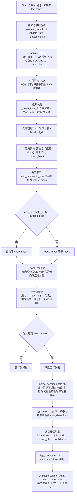

# 信号检测（传统能量检测）算法设计

| 项目 | 取值 |
| --- | --- |
| 算法标识 | `energy_detect_v1`（结果里的 `summary.algorithm`） |
| 结果契约 | `detect_result_v1`（冻结，GUI / CLI / 报告三处共用） |
| 信噪比口径 | `inband_snr_v1`（与 IQ 生成、数据集、教学口径一致） |
| 实现位置 | `src/signal_analysis/_numeric.py::detect_signals`（唯一被 Cython 编译的模块） |
| 服务与评分 | `src/signal_analysis/services.py`、`src/signal_analysis/evaluation.py` |
| 调用入口 | CLI `signal-analysis detect`；GUI「信号检测」页 |
| 文档日期 | 2026-09-11 |

> 本文档描述**已实现**的算法，公式与常量逐条对应源码，不写"计划中"的能力。
> 同一份时频图之上的 AI 判决路径见 [信号检测_AI时频图检测](信号检测_AI时频图检测.md)，
> 两者的结果契约相同，可在同一张对比表里并排评分。

---

## 1. 适用范围与定位

能量检测是"不知道调制样式、不知道符号速率、只知道有一路 IQ"时的默认（也是唯一无先验）手段。
它的任务不是识别信号，而是回答三个问题：**有没有目标、在哪个频段、什么时候出现**，并顺带给出
可复核的辐射量（功率、带宽、带内信噪比）。

| 适合 | 不适合（应改用别的路径） |
| --- | --- |
| 单/多载波窄带信号共存、频段分离良好 | 极低信噪比、信号完全埋在白噪声里 |
| 恒包络与调幅信号的粗定位、带宽量测 | 需要符号速率、调制样式、编码参数等调制域结论 |
| 作为 AI 检测的基线，用于对比与回归 | 同频同时重叠的多信号分辨（能量上无法分开） |
| 跳频信号按"一段会话一个实例"合并统计 | 需要逐跳、逐突发的精细时间定位 |
| 无 GPU、无 onnxruntime 的纯 Python 环境 | 非平稳/突发极短（短于一个 STFT 帧）的信号 |

---

## 2. 算法思路

整条链路围绕"**用同一张时频图先估计噪声底，再用相对门限切出频段**"展开，共 8 步：

1. **短时傅里叶变换（STFT）**：对 IQ 序列加 Hanning 窗分帧、做 FFT，得到二维功率谱密度
   $P(k,m)$（帧 × 频点），标定为"占用单位带宽的功率"（per Hz），因此**在频点上求和即得该频
   段功率**，不需要额外的窗增益修正系数。
2. **时间平均**：对帧维取平均得到 $\bar{P}(k)$。这是检测与量测的统一依据（同时保留
   中位数 PSD 作为对照曲线，用于发现"平均掩盖掉的突发"）。
3. **噪声本底估计**：对 $\bar{P}(k)$ 取中位数作为初值，用 MAD 估标准差，**迭代 4 轮做 σ 裁剪**
   ——只保留"看似噪声"的频点，剔除已被信号占据的频点，避免本底被信号抬起来。
4. **自适应门限**：$\text{Thr} = \text{NF} + \Delta$，即本底之上固定 dB 数（默认 3 dB）。
   因为门限是**相对本底**的，整段记录的绝对增益不影响判决，测得的 SNR 也不随增益漂移。
5. **二值掩膜 + 形态学闭运算**：对 $\bar{P}(k) > \text{Thr}$ 得到掩膜，再做半径 `merge_bins`
   的一维闭运算（先膨胀再腐蚀），**填补频段内部的凹口**；随后丢弃宽度小于
   `min_bandwidth_bins` 的碎片（抗毛刺虚警）。
6. **频段聚合（双门限）**：检出用高门限，量带宽用低门限。把每个高门限频段归到"包含它的那个
   低门限连通分量"里，**同一个辐射源内部有凹口时不会被拆成两个目标**。
7. **逐频段量测**：功率加权质心（中心频率）、频点边界外扩半格（占用带宽）、带内功率、
   按帧的带内功率（时间支撑）、99% 功率占用带（可追溯性辅助量）。
8. **会话合并**：把时间相邻、频率相邻的子带按"一段会话一个实例"合并（跳频信号的关键一步），
   最后排序、截断，逐目标计算辐射量与置信度。

---

## 3. 公式

### 3.1 STFT 与功率谱密度标定

序列 $x[n]$（complex64，长度 $N$），采样率 $f_s$，零填充到至少 `nfft` 点后：

$$w[n]=\mathrm{hanning}(M),\qquad M=\texttt{nfft}$$

帧移

$$\texttt{hop}=\max\!\Big(\Big\lfloor \frac{M}{2}\Big\rfloor,\ \Big\lceil \frac{\max(0,\ N_{\text{pad}}-M)}{511}\Big\rceil\Big)$$

即"默认 50% 重叠，但**总帧数不超过 512**"（长记录时自动拉伸帧距，保证内存与结果体积可控）。
第 $j$ 帧的谱为

$$X_j[k]=\mathrm{fftshift}\Big(\mathrm{DFT}\big\{x[j\cdot\texttt{hop}+n]\,w[n]\big\}\Big),\qquad
k=0,\dots,M-1$$

$$\boxed{\ P(k,j)=\frac{\lvert X_j[k]\rvert^{2}}{f_s\sum_{n}w^2[n]}\ }\qquad\text{[单位：单位}^2/\text{Hz]}$$

频点坐标

$$f[k]=\mathrm{fftshift}\Big(\mathrm{fftfreq}(M,\,1/f_s)\Big),\qquad \Delta f=\frac{f_s}{M}$$

> 复信号的 PSD 是**双边**谱，只出现 $[-f_s/2,+f_s/2)$ 一次，**绝不乘以 2**。
> 该标定与频谱页、实时播放页共用同一个 `_stft_psd`，因此三处曲线可直接叠加比较。

**频段功率**（后续所有功率量的定义基础）：

$$P_{\text{band}}=\sum_{k=k_1}^{k_2}\bar P(k)\cdot\frac{f_s}{M}=\sum_{k=k_1}^{k_2}\bar P(k)\cdot\Delta f$$

时间平均与中位数对照：

$$\bar P(k)=\frac{1}{J}\sum_{j=1}^{J}P(k,j),\qquad P_{\text{med}}(k)=\mathrm{median}_j\,P(k,j)$$

### 3.2 噪声本底（中位数 + MAD 迭代 σ 裁剪）

设 $v_k = 10\log_{10}\bar P(k)$（dB/Hz）。迭代 $r=1,\dots,4$：

$$c^{(r)}=\mathrm{median}\big(\mathcal{K}^{(r-1)}\big),\qquad
\sigma^{(r)}=1.4826\cdot\mathrm{median}\Big(\big\lvert v-c^{(r)}\big\rvert\Big)$$

$$\text{window}^{(r)}=\max\big(3\sigma^{(r)},\ \Delta_{\text{dB}}\big),\qquad
\mathcal{K}^{(r)}=\big\{\,v_k\ \big|\ v_k\le c^{(r)}+\text{window}^{(r)}\,\big\}$$

若 $\lvert\mathcal{K}^{(r)}\rvert < 4$ 则停止并沿用上一轮结果。最终

$$\text{NF}=\mathrm{median}\big(\mathcal{K}^{(\text{final})}\big)\quad\text{[dB/Hz]}$$

* $1.4826 = 1/\Phi^{-1}(0.75)$ 使 MAD 在正态假设下**无偏估计标准差**；用中位数与 MAD 而非
  均值/标准差，是为了让已占据频点（少数但功率极高）不把本底抬起来。
* 裁剪窗下限取 $\Delta_{\text{dB}}$（= `threshold_db`），保证至少按门限尺度收敛。
* $\Delta_{\text{dB}}$ 越大，本底越"贴身"（越接近纯噪声中位数）；越小越容易被残留信号抬高。

### 3.3 检测门限

$$\boxed{\ \text{Thr}=\text{NF}+\Delta_{\text{dB}}\ }\qquad(\Delta_{\text{dB}}=\texttt{threshold\_db}\in[0,80],\ \text{默认 }3)$$

$$\text{NF}_{\text{lin}}=10^{\text{NF}/10}\quad\text{（线性噪声功率谱密度 }N_0\text{，单位}^2/\text{Hz）}$$

### 3.4 二值掩膜与形态学闭运算

$$b_k=\big[\,v_k>\text{Thr}\,\big]$$

$$b^{\text{closed}} = \big(\,\overline{(\overline{b}\oplus R)\oplus R}\,\big)\ \text{的等价实现：}\ \text{close}(b,R)=\text{erode}\big(\text{dilate}(b,R),R\big)$$

代码用"膨胀 → 补集膨胀 → 取补"实现一维闭运算，$R=$ `merge_bins`：

$$R=\texttt{merge\_bins}\in\big[0,\ \lfloor M/4\rfloor\big],\qquad
R_{\text{default}}=\max\big(2,\ \lfloor M/128\rfloor\big)$$

随后只保留长度满足下式的连续段（`_true_runs` 给出闭区间 $(k_1,k_2)$）：

$$k_2-k_1+1\ \ge\ B_{\min}=\max\Big(1,\ \Big\lceil \frac{B_{\text{min,hz}}}{\Delta f}\Big\rceil\Big)$$

$$B_{\text{min,hz}}=\texttt{min\_bandwidth\_hz},\qquad B_{\text{min,hz}}^{\text{default}}=3\,\Delta f$$

### 3.5 频段聚合：高门限检出、低门限量带宽

$$\Delta_{\text{band}}=\begin{cases}\texttt{band\_threshold\_db}, & \texttt{band\_threshold\_db}>0\\[2pt]
\max\big(1.0,\ 0.5\,\Delta_{\text{dB}}\big), & \text{默认}\end{cases}$$

约束 $\Delta_{\text{band}}\le\Delta_{\text{dB}}$，否则报错（低门限不能高于检出用门限）。

* 高门限掩膜 $\to$ `detect_mask`（决定"这一段算不算有信号"）；
* 低门限掩膜 $\to$ `edge_mask`（决定"带宽量到哪里"）；
* `_band_regions` 把每个高门限连续段分配到**包含它的低门限连通分量**，输出三元组
  $(k_1,k_2,\text{inner})$：$(k_1,k_2)$ 是低门限边界（量带宽用），`inner` 是高门限子段集合
  （`bin_count`、`sub_bands=1` 用）。
* 若 $\Delta_{\text{band}} = \Delta_{\text{dB}}$（用户显式设成相等），则 `edge_mask = mask`，
  退化为单门限模式。

### 3.6 逐频段量测

功率加权质心（用于显示"能量的实际中心"，与几何中心 $c$ 区分）：

$$\hat f_c=\frac{\sum_{k=k_1}^{k_2} \tilde P(k)\,f[k]}{\sum_{k=k_1}^{k_2}\tilde P(k)},\qquad
\tilde P(k)=\begin{cases}\bar P(k), & k\in\texttt{detect\_mask}\\ 0, & \text{否则}\end{cases}$$

边界与带宽（**频点是格心，边界外扩半格**）：

$$f_{\text{low}}=f[k_1]-\frac{\Delta f}{2},\qquad f_{\text{high}}=f[k_2]+\frac{\Delta f}{2},\qquad
B=f_{\text{high}}-f_{\text{low}}$$

$$c=\frac{f_{\text{low}}+f_{\text{high}}}{2}\quad(\text{结果里的 }\texttt{center\_hz})$$

带内功率（**低门限边界内全部频点求和**，含凹口内的噪声）：

$$P_{\text{band}}=\Big(\sum_{k=k_1}^{k_2}\bar P(k)\Big)\cdot\Delta f$$

**时间支撑**（按帧的带内功率与"同带宽白噪声参考功率"比较）：

$$P_{\text{frame}}(j)=\Big(\sum_{k=k_1}^{k_2}P(k,j)\Big)\cdot\Delta f$$

$$\text{active}(j)=\Big[\,P_{\text{frame}}(j)\ >\ N_0\cdot B\cdot 10^{\Delta_{\text{dB}}/10}\,\Big]$$

* 判据右端就是"同带宽内、按检出余量抬高的噪声功率"，等价于"该帧带内 SNR 大于
  $\Delta_{\text{dB}}$"；比固定绝对门限更稳健。
* 若一帧都不满足，则退化为"全部帧活跃"（避免把真实存在的目标整段丢掉）。
* 帧时间戳用**帧中心**：$t_j^{\text{start}}=\text{clip}\big(j\cdot\texttt{hop}/f_s,\,0,\,T\big)$、
  $t_j^{\text{end}}=\text{clip}\big((j\cdot\texttt{hop}+M)/f_s,\,0,\,T\big)$；最终
  $t_{\text{start}}=t_{j_1}^{\text{start}}$、$t_{\text{end}}=t_{j_2}^{\text{end}}$。

$$T_{\text{active}}=t_{\text{end}}-t_{\text{start}}\ \ge\ \texttt{min\_duration\_s}\quad(\text{否则丢弃})$$

**99% 功率占用带**（`_OCCUPIED_RATIO = 0.99`，对齐 ITU-R 的"占用带宽"语义）：
在低门限段内对 $\bar P(k)$ 做累计分布，取包含 99% 功率的最短区间
$[k_a,k_b]$，输出

$$\texttt{occupied\_f\_low}=f[k_a]-\frac{\Delta f}{2},\qquad
\texttt{occupied\_f\_high}=f[k_b]+\frac{\Delta f}{2}$$

> 这两列**只用于追溯与对照**，`bandwidth_hz` **始终**由 $f_{\text{high}}-f_{\text{low}}$ 给出。
> 目的是让报告里同时存在"门限法带宽"与"功率法带宽"，便于发现 AM 这类"能量带 ≠ 消息带宽"的
> 情况（见 §7）。

### 3.7 会话合并（跳频"一段会话一个实例"）

对候选集合迭代做 $O(n^2)$ 两两合并，直到不再变化。两个候选 $A,B$（按带宽排序，$B_w \le A_w$）：

$$\text{gap}=\max\big(f^{A}_{\text{low}}-f^{B}_{\text{high}},\ f^{B}_{\text{low}}-f^{A}_{\text{high}}\big)$$

$$\text{overlap}=O(A,B)\quad(\text{两个"活跃区间列表"的时间交叠总长})$$

判据（`_SESSION_GAP_RATIO = 3.0`，`_SESSION_OVERLAP_RATIO = 0.2`）：

$$\text{可合并}\iff \text{gap}\le 3.0\cdot\max(B_w^A,B_w^B)\quad\text{且}\quad
\text{overlap}\le 0.2\cdot\min\big(T^{A}_{\text{active}},T^{B}_{\text{active}}\big)$$

* 第一条：频率相邻到"能塞得下"的地步才合并（跳频信道间隔通常就是几倍带宽）；
* 第二条：时间上**不能显著重叠**——否则两条并行存在的独立信号会被错误地合成一条。
* 合并后功率相加、质心按功率加权、边界取 $\min/\max$、活跃区间列表拼接，`sub_bands += 1`。

合并完成后按 `center_hz` 排序，按 $P_{\text{band}}$ 从大到小**截断**到 `max_detections`。

### 3.8 辐射量：带内信噪比（`inband_snr_v1`）

"带内信噪比"按技术方案冻结为一个明确口径：**信号带内噪声按同带宽白噪声
$N_0\cdot B$ 折算**，不引入噪声功率谱的额外积分长度：

$$N_0=\text{NF}_{\text{lin}}=10^{\text{NF}/10}\ \ [\text{单位}^2/\text{Hz}]$$

$$P_{\text{noise}}=N_0\cdot B,\qquad
P_{\text{sig}}=\max\big(P_{\text{band}}-P_{\text{noise}},\ 10^{-30}\big)$$

$$\boxed{\ \text{SNR}=10\log_{10}\frac{P_{\text{sig}}}{P_{\text{noise}}}
=\max\Big(10\log_{10}\frac{P_{\text{band}}-N_0B}{N_0B},\ -20\Big)\ \ \text{[dB]}\ }$$

$$P_{\text{dBFS}}=10\log_{10}\big(\max(P_{\text{band}},10^{-30})\big)\quad(\text{字段 }\texttt{power\_dbfs})$$

* 下界 $-20$ dB（`_SNR_FLOOR_DB`）是**显式地板**：结果里不出现 $-\infty$、不出现
  `inf/nan`，缺定义时写 `null`。
* 该口径与生成器真值里的 `snr_inband_db`、AMC 的 `snr_estimate_db`、评测里的
  `snr_mae_db` **完全同源**，因此三条链路的数字可以互换比较。

### 3.9 置信度

$$\boxed{\ \text{confidence}=\mathrm{clip}\Big(\frac{\text{SNR}+5}{25},\ 0,\ 1\Big)\ }$$

即 $-5$ dB 映射到 0、$+20$ dB 映射到 1。**它只是把 SNR 单调压到 $[0,1]$ 的展示量，不是
概率**，与 AI 路径的网络置信度语义不同，两者**不可直接比大小**（对比表里分列显示）。

### 3.10 输出取整

| 字段族 | 取整 |
| --- | --- |
| 频率类（`center_hz`、`bandwidth_hz`、`f_low_hz` …） | 3 位小数（mHz） |
| 时间类（`t_start_s`、`t_end_s`） | 6 位小数（µs） |
| `snr_db`、`power_dbfs` | 3 位小数 dB |

---

## 4. 流程图



---

## 5. 输入与输出参数

### 5.1 函数签名

```python
detect_signals(samples, sample_rate, config=None) -> (summary: dict, arrays: dict)
```

| 参数 | 类型 | 约束 |
| --- | --- | --- |
| `samples` | 一维实/复数值数组 | 非空、长度 $\le$ `MAX_SAMPLES = 16_000_000`、无 NaN/Inf，内部转 complex128 |
| `sample_rate` | float | 有限正数（Hz） |
| `config` | dict 或 `None` | 只接受下表中的键，**出现未知键直接报错**（防止拼写错误被静默忽略） |

### 5.2 配置项（`summary.config` 原样回显，便于复核）

| 键 | 类型 | 合法范围 | 默认 | 含义 |
| --- | --- | --- | --- | --- |
| `nfft` | int | 16 – 4096 | 512 | STFT 点数，决定 $\Delta f=f_s/M$ |
| `threshold_db` | float | 0 – 80 | 3.0 | 检出余量 $\Delta_{\text{dB}}$ |
| `band_threshold_db` | float | $\le$ `threshold_db` | $\max(1.0,0.5\Delta_{\text{dB}})$ | 带宽量测门限 |
| `min_bandwidth_hz` | float | $\ge 0$ | $3\Delta f$ | 最小占用带宽 |
| `min_duration_s` | float | $\ge 0$ | 0.0 | 最小持续时间（硬门槛，不是建议值） |
| `max_detections` | int | 1 – 256 | 32 | 最多保留目标数 |
| `merge_bins` | int | 0 – $\lfloor M/4\rfloor$ | $\max(2,\lfloor M/128\rfloor)$ | 形态学闭运算半径（频点） |

### 5.3 输出 `summary`（`detect_result_v1`）

**顶层字段**

| 字段 | 类型 | 说明 |
| --- | --- | --- |
| `contract` | str | 恒为 `"detect_result_v1"` |
| `algorithm` | str | 恒为 `"energy_detect_v1"` |
| `snr_definition` | str | 恒为 `"inband_snr_v1"` |
| `frequency_reference` | str | `"baseband_offset"`：中心频率是**基带偏移**，不是射频载频 |
| `sample_rate_hz` / `sample_count` / `duration_s` | float/int/float | 输入摘要 |
| `nfft` / `hop_samples` / `frame_count` | int | STFT 结构（帧数 $\le 512$） |
| `config` | dict | §5.2 的有效配置回显 |
| `freq_resolution_hz` | float | $\Delta f$ |
| `noise_floor_dbfs_per_hz` | float | 噪声本底 NF（dB/Hz，3 位小数） |
| `threshold_dbfs_per_hz` | float | 门限 Thr（dB/Hz，3 位小数） |
| `detections` | list | 目标列表，见下 |

**`detections[i]` 字段**

| 字段 | 类型 | 说明 |
| --- | --- | --- |
| `id` | int | 从 1 开始，按 `center_hz` 升序编号 |
| `method` | str | `"energy"`（AI 路径为 `"ml"`） |
| `center_hz` | float | 几何中心 $(f_{\text{low}}+f_{\text{high}})/2$ |
| `centroid_hz` | float | 功率加权质心（AM 等非对称谱与中心频率不同） |
| `bandwidth_hz` | float | 门限法占用带宽 |
| `f_low_hz` / `f_high_hz` | float | 占用带边界 |
| `t_start_s` / `t_end_s` | float | 活跃时间范围 |
| `power_dbfs` | float | 带内总功率（dB，`frequency_reference=baseband_offset`） |
| `snr_db` | float | `inband_snr_v1` 口径，地板 $-20$ |
| `session_id` | int 或 `null` | 跳频会话编号；非跳频为 `null` |
| `confidence` | float | $\mathrm{clip}((\text{SNR}+5)/25,0,1)$，**非概率** |
| `hopping` | bool | 是否由多个子带合并而来 |
| `sub_bands` | int | 合并的子带数（非跳频为 1） |
| `bin_count` | int | 高门限子段占用的频点数 |
| `occupied_f_low_hz` / `occupied_f_high_hz` | float | 99% 功率占用带（追溯用） |

**示例**

```json
{
  "contract": "detect_result_v1",
  "algorithm": "energy_detect_v1",
  "snr_definition": "inband_snr_v1",
  "frequency_reference": "baseband_offset",
  "nfft": 512, "hop_samples": 256, "frame_count": 78,
  "freq_resolution_hz": 1953.125,
  "noise_floor_dbfs_per_hz": -86.412,
  "threshold_dbfs_per_hz": -83.412,
  "detections": [
    {"id": 1, "method": "energy", "center_hz": 40000.0, "centroid_hz": 39812.5,
     "bandwidth_hz": 29347.83, "f_low_hz": 25326.09, "f_high_hz": 54673.91,
     "t_start_s": 0.0, "t_end_s": 0.5, "power_dbfs": -18.234, "snr_db": 12.481,
     "session_id": null, "confidence": 0.699, "hopping": false, "sub_bands": 1,
     "bin_count": 15, "occupied_f_low_hz": 25488.28, "occupied_f_high_hz": 54511.72}
  ]
}
```

### 5.4 输出 `arrays`（绘图与追溯用）

| 键 | 形状 / 类型 | 说明 |
| --- | --- | --- |
| `frequency` | `(nfft,)` float64 | 已 fftshift 的双边频率轴 |
| `frame_time` | `(J,)` float64 | 帧中心时刻 $=(j\cdot\texttt{hop}+(M-1)/2)/f_s$ |
| `spectrogram_db` | `(J, nfft)` float32 | 时频图（dB/Hz） |
| `spectrum_db` | `(nfft,)` float64 | 时间平均 PSD（检测依据） |
| `spectrum_median_db` | `(nfft,)` float64 | 中位数 PSD（对照） |
| `threshold_db` | `(1,)` float64 | 门限 Thr（绝对值，dB/Hz） |
| `noise_floor_db` | `(1,)` float64 | 噪声本底 NF |
| `detection_boxes` | `(K, 4)` float64 | `[f_low, f_high, t_start, t_end]`，供时频图叠框 |

### 5.5 与真值评分接口（`evaluation.py`）

| 函数 | 输入 | 输出 |
| --- | --- | --- |
| `signal_truth(generation_summary)` | IQ 生成器摘要的 `signals[]` | 真值带列表（含 `snr_inband_db`、`session_id`、`visited_channels`） |
| `match_detections(truth, detections, gate_ratio=0.75)` | 真值与检测结果 | 贪心一对一匹配（$\lvert\Delta c\rvert\le0.75\max(B_t,B_d)$），**故意不用 SciPy**（编译核心不引入额外依赖） |
| `evaluate_detections(...)` | 同上 | `matched / missed / false_alarm / precision / recall / f1 / center_mae_hz / center_rmse_hz / bandwidth_mape / snr_mae_db`，缺失一律 `None`，**绝不写 0 伪装成功** |

---

## 6. 当前相关参考文献

**谱估计与加窗**

1. Welch, P. D. *The use of fast Fourier transform for the estimation of power spectra: a method based on time averaging over short, modified periodograms.* IEEE Trans. Audio Electroacoust. **15**(2):70–73, 1967. —— 平均周期图法（本项目 STFT-PSD 的来源）。
2. Harris, F. J. *On the use of windows for harmonic analysis with the discrete Fourier transform.* Proc. IEEE **66**(1):51–83, 1978. —— 窗函数旁瓣/主瓣权衡与相干增益、噪声等效带宽（PSD 标定系数的依据）。
3. Nuttall, A. H. *Some windows with very good sidelobe behavior.* IEEE Trans. ASSP **29**(1):84–91, 1981.
4. Thomson, D. J. *Spectrum estimation and harmonic analysis.* Proc. IEEE **70**(9):1055–1096, 1982. —— 多锥度（multitaper）谱估计。

**能量检测与门限**

5. Urkowitz, H. *Energy detection of unknown deterministic signals.* Proc. IEEE **55**(4):523–531, 1967. —— 能量检测的经典理论基础。
6. Kay, S. M. *Fundamentals of Statistical Signal Processing, Vol. II: Detection Theory.* Prentice Hall, 1998. —— Neyman–Pearson 准则、检测门限与 ROC。
7. Finn, H. M., Johnson, R. S. *Adaptive detection mode with threshold control as a function of spatially sampled clutter-level estimates.* RCA Review **29**:414–464, 1968. —— CA-CFAR 的原始思想。
8. Rohling, H. *Radar CFAR thresholding in clutter and multiple target situations.* IEEE Trans. Aerospace Electron. Syst. **19**(4):608–621, 1983.
9. Lehtomäki, J. J., Vartiainen, J., Juntti, M., Saarnisaari, H. *CFAR strategies for channelized radiometer.* IEEE Signal Process. Lett. **12**(1):13–16, 2005. —— 把 CFAR 用到信道化能量检测。

**鲁棒统计（噪声本底估计）**

10. Hampel, F. R. *The influence curve and its role in robust estimation.* J. Amer. Statist. Assoc. **69**(346):383–393, 1974.
11. Rousseeuw, P. J., Croux, C. *Alternatives to the median absolute deviation.* J. Amer. Statist. Assoc. **88**(424):1273–1283, 1993. —— MAD 的有限样本修正与效率讨论（$1.4826$ 的语境）。
12. Huber, P. J. *Robust Statistics.* Wiley, 1981.

**形态学滤波与门限分割**

13. Maragos, P., Schafer, R. W. *Morphological filters — Part I / Part II.* IEEE Trans. ASSP **35**(8):1153–1169 / 1170–1184, 1987. —— 膨胀/腐蚀/闭运算的定义与几何解释。
14. Otsu, N. *A threshold selection method from gray-level histograms.* IEEE Trans. Syst., Man, Cybern. **9**(1):62–66, 1979. —— 直方图法自动门限（与"相对本底固定 dB"互补的另一种思路）。
15. Serra, J. *Image Analysis and Mathematical Morphology.* Academic Press, 1982.

**带宽与功率的标准化定义**

16. ITU-R Recommendation SM.443-4, *Bandwidth measurement at monitoring stations*, ITU, 2018. —— x dB 带宽与占用带宽的定义。
17. ITU-R Recommendation SM.328, *Spectra and bandwidth of emissions*, ITU. —— 必要带宽/占用带宽术语。
18. IEEE Std 1057-2017 / IEEE Std 1241-2010, *Standard for Terminology and Test Methods for Analog-to-Digital Converters*. —— dBFS 标定与量化相关问题。

**跳频与扩频信号的时间-频率处理**

19. Barbarossa, S. *Parameter estimation of spread spectrum frequency-hopping signals using time-frequency distributions.* IEEE Signal Processing Advances in Wireless Communications (SPAWC), 1997. —— 跳频参数（跳时刻/跳频点）的时频估计。
20. Boashash, B. (ed.) *Time-Frequency Signal Analysis and Processing: A Comprehensive Reference.* 2nd ed., Academic Press, 2016. —— 时频分布综述。

**信噪比定义与数据规范**

21. Proakis, J. G., Salehi, M. *Digital Communications.* 5th ed., McGraw-Hill, 2008. —— $S/N$ 与 $E_s/N_0$、带内噪声功率的口径。
22. GNU Radio Foundation et al. *SigMF: Signal Metadata Format Specification, v1.2.0*, 2023. —— 导入侧元数据规范（与本项目"不虚构射频载频"的约定一致）。

---

## 7. 设计局限

以下每一条都是**当前实现确实存在**的，不是"以后也许"的猜测。

1. **带宽与中心频率都依赖门限，而非物理模型。**
   $f_{\text{low}}/f_{\text{high}}$ 由"低门限掩膜的最外频点"决定，因此
   `band_threshold_db` 抬高 1 dB 就足以让带宽变化数个频点。仓库内实测（单载波数字信号、理想信道）
   中心频率 MAE 约 $39$ Hz、带宽 MAPE 约 $6.5\%$，但这是**理想信道下**的数字，不代表任意场景。

2. **AM（含载波双边带）的占用带宽不等于消息带宽。**
   含载波调幅在频谱上是载波峰 + 对称上下边带，能量占用带约为消息带宽的 2 倍。当前实现给出的是
   **能量占用带**并对齐其中心，**不会**去反推消息带宽，也**不把载波峰单独当作中心频率**；
   `centroid_hz` 与 `center_hz` 的差异在结果里显式保留，供人判读。这是物理事实，不是 bug，
   但如果下游直接把 `bandwidth_hz` 当"带宽参数"用就会出错。

3. **没有独立的符号速率 / 滚降系数估计。**
   门限法带宽只是"能量占据到哪里"，不是 $R_s(1+\alpha)$。缺少这一步导致上游带宽精度直接限制
   下游 AMC 的抽取比与特征稳定性。

4. **噪声被假设为带内白噪声、且全带同分布。**
   `N0` 由全带中位数给出，因此**窄带干扰、有色噪声、本底倾斜、直流/镜像杂散**都会使
   $N_0$ 偏移，进而让所有目标的 `snr_db` 同向偏。结果里没有"本底平坦度"标志来提示这一点。

5. **同一平均 PSD 里无法分离时间上不重叠的突发。**
   检测与带宽量测都基于 $\bar P(k)$。若两个信号在不同时刻占用同一频段（时分复用），
   平均后可能合并成一条记录，或把带宽量测成两者并集。中位数 PSD 曲线只做人工对照，
   未进入自动判决。

6. **帧数上限 512 带来的时间分辨率下限。**
   $\texttt{hop}\ge\lceil(N-M)/511\rceil$，长记录帧距被拉伸，`t_start_s`/`t_end_s` 的精度随记录
   长度下降；对极短突发（短于一个帧长）可能测不出或测宽。

7. **跳频会话合并是启发式判据，不是跟踪算法。**
   两个阈值（$3\times$ 带宽、$20\%$ 时间重叠）对"跳频间隔很大""多部跳频台同频段交错"等场景
   会分别偏向漏合并或错合并。结果里只有 `sub_bands` 与 `session_id`，**没有给出合并置信度**，
   也没有逐跳的跳时刻/跳频点列表。

8. **置信度不是概率。**
   $\mathrm{clip}((\text{SNR}+5)/25,0,1)$ 只是单调映射，未做标定（calibration），
   不能用于"取阈值筛目标"以外的推断，也不能与 AI 网络输出直接比大小。

9. **匹配评分用贪心、`gate_ratio` 固定 0.75。**
   `match_detections` 按"先到先得、最近优先"的贪心匹配，不使用匈牙利算法（编译核心不引入
   SciPy）。密集场景下匹配结果对遍历顺序有轻微依赖；门限倍数也不可自适应。

10. **无真实采集数据验证。**
    仓库内所有数字都来自本项目生成器（理想信道、白噪声、无多径、无频偏、无 IQ 不平衡）。
    **未在 SDR 实测或标准数据集上做过验证**，也没有在 Windows / 麒麟上验证过冻结产物。

11. **参数是硬门槛。**
    `max_detections`、`min_bandwidth_hz`、`min_duration_s` 一律按硬阈值执行，超限即丢弃，
    **不返回占位目标、不返回 0 冒充成功**；未检出时 `detections` 就是空列表。

---

## 8. 可以改进的地方与相关文献

按"投入产出比"排序，前 3 条是收益最大、与现有代码耦合最小的。

### 8.1 自适应门限：把固定 dB 余量换成 CFAR

当前 $\text{Thr}=\text{NF}+\Delta_{\text{dB}}$ 在全带使用同一个余量。可改为**滑动参考窗 CFAR**
（门限由邻域噪声估计 + 虚警率因子决定），使非平稳本底、窄带干扰共存时的虚警率恒定：

$$\text{Thr}(k)=\alpha\,Z(k),\qquad Z(k)=\frac{1}{2L}\sum_{i\in\text{参考窗}} \bar P(i)$$

- Rohling, H. *Radar CFAR thresholding in clutter and multiple target situations.* IEEE TAES **19**(4), 1983.
- Lehtomäki, J. et al. *CFAR strategies for channelized radiometer.* IEEE SPL **12**(1), 2005.
- Finn, H. M., Johnson, R. S. RCA Review **29**, 1968.

### 8.2 噪声本底：从"单次中位数"到"多锥度 + 逐帧鲁棒估计"

- 多锥度谱估计降低方差（Thomson 1982，文献 [4]）；
- 逐帧（而非仅时间平均）做最小统计量噪声跟踪，可处理本底随时间漂移；
- 对有色本底做**多项式/样条拟合后再做门限**，而不是假设常数 $N_0$；
- Boll, S. F. *Suppression of acoustic noise in speech using spectral subtraction.* IEEE Trans. ASSP **27**(2):113–120, 1979. —— 噪声估计与减法的经典做法。

### 8.3 带宽与符号速率：把"能量带"升级为"参数估计"

- **符号速率估计**：基于循环平稳性的 $\alpha$-profile 峰值搜索
  —— Gardner, W. A. *Exploitation of spectral redundancy in cyclostationary signals.* IEEE Signal Process. Mag. **8**(2):14–36, 1991；
- **滚降系数估计**：对 PSD 边沿做匹配滤波拟合（raised-cosine / RRC 模型拟合）；
- **占用带宽标准化**：严格按 ITU-R SM.443（文献 [16]）同时给出 x dB 带宽与 99% 带宽，
  并在结果里保留两者的比值作为"谱形状异常"指示。

### 8.4 多信号重叠与盲源分离

- 时频域稀疏假设下的重叠信号分离：**时频掩膜 + 聚类**
  —— Yılmaz, Ö., Rickard, S. *Blind separation of speech mixtures via time-frequency masking.* IEEE Trans. Signal Process. **52**(7):1830–1847, 2004；
- 独立分量分析（ICA）：Hyvärinen, A., Oja, E. *Independent component analysis: algorithms and applications.* Neural Networks **13**(4–5):411–430, 2000；
- **欠定**场景可引入稀疏恢复（压缩感知）：Candès, E. J., Wakin, M. B. *An introduction to compressive sampling.* IEEE Signal Process. Mag. **25**(2):21–30, 2008。

### 8.5 跳频会话：从启发式判据到显式跟踪

- 跳时刻/跳频点的时频脊线提取：Barbarossa 1997（文献 [19]）；
- 航迹起始与关联：**MHT / JPDA / 多假设跟踪**
  —— Blackman, S., Popoli, R. *Design and Analysis of Modern Tracking Systems.* Artech House, 1999；
- 在低 SNR 下"先跟踪后检测"（TBD）：Boers, Y., Driessen, J. N. *Multitarget particle filter track before detect application.* IEE Proc. Radar Sonar Navig. **151**(6):351–357, 2004。

### 8.6 检测与识别联合、端到端

把检测、参数估计、调制识别放到同一个可学习流水线里（时频图直接出"频段 + 调制标签"），
或把本文档的能量测量作为物理约束项加进网络损失（physics-informed）。对应条目见
[信号检测_AI时频图检测](信号检测_AI时频图检测.md) §8 与
[调制识别_AI特征学习](调制识别_AI特征学习.md) §8。

### 8.7 评分与工程化

- 匹配改用**匈牙利算法 / 最优传输**替代贪心（Hungarian: Kuhn, H. W. *The Hungarian method for the assignment problem.* Naval Res. Logist. Q. **2**:83–97, 1955），并把 `gate_ratio` 改为按频率分辨率与带宽自适应；
- 全量结果加"本底平坦度""谱占用比""是否触顶 `max_detections`"等**质量标志**，让下游知道
  这次的数字能不能信；
- 引入真实采集数据集（如公开的 SDR 录制）做独立验证；建议同时记录到清单里，与合成数据结果分列。
