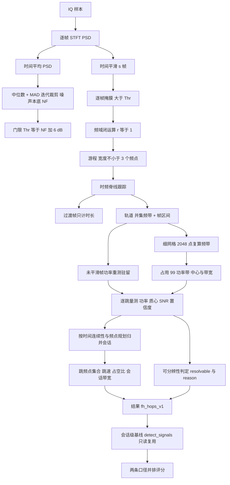

# 信号检测（跳频逐跳参数估计）算法设计

| 项目 | 取值 |
| --- | --- |
| 算法标识 | `hop_track_v1`（结果里的 `summary.algorithm`） |
| 结果契约 | `fh_hops_v1`（冻结，GUI / CLI / 报告三处共用） |
| 同一契约的 AI 通路 | `ml_detect_hops:<模型 id>`（网络定位 + 本文同一套物理量重测，2026-09-13 落地，见[信号检测_AI时频图检测](信号检测_AI时频图检测.md) §7） |
| 信噪比口径 | `inband_snr_v1`（与 IQ 生成、数据集、教学口径一致） |
| 实现位置 | `src/signal_analysis/_numeric_hops.py::detect_hops`（参与 Cython 核心编译；`_numeric.py` 保留兼容导出） |
| 服务与评分 | `src/signal_analysis/services.py`、`src/signal_analysis/evaluation.py::hop_truth` |
| 调用入口 | CLI `signal-analysis detect-hops`（传统）/ `ml-detect-hops`（AI，需 `per_hop_v1` 清单）；GUI「跳频参数」页（含「AI 估计逐跳参数」） |
| 文档日期 | 2026-09-13 |

> 本文档描述**已实现**的算法，公式与常量逐条对应源码，不写"计划中"的能力。
> 与它互补的是会话级能量检测：同一份时频图之上的会话级通路见
> [信号检测_传统能量检测](信号检测_传统能量检测.md)，两者的**带内信噪比口径相同**、
> **粒度不同**，可以在同一份报告里并排对照（`baseline_metrics`）。
>
> **同一契约还有一条 AI 通路**：`ml_detect_hops`（见[信号检测_AI时频图检测](信号检测_AI时频图检测.md) §7）
> 把"逐帧提取游程"换成"网络直接给出逐跳候选框"，但**框之后的每一段都用本文同一套代码**
> （`_finalise_hops` / `_refine_hop_bands` / `_group_hop_sessions`），输出同为 `fh_hops_v1`，
> 因此两边的物理量（驻留、功率、带宽、带内信噪比）可直接并排比大小；
> 唯一差别是 AI 通路的逐跳明细多 `model_confidence` / `model_label` 两个键（见 §5.4）。

实现分工：`_numeric_hops.py` 保存逐跳算法与可供 AI 复用的 `_hop_config`、`_finalise_hops`、`_refine_hop_bands`、`_group_hop_sessions`；谱密度和掩膜来自 `_numeric_common.py`，附加基线来自 `_numeric_energy.detect_signals`。旧 `_numeric` 与 `core_api` 入口兼容。详细模块依赖见[数值算法模块拆分与回归说明](../数值算法模块拆分与回归说明.md)。

---

## 1. 适用范围与定位

能量检测通路的产物是"一段会话一个实例"：它先对时间求平均，只能在平均 PSD 上定位频带，
因此跳频信号只留下**一条**覆盖整段跳频跨度的记录（多数情形 `hopping=true`、`sub_bands=k`；
若相邻信道的缝小于一个频点，掩膜与闭运算会把信道连成一条连续带，于是得到
`hopping=false`、`sub_bands=1`——实测资产 `3addf48f` 与 `c801d634` 就属于后者，
所以**`hopping`/`sub_bands` 都不能当跳数用**，见 [信号检测_传统能量检测](信号检测_传统能量检测.md) §5.3）。
逐跳参数估计要回答的是
另一组问题：**每一跳在哪个频点、什么时候起跳、驻留多久、跳速多少、跳频点集合是什么**。

| 适合 | 不适合（应改用别的路径） |
| --- | --- |
| 跳频（FH）电台的逐跳参数：跳频点、驻留、跳速、跳频点集合 | 单跳驻留短于 4 个 STFT 帧的极快跳频（见 §3.9、§8 第 1 条） |
| 同一频段内**同时工作**的多部跳频发射机的分离与会话归并 | 瞬时占用带宽接近信道间隔的跳频（检测掩膜互相焊接，见 §8 第 3 条） |
| 与"会话级能量检测"对照：同一份时频图上的两种粒度 | 需要符号速率、调制样式、编码参数等调制域结论 |
| 跳频信号的频谱占用统计（信道集合、跨度、占空比） | 同频同时、时间上完全重叠的非跳频多信号 |
| 无 GPU、无 onnxruntime 的纯 Python 环境 | 需要亚帧级时间定位（帧长是硬下限） |

**与会话级能力的关系**：不是替换，而是补充。会话级给出"这条链路占了哪一段频谱"，
逐跳给出"这段频谱里的每一跳具体在哪里"。两者共用同一份零填充 Hanning STFT
（`_stft_psd`）与同一个带内信噪比定义（`inband_snr_v1`），因此可以逐项对照，
但**会话级口径下的目标数与逐跳口径下的目标数本来就不同**（一条链路 vs 若干跳），
所以两种口径的精确率/召回率不会相等，报告里两张表并列给出。

**与 AI 逐跳通路的关系**：同样是`fh_hops_v1`的一等公民。本文的 `detect_hops`
在**逐帧游程 + 频点链跳**上建立判决；AI 通路让网络在时频图上直接给出"一跳一块"的框，
再做**同一套**物理量重测与会话归并（见[信号检测_AI时频图检测](信号检测_AI时频图检测.md) §7）。
两者共用同一个可分辨性下限（驻留 ≥ 4 帧，§3.9）：AI 通路把驻留也交给本文的
重测逻辑计算，所以 `resolvable` / `reason` 字段的含义与数值口径完全一致。
三个口径（AI 逐跳、传统逐跳、会话级）在报告与服务层里并排给出，互不混用。

---

## 2. 算法思路

整条链路围绕"**不做时间平均，逐帧提取频谱游程，再沿时间把游程链成跳**"展开，共 8 步：

1. **逐帧短时傅里叶变换（STFT）**：与能量检测同一份 `_stft_psd`，但**保留每一帧的
   功率谱密度** $P(k,j)$，不做时间平均——时间平均正是把相邻跳频信道焊成一条的原因。
2. **噪声本底**：仍然在**时间平均** PSD 上估计（中位数 + MAD 迭代 σ 裁剪，与能量检测
   完全同一套代码），这样两种粒度的门限都相对同一个本底，结果可直接比较。
3. **时间平滑**：单帧周期图只有约 2 个自由度，逐点起伏约 5.6 dB，直接卡门限会让噪声
   到处冒游程。先按 `smooth_frames`（默认 4）帧居中滑动平均把起伏压到约 2.8 dB。
4. **逐帧二值掩膜 + 频域闭运算**：对平滑后的 PSD 卡 $ \text{NF}+\Delta $（默认 6 dB），
   再做半径 `merge_bins`（默认 1 个频点）的闭运算填补带内凹口，丢掉窄于
   `min_bandwidth_hz`（默认 $3\Delta f$）的碎片，得到每帧的若干**游程**（游程 = 频域上连续的一段）。
5. **时频脊线跟踪**：把相邻帧的游程按**频谱重叠**链成轨道（track）。**单游程帧**是几何观测，
   允许跨一个很小的频隙续链（抗单帧衰落）；**多游程帧**是过渡帧（跳变沿或第二部发射机），
   那里只允许严格重叠续链，其余游程**新建轨道**——这样既不把相邻信道焊进来，又能同时跟踪
   两部发射机。比轨道中位宽度宽出 `transition_ratio` 倍的游程视为两跳融合产物，只计时长、
   不参与频带定义。
6. **逐跳量测**：轨道给出掩膜频带，再在**细网格上复算一次频带**（跟踪要时间分辨率、
   带宽要频率分辨率，一个网格满足不了两者）；驻留时间则在**未平滑**的帧功率上按门限
   重新量一次，去掉时间平滑带来的展宽；功率取驻留内的带内平均功率。
7. **会话归并**：把跳按时间连续性与频点规划归并成发射机会话，给出跳数、跳频点集合、
   跳速（跳起点间隔中位数的倒数）、占空比与会话级带内信噪比。
8. **诚实性出口**：`resolvable` + `reason` 明确回答"这份记录的时间分辨率够不够"。
   不够就直说，不把融合后的稀疏结果伪装成完整逐跳结果。

---

## 3. 公式

### 3.1 逐帧 PSD、噪声本底与门限

STFT 结构与能量检测完全一致（零填充到至少 `nfft` 点、Hanning 窗）：

$$\texttt{hop}=\max\!\Big(\Big\lfloor \frac{M}{2}\Big\rfloor,\ \Big\lceil \frac{\max(0,\ N_{\text{pad}}-M)}{511}\Big\rceil\Big),\qquad
P(k,j)=\frac{\lvert X_j[k]\rvert^{2}}{f_s\sum_{n}w^2[n]}\quad\text{[单位}^2/\text{Hz]}$$

$$f[k]=\mathrm{fftshift}\big(\mathrm{fftfreq}(M,\,1/f_s)\big),\qquad \Delta f=\frac{f_s}{M},\qquad M=\texttt{nfft}$$

噪声本底 $\text{NF}$ 取自时间平均 PSD（$\bar P(k)=\frac{1}{J}\sum_j P(k,j)$），做法与
[信号检测_传统能量检测](信号检测_传统能量检测.md) §3.2 逐字相同；门限

$$\boxed{\ \text{Thr}=\text{NF}+\Delta_{\text{dB}},\qquad N_0=10^{\text{NF}/10}\ }\qquad(\Delta_{\text{dB}}=\texttt{threshold\_db},\ \text{默认 }6)$$

**为什么逐跳门限默认 6 dB，而会话级默认 3 dB？** 会话级的判决对象是**时间平均** PSD，
其起伏已被数百帧平均压得很低；逐跳的判决对象是**单帧**周期图，只有 2 个自由度，$10\log_{10}$
域的逐点标准差是

$$\sigma_{\text{dB}}(J)=\frac{10}{\ln 10}\sqrt{\psi'(J)}\quad\Longrightarrow\quad
\sigma_{\text{dB}}(1)=5.57\ \text{dB},\qquad \sigma_{\text{dB}}(4)\approx 2.31\ \text{dB}\ \ (\text{工程近似 }5.6/\sqrt{s}=2.8\ \text{dB})$$

（$\psi'$ 是 trigamma 函数，$J$ 为参与平均的帧数，对应 $2J$ 个自由度。）
所以先做 $s=\texttt{smooth\_frames}$ 帧居中滑动平均（首尾边缘复制，输出仍对齐原帧号）：

$$\tilde P(k,j)=\frac{1}{s}\sum_{i=j-h}^{j+s-1-h}P(k,i),\qquad h=\Big\lfloor \frac{s}{2}\Big\rfloor$$

$s=4$ 时逐点标准差从 5.57 dB 降到约 2.3 dB。再叠加 6 dB 门限，单点虚警概率降到 $10^{-6}$
量级，才不至于在"512 频点 × 数百帧"上长出大量噪声游程。**平滑只改变方差、不改变均值**，
所以门限与噪声本底仍是同一口径的绝对值比较，不需要额外修正。

### 3.2 逐帧掩膜、频域闭运算与游程

$$m_j(k)=\mathbb 1\big[\tilde P_{\text{dB}}(k,j)>\text{Thr}\big],\qquad
\tilde m_j=\mathrm{close}\big(m_j,\ r\big),\qquad r=\texttt{merge\_bins}$$

$$\text{游程}:\quad [a,b]\ \text{满足}\ \tilde m_j[a..b]\equiv1,\ \tilde m_j[a-1]=\tilde m_j[b+1]=0,\quad b-a+1\ge B_{\min}/\Delta f$$

$$r=\max\Big(1,\Big\lfloor \frac{M}{512}\Big\rfloor\Big),\qquad
B_{\min}=\max\Big(\texttt{min\_bandwidth\_hz},\ 3\Delta f\Big)$$

* 闭运算半径**故意取小**：单帧上信道内部已经比较平坦，半径取大只会在跳变帧里把相邻信道
  焊成一条，反而掩盖真正的跳变。这就是"逐跳用 $r=1$、会话级用 $\max(2,\lfloor M/128\rfloor)$"的原因。
* $B_{\min}$ 下限为 $3\Delta f$，抑制单点毛刺。

### 3.3 时频脊线跟踪（游程 → 跳）

轨道 $T$ 由三个量描述：已接受游程的**并集频带** $[a_T,b_T]$、帧列表、最后出现的帧号
`last_frame`。记当前帧 $j$ 的游程 $[a,b]$，可续链的轨道必须满足
$j-\texttt{last\_frame}(T)-1\le \texttt{max\_gap\_frames}$（默认 1，即最多跨 1 帧丢失）。

**(a) 分数函数（单游程帧）**

$$\text{score}(T)=\begin{cases}
(0,\ -\,\text{overlap}(T)), & \text{overlap}=\min(b,b_T)-\max(a,a_T)+1>0\\[2pt]
(1,\ \ \ \text{dist}(T)), & \text{dist}=\max(a_T-b,\ a-b_T)\le \texttt{max\_gap\_bins}\ \text{且}\ T\ \text{本帧尚未被占用}\\[2pt]
\text{不可链接}, & \text{otherwise}
\end{cases}$$

**重叠优先于频隙**：只要有一条轨道真的在频域上压住了这个游程，就绝不会改去跨频隙衔接。
`max_gap_bins` 默认等于 `merge_bins`（= 1 个频点）：够跨过一次单帧衰落，又远小于典型信道
间隔（本工程 FH 图传样式实测信道间隔 ≈ 12.7 kHz ≈ 6.5 个频点），所以不会误桥接。

**(b) 多游程帧 = 过渡帧**：$\text{allow\_gap}=\text{False}$，即**只允许严格重叠**，
并且同一帧内一条轨道只能被一个游程占用（否则相邻信道的游程会被焊到同一条轨道上）。

**(c) 已归属游程的丢弃（含存活判据）**

$$\exists\,T:\ \big(j-\texttt{last\_frame}(T)-1\le \texttt{max\_gap\_frames}\big)\ \wedge\ \text{overlap}(T)>0
\;\Longrightarrow\; \text{该游程属于 } T,\ \text{不再新建轨道}$$

存活判据是必需的：**过期轨道只是历史**。若不设存活判据，则在"存在第二部同时工作的
发射机、从而每一帧都是多游程帧"的记录里，某部发射机复发同一个信道时，那条早已死亡的
轨道仍会吞掉它的游程。实测（同一场景、同一 seed，仅切换这一个判据、其余代码不变）：
远隔双机场景 **18 跳 / 召回 0.818 → 11 跳 / 召回 0.500**；
单机场景 **9 跳 / 召回 0.9 完全不变**（所以这个判据只影响"多发射机同帧"的情形）。

**(d) 宽度守卫**：单游程帧中，若游程宽度 > `transition_ratio`（默认 1.5）倍该轨道已接受游程的
**中位宽度**，则视为两跳融合产物，只把 `last_frame` 前推（计入时间支撑），**不接受为几何**。

**(e) 统计量**：多游程帧的个数记入 `summary.transition_frames`。

### 3.4 驻留时间：在未平滑帧功率上重测

轨道频带 $[a_T,b_T]$ 上的带内功率序列（**原始、未平滑** PSD，$\Delta f$ 求和即为功率）：

$$P_T(j)=\Delta f\sum_{k=a_T}^{b_T}P(k,j),\qquad
\text{active}(j)=\Big[P_T(j)>N_0\cdot B_{\text{mask}}\cdot 10^{\Delta_{\text{dB}}/10}\Big],\qquad
B_{\text{mask}}=(b_T-a_T+1)\Delta f$$

取 `active` 中与轨道帧区间**重叠最多**的那段连续游程 $[j_0,j_1]$（因此同一信道被访问两次
会得到两跳），则

$$t_{\text{start}}=\frac{\texttt{starts}[j_0]}{f_s},\qquad
t_{\text{end}}=\min\Big(\frac{\texttt{starts}[j_1]+M}{f_s},\ T\Big),\qquad
\boxed{\ \text{dwell}=t_{\text{end}}-t_{\text{start}}\ }$$

丢弃条件：帧数 $< \texttt{min\_dwell\_frames}$ 或 $\text{dwell}<\texttt{min\_dwell\_s}$。

> 为什么要重测：时间平滑（$s$ 帧）会把一跳的两端各展宽约 $h$ 帧。几何只用来定频带与
> 粗定位，驻留必须回到原始帧功率上量，否则驻留会系统性偏大。

### 3.5 单跳带宽：细网格复算 + 功率占用带

粗网格上的**掩膜频带**会被 Hann 泄漏与 OFDM/2FSK 旁瓣撑宽（实测资产 `01588926`：每侧
约 1.3～2.4 个粗频点，掩膜带 14.6～21.0 kHz 对真实占用 11.7～12.2 kHz），
所以频带要在细网格上复算一次。取

$$M'=\min\Big(2048,\ 2^{\lfloor \log_2\max(\,d_{\min}f_s/4,\ 16\,)\rfloor}\Big)\qquad(d_{\min}=\text{最短跳的驻留})$$

若 $M'\le M$ 则整趟跳过（细网格会让最短跳不足 4 帧，白做）。在细网格上取驻留时间内的帧平均
剖面 $\text{profile}(k)$（搜索范围 = 粗掩膜带**左右各外扩 2 个粗频点**，即
$\big[\text{mask}_{\text{low}}-2\Delta f,\ \text{mask}_{\text{high}}+2\Delta f\big]$），则

$$\text{mask}':\ \text{profile}(k)>N_0\cdot 10^{\Delta_{\text{dB}}/10},\qquad
p_{\text{corr}}(k)=\max\big(\text{profile}(k)-N_0,\ 0\big)\qquad(\Delta f'=f_s/M'\ \text{为细网格分辨率})$$

$$\boxed{\ [f_{\text{low}},f_{\text{high}}]=\text{在 } p_{\text{corr}}\text{ 上占用 }99\%\ \text{功率的区间，两端各外推半个细频点}\ }$$

$$\text{bandwidth}=f_{\text{high}}-f_{\text{low}},\qquad
\text{center}=\frac{f_{\text{low}}+f_{\text{high}}}{2},\qquad
B'_{\text{mask}}=\text{mask}'\ \text{的宽度}$$

$$P_{\text{hop}}=\Delta f'\sum_{k\in\text{mask}'}\text{profile}(k),\qquad
\text{centroid}=\frac{\sum_k \text{profile}(k)f_k}{\sum_k \text{profile}(k)}$$

* **带宽取"扣掉噪声后的 99% 功率占用带"，而不是检测掩膜宽度**：掩膜会被旁瓣撑宽数个频点，
  只有功率占用带才代表信号真正占用的频带。两个量都留在结果里
  （`bandwidth_hz` 与 `mask_bandwidth_hz`），可追溯。
* `center_hz` 是占用带的几何中心，`centroid_hz` 是功率加权质心；两者之差在结果里显式保留
  （非对称谱与多音信号上会明显不同）。
* `band_nfft` 记录该跳实际用的细网格点数（本工程实测：0.1 s 记录、驻留 15 ms 时取 2048）。

### 3.6 带内信噪比（`inband_snr_v1`）

$$B_{\text{occ}}=f_{\text{high}}-f_{\text{low}},\qquad
P_{\text{sig}}=\max\big(P_{\text{hop}}-N_0\,B'_{\text{mask}},\ 10^{-30}\big)$$

$$\boxed{\ \text{SNR}_{\text{dB}}=\max\Big(10\log_{10}\frac{P_{\text{sig}}}{N_0\,B_{\text{occ}}},\ -20\Big)\ }$$

即"信号功率除以它**自己占用带宽**内的噪声功率"，与会话级口径同源，只把"带宽"从会话占用带
换成单跳占用带。注意这与生成器真值的差别：真值摘要里的 `snr_inband_db` 是**按跳频点带宽**
$B_{\text{hop}}$ 算的，而本实现量的是**占用带宽**，所以两者不会逐位相等（实测 MAE 0.86 dB，
见 §7.2）。报告里同时给出逐跳口径与会话口径的误差，不做重标定。

### 3.7 会话归并

**(a) 时间连续性门限**。对已排序的跳，记会话当前结束时刻 $t^{\text{end}}$ 与驻留中位数
$d_{\text{med}}$，间隔 $\text{pause}=t_{\text{start}}-t^{\text{end}}$：

$$\text{pause}<-\texttt{overlap\_tol}\ \Rightarrow\ \text{并发（另一部发射机）},\qquad
\text{pause}>3\,d_{\text{med}}\ \Rightarrow\ \text{间隔过长},\qquad
\texttt{overlap\_tol}=1.5\,\frac{\texttt{hop}}{f_s}$$

不足两帧的重叠不予采信，因为跳变帧本身就会让相邻两跳的时间支撑各展宽一帧。

**(b) 归属打分**：候选会话按 $\big(\text{dist},\ \text{pause}\big)$ **字典序最小**取胜，其中

$$\text{dist}=\max\Big(\min_j c_j-c,\ \ c-\max_j c_j,\ 0\Big)$$

$c$ 是当前跳的中心频率、$c_j$ 是会话内已有跳的中心。**先看频距再看时间**：同一部发射机的
跳频点落在一段固定的跨度内，所以"最近的会话"是稳定判据。

**(c) 用频点规划拆分会话**。两部落在一起、时间上交错发射的发射机仍可能被归到同一组，
用它们的频点集合作证据拆分：把会话内频点按 $1\Delta f$ 聚类（同信道两次访问的中心差异
小于一个频点），得聚类中心 $d_1<\dots<d_n$，取最大间隔

$$\text{gap}_{\max}=d_{i+1}-d_i,\qquad
\text{gap}_{\max}>3\cdot\max\big(\text{median gap},\ \Delta f\big)\ \Longrightarrow\
\text{在 }\tfrac{d_i+d_{i+1}}{2}\ \text{处二分（递归）}$$

* 用**中位间隔**而不是最窄间隔作参照：单机的不规则跳频规划（某一对信道更近）不会被误拆。
* 少于 3 个不同信道时永远不拆（无间隔离群可言）。

**(d) 会话参数**

$$\text{period}=\text{median}\big(t_{\text{start}}^{(i+1)}-t_{\text{start}}^{(i)}\big),\qquad
\boxed{\ \text{hop\_rate}=\frac{1}{\text{period}}\ },\qquad
\text{duty}=\frac{d_{\text{med}}}{\text{period}}$$

$$P_{\text{sess}}=\frac{\sum_i P_{\text{hop},i}\cdot\text{dwell}_i}{T},\qquad
B_{\text{sess}}=f^{\text{sess}}_{\text{high}}-f^{\text{sess}}_{\text{low}},\qquad
\text{SNR}^{\text{sess}}_{\text{dB}}=\max\Big(10\log_{10}\frac{P_{\text{sess}}-N_0B_{\text{sess}}}{N_0B_{\text{sess}}},\ -20\Big)$$

* **跳速取跳起点间隔的倒数，不是驻留的倒数**：它是发射机的跳频周期；驻留是信号真正存在的
  时间。本工程 OFDM 图传样式每跳尾部有空闲，两者相差正好一个占空比（实测 FH 图传资产
  duty ≈ 0.76，见 §7.2）。
* 跳频点集合 `hop_frequencies_hz` 是**聚类中心**，`sequence` 是**逐跳实测中心**；
  同一信道的两次访问在两者里表现为"一个聚类、两个序列元素"。
* 会话带宽是各跳占用带的并集（$f_{\text{low}}=\min$，$f_{\text{high}}=\max$），与会话级能量检测
  的 `bandwidth_hz` 可以并排看，但**不是同一个估计量**。
* 单跳会话（`hop_count=1`）的 `hop_period_s` / `hop_rate_hz` / `duty_cycle` 全部为 `null`
  （一个点算不出间隔），绝不填 0 伪装成功。

**(e) 与会话级检测互链**：`with_sessions=True`（默认）时，同一次调用里只读地复用
`detect_signals`（**不改变它的任何行为**，配置只传 `nfft`/`threshold_db`/`min_bandwidth_hz`/
`merge_bins`），把它的检测列表挂在 `summary.baseline`，并按频带重叠最多把每条会话链到
一个 `session_detection_id`。

### 3.8 置信度与取整

$$\text{confidence}=\mathrm{clip}\Big(\frac{\text{SNR}_{\text{dB}}+5}{25},\,0,\,1\Big)$$

与能量检测同一映射，**不是概率**，也不能当概率用。所有输出按位取整（频率 3 位小数、
时间 6 位小数、dB 3 位小数），写入 JSON 时 `allow_nan=False`。

### 3.9 可分辨性（诚实性出口）

$$d_{\lim}=\texttt{min\_dwell\_frames}\cdot\frac{\texttt{hop}}{f_s},\qquad
f_{\lim}=\frac{1}{d_{\lim}},\qquad
\boxed{\ \texttt{resolvable}=\big[\text{检出跳非空}\big]\wedge\big[\min_j \text{dwell}_j\ge d_{\lim}\big]\ }$$

$$\texttt{min\_dwell\_frames}=\max\Big(4,\ \Big\lceil \texttt{min\_dwell\_s}\cdot\frac{f_s}{M}\Big\rceil\Big),\qquad
\texttt{min\_dwell\_s}=\max\big(\text{用户值},\ 4M/f_s\big)$$

`reason` 只有三种取值（对应三种状态）：

| 状态 | `reason` |
| --- | --- |
| 没有任何轨道满足最小带宽/最短驻留 | `没有任何游程同时满足最小带宽 … Hz 与最短驻留 … 帧；请降低门限或增大分析点数` |
| 有跳但驻留低于可分辨门限 | `STFT 帧间距 … ms、一跳至少…帧，跳速高于… Hz 时驻留不足、逐跳不可分辨` |
| 正常 | `null` |

> **注意 $d_{\lim}$ 用的是实际帧间距 `hop` 而不是 `nfft`。**
> 由 §3.1 的帧距公式 $\texttt{hop}=\max\big(\lfloor M/2\rfloor,\ \lceil(N-M)/511\rceil\big)$ 可见
> $\texttt{hop}\ge M/2$，而默认的最短驻留门槛是 $\texttt{min\_dwell\_s}=4M/f_s$，于是
>
> $$d_{\lim}=4\,\frac{\texttt{hop}}{f_s}\ \ge\ \frac{2M}{f_s}=\frac{1}{2}\cdot\frac{4M}{f_s}=\frac{1}{2}\cdot\texttt{min\_dwell\_s}$$
>
> 当记录较短（帧距就是 $M/2$，即 $N\lesssim256M$）时 $d_{\lim}$ **只有驻留过滤器下限的一半**，
> 于是任何通过驻留过滤的跳都自动满足 $d_{\text{dwell}}\ge d_{\lim}$——`resolvable` 恒为 `True`。
> 实测：0.2 s @ 1 MHz、$M=512$ 时 `hop_samples = 391`、$d_{\lim}=1.564$ ms，而过滤器下限是 2.048 ms。
> 只有当记录长到 512 帧上限把帧距拉大（$N\gtrsim257M$）之后，$d_{\lim}$ 才可能**超过**过滤器下限，
> 第二条 `reason` 才真正可用：实测 1 s @ 1 MHz、$M=512$ 时 `hop_samples = 1956`、
> $d_{\lim}=7.824$ ms > 2.048 ms，存活驻留 6.38/8.34/12.25 ms 里的 6.38 ms 触发 `resolvable=false`。
>
> 结论：**`resolvable` 只回答"记录长度是否足以让一跳占到 4 帧"，不回答"实际量到的跳是否真的是一跳"。**
> 短记录上跳跃得太快不会让它变 `False`，而是表现为**漏检或融合**（实测见 §7.3、§8 第 1 条）。
> 这条语义差异不是可以靠调参绕开的。

---

## 4. 流程图



---

## 5. 输入与输出参数

### 5.1 函数签名

```python
detect_hops(samples, sample_rate, config=None, with_sessions=True) -> (summary: dict, arrays: dict)
```

| 参数 | 类型 | 约束 |
| --- | --- | --- |
| `samples` | 一维实/复数值数组 | 非空、长度 $\le$ `MAX_SAMPLES = 16_000_000`、无 NaN/Inf，内部转 complex128 |
| `sample_rate` | float | 有限正数（Hz） |
| `config` | dict 或 `None` | 只接受下表的键，**出现未知键直接报错**（`未知的逐跳参数：…`）；非字典报 `逐跳配置必须是字典` |
| `with_sessions` | bool | 默认 `True`：只读复用 `detect_signals` 一次并附 `summary.baseline` |

### 5.2 配置项（`summary.config` 原样回显）

| 键 | 类型 | 合法范围 | 默认 | 含义 |
| --- | --- | --- | --- | --- |
| `nfft` | int | 16 – 4096 | 512 | STFT 点数（跟踪用粗网格） |
| `threshold_db` | float | 0 – 80 | 6.0 | 逐帧门限余量 $\Delta_{\text{dB}}$ |
| `smooth_frames` | int | 1 – 64 | 4 | 时间平滑帧数 $s$ |
| `min_bandwidth_hz` | float | $\ge 0$ | $3\Delta f$ | 最小游程带宽 $B_{\min}$ |
| `min_dwell_s` | float | $0\le\cdot\le T$ | $4M/f_s$（被下限抬高） | 最短驻留（硬门槛） |
| `merge_bins` | int | 0 – $\lfloor M/4\rfloor$ | $\max(1,\lfloor M/512\rfloor)$ | 频域闭运算半径 |
| `max_gap_frames` | int | 0 – 16 | 1 | 允许的跟踪间断帧数 |
| `max_gap_bins` | int | 0 – $\lfloor M/4\rfloor$ | `merge_bins` | 频隙衔接门限（频点） |
| `transition_ratio` | float | 1.1 – 4.0 | 1.5 | 过渡帧宽度比 |
| `max_hops` | int | 1 – 256 | 256 | 最多保留跳数（超出按功率截断） |

### 5.3 输出 `summary`（`fh_hops_v1`）

| 字段 | 类型 | 说明 |
| --- | --- | --- |
| `contract` | str | 恒为 `"fh_hops_v1"` |
| `algorithm` | str | 恒为 `"hop_track_v1"` |
| `snr_definition` | str | 恒为 `"inband_snr_v1"` |
| `frequency_reference` | str | `"baseband_offset"`：所有频率都是**基带偏移**，不是射频载频 |
| `sample_rate_hz` / `sample_count` / `duration_s` | float/int/float | 输入摘要 |
| `nfft` / `hop_samples` / `frame_count` | int | 粗网格结构（帧数 $\le 512$） |
| `config` | dict | §5.2 的有效配置回显 |
| `freq_resolution_hz` / `frame_interval_s` | float | $\Delta f$ 与帧间距 `hop`/$f_s$ |
| `noise_floor_dbfs_per_hz` / `threshold_dbfs_per_hz` | float | NF 与 Thr（dB/Hz） |
| `dwell_limit_s` / `hop_rate_limit_hz` | float | 可分辨门限与对应跳速（§3.9） |
| `resolvable` | bool | 时间分辨率是否足以支撑逐跳结论 |
| `reason` | str 或 `null` | 不可分辨/无结果时的**具体原因** |
| `transition_frames` | int | 多游程帧个数 |
| `hops` | list | 逐跳列表（§5.4） |
| `sessions` | list | 会话列表（§5.5） |
| `baseline` | dict | 仅 `with_sessions=True`：会话级检测的 `contract`/`algorithm`/`threshold_dbfs_per_hz`/`detections` |

### 5.4 `hops[i]` 字段

| 字段 | 类型 | 说明 |
| --- | --- | --- |
| `id` | int | 从 1 开始，按 `t_start_s` 升序编号 |
| `session_id` | int 或 `null` | 所属会话（单跳且未归并时为 `null`） |
| `center_hz` / `centroid_hz` | float | 占用带几何中心 / 功率加权质心 |
| `bandwidth_hz` | float | 占用带宽（99% 功率，扣噪声） |
| `f_low_hz` / `f_high_hz` | float | 占用带边界 |
| `t_start_s` / `t_end_s` / `dwell_s` | float | 起跳/结束时刻与驻留时长 |
| `power_dbfs` | float | 驻留内带内平均功率（`baseband_offset` 口径） |
| `snr_db` | float | `inband_snr_v1`，地板 $-20$ |
| `confidence` | float | $\mathrm{clip}((\text{SNR}+5)/25,0,1)$，**非概率** |
| `frame_count` | int | 驻留内的帧数 |
| `bin_count` | int | 该跳**几何游程**占用的粗网格频点数之和 |
| `band_nfft` | int | 频带复算实际使用的细网格点数 |
| `mask_f_low_hz` / `mask_f_high_hz` / `mask_bandwidth_hz` | float | 检测掩膜带（会含旁瓣，仅供追溯） |

**AI 通路（`ml_detect_hops`）在逐跳明细上额外多两个键**（传统通路没有这两个键，界面与报告按“不适用”显示）：

| 字段 | 类型 | 说明 |
| --- | --- | --- |
| `model_confidence` | float | 网络给出的“这一跳存在吗”（按帧重叠最多→频带中心最近标回该跳的候选框分数），**不是概率、未标定** |
| `model_label` | str | 该候选框的类别名（当前单类 `emitter`） |

注意它与 `confidence`（由带内 SNR 换算的量测置信度，$\)mathrm{clip}((\text{SNR}+5)/25,0,1)$，只反映“测得准不准”）
**不是一回事**，报告里两列并列，不要用其中一个代替另一个。

### 5.5 `sessions[i]` 字段

| 字段 | 类型 | 说明 |
| --- | --- | --- |
| `session_id` | int | 从 1 开始，按首跳时间排序 |
| `hop_count` | int | 该会话的跳数 |
| `sequence` | float 列表 | **逐跳实测中心**（时序，含重复信道） |
| `hop_frequencies_hz` | float 列表 | **跳频点集合**（$1\Delta f$ 聚类后的中心） |
| `channel_spacing_hz` | float 或 `null` | 跳频点之间的最小间隔 |
| `hop_span_hz` | float | 跳频点跨度（首末聚类中心之差） |
| `hop_bandwidth_hz` | float | 各跳占用带宽的中位数 |
| `hop_period_s` / `hop_rate_hz` / `duty_cycle` | float 或 `null` | 跳周期中位数 / 其倒数 / 占空比；单跳会话为 `null` |
| `dwell_median_s` / `dwell_min_s` / `dwell_max_s` | float | 驻留统计 |
| `center_hz` / `bandwidth_hz` / `f_low_hz` / `f_high_hz` | float | 会话频带（各跳占用带的并集） |
| `t_start_s` / `t_end_s` | float | 会话时间范围 |
| `power_dbfs` | float | 按驻留时长摊到整段记录的平均功率 |
| `snr_db` | float | 会话级带内信噪比（与生成器 `snr_inband_db` 同口径） |
| `session_detection_id` | int 或 `null` | 链到的会话级检测 `id`（频带重叠最多者） |

### 5.6 输出 `arrays`（绘图与追溯用）

| 键 | 形状 / 类型 | 说明 |
| --- | --- | --- |
| `frequency` | `(M,)` float64 | 已 fftshift 的双边频率轴 |
| `frame_time` | `(J,)` float64 | 帧中心时刻 |
| `spectrogram_db` | `(J, M)` float32 | **平滑后**时频图（判决依据） |
| `spectrogram_raw_db` | `(J, M)` float32 | 原始逐帧时频图（驻留重测依据） |
| `spectrum_db` / `spectrum_median_db` | `(M,)` float64 | 时间平均 PSD（本底依据）/ 中位数 PSD（对照） |
| `threshold_db` / `noise_floor_db` | `(1,)` float64 | Thr / NF（dB/Hz） |
| `hop_boxes` | `(K, 4)` float64 | `[f_low, f_high, t_start, t_end]`，供时频图叠框 |
| `hop_id` / `hop_session_id` | `(K,)` int64 | 逐跳编号 / 所属会话 |
| `hop_snr_db` / `hop_power_dbfs` | `(K,)` float64 | 逐跳 SNR / 功率（绘图用） |

AI 通路的 `arrays` 是上表的**超集**，额外包含模型侧的可追溯量：
`model_boxes` `(N, 4)` float64（NMS 后的候选框）与 `model_scores` `(N,)` float64、
`model_labels` `(N,)` object，外加 `image_size` `(1,)` int64；
`spectrogram_db` 在两条通路里都是**平滑后**时频图（判决依据），`spectrogram_raw_db` 是重测依据。

### 5.7 与真值评分接口（`evaluation.py`）

| 函数 | 输入 | 输出 |
| --- | --- | --- |
| `hop_truth(generation_summary)` | IQ 生成器摘要的 `signals[]` | 逐跳真值列表；仅 `fh*` 样式有值，其余返回 `[]` |
| `evaluate_detections(truth, hops, gate_ratio=0.75, contract="fh_hops_v1")` | 逐跳真值与逐跳结果 | `contract / true / detected / matched / missed / false_alarm / precision / recall / f1 / center_mae_hz / center_rmse_hz / bandwidth_mape / snr_mae_db / pairs[]` |

`hop_truth[i]` 字段：`index, mode, session_index, hop_index, hop_count, center_hz, bandwidth_hz,
f_low_hz, f_high_hz, t_start_s, t_end_s, dwell_s, hop_rate_hz, power_dbfs, snr_inband_db`。
其中 `center_hz = hop_points[i]`、`bandwidth_hz = hop_bandwidth`、
`[t_start_s, t_end_s]` 由 `_fh_hop_boundaries(count, hops)` 推出，**不用** `occupied_bandwidth`，
以保证逐跳真值的并集频带与会话级 `signal_truth` 逐位一致
（口径一致性守卫见 `tests/analysis/test_detect_hops.py::test_hop_truth_union_equals_session_level_truth_band`）。

`evaluate_detections` 的 `contract` 默认仍是 `detect_result_v1`，**既有调用零影响**；
匹配仍是一对一贪心（$|\Delta c|\le0.75\max(B_t,B_d)$），缺失一律 `None`，
**绝不写 0 伪装成功**。

服务层另外补充两项，都不改变契约：

* 资产没有生成器真值时 `payload["truth"] = {"available": false, "reason": "该资产不是跳频生成样式，逐跳真值不适用"}`、`metrics = null`（导入资产、原生插件资产、以及**未记录生成摘要**的旧资产都走这条，实测 §7.2 的 C 资产即如此）。
* 有会话级真值时同时给 `baseline_metrics`，与 `metrics` 并排展示。

### 5.8 示例（真实资产，节选）

```json
{
  "contract": "fh_hops_v1",
  "algorithm": "hop_track_v1",
  "snr_definition": "inband_snr_v1",
  "frequency_reference": "baseband_offset",
  "nfft": 512, "hop_samples": 256, "frame_count": 389,
  "freq_resolution_hz": 1953.125, "frame_interval_s": 0.000256,
  "noise_floor_dbfs_per_hz": -79.975, "threshold_dbfs_per_hz": -73.975,
  "dwell_limit_s": 0.001024, "hop_rate_limit_hz": 976.562,
  "resolvable": true, "reason": null, "transition_frames": 3,
  "hops": [
    {"id": 1, "session_id": 1, "center_hz": 119140.625, "centroid_hz": 119165.164,
     "bandwidth_hz": 12207.031, "f_low_hz": 113037.109, "f_high_hz": 125244.141,
     "t_start_s": 0.0, "t_end_s": 0.014592, "dwell_s": 0.014592,
     "power_dbfs": -8.771, "snr_db": 30.333, "confidence": 1.0,
     "frame_count": 56, "bin_count": 445, "band_nfft": 2048,
     "mask_f_low_hz": 111572.266, "mask_f_high_hz": 128662.109,
     "mask_bandwidth_hz": 17089.844}
  ],
  "sessions": [
    {"session_id": 1, "hop_count": 5, "sequence": [119140.625, 55419.922, 131591.797,
      93505.859, 119140.625],
     "hop_frequencies_hz": [55419.922, 93505.859, 119140.625, 131591.797],
     "channel_spacing_hz": 12451.172, "hop_span_hz": 76171.875,
     "hop_bandwidth_hz": 11718.75, "hop_period_s": 0.019968, "hop_rate_hz": 50.08,
     "duty_cycle": 0.7564, "dwell_median_s": 0.015104, "dwell_min_s": 0.014592,
     "dwell_max_s": 0.015104, "center_hz": 93505.859, "bandwidth_hz": 87890.625,
     "f_low_hz": 49560.547, "f_high_hz": 137451.172, "t_start_s": 0.0,
     "t_end_s": 0.09472, "power_dbfs": -10.065, "snr_db": 20.432,
     "session_detection_id": 1}
  ]
}
```

---

## 6. 与能量检测会话结果的关系

| 维度 | 会话级（`detect_signals` / `energy_detect_v1`） | 逐跳（`detect_hops` / `hop_track_v1`） |
| --- | --- | --- |
| 判决对象 | **时间平均** PSD $\bar P(k)$ | **逐帧** PSD $P(k,j)$（平滑后判决） |
| STFT | 同一份 `_stft_psd`、同一 `nfft` | 同一份 `_stft_psd`；频带另在细网格复算 |
| 噪声本底 | 中位数 + MAD 迭代裁剪 | **同一套代码、同一口径** |
| 门限 | $\text{NF}+3$ dB | $\text{NF}+6$ dB（单帧起伏大，见 §3.1） |
| 形态学半径 | $\max(2,\lfloor M/128\rfloor)$ | $r=\max(1,\lfloor M/512\rfloor)=1$（避免焊信道） |
| 带内 SNR | $P_{\text{band}}/(N_0 B_{\text{session}})$ | $P_{\text{hop}}/(N_0 B_{\text{occupied}})$（**同一口径，带宽不同**） |
| 目标粒度 | 一条链路 = 一个实例 | 一跳 = 一个实例 |
| 跳频信号上 | 一条覆盖整段跳频跨度的记录（`hopping`/`sub_bands` 均不等于跳数，见 §1） | $k$ 跳（或更多：同信道复发算多跳）+ 会话参数 |
| `session_id` | 会话编号（跳频合并结果） | **发射机会话**编号；一次结果内可比，跨结果不可比 |

两者最重要的差异是 §3.6 讲过的：同一套 `inband_snr_v1` 定义下，**会话级把整段跳频跨度当
一个目标**（带宽大、SNR 低），**逐跳把每一跳当目标**（带宽小、SNR 高）。所以真实资产上
会出现差异：实测资产 `01588926` 上会话级只报一条带宽 93750 Hz、SNR 20.29 dB 的检测，
而逐跳路径给出 5 跳、单跳 SNR 30.33 dB、跳级会话聚合 SNR 20.43 dB。这**不是矛盾，而是
口径不同**（带宽大则噪声功率大、SNR 低）；报告里
用 `baseline_metrics` 并排列出两种口径的精确率/召回率/误差。

---

## 7. 实测结果

以下数字均由仓库内资产与用例实测得到（`workspace_data/analysis`，帧距默认 $f_s$ = 1 MHz、
`nfft` = 512），可复现。

### 7.1 合成场景（单元测试口径）

| 场景（0.2 s、$f_s$ = 1 MHz、SNR 20 dB、$M=512$） | 真值 | 实测结果 |
| --- | --- | --- |
| 单机 5 信道（±300/±200/±100/0 kHz）、跳速 50 Hz | 10 跳 × 20 ms | 9 跳、精确率 1.0、召回 0.9、1 个会话；实测跳速 50.15 Hz、驻留 20.06/20.45/40.39 ms（40.39 ms 的那段是**同信道连续两跳被并成一段**）；过渡帧 34 |
| 窄信道栅格（±30 kHz、单跳 10 kHz、SNR 25 dB） | 本段记录只访问 2 个信道 | 10 跳、精确率 = 召回 = 1.0、1 个会话；单跳带宽 10742/11230 Hz（真值 10000 Hz，比值 ≤ 1.13），**无相邻信道焊接** |
| 远隔双机（−400/−300/−200 kHz @40 Hz 与 200/260/320 kHz @70 Hz，seed 7） | 22 跳 | 18 跳、精确率 1.0、召回 0.818、**恰好 2 个会话**；跳速 39.96 / 69.12 Hz、单跳带宽中位 12.70 / 15.63 kHz、网格与真值一致；过渡帧 **468**（共 511 帧——几乎每帧都是多游程帧）。同一场景把 §3.3(c) 的存活判据去掉后只有 11 跳（召回 0.500） |
| 纯噪声（8 个 seed、20 万点） | 0 跳 | 0 跳、`resolvable=false`、`reason` 非空（8/8） |
| 非跳频连续信号（QPSK，200 kHz、0.2 s） | 无逐跳真值 | 1 跳（整段驻留）、`resolvable=true`、`hop_period_s/hop_rate_hz/duty_cycle` 全为 `null`、服务层 `truth.available=false` |
| 最小带宽设成不可能值（`min_bandwidth_hz=500e3`） | — | 0 跳 / 0 会话、`resolvable=false`、`reason` = `没有任何游程同时满足最小带宽 500000 Hz 与最短驻留 4 帧；请降低门限或增大分析点数` |

### 7.2 真实资产

两个 FH 图传资产的逐跳真值带宽都是 11111.111 Hz（生成器 `hop_bandwidth`）。

| 资产 | 名称 | 检出 | 会话参数 | 评分 |
| --- | --- | --- | --- | --- |
| `01588926…` | IQ 生成 · FH图传（0.1 s、$f_s$ = 1 MHz） | **5 跳 / 1 会话** | 跳速 50.08 Hz、周期 19.968 ms、驻留中位 15.104 ms（14.592～15.104）、占空比 0.7564、4 个跳频点（55.42/93.51/119.14/131.59 kHz）、信道间隔 12451.172 Hz、跨度 76171.875 Hz、会话带宽 87890.625 Hz、会话 SNR 20.432 dB | 精确率 = 召回 = F1 = **1.0**；中心 MAE 124.2 Hz（RMSE 126.9 Hz）、带宽相对误差 **7.2%**、SNR MAE 0.864 dB（逐跳 SNR 29.97～30.66 dB） |
| `3addf48f…` | IQ 生成 · FH图传 | **10 跳 / 1 会话** | 跳速 100.16 Hz、周期 9.984 ms、驻留中位 7.936 ms（7.424～7.936）、占空比 0.7949、7 个跳频点（55.66/80.81/93.75/106.45/119.14/131.84/144.53 kHz）、信道间隔 12695.312 Hz、跨度 88867.188 Hz、会话带宽 101562.5 Hz、会话 SNR 19.872 dB | 精确率 = 召回 = F1 = **1.0**；中心 MAE 124.2 Hz（RMSE 151.9 Hz）、带宽相对误差 **15.1%**（9 跳 12695.312 Hz、1 跳 13671.875 Hz，真值 11111.111 Hz）、SNR MAE 0.440 dB |
| `c801d634…` | IQ 生成 · FH图传（**未记录生成摘要**） | **2 跳 / 1 会话** | 跳速 25.04 Hz、占空比 0.5、2 个跳频点（92.77/106.93 kHz）、两跳驻留均为 19.968 ms | `truth.available=false`、`metrics=null`（**拒答，不编真值**） |
| `34f797e4…` | 数学双音演示 | 2 跳 / 2 会话 | 每个会话 1 跳（170.667 ms、70.3 Hz 带宽）、`hop_rate_hz=null` | 无逐跳真值（非跳频样式） |

> * `01588926` 的 `sequence` 是 `[119.14, 55.42, 131.59, 93.51, 119.14] kHz`：**119.14 kHz 被访问了两次**，`hop_frequencies_hz` 里却只有一个聚类中心——这就是 §5.5 里"序列 ≠ 跳频点集合"的实例。
> * `3addf48f` 的前两跳连续复用 119.14 kHz，因此 `sequence` 开头出现两个相同值。
> * 逐跳带宽系统性偏大（+5.5%～+23%）的直接原因是 Hann 窗主瓣与信号自身带宽的卷积；
>   掩膜带更宽（`01588926` 实测 14648～20996 Hz），所以 §3.5 的细网格复算是**必需的**，
>   没有它误差会再翻一倍以上。
> * `c801d634` 与 `34f797e4` 的 `generation` 元数据缺失（导入资产、插件资产与旧记录都如此），
>   服务层如实给出 `truth.available=false` 而不是拿别的样式的真值硬套。

### 7.3 已知限制的量化（写进 §8）

| 现象 | 实测 |
| --- | --- |
| 双机同时工作时的漏检 | 每帧都是多游程帧 → `allow_gap=false`：远隔双机场景 511 帧里 468 帧是过渡帧，召回 0.818、精确率仍 1.0 |
| 粗网格 + 极快跳频 | $M=4096$、真值 400 Hz / 2.5 ms（80 跳）：只报 **3 跳**（召回 0.037）、2 个会话、驻留 16.38/18.43 ms，而 `resolvable` 仍为 `true` |
| 超长记录 + 快跳频 | 1 s 记录、200 Hz（真值 200 跳 × 5 ms）：31 跳、存活驻留 6.38/8.34/12.25 ms、`resolvable=false`，`reason` 明确写出帧间距 1.956 ms、门限 7.824 ms、理论最快跳速 127.81 Hz |
| 瞬时带宽接近信道间隔（`fh_rc`） | 信道间隔 20～30 kHz、`hop_bw=20 kHz`：10 跳退化成 **2 段**，其中一段 199.92 ms × 58594～78613 Hz 把三条信道焊成一条；对照组（间隔 100 kHz）为 7 跳、单跳带宽 21484～21973 Hz |
| 瞬时带宽达信道间隔的 2/3（§8 第 3 条场景） | 真值 8 跳 × 40 kHz：报 6 跳，其中 1 段是 97.66 kHz / 75.19 ms 的融合驻留，会话 `duty_cycle` 冲到 **1.02**（> 1，参数已不可信） |

---

## 8. 设计局限

以下每一条都是**当前实现确实存在**的，不是"以后也许"的猜测。

1. **`resolvable` 在短记录上近乎恒真，它不保证"量到的就是一跳"。**
   §3.9 已说明：帧距 $\texttt{hop}\ge M/2$，而默认驻留过滤器下限是 $4M/f_s$，
   于是短记录上 $d_{\lim}\le\tfrac12\cdot 4M/f_s$，任何通过过滤的跳都自动满足可分辨判据。
   因此"跳跃得太快"不会触发 `resolvable=false`，而是表现为**漏检或融合**：实测
   $M=4096$、真值 400 Hz / 2.5 ms（80 跳）时只返回 3 段 16.38/18.43 ms 的融合驻留，
   `resolvable` 仍为 `true`。要真正触发"不可分辨"分支，记录必须长到帧距被 512 帧上限
   拉大：实测 1 s @ 1 MHz、$M=512$ 时 `hop_samples = 1956`、$d_{\lim}=7.824$ ms，
   存活的 6.38 ms 驻留才让它变成 `false`。

2. **一跳至少 4 帧是硬下限。** $d_{\lim}=4\cdot\texttt{hop}/f_s$。低于此的跳要么被融合、
   要么被驻留过滤器丢掉；提高 `nfft` 会同时恶化时间分辨率（$M\uparrow$ 则帧距 $\uparrow$），
   降低 `nfft` 会恶化频率分辨与游程质量。这是 STFT 的固有折中，不能靠调参绕开。

3. **瞬时占用带宽接近信道间隔时，频域上互相焊接。** 生成器本身拒绝"频点间隔小于单跳带宽"
   （`频点间隔小于单跳带宽（频域重叠），请增大跨度或减小单跳带宽`），但 `fh_rc` 矩形脉冲的
   sinc 旁瓣会把**检测掩膜**撑到标称带宽之外，因此间隔仍够、旁瓣已经压上来。实测（`fh_rc`、
   信道 −60/0/60 kHz、`hop_bw = 40 kHz`、跳速 40 Hz、0.2 s）：真值 8 跳 × 25 ms，
   实测 6 跳 = 5 段 41.5～42.5 kHz / 25.1～25.5 ms（+4%～6%，尚可）**加** 1 段
   97.66 kHz / 75.19 ms 的融合驻留（把三条信道一起吞下），该会话
   `bandwidth_hz = 162109 Hz`、`duty_cycle = 1.0205`（> 1）、`channel_spacing_hz = 28564 Hz`
   是融合产生的虚假跳频点；掩膜带 52.7～53.2 kHz，是标称 40 kHz 的 1.32 倍。
   更糟的对照组：信道间隔 20～30 kHz、`hop_bw = 20 kHz` 时 10 跳只剩 2 段，其中一段
   199.92 ms × 58594～78613 Hz。此时逐跳结论不可信，只能靠增大信道间隔或减小瞬时带宽。

4. **过渡帧的频带不参与几何，也不新建轨道。** 跳变沿附近的帧里，两个信道同时出现；
   本实现只把这些帧计入时长。因此**驻留的边界精度是 ±1 帧**，且第一跳/最后一跳可能
   被裁掉一点。

5. **同一信道连续两跳在物理上不可分，会被报成一段更长的驻留。** 真值里"连着两跳同频"
   无法与"一跳驻留两倍长"区分，这是信息论意义上的不可分辨，不是 bug；`hop_truth` 里
   对应的两条真值仍会被分别计为漏警（因此这类样式的召回率上限小于 1）。

6. **多部同频段发射机同时工作时，逐跳召回会明显下降。** 每帧都是多游程帧 → 只允许严格
   重叠续链 → 某跳若与前一跳在频域上不重叠，就丢失一次。实测远隔双机场景 511 帧里
   468 帧是过渡帧，召回 0.818（精确率仍 1.0）。会话归并随后会用频点规划把两部机器分开
   （实测恰好 2 个会话、跳速 39.96/69.12 Hz 与真值一致），但**漏掉的跳不会回来**。

7. **会话归并仍是启发式。** 判据是"时间连续 + 频点规划离群"。两部落在一起、跳速相近、
   频点集合互相穿插的发射机仍可能被归成一个会话或多分；`session_id` **只在本结果内可比**，
   与 `detect_result_v1` 的 `session_id` **不可跨契约对齐**。

8. **同一信道两次访问的聚类差异不参与跳速估计。** 跳速取**跳起点间隔中位数**，因此
   "某个信道被连续访问两次"只影响序列，不影响跳速；但若记录太短（少于 3 跳），
   间隔中位数的方差会明显变大。

9. **OFDM 图传样式的占空比小于 1 是真实的，不是量测误差。** 每跳尾部有空闲，
   `dwell_median/period` 实测 0.756～0.795。把"跳速"与"驻留倒数"混用会得到一个
   不一致的数字，文档与 GUI 都显式区分这两个量。

10. **门限、带宽、驻留仍然都是门限法量测，没有物理模型。** `threshold_db` 从 6 调到 7
    就足以让某些跳的带宽变化几个频点；`min_bandwidth_hz`、`max_gap_bins` 也都是启发式
    常量。结果里给出 `mask_*` 与 `bin_count` 是为了让这些依赖可追溯，而不是消掉它们。

11. **统计量不是概率，误差不做区间估计。** `confidence` 只是 SNR 的单调映射；
    §7.2 的 MAE/MAPE 是**记录级点估计**，没有置信区间，不能外推到别的 SNR、带宽或信道间隔。

12. **`_fh_video_link` 生成器在跳速过高、`hop_bandwidth` 过小时会崩溃**
    （$n_{fft}+n_{cp}$ 超过单跳采样数）。这是生成器侧的约束，逐跳算法本身不受影响，
    但用它造用例时要避开（例如不要用 $\texttt{hop\_rate}\ge500$ Hz 配小带宽）。

13. **会话级基线是只读复用，不是同一次跟踪的副产物。** `session_detection_id` 由**频带重叠
    最多**得到，并非"同一次跟踪对话"的严格对应；同一会话若与多条会话级检测都重叠，
    只保留重叠最多的那一条。

---

## 9. 当前相关参考文献

**时频分析与跳频参数估计**

1. Barbarossa, S. *Parameter estimation of spread spectrum frequency-hopping signals using time-frequency distributions.* IEEE Signal Processing Advances in Wireless Communications (SPAWC), 1997. —— 跳频参数（跳时刻/跳频点）的时频估计，本算法的思想来源。
2. Boashash, B. (ed.) *Time-Frequency Signal Analysis and Processing: A Comprehensive Reference.* 2nd ed., Academic Press, 2016. —— 时频分布综述。
3. Auger, F., Flandrin, P., Lin, Y.-T., McLaughlin, S., Meignen, S., Oberlin, T., Wu, H.-T. *Time-Frequency Reassignment and Synchrosqueezing: An Overview.* IEEE Signal Process. Mag. **30**(6):32–41, 2013. —— 时频脊线（ridge）提取与重排，与本实现的"游程 + 跟踪"路线互补。

**谱估计与加窗**

4. Welch, P. D. *The use of fast Fourier transform for the estimation of power spectra.* IEEE Trans. Audio Electroacoust. **15**(2):70–73, 1967. —— 平均周期图法（本项目 STFT-PSD 的来源）。
5. Harris, F. J. *On the use of windows for harmonic analysis with the discrete Fourier transform.* Proc. IEEE **66**(1):51–83, 1978. —— 窗函数旁瓣/主瓣权衡；Hann 窗旁瓣展宽是本算法必须做细网格复算的直接原因。

**鲁棒统计与门限**

6. Hampel, F. R. *The influence curve and its role in robust estimation.* J. Amer. Statist. Assoc. **69**(346):383–393, 1974.
7. Rousseeuw, P. J., Croux, C. *Alternatives to the median absolute deviation.* J. Amer. Statist. Assoc. **88**(424):1273–1283, 1993. —— 常数 $1.4826$ 的语境。
8. Urkowitz, H. *Energy detection of unknown deterministic signals.* Proc. IEEE **55**(4):523–531, 1967. —— 逐跳量测每个帧内部仍是能量检测。

**检测前跟踪（TBD）与跟踪门**

9. Bar-Shalom, Y., Li, X.-R., Kirubarajan, T. *Estimation with Applications to Tracking and Navigation.* Wiley, 2001. —— 跟踪门（gating）、航迹起始/终止，本实现的"重叠优先 + 频隙门限 + 存活判据"是其简化形式。
10. Boers, Y., Driessen, J. N. *Multitarget particle filter track before detect application.* IEE Proc. Radar Sonar Navig. **151**(6):351–357, 2004. —— 多目标检测前跟踪，多发射机场景的更强替代路线（未采用，避免引入随机性依赖）。

**形态学滤波与占用带宽定义**

11. Maragos, P., Schafer, R. W. *Morphological filters — Part I / Part II.* IEEE Trans. ASSP **35**(8):1153–1169 / 1170–1184, 1987. —— 闭运算定义（本实现逐帧复用它填补带内凹口）。
12. ITU-R Recommendation SM.443-4, *Bandwidth measurement at monitoring stations*, ITU, 2018. —— x dB 带宽与占用带宽定义（99% 功率占用带的语境）。
13. IEEE Std 1057-2017, *Standard for Terminology and Test Methods for Analog-to-Digital Converters*. —— dBFS 标定。

**信噪比定义与数据规范**

14. Proakis, J. G., Salehi, M. *Digital Communications.* 5th ed., McGraw-Hill, 2008. —— $S/N$、$E_s/N_0$ 与带内噪声功率口径。
15. GNU Radio Foundation et al. *SigMF: Signal Metadata Format Specification, v1.2.0*, 2023. —— 导入侧元数据规范（与本项目"不虚构射频载频"的约定一致）。
