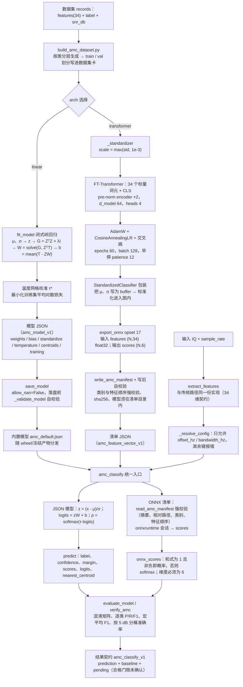

# 调制识别（AI 特征学习）算法设计

| 项目 | 取值 |
| --- | --- |
| 算法标识 | `amc_linear_v1`（JSON 线性模型）/ `amc_onnx_v1`（ONNX 分类器） |
| 特征契约 | `amc_feature_vector_v1`（34 维，**与"传统特征"文档完全同一份**） |
| 模型契约 | `amc_model_v1`（线性 JSON）/ `amc_feature_vector_v1`（ONNX 清单） |
| 结果契约 | `amc_classify_v1` |
| 判别器实现 | `src/signal_analysis/ml/amc.py::fit_model` / `predict` / `onnx_scores` |
| 训练实现 | `training/amc_transformer.py`、`training/train_amc.py`（**不随 wheel 分发**） |
| 数据集 | `training/build_amc_dataset.py`，产出 `(features, label, snr_db)` 记录 |
| 验收 | `training/verify_amc.py`（数据集契约 / 线性基线 / ONNX 一致性） |
| 内置模型 | id `amc-linear-default`，version `0.1.0`（随包分发的合成数据基线） |
| 文档日期 | 2026-09-11 |

> **本项目的 "AI 调制识别" 是"确定性物理特征 + 学习判别器"。**
> 特征提取（§1–§9 项）**不是**神经网络——它逐项有闭式定义、可复算、可人工判读；
> 只有最后一层"从 34 维到 6 类"的映射是学出来的。
> 这样做的直接好处是：**线性基线与 Transformer 共用同一份输入**，
> 两者的差距就是"判别器的贡献"，不掺任何特征工程的差异。
> 特征本身的公式、物理含义、局限见
> [调制识别_传统特征与启发式判定](调制识别_传统特征与启发式判定.md)。

---

## 1. 算法思路

### 1.1 为什么不让网络直接看 IQ

把原始 IQ 直接喂给深度网络（CNN/LSTM/ResNet）是 RadioML 路线的标准做法，本项目**没走这条路**，原因有三：

1. **数据量不够**。合成数据可以无限生成，但生成器只能覆盖它建模过的物理效应
   （本项目生成器：理想信道 + 白噪声 + RRC 成形），网络很容易学成"认生成器的指纹"，
   到真实数据上直接失效。34 维物理特征**先验更强、自由度更低**，小样本下更稳。
2. **可解释性与可复核**。任何一次判决都可以展开成 34 个物理量，与启发式判据、
   与文献里的累积量参考表逐项核对。端到端网络做不到这一点。
3. **与检测路径同构**。检测是"网络判决 + 物理测量"，识别是"网络判决 + 物理特征"，
   同一套工程范式（清单强校验、契约冻结、失败即报错）可以复用。

### 1.2 两个判别器，一个特征

| | 线性基线 | FT-Transformer |
| --- | --- | --- |
| 参数 | $34\times6$ 权重 + 6 偏置 + 68 标准化参数 | 约 10 万级 |
| 拟合方式 | **闭式解**（岭回归，无需迭代、无需随机种子） | AdamW 迭代训练 |
| 产出 | JSON（`amc_model_v1`，可直接 diff、可直接审计） | ONNX + 清单 |
| 依赖 | 仅 numpy | torch（训练）、onnxruntime（推理） |
| 定位 | **默认路径 / 可复现基线 / 交付兜底** | 精度上限探索 |
| 置信度 | softmax(温度 × logits)，温度在训练集上按对数损失网格校准 | softmax，**未标定** |

两者**必须**用同一份 `records`、同一条 `train/val` 划分、同一个 `evaluate_model` 评测，
否则比较没有意义（数据集划分由 `build_amc_dataset.py --seed` 决定并写进数据集卡）。

### 1.3 为什么线性基线能到 0.82

34 维特征里已经包含了**强判别性**的量：

- `c63_mag` 直接把 QPSK(≈4) / 16QAM(≈2.1) / 64QAM(≈1.8) 拉开；
- `m20_mag` 把实信号（AM/2ASK）与其他分开；
- `spec_flatness` / `spec_edge_ratio` 把 SSB 的"盒状谱"识别出来；
- `amp_clusters` / `peak_clusters` / 16 桶模板给出电平数。

在这个特征空间里，六类**近似线性可分**（这也是文献里"累积量特征 + 线性判别"能做起来的
根本原因）。因此闭式岭回归就能给出宏平均 F1 0.8246 的基线；
Transformer 的增益空间主要在**低 SNR 与 16/64QAM 混淆**这两块。

---

## 2. 公式

### 2.1 标准化

线性基线（`fit_model`，$N$ 为样本数、$D=34$）：

$$\mu_d=\frac{1}{N}\sum_{i=1}^{N}x_{i,d},\qquad
\sigma_d=\max\Big(\mathrm{std}_d,\ \texttt{STANDARDIZE\_FLOOR}=10^{-2}\Big)$$

$$z_{i,d}=\frac{x_{i,d}-\mu_d}{\sigma_d}$$

> 下限 $10^{-2}$ 的作用：**近常量特征（例如空桶占满的 `peak_hist_*`）不被放大成噪声**。
> 同时 $z$ 的量级不随特征物理量纲变化，岭正则才对所有维度公平。

Transformer（`_standardizer`）用的是 $\sigma_d=\max(\mathrm{std}_d,10^{-3})$，
**下限不同**（$10^{-3}$ vs $10^{-2}$）——两个分支各自独立训练，
**不要假设它们的标准化参数一致**（这也是清单里 `standardize` 只作留档的原因）。

### 2.2 岭回归（闭式解）

把六类做成 one-hot 目标矩阵 $T\in\{0,1\}^{N\times C}$（$C=6$，顺序恒为
`AMC_CLASSES`）：$T_{i,c}=1$ 当且仅当第 $i$ 个样本属于第 $c$ 类。

$$\boxed{\ G=Z^{\!\top}Z+\lambda I_D,\qquad W=G^{-1}\big(Z^{\!\top}T\big)\ }$$

$$\boxed{\ b=\frac{1}{N}\sum_{i=1}^{N}\big(T_i-Z_iW\big)\ }$$

$\lambda=\texttt{DEFAULT\_L2}=10^{-3}$，$Z\in\mathbb{R}^{N\times D}$、$W\in\mathbb{R}^{D\times C}$、
$b\in\mathbb{R}^{C}$。代码用 `np.linalg.solve(G, ZᵀT)`（不解显式逆）。

> **为什么要岭正则**：34 维里有强共线的组（`spec_edge_ratio` 与 `psd_peak_ratio`、
> `amp_clusters` 与 `peak_clusters`、16 桶模板和为 1）。无正则时 $Z^\top Z$ 近奇异，
> 权重会爆到 $10^{3}$ 量级；$\lambda=10^{-3}$ 把它压到稳定区间，
> 且**不引入随机性**（同一个数据集必定得到同一组权重）。
> 偏置取"残差均值"而非直接求和，是为了让它在类别先验不平衡时仍居中。

### 2.3 判别与温度校准

$$z_i=\frac{x_i-\mu}{\sigma},\qquad \ell_i=z_iW+b,\qquad
p_i=\mathrm{softmax}\big(\tau\cdot \ell_i\big)$$

$$\text{softmax}(v)_c=\frac{e^{v_c-\max_j v_j}}{\sum_{k}e^{v_k-\max_j v_j}}$$

温度 $\tau$ 在**训练集**上按对数损失网格搜索（`_TEMPERATURE_GRID`）：

$$\tau^\star=\arg\min_{\tau\in\{0.5,1,2,3,4,6,8,12,16,24\}}
-\frac{1}{N}\sum_{i=1}^{N}\ln\max\big(p_{i,y_i}(\tau),\ 10^{-12}\big)$$

### 2.4 最小类质心（探索性）

$$z^{\text{centroid}}_c=\frac{1}{|\mathcal{C}_c|}\sum_{i\in\mathcal{C}_c}z_i,
\qquad
\texttt{nearest\_centroid}(x)=\arg\min_c\big\lVert z-z_c^{\text{centroid}}\big\rVert_2^2$$

质心**不是**判决依据（判决只用 $\ell$），只作为"这个样本离哪一类训练分布更近"的探索信息。

### 2.5 FT-Transformer 分类器

**（a）标量化分词元**：34 个特征各成一个"句子里的词"，第 $d$ 个特征的标量
$x_d\in\mathbb{R}$ 经

$$\text{token}_d=W_d\,x_d+b_d,\qquad W_d\in\mathbb{R}^{1\times d_{\text{model}}}$$

不再加特征位置编码（位置由 $W_d$ 本身承担），另加一个可学习的分类词元：

$$\text{CLS}\sim\mathcal{N}\big(0,\ 0.02^2\big)\ (\text{trunc\_normal})$$

**（b）pre-norm 编码器**（`norm_first=True`，$\ell=1,\dots,L$）：

$$\hat u^{\ell}=\mathrm{MHA}\big(\mathrm{LN}(u^{\ell-1})\big)+u^{\ell-1},\qquad
u^{\ell}=\mathrm{FFN}\big(\mathrm{LN}(\hat u^{\ell})\big)+\hat u^{\ell}$$

$$\mathrm{FFN}(v)=W_2\,\mathrm{gelu}\big(W_1v+b_1\big)+b_2$$

$$\mathrm{MHA}(V)=\mathrm{Concat}(\text{head}_1,\dots,\text{head}_H)W^O,\qquad
\text{head}_h=\mathrm{softmax}\Big(\frac{Q_hK_h^{\!\top}}{\sqrt{d_k}}\Big)V_h$$

超参：$d_{\text{model}}=64$、$H=4$（$d_k=16$）、$d_{ff}=4\,d_{\text{model}}=256$、
$L=2$、dropout 0.1。

**（c）分类头**：

$$\boxed{\ p=\mathrm{softmax}\Big(W_{\text{cls}}\,\mathrm{LN}(u^L_{\text{CLS}})+b_{\text{cls}}\Big)\ }$$

### 2.6 训练目标与超参（`train_classifier`）

$$\mathcal{L}=-\frac{1}{B}\sum_{i=1}^{B}\ln p_{i,y_i}
\quad(\text{CrossEntropyLoss})$$

| 超参 | 取值 |
| --- | --- |
| 优化器 | AdamW |
| 学习率 | $3\times10^{-3}$ |
| 权重衰减 | $10^{-4}$ |
| 学习率调度 | CosineAnnealingLR |
| 轮数 / 批大小 | 60 / 128 |
| 早停 | 验证损失 patience 12 |
| 随机种子 | 0（CLI `--seed`） |
| 结构 | `--d-model 64`、`--heads 4`、`--layers 2` |

### 2.7 导出与"标准化必须在图内"

导出时把标准化写成**图的一部分**（`StandardizedClassifier` 把 $\mu$、$\sigma$ 注册为 buffer）：

$$\text{ONNX}: \texttt{features}(N,34)\ \text{float32}
\ \longrightarrow\ \mathrm{Linear}\to\mathrm{softmax}\ \longrightarrow\
\texttt{scores}(N,6)\ \text{（概率）}$$

$$\text{scores}=\mathrm{softmax}\Big(W_{\text{cls}}\,\mathrm{LN}\big(\mathrm{enc}(\text{tokens})\big)\Big)
\quad\text{其中 tokens 由 } \frac{x-\mu}{\sigma}\ \text{生成（在图内）}$$

**关键约束**（`write_amc_manifest` 的 docstring 原文）：
> "模型必须位于清单目录内并使用相对路径；`standardize` 用于留档与核对，
> **真正的标准化必须已写入导出图**。"

因此 **`.onnx` 的输入 `features` 是"未标准化的原始 34 维特征"**；
Python 侧不做任何预处理（`onnx_scores` 只做 `np.asarray([feature_vector(features)], dtype=np.float32)`）。
opset 默认 17（`DEFAULT_ONNX_OPSET`）。

### 2.8 推理侧的鲁棒读取（`onnx_scores`）

$$\text{values}=\text{output}\ \text{（reshape 到 } -1\text{）},\qquad
\text{值域}\ge0\ \wedge\ \big|\textstyle\sum-1\big|<10^{-3}
\ \Rightarrow\ \text{直接当概率}$$

$$\text{否则}\ \Rightarrow\ p=\mathrm{softmax}(\text{values})$$

输出维度必须等于 6，否则报错。这一层判断是为了兼容"导出图里带了 softmax"与
"导出图输出 logits"两种常见情况，而**不改变契约**（对外永远是概率）。

### 2.9 可信度判定（与结果契约共用）

| 条件 | `reliable` |
| --- | --- |
| `snr_estimate_db is None` | `True`（附"无法估计"说明） |
| `snr_estimate_db < 5.0` dB | `False` |
| `confidence < 0.5` | `False` |
| 其他 | `True` |

`snr_note` 固定声明：带内信噪比是**粗估**，仅用于可信度提示，**不是验收口径**。

---

## 3. 流程图



---

## 4. 输入与输出参数

### 4.1 训练侧接口

| 对象 | 说明 |
| --- | --- |
| `fit_model(records, *, l2=1e-3, provenance=None) -> dict` | `records` 为 `{"features": dict, "label": str, "snr_db": float\|None}` 序列；**至少覆盖两个类别**；标签必须在六类字典内，否则报错 |
| `build_amc_dataset.py` | `--output --per-class 400 --seed 0 --rate 2e5 --duration-range --snr-range(-5,30) --min-bandwidth-ratio 0.05 --max-bandwidth-ratio 0.30 --guard-ratio 0.02 --center-jitter 0.05 --bandwidth-jitter 0.10 --power-dbfs -6 --train-fraction 0.8 --modes` |
| `train_amc.py` | `--data --output --arch {linear,transformer} --l2 --min-snr --seed --epochs --batch-size --d-model --heads --layers --learning-rate --onnx-dir` |
| `train_classifier(...)` | 传入已划分好的 `train_x/train_y/val_x/val_y` 与 `classes`，返回训练好的 `StandardizedClassifier` |
| `export_onnx(model, path, *, standardize, feature_count, classes, opset=17)` | 导出**自带标准化**的 `.onnx` |
| `write_amc_manifest(output, model, *, classes, features, standardize, identifier, version, opset, input_name, output_name, training, notes)` | 返回 `(manifest, library_path)`；**模型必须在清单目录内** |
| `verify_amc.py` | `--data --model --manifest --limit 200 --threads --json` |

### 4.2 线性模型 JSON（`amc_model_v1`）字段

| 字段 | 说明 |
| --- | --- |
| `contract` | `"amc_model_v1"` |
| `feature_contract` | `"amc_feature_vector_v1"` |
| `schema_version` | 1 |
| `classes` / `labels` | 六类顺序 / 中文标签 |
| `features` | 34 个特征名，**顺序必须与 `AMC_FEATURES` 完全一致**，否则 `_validate_model` 报错 |
| `l2` | 岭系数 |
| `temperature` | 校准后的温度 $\tau^\star$ |
| `standardize.mean` / `standardize.scale` | 各 34 个数；`scale > 0` 且全部有限 |
| `weights` | $34\times6$ 嵌套数组，有限 |
| `bias` | 长度 6，有限 |
| `centroids` | 六类质心（标准化空间，34 维） |
| `training.samples` / `support` | 样本总数 / 逐类支撑数 |
| `training.accuracy_in_sample` | **训练集内**准确率（不是泛化指标） |
| `training.confusion_in_sample` | 训练集内混淆矩阵 $6\times6$ |
| `training.snr_db.min` / `.max` | 训练集 SNR 实际覆盖范围 |
| `training.note` | 固定提示："in-sample 指标仅用于自检；正式指标须用独立验证集（evaluate_model）" |
| `training.provenance` | 训练脚本追加的来源信息（可选） |

### 4.3 ONNX 分类器清单（`amc_feature_vector_v1`）字段

| 字段 | 约束（`read_amc_manifest` 强校验） |
| --- | --- |
| `schema_version` | 必须为 1 |
| `task` | `"amc"` |
| `contract` | 必须为 `amc_feature_vector_v1` |
| `runtime` | 必须为 `onnxruntime` |
| `runtime_min_version` | 默认 `1.17`；运行时版本更低则拒绝 |
| `id` / `version` | 非空文本 |
| `sha256` | 64 位十六进制，且与 `library` 实际摘要**必须一致** |
| `library` | **清单目录内的相对路径**；绝对路径/越界/缺失/空文件均报错 |
| `opset` | 整数（默认 17） |
| `input.name` / `input.size` | 输入节点名（默认 `features`）/ 必须为 34 |
| `output.name` / `output.classes` | 输出节点名（默认 `scores`）/ **必须与六类字典一致** |
| `features` | **必须与 `AMC_FEATURES` 逐项一致** |
| `standardize.mean` / `.scale` | 各 34 个有限数 |
| `standardize.note` | 固定："标准化应已写入导出图；此处仅留档核对" |
| `training` | 训练元信息 |
| `manifest.notes` | 说明 |
| 文件大小 | 清单 $\le$ 64 KiB |

### 4.4 推理侧接口

```python
amc_classify(samples, sample_rate, config=None, model=None, threads=None) -> dict
```

| `config` 键 | 说明 |
| --- | --- |
| `offset_hz` | 分析频带中心（Hz），默认 0 |
| `bandwidth_hz` | 分析频带带宽（Hz），`None` 表示整段采样带宽 |

**其他任何键都会报错**（`_resolve_config`：`AMC 配置不支持以下字段：…`）。

| `model` 取值 | `algorithm` | `model.source` |
| --- | --- | --- |
| `None` | `amc_linear_v1` | `builtin`（内置 `amc_default.json`） |
| dict（内联模型） | `amc_linear_v1` | `inline`（或 dict 里的 `source`） |
| 线性模型 JSON 路径 | `amc_linear_v1` | `file` |
| ONNX 清单路径（`contract == amc_feature_vector_v1`） | `amc_onnx_v1` | `onnx` |

结果键**恰好**为 §2.10 列出的 12 个（见
[调制识别_传统特征与启发式判定 §4.4](调制识别_传统特征与启发式判定.md)），
其中 `model` 在 ONNX 分支额外带 `simplify` 后的 `sha256` 与实际清单路径。

CLI：`signal-analysis amc-classify <asset_id> [--model PATH] [--offset-hz HZ] [--bandwidth-hz HZ] [--threads N]`。
**`amc-classify` 没有 `--report` 参数**（报表走 `export RUN_ID PATH`）。

### 4.5 评测输出（`evaluate_model`）

| 键 | 说明 |
| --- | --- |
| `confusion` | $6\times6$ 混淆矩阵 |
| `per_class` | 逐类 precision / recall / f1（真值与预测里都不出现的类，F1 为 `null` 且**不拉低宏平均**） |
| `accuracy` | 总体准确率 |
| `macro_f1` | 宏平均 F1 |
| `per_snr` | 按 5 dB 分桶的准确率，键形如 `"+5~+10 dB"` |
| `model_id` | 模型 id（便于报告里标注"这行数字来自哪个模型"） |

### 4.6 结果里的 `pending`（**必须原样出现**）

```
"识别准确率的合格门限尚未确认（技术方案待确认项）"
"AMC 使用单信号频带特征，多信号重叠场景需先由检测切分"
```

GUI、CLI、HTML 报表的每一个 AMC 结果都会带上这两条，**不允许在展示层丢掉**。

---

## 5. 当前相关参考文献

**表格数据上的 Transformer**

1. Gorishniy, Y., Rubachev, I., Khrulkov, V., Babenko, A. *Revisiting deep learning models for tabular data (FT-Transformer).* NeurIPS, 2021. —— **本项目的直接依据**：每个数值特征一个标量词元 + CLS 词元。
2. Vaswani, A. et al. *Attention is all you need.* NeurIPS, 2017. —— 编码器/多头注意力。
3. Devlin, J., Chang, M.-W., Lee, K., Toutanova, K. *BERT.* NAACL, 2019. —— CLS 词元用法的来源。
4. Dosovitskiy, A. et al. *An image is worth 16×16 words (ViT).* ICLR, 2021. —— 另一个"标量化 + Transformer"的范式参照。
5. Xiong, R. et al. *On layer normalization in the transformer architecture (Pre-LN).* ICML, 2020. —— `norm_first=True` 的依据（训练更稳，可省 warmup）。
6. Loshchilov, I., Hutter, F. *Decoupled weight decay regularization (AdamW).* ICLR, 2019.
7. Loshchilov, I., Hutter, F. *SGDR: stochastic gradient descent with warm restarts.* ICLR, 2017. —— CosineAnnealingLR。
8. Hendrycks, D., Gimpel, K. *Gaussian error linear units (GELUs).* arXiv:1606.08415, 2016.

**表格数据上的经典/树模型对照**

9. Grinsztajn, L., Oyallon, E., Varoquaux, G. *Why do tree-based models still outperform deep learning on typical tabular data?* NeurIPS Datasets & Benchmarks, 2022. —— **本项目必须引用**：它说明"在 34 维表格数据上，树模型常常优于深度模型"，这正是保留线性/树基线的方法论依据。
10. Friedman, J. H. *Greedy function approximation: a gradient boosting machine.* Ann. Statist. **29**(5):1189–1232, 2001.
11. Breiman, L. *Random forests.* Machine Learning **45**(1):5–32, 2001.
12. Cortes, C., Vapnik, V. *Support-vector networks.* Machine Learning **20**(3):273–297, 1995.

**无线电/调制识别领域的深度模型**

13. O'Shea, T. J., Corgan, J., Clancy, T. C. *Convolutional radio modulation recognition networks.* EANN, 2016.
14. O'Shea, T. J., Roy, T., Clancy, T. C. *Over-the-air deep learning based radio signal classification.* IEEE J. Sel. Topics Signal Process. **12**(1):168–179, 2018. —— RadioML 数据集与"深度模型 + 真实数据"的标杆。
15. West, N. E., O'Shea, T. J. *Deep architectures for modulation recognition.* IEEE DySPAN, 2017.
16. Rajendran, S., Meert, W., Giustiniano, D., Lenders, V., Pollin, S. *Deep learning models for wireless signal classification with distributed low-cost spectrum sensors.* IEEE Trans. Cogn. Commun. Netw. **4**(3):433–445, 2018.
17. Dobre, O. A., Abdi, A., Bar-Ness, Y., Su, W. *Survey of automatic modulation classification techniques.* IET Communications **1**(2):137–156, 2007. —— 传统特征方法的综述（与本项目特征族的对照）。
18. Swami, A., Sadler, B. M. *Hierarchical digital modulation classification using cumulants.* IEEE Trans. Commun. **48**(3):416–429, 2000. —— 34 维特征中累积量项的来源。
19. TorchSig, MIT License 数据集生成库（**本项目未使用**，仅列出可选数据来源）。
20. DeepSig RadioML 2018.01A，**CC BY-NC-SA 4.0**——**不可商用、不可随产品分发**，本项目**未使用**。

**概率校准与可信度**

21. Guo, C., Pleiss, G., Sun, Y., Weinberger, K. Q. *On calibration of modern neural networks.* ICML, 2017. —— **Transformer 分支置信度未标定的直接依据**。
22. Platt, J. *Probabilistic outputs for support vector machines and comparisons to regularized likelihood methods.* Advances in Large Margin Classifiers, 1999.
23. Zadrozny, B., Elkan, C. *Transforming classifier scores into accurate multiclass probability estimates.* KDD, 2002. —— 面向多类的保序回归/温度标定。

**正则化与线性判别**

24. Hoerl, A. E., Kennard, R. W. *Ridge regression: biased estimation for nonorthogonal problems.* Technometrics **12**(1):55–67, 1970. —— 岭回归原始文献。
25. Hastie, T., Tibshirani, R., Friedman, J. *The Elements of Statistical Learning.* 2nd ed., Springer, 2009. —— 岭回归与 LDA 的系统论述。
26. Guyon, I., Elisseeff, A. *An introduction to variable and feature selection.* JMLR **3**:1157–1182, 2003.

**部署与运行时**

27. ONNX Runtime documentation, Microsoft, 2024. —— 会话、线程数、算子集。
28. Jacob, B. et al. *Quantization and training of neural networks for efficient integer-arithmetic-only inference.* CVPR, 2018. —— INT8 量化部署。
29. Hinton, G., Vinyals, O., Dean, J. *Distilling the knowledge in a neural network.* NeurIPS Workshop, 2015. —— 把 Transformer 蒸馏回线性模型是后续可选项。

---

## 6. 设计局限

1. **合格门限未确认 —— 因此不给"通过/不通过"。**
   `pending[0]` 原文："识别准确率的合格门限尚未确认（技术方案待确认项）"。
   下一条限制里列出的所有数字都只**描述**这一次数据集划分下的表现，
   **不构成验收结论**，任何展示面都不许把它写成"达标"。

2. **数字全部来自合成数据自评，无独立验证集、无实测数据。**
   实测（`build_amc_dataset.py --per-class 800 --seed 11` 分层验证集）：
   总体准确率 **0.8250**、宏平均 F1 **0.8246**；
   分档：$\ge10$ dB $\ge0.97$；5–10 dB **0.793**；0–5 dB **0.662**；$-5$–0 dB **0.444**。
   逐类 F1：FM 0.954 / SSB 0.888 / 2ASK 0.982 / QPSK 0.835 / **16QAM 0.608 / 64QAM 0.682**。
   主误差：**16QAM ↔ 64QAM**（16QAM 有 26/80 被判成 64QAM），
   以及低 SNR 下 QPSK 被判成 QAM。**没有真实采集数据、没有 SDR 实测**。

3. **`accuracy_in_sample` 与验证集准确率是两个数，绝不可混用。**
   内置模型 `training.accuracy_in_sample = 0.851042`，验证集 0.8250。
   前者是**训练集内**、且**掺了温度校准**（温度就是在同一批数据上选的）的数字，
   只有自检价值；模型对象里 `training.note` 已写死这一点。

4. **温度校准是 in-sample 的，不是标定。**
   `_calibrate_temperature` 在训练集上网格搜索最小化平均对数损失。
   正确做法是**在独立验证集上做温度标定**（或保序回归，文献 [21][23]）；
   当前实现只能压一压过度自信的倾向，**不能**把 `confidence` 解释为概率。

5. **线性判别只有一个全局超平面。**
   $W$ 是 $34\times6$ 的常数矩阵，无法表达"低 SNR 时用规则 A、高 SNR 时用规则 B"。
   实际数据里 `c63_mag` 的判据随 SNR 漂移（这也是把 `snr_estimate_db` 塞进第 34 维的原因），
   线性模型只能用"折中斜率"处理，这直接反映在 16QAM/64QAM 的 F1 上。

6. **Transformer 在 34 维上极易过拟合。**
   约 10 万参数配 34 维输入、每类几百到几千样本，必须靠早停 + dropout + 权重衰减兜住；
   文献 [9] 明确指出这类表格数据上深度模型往往不如树模型。
   当前配置（$L=2$、$d=64$、patience 12）是为"小数据能训起来"选的保守配置，
   数据量上去以后需要重新调。

7. **ONNX 分支的标准化与清单可能不一致，而且无法自动发现。**
   唯一保证是"导出图里已经带标准化"（`StandardizedClassifier` 的 buffer）。
   清单里的 `standardize` 只是**留档**，`read_amc_manifest` 只校验它有 34 个有限数，
   **无法验证**它是否真的等于图内参数。`onnx_scores` 直接把**未标准化**的特征喂进图，
   所以如果导出时漏了 `StandardizedClassifier` 包装，模型照样能跑，
   只是精度会莫名其妙地差。**这是本分支最危险的失效模式**，只能靠
   `verify_amc.py` 的端到端比对发现。

8. **`verify_amc.py` 只验证契约，不验证精度。**
   它检查数据集卡与特征契约、特征顺序、线性模型形状、ONNX 清单自洽性、
   ONNX 与线性模型在有限样本上的一致性（容差 `2e-4`，`--limit 200`）。
   它**不**回答"这个模型够不够用"。

9. **ONNX 分支需要额外依赖。**
   `onnxruntime`（`pip install .[ml]`）缺失时：GUI 控件禁用并提示安装方式、
   CLI 以错误码 2 退出，**不回退、不猜**。传统/线性路径完全不受影响。

10. **多信号重叠场景必须先由检测切分。**
    `pending[1]` 原文："AMC 使用单信号频带特征，多信号重叠场景需先由检测切分"。
    频带内混叠会同时污染 34 个特征，模型没有任何机制处理它。

11. **只用六类字典，`am` 与两种跳频样式按"不适用"计数。**
    `fit_model` 遇到不在字典里的标签直接报错（不给"训练时丢掉"的机会），
    统计侧把它们记为"不适用"、不计入分母、**不当成错误**。
    这意味着**准确率的分母是六类**，不能对外说成"所有信号"。

12. **前置特征提取的误差会原样传入。**
    `bandwidth_hz` 给不准 → 抽取比 $F$ 不准 → 16 桶模板与 `amp_clusters` 失真
    → 线性判别偏离训练分布。结果里**没有**"输入特征是否可信"的标志（只有 `snr_estimate_db` 这一个粗估），因此"检测给错频带"这件事在识别侧是静默的。

13. **`snr_estimate_db` 既是特征也是提示，语义重叠。**
    它作为第 34 维参与判别（让模型能补偿 SNR 漂移），同时用于 `reliable` 判定。
    当它无法估计时，特征里填哨兵值 **60.0**、`info.snr_estimate_db` 填 `None`，
    于是"可信度判定"走 `reliable = True` 分支——**这是一个刻意的宽松选择**
    （不知道 SNR 就不因为 SNR 判不可信），但意味着高噪声下若占用带几乎覆盖采样带宽，
    结果仍会被标为可靠。

---

## 7. 可以改进的地方与相关文献

### 7.1 先把"对标与标定"做对（成本最低、收益最直接）

1. **独立验证集上做温度标定/保序回归**，替换当前 in-sample 校准
   —— Guo 2017 [21]、Zadrozny & Elkan 2002 [23]；
2. **先把树模型跑成第三基线**（随机森林 / LightGBM），
   因为文献 [9] 预测它在 34 维上很可能优于线性与 Transformer；
   如果真是这样，"上 Transformer"的意义需要重新论证；
3. **报告必须分档**：按 SNR 桶（`per_snr` 已有）、按调制样式、按目标数分列，
   避免单一总分掩盖 16/64QAM 这个真问题。

### 7.2 特征侧（性价比通常高于换判别器）

- **恢复 34 维之外的物理量**：符号速率、滚降系数、循环谱特征
  —— Gardner 1991；Dobre 2007 [17]。加特征属于契约破坏性变更，
  需要 `amc_feature_vector_v2` 并重训两个分支；
- **特征增强**：把 `c42/c63` 改成"多个子段上的中位数"以降低方差
  —— Rousseeuw & Croux 1993 *Alternatives to the median absolute deviation.*
  JASA **88**(424):1273–1283；
- **特征选择/降维**：34 → 15–20 维可显著降低过拟合 —— Guyon & Elisseeff 2003 [26]；
  LDA / PCA 白化也是对线性判别友好的预处理 —— Hastie 2009 [25]。

### 7.3 判别器侧

| 方向 | 具体做法 | 文献 |
| --- | --- | --- |
| 树集成 | LightGBM / XGBoost + 特征重要性审计 | Friedman 2001 [10]、Chen & Guestrin *XGBoost.* KDD 2016 |
| 核方法 | RBF-SVM + 概率输出 | Cortes & Vapnik 1995 [12]、Platt 1999 [22] |
| 集成 | 线性 + 树 + Transformer 软投票/堆叠 | Wolpert, D. *Stacked generalization.* Neural Networks **5**(2):241–259, 1992 |
| 蒸馏 | Transformer → 线性/树，保留精度、丢掉依赖 | Hinton 2015 [29] |
| 深度但更省 | TabNet / 1D-CNN 替代全 Transformer；MLP + 特征交互（DCN-V2） | Arik & Pfister *TabNet.* AAAI 2021；Wang, R. et al. *DCN V2.* WWW 2021 |
| 不确定性 | MC dropout / 深度集成给"不知道" | Gal & Ghahramani *Dropout as a Bayesian approximation.* ICML 2016；Lakshminarayanan et al. *Simple and scalable predictive uncertainty estimation using deep ensembles.* NeurIPS 2017 |

### 7.4 数据与领域自适应

- **规模**：每类 400 条只能跑通链路；要有意义的模型建议**每类数千到上万条**，
  并覆盖每个 SNR 档位（`build_amc_dataset.py --per-class --snr-range --seed`）；
- **领域自适应**：少量实测数据微调
  —— Ganin et al. *Domain-adversarial training of neural networks.* JMLR 2016；
  Sun & Saenko *Deep CORAL.* ECCV Workshops 2016；
- **少样本/自监督**：Snell et al. *Prototypical networks.* NeurIPS 2017；
  Chen et al. *SimCLR.* ICML 2020（在特征向量上做对比学习是低成本选项）；
- **干净的数据集卡**：把生成器版本、参数、SNR 分布、划分种子全部写进数据集卡
  （`build_amc_dataset.py` 已输出），否则数字无法复现。

### 7.5 部署

- **INT8 量化** ONNX 分类器（Jacob 2018 [28]），并用 `verify_amc.py --manifest`
  的端到端比对卡住数值漂移；
- **多模型版本共存**：`model.id` + `version` + `sha256` 已经进了结果与清单，
  报表里可以标注"这一行来自哪个模型"，便于 A/B；
- **把线性基线的 weights 纳入审计**：它是可读的 $34\times6$ 矩阵，
  可以做逐类权重分析和漂移检测（新数据的特征均值 vs `standardize.mean`）
  —— 文献 [9] 关于表格数据可解释性的讨论。

### 7.6 评测规范

- 建立**固定验证集**（seed 固定、写进数据集卡），禁止用训练集数字对外；
- 引入**真实采集数据**做独立验证集，与合成数据结果**分列报告**；
- 指标口径对齐 `evaluation.classification_metrics`（缺失类不拉低宏平均），
  并把"不适用"样本单列统计——把它们算进分母会系统性低估准确率；
- 置信度**标定之后**再谈阈值：当前 `reliable` 里的 `confidence < 0.5`
  与 `snr < 5 dB` 都是工程经验值，没有 ROC/PR 曲线支撑。
