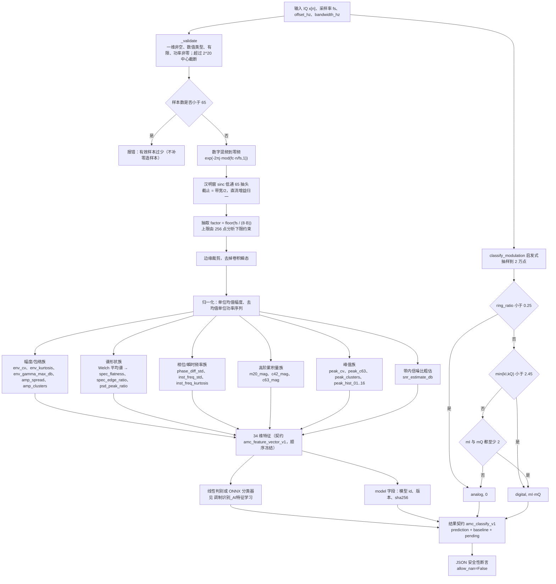

# 调制识别（传统特征与启发式判定）算法设计

| 项目 | 取值 |
| --- | --- |
| 特征契约 | `amc_feature_vector_v1`（34 维，顺序冻结） |
| 特征实现 | `src/signal_analysis/ml/amc.py::extract_features` |
| 启发式判定 | `src/signal_analysis/_numeric.py::classify_modulation`，标识 `heuristic_digital_analog_v1` |
| 类别字典 | FM、SSB、2ASK、QPSK、16QAM、64QAM（A09 六类） |
| 结果契约 | `amc_classify_v1` |
| 调用入口 | CLI `signal-analysis amc-classify`；GUI「调制识别」页；结果里的 `baseline` 字段 |
| 文档日期 | 2026-09-11 |

> **本文档描述"确定性特征 + 人工判据"这一路**。特征本身是**模型无关**的：
> 它既喂给这里的启发式/线性判别，也喂给
> [调制识别_AI特征学习](调制识别_AI特征学习.md) 里的线性基线与 Transformer。
> 两者共用同一份特征、同一份数据集、同一条验证划分，因此可以直接同口径对比。

---

## 1. 算法思路

传统调制识别在工程上通常分两层：

**第一层——裁剪与标准化（预处理）**
把"检测器给出的频带"搬移到零频，低通滤掉带外，再按带宽抽取到与带宽匹配的分析率。
这一步的目的只有一个：**让特征与符号速率、载频、采样率都解耦**，
否则同一个调制样式换个采样率就会得到完全不同的数字。

**第二层——物理特征（本项目的 34 维）**
按"信号长什么样"分四类描述：

| 族 | 物理表现 | 特征（按契约顺序） |
| --- | --- | --- |
| 幅度/包络 | AM/ASK 有幅度起伏，FM/PSK 恒包络 | `env_cv`、`env_kurtosis`、`env_gamma_max_db`、`amp_spread`、`amp_clusters` |
| 谱形状 | 单边带在频带中心表示下是矩形谱；多电平信号的谱边沿更"软" | `spec_flatness`、`spec_edge_ratio`、`psd_peak_ratio` |
| 相位/瞬时频率 | PSK 有离散相位台阶，FM 有连续相位游走 | `phase_diff_std`、`inst_freq_std`、`inst_freq_kurtosis` |
| 高阶累积量（星座几何） | 复对称性、幅度调制阶数、"六阶"对 16/64QAM 的区分能力 | `m20_mag`、`c42_mag`、`c63_mag` |
| 峰值（近似符号时刻） | 幅度模板的"台阶数"直接对应电平数 | `peak_cv`、`peak_c63`、`peak_clusters`、`peak_hist_01…16` |
| 可信度 | 供下游判断"这次结果能不能信" | `snr_estimate_db` |

**第三层——人工判据（启发式）**
`classify_modulation` 是一个**只回答"数字 / 模拟"和"星座规模粗略量级"** 的规则树，
设计目的是给 GUI 参数面板一个立即可用的判读，以及给 AMC 结果提供一个"传统对照"。
它**不是**六类分类器，也**不**声称能区分 16QAM 与 64QAM。

判定顺序（三条规则，命中即返回）：

1. **近恒包络 → 模拟。** 星座图呈环状（FM/FSK/CW）或密实圆盘（默认 AM）时，
   幅度变异系数 $\text{ring\_ratio}<0.25$ → `("analog", 0)`。
2. **I/Q 边缘分布低峰度 → 数字。** 离散电平结构（PSK/QAM/ASK）使边缘分布呈"平顶"，
   $\min(k_I,k_Q)<2.45$ → `("digital", estimate)`。
3. **两个边缘分布都多峰 → 数字**（例如带载波线的 OOK）→ `("digital", estimate)`。

三条都不命中（连续云状星座：噪声、SSB、OFDM 样信号）→ 落回 `("analog", 0)`。

---

## 2. 公式

### 2.1 预处理：混频、低通、抽取

输入序列 $x[n]$（长度 $N$，采样率 $f_s$），分析频带中心 $f_c$、带宽 $B$。

**（a）样本数护栏**

$$N\ \ge\ \texttt{LOWPASS\_TAPS}=65\qquad(\text{否则报错，不"补零造样本"})$$

$$N\ \le\ \texttt{MAX\_ANALYSIS\_SAMPLES}=2^{20}\quad(\text{超出则中心截断，保证确定性})$$

**（b）中心截断**（$N>2^{20}$ 时）：

$$n_0=\Big\lfloor\frac{N-2^{20}}{2}\Big\rfloor,\qquad x\leftarrow x[n_0:\,n_0+2^{20}]$$

**（c）数字混频到零频**（用 `mod` 避免大步长时的相位精度损失）：

$$\phi[n]=\mathrm{mod}\Big(\frac{f_c}{f_s}\,n,\ 1\Big),\qquad
x_{\text{bb}}[n]=x[n]\cdot e^{-j2\pi\phi[n]}$$

**（d）汉明窗 sinc 低通**（$L=65$ 抽头，截止 $\frac{B/2}{f_s}$ 归一化阻抗）：

$$c=\min\Big(\max\big(\tfrac{B}{2f_s},\ \tfrac{1}{L}\big),\ 0.5\Big)$$

$$h[k]=\frac{2c\cdot\mathrm{sinc}\big(2c\,(k-\tfrac{L-1}{2})\big)\cdot \mathrm{hamming}[k]}
{\sum_{i}2c\cdot\mathrm{sinc}\big(2c\,(i-\tfrac{L-1}{2})\big)\cdot\mathrm{hamming}[i]}$$

分母归一化使直流增益为 1（即"通带内幅度不变"）。

**（e）按带宽抽取**

$$x_{\text{filt}}[n]=(x_{\text{bb}}*h)[n]\quad(\texttt{mode="same"})$$

$$F=\Big\lfloor\frac{f_s}{8.0\cdot B}\Big\rfloor,\qquad
F\leftarrow\max\big(1,\ \min(F,\ \lfloor N_{\text{filt}}/256\rfloor)\big),\qquad
x_{\text{w}}[m]=x_{\text{filt}}[mF]$$

$$f_{\text{w}}=\frac{f_s}{F}\quad(\text{分析率})$$

> 常数 `8.0` 就是"**每单位占用带宽保留 8 个采样点**"这一约定（`SAMPLES_PER_BAND`），
> 它决定"每符号约多少点"的量级。**该常数必须与训练数据一致**，否则同一模型在
> 不同抽取比下的特征分布会整体漂移。
> `F` 的上限还保证至少留下 256 个分析点（`MIN_WORK_SAMPLES`）。

**（f）边缘裁剪**（去掉卷积瞬态）：

$$E=\min\Big(\Big\lfloor\frac{L/2}{F}\Big\rfloor+1,\ \Big\lfloor\frac{M}{10}\Big\rfloor\Big),\qquad
x_{\text{w}}\leftarrow x_{\text{w}}[E:\,M-E]\quad(\text{仅当 }M-2E\ge32)$$

### 2.2 归一化与派生量

$$P=\frac{1}{M}\sum_{m}\lvert x_{\text{w}}[m]\rvert^{2}\ (\text{平均功率}),\qquad
\text{mag}[m]=\frac{\lvert x_{\text{w}}[m]\rvert}{\sqrt P},\qquad
x_c[m]=\frac{x_{\text{w}}[m]-\overline{x_{\text{w}}}}{\sqrt P}$$

（$x_c$ 是"去均值 + 单位功率"序列，供累积量使用。）

$$P_{\text{dBFS}}=10\log_{10}P$$

### 2.3 幅度/包络特征（4 项）

$$\texttt{env\_cv}=\frac{\mathrm{std}(\text{mag})}{\overline{\text{mag}}}$$

$$\texttt{env\_kurtosis}=\frac{\mathbb{E}[\text{mag}^4]}{\mathbb{E}[\text{mag}^2]^2}-3\quad(\text{超额峰度})$$

**包络谱峰值**（对包络去均值后加 Hanning 窗做一次 FFT，取 ESID）：

$$\texttt{env\_gamma\_max\_db}=10\log_{10}\frac{\max_k\lvert E[k]\rvert^2}{\overline{\lvert E[k]\rvert^2}}$$

数字调制因符号速率会在包络谱上留下线谱，因此这一项对"数字 vs 模拟"有直接判别力。

$$\texttt{amp\_spread}=\frac{p_{90}(\text{mag})-p_{10}(\text{mag})}{p_{50}(\text{mag})},\qquad
\texttt{amp\_clusters}=\#\text{modes}\big(\text{hist}(\text{mag})\big)$$

`amp_clusters` 用 32 桶直方图、3 点平滑、阈值 $0.2\times$ 峰值、最小间隔 2 桶，
输出 1–8（`_histogram_modes`）。它就是"**幅度上有几个电平**"的直接读数。

### 2.4 谱形状特征（3 项，Welch 平均谱上统计）

Welch 参数：$\text{nfft}$ 从 64 起按 $4\times$ 倍增直到不超过 $\text{count}$ 且 $<2048$，
帧数上限 64，Hanning 窗，50% 重叠：

$$\text{nfft}=\max\Big(64,\ \min(2048,\ \text{nfft},\ M)\Big),\qquad
\texttt{hop}=\max(1,\text{nfft}/2)$$

$$S[k]=\frac{\sum_{j}\lvert \mathrm{FFT}(\text{seg}_j\cdot w)\rvert^2}
{\#\text{frames}\cdot f_{\text{w}}\sum_n w^2[n]}$$

只在**占用带内部**（$\lvert f\rvert\le B/2$，少于 4 根谱线则退化为全谱）统计：

$$\texttt{spec\_flatness}=\frac{\exp\!\big(\overline{\ln S[k]}\big)}{\overline{S[k]}}
\quad(\text{几何平均}/\text{算术平均}\in(0,1])$$

$$\texttt{psd\_peak\_ratio}=\frac{\max_k S[k]}{\overline{S[k]}}$$

$$\texttt{spec\_edge\_ratio}=\frac{\overline{S[k],\ \lvert f\rvert\in \text{最外 }10\%}}
{\overline{S[k],\ \lvert f\rvert\in \text{中间 }25\%\!-\!75\%}}$$

> 低通阻带会下溢到 0，因此**只统计带内谱线**；把阻带算进几何平均会把平坦度拉垮。
> `spec_flatness` 越低（谱越"不平"）、`edge_ratio` 越高（边沿越陡、越"盒状"），
> 越像单边带；多电平 QAM 的谱边沿更软（RRC 滚降）。

### 2.5 相位与瞬时频率特征（3 项）

相邻相位差（**缠绕到 $(-\pi,\pi]$**）：

$$\Delta[m]=\mathrm{wrap}\big(\angle x_{\text{w}}[m]-\angle x_{\text{w}}[m-1]\big),\qquad
\texttt{phase\_diff\_std}=\frac{\mathrm{std}(\Delta)}{\pi}$$

瞬时频率（以占用带宽为归一化单位）：

$$\texttt{inst}[m]=\frac{\Delta[m]\cdot f_{\text{w}}}{2\pi B},\qquad
\texttt{inst\_freq\_std}=\mathrm{std}(\texttt{inst})$$

$$\texttt{inst\_freq\_kurtosis}=\frac{\mathbb{E}[(\texttt{inst}-\bar{\texttt{inst}})^4]}
{\mathbb{E}[(\texttt{inst}-\bar{\texttt{inst}})^2]^2}-3$$

PSK/QAM 的相位跳变使瞬时频率呈冲击性 → 峰度高；FM 是连续游走 → 峰度低。

### 2.6 高阶累积量（3 项）

在 $x_c$（去均值、单位功率、复序列）上按矩定义累积量（**不引入 $1/\sqrt{\cdot}$ 的归一化分支**，
保持与"实信号/复信号"两种情形一致）：

$$\hat m_{20}=\mathbb{E}\big[x_c^2\big]\ \text{（复数）},\qquad
\hat m_{21}=\mathbb{E}\big[\lvert x_c\rvert^{2}\big],\qquad
\hat m_{42}=\mathbb{E}\big[\lvert x_c\rvert^{4}\big],\qquad
\hat m_{63}=\mathbb{E}\big[\lvert x_c\rvert^{6}\big]$$

$$\boxed{\ \texttt{m20\_mag}=\lvert \hat m_{20}\rvert\ }$$

$$\boxed{\ \texttt{c42\_mag}=\big\lvert \hat m_{42}-\lvert \hat m_{20}\rvert^{2}-2\hat m_{21}^{2}\big\rvert\ }$$

$$\boxed{\ \texttt{c63\_mag}=\big\lvert \hat m_{63}-9\,\hat m_{42}\hat m_{21}+12\,\hat m_{21}^{3}\big\rvert\ }$$

三者在代码注释里给出了**实测量级参考**（用于人工判读与回归）：

| 特征 | 典型值 | 含义 |
| --- | --- | --- |
| `m20_mag` | AM/2ASK 接近 1 | 实信号（复平面上分布在一条直线上）|
| `c42_mag` | 2ASK 高；QPSK ≈ 1；16/64QAM ≈ 0.6 | 幅度调制阶数 |
| `c63_mag` | QPSK ≈ 4；16QAM ≈ 2.1；64QAM ≈ 1.8 | 六阶累积量，区分 QAM 阶数 |

> **注意**：这几个参考值是**理想无 ISI** 下的理论近似。低 SNR 且带 RRC 成形时，
> ISI 会把 16QAM 与 64QAM 的 `c63_mag` 差别压到 2 倍以内（见 §6），
> 这正是线性判别最难的一段。

### 2.7 峰值样本特征（3 + 16 项）

**峰值样本**（近似符号时刻）：对 `mag` 做 3 点平滑，取局部极大值，最小间隔 5 个分析点。

$$\texttt{peak\_cv}=\frac{\mathrm{std}(\text{peak})}{\overline{\text{peak}}}$$

在单位功率、去均值的峰值序列 $\tilde p$ 上：

$$\texttt{peak\_c63}=\big\lvert \hat m_{63}-9\hat m_{42}\hat m_{21}+12\hat m_{21}^3\big\rvert
\quad(\tilde p)$$

$$\texttt{peak\_clusters}=\#\text{modes}\big(\text{hist}(\tilde p)\big)\quad(1\!-\!8)$$

**16 桶峰值幅度模板**（`_amplitude_template`）：以**99 分位幅度**为参照点（对噪声尖峰不敏感），
裁剪到 $[0,1.2]$，桶内归一化为**概率密度**：

$$\text{ref}=p_{99}(\text{peak}),\qquad
u_i=\mathrm{clip}\Big(\frac{\text{peak}_i}{\text{ref}},0,1.2\Big),\qquad
\texttt{peak\_hist\_}j=\frac{\#\{u\in \text{桶}j\}}{n\cdot h},\ \ h=\frac{1.2}{16}$$

$$\text{样本数}<8\ \Rightarrow\ \texttt{peak\_hist}=\frac{1}{16}\ \text{（均匀分布，对模型中立）}$$

> 设计意图很重要：**样本不足时给"均匀分布"而不是"某个默认形状"**，
> 避免把"没数据"伪装成"有证据"。

### 2.8 带内信噪比粗估（1 项）

取前 $2^{16}$ 个样本，加 Hanning 窗做一次 FFT：

$$\text{in}=\overline{\lvert X[k]\rvert^2}_{\,k\in\text{带内}},\qquad
\text{out}=\overline{\lvert X[k]\rvert^2}_{\,k\in\text{带外（含循环回绕处理）}}$$

$$\texttt{snr\_estimate\_db}=\begin{cases}
10\log_{10}\dfrac{\text{in}-\text{out}}{\text{out}}, & \text{in}>\text{out}\\[4pt]
0.0, & \text{in}\le\text{out}\\[4pt]
\text{null}, & \text{任一侧谱线}<4
\end{cases}$$

> 这是**工程粗估**（占用带内/外平均 PSD 之比），与检测路径的 `inband_snr_v1` 量纲一致
> 但估计方式不同（这里不做 $N_0B$ 折算、不做迭代本底）。结果里专门带一句
> `snr_note` 说明"仅用于可信度提示，不是验收口径"。`snr_estimate_db` 也作为第 34 维特征
> 进入模型，让线性判别能补偿各阶量随 SNR 的漂移。

### 2.9 启发式判定（`classify_modulation`）

先按 $\text{step}=\lceil N/20000\rceil$ 抽样到不超过 20000 点，再：

$$\text{ring\_ratio}=\frac{\mathrm{std}(\lvert x\rvert)}{\overline{\lvert x\rvert}}$$

$$\text{若 }\mathrm{std}(x_I)=0\ \wedge\ \mathrm{std}(x_Q)=0\ \Rightarrow\ \texttt{("analog",0)}$$

**规则 1：**

$$\text{ring\_ratio}<0.25\ \Rightarrow\ \texttt{("analog", 0)}$$

（近恒包络：FM/FSK/CW；以及默认 AM —— 其星座是密实圆盘。）

**边缘峰度**（对零均值序列）：

$$k(v)=\frac{\mathbb{E}[v^4]}{\mathbb{E}[v^2]^2},\qquad
k_I=\begin{cases}k(x_I),&\mathrm{std}(x_I)>10^{-12}\\ 99.0,&\text{否则}\end{cases}
\quad(\text{同理 }k_Q)$$

**边缘峰数** $m_I,m_Q$ 由 `_marginal_modes` 给出：以 $3\,\mathrm{std}$ 为半宽做 64 桶直方图 →
5 点滑动平滑 → 峰值需 $\ge 0.12\times$ 全局峰 → 两个候选峰之间必须存在低于
$0.75\times$ 较矮峰高度的谷才算"分离"。

$$\texttt{estimate}=\max\big(2,\ \min(m_I\,m_Q,\ 256)\big)$$

**规则 2：** $\min(k_I,k_Q)<2.45\ \Rightarrow\ \texttt{("digital", estimate)}$
（平顶边缘分布 = 离散电平。）

**规则 3：** $m_I\ge2\ \wedge\ m_Q\ge2\ \Rightarrow\ \texttt{("digital", estimate)}$

**否则：** $\texttt{("analog", 0)}$（连续云状：噪声、SSB、类 OFDM。）

### 2.10 结果字段

`amc_classify` 的结果键**恰好**为（代码里有 `assert set(result) == set(_RESULT_KEYS)` 兜底）：

```python
("contract", "algorithm", "classes", "labels", "features", "feature_contract",
 "band", "snr_estimate_db", "prediction", "baseline", "model", "pending")
```

并要求 `json.dumps(result, ensure_ascii=False, allow_nan=False)` 必须成功——
**任何 NaN/Inf 都会当场炸出来**，而不是流到报告里。

---

## 3. 流程图



---

## 4. 输入与输出参数

### 4.1 函数签名

```python
extract_features(samples, sample_rate, offset_hz=0.0, bandwidth_hz=None) -> (features: dict, info: dict)
classify_modulation(samples, max_points=20000) -> (classification: str, cluster_estimate: int)
amc_classify(samples, sample_rate, config=None, model=None, threads=None) -> dict
```

| 参数 | 说明 |
| --- | --- |
| `samples` | 一维实/复数值数组；实数输入会被当复数处理（`imag = 0`） |
| `sample_rate` | 采样率（Hz） |
| `offset_hz` | 分析频带中心（基带偏移，Hz），默认 0 |
| `bandwidth_hz` | 分析频带带宽（Hz）。**`None` 表示整段采样带宽，且强制中心为 0、不做抽取** |
| `model` | `None` → 内置线性基线；dict → 内联模型；路径 → ONNX 清单或模型 JSON |
| `threads` | onnxruntime 线程数（仅清单模型有效） |

`config` 只接受两个键，出现其他键直接报错：`offset_hz`、`bandwidth_hz`。

### 4.2 特征列表（`amc_feature_vector_v1`，共 34 维，顺序即契约）

| # | 名称 | 说明 | 取值性质 |
| --- | --- | --- | --- |
| 1 | `env_cv` | 归一化包络变异系数 | $\ge0$，FM/PSK 低、AM/ASK 高 |
| 2 | `env_kurtosis` | 包络超额峰度 | 双电平最低 |
| 3 | `env_gamma_max_db` | 包络谱峰值（相对均值 dB） | 数字调制有线谱 |
| 4 | `spec_flatness` | 带内谱平坦度（几何/算术均值比） | $(0,1]$ |
| 5 | `spec_edge_ratio` | 最外 10% / 中间 50% 功率比 | $\ge0$ |
| 6 | `psd_peak_ratio` | 峰均比 | $\ge1$ |
| 7 | `inst_freq_std` | 归一化瞬时频率标准差 | $\ge0$ |
| 8 | `inst_freq_kurtosis` | 瞬时频率超额峰度 | PSK/QAM 高 |
| 9 | `phase_diff_std` | 相邻相位差标准差 $/\pi$ | $[0,\approx1]$ |
| 10 | `m20_mag` | $\lvert\hat m_{20}\rvert$ | AM/2ASK 接近 1 |
| 11 | `c42_mag` | $\lvert\hat C_{42}\rvert$ | 2ASK 高、QPSK ≈1、QAM ≈0.6 |
| 12 | `c63_mag` | $\lvert\hat C_{63}\rvert$ | QPSK ≈4、16QAM ≈2.1、64QAM ≈1.8 |
| 13 | `amp_spread` | $(p_{90}-p_{10})/p_{50}$ | $\ge0$ |
| 14 | `amp_clusters` | 全样本幅度直方图峰数 | 整数 1–8 |
| 15 | `peak_cv` | 峰值幅度变异系数 | $\ge0$ |
| 16 | `peak_c63` | 峰值序列的 $\lvert\hat C_{63}\rvert$ | 电平数敏感 |
| 17 | `peak_clusters` | 峰值幅度直方图峰数 | 整数 1–8 |
| 18–33 | `peak_hist_01` … `peak_hist_16` | 16 桶峰值幅度模板（概率密度，和为 1） | $\ge0$，$\sum=1$ |
| 34 | `snr_estimate_db` | 带内信噪比粗估（dB） | 数值，粗估；无法估计时**特征填 60.0 哨兵、`info` 填 `None`** |

> **特征比模型更稳定**：改特征顺序或含义即换代（`_validate_model` 会逐项比对），
> 因此契约名带版本号 `_v1`。加特征属于破坏性变更。

### 4.3 `info`（结果里的 `band` 字段）

| 键 | 说明 |
| --- | --- |
| `center_hz` / `bandwidth_hz` | 实际使用的分析频带（`bandwidth_hz=None` 时为采样带宽且中心为 0） |
| `sample_rate_hz` | 输入采样率 |
| `analysis_rate_hz` | 抽取后的分析率 $f_{\text{w}}$ |
| `decimation` | 抽取比 $F$ |
| `sample_count` / `analysis_samples` | 输入点数 / 参与特征计算的分析点数 |
| `peak_samples` | 检测到的峰值（近似符号时刻）样本数 |
| `power_dbfs` | 分析段平均功率（dB） |
| `snr_estimate_db` | 带内信噪比粗估（`null` 表示无法估计） |

### 4.4 结果契约 `amc_classify_v1`（12 个键，**恰好**）

| 键 | 类型 | 说明 |
| --- | --- | --- |
| `contract` | str | `"amc_classify_v1"` |
| `algorithm` | str | 线性/JSON 模型 → `"amc_linear_v1"`；ONNX 清单 → `"amc_onnx_v1"` |
| `classes` | list[str] | 恒为 A09 六类顺序 `["fm","ssb","ask2","qpsk","qam16","qam64"]` |
| `labels` | dict | 类名 → 中文标签（FM 调频 / SSB 单边带 / 2ASK 幅度键控 / QPSK 四相键控 / 16QAM / 64QAM） |
| `features` | dict | 34 维特征（§4.2） |
| `feature_contract` | str | `"amc_feature_vector_v1"` |
| `band` | dict | §4.3 |
| `snr_estimate_db` | float / null | 与特征第 34 维同源 |
| `prediction` | dict | 见下 |
| `baseline` | dict | 传统启发式对照，见下 |
| `model` | dict | 模型元信息，见下 |
| `pending` | list[str] | **尚未确认项**（恒含"识别准确率的合格门限尚未确认"） |

**`prediction`**

| 键 | 说明 |
| --- | --- |
| `label` | 预测类别（`fm` … `qam64`） |
| `label_text` | 中文标签 |
| `confidence` | 最高类概率 |
| `margin` | 最高类与次高类概率之差（单类模型时为 `null`） |
| `scores` | 六类概率字典（和约为 1） |
| `logits` | 判别函数原始输出（JSON 模型时给出） |
| `nearest_centroid` | 最近训练类质心（JSON 模型时给出，探索性信息） |
| `reliable` | 是否可信（见下） |
| `reason` | 判为不可信的原因（可信时为 `null`） |
| `snr_note` | 固定说明："带内信噪比按占用带内/外平均功率谱密度之比粗估，仅用于可信度提示，不是验收口径" |

**`reliable` 判定规则（按顺序）**

| 条件 | `reliable` | `reason` |
| --- | --- | --- |
| `snr_db is None` | `True` | "带内信噪比无法估计…未做低信噪比标注" |
| `snr_db < 5.0` dB | `False` | "粗略估计的带内信噪比 X dB 低于 5 dB，识别结果仅供参考" |
| `confidence < 0.5` | `False` | "最高类概率仅 X.XX，类别区分度不足" |
| 其他 | `True` | `null` |

**`baseline`**

| 键 | 说明 |
| --- | --- |
| `algorithm` | 恒为 `"heuristic_digital_analog_v1"` |
| `classification` | `"digital"` / `"analog"`（启发式抛错时为 `null`） |
| `cluster_estimate` | 星座规模粗略量级（`m_I\cdot m_Q`，上限 256） |
| `note` | 固定说明"传统启发式只给出数字/模拟与簇数估计，不区分类别"，或异常原因 |

**`model`**

| 键 | 说明 |
| --- | --- |
| `id` / `version` | 默认 `amc-linear-default` / `0.1.0` |
| `source` | `"builtin"` / `"inline"` / `"file"` / `"onnx"` |
| `model_path` | JSON 模型的实际路径（`null` 表示内联） |
| `sha256` | 模型文件摘要 |
| `accuracy_in_sample` | 训练集内准确率（**不是**泛化指标，见 §6） |

### 4.5 真值来源与统计口径

| 对象 | 说明 |
| --- | --- |
| 真值来源 | 生成器的 `mode` **本身就是类别名**；`mode_to_class` 只认六类，其余返回 `None` |
| 只在单信号资产上比对 | `services.py::_attach_amc_truth` |
| 六类之外 | `am` 与两种跳频样式（`fh_rc`、`fh_video`）**不映射到任何类别**，按"**不适用**"计入统计，**不丢样本、不静默跳过** |
| 指标函数 | `evaluation.classification_metrics`（混淆矩阵、逐类 P/R/F1、总体准确率、宏平均 F1）；某一类在真值与预测里**都不出现**时其 F1 为 `null` 且**不拉低宏平均** |

---

## 5. 当前相关参考文献

**调制识别经典特征集**

1. Azzouz, E. E., Nandi, A. K. *Automatic identification of digital modulations.* Signal Processing **47**(1):55–69, 1995. —— 本项目包络/瞬时频率统计特征的源头。
2. Azzouz, E. E., Nandi, A. K. *Automatic Modulation Recognition of Communication Signals.* Kluwer Academic, 1996. —— 系统化的"模拟/数字"判定树与特征集。
3. Nandi, A. K., Azzouz, E. E. *Algorithms for automatic modulation recognition of communication signals.* IEEE Trans. Commun. **46**(4):431–436, 1998.
4. Nandi, A. K., Azzouz, E. E. *Automatic analogue modulation recognition.* Signal Processing **46**(2):211–222, 1995.

**高阶累积量与矩**

5. Swami, A., Sadler, B. M. *Hierarchical digital modulation classification using cumulants.* IEEE Trans. Commun. **48**(3):416–429, 2000. —— $C_{40}/C_{42}/C_{63}$ 判别表的经典来源。
6. Reichert, J. *Automatic classification of communication signals using higher order statistics.* IEEE ICASSP, 1992.
7. Mendel, J. M. *Tutorial on higher-order statistics (spectra) in signal processing and system theory.* Proc. IEEE **79**(3):278–305, 1991.
8. Nikias, C. L., Petropulu, A. P. *Higher-Order Spectra Analysis: A Nonlinear Signal Processing Framework.* Prentice Hall, 1993.
9. Dobre, O. A., Abdi, A., Bar-Ness, Y., Su, W. *Survey of automatic modulation classification techniques: classical approaches and new trends.* IET Communications **1**(2):137–156, 2007. —— 综述（含累积量方法的复杂度与鲁棒性讨论）。
10. Dobre, O. A., Rajan, S., Inkol, R. *Joint signal detection and classification based on first-order cyclostationarity for cognitive radios.* Springer, 2009. —— 循环平稳特征。

**小波与谱形状特征**

11. Ho, K. C., Prokopiw, W., Chan, Y. T. *Modulation identification of digital signals by the wavelet transform.* IEE Proc. Radar Sonar Navig. **147**(4):169–176, 2000.
12. Prakasam, P., Madheswaran, M. *Digital modulation identification model using wavelet transform and statistical parameters.* J. Comput. Syst. Netw. Commun., 2008.

**循环平稳与符号速率估计**

13. Gardner, W. A. *Exploitation of spectral redundancy in cyclostationary signals.* IEEE Signal Process. Mag. **8**(2):14–36, 1991.
14. Gardner, W. A., Napolitano, A., Paura, L. *Cyclostationarity: half a century of research.* Signal Processing **86**(4):639–697, 2006.
15. Ciblat, P., Loubaton, P., Serpedin, E., Giannakis, G. B. *Performance analysis of blind carrier frequency offset estimators for noncircular transmissions through frequency-selective channels.* IEEE Trans. Signal Process. **50**(1):130–140, 2002.

**星座图与聚类方法**

16. Mobasseri, B. G. *Digital modulation classification using constellation shape.* Signal Processing **80**(2):251–277, 2000.
17. Boudreau, D., Dubois, C., Patenaude, F. *A fast automatic modulation recognition algorithm and its implementation in a software radio.* IEEE MILCOM, 2000.

**判决树与统计学习对照**

18. Breiman, L., Friedman, J., Olshen, R., Stone, C. *Classification and Regression Trees.* Wadsworth, 1984. —— 判决树的经典形式（本项目的启发式就是一棵极浅的树）。
19. Cortes, C., Vapnik, V. *Support-vector networks.* Machine Learning **20**(3):273–297, 1995.
20. Ho, T. K. *The random subspace method for constructing decision forests.* IEEE TPAMI **20**(8):832–844, 1998.

**窗函数与谱估计（谱形状特征的基础）**

21. Harris, F. J. *On the use of windows for harmonic analysis with the discrete Fourier transform.* Proc. IEEE **66**(1):51–83, 1978.
22. Welch, P. D. *The use of fast Fourier transform for the estimation of power spectra.* IEEE Trans. Audio Electroacoust. **15**(2):70–73, 1967.

**相位去缠绕与瞬时频率**

23. Itoh, K. *Analysis of the phase unwrapping problem.* Applied Optics **21**(14):2470, 1982.
24. Boashash, B. *Estimating and interpreting the instantaneous frequency of a signal — Part 1/2.* Proc. IEEE **80**(4):520–538 / 540–568, 1992.

**数字通信基础（ISI 与 RRC）**

25. Proakis, J. G., Salehi, M. *Digital Communications.* 5th ed., McGraw-Hill, 2008.
26. Rice, M. *Digital Communications: A Discrete-Time Approach.* Prentice Hall, 2009.

**类别字典与统计口径的甲方依据**

27. 本项目 `docs/电磁信号分析识别系统_Python技术方案.md` §4.8 —— A09 六类字典与"**不适用必须计数**"的原始要求。

---

## 6. 设计局限

1. **启发式只回答"数字/模拟"，不区分类别。**
   `classify_modulation` 的输出是 `("digital"|"analog", cluster_estimate)`，
   它**永远**无法区分 16QAM 与 64QAM。结果里的 `baseline.note` 明确写着这一点，
   目的是防止用户把"数字"当成"识别成功"。

2. **`am` 与跳频样式不在字典内。**
   `mode_to_class` 对 `am`、`fh_rc`、`fh_video` 返回 `None`。它们按"**不适用**"计入统计，
   不参与准确率分母，也**不当作识别错误**。这是刻意设计（跳频是"一段会话一个实例"的检测对象，
   `am` 只作为数据库示例），但意味着**准确率只覆盖六类**。

3. **低 SNR 下 16QAM/64QAM 的 `c63_mag` 区别被压掉。**
   仓库内实测（每类 800 个合成场景、分层验证集）：总体准确率 **0.8250**、宏平均 F1 **0.8246**；
   ≥10 dB 时 ≥0.97；−5～0 dB 降到 **0.444**、0～5 dB **0.662**、5～10 dB **0.793**。
   逐类 F1：FM 0.954 / SSB 0.888 / 2ASK 0.982 / QPSK 0.835 / **16QAM 0.608 / 64QAM 0.682**。
   主要误差是 **16QAM ↔ 64QAM**（16QAM 有 26/80 被判成 64QAM）以及低 SNR 下 QPSK 被判成 QAM。
   原因是带 RRC 成形的 ISI 把两者的 `c63_mag` 差别压到 2 倍以内，
   而**线性判别只能给一个全局超平面**。

4. **合格门限未确认，所以不给"通过/不通过"。**
   上述数字**只描述** `build_amc_dataset.py --seed 11` 这个分布下的表现，
   **不构成验收结论**。`pending` 字段逐条列出尚未确认项，GUI / CLI / 报表里每一个识别结果
   都带着这条提示。

5. **`snr_estimate_db` 是粗估，不是验收口径。**
   它不做 $N_0B$ 折算、不做迭代本底估计，只比"带内/带外平均 PSD"。
   无定义时**特征里填 60.0 哨兵值、`info` 里填 `None`**——这是刻意的取舍（模型需要数值，
   而"无法估计"必须可被下游识别）。它只用于可信度提示。

6. **`m20/c42/c63` 的参考量级是理想条件下的近似。**
   代码注释里的"2ASK 高 / QPSK ≈1 / QAM ≈0.6"这类数字来自无 ISI、相干接收、功率已知的
   理想情形；真实信道上受 ISI、频偏、IQ 不平衡、相位噪声影响会整体漂移。
   当前实现**不做频偏补偿、不做 IQ 不平衡校正、不做信道均衡**。

7. **幅度模板对"每符号采样点数"敏感。**
   `SAMPLES_PER_BAND = 8.0` 是硬约定。若上游给的带宽严重偏大（例如把 AM 的能量占用带
   当作消息带宽），抽取比 $F$ 会偏小、`amp_clusters` 与 16 桶模板都会失真。
   这是"检测误差传导到识别"的具体路径，结果里**没有**"带宽可信度"这一标志。

8. **只用单信号频带特征。**
   多信号重叠时，频带内混叠会同时污染所有特征族。结果 `pending` 里明确写着
   "AMC 使用单信号频带特征，多信号重叠场景需先由检测切分"。

9. **`peak_*` 系列特征依赖峰值检测的启发式参数**（3 点平滑、最小间隔 5）。
   符号速率很低或很高、或存在强噪声尖峰时，峰值位置会偏移；
   峰值数量少时模板退化为均匀分布（这是设计上的"中立"，但也意味着**信息量下降**）。

10. **无真实采集数据验证。**
    所有数字都来自本项目生成器（理想信道、白噪声、无多径、无频偏、无 IQ 不平衡）。
    没有在 SDR 实测或标准数据集上验证过；也没有在 Windows / 麒麟上验证过冻结产物。

11. **实数输入的语义边界。**
    实数 IQ（`imag == 0`）会被当复数处理，此时 `m20_mag` 会趋近 1（复平面上退化成一条线）。
    这恰好是 AM/2ASK 的判别依据，但**对"真实带通采样得到的实数序列"是错误语义**——
    调用方需要自己先做希尔伯特变换或正交下变频。结果里没有"输入是实数"的标志位。

---

## 7. 可以改进的地方与相关文献

### 7.1 补上缺失的参数估计（收益最直接）

| 缺什么 | 怎么补 | 文献 |
| --- | --- | --- |
| 符号速率 $R_s$ | 循环平稳 $\alpha$-profile 峰值，或包络谱线谱位置 | Gardner 1991 [13]；Ciblat 2002 [15] |
| 滚降系数 $\alpha$ | 对 PSD 边沿做 RRC 模板拟合 | Proakis [25]；Rice [26] |
| 载波频偏 | 非数据辅助（NDA）频偏估计：$M$ 次方法 / 相位差法 | Ciblat 2002 [15] |
| IQ 不平衡 | 基于循环平稳的镜像抑制比估计与校正 | -- |

补上 $R_s$ 后可以把"每符号点数"从常量 8.0 变成**实际测量值**，
让 `amp_clusters`、16 桶模板、`inst_freq_*` 都落在一致的尺度上。

### 7.2 用循环谱/循环累积量替换或补充当前特征

循环平稳特征对**平稳噪声免疫**（噪声在非零循环频率上无能量），因此在低 SNR 下通常优于
基于单次功率谱的特征：

- Gardner, W. A., Napolitano, A., Paura, L. *Cyclostationarity: half a century of research.* Signal Processing **86**(4), 2006 [14]；
- Dobre 2009 的循环平稳检测-分类联合框架 [10]；
- **循环累积量**对 QAM 阶数更敏感，可显著改善 16/64QAM 这一段。

### 7.3 从"人工特征 + 线性"升级到"人工特征 + 非线性"

即使不上神经网络，也有低成本的显著提升：

- **核方法**：SVM（RBF 核）+ 特征白化 —— Cortes & Vapnik 1995 [19]；
- **树集成**：随机森林 / 梯度提升 —— Breiman 2001 *Random forests*，Machine Learning **45**(1):5–32；Friedman, J. H. *Greedy function approximation: a gradient boosting machine.* Ann. Statist. **29**(5):1189–1232, 2001；
- **特征选择**：互信息/递归特征消除，把 34 维压到 15–20 维可显著降低过拟合风险 —— Guyon, I., Elisseeff, A. *An introduction to variable and feature selection.* JMLR **3**:1157–1182, 2003。

### 7.4 提升鲁棒性的预处理

- **盲均衡 / 恒模算法（CMA）**去除 ISI：Godard, D. *Self-recovering equalization and carrier tracking in two-dimensional data communication systems.* IEEE Trans. Commun. **28**(11):1867–1875, 1980；
- **多普勒/频偏跟踪**：数字锁相环（DPLL）或 Kay 的相位差估计器 —— Kay, S. M. *A fast and accurate single frequency estimator.* IEEE Trans. ASSP **37**(12):1987–1990, 1989；
- **去相位噪声**：基于相位谱线宽度的估计与前馈校正。

### 7.5 让特征"可在真实数据上标定"

- 用少量实测数据做**特征分布漂移检测**（对抗验证 / 密度比估计）
  —— Rabanser, S. et al. *Failing loudly: an empirical study of methods for detecting dataset shift.* NeurIPS, 2019；
- 用**保序回归或 Platt scaling** 把 `confidence` 变成可比概率
  —— Platt, J. *Probabilistic outputs for support vector machines.* Advances in Large Margin Classifiers, 1999；
  Zadrozny, B., Elkan, C. *Transforming classifier scores into accurate multiclass probability estimates.* KDD, 2002。

### 7.6 数据集与验收

- 参考量级：每类 400 条可跑通链路（约 1 分钟）；要有意义的模型建议**每类数千到上万条**，
  并保证每个 SNR 档位、每种跳频/调制样式都有足够样本；
- **分层划分**必须按类（`build_amc_dataset.py` 已按类分层），并按 SNR 分档报告
  （`evaluate_model` 已按 5 dB 分桶给出 `per_snr`）；
- 指标口径对齐 `evaluation.classification_metrics`（宏平均 F1、缺失类不拉低宏平均），
  但**注意"不适用"样本必须单列**——把它们算进分母会系统性低估准确率。
