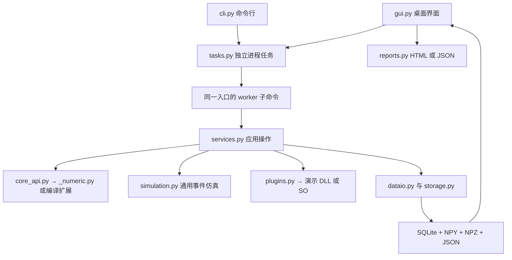

# 基础工程实现与文件说明

版本：0.1.0。更新日期：2026-09-06。本文件说明当前可运行代码；前述技术方案中的完整目标不等同于本轮已实现功能。

## 1. 当前实现范围

| 能力 | 已实现 | 当前边界 |
| --- | --- | --- |
| Python 工程 | src 包布局、CLI、桌面入口、可选 GUI/开发依赖 | Windows/麒麟目标机尚待验证 |
| 文件导入 | 一维 NPY、无表头一列或两列 CSV、采样率校验 | 不猜测未知 BIN；单文件 ≤64 MiB、采样数 ≤1,000,000 |
| 基本算法 | 数学双音数据、均值/RMS/峰值、双边 PSD、STFT 图形矩阵 | 通用科学计算；未实现存在性检测、三参数估计或调制识别 |
| 数据资产 | SQLite 元数据、不可变 NPY 副本、SHA-256、搜索和分页接口 | GUI 最多浏览最近 500 条；未做 20,000 条性能验收 |
| 图形 | I/Q 波形、频谱、时频图、离线瀑布图、缩放与平移 | 波形最多 4096 点抽点预览，不具备按缩放重取高精度数据的能力 |
| 标注 | 单资产文字备注 | 未实现区间标注版本、题库或人员测评 |
| 实验仿真 | A→中继队列→B、单服务资源、时序、在途计数、滑块回放 | 通用消息队列，无无线波形、跳频、同步、TDMA、编码和语音模型 |
| 原生插件 | 清单、平台及摘要校验、复制演示 ABI、子进程调用、输出新资产 | 仅 `demo_copy_f32`；正式 `algorithm_*` 生命周期 SDK 仍为草案 |
| 任务管理 | 独立进程、超时、取消、状态文件、崩溃隔离、日志量检查 | 单个 UI 任务运行；没有进程崩溃后的继续执行或完整启动恢复扫描 |
| 报告 | HTML/JSON、成功运行历史、源资产及环境信息 | HTML 是文本结构化报告；未加入图表内嵌、PDF/Word 输出 |
| 核心编译 | `_numeric.py` 可编译为 Python 扩展，二进制 wheel 排除核心 `.py` | 仅数值模块编译；其他应用模块仍为 Python |
| 桌面打包 | 从编译 wheel 生成 PyInstaller 目录式应用 | 当前 Linux 验证；正式发布签名与目标平台构建待完善 |

本版合并为一个工作台的两个业务页，复用同一任务、资产和报告实现。原设计中“两个独立应用”的发布入口暂未拆分；业务代码已按数值分析、通用仿真和公共模块分开。

## 2. 实际调用关系



GUI 的 QRunnable 只负责等待和监控独立工作进程；Qt 信号将结果送回主线程更新界面。源代码模式调用 `python -m simusignal worker`，冻结模式调用同一应用可执行文件的 `worker` 子命令。参数通过 JSON 文件传递，数组不塞入命令行。

原生库加载、ABI 检查和调用都在 worker 中完成。Python 异常形成错误响应；原生崩溃由父进程退出码判断；超时或取消杀死工作进程。任务日志每次轮询检查 1 MiB 阈值，可能在两次检查之间超过阈值，尚非操作系统级严格磁盘配额。

## 3. 逐文件说明

### 3.1 工程和构建

| 文件 | 说明 |
| --- | --- |
| [README.md](../README.md) | 安装、桌面及 CLI 使用、原生插件、测试和二进制构建步骤 |
| [pyproject.toml](../pyproject.toml) | 项目元数据、核心/GUI/开发依赖、命令行入口、pytest 配置 |
| [setup.py](../setup.py) | 读取 `SIMUSIGNAL_COMPILE_CORE`，Cython 编译数值模块并排除 wheel 内核心 `.py` |
| [requirements-linux-py312.lock](../requirements-linux-py312.lock) | 当前 Linux x86_64 / Python 3.12 验证环境的依赖版本快照，不是跨平台锁文件 |
| [.gitignore](../.gitignore) | 在原规则上增加 DLL 与默认运行数据目录忽略，构建产物不混入源码 |
| [packaging/desktop_entry.py](../packaging/desktop_entry.py) | PyInstaller 入口；GUI、CLI、worker 共用命令分派 |
| [scripts/build_desktop.py](../scripts/build_desktop.py) | 检查编译 wheel，临时安装后构建桌面目录包，避免重新打入原核心源码 |
| [scripts/check_binary.py](../scripts/check_binary.py) | 检查 wheel 只含核心扩展、隔离导入扩展并运行同一组数值测试 |

### 3.2 应用源码

| 文件 | 主要内容及责任 |
| --- | --- |
| [src/simusignal/__init__.py](../src/simusignal/__init__.py) | 应用版本，避免在包初始化时加载 Qt 或原生插件 |
| [src/simusignal/__main__.py](../src/simusignal/__main__.py) | `python -m simusignal` 入口 |
| [src/simusignal/cli.py](../src/simusignal/cli.py) | gui/demo/import/list/analyze/simulate/native/plugin-manifest/export/worker 子命令；可无 GUI 运行 |
| [src/simusignal/core_api.py](../src/simusignal/core_api.py) | 稳定核心入口，公开数据校验、数学演示和通用分析函数，屏蔽源码/扩展差别 |
| [src/simusignal/_numeric.py](../src/simusignal/_numeric.py) | 纯 NumPy 数值实现和 Cython 编译对象；输入检查、基本统计、双边 PSD 和 STFT |
| [src/simusignal/dataio.py](../src/simusignal/dataio.py) | 有限格式导入、字节规模检查、禁用 pickle，明确一列实数与两列 I/Q |
| [src/simusignal/storage.py](../src/simusignal/storage.py) | SQLite V1 建表、短事务、资产摘要、文件读写、备注、成功运行索引与环境记录 |
| [src/simusignal/simulation.py](../src/simusignal/simulation.py) | Scenario 校验与 SimPy 单中继队列；记录每条消息生命周期、排队和模型时间 |
| [src/simusignal/plugins.py](../src/simusignal/plugins.py) | 演示插件清单生成/检查、ctypes 函数类型声明、只读输入及调用方输出缓冲区 |
| [src/simusignal/services.py](../src/simusignal/services.py) | 统一 demo/import/analyze/native/simulate 应用操作，将产物交给资产及运行存储 |
| [src/simusignal/tasks.py](../src/simusignal/tasks.py) | 工作进程命令、JSON 请求响应、超时/取消、日志阈值、任务状态持久化 |
| [src/simusignal/reports.py](../src/simusignal/reports.py) | JSON 与 HTML 报告、HTML 文本转义及暂存替换写入 |
| [src/simusignal/gui.py](../src/simusignal/gui.py) | PySide6 工作台、资产侧栏、四类图形、仿真参数/回放、历史、异步状态与取消 |

### 3.3 测试

| 文件 | 验证内容 |
| --- | --- |
| [tests/test_numeric.py](../tests/test_numeric.py) | 已知常量统计、PSD 积分与能量、负频率保留、短输入、缓存规模、非法数据及可重复性 |
| [tests/test_storage_io.py](../tests/test_storage_io.py) | 中文 CSV/NPY、禁止对象数据、重开数据库、备注、文件篡改、报告转义、失败产物清理 |
| [tests/test_simulation.py](../tests/test_simulation.py) | 时限边界、消息因果顺序、在途与未启动区分、队列串行及确定性 |
| [tests/test_tasks_native.py](../tests/test_tasks_native.py) | 工作进程、失败记录、取消、CMake 编译示例、原生往返、平台错配、崩溃/超时/错误 ABI |
| [tests/test_gui.py](../tests/test_gui.py) | offscreen 实际点击生成/分析/仿真，检查图形、备注、回放、历史和当前页报告导出 |

### 3.4 沿用和扩展的原生示例

| 文件 | 说明 |
| --- | --- |
| [examples/native_plugin/demo_api.h](../examples/native_plugin/demo_api.h) | 简化演示 ABI：版本函数与 float32 数组复制函数，定义调用约定和状态码 |
| [examples/native_plugin/demo_plugin.c](../examples/native_plugin/demo_plugin.c) | 通用复制实现、输出容量与长度检查，零算法业务依赖 |
| [examples/native_plugin/CMakeLists.txt](../examples/native_plugin/CMakeLists.txt) | Windows DLL / Linux SO 构建和导出配置 |
| [examples/native_plugin/host.py](../examples/native_plugin/host.py) | 独立标准库调用样例及五项自检，便于接入方单独调试 |
| [examples/native_plugin/README.md](../examples/native_plugin/README.md) | 原生构建、独立调用、工作台接入说明与验证范围 |

### 3.5 设计与界面文件

| 文件 | 本轮变化 |
| --- | --- |
| [Python技术方案总览.md](Python技术方案总览.md) | 增加基础工程状态及当前共享工作台形态，链接实现清单 |
| [电磁信号分析识别系统_Python技术方案.md](电磁信号分析识别系统_Python技术方案.md) | 标明通用算法、图形、存储及演示插件已实现，识别/估计/教学测评仍待实现 |
| [某星通信仿真系统_Python技术方案.md](某星通信仿真系统_Python技术方案.md) | 标明通用事件模型与专用星地模型的区别及当前已实现的队列/回放 |
| [核心模块二进制化与原生插件接口方案.md](核心模块二进制化与原生插件接口方案.md) | 更新编译构建、当前演示 ABI、工作进程及 SDK 差距 |
| [基础工程实现与文件说明.md](基础工程实现与文件说明.md) | 本文，逐文件说明、代码与设计差异、验证和后续工作 |
| [images/analysis-workbench.png](images/analysis-workbench.png) | 真实 PySide6 程序生成的离线分析界面截图 |
| [images/simulation-workbench.png](images/simulation-workbench.png) | 真实程序生成的事件仿真及回放界面截图 |

## 4. 工作目录与状态

```text
workspace_data/
  catalog.sqlite3
  assets/<asset_id>.npy
  runs/<run_id>/result.json
  runs/<run_id>/plots.npz        # 有图形结果时生成
  jobs/<job_id>/request.json
  jobs/<job_id>/response.json    # 原生崩溃时可能不存在
  jobs/<job_id>/status.json
  jobs/<job_id>/worker.log
```

资产和图形路径使用相对工作目录的位置；原始外部文件不被修改，导入后以 complex64 标准副本存储。没有把完整原文件字节逐字保存在工作目录中，`source` 字段仅记录来源描述。

成功任务结果进入 `runs` 表；失败及取消保存在 `jobs` 状态文件中，暂未提供 GUI 失败历史列表。SQLite 外键防止结果引用不存在资产；普通写入异常会清理未提交产物，进程被强制结束时仍可能留下暂存或孤立文件，完整启动对账/清理留待后续。

每次运行保存应用、Python、NumPy 和系统信息；仿真还保存完整场景，原生处理保存插件清单及库摘要。任务请求保留操作参数。原生动态库依赖链的完整摘要仍未实现。

## 5. 数值与界面约定

内部数据统一为一维 complex64；文件中的一列实数按 Q=0 处理。PSD 为复输入的双边谱，不自动把正频率翻倍；频率轴显示相对基带的偏移。幅度与 RMS 为任意单位，不能作为经过校准的 dBm。

STFT 使用 Hann 窗、有限帧缓存；短数据补零并记录补零长度。大数据的帧间隔和波形预览步长会增大以限制内存，报告记录 hop、点数及抽点状态。时频图与离线瀑布图共享矩阵，分别采用时间/频率的两种轴布局，不代表实时接收能力。

基础仿真采用 SimPy 通用资源队列，使用模型时间推进，独立记录墙钟耗时；结束时已发送但未接收的数据算 pending，尚未生成的数据算 not_started。相同配置事件轨迹可重复，墙钟耗时自然不要求逐次相等。

界面颜色范围在统计区显示；没有正式测量标尺、鼠标区间标注或数据级缩放重取。修改导入采样率不会改变已入库资产的采样率，分析使用该资产保存的元数据。

## 6. 测试与构建验证

当前验证环境：Linux x86_64、CPython 3.12.3、NumPy 2.5.2、PySide6 6.11.2、PyQtGraph 0.14.0、SimPy 4.1.2、Cython 3.3.0。完整工具版本见依赖快照。

- 源码模式：`QT_QPA_PLATFORM=offscreen python -m pytest -q`，34 项通过，包含实际 GUI 操作和原生崩溃/超时隔离。
- 编译模式：生成 `cp312 / linux_x86_64` wheel，确认只包含数值核心 `.so`；使用该扩展运行同一组数值测试，14 项通过。
- 桌面构建：已提供并执行从编译 wheel 构建目录式应用的脚本；实际冻结程序的验证结果见下方发布记录。
- 界面检查：使用 offscreen Qt 生成两张真实截图，核对中文、图形布局和坐标。

这些测试覆盖基础工程正确性，不代替 Windows/麒麟验证、72 小时稳定性、20,000 条规模性能或原始项目的算法性能验收。当前测试中固定原生缓冲区仅用于演示 ABI，不证明正式生命周期 SDK 正确。

发布验证记录：在源码目录之外运行 Linux 冻结程序，完成生成数据、分析、通用仿真、HTML 导出及外置原生插件调用；offscreen GUI 启动后保持运行。检查 PyInstaller 的 PYZ 模块表未包含 `simusignal._numeric` 字节码，包内有对应 `.so`。这证明本轮数值核心的二进制交付链路，不表示其余应用层源码也已本机编译。

本轮 wheel 和桌面验证产物分别生成于 `/tmp/simusignal-wheels` 与 `/tmp/simusignal-desktop-dist`，不混入源代码仓库；可按 README 的命令在正式输出目录重新构建。

## 7. 后续开发顺序

1. 在实际 Windows/麒麟硬件验证安装、Qt 和本机扩展，分别形成平台依赖快照。
2. 根据用户库头文件与参考向量冻结正式 C ABI，实现完整生命周期、输出结构及插件注册 UI；保留现有演示 ABI 作为兼容示例。
3. 补齐大文件分块、图形分辨率分级、完整分页、资产修订、启动恢复和备份恢复。
4. 按独立模型规范接入已有参考模型，报告各项“支持/未配置/不适用”，不以界面占位替代功能验收。
5. 逐步增加模型参考验证、业务测评和正式交付要求，更新原需求追踪矩阵及资源/工期估算。

采用 NumPy 内存映射、Qt 线程池和工作进程调用的依据分别见 [NumPy load](https://numpy.org/doc/stable/reference/generated/numpy.load.html)、[Qt QThreadPool](https://doc.qt.io/qtforpython-6/PySide6/QtCore/QThreadPool.html)、[Python subprocess](https://docs.python.org/3/library/subprocess.html)。库能力只支持上述软件实现，不证明专用模型性能。
