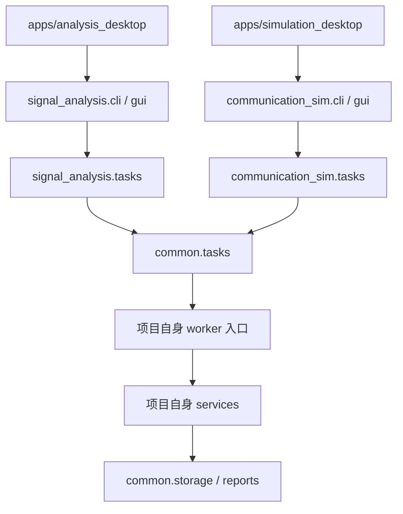

# 分项目工程实现与文件说明

版本：0.2.0。更新日期：2026-09-13。

## 1. 与方案总览一致的实现结构

当前已按“两个独立应用、一个通用基础库”拆分。原 `src/simusignal` 合并包和统一桌面入口已移除，没有保留跨项目标签页切换。

```text
src/
  common/                         # 通用任务、存储、报告和桌面基础组件
  signal_analysis/                # 分析项目业务、界面、CLI、worker 绑定
    ml/                           # AI(ONNX) 检测与 A09 六类调制识别的契约、解码与适配
  communication_sim/              # 仿真项目业务、界面、CLI、worker 绑定
apps/
  analysis_desktop/                # main.py、发布 pyproject.toml、README
  simulation_desktop/              # main.py、发布 pyproject.toml、README
training/                          # 数据集构建、训练与验收脚本（不随 wheel 分发）
  detectors/                      # 第三方检测框架适配器（YOLOX / RT-DETR / Ultralytics + 内置 tiny）
tests/
  common/                         # 依赖边界、项目隔离、共用能力
  analysis/                       # 分析算法、数据、插件、检测/识别、分析 GUI
  simulation/                     # 仿真模型和仿真 GUI
benchmarks/
  run_smoke.py                     # 分别验证两个项目的基础流程耗时
packaging/
  projects.json                    # 独立构建目标、入口、排除包
scripts/
  build_wheels.py                  # 按独立项目清单构建 wheel
  build_desktop.py                 # 按项目 wheel 构建独立桌面应用
  check_binary.py                  # 分析核心二进制回归
examples/native_plugin/            # 分析项目的通用 C ABI 示例
docs/                             # 总览、两项目方案、接口方案和本文件
  algorithms/                     # 信号检测（会话级/逐跳）与调制识别的传统与 AI 算法设计文档（五篇）
  数据管理页面.md                  # 工作区容量口径、一致性检查与安全清理规则
```

| 方面 | 分析项目 | 仿真项目 |
| --- | --- | --- |
| 启动模块 | `python -m signal_analysis gui` | `python -m communication_sim gui` |
| 安装命令入口 | `signal-analysis` | `communication-sim` |
| 发布包名称 | `signal-analysis` | `communication-sim` |
| 桌面产物 | `SignalAnalysis` | `CommunicationSim` |
| 默认数据目录 | `workspace_data/analysis` | `workspace_data/simulation` |
| 业务依赖 | NumPy、官方 SigMF；可选 `onnxruntime`（`.[ml]`）与训练依赖（`.[train]`）；原生插件适配 | SimPy；无需分析模块 |
| GUI | 八个标签页：数据分析、IQ 信号生成、信号检测、跳频参数、调制识别、算法对比、数据管理、运行记录 | 仿真页面与本项目运行历史 |
| 数据库 | 信号资产表、本项目运行记录 | 本项目运行记录，不创建信号资产表 |
| 原生示例接口 | 保留清单与 DLL/SO 复制演示 | 不引入分析插件入口 |

共用源码随两个发布包分别收集。正式部署建议使用各自虚拟环境或各自目录式桌面包；根 `pyproject.toml` 是双项目开发环境，不是两套正式发布清单。

## 2. 依赖和运行路径



`common` 不导入 `signal_analysis` 或 `communication_sim`。各项目任务绑定层向共用进程管理器传递自己的模块名，worker 入口显式注入自己的 `execute`，不在共用层集中识别业务。

分析项目不导入仿真包或 SimPy；仿真项目不导入分析包。数值核心与原生信号插件只存在于分析包。两个桌面均复用公共窗口框架，但各自创建业务界面，仿真窗口没有信号数据侧栏。

## 3. 逐文件说明

### 工程、入口、发布与基准

| 文件 | 职责 |
| --- | --- |
| [README.md](../README.md) | 两项目启动、操作、测试、独立构建和旧数据说明 |
| [pyproject.toml](../pyproject.toml) | 双项目开发依赖、两个 console scripts 和测试配置 |
| [setup.py](../setup.py) | 分析数值核心 Cython 编译和核心源码排除；由独立构建脚本复用 |
| [requirements-linux-py312.lock](../requirements-linux-py312.lock) | Linux/Python 3.12 开发环境依赖快照；其他平台单独验证 |
| [.gitignore](../.gitignore) | 忽略虚拟环境、工作数据、编译动态库及构建文件 |
| [apps/analysis_desktop/main.py](../apps/analysis_desktop/main.py) | 分析程序及其冻结 worker 的专用入口 |
| [apps/analysis_desktop/pyproject.toml](../apps/analysis_desktop/pyproject.toml) | 分析正式包元数据、NumPy / SigMF 依赖和包收集范围 |
| [apps/analysis_desktop/README.md](../apps/analysis_desktop/README.md) | 分析项目独立使用与构建说明 |
| [apps/simulation_desktop/main.py](../apps/simulation_desktop/main.py) | 仿真程序及其冻结 worker 的专用入口 |
| [apps/simulation_desktop/pyproject.toml](../apps/simulation_desktop/pyproject.toml) | 仿真正式包元数据、SimPy 依赖和包收集范围 |
| [apps/simulation_desktop/README.md](../apps/simulation_desktop/README.md) | 仿真项目独立使用与构建说明 |
| [packaging/projects.json](../packaging/projects.json) | 项目包名、入口目录、产物名及必须排除的另一项目模块 |
| [scripts/build_wheels.py](../scripts/build_wheels.py) | 暂存本项目业务与 common，读取本项目清单，单独构建 wheel |
| [scripts/build_desktop.py](../scripts/build_desktop.py) | 验证 wheel 归属，分别构建桌面并排除另一项目 |
| [scripts/check_binary.py](../scripts/check_binary.py) | 检查分析 wheel 的 `_numeric` 扩展、核心源码排除与内置调制识别模型，并在解包目录运行数值与检测回归 |
| [benchmarks/run_smoke.py](../benchmarks/run_smoke.py) | 按项目运行小规模分析或仿真任务，输出真实耗时；不作合同性能承诺 |
| [benchmarks/ai_detect_sweep.py](../benchmarks/ai_detect_sweep.py) | AI 检测扫档基准：固定模型与数据集，按阈值/SNR 扫出固定虚警率下的检测率与分档召回；`--selfcheck` 先重放同一批候选再比对，两次结果不一致即报错（防止“扫档数字不可复现”），输出契约 `ai_detect_sweep_v1` |

### 共用基础库

| 文件 | 职责 |
| --- | --- |
| [`src/common/__init__.py`](../src/common/__init__.py) | 公共代码版本；不加载业务包 |
| [src/common/storage.py](../src/common/storage.py) | UTC 时间、文件摘要、项目目录标识、SQLite 运行索引、通用产物保存及异常清理 |
| [src/common/tasks.py](../src/common/tasks.py) | 注入项目入口的独立进程、JSON 请求响应、超时、取消、崩溃及日志阈值 |
| [src/common/reports.py](../src/common/reports.py) | JSON/HTML 报告、HTML 转义和暂存替换 |
| [src/common/gui.py](../src/common/gui.py) | 共用窗口框架、主题、任务状态、取消、历史和报告；业务页面由子类提供，并提供 `result_status()` 钩子供只读页面改写完成文案 |

### 分析项目

| 文件 | 职责 |
| --- | --- |
| [`src/signal_analysis/__init__.py`](../src/signal_analysis/__init__.py) | 分析包版本 |
| [`src/signal_analysis/__main__.py`](../src/signal_analysis/__main__.py) | 分析 `python -m` 入口 |
| [src/signal_analysis/cli.py](../src/signal_analysis/cli.py) | 分析命令及默认数据目录，含 generate 规格生成、detect、detect-hops、ml-detect、ml-detect-hops、amc-classify、amc-iq-classify、ml-manifest、amc-manifest 与 amc-iq-manifest，不注册 simulate 命令 |
| [src/signal_analysis/gui.py](../src/signal_analysis/gui.py) | 独立分析界面的八个标签页：数据分析（资产列表、备注、四类图形含星座图与固定时长滚动瀑布图、波形/频谱固定显示范围、概览与实时播放两种方式；侧栏采样率仅用于导入）、IQ 信号生成（多信号合成、带限噪声与“数学双音演示”入口，演示点数 = 页内采样率 × 持续时间）、信号检测、跳频参数、调制识别（特征清单与原始 IQ 清单两个分支）、算法对比、数据管理（工作区与额外目录容量盘点、索引一致性核对、白名单安全清理，见[数据管理页面](数据管理页面.md)）与运行记录（含原生示例）；数据分析/信号检测/跳频参数三页共用同一“频率显示”语义（自动按 PSD 镜像判实数记录、双边、仅正频率），同页内的谱线、时频图与检测框/逐跳框孄用同一频率子集，时频图按“行 = 时间、列 = 频率”绘制 |
| [src/signal_analysis/maintenance.py](../src/signal_analysis/maintenance.py) | 工作区数据盘点与安全清理（只依赖标准库，不引入 NumPy）：按目录统计字节与文件数（不重算 SHA-256、不跟随目录符号链接）、按 `kind` 归并运行记录并量化索引冗余、一致性检查（未入库文件、入库但文件缺失、未入库运行目录、原子写残留、源资产已删除）、按保留天数生成清理候选（运行中任务计入跳过）、清理前重算候选防 TOCTOU 与路径白名单护栏、审计日志 `maintenance.log`；口径与规则见[数据管理页面](数据管理页面.md) |
| [src/signal_analysis/tasks.py](../src/signal_analysis/tasks.py) | 绑定分析 worker、提前验证项目数据目录 |
| [src/signal_analysis/services.py](../src/signal_analysis/services.py) | 生成、IQ 生成、导入、分析、detect、detect_hops、ml_detect、ml_detect_hops、amc_classify、amc_iq_classify、storage_report、storage_cleanup 与原生复制业务，负责附加生成器真值与检测基线，不分派仿真；两个 storage 动作刻意不写运行记录 |
| [src/signal_analysis/storage.py](../src/signal_analysis/storage.py) | 分析资产表、不可变 NPY、摘要检查、备注和资产引用校验 |
| [src/signal_analysis/dataio.py](../src/signal_analysis/dataio.py) | NPY/CSV/交织 IQ 二进制导入导出、禁用 pickle、文件及样本规模限制 |
| [src/signal_analysis/sigmf_io.py](../src/signal_analysis/sigmf_io.py) | 官方 sigmf 1.11.1 双文件读写适配，采样率和格式约束、暂存导出及失败清理；元数据通过 storage 的 asset_metadata 表保存 |
| [tests/analysis/test_sigmf_io.py](../tests/analysis/test_sigmf_io.py) | 官方库互读、大小端及整数缩放、CLI 自动采样率、资产元数据和异常边界 |
| [src/signal_analysis/core_api.py](../src/signal_analysis/core_api.py) | 源码与二进制共用的稳定数值接口 |
| [src/signal_analysis/_numeric.py](../src/signal_analysis/_numeric.py) | 输入校验、数学双音、均值/RMS/峰值、双边 PSD、STFT、星座点与单帧频谱行、数字/模拟启发式判定、IQ 信号生成器（9 种调制样式）、能量检测 `detect_signals`（三参数、带内信噪比、跳频会话合并）及跳频逐跳参数估计 `detect_hops`（逐帧游程 + 时频脊线跟踪、细网格频带复算、会话归并、可分辨性出口）；可编译 |
| [src/signal_analysis/evaluation.py](../src/signal_analysis/evaluation.py) | 纯 NumPy 的评分口径：生成器真值折算（`signal_truth`、逐跳的 `hop_truth`）与检测匹配/误差统计（`evaluate_detections`），同时持有冻结的 `detect_result_v1` 与 `fh_hops_v1` 契约，GUI、CLI、基准与训练脚本共用同一份 |
| [src/signal_analysis/plugins.py](../src/signal_analysis/plugins.py) | 原生复制清单、平台/摘要检查、ctypes 调用及缓冲区所有权 |
| [`src/signal_analysis/ml/__init__.py`](../src/signal_analysis/ml/__init__.py) | AI/机器学习接入层：只依赖 NumPy 与标准库，`onnxruntime` 在工作进程内惰性加载 |
| [src/signal_analysis/ml/tensor.py](../src/signal_analysis/ml/tensor.py) | 时频图张量构造与归一化（`tf_image_v1`）、行列到频率/时间的坐标映射、同一口径的带内辐射量测量 |
| [src/signal_analysis/ml/manifest.py](../src/signal_analysis/ml/manifest.py) | 模型清单定义、校验与生成，固定“模型文件 + 输入输出契约 + 训练出处” |
| [src/signal_analysis/ml/decode.py](../src/signal_analysis/ml/decode.py) | 网络输出解码 `normalized_boxes_v1`（边框→频段/时间区间）与按 IoU 去重 |
| [src/signal_analysis/ml/runtime.py](../src/signal_analysis/ml/runtime.py) | onnxruntime 惰性加载与可用性探测（含最低版本校验）、按计算线程数建会话；未安装时给可执行提示，不回退演示结果。另提供原始 IQ 分类器的 `IQModelRunner`（强制 `(1, 2, N)` 输入形状与清单窗口长度） |
| [src/signal_analysis/ml/detector.py](../src/signal_analysis/ml/detector.py) | AI 检测：时频图 → ONNX 推理 → 冻结的 `detect_result_v1`，并在同一次运行中给出能量检测基线供并排对比；同一模块内的 `ml_detect_hops` 走逐跳模型（需清单声明 `per_hop_v1`），把框交给传统逐跳的测量与会话归并逻辑后输出 `fh_hops_v1` |
| [src/signal_analysis/ml/amc.py](../src/signal_analysis/ml/amc.py) | A09 六类调制识别：34 维确定性特征（`amc_feature_vector_v1`）、线性判别模型（`amc_model_v1`）、结果契约 `amc_classify_v1`、低信噪比提示与 `pending` 待确认项 |
| [src/signal_analysis/ml/amc_default.json](../src/signal_analysis/ml/amc_default.json) | 随包分发的默认调制识别模型 `amc-linear-default`，作为包数据打入 wheel |
| [src/signal_analysis/ml/iq.py](../src/signal_analysis/ml/iq.py) | 原始 IQ 分类通路：波形契约 `iq_waveform_v1`（`(2, N)` 行优先、单位 RMS）、清单读写（窗口长度/类别字典/前端口径/声明式默认频带）、ONNX 打分 `iq_scores` 与结果契约 `amc_iq_classify_v1`（波形摘要、带内信噪比粗估、可信度提示、`pending`）；前端抽取与 `ml/amc.py` 共用同一份实现 |

### 训练与数据集（不进发布包）

训练脚本只依赖项目自身生成器与 `src/signal_analysis/ml` 的契约模块，训练依赖（torch / onnx）为额外可选项 `.[train]`；`train_yolox.py`、`tiny_detector.py`、`amc_transformer.py` 在未安装训练依赖时由测试显式跳过，不进入 wheel 与桌面包。第三方检测框架（YOLOX / RT-DETR / Ultralytics）**不是必需依赖**：适配器只在被调用时检查自身是否安装，未安装即给出安装提示；`--dataset-only` 与 `--onnx` 两条路径都不需要框架的 Python 包。AGPL-3.0 的框架受硬门禁约束（需显式 `--allow-copyleft`，清单标 `distributable: false`），不进入发行包。

| 文件 | 职责 |
| --- | --- |
| [training/README.md](../training/README.md) | 训练-推理契约（唯一真相）、跳频会话语义、数据集构建、训练、验收、实测指标、许可证与命令速查 |
| [training/build_dataset.py](../training/build_dataset.py) | 检测数据集：生成器真值直接变成时频图与边框标签，图像构造复用推理端同一模块；`--labels {session,hop}` 选择会话级或逐跳标签，后者在跳频会话上用 `evaluation.hop_truth` 出一跳一个框 |
| [training/tiny_detector.py](../training/tiny_detector.py) | 自研最小无锚框检测头，在不引入第三方检测库的前提下产出契约合规的 ONNX |
| [training/train_yolox.py](../training/train_yolox.py) | 检测模型训练 + ONNX 导出，用项目自身评测口径在验证集打分并写模型清单；开训前做标签量化守卫（最小标签边不得小于输出网格步长、单样本框数不得超过 `--max-boxes`） |
| [training/verify_onnx.py](../training/verify_onnx.py) | 检测模型验收（C02）：清单/摘要、输入输出契约、端到端推理与跨导出的数值一致性；清单为 `per_hop_v1` 时自动改跑逐跳链路（`ml_detect_hops` + `fh_hops_v1` 评分） |
| [training/export_contract.py](../training/export_contract.py) | 第三方检测框架的统一接入入口：`--list-frameworks` / `--list-layouts` 自描述，三条路径（`--dataset-only` 导出原生数据集、`--onnx` 把已导出的图改写成契约图 + 写清单、默认 torch 路径供 `tiny` 自训练） |
| [training/detectors/](../training/detectors/) | 检测器适配器包：`registry.py`（注册表 + 许可证门禁）、`base.py`（适配器基类与导出流程）、`contract.py`（`normalized_boxes_v1` 输出布局表）、`dataset.py`（数据集卡与记录加载）、`labels.py`（YOLO/COCO 标签导出，纯标准库写灰度 PNG）、`torch_export.py`（PyTorch 侧契约头 + ONNX 导出）、`onnx_contract.py`（纯 ONNX 图改写：烘输入预处理 + 输出几何转换）、`tiny.py` / `yolox.py` / `rtdetr.py` / `ultralytics.py`（四个框架适配器） |
| [training/build_amc_dataset.py](../training/build_amc_dataset.py) | A09 数据集：单信号场景 → 定长特征向量，记录含场景参数、分析窗口、真值与未取整信息 |
| [training/train_amc.py](../training/train_amc.py) | 线性判别基线（确定性，写入内置模型）与可选 Transformer + ONNX 分支 |
| [training/amc_transformer.py](../training/amc_transformer.py) | 与线性基线共用同一特征向量契约的深度模型分支（可选） |
| [training/verify_amc.py](../training/verify_amc.py) | A09 验收：数据集契约、线性基线分层指标、ONNX 分类器一致率；退出码区分通过/失败/缺运行时 |
| [training/torchsig_bundle.py](../training/torchsig_bundle.py) | 自描述中间格式 `torchsig_bundle_v1` 的读写（`manifest.json` + 每条记录 `iq.npy`/`meta.json`），把外部生成器与项目数据契约隔离；只用 NumPy，不导入 TorchSig |
| [training/build_torchsig.py](../training/build_torchsig.py) | 调 TorchSig 生成 IQ 与实例级元数据并写成 bundle（**唯一需要 TorchSig 的环节**，依赖 `.[torchsig]`） |
| [training/ingest_torchsig.py](../training/ingest_torchsig.py) | bundle → `tf_image_v1` 检测数据集（时频图 + `normalized_boxes_v1` 框），校验框数与图像可达性；逐跳标签直接拒绝 |
| [training/iq_cnn.py](../training/iq_cnn.py) | 原始 IQ 分类的两个基线：`IQCNN`（步长卷积）与 `IQTCN`（膨胀因果残差），softmax 写进图内、按 batch=1 导出 ONNX；模块级导入 torch（只在 `.[train]` 下使用） |
| [training/build_iq_dataset.py](../training/build_iq_dataset.py) | `iq_waveform_v1` 数据集：随机场景 → 定长 IQ 窗口（每个窗口由推理端 `iq_waveform` 产出）、类内分层划分、同种子字节可复现；凑不满窗口重抽而不补零；可选按**显式类名映射**混入 TorchSig bundle（未映射类名原样记录并跳过） |
| [training/train_iq.py](../training/train_iq.py) | IQ 分类训练 + ONNX 导出 + 清单，再用 ONNX 入口重算验证集（两条路径准确率必须一致），打印分 SNR 档位与混淆矩阵 |
| [training/verify_iq.py](../training/verify_iq.py) | 原始 IQ 通路验收：清单/图形状/4 个确定性场景端到端/重复推理一致/数据集独立验证；退出码区分通过/失败/缺运行时 |
| [training/iq_map.example.json](../training/iq_map.example.json) | `--torchsig-map` 的占位示例：左边是 bundle 里真实出现的 TorchSig 类名（需自行替换），右边是项目类别 |

### 算法设计文档（`docs/algorithms/`）

五篇文档按“传统算法 / AI 算法 × 信号检测 / 调制识别”矩阵编写（信号检测分**会话级**与**逐跳**两篇），每篇包含算法思路、公式、流程图、
输入与输出参数、设计局限与可改进方向与参考文献（跳频逐跳一篇另含与会话结果的关系和实测结果）；公式与常量均以已实现代码为准核对，与本文档的
算法标识、契约名保持一致。

| 文件 | 对应算法标识 | 契约 |
| --- | --- | --- |
| [docs/algorithms/信号检测_传统能量检测.md](algorithms/信号检测_传统能量检测.md) | `energy_detect_v1` | `detect_result_v1`、`inband_snr_v1` |
| [docs/algorithms/信号检测_跳频逐跳参数估计.md](algorithms/信号检测_跳频逐跳参数估计.md) | `hop_track_v1`；同一契约的 AI 通路 `ml_detect_hops:<模型 id>`（见 AI 篇 §7） | `fh_hops_v1`、`inband_snr_v1` |
| [docs/algorithms/信号检测_AI时频图检测.md](algorithms/信号检测_AI时频图检测.md) | `ml_detect:<模型 id>`（会话级）、`ml_detect_hops:<模型 id>`（逐跳，§7） | `tf_image_v1`、`time_frequency_grayscale_v1`、`normalized_boxes_v1`、`detect_result_v1`、`fh_hops_v1` |
| [docs/algorithms/调制识别_传统特征与启发式判定.md](algorithms/调制识别_传统特征与启发式判定.md) | `heuristic_digital_analog_v1` | `amc_classify_v1` |
| [docs/algorithms/调制识别_AI特征学习.md](algorithms/调制识别_AI特征学习.md) | `amc_linear_v1` / `amc_onnx_v1`；原始 IQ 通路（§7） | `amc_feature_vector_v1`、`amc_model_v1`、`amc_classify_v1`；`iq_waveform_v1`、`amc_iq_classify_v1` |

### 工程与运维文档

| 文件 | 内容 |
| --- | --- |
| [docs/数据管理页面.md](数据管理页面.md) | “数据管理”标签页的目标与边界、工作区数据布局、容量口径（含索引冗余与零除）、`storage_report_v1` 字段表与扫描流程、五类一致性判据、安全清理三道护栏与审计日志、控件说明、与服务层/命令行入口的对应及已知局限 |

### 仿真项目

| 文件 | 职责 |
| --- | --- |
| [`src/communication_sim/__init__.py`](../src/communication_sim/__init__.py) | 仿真包版本 |
| [`src/communication_sim/__main__.py`](../src/communication_sim/__main__.py) | 仿真 `python -m` 入口 |
| [src/communication_sim/cli.py](../src/communication_sim/cli.py) | 仿真命令、运行列表和报告，不注册分析或插件命令 |
| [src/communication_sim/gui.py](../src/communication_sim/gui.py) | 独立场景参数、时间轴、事件表、回放和历史 |
| [src/communication_sim/tasks.py](../src/communication_sim/tasks.py) | 绑定仿真 worker、验证仿真目录 |
| [src/communication_sim/services.py](../src/communication_sim/services.py) | 仿真运行与归档，不加载分析业务 |
| [src/communication_sim/storage.py](../src/communication_sim/storage.py) | 仿真项目目录及独立运行库，复用通用存储 |
| [src/communication_sim/simulation.py](../src/communication_sim/simulation.py) | SimPy 通用队列模型、场景校验、时序与完成统计 |

### 测试与沿用示例

| 文件 | 验证内容 |
| --- | --- |
| [tests/common/test_boundaries.py](../tests/common/test_boundaries.py) | 静态/运行时依赖边界、项目目录隔离、仿真无资产表、旧数据库保护和共用回滚 |
| [tests/analysis/test_numeric.py](../tests/analysis/test_numeric.py) | 已知统计、PSD 能量、负频率、短输入、缓存上限、数学校验、数字/模拟判定、星座数组及单帧频谱行对齐 |
| [tests/analysis/test_storage_io.py](../tests/analysis/test_storage_io.py) | 导入、对象数组拒绝、资产篡改、备注、结果归档、失败引用及 HTML 报告的检测/识别指标表（含缺值 `--` 与转义） |
| [tests/analysis/test_maintenance.py](../tests/analysis/test_maintenance.py) | 数据盘点与安全清理（19 项，不需 GUI）：容量口径与磁盘一致、按 `kind` 归并、索引冗余小于总占用、四类一致性问题、保留期与运行中任务过滤、路径白名单（`../`/绝对路径/`exports/`/已入库运行目录一律跳过）、审计日志追加、`format_bytes` 边界与设置往返，以及报告可通过 `json.dumps(..., allow_nan=False)` |
| [tests/analysis/test_detect.py](../tests/analysis/test_detect.py) | 能量检测的三参数、带内信噪比口径、幅值/时长边界与跳频会话合并（一段会话一个实例） |
| [tests/analysis/test_detect_hops.py](../tests/analysis/test_detect_hops.py) | 跳频逐跳参数估计（54 项）：配置校验、游程/跟踪几何、驻留重测、细网格频带复算、会话归并、可分辨性与 `reason`、真值并集与会话级一致、服务层“不适用”与 CLI/GUI/报告路由、时频图方向与频率显示 |
| [tests/analysis/test_ml_detect.py](../tests/analysis/test_ml_detect.py) | AI 检测路径：清单校验、图像契约、框解码、带内辐射量同口径及基线与 AI 并排对比 |
| [tests/analysis/test_ml_detect_hops.py](../tests/analysis/test_ml_detect_hops.py) | AI 逐跳通路：清单语义门禁、真值框→跳的几何一致性、逐跳字段完备、`model_confidence` 可追溯、基线与传统逐跳开关、服务层与 CLI/GUI/报告路由 |
| [tests/analysis/test_dataset_labels.py](../tests/analysis/test_dataset_labels.py) | 数据集标签语义（`session_v1` / `per_hop_v1`）与训练侧量化守卫：粗网格、亚像素标签、框数超限的拒绝，以及验收按匹配粒度评分 |
| [tests/analysis/test_amc.py](../tests/analysis/test_amc.py) | A09 六类特征契约、短记录拒绝、模型保存/加载校验、真值与“不适用”计数、CLI/GUI 路由及算法对比页内容 |
| [tests/analysis/test_iq.py](../tests/analysis/test_iq.py) | 原始 IQ 通路：波形契约与归一化、短窗口拒绝（不补零）、窗口范围、清单往返与路径/类别/前端拒绝、`iq_scores` 与 `amc_iq_classify` 端到端、低信噪比与低置信度标、`IQModelRunner` 形状与运行时版本门禁、服务层真值“不适用”、CLI/GUI 路由与渲染 |
| [tests/analysis/test_torchsig_ingest.py](../tests/analysis/test_torchsig_ingest.py) | `torchsig_bundle_v1` 读写与校验、ingest 拒绝路径（框数/亚像素标签/逐跳标签）与 `tf_image_v1` 契约字段；**不需要安装 TorchSig** |
| [tests/analysis/test_iq_training_tools.py](../tests/analysis/test_iq_training_tools.py) | IQ 数据集与训练工具链（16 项）：数据集卡与推理契约一致、窗口可从记录场景复现、字节可复现、宽类别字典、参数拒绝、类名映射缺失/非法、混合 TorchSig 的跳过计数与 layout 冲突、旁举例映射文件仍指向冻结类别、`train_iq` 的契约校验/划分/分档、脚本不在模块级导入 torch、模型形状、小规模训练能学到且导出一致 |
| [tests/analysis/test_ai_detect_sweep.py](../tests/analysis/test_ai_detect_sweep.py) | AI 检测扫档基准：固定虚警率下的检测率口径、按 SNR 分档、输出契约 `ai_detect_sweep_v1` 与 `--selfcheck` 重放一致性 |
| [tests/analysis/test_training_tools.py](../tests/analysis/test_training_tools.py) | 训练脚本的数据集/清单可运行性与缺依赖时的跳过行为 |
| [tests/analysis/test_tasks_native.py](../tests/analysis/test_tasks_native.py) | 进程、取消、清单、原生调用、错误 ABI、崩溃和超时 |
| [tests/analysis/test_iqgen.py](../tests/analysis/test_iqgen.py) | 9 种调制样式的长度/有限性/功率/带宽/带内 SNR/跳频/复现性与非法参数 |
| [tests/analysis/test_dataio_iq.py](../tests/analysis/test_dataio_iq.py) | NPY/CSV/交织 IQ 二进制回环、int16 量化、大小端与截断拒绝 |
| [tests/analysis/test_gui_analysis.py](../tests/analysis/test_gui_analysis.py) | 八个标签页、生成/分析、图形、星座图与手动判定、固定显示范围、实时播放与滚动瀑布图、备注、报告、IQ 生成页、检测工作流与算法对比页、检测页频率显示与时频图方向（亮斑坐标必须与检测中心频率/时刻一致，转置绘制会立即失败）、数据管理页的扫描/预览门禁与“扫描与导出不写运行记录” |
| [tests/simulation/test_simulation.py](../tests/simulation/test_simulation.py) | 边界时间、消息因果、在途计数、队列串行和可重复性 |
| [tests/simulation/test_gui_simulation.py](../tests/simulation/test_gui_simulation.py) | 独立仿真窗口、无分析控件、真实 worker、事件回放及历史 |
| [examples/native_plugin/demo_api.h](../examples/native_plugin/demo_api.h) | 沿用简化 C ABI，不作为正式算法 SDK |
| [examples/native_plugin/demo_plugin.c](../examples/native_plugin/demo_plugin.c) | 沿用 float32 数组复制和容量检查 |
| [examples/native_plugin/CMakeLists.txt](../examples/native_plugin/CMakeLists.txt) | Windows DLL / Linux SO 示例构建 |
| [examples/native_plugin/host.py](../examples/native_plugin/host.py) | 可独立运行的标准库调用示例 |
| [examples/native_plugin/README.md](../examples/native_plugin/README.md) | 构建及分析项目接入说明 |

## 4. 当前能力边界

SigMF 增量验证（Windows / CPython 3.13 / sigmf 1.11.1）：执行 `python -m pytest tests/analysis tests/common -q -rs`，结果 **129 passed、5 skipped**。通过项包括官方库双文件互读、GUI 生成与导入、CLI 自动采样率、元数据保存、整数缩放、校验和拒绝、损坏文件及导出失败清理。5 项原生插件测试因缺少 CMake / Unix C 编译器跳过，不计作通过；本次未验证冻结桌面产物或麒麟环境。

本节其余数字为 Linux / CPython 3.12.3 实测（2026-09-11，其后随逐跳参数估计、AI 逐跳通路与原始 IQ 通路实现复测更新）：全量回归 `QT_QPA_PLATFORM=offscreen .venv/bin/python -m pytest -q` → **587 passed、8 skipped**（其中 `tests/analysis/test_detect_hops.py` 的 54 项为逐跳参数估计用例、`tests/analysis/test_ml_detect_hops.py` 的 17 项为 AI 逐跳通路用例、`tests/analysis/test_dataset_labels.py` 的 14 项为标签语义与量化守卫用例、`tests/analysis/test_detector_adapters.py` 的 40 项检测器适配器测试在**未安装任何第三方检测框架**的机器上即可全绿；原始 IQ 通路的 `tests/analysis/test_iq.py` 31 项、训练侧工具链 `tests/analysis/test_iq_training_tools.py` 16 项、TorchSig bundle 转换 `tests/analysis/test_torchsig_ingest.py` 37 项与固定虚警率扫描 `tests/analysis/test_ai_detect_sweep.py` 26 项均在**未安装 `torchsig`** 的机器上通过）。仿真一侧 `scripts/build_wheels.py simulation` 与 `scripts/build_desktop.py simulation <wheel>` 同样通过，产出 `dist/CommunicationSim` 且 `--help` 正常；仿真模型仍是纯 Python，`check_binary.py` 只针对分析项目的编译 wheel，不适用于它。打包回归 `scripts/build_wheels.py analysis --compile-core` 后 `scripts/check_binary.py <wheel>` → **157 passed**（在解包目录用编译扩展跑数值与检测测试，包含逐跳参数估计与 AI 逐跳估计用例，并校验核心源码已排除、内置调制识别模型可加载）；`scripts/build_desktop.py analysis <wheel>` 产出 `dist/SignalAnalysis`，用该冻结产物执行 `generate → detect → amc-classify → export` 全链路通过（QPSK 场景识别为 `qpsk`、置信度 0.9995、`truth_hit=true`，HTML 报告含预测表与“尚未确认项”）。麒麟与 Windows 冻结产物仍未验证。

打包注意：调制识别的内置模型 `amc_default.json` 是运行时资源而不是源码，必须同时写进发布清单的 `[tool.setuptools.package-data]`（`apps/analysis_desktop/pyproject.toml`）与冻结收集范围（`packaging/projects.json` 的 `collect_data`）；只靠 `--collect-submodules` 收 `.py` 会漏掉它，且直到用户机器上运行才暴露。

SigMF 导出与导入现已接入，详细格式限制见技术方案 §4.1。内部资产仍为 NPY，新增元数据关联表；外部 SigMF 标注仅原样留存，不代表已经实现区间标注工作台。

此前工作的重构（目录、依赖、入口、存储和交付）仍然成立，基础功能也已保留，但**分析侧已不再是通用数值算法与可视化：** 能量检测与三参数估计、跳频逐跳参数估计（含 AI 逐跳通路 `ml_detect_hops`）、可选 AI（ONNX）检测、A09 六类调制识别、双路径并排对比与报告指标表均已实现并有测试覆盖（接口与实测数据见技术方案 §4.6～§4.10）。**仍未实现：区间标注工作台、人工识别训练（A05）、符号速率估计、AM 消息侧带还原与功率标定元数据（§5.3）**；仿真仍为通用消息队列，没有专用星地波形、跳频、同步、TDMA、编码或语音模型。

检测与调制识别的交付口径（与界面、CLI、报告保持一致）：

* 检测结果沿用冻结契约 `detect_result_v1`，参数为**中心频率、占用带宽、起止时间**，并附功率与带内信噪比（`inband_snr_v1`）；无生成器真值时只给结果不评指标。
* 跳频信号按“一段会话一个检测实例”合并（时间间隔 ≤ 3×最大子带带宽且时间重叠 ≤ 较短者时长的 20%），与生成器 `snr_inband_db` 的会话口径一致。需要**逐跳**信息（跳频点、跳时刻、驻留、跳速、占空比）时用另一条通路 `detect-hops`（契约 `fh_hops_v1`、算法 `hop_track_v1`，同一份时频图上的逐帧游程 + 时频脊线跟踪）：会话级与逐跳口径的带内信噪比定义相同、粒度不同，报告里并排列出两套指标；跳频真值只在生成器产出且记录了生成摘要时存在，否则显式标“不适用”。逐跳通路还有对应的 **AI 版本** `ml-detect-hops`（算法标识 `ml_detect_hops:<模型 id>`，只接受清单声明 `label_semantics = per_hop_v1` 的模型）：网络在时频图上直接给出逐跳候选框，框之后的驻留/功率/带宽/SNR 重测与会话归并**复用同一套逐跳逻辑**，因此两种逐跳结果的物理量可直接并排比较，报告里另外给出 AI 逐跳/传统逐跳/会话级三列指标；每条 AI 逐跳明细多一个 `model_confidence`（网络分数，非概率）用于追溯。
* 含载波的调幅信号在频谱上是对称双边带，占用带宽约为消息带宽的两倍；结果保留能量占用带及其中心，不当作消息带宽，也不单独取载波峰。
* 调制识别类别字典固定为 FM/SSB/2ASK/QPSK/16QAM/64QAM，特征契约 `amc_feature_vector_v1`、结果契约 `amc_classify_v1`；`am` 与跳频样式计为“不适用”而不强行归类，无法映射的样本不丢弃、不静默跳过。
* 调制识别另有一条**原始 IQ 通路**（§4.8.1）：输入契约 `iq_waveform_v1`（`(2, N)`、单位 RMS、`64 ≤ N ≤ 65536`）、结果契约 `amc_iq_classify_v1`，类别字典由模型清单声明（`a09` 或 `custom`，≤ 64 类）。两条通路的输入契约是硬门禁、**不能互换**；窗口长度必须与清单一致，过短/过长直接报错而**不补零**；该通路没有确定性特征，因此不提供传统启发式对照行（界面显示“不适用”）。结果同样带 `pending`（合格门限未确认），低信噪比/低置信度只标注“仅供参考”。
* 实测只报原始数字：仓库内合成数据验证集准确率 0.8250、宏平均 F1 0.8246，带内 SNR ≥ 10 dB 时 ≥ 0.97，10 dB 以下 16QAM 与 64QAM 互相混淆是主要误差源；**准确率合格门限仍为待确认项**，因此不做通过/不通过判定。
* 检测的三条路径（会话级 `detect`、逐跳 `detect-hops`、AI 逐跳 `ml-detect-hops`）与三条识别路径（传统特征、特征学习、原始 IQ）的算法思路、公式、流程图、输入输出参数、参考文献、设计局限与可改进方向见 [`docs/algorithms/`](algorithms/) 下五篇设计文档；本文档只记录交付口径与能力边界。
* **外部数据源只作为补充。** TorchSig（MIT）可选接入：`build_torchsig.py` 把它转成自描述的 `torchsig_bundle_v1`，再由 `ingest_torchsig.py`（→ `tf_image_v1` 检测数据集）或 `build_iq_dataset.py --torchsig-bundle --torchsig-map`（→ `iq_waveform_v1` 分类数据集）消费；bundle 与其生成物只落本地目录，**不随产品分发**，训练侧读端也不依赖 TorchSig。它的类别语义不继承：映射必须显式给出，未映射的类名原样记入数据集卡的 `unmapped_classes` 并跳过该记录，映射目标非法则报错。

分析项目新增信号 IQ 生成能力：9 种调制样式（AM/FM/SSB/2ASK/QPSK/16QAM/64QAM/FH-2FSK 遥控/FH-OFDM 图传）按目标带宽自动推导调制参数，支持多信号合成、带限背景噪声（带内 SNR 或绝对功率）与 NPY/CSV/交织 IQ 二进制导出，作为检测/参数估计/调制识别算法的测试信号源；生成的 IQ 为复基带记录，不含载频，"频点"指基带偏移。噪声按功率谱密度 $N_0$ 折算带内信噪比，填写值指最强信号的带内 SNR，各信号的 `snr_inband_db` 一并写入摘要。

原生接口仍为 `demo_copy_f32` 演示 ABI，完整 `algorithm_*` SDK 待开发。数值核心编译范围仅为 `signal_analysis._numeric`，仿真模型仍为 Python。

文件限制仍为 512 MiB / 16,000,000 个采样，GUI 资产浏览最多 500 条；PSD 为复输入双边谱，幅度无绝对标定；波形及 STFT 为有限缓存预览。备注没有修订历史，暂不提供正式备份恢复或任务断点续算。

## 5. 数据隔离

每个目录创建 `project.json`，其中 `project` 为对应业务包名。用户显式指定同一目录给另一项目时会收到错误，不会混用数据库。仿真数据库只有运行索引，不建立分析资产表。

通用运行表用 `source_id` 表示可选来源；分析层在保存前验证资产是否存在，并在分析结果中保留 `asset_id`，文件摘要、短事务、异常产物清理和任务状态记录。
