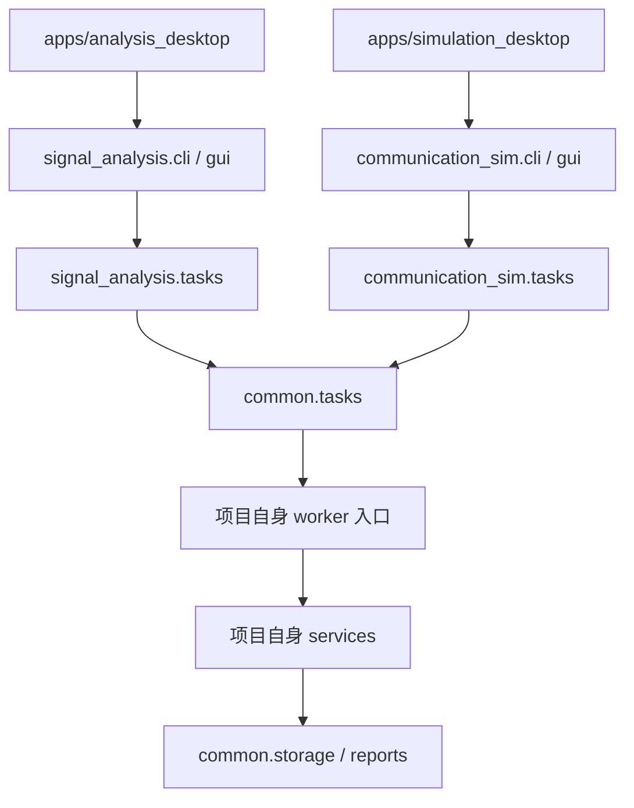

# 分项目工程实现与文件说明

版本：0.2.0。更新日期：2026-09-07。

## 1. 与方案总览一致的实现结构

当前已按“两个独立应用、一个通用基础库”拆分。原 `src/simusignal` 合并包和统一桌面入口已移除，没有保留跨项目标签页切换。

```text
src/
  common/                         # 通用任务、存储、报告和桌面基础组件
  signal_analysis/                # 分析项目业务、界面、CLI、worker 绑定
  communication_sim/              # 仿真项目业务、界面、CLI、worker 绑定
apps/
  analysis_desktop/                # main.py、发布 pyproject.toml、README
  simulation_desktop/              # main.py、发布 pyproject.toml、README
tests/
  common/                         # 依赖边界、项目隔离、共用能力
  analysis/                       # 分析算法、数据、插件、分析 GUI
  simulation/                     # 仿真模型和仿真 GUI
benchmarks/
  run_smoke.py                     # 分别验证两个项目的基础流程耗时
packaging/
  projects.json                    # 独立构建目标、入口、排除包
scripts/
  build_wheels.py                  # 按独立项目清单构建 wheel
  build_desktop.py                 # 按项目 wheel 构建独立桌面应用
  check_binary.py                  # 分析核心二进制回归
examples/native_plugin/            # 分析项目的通用 C ABI 示例
docs/                             # 总览、两项目方案、接口方案和本文件
```

| 方面 | 分析项目 | 仿真项目 |
| --- | --- | --- |
| 启动模块 | `python -m signal_analysis gui` | `python -m communication_sim gui` |
| 安装命令入口 | `signal-analysis` | `communication-sim` |
| 发布包名称 | `signal-analysis` | `communication-sim` |
| 桌面产物 | `SignalAnalysis` | `CommunicationSim` |
| 默认数据目录 | `workspace_data/analysis` | `workspace_data/simulation` |
| 业务依赖 | NumPy；原生插件适配 | SimPy；无需分析模块 |
| GUI | 分析页面（概览与实时播放）与本项目运行历史 | 仿真页面与本项目运行历史 |
| 数据库 | 信号资产表、本项目运行记录 | 本项目运行记录，不创建信号资产表 |
| 原生示例接口 | 保留清单与 DLL/SO 复制演示 | 不引入分析插件入口 |

共用源码随两个发布包分别收集。正式部署建议使用各自虚拟环境或各自目录式桌面包；根 `pyproject.toml` 是双项目开发环境，不是两套正式发布清单。

## 2. 依赖和运行路径



`common` 不导入 `signal_analysis` 或 `communication_sim`。各项目任务绑定层向共用进程管理器传递自己的模块名，worker 入口显式注入自己的 `execute`，不在共用层集中识别业务。

分析项目不导入仿真包或 SimPy；仿真项目不导入分析包。数值核心与原生信号插件只存在于分析包。两个桌面均复用公共窗口框架，但各自创建业务界面，仿真窗口没有信号数据侧栏。

## 3. 逐文件说明

### 工程、入口、发布与基准

| 文件 | 职责 |
| --- | --- |
| [README.md](../README.md) | 两项目启动、操作、测试、独立构建和旧数据说明 |
| [pyproject.toml](../pyproject.toml) | 双项目开发依赖、两个 console scripts 和测试配置 |
| [setup.py](../setup.py) | 分析数值核心 Cython 编译和核心源码排除；由独立构建脚本复用 |
| [requirements-linux-py312.lock](../requirements-linux-py312.lock) | Linux/Python 3.12 开发环境依赖快照；其他平台单独验证 |
| [.gitignore](../.gitignore) | 忽略虚拟环境、工作数据、编译动态库及构建文件 |
| [apps/analysis_desktop/main.py](../apps/analysis_desktop/main.py) | 分析程序及其冻结 worker 的专用入口 |
| [apps/analysis_desktop/pyproject.toml](../apps/analysis_desktop/pyproject.toml) | 分析正式包元数据、NumPy 依赖和包收集范围 |
| [apps/analysis_desktop/README.md](../apps/analysis_desktop/README.md) | 分析项目独立使用与构建说明 |
| [apps/simulation_desktop/main.py](../apps/simulation_desktop/main.py) | 仿真程序及其冻结 worker 的专用入口 |
| [apps/simulation_desktop/pyproject.toml](../apps/simulation_desktop/pyproject.toml) | 仿真正式包元数据、SimPy 依赖和包收集范围 |
| [apps/simulation_desktop/README.md](../apps/simulation_desktop/README.md) | 仿真项目独立使用与构建说明 |
| [packaging/projects.json](../packaging/projects.json) | 项目包名、入口目录、产物名及必须排除的另一项目模块 |
| [scripts/build_wheels.py](../scripts/build_wheels.py) | 暂存本项目业务与 common，读取本项目清单，单独构建 wheel |
| [scripts/build_desktop.py](../scripts/build_desktop.py) | 验证 wheel 归属，分别构建桌面并排除另一项目 |
| [scripts/check_binary.py](../scripts/check_binary.py) | 检查分析 wheel 的 `_numeric` 扩展及核心源码排除，运行数值回归 |
| [benchmarks/run_smoke.py](../benchmarks/run_smoke.py) | 按项目运行小规模分析或仿真任务，输出真实耗时；不作合同性能承诺 |

### 共用基础库

| 文件 | 职责 |
| --- | --- |
| [src/common/__init__.py](../src/common/__init__.py) | 公共代码版本；不加载业务包 |
| [src/common/storage.py](../src/common/storage.py) | UTC 时间、文件摘要、项目目录标识、SQLite 运行索引、通用产物保存及异常清理 |
| [src/common/tasks.py](../src/common/tasks.py) | 注入项目入口的独立进程、JSON 请求响应、超时、取消、崩溃及日志阈值 |
| [src/common/reports.py](../src/common/reports.py) | JSON/HTML 报告、HTML 转义和暂存替换 |
| [src/common/gui.py](../src/common/gui.py) | 共用窗口框架、主题、任务状态、取消、历史和报告；业务页面由子类提供 |

### 分析项目

| 文件 | 职责 |
| --- | --- |
| [src/signal_analysis/__init__.py](../src/signal_analysis/__init__.py) | 分析包版本 |
| [src/signal_analysis/__main__.py](../src/signal_analysis/__main__.py) | 分析 `python -m` 入口 |
| [src/signal_analysis/cli.py](../src/signal_analysis/cli.py) | 分析命令及默认数据目录，含 generate 规格生成，不注册 simulate 命令 |
| [src/signal_analysis/gui.py](../src/signal_analysis/gui.py) | 独立分析界面、资产列表、备注、四类图形（含星座图与固定时长滚动瀑布图）、波形/频谱固定显示范围（可调幅度、时窗、频宽、动态范围）、概览/实时播放两种分析方式、原生示例及 IQ 信号生成页 |
| [src/signal_analysis/tasks.py](../src/signal_analysis/tasks.py) | 绑定分析 worker、提前验证项目数据目录 |
| [src/signal_analysis/services.py](../src/signal_analysis/services.py) | 生成、IQ 生成、导入、分析和原生复制业务，不分派仿真 |
| [src/signal_analysis/storage.py](../src/signal_analysis/storage.py) | 分析资产表、不可变 NPY、摘要检查、备注和资产引用校验 |
| [src/signal_analysis/dataio.py](../src/signal_analysis/dataio.py) | NPY/CSV/交织 IQ 二进制导入导出、禁用 pickle、文件及样本规模限制 |
| [src/signal_analysis/core_api.py](../src/signal_analysis/core_api.py) | 源码与二进制共用的稳定数值接口 |
| [src/signal_analysis/_numeric.py](../src/signal_analysis/_numeric.py) | 输入校验、数学双音、均值/RMS/峰值、双边 PSD、STFT、星座点与单帧频谱行、数字/模拟启发式判定及 IQ 信号生成器（9 种调制样式）；可编译 |
| [src/signal_analysis/plugins.py](../src/signal_analysis/plugins.py) | 原生复制清单、平台/摘要检查、ctypes 调用及缓冲区所有权 |

### 仿真项目

| 文件 | 职责 |
| --- | --- |
| [src/communication_sim/__init__.py](../src/communication_sim/__init__.py) | 仿真包版本 |
| [src/communication_sim/__main__.py](../src/communication_sim/__main__.py) | 仿真 `python -m` 入口 |
| [src/communication_sim/cli.py](../src/communication_sim/cli.py) | 仿真命令、运行列表和报告，不注册分析或插件命令 |
| [src/communication_sim/gui.py](../src/communication_sim/gui.py) | 独立场景参数、时间轴、事件表、回放和历史 |
| [src/communication_sim/tasks.py](../src/communication_sim/tasks.py) | 绑定仿真 worker、验证仿真目录 |
| [src/communication_sim/services.py](../src/communication_sim/services.py) | 仿真运行与归档，不加载分析业务 |
| [src/communication_sim/storage.py](../src/communication_sim/storage.py) | 仿真项目目录及独立运行库，复用通用存储 |
| [src/communication_sim/simulation.py](../src/communication_sim/simulation.py) | SimPy 通用队列模型、场景校验、时序与完成统计 |

### 测试与沿用示例

| 文件 | 验证内容 |
| --- | --- |
| [tests/common/test_boundaries.py](../tests/common/test_boundaries.py) | 静态/运行时依赖边界、项目目录隔离、仿真无资产表、旧数据库保护和共用回滚 |
| [tests/analysis/test_numeric.py](../tests/analysis/test_numeric.py) | 已知统计、PSD 能量、负频率、短输入、缓存上限、数学校验、数字/模拟判定、星座数组及单帧频谱行对齐 |
| [tests/analysis/test_storage_io.py](../tests/analysis/test_storage_io.py) | 导入、对象数组拒绝、资产篡改、备注、结果归档及失败引用 |
| [tests/analysis/test_tasks_native.py](../tests/analysis/test_tasks_native.py) | 进程、取消、清单、原生调用、错误 ABI、崩溃和超时 |
| [tests/analysis/test_iqgen.py](../tests/analysis/test_iqgen.py) | 9 种调制样式的长度/有限性/功率/带宽/SNR/跳频/复现性与非法参数 |
| [tests/analysis/test_dataio_iq.py](../tests/analysis/test_dataio_iq.py) | NPY/CSV/交织 IQ 二进制回环、int16 量化、大小端与截断拒绝 |
| [tests/analysis/test_gui_analysis.py](../tests/analysis/test_gui_analysis.py) | 独立分析窗口、生成/分析、图形、星座图与手动判定、波形/频谱固定显示范围、实时播放与滚动瀑布图、备注、报告及 IQ 生成页工作流 |
| [tests/simulation/test_simulation.py](../tests/simulation/test_simulation.py) | 边界时间、消息因果、在途计数、队列串行和可重复性 |
| [tests/simulation/test_gui_simulation.py](../tests/simulation/test_gui_simulation.py) | 独立仿真窗口、无分析控件、真实 worker、事件回放及历史 |
| [examples/native_plugin/demo_api.h](../examples/native_plugin/demo_api.h) | 沿用简化 C ABI，不作为正式算法 SDK |
| [examples/native_plugin/demo_plugin.c](../examples/native_plugin/demo_plugin.c) | 沿用 float32 数组复制和容量检查 |
| [examples/native_plugin/CMakeLists.txt](../examples/native_plugin/CMakeLists.txt) | Windows DLL / Linux SO 示例构建 |
| [examples/native_plugin/host.py](../examples/native_plugin/host.py) | 可独立运行的标准库调用示例 |
| [examples/native_plugin/README.md](../examples/native_plugin/README.md) | 构建及分析项目接入说明 |

## 4. 当前能力边界保持不变

本次工作重构目录、依赖、入口、存储和交付，并保留已有基础功能。分析仍为通用数值算法与可视化，没有正式存在性检测、三参数估计、调制识别和教学测评；仿真仍为通用消息队列，没有专用星地波形、跳频、同步、TDMA、编码或语音模型。

分析项目新增信号 IQ 生成能力：9 种调制样式（AM/FM/SSB/2ASK/QPSK/16QAM/64QAM/FH-2FSK 遥控/FH-OFDM 图传）按目标带宽自动推导调制参数，支持多信号合成、带限背景噪声（SNR 或绝对功率）与 NPY/CSV/交织 IQ 二进制导出，作为检测/参数估计/调制识别算法的测试信号源；生成的 IQ 为复基带记录，不含载频，"频点"指基带偏移。

原生接口仍为 `demo_copy_f32` 演示 ABI，完整 `algorithm_*` SDK 待开发。数值核心编译范围仅为 `signal_analysis._numeric`，仿真模型仍为 Python。

文件限制仍为 512 MiB / 16,000,000 个采样，GUI 资产浏览最多 500 条；PSD 为复输入双边谱，幅度无绝对标定；波形及 STFT 为有限缓存预览。备注没有修订历史，暂不提供正式备份恢复或任务断点续算。

## 5. 数据隔离

每个目录创建 `project.json`，其中 `project` 为对应业务包名。用户显式指定同一目录给另一项目时会收到错误，不会混用数据库。仿真数据库只有运行索引，不建立分析资产表。

通用运行表用 `source_id` 表示可选来源；分析层在保存前验证资产是否存在，并在分析结果中保留 `asset_id`，文件摘要、短事务、异常产物清理和任务状态记录。
