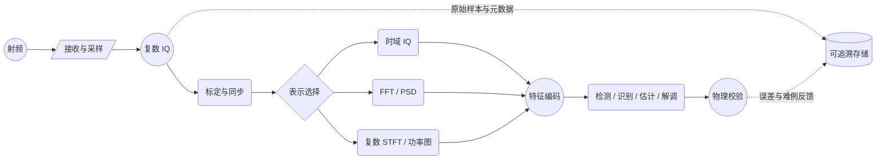
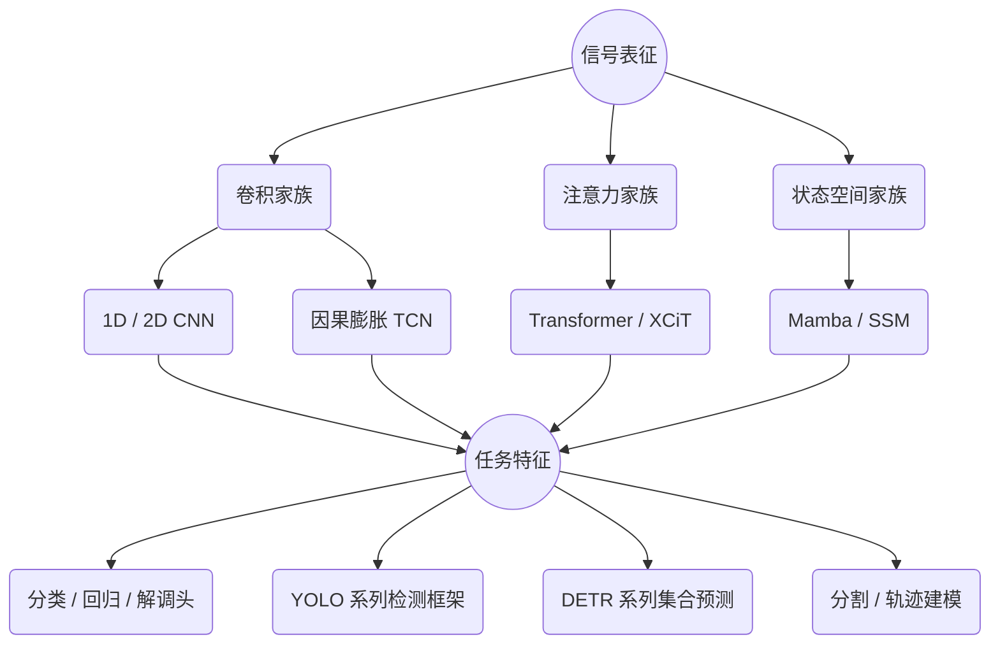
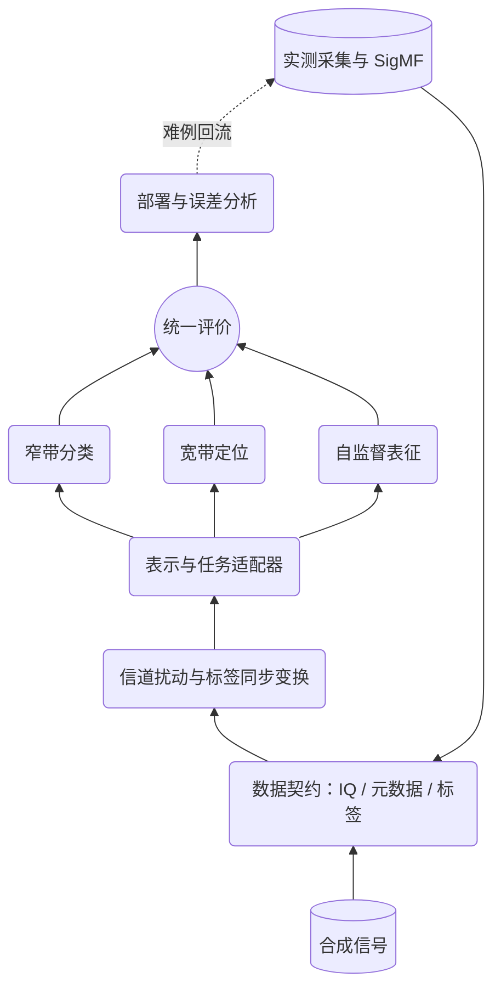
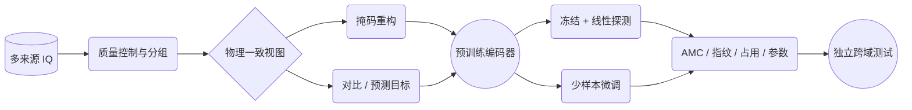
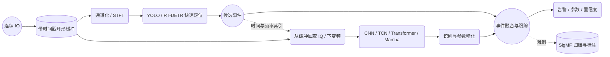

# AI 信号处理：从表示域到宽带智能侦测

> 技术综述 / 技术白皮书 · 中文版 · 2026-09-10 资料核对版  
> 面向无线电信号算法研发、系统架构与工程选型。Markdown 与 HTML 正文、表格、参考文献及图意一致；图形分别采用 Mermaid／文本示意与内嵌 SVG。所有图均为原创概念图，非实测结果。

## 01 核心判断：先定义任务，再选择模型

AI 可用于信号检测、调制识别、参数估计、特征学习、信道估计和解调。选型首先取决于**输出是什么、哪些信息必须保留、允许多长延迟**。时域、频域和时频域是表示方式；CNN、TCN、Transformer、Mamba 是建模组件；YOLO、DETR 是目标检测框架；TorchSig 是 RFML 数据与实验基础设施。这几个层级相互组合，不构成同一条性能排行榜。

本文的工程建议是：以传统 DSP 提供标定、同步、变换及物理约束，以学习模型处理复杂模式；宽带系统采用**时频图快速定位 + 原始 IQ 深度分析**的双通路，保留经典算法作为对照与精化工具。

必须把六类输出分开：

| 任务 | 典型问题 | 合理输出 | 主要评价 |
| --- | --- | --- | --- |
| 存在性／占用检测 | 某频段有没有信号？ | 占用概率、二元标签 | 固定虚警率下的检测概率 |
| 时频定位 | 信号何时、在哪个频段出现？ | 时频框、掩膜、轨迹 | AP/AR、边界误差、事件虚警 |
| 分类识别 | 是何种调制、协议或设备？ | 类别概率、未知标签 | Macro-F1、分 SNR 准确率 |
| 参数估计 | 载频、带宽、符号率是多少？ | 数值及置信区间 | MAE/RMSE、偏差、失效率 |
| 表征学习 | 如何得到可迁移的信号特征？ | 向量、序列嵌入 | 线性探测、少样本、跨域迁移 |
| 解调／接收 | 收到了什么符号和比特？ | 符号、软比特 LLR、译码结果 | BER/BLER、EVM、吞吐与延迟 |

“检测”在接收机中也可能指符号检测，不能与频谱占用检测混用；调制识别只回答调制类别，不能直接恢复消息。神经接收机及端到端通信学习已有研究基础，但必须在具体信道、协议和接收条件下评价。[深度学习物理层导论](https://arxiv.org/abs/1702.00832)

### 图 1 · 物理信号链与 AI 介入点

<!-- FIGURE:chain -->


图意：采样和标定构成物理底座；三个表示分支可单独使用或融合；输出需经过物理校验，并能追溯到原始 IQ。

## 02 时域、频域与时频域：选择保留的信息

复基带通常表示为 `x[n] = I[n] + jQ[n]`。I/Q 是同一复数信号的两个分量，不是两路彼此无关的传感器；用两个实数通道输入网络，也不意味着网络采用了复数运算。

| 表示 | 保留与突出什么 | 适合的起点 | 主要代价与陷阱 |
| --- | --- | --- | --- |
| 原始 IQ / 时域 | 幅度、相位、瞬态与时间结构 | AMC、指纹、同步、解调 | 采样点多；对频偏、定时及采样率变化敏感 |
| 复数 FFT | 有限窗口内的频率成分与相位 | 频域均衡、谱结构分析 | 单窗频谱缺少窗口内显式时间定位 |
| 幅度谱 / PSD | 能量分布、谱峰、占用与噪声底 | 频谱感知、粗载频及带宽估计 | 相位被去除；平均会平滑短时事件 |
| 复数 STFT | 局部时间与频率结构，同时保留复系数 | 多域学习、时频分析及重构 | 窗长、步长、边界处理共同影响结果 |
| 对数功率时频图 | 突发、窄带、跳频和扫频几何形态 | YOLO / DETR / 分割 | 去相位、裁剪动态范围、缩放均可能丢信息 |
| 多域融合 | IQ 的细节与频谱／时频的结构互补 | 检测后识别、复杂干扰分析 | 时间对齐、算力及训练一致性更复杂 |

**复数 FFT 可逆；复数 STFT 在适当窗、重叠和重构条件下可逆。**常见的功率谱或灰度时频图才会丢弃相位。不能把“STFT”与“只有幅度的图片”画等号。

STFT 的一种定义为：

```text
X[m,k] = Σ(n=0…Nw−1) x[mH+n] · w[n] · exp(−j2πkn/NFFT)
P[m,k] = 10 log10(|X[m,k]|² + ε)
频率栅格间隔 Δf = Fs / NFFT
时间帧间隔   Δt = H / Fs
窗观测时长   Tw = Nw / Fs
```

`Fs` 为采样率，`Nw` 为窗长，`NFFT ≥ Nw`，`H` 为步长，`ε` 是数值稳定项。频率栅格间隔不等于实际分辨两个相邻信号的能力；零填充增加频点密度，不增加观测信息。较长窗口有利于细分频率，却会模糊突发边缘；时间步长缩小也不能消除窗函数带来的时间扩展。功率未经窗能量和带宽归一化、仪器标定时，不应直接标为 dBm/Hz。

### 图 2 · 同一信号的三种观察视角

<!-- FIGURE:domains -->
```text
时域 IQ                 频域 PSD                 时频能量
幅度                    功率                     频率 ↑
 ↑  ∿∿  ∿∿∿∿             ↑     ╭──╮                   │  ▰▰▰  突发
 │ ∿  ∿∿    ∿            │ ╭╮  │  │                   │     ╱ 扫频
 └────────→时间          └─╯╰──╯  ╰─→频率             │ ▰  ▰  ▰ 跳频
保留幅相和瞬态           突出谱峰与占用                └────────→时间
```

图意：三个坐标系强调不同信息；子图用于解释表示差异，并非由同一组采样数据数值变换所得。右侧图为能量示意，不含复数相位。窄带、宽带、跳频等形态只是特征线索，不能唯一决定调制、协议或设备身份。

## 03 模型谱系：编码器与检测框架分层比较

CNN 可以是一维或二维，也可以作为复杂检测器的一部分。TCN 属于卷积序列模型家族；因果、膨胀卷积适于扩大历史感受野。Transformer 利用注意力建模关系，输入可以是 IQ patch、频谱 token 或时频 patch。Mamba 采用选择性状态空间机制，适合作为长序列候选编码器。[TCN 论文](https://arxiv.org/abs/1803.01271)、[Transformer 论文](https://arxiv.org/abs/1706.03762)、[Mamba 论文](https://arxiv.org/abs/2312.00752)

### 图 3 · 从表征到任务的模型谱系

<!-- FIGURE:lineage -->


图意：这是可组合的概念谱系，不是声明所有框架都已支持每个编码器。替换骨干需重做特征尺度、通道接口、训练目标和部署验证；DETR 也包含编码与查询解码机制，不能只理解为一个末端小模块。

| 编码家族 | 归纳偏置与适用对象 | 优先考虑的任务 | 必须验证的限制 |
| --- | --- | --- | --- |
| 1D / 2D CNN | 局部结构、共享卷积核；可通过层次扩大感受野 | IQ 分类、时频纹理、检测骨干 | 下采样是否损失窄带和短脉冲；跨域鲁棒性 |
| TCN | 因果历史、膨胀卷积、多尺度时间上下文 | 包络、脉冲序列、占用序列、流式识别 | 感受野长度、因果填充、边界缓存 |
| Transformer | 内容相关的关系建模；token 设计关键 | 跨时间／频带融合、识别、检测 | 标准全局注意力的二次项、位置与采样率编码 |
| Mamba / SSM | 通过状态递推压缩序列上下文 | 长序列识别、持续谱流分析 | 状态容量、扫描顺序、流式状态一致性及实际算子速度 |
| 混合结构 | CNN 局部特征 + 注意力或状态模型 | 兼顾细节与长时关联 | 收益是否来自更多参数、训练量或预处理差异 |

标准全局自注意力包含关于 token 数 `L` 的 `O(L²)` 计算项；固定宽度和状态规模下，Mamba 沿序列长度具有线性扩展性质。这并不等于任意硬件上更快，也不意味着可以直接实时处理任意带宽。双向模型还需要未来数据，不能无代价地用于因果在线输出。XCiT 使用跨通道协方差注意力，与标准全局 token 注意力的计算方式不同。[XCiT](https://arxiv.org/abs/2106.09681)

例如 `20 MS/s × 1 s = 2000 万复采样点`。即使线性模型也需先讨论通道化、降采样、分窗和 token 压缩，并验证这些操作是否保留目标信号信息。

## 04 YOLO 与 DETR：宽带时频侦测的两类选择

YOLO 是一系列检测系统，版本之间有较大差异；DETR 以集合预测和匹配损失组织检测。RT-DETR 将高效混合编码器与查询解码结合，用于实时目标检测。不能仅凭“CNN”或“Transformer”名称推断低 SNR、重叠信号和边缘速度表现。[YOLO 原论文](https://arxiv.org/abs/1506.02640)、[DETR 原论文](https://arxiv.org/abs/2005.12872)、[RT-DETR 原论文](https://arxiv.org/abs/2304.08069)

| 路线 | 典型输出与用途 | 价值 | 关键限制 |
| --- | --- | --- | --- |
| YOLO 系列 | 时频边界框，单类检测或多类识别 | 易建立完整检测基线，可接现成工具链 | 窄小目标、框标签和版本特定后处理需调校 |
| DETR / RT-DETR | 固定数量查询产生可变目标集合 | 匹配式训练，可联合建模多尺度特征 | 查询数、训练收敛、特征分辨率、实际硬件成本 |
| 语义／实例分割 | 时频像素占用或实例掩膜 | 适应非矩形占用形状 | 语义掩膜不自动分开实例；重叠标签可能需多标签设计 |
| 序列／轨迹模型 | 频带占用序列、跳频轨迹、事件状态 | 跨窗口关联，适合持续活动分析 | 需定义关联规则、漏检补偿和因果性 |

**低 SNR 与重叠信号是数据与可辨识性问题，也是架构问题。**如果两个信号在所用功率图中已经难以分辨，Transformer 不能凭名称恢复缺失的信息。跳频应明确标“一跳一实例”还是“一段会话一个实例”；扫频可使用掩膜或轨迹，单一大框可能包含大量空白。

2022 年 WidebandSig53 论文直接比较了时频输入上的目标检测与分割，适合先理解任务定义。[WBSig53 论文](https://arxiv.org/abs/2211.10335) 2026 年 Shi 等人的 RF 时频研究在其九类调制、−30～30 dB 的实验设置中报告 RT-DETR 相对若干 YOLO 版本的优势；这是一项具体数据集结论，不是所有无线环境的通用排名。[Scientific Reports 原文](https://www.nature.com/articles/s41598-026-63785-5)

Spectrum Transformer 研究带内特征与带间占用关系，不能直接视为二维时频框检测基准；DWMTN 研究 Mamba 与 Transformer 融合的调制识别，不能据此证明宽带定位优于 YOLO。[Spectrum Transformer](https://ieeexplore.ieee.org/document/10509639/)、[DWMTN](https://ieeexplore.ieee.org/document/11205317/)

### 图 4 · 时频检测：从几何边界到物理量

<!-- FIGURE:spectrogram -->
```text
频率 f ↑
 fmax  │                       ／ C：扫频轨迹
       │  ┌──────────────┐    ／
 fhigh │  │ A：带状突发  │   ／
       │  │       ┌──────┼─────────┐
 flow  │  └───────┼──────┘ B：重叠 │
       │          └───────────────┘
       │  ▰       ▰       ▰       D：跳频片段，需跨片段关联
 fmin  └─────────────────────────────────→ 时间 t
          tstart         tend

实例标签：{tstart, tend, flow, fhigh, class, confidence}
派生参数：中心频率 fc = (flow + fhigh)/2；带宽 B = fhigh − flow
```

图意：A/B 的矩形可用于粗定位；C 更适合轨迹或掩膜；D 需要跨片段关联。轮廓是概念标签，非模型预测；示意形态不代表已识别调制。

## 05 参数提取：坐标换算不是完整的信号估计

先约定：送入检测器的有效时频图宽 `W`、高 `Himg`；时间向右递增，频率向上递增；图像坐标 `y` 向下；边界坐标范围为 `[0,W] × [0,Himg]`。图覆盖 `[t0,t0+T]`、`[fmin,fmax]`，并已撤销缩放和 letterbox 填充。则对框 `(x1,y1,x2,y2)`：

```text
tstart = t0 + (x1/W) · T
tend   = t0 + (x2/W) · T
fhigh  = fmax − (y1/Himg) · (fmax−fmin)
flow   = fmax − (y2/Himg) · (fmax−fmin)
fc     = (fhigh+flow)/2
B      = fhigh−flow
duration = tend−tstart
```

这里的 `T` 必须由 STFT 帧中心、帧边界或图像时间边界的实际约定确定，不能默认等于“列数 × 窗长”。对于覆盖整个复基带采样带宽的频移后双边谱，可用 `fmin = fRF−Fs/2`、`fmax = fRF+Fs/2`；如果只保留部分频段，应使用裁剪后的实际范围。

**换算示例（人为设定）**：`W=Himg=1024`，时间边界覆盖 `100 ms`，频率范围 `2400～2420 MHz`，框为 `(256,256,768,512)`。得到时间 `25～75 ms`，频率 `2410～2415 MHz`，几何中心 `2412.5 MHz`，带宽 `5 MHz`，持续 `50 ms`。这是图像坐标的物理映射，不是模型精度测试。

| 参数 | 可由时频框得到什么 | 精化或补充方法 |
| --- | --- | --- |
| 中心频率 / 带宽 | 已标定图上的几何中心和边界跨度 | 谱峰／频偏估计、阈值或占用带宽算法；定义必须一致 |
| 起止时间 / 时长 | 帧尺度粗边界 | IQ 包络、变点检测、匹配滤波；校正窗延展和滤波延迟 |
| 符号率 | 通常不能只凭框唯一确定 | 循环平稳特征、谱相关、定时估计或专门回归头 |
| SNR / 功率 | 不能从任意归一化灰度直接读出 | 标定功率、噪声估计和明确定义的信号带宽 |
| 到达时间 TOA | 本地采样时间上的粗事件时间 | 时钟同步、设备延迟校正、波形相关及误差预算 |
| 设备指纹 / 协议 | 框只提供候选区域 | 保留 IQ，跨设备与场景评价；协议识别不等于协议解码 |

框中心未必是真实载波频率，框宽也未必等于规定的占用带宽。建议报告参数误差、置信度与不可估状态，同时区分“已正确检测实例的估计误差”和“包含漏检的端到端成功率”。

**本项目当前的做法（可作为对照检查）：** 检测输出的是**能量占用带**——中心频率取占用带几何中心、带宽取占用跨度，另附功率与带内信噪比（统一为 `inband_snr_v1`：$N_0=P_{\mathrm{noise}}/B_{\mathrm{noise}}$，信号带内噪声按 $N_0\times$ 实际占用带宽折算）；**符号率尚未估计**，在文档里直接列为未实现，而不是用框宽冒名顶替。含载波的调幅信号在频谱上是对称双边带，此时“框宽 = 占用带宽 ≠ 消息带宽”，本项目保留占用带与其中心并显式说明差异，不把载波峰当作中心频率。跳频按“**一段会话一个实例**”标注（与生成器 `snr_inband_db` 的会话口径一致），因此框覆盖整段会话的频带范围而不是单跳。深度检测只负责判决（哪个时频块有目标），辐射量由同一份 STFT 在同一口径下测量；两条路径共用冻结的 `detect_result_v1`，所以能逐项对比而不是拿不同预处理下的分数互相比较。图像排布（行 0 为 $+f_s/2$）、归一化（本底 + 动态范围）与边框坐标（像素边界而非中心）约定由同一个模块唯一定义，训练脚本复用同一份实现以避免“训练-推理”口径分叉。接口契约、真值评分口径与合成数据上的实测指标见[电磁信号分析识别系统 Python 技术方案](../电磁信号分析识别系统_Python技术方案.md) §4.6～§4.9 与 [training/README.md](../../training/README.md)。

## 06 TorchSig 生态：数据生成、模型与流式示例

TorchSig 是基于 PyTorch 数据管线的信号机器学习工具包，核心价值是生成信号、施加领域扰动、变换表示和组织标签；它不是某一种神经网络。官网与仓库的信号类别描述和 API 可能随版本不同，应记录实际版本与类别表，不应把“Sig53 的 53 类”当作新版生成器固定上限。[官网](https://torchsig.com/)、[主仓库](https://github.com/TorchDSP/torchsig)

### 图 5 · 数据与训练基础设施的分层架构

<!-- FIGURE:ecosystem -->


图意：TorchSig 覆盖合成与变换等环节；实测管理、统一评测和部署回流是本文建议的外围体系，并非宣称全部为仓库内置功能。

| 项目／资源 | 已核对能力 | 工程点评 |
| --- | --- | --- |
| [TorchSig](https://github.com/TorchDSP/torchsig) | RF 数据生成、变换、扰动与标签管线 | 适合作为统一实验底座；固定版本、配置、种子及标签语义 |
| [torchsig-models](https://github.com/TorchDSP/torchsig-models) | README 列出 1D XCiTClassifier、YOLO11n、模型与训练工具、YOLO 适配器 | 可用作起点；本次未下载或验证每个权重，不能把接口示例等同于已验证可部署模型 |
| [gr-spectrumdetect](https://github.com/TorchDSP/gr-spectrumdetect) | GNU Radio 中使用 TorchSig Wideband 0.6.1 相关训练模型；提供模型下载脚本 | 公开 YOLO11S 配置是 1024² 灰度、level-2 扰动、single_cls=True 的检测示例；输出 signal，不是完整 AMC |
| [RadioML](https://www.deepsig.ai/datasets/) | 历史调制分类数据 | 有利于复现旧基线；宽带定位需额外场景合成与标签 |
| [RT-DETR](https://github.com/lyuwenyu/RT-DETR) | 官方通用目标检测实现 | 迁移 RF 需适配通道、归一化、框标签及训练；通用图像权重不是 RF 权重 |
| [Ultralytics YOLO11](https://docs.ultralytics.com/models/yolo11/) | YOLO11 系列检测工具链与文档 | 适合建立可部署基线；选定尺寸后在目标硬件测量 |
| [SigMF](https://sigmf.org/) | 数字信号样本及元数据规范 | 管理数据类型、采样率、捕获频率、时间和注释；不生成信号，也不自带分类模型 |
| [Mamba](https://github.com/state-spaces/mamba) | 选择性状态空间模型实现 | 需另行构建 RF 输入、任务头和训练集；不是现成宽带侦测器 |
| [Sionna](https://github.com/NVlabs/sionna) | 通信链路、传播及系统仿真工具 | 解调、信道估计与神经接收机可结合其链路仿真环境研究 |

仅设置 `num_signals_max=1` 不足以完整定义分类数据集：还需决定是否允许零信号、信号出现位置、类别目标、信道扰动及标签输出。旧版 Sig53/WidebandSig53 API 与当前统一生成接口不应混用。

复现时还要分别核对代码、数据和权重许可。TorchSig 主仓库标示 MIT；DeepSig 页面将公开数据标为 CC BY-NC-SA 4.0。衍生训练框架与模型权重的使用条件需独立查看，不能由主仓库许可推定。[TorchSig 许可入口](https://github.com/TorchDSP/torchsig#license)、[DeepSig 许可说明](https://www.deepsig.ai/datasets/)

## 07 数据集设计：合成规模不等于真实泛化

| 数据集 | 论文／官方页面规模口径 | 任务定位 | 使用边界 |
| --- | --- | --- | --- |
| RadioML 2016.10A | 11 类，8 数字 + 3 模拟，多 SNR | 已截取信号的 AMC | 历史合成基准，不能代表当前真实射频环境 |
| RadioML 2018.01A | 24 类；官网概述约 200 万样本，每例 1024 个复采样点 | AMC | 以下载文件实际形状和标签核验精确数量 |
| Sig53（2022） | 53 类，500 万合成样本 | 窄带分类 | 论文基准配置，不等于所有 TorchSig 版本的数据定义 |
| WidebandSig53（2022） | 53 类，55 万宽带样本，约 200 万独立信号实例 | 多信号定位与识别 | “样本数”和“信号实例数”是两个计数维度 |
| 自建 TorchSig 配置 | 由生成参数决定，无统一固定规模 | 根据输出契约生成分类／检测等数据 | 种子、扰动分布、类别映射和版本需可追溯 |
| 自建实测集 | 按设备、地点、日期、频段和接收机组织 | 跨域验证、校准、难例回流 | 留出独立测试环境，避免相邻窗口泄漏 |

规模依据：[DeepSig](https://www.deepsig.ai/datasets/)、[Sig53 论文](https://arxiv.org/abs/2207.09918)、[WBSig53 论文](https://arxiv.org/abs/2211.10335)。DeepSig 明确指出历史数据存在已知问题，并建议新研究使用自建或空口实测数据；这不妨碍它们用于历史基线复现。

建议使用三个互补测试集合：**同分布合成集**检查实现与优化；**受控分布外合成集**改变频偏、衰落、采样率和混合密度；**独立实测集**检查设备、环境与采集链路偏移。训练／验证／测试应按原始录制、发射设备、日期或场景分组切分，再生成窗口。由同一录制切出的重叠窗口不能随机散入不同集合。

数据增强必须遵循标签语义。频移要更新频率边界，时间裁剪要更新可见时长；重采样要保留正确时间及频率标尺；增益变化不应误改真实 SNR；若标签是设备指纹，某些硬件扰动可能破坏身份线索。通用图像中的旋转、翻转、mosaic 不能未经物理解释直接沿用。

用于 SigMF 的数据契约至少记录：样本格式、字节序、采样率、捕获中心频率、样本起点、时间基准、接收增益、标注区间及来源。额外字段应通过规范允许的扩展组织，而不是把自定义字段假装成通用核心字段。[SigMF 规范](https://sigmf.org/)

## 08 技术演进与 RF Foundation Model

### 图 6 · 多条研究路线并行演进

<!-- FIGURE:timeline -->
```text
年份       信号任务与数据                         通用建模与工具
2016       RadioML / CNN 调制识别                YOLO 原始论文发表于 CVPR 2016
2017–2018  端到端物理层学习、RadioML 2018         Transformer（2017）、TCN（2018）
2020–2021  从分类走向更丰富的信号表征             DETR（2020）、XCiT（2021）
2022       Sig53 / WidebandSig53 / TorchSig       RF 分类与时频检测基准并行
2023–2024  Spectrum Transformer（2024）           RT-DETR（2023 预印本 / 2024 CVPR）
           TorchSig GNU Radio 工具（2024）        Mamba（2023 预印本）
2025       TorchSig 2.0；DWMTN 调制识别           混合编码与数据定制
2026       RF 时频 RT-DETR 研究；Radio-FM 预印本  多任务表征与工程迁移继续探索
```

图意：按代表工作时间组织，不表示 YOLO → DETR → Mamba 的替代关系。数据、检测、序列建模和预训练是并行发展路径；年份指列明的论文或版本事件，而不是某整个领域的起始年。

RF Foundation Model 更适合定义为**在较广泛的 RF 数据上预训练，并可迁移到多个下游任务的表征模型**。它不必采用语言模型，也不因参数量大就自然具备跨协议、跨设备能力。训练目标可以包括掩码重构、对比学习、未来片段预测与多任务学习。

2026 年 8 月的 Radio-FM 预印本研究面向 IQ 的表征预训练与多下游任务迁移，可作为阅读实例；论文报告的基准结果仍需独立复现。本次仅确认论文公开，未验证其代码、权重和训练数据的完整可获得性。[Radio-FM](https://arxiv.org/abs/2608.05793)

### 图 7 · 从无标注信号到可迁移表征

<!-- FIGURE:foundation -->


图意：这是研究设计示意，不是 Radio-FM 论文架构复刻。预训练数据也必须与下游测试录制隔离；重构误差低不能直接证明识别或检测能力强。

评价 RF 基础模型应回答四个问题：是否超越同数据预算从头训练的基线；冻结编码器能否迁移；少样本收益是否跨设备／频段保持；遇到未知类时能否可靠拒识。指纹任务尤其应检查模型是否只记住接收机、位置或采集日期。

## 09 工程架构：快速侦测与深度分析双通路

### 图 8 · 共享 IQ 缓冲的实时系统

<!-- FIGURE:dual -->


图意：快路持续输出候选事件；深路按事件回取带前后余量的原始 IQ；融合层可先发初报，再补充类别和参数。此架构是本文工程建议，不是声称某开源项目已经完整实现。

快路关注漏检和吞吐；深路在候选频带内数字下变频、滤波、重采样，然后进行 AMC、指纹或参数估计。深路可以接高精度 DSP，不必全部使用神经网络。事件记录需关联绝对样本索引、原始采样率、通道化参数及所有处理延迟。

**背压与降级必须显式设计。**候选过密时限制深路并发，优先处理高价值或不确定事件，合并持续信号的重复分析；记录排队与丢弃事件。不能静默丢窗后仍把 GPU 推理帧率称作系统实时能力。快路漏检会阻断触发式深路，因此可加入少量周期审计采样与传统检测旁路，量化触发偏差。

端到端延迟应按路径度量：`L = 采集积累 + 预处理 + 排队 + 推理 + 后处理 + 传输`。深路“完整属性可用时间”与快路“首个事件可用时间”分别报告。持续流的平均处理服务能力必须大于输入到达率，同时检查 p95/p99 尾延迟。

**容量示例（人为设定）**：20 MS/s、I/Q 各 16 bit，单通道原始数据约 `80 MB/s`（十进制）；2 秒环形缓存约 `160 MB`，尚未计入副本和元数据。若 I/Q 各为 float32，则变为约 `160 MB/s`。缓存时长至少应覆盖事件触发等待、分析排队、回取余量及调度抖动。

## 10 公平评测与选型路径

下表是实验起点矩阵，不是未经测试的性能评级。“优先”表示值得先建立基线，“按需”表示需相应任务设计。

| 使用场景 | IQ CNN / TCN | IQ Transformer / Mamba | STFT YOLO / RT-DETR | 传统 DSP | 决策依据 |
| --- | --- | --- | --- | --- | --- |
| 窄带已截取 AMC | 优先 | 对照 | 通常无需框检测 | 特征基线 | Macro-F1、分 SNR、跨域 |
| 宽带多突发定位 | 按需 | 按需 | 优先 | 能量／CFAR 对照 | 固定虚警率召回、AP、尾延迟 |
| 跳频长期关联 | 优先序列基线 | 对照 | 提供片段候选 | 关联／跟踪 | 轨迹完整率、身份切换、时延 |
| 精确载频与符号率 | 回归对照 | 回归对照 | 提供粗区域 | 优先精化基线 | 误差分布与估计失败率 |
| 相干解调／译码 | 按接收链设计 | 按接收链设计 | 通常只用于前端发现 | 必备链路基线 | BER/BLER、吞吐、失锁率 |
| 多任务少样本迁移 | 从头训练对照 | 预训练研究候选 | 可接任务适配器 | 提供约束 | 同预算迁移增益、未知拒识 |

公平实验固定：采样率、观察时长、类别与标签、SNR 定义、STFT 配置、输入分辨率、训练预算、数据切分和部署硬件。比较 YOLO 与 RT-DETR 时统一检测任务；比较 CNN 与 Mamba 时统一输入、任务头和预算。参数量相同与计算量相同可以作为不同对照，不应混成一个条件。

| 评价层 | 必须记录的指标 | 容易误读之处 |
| --- | --- | --- |
| 存在性检测 | Pd–Pfa 曲线、固定 Pfa 的 Pd | 要说明统计单位是像素、频段、窗口还是事件 |
| 时频检测 | mAP@[0.5:0.95]、AP50、AR、每分钟每带宽虚警 | 明确 IoU 规则、类别平均和匹配；不可混用不同口径 |
| 分类 | Macro-F1、混淆矩阵、按 SNR 与设备分层 | 总准确率可能被高 SNR 或多数类支配 |
| 参数 | 频率／带宽／时间 MAE、RMSE、偏差 | 几何带宽与占用带宽必须分别定义 |
| 未知检测 | 拒识阈值、未知召回、已知误拒率 | 最大 softmax 概率不自动具备校准保证 |
| 实时系统 | 有效处理带宽、丢窗率、p95/p99 延迟、峰值内存、功耗 | 图像 FPS 不等于 RF 吞吐；明确 batch 与数值精度 |
| 泛化 | 跨录制／设备／场景及分布外性能 | 随机切窗产生的信息泄漏会夸大效果 |

建议按四个里程碑实施：

1. **定义数据与标签契约**：确定目标类别、频段、事件粒度、参数定义、虚警与延迟要求；建立 SigMF 样本及传统 DSP 基线。
2. **跑通双任务基线**：使用 TorchSig 受控数据，分别训练／验证宽带定位与已截取 IQ 分类；先保持接口可追溯。
3. **引入真实场景与强对照**：比较 YOLO/RT-DETR、CNN/TCN 与 Transformer/Mamba；逐项改变扰动和训练条件，避免同时更改全部变量。
4. **联调实时闭环**：接入 GNU Radio 或已有接收链，验证缓存、时钟、队列、精化和异常记录；最后再开展多任务预训练与少样本迁移。

预训练权重、合成数据和通用检测代码能缩短起步时间；实际系统是否有效，最终由任务定义、独立实测、标定与端到端评测共同决定。

本仓库已按上述路径落地两条任务线，其算法思路、公式、流程图、输入输出参数、参考文献与设计局限见 `docs/algorithms/` 下四篇设计文档：[传统能量检测](../algorithms/信号检测_传统能量检测.md) 与 [AI 时频图检测](../algorithms/信号检测_AI时频图检测.md)、[传统特征与启发式判定](../algorithms/调制识别_传统特征与启发式判定.md) 与 [AI 特征学习](../algorithms/调制识别_AI特征学习.md)。其中 AI 路径只负责判决，中心频率、带宽与带内信噪比仍由与能量路径同一份物理量测给出，避免把网络输出直接当作辐射参数。

## 11 论文与项目参考：阅读顺序与简评

以下链接为论文原始页面、出版方或项目官方入口，核对日期为 2026-09-10。涉及仓库能力的描述基于当日公开文档，未进行模型下载、训练或实测复现。正文没有跨论文拼接性能排名。

| 编号 | 论文／项目 | 简评与建议阅读目的 |
| --- | --- | --- |
| R01 | Boegner 等，2022：[Large Scale Radio Frequency Wideband Signal Detection & Recognition](https://arxiv.org/abs/2211.10335) | 优先阅读：WBSig53、定位与识别、分割和目标检测评价；arXiv 论文 |
| R02 | Boegner 等，2022：[Large Scale Radio Frequency Signal Classification](https://arxiv.org/abs/2207.09918) | Sig53 与 TorchSig 的研究起点；CNN/Transformer 结论限于所测设置；arXiv 论文 |
| R03 | [TorchSig 官网](https://torchsig.com/) 与 [源码及 Publications](https://github.com/TorchDSP/torchsig#publications) | 查 API 与版本；官方论文列表含 2024 GNU Radio 工具和 2025 TorchSig 2.0 工作 |
| R04 | [TorchSig Models](https://github.com/TorchDSP/torchsig-models) | 查 1D XCiT、YOLO 适配、训练与权重入口；逐项核验可用性 |
| R05 | [gr-spectrumdetect](https://github.com/TorchDSP/gr-spectrumdetect) | 了解 GNU Radio 接入；注意公开配置是单类检测示例 |
| R06 | [DeepSig RadioML 数据页](https://www.deepsig.ai/datasets/) | 历史 AMC 基线、已知问题、数据许可与下载入口 |
| R07 | O’Shea 等，2016：[Convolutional Radio Modulation Recognition Networks](https://arxiv.org/abs/1602.04105) | 理解原始 IQ 上 CNN 调制识别的早期路线 |
| R08 | O’Shea、Hoydis，2017：[An Introduction to Deep Learning for the Physical Layer](https://arxiv.org/abs/1702.00832) | 连接识别与端到端通信系统学习，区分分类和接收任务 |
| R09 | Bai 等，2018：[An Empirical Evaluation of Generic Convolutional and Recurrent Networks for Sequence Modeling](https://arxiv.org/abs/1803.01271) | TCN 结构与通用序列对照；不是 RF 专项优胜证据 |
| R10 | Vaswani 等，2017：[Attention Is All You Need](https://arxiv.org/abs/1706.03762) | 注意力机制基础；需结合 RF token 与物理位置设计 |
| R11 | El-Nouby 等，2021：[XCiT: Cross-Covariance Image Transformers](https://arxiv.org/abs/2106.09681) | 理解跨协方差注意力；TorchSig 的 1D 适配需另查实现 |
| R12 | Gu、Dao，2023 预印本：[Mamba: Linear-Time Sequence Modeling with Selective State Spaces](https://arxiv.org/abs/2312.00752) 与 [代码](https://github.com/state-spaces/mamba) | 长序列建模基础；线性扩展不等于 RF 实时性保证 |
| R13 | Redmon 等，2015 预印本／CVPR 2016：[You Only Look Once](https://arxiv.org/abs/1506.02640) | YOLO 检测思想源头；不描述后来所有 YOLO 版本 |
| R14 | Carion 等，ECCV 2020：[End-to-End Object Detection with Transformers](https://arxiv.org/abs/2005.12872) | 集合预测与匹配损失；不是所有 Transformer 分类器的通称 |
| R15 | Zhao 等，2023 预印本／CVPR 2024：[DETRs Beat YOLOs on Real-time Object Detection](https://arxiv.org/abs/2304.08069) 与 [官方实现](https://github.com/lyuwenyu/RT-DETR) | RT-DETR 原始工作；自然图像基准优势须在 RF 重新验证 |
| R16 | Zhang 等，IEEE TWC 2024：[Spectrum Transformer](https://ieeexplore.ieee.org/document/10509639/) | 带内与带间关系、宽带占用感知；不同于时频实例定位 |
| R17 | Shi 等，Scientific Reports 2026：[RT-DETR-based object detection and parameter extraction for wireless signal spectrograms](https://www.nature.com/articles/s41598-026-63785-5) | 直接连接时频检测与框几何参数提取；采用期刊页面口径 |
| R18 | IEEE SPL 2025：[DWMTN: A Dynamic Mamba-Transformer Network With Adaptive Feature Fusion for Automatic Modulation Recognition](https://ieeexplore.ieee.org/document/11205317/) | 动态融合的 AMC 例子；不能外推为宽带检测结论 |
| R19 | Zhou 等，2026 预印本：[Radio-FM: A Foundation Model for Radio Signal Representation Learning and Its Applications](https://arxiv.org/abs/2608.05793) | RF 多任务预训练实例；与已独立验证的工程能力区分 |
| R20 | [SigMF 规范](https://sigmf.org/) 与 [仓库](https://github.com/sigmf/SigMF) | 建立可交换、可追溯的 IQ 数据与标注契约 |
| R21 | [Ultralytics YOLO11 文档](https://docs.ultralytics.com/models/yolo11/) | 查询当前系列结构、训练及部署接口；明确具体模型版本 |
| R22 | [NVIDIA Sionna](https://github.com/NVlabs/sionna) | 神经接收机与通信链路仿真的相邻工具；用途区别于频谱框检测 |

### 术语速查

| 缩写 | 含义 |
| --- | --- |
| RF / RFML | 射频 / 射频机器学习 |
| IQ / DSP | 同相与正交分量 / 数字信号处理 |
| FFT / STFT / PSD | 快速傅里叶变换 / 短时傅里叶变换 / 功率谱密度 |
| AMC / AMR | 自动调制分类 / 自动调制识别；文献中常近义使用 |
| TCN / SSM | 时间卷积网络 / 状态空间模型 |
| ROI / TOA | 感兴趣区域 / 到达时间 |
| AP / AR / IoU | 平均精度 / 平均召回率 / 交并比 |
| BER / BLER / EVM | 比特误码率 / 块错误率 / 误差矢量幅度 |
| CFO / LLR | 载波频偏 / 对数似然比 |

---

编辑说明：已修正“YOLO 被序列模型替代”“STFT 必然丢失相位”“检测框直接给出全部射频参数”等容易误解的表述。全文图示为解释性绘制；模型选择矩阵是工程建议，文中数字示例均不是实测性能。
