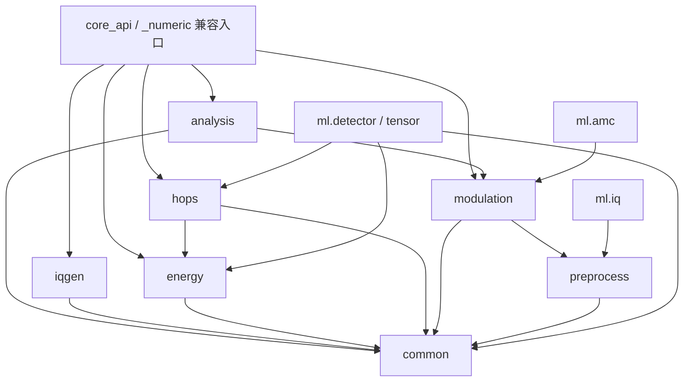

# 数值算法模块拆分与回归说明

更新日期：2026-09-13。

本次将原 `_numeric.py` 的职责拆开，同时迁出 `ml/amc.py` 的 34 维传统特征及必要预处理。算法、参数默认值、随机流、结果契约及异常行为保持不变；同时修正三项既有测试在 Windows 上构造绝对路径的方式，不修改生产路径校验。

## 1. 实现位置与兼容入口

下表文件均位于 `src/signal_analysis/`。

| 模块 | 内容与边界 |
| --- | --- |
| `_numeric_common.py` | 通用输入校验、STFT/PSD、噪声底、掩膜、99% 占用区间、共享常量和舍入；只依赖标准库与 NumPy |
| `_numeric_analysis.py` | `analyze`、`spectrum_row`，统计与绘图数组 |
| `_numeric_iqgen.py` | `plan_signal`、`generate_iq`、九种样式、噪声、数学双音和逐跳采样边界 |
| `_numeric_preprocess.py` | AMC／IQ 专用校验、中心截断、混频、65 抽头低通、抽取和带内 SNR 粗估 |
| `_numeric_modulation.py` | `extract_features`、`feature_vector`、34 维名称与顺序、`classify_modulation` 及专用辅助函数 |
| `_numeric_energy.py` | `detect_signals`、检测专用配置、候选量测与会话合并 |
| `_numeric_hops.py` | `detect_hops`、逐跳配置、脊线跟踪、驻留与频带复测、会话归并和可分辨性出口 |
| `_numeric.py` | 显式重导出原函数和常量，保留旧导入路径，不包含算法实现 |

`core_api` 的导出清单与函数签名保持不变，并直接导入所属模块。`ml.amc` 保留 `extract_features`、`feature_vector`、特征常量及旧预处理辅助函数的兼容导出；模型训练、加载、推理、类别字典和结果组装仍在模型层。训练脚本无需改动输入特征顺序或模型清单。

## 2. 共用与专用依赖

箭头表示“调用／导入”。所有数值模块不反向导入 `core_api`、`_numeric` 兼容层或模型层。



- 通用校验转换为连续 `complex64` 并拒绝超长输入；AMC 校验先中心截断到 `MAX_ANALYSIS_SAMPLES`，再检查保留窗口并转换为 `complex128`。两套规则分别保留。
- 传统与 AI 逐跳量测复用 `_numeric_hops` 中的配置、驻留量测、频带复测和会话归并，不复制物理量公式。
- 34 维特征及原始 IQ 网络复用同一个 `_numeric_preprocess`。启发式数字／模拟判定直接处理 IQ，不把它改造成 34 维特征分类器。
- 单算法的默认参数和辅助函数留在该算法模块；只有跨职责复用的数值基础进入 `common`。能量会话合并和逐跳量测虽被 AI 调用，仍分别由原算法模块维护。

## 3. 中文说明规范

迁移函数（包括内嵌辅助函数）统一采用中文文档字符串：用途、参数及单位、返回结构／数组形状、算法与边界。复杂链路说明门限、量纲、原位修改、回退行为及对应设计文档。函数名、参数名、字段、契约和标准缩写保持原样。

注释依据实际代码，不把工程粗估描述成验收测量，不通过翻译调整默认值或计算顺序。迁移过程中对全部 94 个定义（函数及常量）去除文档字符串后逐项核对语法树，保持一致。

传统特征文档同时修正两处原有公式说明：包络峰度使用去均值包络；峰值直方图按总计数归一化为概率质量，不除以桶宽。这些是对原实现的准确描述，未修改特征值、顺序或模型契约。

## 4. 构建与回归方法

[packaging/numeric_core.json](../packaging/numeric_core.json) 是八个编译模块的统一清单。`setup.py`、wheel 构建、二进制检查和桌面检查共用该清单；普通源码构建仍保留 `.py`，编译构建要求每个核心模块都有唯一扩展且无核心明文，不允许 `.c`／`.pyx` 混入 wheel。`ml/amc_default.json` 继续随包分发。

`scripts/check_binary.py` 将测试和所需训练工具复制到解包目录运行，不复制仓库 `src`；通过 `SIMUSIGNAL_EXPECT_BINARY=1` 检查实际导入文件均为 `.pyd`／`.so`，防止历史测试修改 `sys.path` 后误测源码。

在相同 Python／NumPy 环境、修改前后分别执行：

```powershell
.venv/Scripts/python.exe scripts/check_numeric_equivalence.py build/numeric_refactor/baseline.json --record
# 修改后执行，不覆盖已有基线。
.venv/Scripts/python.exe scripts/check_numeric_equivalence.py build/numeric_refactor/baseline.json
.venv/Scripts/python.exe -m pytest -q -rs -p no:cacheprovider
.venv/Scripts/python.exe scripts/build_wheels.py analysis --compile-core --output build/numeric_refactor/wheels
# 将下面的路径替换为上一步生成的实际 wheel。
.venv/Scripts/python.exe scripts/check_binary.py <wheel路径> --baseline build/numeric_refactor/baseline.json
```

基线保留完整摘要、字典与特征顺序、数组形状与 dtype、逐字节 SHA-256、接口签名、异常类型与消息，覆盖 148 项固定种子调用，包括九种样式、短输入、噪声、多信号、同频驻留、快速跳频和有／无会话基线。字节比较比现有数值容差更严格，仅用于同环境重构复核，不作为跨 NumPy 版本的通用数值基准。

## 5. 本次验证记录

验证环境：Windows x64、CPython 3.13、NumPy 2.5.3、Cython 3.3.0、MSVC 14.44.35207。本次经用户授权补齐了 `wheel` 构建依赖和 Microsoft Visual Studio 2022 Build Tools 的 C++ 构建组件；安装参数依据[微软命令行安装文档](https://learn.microsoft.com/en-us/visualstudio/install/command-line-parameter-examples?view=vs-2022)。

| 检查 | 结果 |
| --- | --- |
| 拆分前相关测试 | 278 通过、2 失败、4 跳过；两项失败为 Windows 绝对路径构造问题 |
| 定义迁移核对 | 94 个函数／常量定义去除文档字符串后语法树一致 |
| 源码前后数值比较 | 148 项精确一致，包含摘要、数组字节、dtype、形状、顺序、签名与异常 |
| 源码完整回归 | **617 通过、13 跳过、0 失败**；含分析、GUI、训练工具、公共边界与仿真 |
| 二进制构建与资源检查 | 八个 `.pyd` 均构建成功；扩展唯一性、核心明文排除、Cython 中间源码排除与内置模型检查通过 |
| wheel 隔离回归 | **393 通过、7 跳过、0 失败**；确认实际加载解包目录中的八个扩展 |
| 二进制与拆分前源码比较 | 同一 148 项基线精确一致，未放宽容差 |
| 其他交付路径 | 分析源码 wheel、仿真 wheel 均构建成功 |
| 差异检查 | `git diff --check` 通过 |

完整测试另外发现 AI 检测的一项同类路径测试，故最终共修正三项测试：`test_amc.py`、`test_iq.py`、`test_ml_detect.py` 使用 `tmp_path.resolve()` 生成所在平台的绝对路径，原断言和生产校验均保留。

源码的 13 项跳过包括 8 项“缺少可选运行时”分支测试（本环境已安装 torch／onnxruntime）和 5 项原生示例测试（测试进程 PATH 未提供 CMake／Unix C 编译器）。二进制的 7 项跳过均为已安装运行时条件下不适用的缺依赖测试。源码回归另有 11 条既有 PyTorch 导出弃用／追踪警告；最终隔离回归无警告。跳过项不计作通过。

本地复核材料位于 `build/numeric_refactor/`（构建目录，不纳入版本控制）：

- `baseline.json`：修改前数值基线；`numeric_before.py`、`amc_before.py`：迁移核对参考。
- `source-tests.xml`、`binary-tests.xml`：完整源码与隔离二进制 JUnit 测试记录。
- `wheels/signal_analysis-0.2.0-cp313-cp313-win_amd64.whl`：本机 Windows／CPython 3.13 二进制产物。
- `source-wheels/`：分析和仿真的纯 Python wheel。

本次验证覆盖上述 Windows 环境；未重新构建 Linux／麒麟产物，也未重新生成桌面冻结发行包。桌面构建入口已同步使用相同的核心产物校验。
