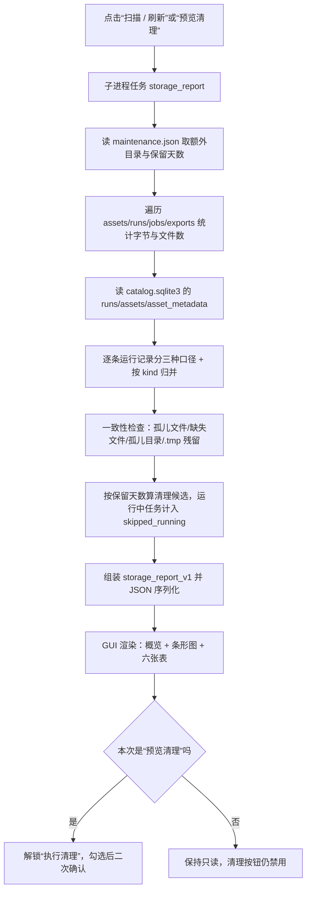

# 数据管理页面

版本：0.2.0。更新日期：2026-09-13。

分析项目的每一个环节都会往工作目录里落文件：导入与生成产生**信号资产**，检测/跳频/调制识别产生**运行记录**，
每个后台任务另外落一份**任务工件**，导出再产生**导出文件**，元数据进**索引数据库**。这些内容分散在
`workspace_data/<项目>/` 的多个子目录里，长期使用后既难以判断“空间被谁吃掉了”，也难以判断“磁盘上的文件与
索引是否还对得上”。本页把这四件事收敛到一个只读盘点 + 白名单清理的标签页里。

放在“跳频参数”之后、“运行记录”之前，是因为它描述的就是“运行记录”的存储侧；两个页面共用同一份目录
（`runs/` ↔ 运行记录表），但**数据管理页只统计与清理，不创建任何运行记录**。

---

## 1. 目标与边界

| 本页负责 | 本页不负责 |
| --- | --- |
| 按目录统计工作区与额外目录的占用（字节数与文件数） | 读取或重算资产内容（**不重算 SHA-256**，见 §3） |
| 核对索引与磁盘的一致性（未入库文件、缺失文件、孤儿目录、原子写残留） | 修复索引：发现问题只报告，不自动改数据库 |
| 列出按保留天数可安全清理的条目并执行删除 | 删除已入库的资产、已入库的运行目录、`exports/`（**永不可删**） |
| 导出 HTML / JSON 盘点快照 | 写入运行记录（扫描与清理都不调用 `save_run`） |
| 记录清理审计日志 | 压缩、迁移、去重、备份资产 |

设计上的三条硬约束：

1. **只读优先。** 扫描本身完全不改工作区；删除必须经过“显式预览 → 逐条勾选 → 二次确认”三步。
2. **失败安全。** 删除前按当前磁盘与索引**重新计算**候选集，只删仍在候选集里的路径（防 TOCTOU），
   并且只允许删 `jobs/`、`assets/`、`runs/` 三个顶层目录下、已经判定为过期或孤儿的内容。
3. **规模安全。** 单文件大小取 `stat().st_size`，不打开文件；目录遍历上限 `MAX_FILES = 200000`，
   超限时把结果标为截断并给出提示，宁可少报也不让页面挂死。

---

## 2. 工作区数据布局

`workspace_data/<项目>/`（分析项目为 `workspace_data/analysis`）由三部分构成：

```text
workspace_data/analysis/
  project.json            # 项目标识 {"project": "signal_analysis", "schema": 1}
  catalog.sqlite3         # 索引数据库：runs / assets / asset_metadata
  assets/                 # 信号资产，不可变 NPY，文件名 <asset_id>.npy
  runs/<run_id>/          # 运行产物：result.json（必）+ plots.npz（可选）
  jobs/<job_id>/          # 任务工件：request.json / response.json / status.json / worker.log
  exports/                # 导出物：按需创建，<asset_id>.<ext>
  maintenance.json        # 本页设置（额外目录、任务保留天数），首次保存时创建
  maintenance.log         # 清理审计日志，JSONL，每次清理追加一行
```

索引数据库三张表（`PRAGMA user_version = 1`）：

| 表 | 关键列 | 说明 |
| --- | --- | --- |
| `runs` | `id, kind, source_id, created_at, result_json` | 一次任务的结果概览；`result_json` 是磁盘 `runs/<id>/result.json` 的**完整副本** |
| `assets` | `id, name, path, sha256, sample_rate, sample_count, created_at, source, label` | 信号资产；`path` 形如 `assets/<id>.npy` |
| `asset_metadata` | `asset_id, metadata_json` | 附带元数据（SigMF 头、生成真值等） |

写入约定（决定了“一致性”可用什么判据）：资产与导出先用 `path.with_suffix(".tmp")` 写临时文件再
`replace()` 原子替换；任务目录在子进程启动前就已建好并写入 `status.json`，所以**目录先于状态存在**是正常
状态，而 `*.tmp` 残留意味着上一次写入中断。

---

## 3. 容量口径

| 统计对象 | 字节定义 |
| --- | --- |
| 单个文件 | `stat().st_size`。**不重算 SHA-256**：100 MiB 级资产重算摘要会让扫描退化成分钟级 |
| 目录（`assets` / `runs` / `jobs` / `exports`） | 目录下所有普通文件之和；**不跟随目录符号链接**（避免自指死循环） |
| `catalog.sqlite3` | 文件本身大小（含空闲页与索引） |
| 页面设置 | `maintenance.json` + `maintenance.log` 之和 |
| 运行记录（逐条） | 三种口径分开给：`bytes` = 整个 `runs/<id>/` 目录；`sqlite_bytes` = 该条 `runs.result_json` 在 SQLite 里的长度；`plots_bytes` = 目录内除 `result.json` 之外的部分 |
| **索引冗余** | `Σ runs.result_json 长度 + Σ asset_metadata.metadata_json 长度`，即结果 JSON 在 SQLite 与磁盘上各存一份造成的重复占用 |
| 额外目录 | 与工作区目录同一口径；计入总计与图表，但**不参与一致性检查**（见 §5） |
| 总计 `totals.bytes` | 工作区各类别之和 + 额外目录之和；`totals.workspace_bytes` 只算工作区 |

零除与异常一律按 0 处理：文件不可读、目录不存在、时间戳无法解析时不会抛异常，只会得到 `0` 或 `未知`。
`format_bytes()` 对负数、`NaN`、`Infinity`、`None`、非数字字符串统一返回 `"0 B"`，保证界面与报告里不出现
`NaN`/`inf`（报告还要通过 `json.dumps(..., allow_nan=False)`）。

---

## 4. 扫描与报告流程



扫描是一个普通后台任务（`action = "storage_report"`），因此与其它页面一样有超时与取消；GUI 侧把它的超时
放宽到 300 s（整棵目录树的遍历时间远大于默认 30 s）。**它不写运行记录**，所以扫描本身不会让工作区变大，
也不会在“运行记录”页里堆出无意义条目。

### 报告契约 `storage_report_v1`

| 字段 | 含义 |
| --- | --- |
| `kind` / `version` | 固定为 `storage_report` / `storage_report_v1` |
| `root` / `generated_at` | 工作区绝对路径、UTC 生成时间 |
| `settings` | `extra_dirs`、`job_retention_days`（本次生效值） |
| `totals` | `bytes`、`files`、`workspace_bytes`、`extra_bytes` |
| `categories[]` | `key, label, bytes, files, managed`；key ∈ `assets/runs/jobs/exports/catalog/settings` |
| `extra_dirs[]` | `path, exists, bytes, files`；不存在的目录 `exists=false` 且按 0 计入 |
| `runs_by_kind[]` | `kind, label, count, disk_bytes, sqlite_bytes`，按磁盘占用降序 |
| `tables` | `assets` / `runs` / `jobs` / `exports` / `orphan_runs` 明细，各带 `*_truncated` 标记 |
| `catalog` | `assets`、`runs` 条数与 `index_bytes`（索引冗余） |
| `consistency` | §5 的全部计数与明细 |
| `cleanup` | `retention_days`、`targets[]`、`bytes`、`skipped_running` |
| `warnings[]` | 需要人工关注的提示（缺表、截断、缺失文件、孤儿运行记录、额外目录不存在） |

`tables.*` 有行数上限（资产 500、运行 1000、任务 500、导出 500、一致性明细 200）；**总计始终按整棵目录树
统计**，不受表格截断影响，因此“表里看到 500 行、总计却更大”是正常的，界面用 `500+` 表示已截断。

`preview_cleanup()` 在同一份报告基础上只返回 `cleanup` 部分（`kind = storage_preview`），供 dry-run 与脚本调用。

---

## 5. 一致性检查

只有工作区目录参与检查。五类问题各有独立判据与出口：

| 问题 | 判据 | 严重度 |
| --- | --- | --- |
| **未入库文件** | `assets/` 下存在文件，但 `assets.path` 里没有对应记录 | 磁盘虚高，可安全清理 |
| **原子写残留** | `assets/` 下文件名以 `.tmp` 结尾 | 写入中断留下，可安全清理 |
| **入库但文件缺失** | `assets` 有记录，但 `assets/<id>.npy` 不存在 | 该资产无法分析（校验必然失败），**不可清理**，需重新导入 |
| **未入库运行目录** | `runs/` 下有目录，但 `runs.id` 里没有对应记录 | 归档失败残留，可安全清理 |
| **源资产已删除** | 运行记录的 `source_id` 在 `assets` 里已找不到 | 记录仍可读（结果已存档），但无法回溯原始信号 |

“未入库运行目录”与“源资产已删除”是两件不同的事：前者是磁盘上多了一个目录，后者是索引里多了一条指向
已删资产的记录。二者都出现在报告里，但只有前者会被列为清理候选。

额外目录（如 `training/data`、`training/runs`、模型目录）**只统计容量**：那里的文件不属于本项目的索引
体系，拿 catalog 去比对只会得到满屏假阳性，因此一律跳过一致性检查，也不产生清理候选。

---

## 6. 安全清理规则

### 6.1 什么可以被删

| 类别 | 条件 |
| --- | --- |
| **过期任务**（`jobs/<id>/`） | `status.json` 的 `state` ∈ `success/failed/cancelled`，**且**距 `finished`（缺失时退回 `started`，再退回目录 mtime）已 ≥ 保留天数 |
| **无主文件**（`assets/*`） | 即 §5 的“未入库文件”与 `.tmp` 残留 |
| **无主目录**（`runs/<id>/`） | 即 §5 的“未入库运行目录” |

`state = running`、状态文件缺失或状态无法识别（记为“未知”）的任务一律**算作未结束**，永不出现在候选里，
并计入 `cleanup.skipped_running`。保留天数 `0` 表示“所有已结束任务都可选”，默认 30 天，取值域 `0～3650`。

**永远不会被删**：`assets/` 中已入库的资产（`assets.path` 有记录）、`runs/` 中已入库的运行目录、
`exports/` 下的任何文件、`catalog.sqlite3`、`project.json`、`maintenance.json`、`maintenance.log`，
以及工作区根目录本身。

### 6.2 三道护栏

1. **预览解锁。** 只有本次报告来自“预览清理”时，`_cleanup_ready` 才为真；普通扫描、改动保留天数、
   完成一次清理都会立刻把它置回假，按钮随之禁用。
2. **逐条勾选 + 二次确认。** 勾选后才启用“执行清理”，确认框列出条目与总字节数，并明确提示
   “已入库的信号资产、运行目录与 exports/ 不在可删范围内；该操作不可撤销”。
3. **服务端重算（防 TOCTOU）。** `apply_cleanup()` 不信任前端清单：它按当前磁盘与索引重新算一遍候选集，
   再与请求交集；不在最新候选集里的项一律跳过并回报原因“当前已不是清理候选（可能被引用或仍在运行）”。
   路径规范化还会拒绝绝对路径、含 `..` 的路径、以及首段不在 `jobs/assets/runs` 白名单内的路径。

### 6.3 审计与回报

每次清理都会往 `maintenance.log` **追加一行 JSON**（失败也不影响清理结果）：

```json
{"at":"...","requested":2,"removed":[{"path":"jobs/xxx","bytes":4096,"kind":"job"}],
 "skipped":[...],"errors":[...],"bytes":4096}
```

任务返回 `storage_cleanup`，含 `removed` / `skipped` / `errors` / `bytes` / `requested` / `remaining`，
界面汇总为一句“已删除 N 个条目，释放 X”并列出前 12 条路径，`skipped` 与 `errors` 分别计数。
清理完成后自动重新扫描一次，让页面立刻回到一致状态。

### 6.4 典型用法

| 场景 | 建议 |
| --- | --- |
| 长期跑检测/训练，`jobs/` 不断堆积 | 保留天数设 7～30 天，预览后清理过期任务；`jobs/` 只存任务日志与状态，删掉不影响资产与结果 |
| 想回收大头 | 看“运行记录”表：`runs/` 通常是最大项，其内容由具体任务产生；要回收需先在“运行记录”页删除对应记录（本页不代替该操作） |
| 想量化训练数据占用 | 把 `training/data`、`training/runs` 加为额外目录，仅做容量统计 |
| 发现“入库但文件缺失” | 不是清理问题，重新导入该资产；旧记录保留以便对照 |

---

## 7. 页面操作说明

| 控件 | 作用 |
| --- | --- |
| **扫描 / 刷新** | 只读盘点，刷新概览、图表与六张明细表 |
| **打开工作目录** | 用系统文件管理器打开工作区根目录 |
| **导出报告** | 保存 HTML 或 JSON 快照（`storage_report.html` / `storage_report.json`）；未扫描时给出提示，不与运行记录冲突 |
| **额外目录 + 添加目录… / 移除** | 增删参与容量统计的外部目录；工作区自身会被拒绝，重复项会被去重；改动立即写回 `maintenance.json` 并触发重扫 |
| **任务保留** | 可清理任务的年龄门槛；改动后需重新预览才允许删除，值在结束编辑时持久化 |
| **预览清理** | 用当前保留天数重算候选并**解锁**删除 |
| **执行清理** | 需先勾选；二次确认后执行，完成后自动重扫 |
| **概览行** | 工作区路径、总占用/文件数、各类别占用、索引冗余与条数、额外目录、`⚠` 提示 |
| **占用图** | 按类别（含额外目录）画柱形图，单位 MiB，零值类别不绘制 |
| **信号资产 / 运行记录 / 任务工件 / 导出文件** | 逐条明细；缺失文件与截断都会在表里标明 |
| **一致性** | 五类问题合并成一张表；干净时显示一行“无 · 索引与磁盘一致”，标签上带问题条数 |
| **可清理项** | 候选清单（类别、路径、占用、判定依据），带勾选框；提示行给出候选数、总字节数与跳过数 |

运行记录表的“类型”列用的是 `RUN_KIND_LABELS` 中文名（通用统计、能量检测、逐跳参数、AI 检测、
AI 逐跳、调制识别、原始 IQ 识别、原生插件、IQ 生成、仿真），未知 kind 原样显示。

---

## 8. 与脚本 / 代码的对应

页面调用的就是服务层的两个动作，脚本里可以直接用同一个入口，不需要 GUI：

| 动作 | 请求字段 | 返回 |
| --- | --- | --- |
| `storage_report` | `extra_dirs`（可选）、`job_retention_days`（可选） | `storage_report_v1` 报告 |
| `storage_cleanup` | `targets`（必填，≤ 5000 条）、`extra_dirs`、`job_retention_days` | `storage_cleanup` 结果 |

```python
from signal_analysis.storage import Workspace             # noqa: E402
from signal_analysis.maintenance import build_report, apply_cleanup

workspace = Workspace("workspace_data/analysis")
report = build_report(workspace, job_retention_days=7)    # 只读
paths = [item["path"] for item in report["cleanup"]["targets"]]
result = apply_cleanup(workspace, paths, job_retention_days=7)   # 真正的删除
```

实现刻意只依赖标准库（不引入 NumPy）：它不参与 DSP，且扫描要在没有科学计算栈的环境里也能跑。

| 文件 | 职责 |
| --- | --- |
| `src/signal_analysis/maintenance.py` | 盘点与清理核心：`format_bytes`、`read_settings` / `write_settings`、`build_report`、`preview_cleanup`、`apply_cleanup`，以及 §3～§6 的全部口径与护栏 |
| `src/signal_analysis/services.py` | 注册 `storage_report` / `storage_cleanup` 两个动作；**都不调用 `save_run`** |
| `src/signal_analysis/gui.py` | `build_data_management()` 及渲染方法；`_run_task` 把这两个动作的超时放宽到 300 s |
| `src/common/gui.py` | 新增 `result_status()` 钩子：只读动作的状态栏文案改为“数据盘点完成（只读，未写入运行记录）”，不再误报“结果已保存” |
| `tests/analysis/test_maintenance.py` | 口径、一致性、候选过滤、路径白名单、审计日志、设置往返（19 项，不需要 GUI） |
| `tests/analysis/test_gui_analysis.py` | `test_data_management_tab_scan_and_cleanup_gating`、`test_data_management_scan_and_export_never_write_runs` |

与本文口径一致的测试断言：类别字节数与磁盘 `st_size` 逐项相等；`runs_by_kind` 的分组与标签；
`index_bytes` 严格小于总占用；`.tmp` / 未入库 / 缺失 / 孤儿目录四类问题各被识别一次；保留期内零候选、
运行中任务进 `skipped_running`；`apply_cleanup` 对 `../`、绝对路径、`exports/`、运行中任务、已入库运行目录
一律跳过；审计日志每次追加一行且 `bytes` 与返回一致；报告可通过 `json.dumps(..., allow_nan=False)`。

---

## 9. 已知局限与后续方向

* **`exports/` 不参与清理。** 导出物不入库，无法判定归属，因此本页只统计不删除；要回收请在生成/导入页
  重新导出或手动处理。
* **索引冗余只报不治。** 结果 JSON 在 SQLite 与磁盘各存一份（前者供列表与报告，后者供离线查看）。
  想去掉这一份冗余需要改运行记录存储结构并做兼容迁移，超出本页范围。
* **工作区根目录下的历史残留目录只统计不清理。** `workspace_data/{assets,runs,jobs,catalog.sqlite3}`（没有
  `project.json`）是旧版布局留下的目录，任何工具都不会去动它；如果确认无用，请手动删除。
* **不做目录级去重与硬链接。** 同一份 IQ 被复制成两个资产就是两份占用，本页不会合并。
* **额外目录只是统计项。** 不会为它们建索引、判一致性或生成清理候选。
* **训练数据与模型不在本页的管理范围内。** 数据集在 `training/data`、训练输出默认落在 `training/runs`、
  模型由清单指向外部文件；这些位置只有在被显式加为额外目录后才出现在容量统计里。工作目录中与训练相关的
  内容仅体现为运行记录条目（`ml_detect`、`amc_classify`、`amc_iq_classify` 等）。
