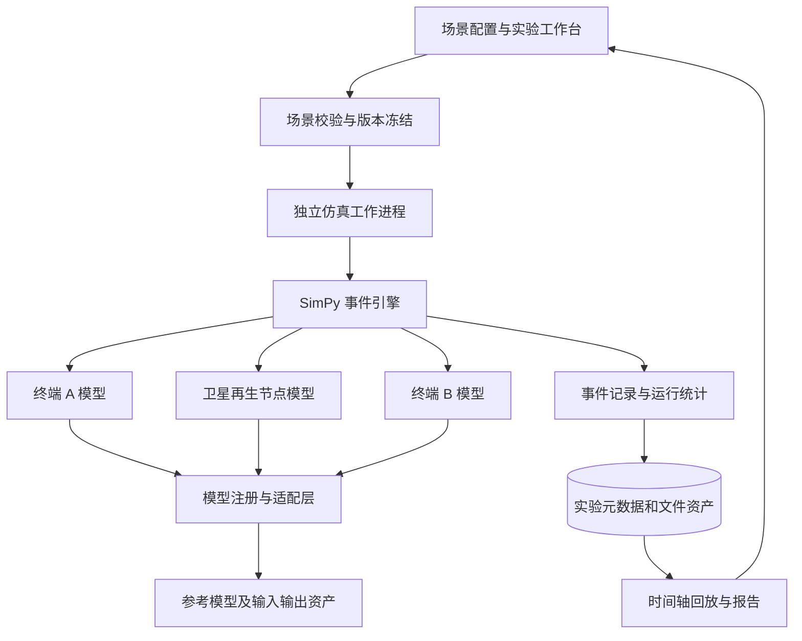

# 某星通信仿真系统 Python 技术方案

更新日期：2026-09-07。

基础代码已实现 SimPy 的 A→中继队列→B 通用事件演示、场景参数校验、消息完成状态、时间轴回放及报告。它不包含星地协议、无线波形、同步、跳频、编码或语音模型。当前数值模块已验证 Cython 编译，仿真模块仍为 Python。文件及测试说明见[基础工程实现与文件说明](基础工程实现与文件说明.md)；下文保留目标架构与模型依赖。

当前独立实现位于 `src/communication_sim`，桌面入口为 `apps/simulation_desktop/main.py`。通过 `python -m communication_sim gui` 单独启动，具有独立数据目录与发布清单，未包含另一项目业务页面。

## 1. 目标与边界

依据：[某星研制内容.docx](某星研制内容.docx)。

以 Python 建设离线通信实验平台，使用离散事件组织终端、卫星、业务和时隙，使用版本化模型接口接入经验证的处理模块，并提供实验管理、日志回放、统计和数据导出。

本文为通用软件架构和抽象仿真设计，不展开专用军事通信协议、具体跳频图案、同步算法、抗干扰参数或实装链路优化。对原文列出的编码、调制、同步和协议功能，定义模型位置、交付依赖及验收责任；实际能力取决于独立的模型规范与参考实现。

### 1.1 需求追踪

| 编号 | 原文要求 | 软件承接方式 | 状态或依赖 |
| --- | --- | --- | --- |
| B01 | 卫星 1 个、地面终端 2 个 | 场景对象、节点注册与拓扑展示 | 明确要求 |
| B02 | 报文、语音两类信源 | 业务资产与源模型接口 | 语音格式、质量与码率待确认 |
| B03 | 卷积、RS、Turbo 至少三种编码 | 三类独立编码模型适配器 | 具体模型配置和参考结果待提供 |
| B04 | DPSK、SDPSK、GMSK 至少三种调制 | 三类独立调制模型适配器 | SDPSK 定义及模型规范待确认 |
| B05 | 卫星与终端 16,000 跳/s | 场景参数及模型运行记录 | 属于原文指标；仿真与墙钟速度分别验收 |
| B06 | 通信带宽 1 GHz | 场景频率元数据及资源约束 | 总跨度/瞬时带宽/采样口径待确认 |
| B07 | 仿真频率范围 0～1 GHz 基带 | 数据表示与坐标约定 | 实数/复数表示及频率参考点待确认 |
| B08 | 星地跳频、同步和 TDMA | 版本化模型组件与事件接口 | 专用协议和参考轨迹待提供 |
| B09 | 星上再生处理与转发 | 接收、处理、排队、转发的分阶段节点模型 | 需与透明转发区分 |
| B10 | 星上时隙重组 | 转发调度模型及事件追踪 | 规则、缓存和时延定义待确认 |
| B11 | X 星仿真数据 | 实验资产导入导出、版本清单 | 指输入还是交付数据、格式和规模待确认 |
| C01～C03 | 核心模块二进制化及可重建交付 | Cython 编译边界、开发/二进制双模式回归 | 编译清单、目标环境及源码包形式待冻结 |

每类均需要对应的可执行模型、参考输入输出及独立测试记录。

## 2. 仿真层级与可行性判断

### 2.1 分层组织

| 层级 | 描述内容 | 适合验证 | 不能证明 |
| --- | --- | --- | --- |
| L0：事件级 | 业务到达、节点状态、缓存、接收及发送事件 | 调度流程、数据去向、可重复实验 | 波形、同步和译码正确性 |
| L1：参考模型级 | 在事件中调用既有离线模块或经验证的性能模型 | 模块接口和参考结果一致性 | 未建模的信道及真实设备行为 |
| L2：波形数据级 | 管理有限片段的采样数据、处理过程及产物 | 经约定模型支持的片段级实验 | 全带宽持续实时处理能力 |

先建设 L0 软件主链路和 L1 模型适配机制，明确 L2 所需数据范围、计算资源及模型来源后实施。若合同要求完整基带波形，则 L2 为必交范围，不能以 L0/L1 替代；在缺少模型定义时，该部分应记录为待落实依赖。

SimPy 提供进程式离散事件仿真，可以支撑实验时间与事件管理；它本身不提供通信波形、同步或编码模块。[SimPy 官方文档](https://simpy.readthedocs.io/en/stable/index.html)。

### 2.2 1 GHz 的容量问题

以下仅是计算资源量级分析，不是采样率选定或信号模型设计。

假设某实验使用 **1 Gcomplex-sample/s**、`complex64` 存储，则单路未压缩数据为 `10^9 × 8 = 8 GB/s`，一分钟约 480 GB，且不含中间结果和备份。这一假设不能自动从“0～1 GHz”推导出来。

必须先明确 1 GHz 指总频率跨度还是瞬时占用带宽，以及波形是实数还是复数、采样轴的参考点、仿真时长、并行数据路数和允许离线倍率，再选择硬件与存储方案。完整频率跨度的界面展示不代表已生成或处理同等带宽的全量波形。

每次运行前根据采样表示、数据路数、时长和保留策略计算预期数据量，超过配置的内存或磁盘配额时给出明确失败原因。采用摘要日志和按需保存的片段，可降低存储需求；任何裁剪或省略必须体现在实验清单里。

### 2.3 仿真速度的口径

分别记录 `simulated_duration` 和 `wall_duration`，并报告 `wall_duration / simulated_duration`。指标中的 16,000 跳/s 描述模型时间中的变化速率，不是 Python 线程每秒必须按墙钟完成的调度次数。

使用仿真时钟推进，不使用 GUI 定时器或 `sleep` 作为模型时钟。UI 可以降低刷新频率，但实验逻辑及需要保留的事件不能因绘图降频而丢失。

## 3. 总体架构

仿真工作进程接收已经冻结的场景快照，运行中不直接读取 UI 控件。参数修改创建新场景版本；原实验仍关联原配置，保证报告可复核。

节点、业务、模型和可视化分离。终端 A/B 复用同一节点类的不同实例；卫星采用独立节点类体现处理与排队责任。节点间通过带标识的数据对象和事件交互。

## 4. 模块设计

### 4.1 场景与配置管理

场景包括拓扑、业务资产引用、模型版本、实验时长、随机种子、统计项及输出保留策略。配置采用 JSON 等结构化文件，由 Python 数据模型执行字段、单位、取值类型和引用校验。

启动前检查节点数量、源文件存在性、模型是否可加载、必需配置是否齐全、输出目录空间及参考数据版本。SDPSK 等定义未确定的模型应显示“未配置”，不默认映射为其他模型。

专用帧结构、收发规则和模型内部参数由独立版本化规范提供。本平台只保存与校验其引用和声明，不凭需求片段猜测实际系统参数。

### 4.2 业务源管理

报文源保存文本编码、源资产摘要及消息标识；语音源保存音频容器、采样描述、时长及源资产摘要。文件读入与具体源编码模型解耦。

文本恢复检查内容及顺序；语音根据参考编码模型区分无损或有损结果。有损压缩不应以恢复文件逐字节一致作为验收条件，应由既定参考输出或质量评价规则判定。

支持业务完成、未完成、失败及取消状态。仿真结束时仍在缓存中的数据记录为未完成，不能计入成功传输。

### 4.3 终端节点

终端节点组织源处理、信道处理、调制处理、调度及接收恢复等模型组件。每个组件接收标准数据对象并返回结果引用和状态，保留输入输出长度及来源关系，便于定位数据在哪个阶段发生变化。

“组件可调用”和“通信结果正确”分别验证。界面可展示当前处理阶段和结果，但不通过动画帧数或状态灯判断通信指标是否达标。

### 4.4 卫星节点与再生转发

卫星节点划分接收处理、净荷交接、转发缓存和下行处理四个阶段。只有接收模型成功产出的净荷才能进入成功转发链路；失败数据按照场景中明确的处理规则记录。

再生模式要保留“接收产物 → 净荷 → 新的下行处理产物”的资产关系，不能将原始输入采样文件复制到输出路径便称为再生转发。处理时延、缓冲区容量、溢出处理及下行选择规则是显式模型依赖。

上、下行配置分别命名、分别版本化。不能因为两侧复用同一 Python 类就默认上、下行参数和状态相同。

### 4.5 模型适配与参考验证

| 模型组 | 注册内容 | 应交付的验证材料 |
| --- | --- | --- |
| 信源模型 | 模型 ID、格式约束、编码与恢复接口 | 文本和语音参考输入输出 |
| 信道编码模型 | 卷积、RS、Turbo 的独立模型条目 | 模型定义、配置版本、独立参考向量 |
| 调制模型 | DPSK、SDPSK、GMSK 的独立模型条目 | 精确定义、输入输出约定及参考片段 |
| 跳频与同步模型 | 模型规范 ID、状态与事件接口 | 来源明确的参考事件轨迹及结果 |
| TDMA 与转发模型 | 协议版本、节点行为与调度接口 | 参考场景、预期收发及转发记录 |
| 信道环境模型 | 模型 ID、输入数据和假设说明 | 参考结果及适用条件 |

适配器不能静默忽略不支持的配置；缺少模型必须在启动前阻断依赖它的实验。简化模型以单独 ID、名称和假设说明注册，报告明确标记其仿真层级。

这里不指定一个第三方通信库“天然满足全部需求”。先核查 API、许可证、维护状态、目标平台及模型覆盖，再决定复用或接入已有参考实现。

### 4.6 事件、回放与报告

事件包含实验 ID、事件 ID、模型时间、节点 ID、阶段、关联消息 ID、输入输出资产引用及结果码。同一时刻的事件采用明确的稳定顺序；记录足以复核的因果关联。

回放读取持久化事件及摘要，不重新运行模型。支持定位消息、查看路径与失败原因、按节点过滤以及导出时间轴。

报告展示场景版本、模型及依赖版本、随机种子、运行耗时、业务完成率、排队与处理时间分布、失败计数及保存的资产。涉及误码或帧错误统计时，先定义比对阶段、有效样本分母及尚未完成数据的处理方式，再接受模型输出；不把抽象成功概率直接标记为真实波形测得指标。

## 5. 数据及接口

### 5.1 核心对象

| 对象 | 核心字段 |
| --- | --- |
| Scenario | scenario_id、version、nodes、model_refs、source_refs、duration、seed、output_policy |
| ModelSpec | model_id、version、abstraction_level、config_schema_version、reference_asset_ids |
| Experiment | run_id、scenario_digest、environment_manifest、status、wall_start、wall_end |
| PayloadAsset | asset_id、source_type、path、digest、content_metadata |
| ProcessingArtifact | artifact_id、stage、model_ref、parent_ids、path、format、shape、units |
| SimulationEvent | event_id、run_id、sim_time、node_id、message_id、stage、status、artifact_refs |
| MetricRecord | run_id、metric_name、value、unit、measurement_scope、denominator、model_ref |

模型时间和真实执行时间使用不同字段。仿真时间采用统一、明确精度的表示，在系统层禁止混用秒、毫秒及采样索引；长实验须验证时间表示和事件顺序的稳定性。

### 5.2 应用接口

| 操作 | 输入 | 输出 |
| --- | --- | --- |
| 校验场景 | 场景及模型注册表 | 错误列表、依赖列表、容量估算 |
| 启动实验 | 冻结后的场景快照 | run_id |
| 查询进度 | run_id | 状态、模型时间、真实耗时、统计摘要 |
| 取消实验 | run_id | 取消状态及已保存产物 |
| 回放实验 | run_id、时间范围或消息 ID | 事件及资产引用 |
| 导出实验 | run_id、导出格式 | 数据包与校验清单 |

初期暂停表示保留工作进程并停止推进事件；跨进程重启后继续仿真需要所有模型支持状态序列化，应作为独立能力验证。基础交付可提供同配置重跑，不把重跑称为从断点恢复。

### 5.3 存储

SQLite 保存场景索引、实验状态、模型目录、文件清单及统计摘要。体量较大的事件按实验分文件顺序写入；波形和语音使用外部文件，避免数据库承载连续大数组。

一个实验目录建议包含冻结配置、环境清单、事件文件、统计、数据资产及报告。产物先写入暂存位置，完成后提交清单；取消或异常时保留不完整状态，禁止导出为“成功实验”。

大数组可使用 NumPy 内存映射读取片段，但这只改善文件访问方式，不会消除模型本身的计算量。[NumPy memmap](https://numpy.org/doc/stable/reference/generated/numpy.memmap.html)。

## 6. 运行与部署

Python 主程序负责场景与调度，数值工作交给所接入模型的数组计算实现。每个实验运行在独立进程，CPU/内存预算和输出配额由任务管理器控制。多组独立实验可并行，单次实验内部的并行必须先验证事件顺序及结果一致性。

建议提供 PySide6 桌面入口和无界面的批量运行入口，复用同一场景格式与实验引擎。桌面负责配置和回放，批量入口便于参考场景回归及报告归档。

复用另一项目的构建工具。

目标机选型以代表性实验的 CPU、内存、磁盘吞吐及模型依赖实测为依据。若需要离线分发，分别在目标平台构建运行包并验证系统库；PyInstaller 不能从一次构建自动产生所有平台的可用程序。[PyInstaller 官方手册](https://www.pyinstaller.org/en/stable/)。

核心模块通过稳定的 Python API 与应用层解耦，预留 Cython 编译为 `.pyd` / Python 扩展 `.so` 的能力，开发阶段完成编译试验与行为回归。原生编译和整体分发分成独立构建阶段，运行包收集核心二进制，源码包保留原始实现与重建材料。具体约定见[二进制与原生插件补充方案](核心模块二进制化与原生插件接口方案.md)。

## 7. 验收

| 验收项 | 方法 | 通过依据 |
| --- | --- | --- |
| 1 星 2 终端 | 加载固定场景并检查节点与消息关联 | B01；参考拓扑和业务路径 |
| 报文与语音 | 使用固定源资产，检查接收产物及完成状态 | B02；源模型参考结果 |
| 三种编码 | 每类执行独立参考向量测试 | B03；名称注册或仅自环往返不足以证明正确 |
| 三种调制 | 按明确规范比对参考产物 | B04；SDPSK 定义冻结是前置条件 |
| 16,000 跳/s | 依据参考轨迹检查模型时间与状态变化记录 | B05；另报告墙钟耗时 |
| 1 GHz 与频率范围 | 检查坐标、数据表示、模型范围和对应产物 | B06/B07；只验收配置框的数值不充分 |
| 同步及 TDMA | 对照提供的参考场景和事件轨迹 | B08；协议与模型规范为前置条件 |
| 再生与时隙重组 | 检查净荷交接、缓存及下行处理的因果关系 | B09/B10；参考输出与调度规则 |
| 数据交付 | 在干净环境导入数据包、核验摘要并回放 | B11；格式与数据量待确认 |
| 可重复性 | 相同配置、种子、模型和环境重复运行 | 事件轨迹一致；数值容差由模型定义 |
| 异常处理 | 缺模型、坏文件、配额不足、取消与进程异常 | 不产生伪成功结果；原因可追溯 |
| 资源与耗时 | 指定场景记录耗时、峰值内存和磁盘占用 | 门限须由仿真层级、时长和目标机共同确定 |
| 核心二进制 | 固定场景在开发和编译模式重复执行；无源码目录部署 | C01～C03：轨迹及数值容差符合模型规范，源码包可重建 |

参考测试应尽量来自独立来源。编码器与译码器相互配合的往返测试有可能掩盖相同错误，不能替代独立参考向量验证。未提供参考模型或标准的项记录为“未验证”，不能判为通过。
