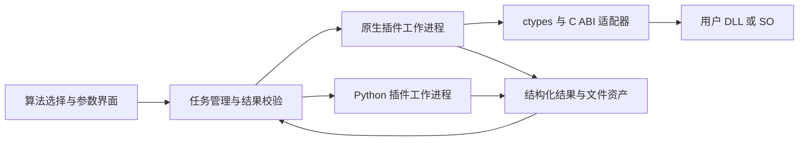

# 核心模块二进制化与原生插件接口方案

更新日期：2026-09-11。

当前已实现数值核心的 Cython wheel、桌面构建脚本和原生复制演示的工作台接入，见[基础工程实现与文件说明](基础工程实现与文件说明.md)。编译范围仍为 `signal_analysis._numeric`，其中除双音演示与统计/时频计算外，还包含信号 IQ 生成器（9 种调制样式，经 `core_api` 导出，见[分析方案](电磁信号分析识别系统_Python技术方案.md) 4.1 测试信号 IQ 生成）与能量检测 `detect_signals`（三参数、带内信噪比、跳频会话合并，经 `core_api` 导出，见同文 §4.6）；AI 检测与 A09 调制识别位于纯 Python 的 `signal_analysis.ml` 子包，不参与本机编译，其可选运行时 `onnxruntime` 不计入核心产物。二进制 wheel 构建后通过 `scripts/check_binary.py` 回归，调制识别模型 `signal_analysis/ml/amc_default.json` 作为包数据随 wheel 分发。第 5 节正式 `algorithm_*` 接口仍是待开发草案，不能与已实现的简化 `demo_*` ABI 混同。

## 1. 本次新增要求及结论

两个项目后期需要将核心模块编译成二进制；电磁信号分析识别项目需要调用用户提供的 DLL/SO，保留扩展接口并提供示例。当前按“核心源码参与编译，运行包使用二进制模块；按原合同另行交付源码包”设计。是否还要在运行包中附带可编辑源码，按用户确认调整。

本文描述通用软件模块编译和外部函数调用，不涉及专用信号算法实现。随文提供[通用数据复制示例](../examples/native_plugin/README.md)，用于验证编译、加载、类型声明及进程隔离；它不是检测、识别或通信算法，也不是完整生产 SDK。

## 2. 三类产物分别设计

| 产物 | 实现建议 | 加载方式 | 兼容性约束 |
| --- | --- | --- | --- |
| 自研 Python 核心模块 | Cython 将选定 `.py` / `.pyx` 编译为扩展 | Python `import` | Windows 通常为 `.pyd`，Linux 为带 ABI 标记的 `.so`；需匹配 Python、系统和 CPU |
| 用户原生模块 | C/C++ 等语言导出约定的 C ABI | 工作进程内通过 `ctypes` 加载 DLL/SO | 匹配操作系统、架构、位数、调用约定和依赖库；不要求链接 Python |
| 整体运行包 | PyInstaller 收集 UI、运行时、核心扩展及依赖 | 应用入口 | 分目标平台构建；外部插件从独立目录发现 |

Cython 的典型编译流程是 Python/Cython 源码生成 C，再由编译器生成 Python 扩展。普通 Cython 扩展并不会自动成为独立于 Python 的通用 C 动态库。[Cython 编译说明](https://cython.readthedocs.io/en/stable/src/userguide/source_files_and_compilation.html)。

PyInstaller 主要负责收集和分发，常规 Python 模块以字节码打包，不能替代核心模块的本机编译。官方文档也指出字节码存在被反编译的可能，并支持收集 Cython 扩展。[PyInstaller 运行与打包说明](https://www.pyinstaller.org/en/stable/operating-mode.html)。

“Linux 文件后缀都是 `.so`”不意味着两类接口相同：Python 扩展通过 `import` 使用，C ABI 库通过导出函数使用，不能按后缀混装。仅提供 C++ 类、STL 对象或编译器修饰符号的现有库，需要用户或适配方增加 C 包装层；无法做到任意 DLL/SO 零适配加载。

## 3. 核心模块二进制化

### 3.1 现在应固定的代码边界

应用层只依赖稳定的核心服务接口，核心实现不依赖 Qt 控件、UI 回调或任意目录中的源码扫描。开发模式和编译模式应使用相同的公开入口及结果结构。

第一期建立 `core_api` 与可替换的实现包，插件注册采用明确入口和清单；禁止把 `inspect.getsource`、读取核心 `.py` 文件或根据源码文件名查找实现作为运行前提。模型权重、配置和模板通过资源接口访问，独立于 Python 源码的位置。

先选一个通用核心模块验证 Cython 编译及打包链路，再扩大编译范围。已由 NumPy 或第三方本机库完成的计算，不承诺因外围 Python 编译而显著提速。

### 3.2 构建及发布流程

1. 锁定目标系统、CPU 架构、CPython 小版本、Cython、编译器和依赖版本。
2. 从受控源码构建核心扩展 wheel，并保留源码版本、构建日志和产物摘要。
3. 在干净环境中安装 wheel，运行与开发模式相同的参考用例，检查数值容差、异常及文件资源。
4. 从仅安装二进制核心 wheel 的发布环境打包应用；在运行包中排查核心 `.py`、`.pyx`、生成 C 文件、源码映射与调试产物。
5. 在无源码仓库的目标机启动应用、调用核心模块，并加载外置插件；执行软件功能与平台验收。

运行包、源码包、插件 SDK 分别编号。源码包包含合同要求的核心源码和重建脚本；构建服务器单独保存调试符号，便于对应版本排错，实际使用的第三方依赖仍按其许可要求交付相关材料。

## 4. 用户 DLL/SO 接入架构

Python 插件和原生插件在 UI 中使用相同的算法描述、参数配置、任务状态及结果格式。原生桥接器负责布局转换和 ABI 调用，不要求用户库调用 Qt、Python 或数据库。

使用 `ctypes` 作为首选 FFI，显式声明每个函数的 `argtypes` 和 `restype`；已有特殊接口可以另设适配器。`ctypes` 支持 DLL/共享库和 C 兼容类型，调用约定须与导出函数一致。[Python ctypes](https://docs.python.org/3/library/ctypes.html)。

加载库本身可能执行本机初始化代码，因此版本探测、初始化和实际调用全部在工作进程中进行。首次接入默认每任务单独进程；后期若复用进程，须先验证插件的状态清理与资源释放。

原生访问越界或崩溃可能直接终止进程，不能只靠 Python `try/except` 捕获。主程序监控退出码和截止时间，记录 `plugin_crashed`、`timeout` 或 `load_failed`，清理临时资产后可启动新任务。进程隔离用于故障隔离，本身不是运行不可信代码的权限沙箱；插件由用户明确导入并启用。

## 5. 生产 C ABI 草案与约束

以下为待冻结的 SDK 设计，正式 `algorithm_api.h`、结构体布局及生命周期实现属于后续 SDK 开发任务。随文的 `demo_api.h` 是独立的简化示例，不能作为这些功能已经完成的证据。

| 接口 | 职责 | 约束 |
| --- | --- | --- |
| `algorithm_get_abi_version` | 返回 ABI 版本 | 主版本不兼容时拒绝加载；算法版本与 ABI 版本分开 |
| `algorithm_create` | 接收 UTF-8 JSON 配置及长度，创建实例 | 输出不透明句柄；失败时不得返回可用实例 |
| `algorithm_process` | 接收句柄、输入描述及只读数据块 | 返回状态和结果句柄；明确片段边界及数据有效期 |
| `algorithm_get_result` | 读取结果元数据和数组视图 | 返回明确长度及类型，指针有效期到结果释放为止 |
| `algorithm_release_result` | 释放插件分配的结果 | 由分配内存的库释放，不能跨运行库调用 `free` |
| `algorithm_get_last_error` | 把错误文字写入调用方缓冲区 | UTF-8、容量及实际长度明确，错误文本不替代状态码 |
| `algorithm_destroy` | 释放实例及其私有状态 | 在正常流程中保证调用；进程崩溃则由宿主回收任务 |

导出接口使用 C 链接、固定宽度整数和不透明句柄；Windows 基线采用 `cdecl`，C++ 实现使用 `extern "C"` 且捕获内部异常，不允许 C++ 异常穿过 ABI。结构体包含 `struct_size` 和版本，冻结字段偏移与对齐规则，禁止跨边界传递 STL、Python 对象或编译器相关复数对象。

### 5.1 数据契约

| 内容 | 初始约定 |
| --- | --- |
| IQ 数据 | 连续、交织 float32：I0、Q0、I1、Q1；明确 `sample_count` 是复采样数，数组元素数为其两倍 |
| 存储与内存 | 文件字节序显式记录，桥接器转换为当前进程本机字节序与对齐布局；声明发生的复制 |
| 片段元数据 | 采样率、起始采样索引、可选设备中心频率及有效标志、来源资产 ID |
| 单位 | 频率 Hz，时间 s，符号速率 Baud；其他量均带单位及定义版本 |
| 输入所有权 | 宿主持有，只读且仅本次同步调用有效；插件不得在返回后继续访问 |
| 结果 | 版本化 JSON 元数据与有类型数组分开；结果由插件持有，宿主在释放前复制或归档 |
| 容量 | 预先设置输入、输出及结果大小上限；读取前检查长度、维度和乘法溢出 |
| 状态 | 成功、部分结果、参数错误、不支持、内部错误等；失败产物不进入成功结果表 |

初期接口采用同步分块调用，不引入跨语言回调。每个句柄串行处理；有状态模块需定义跨块状态和首尾片段语义。无原生协作取消接口时，超时或取消通过终止整个工作进程完成，不强行中断同进程线程。

数据块的指针只在工作进程地址空间内使用，不能把主进程的裸地址当作 IPC 消息发送。跨进程传递文件引用或共享内存描述，再在工作进程中获取本地视图；生命周期由任务管理器负责。

### 5.2 插件清单与加载流程

正式插件包包括 `plugin.json`、目标平台动态库、依赖库、参数结构说明及参考用例。清单至少含插件 ID、算法版本、ABI 版本、入口文件、目标系统/架构/位数、调用约定、支持的数据类型、结果结构版本和依赖摘要。

用户导入插件包 → 校验清单及路径 → 在子进程检查架构与依赖、符号和 ABI → 执行参考用例 → 显示可用能力 → 用户启用。清单是声明，仍需通过实际加载及测试验证。原生库必须按绝对路径加载，依赖搜索目录限定到已选择插件的位置与明确的系统依赖。

同一库不得在运行中覆盖更新；新版本进入新目录，新任务选择新版本，原任务继续引用原摘要。Windows DLL 不能在 Linux 原生加载；x86_64 与 ARM64 不能混用，64 位宿主也不能直接加载 32 位库。既有非标准库应建立单独的适配工作项及验证样例。

## 6. SDK 与示例交付

| 交付项 | 本轮状态 | 正式交付要求 |
| --- | --- | --- |
| 编译与二进制交付方案 | 已实现数值核心编译、wheel 检查、桌面打包及 Linux 验证 | 扩大编译范围并验证目标平台 |
| C ABI 及数据契约 | 已形成草案 | 冻结 `algorithm_api.h`、版本规则、结构体与错误码 |
| C DLL/SO 示例 | 已提供通用 float32 数据复制示例 | 按正式 ABI 补齐生命周期、结果及参考用例 |
| Python 调用示例 | 已接入工作台、CLI、任务管理、清单及结果资产 | 按正式 ABI 补齐生命周期与输出结构 |
| 构建说明 | 已提供 CMake 和 Windows/Linux 命令 | 在实际 Windows/麒麟架构矩阵中验证 |
| SDK 测试 | 已验证复制示例、平台错配、错误 ABI、超时和崩溃隔离 | 正式 ABI、完整依赖链和资源泄漏测试待补齐 |

最小示例的编译和运行见 [examples/native_plugin/README.md](../examples/native_plugin/README.md)。示例只用于验证通用接口行为，不引入检测、识别或通信处理能力。

## 7. 验收

| 编号 | 验收项 | 通过条件 |
| --- | --- | --- |
| C01 | 核心编译 | 目标核心模块可构建为扩展并在无源码仓库环境运行 |
| C02 | 功能一致性 | 开发版与编译版在固定参考用例上结果、异常及资源行为一致，数值容差明确 |
| C03 | 交付清单 | 运行包使用选定核心二进制；源码包完整且可重建；SDK 单独版本化 |
| A12 | 用户 DLL/SO 接入 | 各承诺平台加载符合 SDK 的用户库、执行并归档结果 |
| A13 | 插件故障隔离 | 缺库、缺符号、ABI 错误、超时和本机崩溃均不使主程序退出 |
| A14 | SDK 可用性 | 用户按文档独立编译示例并接入，核对数据布局、结果及内存释放 |
| A15 | 安装后扩展 | 已打包程序可以新增外置插件，无需重打主程序；更新不改变历史任务的库版本 |

在需求与平台验证阶段完成核心编译试验和 C ABI 草案；在数据主链路阶段开发桥接工作进程；算法适配阶段完成 SDK 和结果映射；系统验证阶段覆盖二进制包、用户插件及异常场景。
