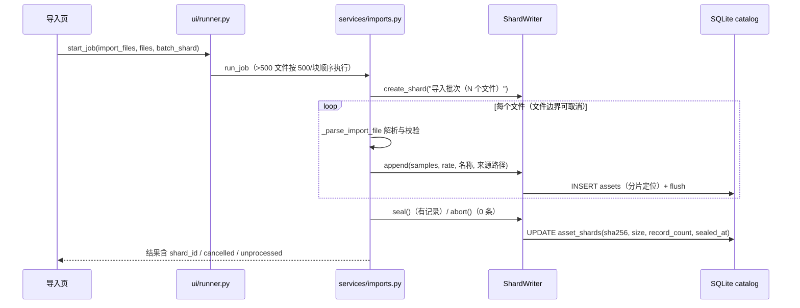
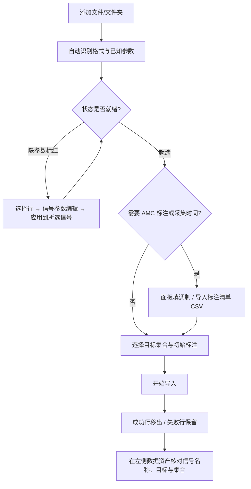

# 信号导入页面

版本：0.3.2。更新日期：2026-10-02。

「信号导入」是信号分析桌面应用的第一个标签页，负责把**离线 IQ 素材**（复基带记录）登记为工作区里的**信号资产**。
页面以**文件清单**为中心：添加文件或文件夹后只读头部/元数据自动识别格式与已知参数，缺参数的行标红且不参与
导入；清单本身**只读**，所有编辑通过下方的**“信号参数编辑”面板**完成（选择一个或多个文件 → 编辑字段 →
应用到所选信号）。导入路径**只登记 AMC 标注（调制 + 可选 SNR）**，不建检测标注；成批真值与采集时间用 **CSV 标注清单**
集中申报。数据模型见[数据库设计](数据库设计.md)，集合与标注的组织方式（成员关系、目标参考参数、任务标注集、覆盖度）
见[数据管理页面设计（09）](09数据管理.md)，逐文件实现说明见[基础工程实现与文件说明](基础工程实现与文件说明.md)。

---

## 1. 目标与边界

| 本页负责 | 本页不负责 |
| --- | --- |
| 文件/文件夹批量收集与格式自动识别（只读头部） | 重新计算或修改源文件；CSV 点数等“解析时确定”的信息不预读全文 |
| 缺参数门禁（缺采样率/类型/字节序的行标红、不参与导入） | 猜测未知二进制格式（类型与字节序必须显式给出） |
| 信号名称/采样率/调制/SNR/类型/字节序的多选编辑（面板） | 频率上下限、射频中心、备注的编辑（本页不提供入口） |
| CSV 标注清单：信号名称、时间范围（多目标）、调制、SNR、采集时间 | 逐跳目标（需父会话与跳序号，由检测页产生） |
| 归属集合、初始标注、分片策略、导入执行与协作取消 | 资产内容的分析与识别（见其他页） |

三条硬约束：

1. **只读清单 + 面板写入。** 表格不接受就地编辑；字段变更一律经“应用到所选信号”按钮显式提交，多选时一次写回全部选中行。
2. **缺参数即阻塞。** 状态列不为“就绪”的行不会进入导入；修正后状态自动恢复（标红随之消失）。
3. **仅 AMC 标注。** 导入只登记调制与可选 SNR（`for_amc=1`、`for_detection=0`）；SNR 写入目标参考参数（`snr_db`，口径 `declared`）。旧清单里的频率/备注列**不再解析**，出现时在报告中列明“已忽略”，不静默丢弃。

---

## 2. 页面导览

| 区块 | 内容 | 说明 |
| --- | --- | --- |
| 工具栏 | 添加文件… / 添加文件夹… / 移除选中 / 重新识别 / 导入标注清单 CSV… | 文件夹递归收集 `.npy/.csv/.bin/.raw/.iq` 与 SigMF 元数据；SigMF 双文件按一条记录计（只登记元数据文件，选择数据文件自动归一为同名元数据） |
| 文件清单 | 10 列（见 §2.1） | 只读；用多选配合下方面板编辑 |
| 归属与采集信息 | 目标集合（不加入/新建/追加）、初始标注 | 采集时间不手填：由清单“采集时间”列携带，缺省记导入时间 |
| 信号参数编辑 | 信号名称 / 采样率 / 调制 / SNR / 类型 / 字节序 + 应用到所选信号 | 留空 = 不修改；“未知”调制 = 清除目标；SNR 随目标写入参考参数 |
| 写入方式 | 自动（按文件数）/ 强制独立文件 / 强制写入分片、自动阈值（默认 20，范围 2–500） | 自动：文件数 ≥ 阈值才写分片；强制分片：单个文件也建分片。选择规则与完整流程见 §4.5 |
| 动作栏 | 开始导入 / 去数据管理查看 / 状态与清单报告 | 成功行移出清单，失败行保留可重试 |

### 2.1 文件清单列（只读）

| 列 | 含义 | 写入入口 |
| --- | --- | --- |
| 文件名 | 磁盘文件名（含扩展名） | 文件自身（只影响默认信号名称） |
| 格式 | NPY / CSV / IQ 二进制 / SigMF | 文件自身 |
| 信号名称 | 显式名 > 自动命名（§4.2）> 文件名 | 面板“信号名称”（留空不修改） |
| 采样率 | Hz；SigMF 取自元数据（只读） | 面板“采样率” |
| 类型 | NPY/CSV/SigMF 显示文件 dtype；二进制显示已选类型 | 面板“类型”（仅二进制） |
| 字节序 | 仅二进制需要；其它格式显示“自动” | 面板“字节序”（仅二进制） |
| 点数/时长 | NPY/SigMF 读头部；二进制按类型与字节数推算；CSV“解析时确定” | — |
| 调制 | 已申报的调制（无则“—”） | 面板“调制”或 CSV 清单 |
| SNR | 目标参考参数 `snr_db`（dB；无则空，多值显示“混合”） | 面板“SNR”或 CSV 清单 |
| 状态 | 就绪 / 缺… / 解析失败 / 目标 N 条 | 缺参数单元格背景标红 |

### 2.2 信号参数编辑面板

选中清单行时，面板自动载入**公共值**（多值或不一例时留空）；点击“应用到所选信号”只写非空字段。

| 字段 | 应用到 | 规则 |
| --- | --- | --- |
| 信号名称 | 所有选中行 | 显式名优先生效；留空不修改（自动命名兜底） |
| 采样率 | 非 SigMF 行 | 正有限数（Hz）；SigMF 行跳过并在状态栏说明 |
| 调制 | 所有选中行 | 留空 = 不修改；“未知” = 清除该行目标；其余值 → 1 条“整条”AMC 目标（可自由输入字典外类名，原名保留） |
| SNR | 所有选中行的目标 | 数值（dB）写入目标的参考参数（`snr_db`，口径 `declared`）；留空不修改；所选行尚无目标时提示先申报调制 |
| 类型 / 字节序 | 仅 IQ 二进制行 | **仅当所选文件全部为 IQ 二进制时可编辑**，否则禁用；混合格式请分组选择 |

---

## 3. 数据格式说明

| 格式 | 扩展名 | 识别方式 | 必填参数 | 说明 |
| --- | --- | --- | --- | --- |
| NPY | `.npy` | 读 NumPy 头部：1 维、dtype、点数 | 采样率 | dtype 由文件决定（实数/复数皆可）；入库统一转 complex64 |
| CSV | `.csv` | 无表头单列实数或两列 I,Q | 采样率 | 点数“解析时确定” |
| IQ 二进制 | `.bin` / `.raw` / `.iq` | 按字节数推断点数 | 采样率 + 类型 + 字节序 | 不猜格式；`int16` 按 1/32768 缩放，`float32` 原样 |
| SigMF | `.sigmf-meta` + `.sigmf-data` | 官方库读元数据 | 无（采样率来自元数据，只读） | 双文件须一起保存与分发；清单只登记元数据文件（`x.sigmf-meta`），同名数据文件自动配对、不单独列出 |

补充规则：

- 单文件 ≤ 512 MiB、≤ 16,000,000 个复采样点；单次“添加文件/文件夹”识别上限 2000 个，单批导入上限 500 个（超过自动按 500/块拆块执行，仍是同一任务与同一取消事件）。
- **采样率必须手填**（NPY 头、CSV 内容都不带采样率）；IQ 二进制必须显式给出类型与字节序（`int16`/`float32` × 小端/大端）。
- 入库统一落为**一维 complex64 复基带**：实数输入视为虚部为 0。物理落盘两种：**独立 NPY**（`assets/<asset_id>.npy`，先写 `.tmp` 再原子替换）或**分片**（`assets/shards/<shard_id>.bin` 连续追加的 `[offset, offset+length)` 采样点区间，封存后不可改）；选择规则与完整写入/读取流程见 §4.5。
- SigMF 的数据类型（如 `cf32/cf64/ci16`）由官方库读出并统一换算；要改采样率请改元数据或改用其他格式导入。

### 3.1 标注清单 CSV（格式与示例）

“导入标注清单 CSV…”用于成批申报，每行一个目标；列名支持中文与常用英文别名（`file`/`path`、`name`、`scope`、`unit`、`start`、`end`、`modulation`、`snr`、`capture`）。

| 列 | 说明 |
| --- | --- |
| 文件 | 文件名或完整路径，须与当前清单匹配（同名文件重复时写完整路径） |
| 信号名称 | 文件级，同一文件各行须一致；缺省按 §4.2 自动命名 |
| 粒度 | `whole_record` / `session` / `segment`（缺省 `session`；逐跳 `hop` 不在导入路径） |
| 起止单位 / 起始 / 结束 | 单位：采样点 / 秒 / 毫秒；起止成对给出，缺省为整条记录 |
| 调制 | 目标行必填（AMC）；只申报信号名称/采集时间的行不建目标 |
| SNR | 可选（dB），随该行目标写入参考参数（口径 `declared`） |
| 采集时间 | 文件级，同一文件各行须一致；缺省记导入时间 |

```csv
文件,信号名称,粒度,起止单位,起始,结束,调制,SNR,采集时间
record_000.npy,QPSK 示例,whole_record,采样点,0,,QPSK,15,2026-09-01T08:30:00Z
record_001.npy,,session,毫秒,0,120,AM,,2026-09-01T09:15:00Z
record_001.npy,,session,毫秒,130,260,2FSK,,2026-09-01T09:15:00Z
```

频率下限/上限、备注列为已弃用旧列：出现时在报告里提示“已忽略”；未匹配/非法行带行号逐条列出，修正后重试。

---

## 4. 设计思路

### 4.1 为什么是“只读清单 + 面板编辑”

- 清单是**事实展示**：文件名、格式、点数、门禁状态都不应被误改；把编辑收敛到一个面板后，批量填参数（如 400 个文件同填 48 kHz）只需一次显式提交，避免误触与不一致。
- 面板支持多选：选中变化时载入公共值（多值留空）；应用只写非空字段——“填你想改的，其它不动”。
- 类型/字节序的可用性随选择动态变化：不会出现对 NPY 行写“int16”这类无效操作；混合格式时禁用并提示分组编辑。

### 4.2 信号名称与自动命名

资产展示名与磁盘文件名解耦：磁盘名是内部资产 ID，展示名可读、可检索（侧栏搜索按信号名称过滤）。自动命名优先级：

**显式名 > 「调制 · 文件名主体前 5 字符」 > 文件名**

例如 `record_a.npy` 申报 `QPSK` 后自动名为 `QPSK · recor`；未申报调制时保持 `record_a.npy`。规则由 `services/imports.import_signal_name` 统一提供，界面预览与落库结果一致。

### 4.3 仅 AMC 标注（调制 + 可选 SNR）

导入只登记 AMC 参考参数（来源 `import`，`for_amc=1`、`for_detection=0`）：**调制**必填（决定目标与 AMC 类别），**SNR 可选**（RadioML2018 等数据集的标准标注字段），写入目标参考参数 `snr_db`、口径 `declared`（申报值，非实测）；AMC 标签表本身不存 SNR，标签通过 `target_version_id` 引用带 SNR 的参考参数版本。离线录制的频率真值通常不掌握，检测标注改由检测页“采纳为参数标注”或逐跳标注产生，避免申报不可信的检测真值。CSV 清单里的旧列（频率下限/上限、备注）不再解析，在报告里列明“已忽略”；SNR 列已支持（随所在行的目标写入）。

### 4.4 失败安全与写入策略

- 缺参数的行不进入导入；导入完成后**成功行移出清单、失败行带原因保留**，修正后可重试。
- 原子写：独立 NPY 先写 `.tmp` 再原子替换；分片按记录连续追加、封存时写总哈希与统计（细节见 §4.5）。
- 协作取消：任务在**文件边界**响应取消，已写数据照常入库/封存，结束文案为“成功 X · 失败 Y · 未处理 Z”。

### 4.5 分片策略与写入/读取流程（代码级）

#### 4.5.1 何时写分片

写入方式由「写入方式」开关决定（`ui/pages/import_page.py` 的 `import_shard_mode` / `import_shard_threshold`，解析入口 `_resolve_batch_shard`）：

| 选项 | 行为 |
| --- | --- |
| 自动（按文件数） | `file_count ≥ 自动阈值` 时写分片，否则每条一个独立 NPY |
| 强制独立文件 | 始终写独立 NPY（`add_samples`） |
| 强制写入分片 | 单个文件也建分片 |

- 自动阈值默认 **20**、范围 **2–500**（阈值只作用于“自动”档）。
- 其它始终写分片的入口：集合生成与 TorchSig 导入（§4.5.6）。

#### 4.5.2 物理布局与数据库记录

- 分片文件：`assets/shards/<shard_id>.bin`。记录**连续追加、无逐条文件头**；每条记录是采样点区间 `[shard_offset, shard_offset + shard_length)`（complex64 = 8 B/采样点）。
- `asset_shards` 行（`storage/schema.py`）：`id / name / path / sha256 / record_count / size_bytes / created_at / sealed_at`。
- 资产 `assets` 行：`storage_kind='shard'` + `shard_id / shard_offset / shard_length`；`assets.sha256` 为**记录级**哈希，`asset_shards.sha256` 为**整分片文件**哈希（封存时写入）。
- 独立 NPY 资产：`storage_kind='file'`、路径 `assets/<asset_id>.npy`。

#### 4.5.3 写入器生命周期（`data/assets.py::ShardWriter`）

| 阶段 | 行为 |
| --- | --- |
| 创建 | `workspace.create_shard(name, created_by)`：建 `assets/shards/<id>.bin`，先插 `asset_shards` 空行（`sealed_at=NULL`） |
| 追加 | `append(...)`：校验 → 写字节并 `flush()`（资产一经登记即可读）→ 记录级 sha256 → 插 `assets` 行（含分片定位）；带 `metadata`/`generation` 摘要时同时登记目标与参考参数 |
| 封存 | `seal()`：关闭文件 → 计算整文件 sha256、`size_bytes`、`record_count`、`sealed_at` 写回；此后**可读不可写、不可改** |
| 放弃 | `abort()`：仅空分片可放弃（删文件 + 删行）；已有记录的分片必须保留封存 |

#### 4.5.4 读取与校验（`data/assets.py::load_samples`）

- 独立 NPY：`np.load(..., mmap_mode="r")`。
- 分片资产：查 `asset_shards` 取路径 → `seek(shard_offset × 8)` → 读 `shard_length × 8` 字节 → 校验记录级 sha256 → `np.frombuffer(..., dtype=complex64)`。
- 分片/文件缺失或哈希不符 → 报“资产文件缺失或校验失败”，不静默返回坏数据。

#### 4.5.5 批量导入的代码流程



1. 先建分片：`import_files` 在 `batch_shard=True` 时 `create_shard(name=shard_name 或 “导入批次（N 个文件）”)`。
2. 逐文件：解析（`_parse_import_file`）→ 命名（`import_signal_name`）→ `writer.append(...)`；单文件失败只记入 `results`，不中断批次。
3. 收尾：正常结束与取消（文件边界）都 `seal()` 已写记录；0 条记录时 `abort()` 删空分片；结果携带 `shard_id`。
4. **>500 文件**：`ui/runner.py`（`IMPORT_CHUNK=500`）按块顺序多子进程执行——每块独立分片，分片名 `导入批次 k/N（m 个文件）`，结果合并 `shard_ids`，状态栏显示“分片 ×N”；仍是同一任务与同一取消事件。

#### 4.5.6 与集合生成 / TorchSig 的差异

- 集合生成（`services/collection_gen.py`）始终写分片，并按 `SHARD_BYTES = 256 MiB` **滚动切分**：累计字节达到阈值即 `seal()` 并新开分片，分片名 `{集合名} · 分片 N`；TorchSig 导入同套路。
- 导入页**不做大小滚动**：一批（≤500 文件）一个分片（要拆小可用阈值把批次拆小）。

#### 4.5.7 维护口径

- 数据一致性扫描只枚举 `assets/` 根目录下的文件，`assets/shards/` 子目录不会被当成“无主文件”（`storage/maintenance.py`）。
- 分片资产没有独立文件：`resolve_asset` 拒绝读取，必须走 `load_samples`；界面存储显示“分片”，大小按本条份额（`shard_length × 8`）计算。

---

## 5. 操作流程



**典型步骤（少量文件）**

1. 工具栏“添加文件…”选 1～N 个文件；在清单里确认格式与点数。
2. 缺参数的行标红：选中这些行 → “信号参数编辑”填采样率（二进制再选类型/字节序，需全为二进制时才可编辑）→ “应用到所选信号”。
3. 需要 AMC 标注时选中行填“调制”（必需）与“SNR”（可选，dB）；需要采集时间则在 CSV 清单的“采集时间”列携带。
4. 在“写入方式”选择落盘策略（默认“自动（按文件数）”、阈值 20；单文件想验证分片可选“强制写入分片”）。
5. 选择归属集合（可“新建集合…”）与是否生成初始标注。
6. “开始导入”：成功后到“数据管理”页或左侧“数据资产”核对信号名称、目标与集合。

**批量流程（CSV 标注清单）**

1. 先“添加文件夹…”把整批文件加入清单（>500 自动分块执行）。
2. 用面板批量填采样率（二进制按格式分组填类型/字节序）。
3. 按 §3.1 的列定义与示例准备清单 CSV（直接复制示例表头即可）：每行一个目标，同一文件多行即多目标；**信号名称与采集时间按文件各行须一致**；SNR 随所在行的目标写入。
4. “导入标注清单 CSV…”：报告显示挂接目标数（含带 SNR 目标数）、带信号名称/采集时间的文件数、被忽略的旧列、未匹配/非法行（带行号）；修正后重试。
5. “开始导入”：>500 文件自动按 500/块执行（每块一个分片，状态栏显示“分片 ×N”）；失败行保留在清单中就地修正。

---

## 6. 常见问题（FAQ）

- **为什么磁盘上的文件是 32 位哈希名？** 那是内部资产 ID；界面显示的是“信号名称”。两者对应关系见底部状态栏（文件名/位置）与数据管理页的资产表。
- **为什么表格不能直接改？** 清单只读是刻意设计，编辑请用“信号参数编辑”面板：它对多选生效，且只写非空字段。
- **类型/字节序为什么是灰的？** 只有所选文件**全部为 IQ 二进制**时才可编辑；NPY/CSV/SigMF 的类型由文件（头）决定。混合格式请分组选择。
- **调制“未知”与留空有什么区别？** 留空 = 不修改该行现有目标；“未知” = 清除该行目标（回到未知待标注）。
- **为什么没有频率/射频中心的输入？** 导入仅支持 AMC 标注（§4.3）：调制与 SNR 已提供输入（面板“SNR”或 CSV 清单“SNR”列）；频率与射频中心字段仍在服务层/数据库保留（CLI 兼容），页面不再提供入口。
- **SigMF 的采样率为什么不能改？** 采样率取自元数据；要改请改元数据或改用其他格式导入。
- **SigMF 只选数据文件（或两个文件都选）会怎样？** 清单按元数据文件登记一条：只选 `.sigmf-data` 会自动归一为同名 `.sigmf-meta`，两个文件都选也只留一条，不会重复导入；元数据缺失时数据文件保留在清单并明确报错，不静默丢弃。
- **“未匹配/非法行”是什么意思？** 清单行未能按文件名/路径匹配到当前清单，或结构不合法（终点不大于起点、目标行缺调制、同名文件的信号名称/采集时间冲突等）；报告带行号逐条列出，修正后重试。
- **`assets/shards/` 目录是什么？为什么只导入 1 个文件也出现了分片？** 写入方式选“强制写入分片”时，单个文件也会建分片（自动模式只有达到阈值才写，例如 1 个文件的强制分片名为“导入批次（1 个文件）”）。每次导入（>500 文件分块时每块）产生一个分片，分片按记录连续存放、靠数据库定位，选型与流程见 §4.5。
- **分片能删或改吗？** 封存后不可改；空分片会被自动放弃，含记录的分片不允许放弃（只能保留封存）；当前也没有删除已入库资产的入口。
- **分片资产和独立文件在界面上怎么区分？** 数据管理与侧栏选中资产时显示“分片/文件”；分片大小按本条记录的份额（采样点数 × 8 B）显示，路径形如 `assets/shards/….bin`。
- **SNR 必填吗？** 可选：留空 = 不修改/不写；已知就填数值（dB），随目标写入参考参数 `snr_db`。AMC 标签本身不存 SNR（`amc_labels` 表没有该列）——标签通过 `target_version_id` 引用带 SNR 的参考参数版本（见[数据库设计](数据库设计.md) §4.7）。
- **SNR 是什么口径？** 导入申报值口径 `declared`（生成器实测为 `inband_snr_v1`、TorchSig 标称值为 `torchsig_nominal`）；AMC 训练/评估可按此值分桶统计。

---

## 7. 与代码 / 测试的对应

| 功能 | 代码 | 测试 |
| --- | --- | --- |
| 清单 / 面板 / 导入执行 | `src/signal_analysis/ui/pages/import_page.py` | `tests/analysis/test_import_gui.py`（GUI 用例） |
| 自动命名 | `services/imports.import_signal_name` | 命名三态用例（默认文件名 / 自动名 / 显式优先） |
| 清单解析（信号名称、SNR、忽略列、同行一致性） | `services/imports.import_manifest` | `test_csv_manifest_attaches_amc_targets_and_names` |
| 批量导入与 AMC 目标（SNR → `snr_db`，口径 `declared`） | `services/imports.import_files` / `_apply_import_targets` | `test_import_files_per_file_payload_and_legacy` |
| 文件解析与换算 | `data/io.py`（NPY/CSV/二进制）、`data/sigmf.py` | `test_dataio_iq.py`、`test_sigmf_io.py` |
| 独立 NPY 落盘（原子写） | `data/assets.py::add_samples` | `test_storage_io.py` |
| 分片写入器与生命周期 | `data/assets.py::ShardWriter`（`append`/`seal`/`abort`；`create_shard`/`get_shard`/`list_shards`） | `test_storage_io.py`、`test_collections_store.py` |
| 分片读取与记录级校验 | `data/assets.py::load_samples` / `_shard_record` | `test_storage_io.py` |
| 导入批次封存/放弃与取消口径 | `services/imports.py::import_files` | `test_import_gui.py` |
| >500 文件分块与分片合并 | `ui/runner.py`（`IMPORT_CHUNK=500`） | `test_import_gui.py`（分块编排 / 块间取消） |
| 集合生成滚动分片 | `services/collection_gen.py`（`SHARD_BYTES=256 MiB`） | `test_collection_gen.py` |

## 8. 已知局限与后续方向

- 面板留空表示“不修改”，暂不支持清除**显式信号名称**（回落自动名）；多目标文件的展示名取首个非空调制。
- 逐跳目标不在导入路径（需父会话与跳序号），请用检测页逐跳标注或“采纳为参数标注”。
- 射频中心与备注字段服务层保留但页面无入口；如需恢复可在面板增加字段并在清单扩展列。
- **导入批次的分片大小滚动切分**仍列为后续方向：当前一批（≤500 文件）一个分片，要拆小可用阈值把批次拆小；集合生成已按 256 MiB 滚动（§4.5.6）。
