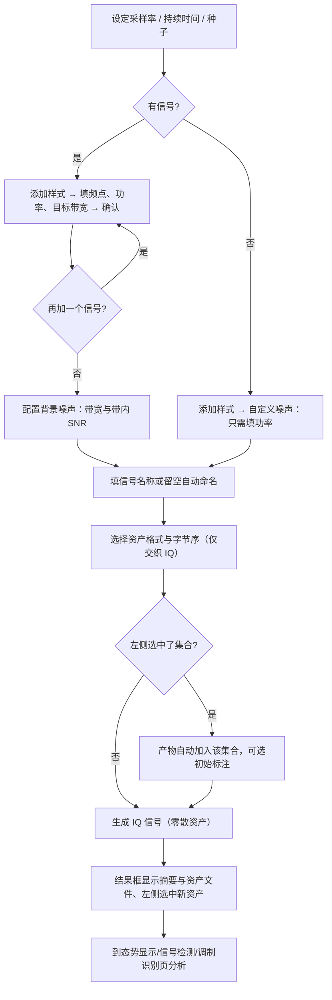

# IQ 信号生成页面

版本：0.2.0。更新日期：2026-10-02。

「IQ 信号生成」是信号分析桌面应用的第二个标签页，负责**按参数量产用于测试检测、参数估计与调制识别算法的 IQ 复基带信号**。页面分两个子页：**单个信号生成**（一次合成一条、可含多种信号与带限噪声，见 §2.1～§2.3）与**信号集合生成**（按配方批量生成、自动写标注，见 §2.4～§2.5）。生成的 IQ 为复基带记录，**不设置载频**——"频点"一律指**基带频率偏移**；频率输入框的单位在框外自适应显示 Hz/kHz/MHz。数据模型见[数据库设计](数据库设计.md)，集合与标注的管理入口见[数据管理页面设计（09）](09数据管理.md)，逐文件实现说明见[基础工程实现与文件说明](基础工程实现与文件说明.md)。

---

## 1. 目标与边界

| 本页负责 | 本页不负责 |
| --- | --- |
| 单条多信号 IQ 合成：9 种调制样式 + 自定义白噪声、最多 16 个信号、各信号独立参数 | 通信链路建模、信道编码、同步与接收机算法 |
| 按目标带宽自动推导调制参数（消息带宽 / 频偏 / 滚降成形等） | 实时采集或射频载频设置（IQ 为复基带，无载频） |
| 全带白噪声底（按最强调制信号的带内 SNR 定标）与自定义白噪声（只需功率） | 噪声底的非平稳建模、部分带/窄带噪声、多径与硬件损伤（损伤项见 §2.4，尚未实现） |
| 资产落库（生成摘要 + 目标参考参数）、按所选**资产格式**编码（NPY/CSV/交织 IQ/SigMF） | 资产的分析与识别（见"态势显示""信号检测""调制识别"等页） |
| 归属集合与初始标注、按配方批量生成（第二子页） | 集合与标注的重命名/归档（见"数据管理"页） |

三条硬约束：

1. **至少一个信号。** 信号列表为空时直接报错（"至少包含 1 个信号，或启用背景噪声"）；纯噪声记录请添加**自定义噪声**样式（只填功率），不要指望背景噪声底——它需要调制信号做参考。
2. **点数 = 采样率 × 持续时间。** 落库前校验落在 1～16,000,000 个复采样；越界只提示、不启动作业。
3. **自动参数不覆盖手填。** 数字样式的符号率由带宽与滚降系数推导；"自动参数"标签展示推导结果，未实现的项（独立符号率、损伤）一律置灰、用到即报错，不静默忽略。

---

## 2. 页面导览

### 2.1 单个信号生成

| 区块 | 内容 | 说明 |
| --- | --- | --- |
| 全局参数 | 采样率（默认 1 MHz）、持续时间（默认 0.1 s）、"预计 N 个复采样（上限 16,000,000）"、随机种子、"同时生成初始标注（来源 generator）" | 采样率对本次生成的**所有**信号统一；相同种子产生完全一致的信号（含逐信号种子派生）。初始标注按目标参考参数写入（集合无标注集时自动建立默认检测/AMC 标注集）；**须先在左侧选中一个集合**，选"全部资产/零散资产"时置灰 |
| 归属集合 | 左侧资产列表当前选中的集合（无独立下拉） | 选中具体集合时产物生成后自动加入；选"全部资产/零散资产"时不加入任何集合（即零散资产） |
| 背景噪声 | 启用；带内 SNR（参考：最强调制信号） | 噪声为**全带白噪声**（带宽 = 采样率，界面不设噪声带宽）；**必须存在 ≥1 个调制信号**，否则整组置灰（纯噪声改用"自定义噪声"样式）；参考取实测平均功率最大的**调制信号**，自定义噪声行不参与 |
| 信号列表 | 添加样式下拉 + 添加 / 编辑参数… / 删除选中；表格 5 列（样式 / 频点 / 功率 / 带宽 / 参数摘要） | 最多 **16** 个信号；"自定义噪声（全带白噪声）"也占一行，**只填功率**（频点列显示 —、带宽列显示全带）；表格只读，编辑走"信号参数"弹框（§2.2） |
| 资产 | 信号名称、资产格式、字节序、"生成 IQ 信号"按钮 | 资产格式直接决定 `assets/` 下资产文件的后缀与编码；字节序仅对交织 IQ（int16/float32）启用；选 CSV 时采样点上限收紧到 2,000,000 |
| 结果框 | 生成结果的摘要文本（采样率、点数、时长、峰值、逐信号实测功率、噪声、资产文件、目标与集合） | 生成后自动刷新，并在左侧资产列表选中新资产 |

### 2.2 信号参数弹框

"添加样式"选定调制后点"添加…"（或选中行点"编辑参数…"）弹出**信号参数**对话框，按样式显示可填项：

| 项 | 适用样式 | 说明 |
| --- | --- | --- |
| 频点（基带偏移） | 全部 | Hz/kHz/MHz 自适应输入 |
| 功率 | 全部 | dBFS，目标平均功率 |
| 目标带宽 | 全部 | 自动推导调制参数的基准量 |
| 调制深度 | AM | 留空 = 自动 |
| 消息带宽 / RMS 频偏 | FM | 留空 = 自动 |
| 边带 | SSB | 上/下边带 |
| 脉冲成形 / 滚降系数 α | 2ASK / QPSK / 16QAM / 64QAM | RRC 等成形与滚降 |
| 跳速 / 频点列表 / 中心跨度 / 单跳带宽 | FH-2FSK 遥控 | 频点列表可留空自动铺 |
| 跳速 / 频点列表 / 单跳带宽 / 子载波数 / 循环前缀 | FH-OFDM 图传 | OFDM 结构参数 |
| 自动参数 | 全部 | 只读展示按目标带宽推导的结果；自定义噪声显示"全带白噪声，带宽 = 采样率"与功率谱密度 |

> 数值一律直接键入：小数输入框不显示增减按钮（默认 ±1 步进会把小数一次顶到区间端点），
> 整数计数框（子载波数、跳频点数）保留步进按钮。同一约定适用于各页的数值输入。

### 2.3 生成结果的存储

- **落库**：按"资产格式"写为 `assets/<asset_id>.<ext>`，来源类型 `generated:iq_<模式>_v1`（无信号时为 `generated:iq_noise_v1`，模式取第一个信号）；逻辑 dtype 一律按 complex64 登记。同时写入 `generation` 摘要并按摘要登记**目标参考参数**（会话/整条；跳频样式另写逐跳目标），AMC 适用标记只在样式有规范调制名时置位（跳频样式为 0）。
- **资产格式**（"资产"分组的下拉，写入 catalog 的 `storage_format`/`endian`）：
  - `npy`（默认）：`assets/<id>.npy`，一维 complex64，读取走内存映射；
  - `csv`：`assets/<id>.csv`，两列 I,Q（`%.9g`），无表头；
  - `iq16`：`assets/<id>.bin`，交织 IQ，按 1/32768 缩放到 ±32767（有损，读取时按 1/32768 放大）；
  - `iq32`：`assets/<id>.bin`，交织 IQ 小端/大端 float32；
  - `sigmf`：`assets/<id>.sigmf-meta` + `assets/<id>.sigmf-data`，小端 complex float32，**按一条资产登记**（`path` 指向数据文件，摘要与占用记在数据文件上，元数据文件只校验存在）。
  没有独立的导出目录：生成结果即工作区资产，任何格式都可以在"信号导入"页或外部工具中直接读回。
- **自动命名**：显式填名优先；留空时按 `IQ 生成 · <样式1 + 样式2 …>` 自动命名，无信号时是"IQ 生成 · 仅噪声"。命名规则由 `services/truth._generated_name` 统一提供，界面预览与落库一致。

### 2.4 信号集合生成子页

第二子页以**表单**配置、批量生成（配方 `gen_recipe_v1` 只作内部存储格式，生成时自动存入集合，保证可复现）：

| 区块 | 内容 | 说明 |
| --- | --- | --- |
| 基本 | 数量、种子、生成引擎（项目引擎 / TorchSig（仅 Linux））、目标集合 | 数量为本次生成的录制条数，每条一个资产 |
| 信号与采样 | "配置…"按钮按**生成引擎**打开对应的配置弹框：项目引擎（采样率、时长区间、每条信号数、SNR、带宽占比、调制类型轮换、类别均衡、功率、跳速、**损伤**）与 TorchSig 引擎（前五项 + 信号族、扰动档位、类别映射 JSON） | 参数较多，明细收敛到弹框；未实现的项置灰；轮换只含 **9 种调制样式**，"自定义噪声"不在集合配方内（避免检测标签出现纯噪声目标，纯噪声负样本由"每条信号数 = 0"承担） |
| 标注（生成后自动写入） | 检测（粒度：会话级 / 逐跳，默认**逐跳**）、AMC | 逐跳粒度只在项目引擎的跳频样式可用；TorchSig 只能会话级 |
| 操作 | 参数预览（只抽参数、不合成 IQ）、开始生成 | 长任务走后台工作进程，支持取消 |
| 高级 | 载入/导出生成参数 JSON、导入 TorchSig bundle（任何平台可用）、TorchSig 环境… | JSON 仅用于迁移或外部工具交接 |

**配置弹框按引擎分开**（页面上不再有独立的"损伤"区块）：

| 弹框 | 适用引擎 | 可配项 |
| --- | --- | --- |
| `生成参数 · 信号与采样（项目引擎）` | 项目引擎 | 采样率、时长、每条信号数、SNR、带宽占比、调制类型轮换与类别均衡、功率、跳速、**损伤（频偏 / 相位噪声 / IQ 不平衡 / 多径）** |
| `生成参数 · 信号与采样（TorchSig）` | TorchSig | 采样率、时长、每条信号数、SNR、带宽占比、信号族、扰动档位（0/1/2）、类别映射 JSON |

损伤项**只属于项目引擎的弹框**：TorchSig 没有 `impairments` 组，它的"扰动"是 `impairment_level` 的 0/1/2 三档，是另一回事。损伤项按 `impairments` 声明渲染，均未实现、置灰，配方里用到会直接报错。

详细的配方字段、参数分层与 TorchSig 接入见 §2.5。

### 2.5 配方 `gen_recipe_v1` 与集合生成的数据语义

配方是**集合生成的内部存储格式**（页面以表单与弹框配置，配方在生成时自动存入集合并绑定，保证可复现；"载入/导出生成参数 JSON"用于迁移或外部工具交接）。结构如下：

| 键 | 类型/取值 | 说明 |
| --- | --- | --- |
| `contract` | 固定 `"gen_recipe_v1"` | 契约名，不匹配直接报错 |
| `engine` | `project` / `torchsig` | 决定参数能力与执行路径（TorchSig 仅 Linux 可生成） |
| `base_seed` | 0～2³²−1 整数 | 主种子；第 i 条录制用 `sample_seed(base_seed, i)` 派生独立种子 |
| `count` | 1～10,000,000 整数 | 本次生成的录制条数（每条一个资产） |
| `stratify` | `{axes: [参数名…], min_per_cell: n}` | 分层配额：`axes` 引用**已存在的参数名**（可写 `名字:桶数` 形式），引用不存在的参数报错；`min_per_cell` 为每格最小样本数 |
| `holdout` | `[{axis, range:[低,高], split}]` | 留出轴：落在区间内的样本强制进 `train`/`val`/`test` |
| `labels` | `{detection: null|session_v1|per_hop_v1, amc: bool}` | 生成后要写的标注；两类都可关闭 |
| `note` | 文本 | 备注 |

参数分层与分布：

- 结构键以外的键都是**参数组**，组里每个值必须是**分布节点**且恰好含一种分布：`fixed`（常量，常量必须用 `{"fixed": …}` 包装）、`choice`（可带等长正数 `weights`）、`uniform` / `loguniform`（`[低, 高]`，`loguniform` 下限必须大于 0）、`balanced`（在列表上轮换，用于类别均衡）。未知分布名、未知键、结构错误都会带上字段路径报错（如 `配方字段 signals.count`），**不静默忽略**。
- 项目引擎当前支持的参数（其余报错）：`record.{sample_rate_hz, duration_s, noise_power_dbfs}`、`signals.{count, mode, bandwidth_ratio, snr_db, power_dbfs}`、`hopping.{hop_rate_hz}`。
- TorchSig 引擎：`record.{sample_rate_hz, duration_s}`、`signals.{count, bandwidth_ratio, snr_db}`、`torchsig.{signal_generators, impairment_level}`；区间会被压成 `build_torchsig.py` 的命令行区间。TorchSig 没有跳频、没有逐跳标注，扰动只有 0/1/2 三档。
- 预测：`preview_recipe` 只按配方抽样（不合成 IQ），给出样本量与各参数分布统计；`draw_record(recipe, index)` 给出第 i 条录制的具体参数——预览与真实生成走的是同一套抽样代码。

生成执行时写下的数据语义（`services/collection_gen.py`）：

1. 逐条合成 → 写分片（按 **256 MiB** 滚动切分）→ 加入目标集合；同一批内信号按占用带宽互不重叠放置，放不下该条跳过并计数（不改参数）。
2. 建/复用标注集：`labels.detection` 为 `session_v1`/`per_hop_v1` 时建检测标注集并写初始标签、覆盖度置 `complete`；`labels.amc` 为真时建 AMC 标注集并写类别；"每条信号数 = 0" 的纯噪声录制写为负样本。
3. **追加生成**到已有集合时复用该集合已有的标注集，并要求检测粒度一致，否则直接报错。
4. 配方存入集合并绑定（`recipes` 表），可从生成页的"载入/导出生成参数 JSON"取回；生成过程写 `progress.json`、取消写 `cancel.flag`，取消后封存已写数据并返回部分结果。
5. TorchSig 路径：`build_torchsig.py`（Linux/WSL/远程）产出 bundle → 导入为分片资产；组件名按 `taxonomy.mapping_json` 映射到 AMC 类别，未映射的类整条跳过并计数；检测标签固定 `session_v1`；目标参数版本来源记为 `external`。

---

## 3. 生成规则与数值口径

### 3.1 点数与参数校验

- 复采样点数 `count = round(采样率 × 持续时间)`，须为 **1～16,000,000** 的整数；界面"预计 N 个复采样"随时预览，越界时数字标红并在点击生成时只提示、不启动作业。
- 信号列表 0～16 项；每项先经 `plan_signal` 规划（按目标带宽推导消息带宽、频偏、滚降、符号率、跳频点等），非法参数在规划阶段即报错。
- 随机种子为 0～2³²−1（单个信号生成页；集合生成子页的种子输入受 Qt int 上限限制为 0～2³¹−1，配方本身允许 0～2³²−1）；每条信号从主种子派生独立随机流，因此**同种子 + 同参数 = 完全一致的数据**。

### 3.2 噪声口径（带内 SNR）

噪声是**复圆高斯**，界面上固定为**全带白噪声**：`B_noise = 采样率`，功率谱密度 `N0 = P_noise / 采样率`，某信号的带内噪声取 `N0 × 该信号与噪声频带的重叠宽度`（全带时重叠宽度即其占用带宽），因此该信号的带内 `SNR_i = 其平均功率 ÷ (N0 × 重叠宽度)`。界面填写的 `snr_db` 指**最强调制信号**的带内 SNR；参考信号取**调制信号中实测平均功率最大者**（自定义噪声行不参与），其序号记录在 `noise.snr_reference_index`。逐信号结果写入摘要的 `signals[].snr_inband_db`；摘要同时给出 `noise.power_dbfs_per_hz`、`noise.snr_definition`（当前为 `inband_snr_v1`）。纯噪声（无信号）改用"自定义噪声"信号行按绝对功率生成。

**参考语义与边界**（重要）：

- **SNR 是链路量，不是场景量。** 一个场景只有一片噪声底（单一 `N0`），而 `SNR_i = P_i / (N0 · B_i)` 只允许一个自由度，因此**各信号 SNR 不能独立指定**——它们由 `N0` 与各自的 `P_i / B_i` 绑定。给 N 个信号分别填 N 个 SNR 是超定方程组，除非要求每个信号各加一套噪声（非物理）。
- **参考取"调制信号中绝对功率最大者"，不是"带内 SNR 最低"。** 由上式可得 `SNR_i ≤ SNR_填写 × (B_ref / B_i)`：**其余信号可能低于所填值**（宽带信号尤其明显）。反过来，噪声功率 ∝ 带宽，所以**窄带信号天然 SNR 更高**。若目标是"保证最差链路不低于某值"，应以 `argmin(P_i / B_i)` 为参考。
- **噪声带宽固定为采样率**（界面不提供该参数）；算法接口仍接受 `noise.bandwidth`，此时**必须覆盖参考信号的占用频带**，否则直接报错（避免填写值与实测值不符）。
- **落在噪声带外的信号实测无噪**：`signals[].snr_inband_db` 记 `null`（不是 0，也不是无穷）；多信号频带跨度大时应取 `B_noise = 采样率`。
- **`N0` 是双侧功率谱密度**（相对采样率定义，`P_noise = N0 × B_noise`）；与频谱仪习惯的"单边 dBm/Hz"相差 3 dB，跨工具比对时需换算。
- **场景级应固定的是 `N0`，不是 SNR。** 若同一集合内各样本的信号个数/带宽/功率会变（集合生成按配方区间轮换即属此类），统一按参考 SNR 驱动会让**有效 `N0` 逐样本漂移**：标签写着同样的 SNR，实际噪声强度却不同。需要"固定噪声底、跨样本可比"时应按 `N0` 驱动；需要"固定信噪比条件"时按参考 SNR 驱动（当前行为）。两种都合理，但必须在数据卡里写明口径。

**自定义噪声（`mode="noise"`）**：一条**全带白噪声**信号行，只填功率（`power_dbfs`），频点固定 0、带宽固定为采样率，给出 `offset`/`bandwidth` 会直接报错（不静默忽略）。它不是链路——既不做带内 SNR 的参考，摘要里其 `snr_inband_db` 也恒为 `null`；它与背景噪声底是两片独立噪声，叠加后的实际 SNR 需自行折算。只有自定义噪声行（无调制信号）时背景噪声不参与，摘要 `noise.enabled` 为 `false`。要建模"只覆盖某段频带的噪声底"请走算法接口（`noise.bandwidth`），界面固定全带。

> 行业惯例对照：多信号场景的规范做法是把**噪声功率谱密度 `N0`（或噪声底 / 噪声系数）作为唯一真值来源**，再由它推导每个信号的带内 SNR；单信号仿真才常用"直接给 SNR"。MATLAB `awgn` 更进一步，按整段输入信号的功率聚合定标，属总体 SNR 口径。本项目选择"参考信号 SNR"作为入口并落盘 `N0`（`power_dbfs_per_hz`），属常见工程约定；若需与外部数据集或接收机口径严格对齐，建议按 `N0` 驱动。

### 3.3 九种调制样式与自定义噪声

| 类别 | 样式 | 自动推导的参数（摘要中可见） |
| --- | --- | --- |
| 模拟 | AM 调幅 / FM 调频 / SSB 单边带 | 调制深度、消息带宽、RMS 频偏、边带、实际占用带宽 |
| 数字 | 2ASK / QPSK / 16QAM / 64QAM | 脉冲成形、滚降系数 α、符号速率、实际占用带宽 |
| 跳频 | FH-2FSK 遥控 / FH-OFDM 图传 | 跳速、频点数、中心跨度、单跳带宽、2FSK 频偏 / 子载波数 |
| 噪声 | 自定义噪声（全带白噪声） | 无调制参数；带宽 = 采样率、频点 = 0，功率为绝对平均功率 |

含载波的调幅信号在频谱上是对称双边带，占用带宽约为消息带宽的两倍；生成摘要保留能量占用带及其中心，供检测与参数估计逐项评分。

---

## 4. 设计思路

### 4.1 为什么是"信号列表 + 独立参数"

一条录制里常需同时出现多种信号（例如 QPSK 与 AM 共存），且各信号的频点、功率、带宽互不相干。把参数收敛到**信号列表**（只读表格）+ **参数弹框**，既能一眼看清本次合成的构成，又保证每个信号独立可调；表格不允许就地编辑，避免误改。

### 4.2 按目标带宽自动推导参数

用户只需给出"频点 + 功率 + 目标带宽"，其余调制参数（消息带宽、RMS 频偏、滚降、符号率、跳频点等）由 `plan_signal` 按样式自动推导，"自动参数"标签回显推导结果。这样同一套目标带宽口径可跨样式比较，也便于检测/参数估计测试对着"目标带宽"而非魔数断言。

### 4.3 噪声以"参考信号的带内 SNR"为口径

界面上填一个 `snr_db` 无法同时刻画多个频带，因此约定它表示**最强调制信号**（调制信号中实测平均功率最大者，序号记入 `noise.snr_reference_index`）的带内 SNR，其余信号按功率谱密度与各自带宽折算——**可能低于填写值**，窄带信号反而更高（§3.2）。这与检测/跳频页的会话级、逐跳带内 SNR 口径一致，报告里可并排对照；界面固定全带白噪声，不再需要校验"噪声带宽是否覆盖信号频带"（算法接口传窄带时仍会校验并报错），杜绝"填写值与实测值不符"。

### 4.4 生成即带真值，并可接入集合

生成摘要是真值来源：`signal_truth` / `hop_truth` 由 `generation` 元数据折算，存储层按摘要一次写全会话目标与参考参数（跳频样式另写逐跳目标，见[数据库设计](数据库设计.md) §5.2）。因此检测与调制识别可直接对生成数据评分；导入的数据没有生成器真值时，服务层如实标"不适用"而不编造指标。产物可同时加入**集合**并写**初始标注**，把"生成测试信号源"和"数据集构建"连起来。

### 4.5 后台任务与取消

生成在**工作子进程**中执行（`ui/runner.py` 对 `generate` 给 600 s 超时），进度与取消显示在页内横幅；**任务按页面归属**——同页同一时刻只允许一个任务、跨页可并发，结果回到发起页且不自动切换标签页。点数越多耗时越长，超过子进程超时会被终止而非静默截断。

---

## 5. 操作流程

**典型步骤（单条生成）**

1. 设采样率与持续时间，确认"预计 N 个复采样"在 1～16,000,000 内。
2. 选"添加样式"→ 点"添加…"→ 在参数弹框填频点、功率、目标带宽（其余留空自动）→ 确定；需要多信号则重复（最多 16 个）。
3. 配置背景噪声：勾选"启用"、填带内 SNR——只在已添加调制信号时可用（噪声固定为全带白噪声）；纯噪声记录改用"添加样式 → 自定义噪声"（只填功率）。
4. 填"信号名称"（留空按样式自动命名），选择**资产格式**与字节序（非交织 IQ 时字节序自动禁用；选 CSV 时采样点上限收紧为 2,000,000）。
5. 需要写作"初始标注"时先在左侧资产列表选中一个集合，并勾选"同时生成初始标注"（选"全部资产/零散资产"时该复选框置灰，产物为**零散资产**）。
6. 点"生成 IQ 信号"：完成后读结果框摘要，到左侧"数据资产"或相关分析页核对/分析。

**批量流程（信号集合生成）**

1. 切到"信号集合生成"子页，设数量、种子与生成引擎。
2. "信号与采样"→"配置…"设定采样率、时长/信号数/SNR 等区间与参与轮换的调制类型；需要用"参数预览"先核对参数分布与分层计数。
3. 勾选"检测"（选会话级/逐跳）与"AMC"决定生成后自动写入的标注。
4. 选择目标集合后"开始生成"，在页面状态区与结果区查看进度与产出（任务可取消）。

---

## 6. 常见问题（FAQ）

- **为什么没有载频输入？** IQ 是复基带记录，不含载频；"频点"指基带频率偏移。需要射频中心请在导入/数据库层处理，本页不设置。
- **"预计 N 个复采样"和实际生成点数一致吗？** 一致：`round(采样率 × 持续时间)`；越界（<1 或 >16,000,000）只提示、不生成。
- **没有添加任何信号能生成吗？** 可以：添加一个"自定义噪声"样式（全带白噪声，只填功率）即可生成纯噪声资产。背景噪声底需要调制信号做参考，没有调制信号（或只有自定义噪声行）时整组置灰。
- **"带内 SNR"到底指哪个信号？** 指**最强调制信号**（实测平均功率最大的调制信号；自定义噪声行不参与）的带内 SNR，其序号见结果摘要的 `noise.snr_reference_index`；其余信号按各自带宽与噪声带的重叠折算，**可能低于填写值**（窄带信号反而更高），逐信号值见 `signals[].snr_inband_db`。
- **为什么不能给每个信号分别填 SNR？** 一个场景只有一片噪声底，`SNR_i = P_i/(N0·B_i)` 只有一个自由度，各信号 SNR 互相绑定；强行指定 N 个互不相容的值等于要求 N 片底噪，物理上不成立。要精确控制噪声强度请按 `N0` 驱动（摘要里的 `noise.power_dbfs_per_hz`），详见 §3.2。
- **填了带内 SNR 却报错？** 目前的唯一情形是没有调制信号做参考（提示"需要至少一个调制信号"）——纯噪声请按功率添加"自定义噪声"行，不要用背景噪声。噪声带宽已固定为全带，不会再出现"带宽未覆盖最强调制信号"的报错。
- **"自定义噪声"和"背景噪声"有什么区别？** 自定义噪声是一条**全带白噪声信号行**（只填功率，频点固定 0、带宽 = 采样率，无 SNR），可单独存在；背景噪声是按最强调制信号带内 SNR 定标的**噪声底**（同样是全带白噪声），需要调制信号。两者可同时使用，摘要分别记录，叠加后的实际 SNR 需自行折算。
- **噪声带宽去哪了？** 噪声固定为全带白噪声（带宽 = 采样率），没有自由度，所以界面上不再提供该参数；要建模部分带噪声请直接调算法接口 `noise.bandwidth`（并发版仍保留该形参）。
- **字节序为什么是灰的？** 字节序只对交织 IQ（int16/float32）有意义；NPY/CSV/SigMF 不需要，自动禁用。
- **"资产格式"和以前的"导出格式"有什么不同？** 现在没有导出目录：选中的格式就是资产文件本身的编码，直接写在 `assets/<asset_id>.<ext>` 下。原来的 NPY/CSV/交织 IQ/SigMF 都还在，"不导出"这一项取消了（默认 `npy` 即等价于原来的"仅内部资产"）。
- **选 CSV 时为什么采样点上限变低了？** CSV 体积约为 NPY 的 4 倍、读写也更慢，2,000,000 点已接近读取端的 512 MiB 上限；需要更大规模请用 NPY 或交织 IQ。
- **产物怎么归属集合？** 生成页不再自带目标集合下拉：产物跟随**左侧资产列表当前选中的集合**；选"全部资产"或"零散资产"时不加入任何集合（即零散资产）。批量的"信号集合生成"子页仍用自己的目标集合下拉（需要"新建集合…"与配方绑定）。
- **自动命名规律是什么？** 显式名优先；留空按 `IQ 生成 · <样式…>`（无信号为"IQ 生成 · 仅噪声"），由 `_generated_name` 统一提供。
- **生成的数据有真值吗？** 有：生成摘要会登记会话/整条目标与参考参数（跳频样式另写逐跳目标），检测与识别可直接评分；导入数据没有生成器真值时显式标"不适用"。
- **一次最多几个信号？各信号参数会互相影响吗？** 最多 16 个；各信号参数独立，叠加后按目标功率与噪声口径标定，逐信号实测功率写入摘要。
- **"损伤"为什么都是灰的？** 频偏/相位噪声/IQ 不平衡/多径尚未实现；接口在 `algorithms/generation/impairments` 里预留，实现后自动启用，配方里用到未实现项会直接报错而非静默忽略。

---

## 7. 与代码 / 测试的对应

| 功能 | 代码 | 测试 |
| --- | --- | --- |
| 单个信号生成页与参数弹框 | `src/signal_analysis/ui/pages/generator_page.py`、`ui/dialogs.py` | `tests/analysis/test_iqgen.py`、`test_iq.py`、`tests/analysis/test_gui_analysis.py` |
| 生成与规划（九种样式、噪声口径） | `algorithms/generation/iqgen.py`、`core_api.generate_iq` / `plan_signal` | `test_iqgen.py`（点数/参数校验、带内 SNR、逐跳边界） |
| 摘要 → 目标参考参数 | `services/truth.py`、`data/targets.py` | `test_iq.py`、`test_dataset_labels.py` |
| 资产落盘与格式 | `data/assets.py::add_samples`、`data/io.py` | `test_storage_io.py`、`test_dataio_iq.py` |
| 集合生成表单与子页 | `src/signal_analysis/ui/pages/collection_gen_page.py` | `tests/analysis/test_generate_collection_gui.py` |
| 配方校验/抽样/预览 | `algorithms/generation/recipes.py`（`validate_recipe` / `draw_record` / `preview_recipe` / `check_generator_support`） | `test_recipes.py`、`test_recipes_gui.py` |
| 集合生成执行器（合成、分片、标注、覆盖度） | `services/collection_gen.py` | `test_collection_gen.py` |
| TorchSig 探测、构建参数与 bundle 导入 | `integrations/torchsig.py` | `test_torchsig_ingest.py`、`test_torchsig_real.py` |
| 损伤项声明与"未实现即报错" | `algorithms/generation/impairments.py` | `test_recipes.py` |

## 8. 已知局限与后续方向

- **损伤项尚未实现**：频偏、相位噪声、IQ 不平衡、多径在界面置灰，配方里出现即报错；实现后无需改配方结构。
- **TorchSig 生成只在 Linux/WSL/远程可用**（Windows 只能导入 bundle），且只能会话级检测标签、没有跳频样式。
- **集合生成的分层配额补抽与 `coverage_cache` 回写未实现**；配方里的 `stratify`/`holdout` 目前用于抽样与数据版本划分，不驱动"补齐到每格 n 条"。
- **单个信号生成页不写集合**（跟随左侧当前集合），批量语义只在"信号集合生成"子页；两者共用同一套合成与真值登记代码。
- 实时播放与音频回放等交互不在本页范围（见[态势显示页面设计（03）](03态势显示.md)）。
