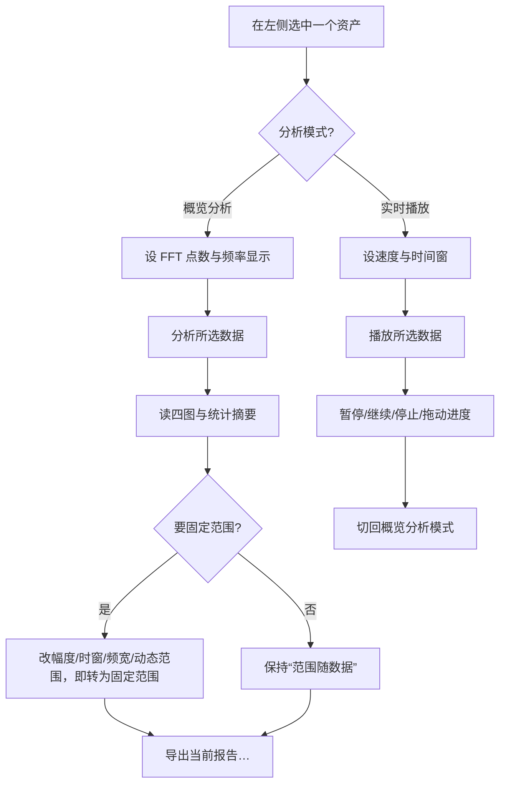

# 态势显示

版本：0.3.0。更新日期：2026-10-04。

「态势显示」是信号分析工作台的**基础分析插件**页（页面注册表第 3 项，紧随「信号导入」「IQ 信号生成」）。它对**当前选中的单个资产**做一次离线通用统计：算采样数、时长、均值、RMS 与峰值，做双边短时傅里叶变换（STFT），在 2×2 网格里画 I/Q 波形预览、平均功率谱密度、**按目标参考参数绘制的符号级星座图**（数字调制样式 + 符号率 + 中心频率等特征参数齐备才画，否则留空并写明原因）、瀑布图，并可切到**实时播放**模式按倍速滚动刷新瀑布图。分析结果只落一条运行记录（`kind=analysis`，图像数组另存为 `plots_path` 指向的 NPZ），**不写标注、不改资产**；要把结论变成参数或标签，请用「信号检测」页的「采纳为参数标注」（见[信号检测](04信号检测.md) §4.3/§5）。

本页同时是检测与跳频两个页面的数值底座：平均 PSD、时频图矩阵与“频率显示”口径在这里定型，检测页与跳频页沿用同一份 STFT 与同一套坐标语义，因此三页的谱线、时频图与检测框可按频率逐点对齐。相关文档：[00 Python 技术方案](00电磁信号分析识别系统_Python技术方案.md) §4.2（分析插件）/§4.3（可视化与标注）、[数据库设计](数据库设计.md)（`runs` 与目标参数版本）、[基础工程实现与文件说明](基础工程实现与文件说明.md)（页面注册表、后台任务与运行记录）、[信号检测：传统能量检测](algorithms/信号检测_传统能量检测.md) §3（STFT 与 PSD 的共享口径）。

---

## 1. 目标与边界

| 本页负责 | 本页不负责 |
| --- | --- |
| 单资产通用统计：采样数、时长、均值 I/Q、RMS、峰值、实数/复数判定 | 频带分割与目标判决（见「信号检测」页） |
| 双边平均功率谱密度、瀑布图，以及用目标参考参数把数字信号还原到符号采样的星座图 | 单边谱倍增；功率标定（dBm）与射频中心（IQ 是复基带，频率一律指基带偏移） |
| 星座图画不画由目标参数决定（数字样式、符号率、中心频率齐备才画，否则留空写明原因）；频率显示（自动 / 双边 / 仅正频率） | 参数估计与调制识别结论（本页不做频偏/符号率估计、不做识别；缺参数就不画，正式识别见「调制识别」页） |
| 显示范围（波形幅度、时窗、频谱频宽、动态范围）的自动/固定定标 | 修改源数据、重建或删除资产 |
| 实时播放：变速推进、暂停/继续、停止、进度定位 | 采集与实时流式处理（本页只在内存中回放已加载的资产） |
| 当前结果导出为 HTML/JSON 报告 | 批量导出，以及把结果写回标注（采纳在检测页） |

三条硬约束：

1. **只读分析。** 本页只读资产、只写运行记录；`assets/`、标注表与集合成员不受影响。
2. **频率即基带偏移。** 频谱横轴范围是 ±采样率/2，纵轴是相对 1 任意单位²/Hz 的 dB；不引入载频，也不把 PSD 描述为绝对功率。
3. **先定标、再固定。** 勾选「范围随数据」时按当前数据推导范围并把结果回写控件；手动改动任一数值即转为固定范围，播放全程范围不再变化。

---

## 2. 页面导览

### 2.1 工具栏

| 控件 | 取值 | 说明 |
| --- | --- | --- |
| 频率显示 | 自动 / 双边 / 仅正频率（默认自动） | 自动：实数记录（虚部全 0）只显示非负频率并隐藏镜像；复数 IQ 保留双边 |
| FFT 点数 | 128 / 256 / 512 / 1024 / 2048（默认 256） | 同时作用于概览分析的 STFT 与实时播放的单帧谱；频点分辨率 = 采样率 / 点数 |
| 分析模式 | 概览分析 / 实时播放（默认概览分析） | 切到「实时播放」后显示播放条，主按钮文案变为“播放所选数据” |
| 分析所选数据 | 按钮 | 按当前 FFT 点数发起一次后台分析；未选中资产时状态栏提示“请先导入并选择数据” |

### 2.2 显示范围

| 控件 | 取值 | 说明 |
| --- | --- | --- |
| 范围随数据 | 复选框，默认勾选 | 勾选时按数据自动定标幅度与频宽（幅度取 1/2/5×10ⁿ 的“整齐上限”）；手动改任一数值即取消勾选 |
| 波形幅度 ± | 1e-5～1e6，默认 1.0 | 波形纵轴固定为 ±该值（任意单位） |
| 波形时窗 | 整个记录 / 10 ms / 20 ms / 50 ms / 100 ms / 200 ms / 500 ms / 1 s / 2 s / 5 s | 概览显示记录起点起该时长；播放时显示最近该时长，「整个记录」在播放时跟随瀑布时间窗 |
| 频谱频宽 ± | 0～5×10⁸ Hz，默认 0 | 0 表示整个基带（±采样率/2），否则取 ±该值且不超过 ±采样率/2 |
| 频谱动态范围 | 10～200 dB，默认 80 | 频谱纵轴与瀑布色标固定为 [峰值 − 该值, 峰值] |

### 2.3 实时播放条（仅「实时播放」模式）

| 控件 | 取值 | 说明 |
| --- | --- | --- |
| 播放 / 暂停（继续）/ 停止 | 按钮 | 播放时禁用播放按钮；暂停后按钮变“继续”；停止后标题恢复“瀑布图（离线历史）” |
| 速度 | 0.1× / 0.25× / 0.5× / 1× / 2× / 4× / 8× / 10×（默认 1×） | 每帧推进量 = 采样率 × 倍速 × 实际经过时间 |
| 时间窗 | 10 ms～20 s（默认 200 ms） | 瀑布图滚动窗口长度；改动后立即按新分辨率重建最近一窗 |
| 进度 | 0～1000 滑块 | 松开后按比例定位到记录中的位置并重建窗口 |

### 2.4 图表与摘要

| 区域 | 内容 | 说明 |
| --- | --- | --- |
| 图表区 | I/Q 波形（预览）、平均功率谱密度、星座图（或留白提示）、瀑布图 | 2×2 网格；左下角只按目标参考参数绘制：数字调制样式 + 符号率 + 中心频率齐备时画符号级星座点，否则留空并写明原因（“模拟信号…不绘制星座图”/“调制未知：不绘制星座图”/“缺少符号率参数…”等），没有自动推测与手动覆盖；瀑布图离线时标题为“瀑布图（离线历史）”，播放时改为“瀑布图（滚动时间窗）” |
| 统计摘要 | 只读文本 | 采样数、时长、均值 I/Q、RMS、峰值、星座图结论（已绘制依据或未绘制原因）、实数/复数说明、当前显示范围、是否抽点预览、瀑布时间口径 |
| 动作栏 | 加载原生复制插件清单…、导出当前报告… | 前者发起 `native` 任务把插件复制结果存为派生资产（结果区提示输出资产 ID，需重新选中该资产再分析）；后者导出 HTML/JSON 报告 |

### 2.5 统计摘要字段

| 字段 | 含义 |
| --- | --- |
| `sample_count` / `duration_s` | 采样点数与时长（`点数 / 采样率`）秒 |
| `mean_i` / `mean_q` | I、Q 的算术均值 |
| `rms` | √(mean(\|x\|²))，幅值单位与输入一致（任意单位） |
| `peak` | max(\|x\|)，同上 |
| `classification` / `cluster_estimate` | 启发式“数字/模拟”判定与星座簇数估计；只作摘要参考，**不决定是否绘制星座图** |
| `constellation` | 星座图绘制计划与结果：`plotted`（是否绘制）、`reason`（未绘制原因码：`analog`/`unknown`/`multiple`/`hopping`/`symbol_rate`/`center`/`aliasing`/`insufficient`）、`family`、`label`（如 `QPSK`、`AM`）、`sources`（`generator`/`import`/`manual`/`external`/`algorithm`）、`targets`、`symbol_rate_baud`、`center_hz`、`bandwidth_hz`、`points`（符号点数）、`timing_phase`；左下角图的唯一依据 |
| `real_valued` | 是否虚部全为 0（决定「自动」频率显示） |
| `preview_decimated` / `padded_samples` | 波形是否抽点预览；STFT 是否补零及补零点数 |
| `nfft` / `hop_samples` | 本次 STFT 的点数与帧步长（采样点） |

---

## 3. 统计与时频口径

- **统计**：所有标量统计基于**全部样本**，与显示范围无关。`amplitude_unit=arbitrary`（任意单位），`frequency_reference=baseband_offset`（基带偏移）。输入校验：一维非空、点数 ≤ `MAX_SAMPLES = 16,000,000`、实数或复数、无 NaN/Inf、幅值不超过 float32 表示范围；采样率须为正有限数，否则报错而不静默截断。
- **星座图口径（左下角唯一依据）**：只读目标参考参数（生成元数据登记、识别采纳或人工标注追加的目标版本）。绘制条件①恰好一个信号目标、②调制家族为数字、③非跳频、④`symbol_rate_baud` 为正、⑤中心频率存在（`nominal_center_hz`，或由频率上下限派生）、⑥采样率 / 符号率 ≥ 2；任一条件不满足就留空，`constellation.reason` 写明缺哪一条。没有「自动/手动」开关，也不做参数估计：`classify_modulation` 的 `classification`/`cluster_estimate` 仍写入摘要供参考，但不参与绘制决策。
- **符号抽取（`constellation_points`）**：取记录中段（最多 `MAX_CONSTELLATION_SAMPLES = 4×10⁶` 样点）按已知频偏以**绝对采样序号**搬回零频（相位基准与生成时的搬频一致），再按符号率与占用带宽做**根升余弦匹配滤波**——滚降系数由 `α = 带宽 / 符号率 − 1` 反推并限幅 0～1，带宽未知时用缺省 0.35，α = 0 退化为符号率一半的砖墙；以 `|y|²` 在一个符号周期内的相位折叠峰值（128 桶 + 抛物线细化）估计定时相位，按符号率线性插值抽取符号，最多 `MAX_CONSTELLATION_SYMBOLS = 20000` 个，最后做 RMS 归一化。不做载波/定时盲估计、不做均衡、不纠正残余相位：标注的频偏或符号率有误时星座会旋转、成弧或弥散。
- **STFT 与 PSD**：对整段记录做双边 STFT，Hanning 窗，帧步长 `hop = max(nfft//2, ⌈(补零后长度 − nfft) / 511⌉)`，据此把帧数上限控制在 512 帧以内（短输入右补零到 `nfft`）。每帧 `PSD = |FFT(x·w)|² / (采样率 × Σw²)`，单位“输入幅值²/Hz”；复数输入取**双边谱、不乘 2**，也不做单边倍增。频率轴经 `fftshift` 给到 ±采样率/2，分辨率为 `采样率 / nfft`。
- **画出来的数组**：`spectrum_db` = 各帧 PSD 平均后取 `10·log10`（下限 1e-30）；`spectrogram_db` 为逐帧同口径的 float32 矩阵；`frame_time` 取每帧中心时刻 `(起点 + (nfft−1)/2) / 采样率`。波形预览按步长 `⌈点数/4096⌉` 抽点（最多约 4096 点）；`const_i`/`const_q` 是整段 IQ 的均匀抽点（最多 20000 点，`generic_statistics_v1` 的原始字段，仅随记录保存）；页面实际绘制的是 `const_symbol_i`/`const_symbol_q`——`constellation_points` 抽出的符号级 I/Q（最多 20000 个符号，单位平均功率）——**抽点只影响画图，不影响统计**。
- **图坐标语义**：波形横轴时间（s）、纵轴幅度；平均 PSD 横轴基带频率偏移（Hz）、纵轴 PSD（dB）；星座图横轴同相分量 I、纵轴正交分量 Q（单位平均功率下的符号点）；瀑布图横轴频率、纵轴时间（离线时纵轴固定为整段记录时长，不随刷新变化）。瀑布图按“行 = 时间、列 = 频率”交给 row-major 的 `ImageItem`，再用 `setRect` 给出频率/时间跨度；写成转置矩阵会把图横过来，在频率轴上显示并不存在的负频率电平。STFT 矩阵（`spectrogram_db`）仍随运行记录保存，供检测/跳频页与报告复用，本页只把它画成瀑布图。
- **色标与纵轴**：频谱纵轴与瀑布色标共用 `[峰值 − 动态范围, 峰值]`，峰值取时频矩阵与平均 PSD 的较大者；播放时色标只在首帧定标一次，之后保持不动，避免颜色随数据跳动。
- **99% 能量占用**：本页**不输出** 99% 占用区间。共享数值基础里的 `_occupied_span`（保留功率比例 `_OCCUPIED_RATIO = 0.99`）由检测与逐跳通路用于给出追溯字段 `occupied_f_low_hz` / `occupied_f_high_hz`，其语义是**能量占用带**而非消息带宽（含载波调幅的占用带宽约为消息带宽的两倍），详见[信号检测：传统能量检测](algorithms/信号检测_传统能量检测.md)。
- **播放帧**：单帧谱取“截至播放位置的前 `nfft` 个采样点”，不足时左补零，使用与概览分析相同的 Hanning 窗与归一化，因此播放帧与概览 STFT 矩阵的末帧数值一致（同一函数 `spectrum_row`）。窗口内最多保留 `PLAY_MAX_ROWS = 360` 行，单次刷新最多计算 `PLAY_MAX_ROWS_PER_TICK = 64` 行，波形每帧最多画 `PLAY_WAVE_POINTS = 2000` 点。
- **导出的产物与命名**：`导出当前报告…` 把 `last_result` 交给 `export_report`，只接受 `.html` 与 `.json` 后缀（其它后缀报错）；HTML 标题为 `SimuSignal · 态势显示 · <run_id>`，页尾附完整 JSON；文件按 `.tmp` 写好后原子替换。图像数组不随报告导出，它们随运行记录存在工作区运行目录的 NPZ 里（`plots_path`）。

---

## 4. 设计思路

### 4.1 为什么把“概览分析”和“实时播放”放在同一个按钮位

两者都是“把当前资产画出来”，差别只在数据来源（整段 vs. 滑动窗口）与刷新节奏。用「分析模式」下拉切换、复用同一个主按钮与同一个网格布局，可以避免两套界面各自维护频率显示、显示范围与色标，也保证播放帧与概览帧用同一口径（都走 `analyze` / `spectrum_row`）。代价是同一时刻只能有一种模式：切回概览会停掉正在进行的播放。

### 4.2 为什么星座图必须用目标参考参数画、为什么没有「自动/手动」开关

- 原始 IQ 散点画不出星座：脉冲成形（且接收端未做匹配滤波）时同一个符号会摊成一条轨迹，看起来像噪声云。要看到成簇的符号点，必须用已知特征把信号搬回零频、滤到自身频带、再按符号率在符号时刻重采样——这些都是**参数依赖**的运算，见 §3 的 `constellation_points` 口径。
- 参数从哪来：生成元数据在写库时登记的 `waveform_mode`/`modulation`、符号率与频带（本项目生成的资产），以及识别采纳或人工标注追加的目标版本。参数不齐时本页没有可靠补救——盲估符号率与频偏属于参数估计/识别课题（见「调制识别」页），这里不猜。
- 因此去掉了「自动判定 + 手动覆盖」这套开关：原始 IQ 的启发式判定（`classify_modulation`）会把 AM 等模拟样式误判为数字、把 QPSK 误判为模拟，只留在摘要里参考；手动选「数字」也无法凭空补出符号率与频偏，只会画出误导性的图。缺参数时留白并写明缺什么（`constellation.reason`），比画一张错的图更诚实。
- 多信号记录与跳频样式同样不画：前者没有单一星座，后者频点逐跳变化、符号点无法对齐（`multiple` / `hopping`）。

### 4.3 为什么默认双边谱

IQ 是复基带记录：复数信号的负频率分量是**真实分量**，做单边谱必须乘 2 并假设解析信号，这会破坏与检测器、生成器的功率一致性，因此默认保留双边；只有当记录虚部全为 0（实数记录）时，正负半轴才互为镜像，「自动」才只显示非负频率。

### 4.4 代码级流程

1. `MainWindow` 的页面注册表按固定顺序注册 11 个标签页，第 3 项是 `"态势显示": build_analysis`（`src/signal_analysis/ui/main_window.py`）；全项目只用 `_page_index("态势显示")` 取标签下标、用页面名作为 `tab_results` 的键，改页序不会“静默跳到错误页面”或读到别的页面的结果。
2. 「分析所选数据」→ `analyze_selected` → `start_job("analyze", owner="态势显示", asset_id=…, nfft=…)`。`ui/runner.py::_budgets` 对 `analyze` 用默认预算 `(30 s, 取消宽限 0 s)`，任务在**工作子进程**里跑；页面用 `TaskBanner("态势显示", "取消本次分析")` 显示进度与取消，任务期间该页的 `analyze_button` 与 `native_button` 被禁用。
3. 服务层 `services/generation.py::analyze` 调 `workspace.load_samples` 与 `core_api.analyze`，再用 `services/truth.py::constellation_plan` 读目标参考参数决定星座图画不画；可画时用 `core_api.constellation_points` 抽符号级 I/Q 写进数组，随后 `save_run("analysis", {"summary", "asset_name"}, arrays, asset_id)` 落运行记录，返回 `kind="analysis"`、`run_id` 与 `plots_path`。
4. `MainWindow.display_result` 把结果装进 `tab_results["态势显示"]`，用 `np.load(plots_path)` 读出数组交给 `_render_analysis` 绘制；`summary["constellation"]["plotted"]` 决定左下角画 `const_symbol_i/q` 散点还是 `_constellation_hint` 的留白提示；切换频率显示或「范围随数据」时走 `_apply_display_mode` / `_rerender_tab`，从同一份 NPZ 重画而不重算。
5. 播放不建后台任务：`_start_playback` 在内存里加载整段复数据（先用前 200,000 点探测幅度用于自动定标），由 GUI 定时器驱动 `_on_playback_tick`，逐帧调用 `spectrum_row`；改变 FFT 点数或时间窗时调用 `_rebuild_playback_window` 丢弃旧缓冲、向前回溯一窗重建，避免分辨率变化后仍沿用旧疏密。
6. 失败与取消：读取资产失败（文件缺失或校验不符）在状态栏提示“读取数据失败：…”，不画半成品；子进程超时或异常由公共任务机制回报，页面保留上一次结果；「导出当前报告…」在无结果时提示“请先完成一次分析或仿真”。

---

## 5. 操作流程

1. 在左侧数据资产里选中一个资产（可先在「信号导入」或「IQ 信号生成」页准备数据）。
2. 概览流程：选 FFT 点数（默认 256）与频率显示（实数记录默认只显示正频率）→ 点「分析所选数据」。
3. 读图与摘要：波形、平均 PSD、星座图（只有目标参考参数给出数字样式 + 符号率 + 中心频率时才画符号级散点，否则留白并写明原因）、瀑布图；摘要给出采样数、均值、RMS、峰值与星座图结论（绘制依据或未绘制原因）。
4. 需要固定量纲对比时，取消「范围随数据」或直接改幅度/时窗/频宽/动态范围中的任意一项，再用固定范围重看。
5. 需要观察时变过程时切到「实时播放」，选速度与时间窗后播放，期间可暂停、停止或用进度滑块定位。
6. 需要留档时点「导出当前报告…」，选 `.html` 或 `.json`。
7. 需要把观察到的信号变成可训练的参数与标签，请转到「信号检测」页跑一次检测并「采纳为参数标注」。

---

## 6. 常见问题（FAQ）

- **为什么点「分析所选数据」没有反应？** 先确认左侧选中了资产（未选中时状态栏提示“请先导入并选择数据”）；若资产文件缺失或哈希不符，会提示“读取数据失败：…”，此时请到「数据管理」页盘点。
- **为什么写的是“基带频率偏移”而不是频率？** IQ 是复基带记录，记录里不含载频；横轴 0 Hz 对应复基带零频，配置里的采样率决定了可见范围 ±采样率/2。
- **为什么实数记录只显示一半频谱？** 实数记录的负半轴是正半轴的镜像，重复显示没有信息量；「自动」据此只画非负频率。复数 IQ 默认双边，可用「频率显示」手动改成「仅正频率」。
- **为什么频谱纵轴不是 dBm？** 单位是“相对 1 任意单位²/Hz 的 dB”，缺少功率标定信息（0 dBFS 对应的 dBm、端口、增益等），标定链路尚未实现（见 00 §5.3），因此不假装成绝对功率。
- **为什么波形看起来比记录短、点很稀？** 波形是抽点预览（最多约 4096 点），摘要里 `preview_decimated` 会标出；统计仍基于全部样本。用「波形时窗」缩小窗口可以让曲线更细。
- **为什么左下角是空白？** 左下角只在目标参考参数齐备时画星座图：需要数字调制样式 + 符号率 + 中心频率（且只含单个信号、非跳频）。空白处会写明是哪一条不满足：模拟信号、调制未知、记录含多个信号、跳频样式、缺少符号率、缺少中心频率、符号率过高等。本项目生成的资产（含集合生成）自带完整参考参数；导入资产目前能在「信号导入」页补调制样式与 SNR，符号率/中心频率仍没有界面入口（见 §8），采纳识别结果只写入调制样式与频带。
- **时频图去哪了？** 本页左下角现在只画按参数抽取的符号级星座图或留白说明，不再画时频图；时频结构请看右下角瀑布图（横轴频率、纵轴时间）。原「信号判定」下拉（自动/数字/模拟）已移除，画不画完全由目标参数决定，没有手动覆盖。
- **为什么星座图会旋转、晕开或成弧？** 符号抽取只用标注参数、不做盲估计：频偏标注不准会让整张图旋转，符号率标注不准会让点子成弧或弥散，成形/定时不匹配会加大簇半径。修正目标参考参数（或重新采纳带参数的识别结果）后重新分析即可。
- **AM 为什么没有星座图？** AM/FM/SSB 等模拟样式没有符号级星座，按设计留白；请结合平均功率谱密度与瀑布图判读（见 §4.2）。
- **播放为什么有时像跳着走？** 播放帧数受单次刷新与窗口行数上限约束（64 行/次、360 行/窗），高倍速或长记录下只能靠跳帧逼近目标速度；把速度降下来或缩短时间窗会更平滑。
- **导出的报告里为什么没有图片？** 报告只导出结果数据的表格与原始 JSON；图像数组留在工作区运行目录的 NPZ 中，报告用于交付数值与结论，不承担图片打包。

---

## 7. 与代码 / 测试的对应

| 功能 | 代码 | 测试 |
| --- | --- | --- |
| 页面构建、图表与工具栏 | `src/signal_analysis/ui/pages/analysis_page.py::AnalysisPageMixin.build_analysis` | `tests/analysis/test_gui_analysis.py::test_analysis_gui_workflow`（标签页数量、波形与网格、模拟信号留白、JSON 导出） |
| 渲染、自动定标与频率掩膜 | `src/signal_analysis/ui/pages/analysis_page.py::_render_analysis` / `_apply_display_mode` / `_positive_half_mask` | `tests/analysis/test_gui_analysis.py::test_detect_page_frequency_display_for_real_record`（同一 `_mirrored_spectrum` 判据） |
| 星座图绘制计划与留白提示 | `src/signal_analysis/services/truth.py::constellation_plan` / `modulation_family`、`src/signal_analysis/ui/pages/analysis_page.py::_constellation_hint` / `_constellation_status` | `tests/analysis/test_adoption.py::test_constellation_plan_reads_target_parameters`、`::test_modulation_family_mapping`、`::test_analysis_summary_carries_constellation_plan`、`tests/analysis/test_gui_analysis.py::test_constellation_panel_follows_target_parameters` |
| 符号级星座抽取 | `src/signal_analysis/algorithms/dsp/spectrum.py::constellation_points` / `_matched_filter` | `tests/analysis/test_numeric.py::test_constellation_points_recover_square_qpsk`、`::test_constellation_points_show_two_level_ask`、`::test_constellation_points_respect_symbol_limit`、`::test_constellation_points_validation` |
| 星座图渲染与实时播放 | `src/signal_analysis/ui/pages/analysis_page.py::_constellation_title` / `_start_playback` / `_on_playback_tick` / `_play_render` / `_rebuild_playback_window` | `tests/analysis/test_gui_analysis.py::test_constellation_and_playback` |
| 统计、STFT 与绘图数组 | `src/signal_analysis/algorithms/dsp/spectrum.py::analyze` | `tests/analysis/test_numeric.py::test_constant_statistics_and_psd_energy`、`::test_short_input_and_bounded_preview`、`::test_nfft_validation`、`::test_real_valued_detection_and_const_arrays` |
| 播放单帧谱 | `src/signal_analysis/algorithms/dsp/spectrum.py::spectrum_row` | `tests/analysis/test_numeric.py::test_spectrum_row_matches_analyze_window` |
| 输入校验与共享数值基础 | `src/signal_analysis/algorithms/dsp/base.py`（`MAX_SAMPLES`、`validate_samples`、`validate_rate`、`_stft_psd`、`_occupied_span`） | `tests/analysis/test_numeric.py::test_invalid_arrays`、`::test_invalid_rate`；`tests/analysis/test_numeric_modules.py`（Cython 模块一致性） |
| 任务编排与运行记录 | `src/signal_analysis/services/generation.py::analyze`、`src/signal_analysis/data/assets.py::save_run`、`src/signal_analysis/ui/runner.py::_budgets` | `tests/analysis/test_gui_analysis.py::test_analysis_gui_workflow` |
| 报告导出（HTML/JSON） | `src/common/reports.py::export_report`、`src/common/gui.py::export_current` | `tests/analysis/test_gui_analysis.py::test_analysis_gui_workflow`（导出 JSON 后校验 `kind`） |
| 页面注册顺序与按钮归属 | `src/signal_analysis/ui/main_window.py`（页面注册表、`owner_buttons`） | `tests/analysis/test_gui_analysis.py::test_analysis_gui_workflow`（`tabs.count() == 11`、按钮归属） |

---

## 8. 已知局限与后续方向

- **FFT 点数控件只到 2048**，而算法接受 16～4096：需要 4096 点只能走服务层/CLI 的 `nfft` 参数，界面暂不提供。
- **校验文案与常量不一致**：`validate_samples` 的上限常量是 `MAX_SAMPLES = 16,000,000`，但越界报错文本仍写着“基础版最多支持 1,000,000 个采样点”；这是历史文案缺陷，常量才是生效值。
- **预览一律抽点**：波形 ≤ 约 4096 点、符号级星座 ≤ `MAX_CONSTELLATION_SYMBOLS = 20000` 个符号，超长记录下不能靠放大看到采样级细节；星座抽取只处理记录中段（≤ `MAX_CONSTELLATION_SAMPLES = 4×10⁶` 样点），不做全记录平均。
- **播放帧在 GUI 线程内计算**：超长记录配高倍速时受 `PLAY_MAX_ROWS_PER_TICK = 64`、`PLAY_MAX_ROWS = 360` 限制，只能跳帧逼近速度；播放不写运行记录。播放模式不画星座图（只刷新波形/频谱/瀑布图）。
- **无功率标定与 dBm 换算**（00 §5.3 尚未实现），幅度与功率一律是任意单位/dBFS。
- **不做 99% 能量占用、噪声本底与门限估计**：那是检测与逐跳通路的职责，本页只输出平均 PSD 与色标。
- **不写标注**：分析结果与标注解耦是刻意设计；后续若需要“分析即标注”，应复用检测页的采纳链路而不是让本页直接写表。
- **星座图完全依赖目标参考参数**：频偏、符号率、成形带宽与定时都不做盲估计，缺一项就不画（`constellation.reason` 指明缺什么）；参数标注有误时不会有任何自动纠正，只会画出一张跟着错误参数走的图。
- **导入资产的参数入口不完整**：界面目前只能给目标写调制样式与 SNR（导入页）或采纳识别结果（写入调制样式与频带），符号率没有编辑入口，因此外部导入的资产即使标注了数字调制样式，也可能停在 `reason=symbol_rate` 而不画星座图；补齐入口后可复用同一套 `constellation_points`。
- **口径随运行记录快照**：`summary["constellation"]` 记录的是分析当时的参数与结果；重新标注、采纳识别或修改参数后需要**重新分析**才会生效。旧版运行记录没有该字段，回放时提示“本次运行没有记录星座图口径（旧记录）”，重新分析即可。
