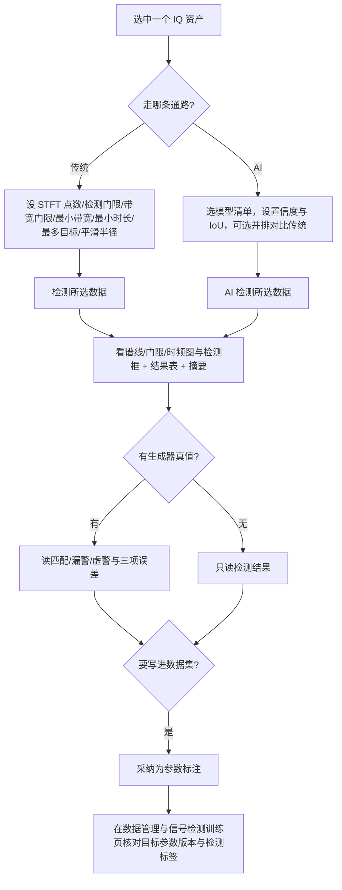

# 信号检测

版本：0.1.1。更新日期：2026-10-06。

「信号检测」是信号分析工作台的检测与参数估计页（页面注册表第 4 项）。它对所选 IQ 记录跑**传统能量检测基线** `energy_detect_v1`：先做 STFT，用中位数与 MAD 迭代估计噪声本底，按“高门限检出、低门限量带”的**双门限**策略划出目标频带，再估计时间支撑并把同一辐射源的频带归并为会话级目标，每个目标输出中心频率、占用带宽、频带范围、起止时间、带内功率与带内信噪比（口径 `inband_snr_v1`）。同页还可加载 `ml-manifest` 生成的 ONNX 模型清单跑 **AI 时频图检测**，两条通路的结果契约同为 `detect_result_v1`，因此能在同一份数据上并排对比；AI 通路默认在一次运行里同步跑一遍能量检测作为基线。

检测结果本身只写运行记录；点「采纳为参数标注」才会把测量值**追加**为目标参考参数版本，并在资产所属集合已有对应检测标注集时追加检测标签——这一步是“算法结论进入数据集”的唯一入口。逐跳（跳频点、跳时刻、驻留、跳速）由「跳频参数」页承担，调制类别由「调制识别」页承担。相关文档：[00 Python 技术方案](00电磁信号分析识别系统_Python技术方案.md) §4.6（能量检测）/§4.7（AI 检测）/§4.9（对比与报告）、[数据库设计](数据库设计.md)（目标参数版本、检测标签、数据版本）、[基础工程实现与文件说明](基础工程实现与文件说明.md)、[信号检测：传统能量检测](algorithms/信号检测_传统能量检测.md)、[信号检测：AI 时频图检测](algorithms/信号检测_AI时频图检测.md)。

---

## 1. 目标与边界

| 本页负责 | 本页不负责 |
| --- | --- |
| 会话级能量检测：STFT、本底估计、双门限判决、频带/时间/功率/带内 SNR 量测 | 逐跳参数（跳频点、跳时刻、驻留、跳速、信道间隔）——见「跳频参数」页 |
| 频带形态处理：闭运算合并、最小带宽、最小时长、最多目标数 | 调制类别判定——见「调制识别」页 |
| AI 检测：按清单校验输入契约、ONNX 推理、置信度与 IoU 去重、同口径辐射量重测 | 模型训练与导出（在 `training/` 目录与「信号检测训练」页） |
| 生成器真值评分：匹配/漏警/虚警、精确率/召回/F1、中心频率 MAE、带宽相对误差、带内 SNR MAE | 无真值数据上编造指标（此时只给检测结果） |
| 「采纳为参数标注」：追加目标参数版本与检测标签 | 修改或删除已有目标参数版本与标签（追加式，不覆盖） |
| 与「算法对比」页共享结果（检测/基线两列） | 数据版本构建与训练（检测数据集只纳入覆盖度为 complete 的录制） |

三条硬约束：

1. **双门限关系不可违反。** 带宽门限必须 ≤ 检测门限，且都在 0～80 dB；违反直接报错，不做静默钳制。
2. **AI 输入口径由清单决定。** 时频图点数、输入图像尺寸与动态范围以模型清单为准，界面**不覆盖**；传了与清单冲突的值即报错（训练/推理口径不许分叉）。
3. **缺依赖就禁用，不回退。** 未安装 `onnxruntime`（额外依赖 `.[ml]`）时 AI 入口与相关控件禁用并提示安装命令，传统能量检测不受影响；不提供“演示结果”兜底。

---

## 2. 页面导览

### 2.1 传统能量检测工具栏

| 控件 | 取值 | 说明 |
| --- | --- | --- |
| STFT 点数 | 128 / 256 / 512 / 1024 / 2048 / 4096（默认 512） | 频点分辨率 = 采样率 / 点数；点数越大频率越细、时间粒度越粗 |
| 检测门限 | 0.5～60 dB（默认 3.0） | 高于噪声本底该值（dB）的频点参与检出 |
| 带宽门限 | 0～60 dB | 量占用带宽用的低门限；勾「自动」时取检测门限的一半，手动时不得超过检测门限 |
| 最小带宽 | 0～1×10⁹ Hz（默认 0） | 小于该占用带宽的频段视为噪声；0 表示自动取 3 个频点 |
| 最小时长 | 0～3600 s（默认 0） | 短于该时长的目标丢弃；0 表示不限制 |
| 最多目标 | 1～256（默认 32） | 按带内功率从大到小保留的目标数 |
| 平滑半径 | 自动 / 0 / 1 / 2 / 4 / 8 / 16（默认自动） | 形态学闭运算半径（频点），把同一目标被衰落切开的频段合并；自动取 `max(2, nfft/128)` |
| 频率显示 | 自动 / 双边 / 仅正频率（默认自动） | 与「态势显示」页同口径；平均 PSD、时频图与检测框始终共用同一频率子集 |
| 检测所选数据 | 按钮 | 用以上参数发起一次能量检测任务 |
| 采纳为参数标注 | 按钮，无结果时禁用 | 把当前结果写入目标参考参数版本（`source=algorithm`）并追加检测标签 |

### 2.2 AI 检测工具栏

| 控件 | 取值 | 说明 |
| --- | --- | --- |
| AI 模型清单 | 默认（不使用已登记模型）/ 已登记模型 / 浏览本地文件… | 按用途 `detect` 过滤模型库（数据管理 → 模型管理）里已登记且状态为正常的模型。首项「默认（不使用已登记模型）」表示不指定模型：「检测所选数据」走传统能量检测，AI 检测需要先选模型。本行**只有一个下拉**（不再单独放路径输入框与“选择…”按钮），选中即写入清单路径；「浏览本地文件…」提供 `ml-manifest` 生成的 JSON（含 ONNX 相对路径与 SHA-256） |
| 置信度阈值 | 0.01～0.99（默认 0.25） | 低于该分数的模型候选框被丢弃 |
| 去重 IoU | 0～1（默认 0.5） | 同类候选框重叠度超过该值时只保留置信度最高者 |
| 并排对比传统检测 | 复选框，默认勾选 | 勾选时在同一次任务里跑一遍能量检测作为基线，并给出两项指标对照 |
| AI 检测所选数据 | 按钮 | 未安装 onnxruntime 时禁用 |
| 运行时状态 | 文本 | 显示 `onnxruntime <版本>`，或“未安装 onnxruntime：pip install '.[ml]' 后可用” |

### 2.3 图表区

| 图 | 内容 | 说明 |
| --- | --- | --- |
| 平均功率谱密度与检测门限 | 平均 PSD（检测依据）、中位数 PSD（对照）、噪声本底虚线、门限横线、每个检出目标的频带区间块 | 纵轴下沿取 `max(本底 − 5 dB, 峰值 − 80 dB)`，上沿取峰值 + 3 dB |
| 时频图与检测框 | 平均 STFT 时频图 + 检测框 | 红色实线框为本次结果；有 AI 基线时灰色虚线框为传统基线，标题注明“红框 AI 检出，灰虚线传统基线” |

### 2.4 结果表（9 列）

| 列 | 含义 |
| --- | --- |
| 编号 | 结果内序号（`id`） |
| 中心频率 | `center_hz`（频带中点，不是功率重心；基带偏移 Hz） |
| 占用带宽 | `f_high_hz − f_low_hz` |
| 频段范围 | `f_low_hz ～ f_high_hz` |
| 时间范围 | `t_start_s ～ t_end_s`（秒，保留 4 位小数） |
| 功率 dBFS | 带内平均功率（PSD × 频点分辨率，取 dB） |
| 带内 SNR | 扣噪后信号功率 / 同带宽噪声功率（`inband_snr_v1`），下限 −20 dB |
| 会话 | 跳频会话的 `session_id`，非跳频显示 “-” |
| 备注 | 传统：跳频会话“子带 N 个”或“频点 N 个”；AI：类别标签 + 置信度，跳频会话再附子带数 |

### 2.5 摘要区

摘要按行给出：数据名与采样信息（采样数、时长、采样率）；算法名、结果契约 `detect_result_v1`、带内信噪比定义 `inband_snr_v1` 与频率参考 `baseband_offset`；STFT 点数与频点分辨率、帧数、噪声本底、检测门限、最小带宽、平滑半径；检出目标数与其中的跳频会话数。**AI 结果**在其上插入模型行（模型 id@版本、摘要前 12 位、输入图像尺寸与动态范围、置信度阈值与 IoU）与耗时行（候选框数与上下文/推理/总耗时）。有生成器真值时给匹配/漏警/虚警、精确率/召回/F1 与三项参数误差，并逐条列出真值；AI 有基线时加一行“AI 检测 / 传统基线”对照。没有真值时明确写“该数据没有生成器真值（导入或原生插件产出），只给出检测结果，不计算误差指标”。

---

## 3. 检测口径

### 3.1 `energy_detect_v1` 的参数与默认值

| 参数 | 默认 | 取值边界 | 作用 |
| --- | --- | --- | --- |
| `nfft` | 512 | 16～4096 的整数 | STFT 点数；频点分辨率 = 采样率 / `nfft` |
| `threshold_db` | 3.0 | 0～80 | 检出相对噪声本底的门限（dB） |
| `band_threshold_db` | 0（→ `max(1.0, 0.5 × threshold)`） | 0～80 且 ≤ `threshold_db` | 量占用带宽的低门限 |
| `min_bandwidth_hz` | 0（→ `3 × 频点分辨率`） | 0～采样率 | 频带最小宽度 |
| `min_duration_s` | 0 | 0～记录时长 | 目标最小时长 |
| `max_detections` | 32 | 1～256 的整数 | 保留目标数上限（按功率降序） |
| `merge_bins` | 0（→ `max(2, nfft/128)`） | 0～`nfft/4` 的整数 | 闭运算半径（频点） |

未知键一律报错（不是忽略）；取值为 0 表示“自动”的项在解析后的配置里会展开成具体数值并写入 `summary.config`，便于复核。

### 3.2 判决与量测口径

1. **本底估计**：对时间平均后的 PSD（dB）用中位数与 MAD 迭代 4 次估出噪声本底 `noise_floor_db`；检出线 = 本底 + `threshold_db`。
2. **双门限判带**：高门限掩膜经闭运算（`merge_bins`）后按最小带宽过滤；低门限掩膜（本底 + `band_threshold_db`）给出更宽的频带；每个低门限连通区**只保留含有高门限游程的**频带，因此一个辐射源内部的凹口（例如调幅的载波与边带之间）只形成一个目标，而调幅的弱边带不会被高门限切掉。
3. **频率量测**：`f_low` / `f_high` 取频带首末频点各外扩半个分辨率；`center_hz` 是两者中点；`centroid_hz` 另按频带内**高门限频点**的功率加权给出（功率重心），用于追溯，表格显示的是 `center_hz`。
4. **功率与带宽**：带内功率 = 频带内全部频点的 PSD 之和 × 频点分辨率；占用带宽 = `f_high − f_low`。
5. **时间支撑**：逐帧比较频带内功率与“同带宽白噪声参考功率 × 10^(门限/10)”，取首个与末个活动帧的起止时刻；一个活动帧都没有时退化为全帧活动。
6. **带内 SNR（`inband_snr_v1`）**：噪声参考取同带宽白噪声功率 `N0 × B`，信号功率 = 带内功率 − `N0 × B`，再取 `10 × log10(信号 / 噪声)`；结果**下限 −20 dB**（更低只报“几乎全为噪声”）。
7. **置信度**：`clip((snr_db + 5) / 25, 0, 1)`，只是便于排序的启发式分数，**不是概率、未标定**。
8. **99% 能量占用**：对频带内功率做等尾截断（各舍去 0.5% 功率）得到 99% 功率区间，写入 `occupied_f_low_hz` / `occupied_f_high_hz` 作为追溯项；它是**能量占用带**而非消息带宽。跳频会话取各子带占用区间的并集。

### 3.3 会话合并规则

- 两个候选频带满足“频率间距 ≤ 3 × （两者较宽的带宽）**且** 时间重叠 ≤ 较短活动时长的 20%”时归并为同一跳频会话（`_SESSION_GAP_RATIO = 3.0`、`_SESSION_OVERLAP_RATIO = 0.2`）。
- 合并时功率相加、重心按功率加权、频带取并集、时间区间排序后累加活动时长，并累加频点数与子带数；反复迭代到不能合并为止，最后按功率降序截断到 `max_detections`，再按中心频率升序编号。
- `hopping = sub_bands > 1`（子带数 > 1 才标记为跳频会话），`session_id` 只在跳频会话时写出。**`sub_bands` 是会话合并次数、不是跳数**；相邻跳频信道之间的缝隙小于一个频点时会被掩膜与闭运算连成一条连续带，因此 `hopping` 也不能当作“这是不是跳频信号”的判据（逐跳结论看「跳频参数」页）。

### 3.4 边界与拒绝

- 样本：一维非空、实数或复数、无 NaN/Inf、不超过 `MAX_SAMPLES = 16,000,000`；采样率须为正有限数。
- 记录短于一个 STFT 帧时右补零处理，短输入不会崩；纯噪声输入返回空目标列表，不返回占位目标。
- 整条记录长于 512 帧时 STFT 步长自动加大（`hop = max(nfft//2, ⌈(长度 − nfft)/511⌉)`），保证帧数有界。
- 参数失败不装成功：无定义的量留 `null`，不写 0、不写 inf/nan；目标数上限、最小带宽与最小时长都是硬性门槛而非建议值。

### 3.5 AI 检测的输入契约与后处理

- **输入契约**（`contracts/manifest.py`、`contracts/image.py`）：清单声明时频图 `nfft`（默认 512）、输入尺寸（默认 1024，且必须是 64～4096 之间的 2 的幂）、动态范围（默认 60 dB，允许 10～120 dB）与布局 `time_frequency_grayscale_v1`。图像**行 = 频率，第 0 行为 +fs/2 向下递减**，列 = 时间自左向右递增；归一化只用“本底 + 动态范围”：`image = clip((dB − 本底) / 动态范围, 0, 1)`，与绝对增益无关。
- **推理**：`load_runner` 校验清单与模型摘要后创建 ONNX Runtime 会话；运行时缺失时抛错（界面已提前禁用入口）。
- **输出解码**（`normalized_boxes_v1`）：输出形状为 `(N, 6)`、`(1, N, 6)` 或 `(1, 6, N)`，每行 `[x_center, y_center, width, height, confidence, class]`，前四列按图像宽高归一化且坐标是**像素边界**；`(1, 6, N)` 这类转置会被自动纠正，形状不合法或含非有限值即报错。
- **后处理**：同类别内按置信度贪心 NMS（IoU > 阈值即丢弃低分框，默认 0.5）→ 丢弃低于置信度阈值（默认 0.25）的框 → 按最小带宽/最小时长过滤 → 类别索引映射为清单 `labels`（越界时退化为最后一个类别）→ 按置信度截断候选数（AI 通路取 `max(64, 4 × max_detections)`）。
- **同口径辐射量**：框只决定“目标在哪个时频块”，`power_dbfs`、`snr_db`、`bandwidth_hz` 等仍由**同一份 STFT**、同一 `inband_snr_v1` 公式与同一低门限量带逻辑测量，因此可与能量检测逐项比大小。
- **会话合并**：AI 候选同样走 `_merge_sessions`，与能量路径共用同一套跳频会话判据。
- 结果里附带 `model`（id、版本、SHA-256 摘要）、`image`（尺寸与 dB 上下限）、`raw_boxes`（原始行数、候选数、阈值）与 `timing`（上下文计算、推理、总耗时），便于追溯与性能核对。

---

## 4. 设计思路

### 4.1 为什么“高门限检出、低门限量带”

单个门限无法同时兼顾两件事：门限低则噪声毛刺被当成频带（虚警多），门限高则调幅信号的弱边带被切掉、带宽量不准。拆成两个门限后，**判决**用高门限（对信噪比要求高，稳），**几何量测**用低门限（覆盖弱边带，准），并用“低门限频带必须包含高门限游程”把两者绑定，得到既稳又准的占用带宽。带宽门限默认取检测门限的一半并强制不超过检测门限，就是为了防止把低门限调得比高门限还高、让两个门限语义倒挂。

### 4.2 为什么默认同一次运行里跑传统基线

AI 通路没有真值之外的“参照系”，若拿不同预处理下的分数与能量检测比大小，结论没有意义。因此 AI 检测在同一次调用里用**同一份 STFT** 跑一遍 `detect_signals`，把它的检出放进 `summary.baseline`，两条通路共享同一套会话合并与带内 SNR 口径，报告与「算法对比」页才能并排列出两列指标；基线可关（取消勾选「并排对比传统检测」）以省一半时间。

### 4.3 为什么“采纳”而不是“直接写”

算法结果是可重跑的实验事实，标注是人的结论。本页让检测只写运行记录，把“写进数据集”变成一个显式动作：`adopt_detections` 在**目标参考参数**上追加 `source=algorithm` 的新版本（`note` 记录来源运行），并在集合已有检测标注集时按标签粒度追加标签。全部追加式，旧版本与旧标签保留，重复采纳产生新版本——单人标注模型下“保存即生效、可回看历史”。匹配已有目标时按“中心频率距离 ≤ 两者带宽较大值的一半 **且** 时间重叠 ≥ 30%”取最近的一个；匹配不到才新建目标（会话结果建 `scope='session'`，`target_key` 形如 `s0`）。名义值（信号类型、调制、标称中心/带宽、符号率、跳速、是否跳频）从旧版本**继承**，只用算法真正测到的量（时间、频带、SNR、功率）覆盖，避免把用户已确认的信息冲掉。

### 4.4 代码级流程

1. 「检测所选数据」→ `detect_selected`：只把非默认项写进配置（`min_bandwidth_hz`、`min_duration_s` 仅在 > 0 时传；`merge_bins` 仅在非“自动”时传），然后 `start_job("detect", owner="信号检测", asset_id=…, config=…)`。AI 入口同理，但 `nfft` 与图像尺寸不进配置（由清单决定），只传门限、置信度、IoU、最多目标与可选的带宽/时长过滤。
2. `ui/runner.py` 对 `detect` / `ml_detect` 用默认预算 `(30 s, 取消宽限 0 s)`，任务在**工作子进程**里执行；页面用 `TaskBanner("信号检测", "取消本次检测")` 显示进度与取消，任务期间该页的 `detect_button`、`ml_button` 与采纳按钮禁用。
3. 服务层 `services/detection.py` 读资产 → `core_api.detect_signals`（或 `algorithms.detection.ai.ml_detect`）→ `services/truth.py::_attach_truth` 附加真值与指标 → `workspace.save_run("detect")` 或 `save_run("ml_detect", …)`。
4. `MainWindow.display_result` 把结果放进 `tab_results["信号检测"]`，`np.load(plots_path)` 后交给 `_render_detect` 画谱线、本底线、门限线、频带块、时频图与检测框并填表；同一分支刷新「算法对比」页（`_render_compare`，在该页点“刷新”时才自动跳转过去），并开放采纳按钮（`_set_adopt_run`）。
5. 「采纳为参数标注」→ `adopt_page_result("信号检测")` → `start_job("adopt_result", run_id=…)` → 服务层 `adopt_run_result` 按 `kind` 分派，`detect` / `ml_detect` 调 `adopt_detections`，返回创建/更新的目标数、标签数与涉及的标注集名。
6. 失败与取消：模型清单缺失或运行时缺失在按钮旁或状态栏给出原因；算法抛出的参数错误（未知键、门限越界、清单冲突）按原错误文本回报；取消按任务机制收尾，页面保留上一次结果与上一次的采纳入口。

---

## 5. 操作流程

1. 在左侧选中一个资产（本页只读所选资产，不做批量处理）。
2. 传统流程：按需调 STFT 点数与三个量（检测门限、带宽门限、最小带宽）以及最小时长/最多目标/平滑半径，点「检测所选数据」。
3. 读结果：谱线图确认本底与门限是否合理；时频图核对框的位置与时间跨度；结果表逐目标看中心频率、带宽、时间与带内 SNR；摘要区看本底/门限/帧数/目标数，有真值时直接读指标。
4. AI 流程：在「AI 模型清单」下拉里选一个已登记模型，或用「浏览本地文件…」挑一个 `ml-manifest` JSON，设置信度阈值与 IoU，决定是否并排对比传统，然后点「AI 检测所选数据」；结果表备注列会显示类别与置信度，时频图上红框为 AI、灰虚线为基线。
5. 结果不满意时先改门限/最小带宽/最小时长重建工况（每次重跑都是新的运行记录，不覆盖旧记录）。
6. 结论稳定后点「采纳为参数标注」：目标参考参数会新增一个 `source=algorithm` 版本，集合里已有的检测标注集同步追加标签（标签粒度与目标粒度匹配：`session_v1` 标注集只收会话目标）。
7. 到「数据管理」页核对目标与版本，或到「信号检测训练」页构建数据版本；只有资产在检测任务标注集里覆盖度为 `complete` 时，整条录制才会被纳入数据集（否则跳过并在卡片里写明原因）。

---

## 6. 常见问题（FAQ）

- **为什么结果为空（0 个目标）？** 常见原因：门限过高（默认 3 dB 已很保守，低信噪比数据可先降到 1～2 dB 试）；最小带宽或最小时长把目标滤掉了；信号带宽不足 3 个频点（把 STFT 点数调大提高频率分辨率）；或者记录里确实只有噪声——纯噪声输入按设计返回空列表，不返回占位目标。
- **为什么调幅信号的带宽看起来是消息带宽的两倍？** 含载波的调幅在频谱上是载波峰加对称上下边带，检测给的是**能量占用带**；`occupied_f_low_hz` / `occupied_f_high_hz` 是其中 99% 功率的区间，两者都不是消息带宽。
- **为什么“带宽门限”不能比“检测门限”大？** 两者语义不同：检测门限判“有没有”，带宽门限量“有多宽”。低门限高于高门限会让量带宽的掩膜反而更严，结果自相矛盾，所以直接报错（勾「自动」时取检测门限的一半，天然满足）。
- **为什么跳频信号只给了一条记录？** 会话级检测把同一辐射源的多个子带归并为一个 `hopping` 目标（`sub_bands` 是合并次数，不是跳数）。要跳频点、跳时刻与跳速请到「跳频参数」页；若相邻信道缝隙小于一个频点，掩膜与闭运算会把它们连成一条连续带，此时 `hopping=false` 也是正常的。
- **AI 入口为什么是灰的？** 未安装 `onnxruntime`。装 `pip install '.[ml]'` 后入口自动启用，状态文本会显示 `onnxruntime <版本>`。
- **为什么我改了 STFT 点数却没生效？** AI 通路的 `nfft`、图像尺寸与动态范围由模型清单声明，界面不覆盖；与清单冲突时算法直接报错。要改就改清单（重新导出模型）而不是改界面。
- **为什么没有误差指标？** 真值优先读目标的当前参考参数版本，没有时退化为生成器摘要；导入数据与原生插件产出两者都没有，此时只给检测结果，不编造指标。
- **采纳会覆盖我原来的标注吗？** 不会。采纳是**追加**：新增一个 `source=algorithm` 的参数版本并追加标签，旧版本与旧标签保留；名义值从旧版本继承，只覆盖算法实测的四个量。重复采纳会产生新版本。
- **结果表里的置信度能当概率用吗？** 不能。能量检测的 `confidence = clip((snr_db + 5)/25, 0, 1)` 只是排序用的启发式分数；AI 通路的置信度是网络原始分数，同样**未标定**。

---

## 7. 与代码 / 测试的对应

| 功能 | 代码 | 测试 |
| --- | --- | --- |
| 页面控件、渲染与频率掩膜 | `src/signal_analysis/ui/pages/detect_page.py`（`build_detect`、`_render_detect`、`_frequency_mask`、`detect_selected`、`ml_detect_selected`、`update_detect_controls`、`update_ml_controls`） | `tests/analysis/test_gui_analysis.py::test_detection_tab_workflow`、`::test_ml_detection_render_fills_table`、`::test_detect_page_frequency_display_for_real_record`、`::test_ml_controls_follow_runtime_availability` |
| 能量检测算法与配置校验 | `src/signal_analysis/algorithms/detection/energy.py`（`detect_signals`、`_detect_config`、`_band_regions`） | `tests/analysis/test_detect.py`（30 个用例函数，参数化后共 67 例；如 `::test_band_threshold_must_not_exceed_detection_threshold`、`::test_pure_noise_has_no_false_alarm`、`::test_three_signals_are_separated`、`::test_hopping_session_is_one_instance`、`::test_min_duration_and_max_detections_are_respected`、`::test_invalid_config_is_rejected`） |
| 共享数值基础（STFT、本底、掩膜、99% 占用） | `src/signal_analysis/algorithms/dsp/base.py`（`_stft_psd`、`_noise_floor_db`、`_binary_close`、`_true_runs`、`_occupied_span`） | `tests/analysis/test_numeric_modules.py`（Cython 模块一致性）、`tests/analysis/test_detect.py::test_arrays_are_returned_for_plotting` |
| 跳频会话合并 | `src/signal_analysis/algorithms/detection/postprocess.py::_merge_sessions` | `tests/analysis/test_detect.py::test_hopping_is_flagged_when_sub_bands_are_resolved`、`tests/analysis/test_detect_hops.py` |
| AI 检测（推理编排与后处理） | `src/signal_analysis/algorithms/detection/ai.py::ml_detect`、`src/signal_analysis/algorithms/dsp/image.py`（`spectral_context`、`detection_image`、`measure_band`） | `tests/analysis/test_ml_detect.py::test_ml_detect_matches_truth_and_reports_contract`、`::test_ml_detect_baseline_included_and_toggleable`、`::test_ml_detect_honours_score_threshold_and_limits`、`::test_ml_detect_config_validation`、`::test_measure_band_matches_generator_truth` |
| 时频图与框契约、解码与 NMS | `src/signal_analysis/contracts/image.py`、`src/signal_analysis/contracts/decode.py` | `tests/analysis/test_ml_detect.py::test_box_band_roundtrip`、`::test_non_max_suppression_removes_duplicates`、`::test_boxes_to_bands_maps_and_filters`、`::test_image_rows_start_at_positive_frequency` |
| 模型清单与推理运行时 | `src/signal_analysis/contracts/manifest.py`、`src/signal_analysis/inference/runtime.py::load_runner` | `tests/analysis/test_ml_detect.py::test_manifest_detects_tampered_model`、`::test_load_runner_requires_runtime`、`::test_service_ml_detect_requires_runtime` |
| 训练侧适配器与 ONNX 导出 | `training/detectors/`（`registry.py`、`onnx_contract.py`、`contract.py`、`dataset.py`）、`training/export_contract.py` | `tests/analysis/test_detector_adapters.py::test_onnx_rewrite_matches_hand_computed_contract`、`::test_copyleft_gate_requires_explicit_flag`、`::test_export_dataset_writes_labels_from_band_to_box` |
| 真值评分与无真值分支 | `src/signal_analysis/services/truth.py`、`src/signal_analysis/evaluation/` | `tests/analysis/test_detect.py::test_service_detect_run_carries_truth_and_metrics`、`::test_service_detect_without_generator_truth`、`::test_evaluate_detections_handles_empty_sides` |
| 采纳为参数标注（目标版本 + 标签） | `src/signal_analysis/data/adoption.py::adopt_detections`、`src/signal_analysis/ui/main_window.py::adopt_page_result` | `tests/analysis/test_adoption.py::test_adopt_detections_updates_and_creates_targets`、`::test_adopt_detections_writes_labels_when_task_set_exists`、`tests/analysis/test_adopt_gui.py::test_adopt_buttons_enable_and_adopt_result` |
| 检测数据集只纳入覆盖度 complete | `src/signal_analysis/data/datasets.py` | `tests/analysis/test_dataset_versions.py::test_partial_coverage_and_unlabeled_targets_are_excluded`、`::test_detection_dataset_version_flow` |
| 报告导出与 CLI 契约 | `src/common/reports.py::export_report`、`src/signal_analysis/cli.py` | `tests/analysis/test_detect.py::test_cli_detect_prints_contract`、`::test_contract_keys_are_frozen`、`::test_detection_keys_are_frozen_and_json_safe` |

---

## 8. 已知局限与后续方向

- **会话级而非逐跳。** 本页只给会话级结果；`sub_bands` / `hopping` 不能当跳数或跳频判据，逐跳请用「跳频参数」页。
- **置信度未标定。** 能量检测的 `confidence` 与 AI 分数都不是概率；跨模型、跨数据的分数不能直接比大小。
- **无真值即无指标。** 导入数据与原生插件产出只给检测结果；要在数据集里评分，请先「采纳为参数标注」再构建数据版本。
- **99% 占用带不是消息带宽**，调幅等双边带信号的占用带宽约为消息带宽的两倍，报告与表格显式保留这个差异，不替用户换算。
- **AI 通路的图像口径锁定在清单**：改 `nfft`、图像尺寸或动态范围必须重新导出模型；页面不提供临时覆盖。
- **界面不暴露全部解码参数**（如动态范围），且 AI 候选上限固定为 `max(64, 4 × 最多目标)`；极密目标场景需要回到算法层调参。
- **逐跳 AI 通路（`ml_detect_hops`，契约 `fh_hops_v1`）不在本页**：它要求清单声明 `label_semantics = per_hop_v1`，界面入口在「跳频参数」页；用会话级模型冒充逐跳模型会在推理前报错。
- **采纳只写四类实测量**（时间、频带、SNR、功率），不写调制类别；类别结论要走「调制识别」页采纳。
