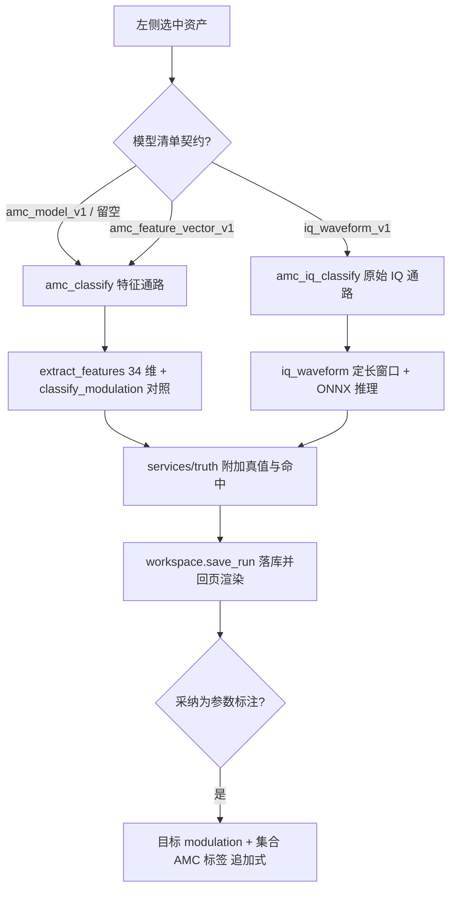

# 调制识别页面

版本：0.1.0。更新日期：2026-10-03。

「调制识别」是信号分析桌面应用的第五个标签页，负责在**一个分析频带**内判定 A09 六类调制（FM、SSB、2ASK、
QPSK、16QAM、64QAM），结果契约为 `amc_classify_v1`（特征通路）或 `amc_iq_classify_v1`（原始 IQ 通路）。
页面输入是左侧选中的数据资产加「分析中心 / 分析带宽」两个频带参数；输出是类别后验概率、34 维确定性特征
（IQ 通路改为输入窗口口径）、传统启发式对照与真值命中情况，结论可经「采纳为参数标注」写回目标的
`modulation` 与集合 AMC 标签。方案定位与实测数字见[技术方案](00电磁信号分析识别系统_Python技术方案.md)
§4.8（含 §4.8.1 原始 IQ 通路），算法细节见[调制识别：传统特征与启发式判定](algorithms/调制识别_传统特征与启发式判定.md)
与[调制识别：AI 特征学习](algorithms/调制识别_AI特征学习.md)，标注与版本语义见[数据库设计](数据库设计.md)。

---

## 1. 目标与边界

| 本页负责 | 本页不负责 |
| --- | --- |
| 单频带单信号的六类判别、类别概率、可信度提示 | 频带切分与多信号分离（频带由「信号检测」页或手工给出） |
| 34 维确定性特征提取与展示、模型来源回显 | 射频载频换算（IQ 是复基带，频率一律为基带偏移） |
| 传统启发式对照（数字/模拟、簇数估计） | AM 与两种跳频样式的类别判定：不在六类字典内，按「不适用」计数 |
| 原始 IQ 通路（`iq_waveform_v1` 清单）的定长窗口判别 | 训练与数据集构建（见「AMC 识别训练」页与 `training/`） |
| 结论采纳为参数标注（目标 `modulation` + 集合 AMC 标签） | 改写或删除既有标注（采纳一律追加新版本） |

三条硬约束：

1. **一个频带一个结论。** 每次识别只针对一个分析频带；资产含多个目标且频带无法定位时，采纳会明确报错，
   不会随便挑一个目标写入。
2. **特征通路的字典与特征顺序都不随模型变。** `amc_model_v1` 与 `amc_feature_vector_v1` 清单的类别必须
   与 A09 六类一致、特征顺序必须与 `AMC_FEATURES` 逐项一致；只有原始 IQ 通路（`iq_waveform_v1`）允许
   `class_set = custom` 的独立字典（≤ 64 类）。
3. **「不适用」要计数，未确认项要照抄。** `am`、跳频样式、无生成器真值的导入数据、多目标录制一律标
   「不适用」并保留样本计数；`pending` 始终带出「识别准确率的合格门限尚未确认」。

---

## 2. 页面导览

| 区块 | 内容 | 说明 |
| --- | --- | --- |
| 顶部输入行 | 分析中心 / 分析带宽 / 「取用检测结果频带」/ 「识别所选数据」/ 「采纳为参数标注」 | 频率输入自适应 Hz/kHz/MHz；带宽 0 表示整段采样带宽、不做抽取；**两条通路共用这组口径** |
| 模型行 | 「识别模型」文本框 / 「选择…」/ 「识别所选数据」/ 模型状态标签 | 文本框留空 = 内置线性基线；状态标签**常驻显示当前通路与模型**（选空 → 「内置线性基线 · 特征通路」；选中清单 → 「原始 IQ 通路（CNN/TCN）· id@version · arch」/「特征通路 · 线性判别模型」/「特征通路 · ONNX 分类器」；清单读不动或契约不认识时红字提示） |
| 结果图 | 六类后验概率柱状图 | IQ 通路标题改为「类别后验概率」；两轴禁用缩放平移，避免类别名被移出视野 |
| 结果表 | 「特征 / 取值」（34 行，6 位有效数字） | IQ 通路改为「输入口径 / 取值」，只列决定模型输入的量 |
| 摘要框 | 频带、算法与契约、模型来源、预测、可信度、传统对照、真值、待确认项 | 只读纯文本 |
| 任务横幅 | 「调制识别」任务进度与「取消本次识别」 | 同一页同一时刻只允许一个任务 |

### 2.1 控件语义

| 控件 | 取值 / 默认 | 语义 |
| --- | --- | --- |
| 分析中心 | 默认 0 Hz，范围 ±1 GHz | 写入配置 `offset_hz`；值为 0 时**不传该键**（表示基带中心） |
| 分析带宽 | 默认 0 Hz，范围 0～1 GHz | 写入配置 `bandwidth_hz`；只有 > 0 才传（0 = 用整段采样带宽、中心强制归零，不做抽取）。**特征通路（`extract_features`）与 IQ 通路（`iq_waveform`）是同一口径**：不给带宽就都把整段当作分析带，窄带信号落在记录某个频点上时必须先填频带，否则两条通路都得不到可靠结论 |
| 取用检测结果频带 | 按钮 | 取最近一次「信号检测」结果里 `power_dbfs` 最大的目标，把中心与带宽填进输入框（可再手改） |
| 识别模型 | 留空或 JSON 路径 | 留空 → 内置基线 `amc-linear-default`（特征通路）；`amc_model_v1` → 自训练线性模型；`amc_feature_vector_v1` → ONNX 特征分类器；`iq_waveform_v1` → 自动改走 IQ 通路。文本框变化即刷新模型状态标签，不必先跑一次识别 |
| 选择… | 文件对话框 `*.json *.onnx` | 只把路径写进文本框，契约校验留给识别入口（这里不"宽容"非法清单） |
| 识别所选数据 | 按钮 | 按所选资产与配置起任务；清单声明 IQ 契约时改调 `amc_iq_classify` |
| 采纳为参数标注 | 按钮 | 默认禁用；页面出现 `run_id` 后启用，把结论采纳为参数标注 |

### 2.2 结果显示的差异

| 区块 | 特征通路（`amc_classify_v1`） | 原始 IQ 通路（`amc_iq_classify_v1`） |
| --- | --- | --- |
| 图标题 | 六类后验概率 · 预测 X（置信度） | 类别后验概率 · 预测 X（置信度） |
| 右表内容 | `AMC_FEATURES` 逐项特征值 | 输入契约、通道排布、窗口采样点、归一化、分析率、抽样比、窗口起点、源样本/分析样本、带内功率、窗口 RMS/峰均比、带内 SNR 粗估 |
| 摘要附加 | 模型来源与训练集内准确率、传统对照行 | 预处理/推理耗时、运行时版本、标签集合标识（`a09` 或 `custom`）与「无传统对照」说明 |

---

## 3. 识别口径

### 3.1 A09 六类字典与类别顺序

类别字典 `AMC_CLASSES = ("fm", "ssb", "ask2", "qpsk", "qam16", "qam64")`，显示名依次为 FM 调频、SSB 单边带、
2ASK 幅度键控、QPSK 四相键控、16QAM、64QAM。**字典顺序即概率向量与坐标轴顺序**，冻结不改。
生成器样式里 `am` 与 `fh2fsk`/`fh_ofdm` 经 `mode_to_class` 映射为 `None`，即不属于六类，评测时按「不适用」计入
统计而不是算作识别错误。六类之外的自定义字典只出现在原始 IQ 通路，且必须在结果里原样带出 `classes`/`class_set`。

### 3.2 传统启发式判定的判据与阈值（`heuristic_digital_analog_v1`）

这是一棵**直接处理原始 IQ 的显示用规则树**，不消费 34 维特征向量，只区分数字/模拟并给簇数粗估，因此不能与
六类结果互相顶替。判定顺序如下：

| 步骤 | 判据 | 数值 | 输出 |
| --- | --- | --- | --- |
| 抽样 | 等步长抽样预算 | `max_points = 20000` | 抽样后校验有限性，含 NaN/Inf 直接报错 |
| 常量检查 | 实部与虚部标准差 | 两者都为 0 | `analog`，簇数 0 |
| 包络检查 | 包络变异系数 `std(\|x\|)/mean(\|x\|)` | `< 0.25` → 模拟 | 否则进入峰度检查 |
| 峰度检查 | I/Q 中心四阶标准化矩（正态参考 3，不减 3） | `min(k_i, k_q) < 2.45` → 数字 | — |
| 多峰检查 | I 与 Q 边缘直方图峰数 | I、Q 峰数均 ≥ 2 → 数字 | 否则 `analog`，簇数 0 |
| 簇数估计 | I 峰数 × Q 峰数 | 夹在 2～256 | 模拟返回 0 |

边缘峰数（`_marginal_modes`）的规则固定：在 `±(3σ + 1e-12)` 范围做 64 桶直方图并做 5 点滑动平均；候选峰需达到
最高峰的 **12%**，且与邻近更高峰之间存在不高于自身 **75%** 的谷，否则视为肩部抖动而不计。

### 3.3 34 维特征与模型 / 清单契约

- **特征契约** `amc_feature_vector_v1`，顺序由 `AMC_FEATURES` 冻结，共 34 维：包络统计 3 项
  （`env_cv`、`env_kurtosis`、`env_gamma_max_db`）＋谱形状 3 项（`spec_flatness`、`spec_edge_ratio`、
  `psd_peak_ratio`）＋瞬时频率与相位 3 项（`inst_freq_std`、`inst_freq_kurtosis`、`phase_diff_std`）＋
  高阶累积量 3 项（`m20_mag`、`c42_mag`、`c63_mag`）＋幅度与峰值 5 项（`amp_spread`、`amp_clusters`、
  `peak_cv`、`peak_c63`、`peak_clusters`）＋峰值幅度归一化直方图模板 16 项（`peak_hist_01…16`，桶数 16、
  幅度范围倍数 1.2）＋带内信噪比粗估 1 项（`snr_estimate_db`）。
- **前端口径**（两条通路共用同一份实现）：中心裁剪 → 混频 → 65 抽头低通 → 按 `SAMPLES_PER_BAND = 8.0`
  抽取，即分析率 = 8 × 分析带宽；抽取后有效样本 `< 32` 或带内平均功率为 0 直接报错。
- **参数边界**：采样率必须为正有限值；`|中心| ≤ 采样率`；带宽必须满足 `0 < B ≤ 采样率`；不传带宽时中心置 0、
  带宽取采样率。
- **线性模型契约** `amc_model_v1`：`z = (x - mean) / scale`，`p = softmax(temperature × (z @ W + b))`；
  标准化尺度下限 `STANDARDIZE_FLOOR = 1e-2`（近常量特征不放大噪声），默认 L2 `DEFAULT_L2 = 1e-3`，
  温度在 `(0.5, 1, 2, 3, 4, 6, 8, 12, 16, 24)` 网格上标定。
- **ONNX 清单契约** `amc_feature_vector_v1`（`amc-manifest` 生成）：输入节点 `features`（`(1, 34)` float32，
  **未标准化**的原始特征）、输出节点 `scores`（`(1, 6)`）；标准化必须写在导出图内，清单里的 `standardize`
  仅留档核对。清单本身有硬门禁：≤ 64 KiB、类别集合与 A09 六类一致、`features` 顺序与 `AMC_FEATURES` 一致、
  `input.size = 34`、模型必须是清单目录内的相对路径且 `sha256` 相符。推理需要 onnxruntime（安装 `.[ml]`），
  运行时最低版本 `1.17`。
- **原始 IQ 清单契约** `iq_waveform_v1`（`amc-iq-manifest` 生成）：输入 `(1, 2, N)` float32，通道排布
  `iq_channels_first_v1`（0 = I、1 = Q），归一化 `unit_rms`（窗口 RMS 归一化，功率另行测量写进
  `waveform.power_dbfs`），窗口采样点数 `64 ≤ N ≤ 65536`（默认 `1024`）、类别 ≤ 64 个、类别名 ≤ 64 字符；
  清单声明的 `normalization`/`samples_per_band`/`lowpass_taps` 必须与本实现逐项相同，否则直接拒绝；
  窗口长度与清单不一致或短于 64 点即报错，**短窗口不补零**。

### 3.4 置信度与「字典外类别」处理

`prediction` 共有字段为 `label / label_text / confidence / margin / scores / reliable / reason / snr_note`，
特征通路另带 `nearest_centroid`（最近的类心）。可信度（`reliable`）按固定顺序判定：

| 顺序 | 条件 | 结果 |
| --- | --- | --- |
| 1 | 带内信噪比无法估计（占用带几乎覆盖采样带宽） | `reliable = True`，说明「未做低信噪比标注」 |
| 2 | `snr_db < LOW_SNR_WARNING_DB = 5.0` | `reliable = False`，标注「仅供参考」 |
| 3 | 最高类概率 `< 0.5` | `reliable = False`，原因「类别区分度不足」 |
| 4 | 其余 | `reliable = True` |

采纳（`data/adoption.py::adopt_classification`）的口径：

- 类别 → `modulation` 映射：`fm→FM`、`ssb→SSB`、`ask2→2ASK`、`qpsk→QPSK`、`qam16→16QAM`、`qam64→64QAM`；
  字典外的标签按**原名大写**写入（IQ 通路的自定义类名因此不丢）。
- 目标选择：给了分析频带就按「中心最近 + 时间重叠」匹配；只有一个信号目标时直接用；没有任何目标时新建整条
  记录目标 `s0`（`for_detection=1, for_amc=1`）；多目标且频带定位失败时抛错。
- 写入：`append_target_version(..., source="algorithm")` 追加新版本，并沿用既有字段（`_CARRY_FIELDS`：
  信号类型、样式、调制、标称中心/带宽、符号率、跳速、是否跳频等）；首次写入且带频带时补 `f_low_hz`/`f_high_hz`。
- 标签：资产所属集合若有 AMC 标注集，逐集追加 `amc_labels`（`source="algorithm"`）；类别状态按该标注集字典
  判定 `known` 或 `out_of_taxonomy`——**字典外类别保留原始类名并照常写标签**，不静默丢弃。集合没有 AMC
  标注集时不写标签，只写参数版本。

### 3.5 SNR 分档与「仅供参考」

- `snr_estimate_db` 是带内信噪比**粗估**：占用带内/外平均功率谱密度之比，只作上下文提示、不参与判别；
  占用带几乎覆盖整个采样带宽时没有噪声参考区，`band.snr_estimate_db` 为 `None`，特征向量里的
  `snr_estimate_db` 退化为 60 dB 哨兵值。
- 唯一的低信噪比分档门槛是 **5 dB**；`snr_note` 固定声明「不是验收口径」。
- 仓库内自评的分档数字（[技术方案](00电磁信号分析识别系统_Python技术方案.md) §4.8）：每类 800 个合成场景的
  分层验证集准确率 0.8250、宏平均 F1 0.8246；带内 SNR ≥ 10 dB 时 ≥ 0.97，−5～5 dB 区间降到 0.44～0.66，
  主要误差来自 10 dB 以下 16QAM 与 64QAM 互混（两者 F1 为 0.608 与 0.682）。这些数字只代表仓库合成数据的
  自评，不构成对真实信道的性能承诺；也不能当作合格门限——它是待确认项。

---

## 4. 设计思路

### 4.1 为什么这样设计（取舍）

- **特征与判别分离。** 34 维确定性特征是可解释基线，特征顺序比模型更稳定（改特征即换代），因此把顺序冻结在
  契约里、把模型做成可替换的 JSON/ONNX；同一份特征既能喂线性判别器也能喂 ONNX 分类器，两条实现可同口径比较。
- **两条通路共用前端、只换判别器。** 混频、低通、抽取是同一份代码（`SAMPLES_PER_BAND = 8.0`、65 抽头），
  保证"分析率/每符号点数"不会在两条通路之间分叉；差别只在"交给判别器的是特征还是波形"。清单若声明了不同的
  前段参数会被直接拒绝，而不是静默换一种预处理。
- **单频带输入是刻意的边界。** 多信号重叠时不猜目标：先由「信号检测」页给出频带，或手工填中心/带宽，这条限制
  写在 `pending` 的第二条里。
- **诚实性出口。** 合格门限未确认就只报原始数字；不适用样本计数不丢；低信噪比与低区分度只降级为「仅供参考」
  而不隐藏结果。

### 4.2 代码级流程

调用链与边界：

1. 页面（`ui/pages/amc_page.py`）组配置 → `start_job("amc_classify" / "amc_iq_classify", owner="调制识别", ...)`。
2. 任务层（`common/gui.py::start_job` → `tasks`）按页面 owner 排队，`main_window.run_task = ui/runner._run_task`
   选超时与取消宽限；这两个动作不在放宽名单里，使用**默认 30 s 超时**。
3. 工作子进程执行服务动作：`services/amc.py::amc_classify` / `amc_iq_classify`，内部调
   `algorithms/amc/feature_model.py::amc_classify` 或 `algorithms/amc/iq_model.py::amc_iq_classify`。
4. 服务层再调 `services/truth.py::_attach_amc_truth` / `_attach_iq_truth` 附加真值与 `truth_hit`，最后
   `workspace.save_run(...)` 落库（调制识别的 `arrays` 为 `None`，只存 JSON 结果）。
5. 结果回到发起页渲染，并注册 `run_id` 供「采纳为参数标注」使用（`adopt_result` 动作）。

失败与取消：模型文件不存在、清单不合法、特征提取参数越界、onnxruntime 缺失等都以异常形式回传并写状态栏；
任务在页内横幅显示进度、可取消，取消不产生可采纳的运行记录。真值侧的三态（命中 / 未命中 / `truth_hit = None`）
在摘要里分别显示为「命中」「未命中」和「不适用 —— <原因>；样本仍计入统计，不丢弃」。

---

## 5. 操作流程

1. 在左侧选中一个信号资产（建议先跑一次「信号检测」或确认该资产是单信号）。
2. 填「分析中心」与「分析带宽」，或点「取用检测结果频带」自动取最强目标的频带后再微调。
3. 选择识别模型：留空用内置线性基线；需要自训练模型或 ONNX 分类器就点「选择…」。若选的是
   `iq_waveform_v1` 清单，页面会自动改走原始 IQ 通路（按钮行为不变）。
4. 点「识别所选数据」，在页内横幅看进度；完成后看柱状图、右侧表格与摘要（重点读「可信度」与「待确认」两行）。
5. 需要把结论写进标注时点「采纳为参数标注」：会追加目标 `modulation` 版本，并对集合里已有的 AMC 标注集
   追加标签（字典外类别记为 `out_of_taxonomy`）。
6. 到「算法对比」页或导出的离线报告核对预测与真值并排结果；训练相关操作请到「AMC 识别训练」页。

---

## 6. 常见问题（FAQ）

- **为什么选了 ONNX 文件却报「缺少 onnxruntime」？** ONNX 通路需要可选依赖 `.[ml]`；要么安装它，要么改用
  内置线性基线或自训练 JSON 模型（后者不需要 onnxruntime）。
- **为什么把 `iq_waveform_v1` 清单交给特征通路会报错？** 输入契约是硬门禁，两个方向都不互相兼容：特征清单
  交给 IQ 入口会被拒绝，IQ 清单交给特征入口同样被拒绝；页面按清单契约自动分流，所以正常操作不会撞上，手工调
  CLI 时才会见到。
- **为什么窗口长度报错？** IQ 通路要求窗口点数与清单 `input.samples` 一致且落在 64～65536；不足时**不补零**
  ——补零会让"没有有效信号"的输入也能给出高置信度结果。
- **修好数据后重新识别，为什么真值还是"不适用"？** 真值优先读目标当前参考参数版本，其次读生成器摘要；两者都
  没有（导入数据、原生插件产出）就是「不适用」。用「信号导入」或「AMC 识别训练」页的标注功能写入调制后，
  真值会随新的参数版本自动跟随。
- **`am` 和跳频信号为什么总判成六类里的某一个？** 它们不在六类字典内，真值侧标「不适用」；但模型仍会对输入
  频带输出六类概率（没有"以上都不是"这一档），因此页面只给概率与「仅供参考」提示，不把这类记录算进准确率。
- **置信度低和 SNR 低有什么区别？** SNR 低是输入物理条件（`< 5 dB`），置信度低是模型区分度不足（最高类
  概率 `< 0.5`）；两者都会把 `reliable` 置为 `False`，摘要里的原因文本不同。
- **怎么知道当前用的是传统算法还是 AI（IQ）模型？** 看模型行右侧的状态标签：留空显示「内置线性基线 ·
  特征通路」（传统 34 维特征 + 线性判别）；选中 `iq_waveform_v1` 清单显示「原始 IQ 通路（CNN/TCN）·
  id@version · arch」；选中 `amc_model_v1` / `amc_feature_vector_v1` 显示对应的特征通路自训练模型；
  清单读不动或契约不认识时红字报出。识别结果摘要里同样有「算法 `amc_classify` / `amc_iq_classify`（契约 …）」
  一行可复核。
- **分析带宽不填会怎样？** 两条通路都会把整段采样带宽当分析带（中心归零、不抽取）。信号占满整段时没问题；
  窄带信号落在记录某个频点时必须填频带（或点「取用检测结果频带」），否则特征统计与 IQ 窗口都取错频带，
  结论没有意义——实测同一批窄带资产，填对频带识别率 10/12，按整段只对 3/8。
- **采纳会覆盖我手工标注的调制吗？** 不会。采纳是**追加**一个新的参数版本（`source="algorithm"`），历史版本
  与手工版本都保留，是否采用以"当前版本"为准。
- **为什么右侧没有检测框/带宽那样的表格？** 本页的物理对象是"一个频带"，不是目标列表；频带信息在摘要第一行
  （中心、带宽、分析样本、抽样比、带内功率）。

---

## 7. 与代码 / 测试的对应

| 功能 | 代码 | 测试 |
| --- | --- | --- |
| 页面控件与结果渲染（特征通路） | `src/signal_analysis/ui/pages/amc_page.py` | `tests/analysis/test_amc.py::test_gui_amc_tab_renders_result` |
| 当前通路/模型状态标签 | `ui/pages/amc_page.py::_update_amc_model_status` | `tests/analysis/test_iq.py::test_gui_routes_iq_manifest_to_the_iq_action`（空选/选中 IQ 清单/非法 JSON 三种文案）、`test_amc.py::test_gui_amc_tab_renders_result` |
| 页面按清单契约分流到 IQ 通路 | `ui/pages/amc_page.py::_use_iq_branch` | `tests/analysis/test_iq.py::test_gui_routes_iq_manifest_to_the_iq_action`、`test_gui_renders_iq_result_without_fake_feature_columns` |
| 34 维特征与契约顺序 | `algorithms/amc/features.py`、`contracts/amc.py` | `test_amc.py::test_feature_contract_is_wire_stable`、`test_extract_features_is_deterministic_and_json_safe`、`test_features_separate_styles_by_physics` |
| 六类字典与样式映射 | `contracts/amc.py::AMC_CLASSES`、`feature_model.py::mode_to_class` | `test_amc.py::test_mode_to_class_only_covers_the_six_classes` |
| 传统启发式对照 | `algorithms/amc/heuristic.py` | `test_amc.py::test_amc_classify_result_contract`（`baseline` 段） |
| 线性模型训练/推理与温度标定 | `algorithms/amc/feature_model.py` | `test_amc.py::test_fit_model_round_trip`、`test_default_model_predicts_the_trained_classes`、`test_predict_rejects_tampered_model` |
| ONNX 清单读写与硬门禁 | `contracts/amc.py::write_amc_manifest/read_amc_manifest` | `test_amc.py::test_manifest_round_trip_and_digest`、`test_manifest_rejects_bad_inputs`、`test_amc_classify_rejects_onnx_manifest_without_runtime` |
| 统一入口与可信度出口 | `algorithms/amc/feature_model.py::amc_classify` | `test_amc.py::test_amc_classify_flags_low_inband_snr`、`test_amc_classify_validates_config_and_model` |
| 原始 IQ 契约与窗口提取 | `contracts/iq.py`、`algorithms/amc/iq_model.py::iq_waveform` | `test_iq.py::test_contracts_are_wire_stable`、`test_waveform_refuses_short_windows_instead_of_padding`、`test_waveform_uses_the_same_front_end_as_the_feature_path` |
| IQ 清单校验与类别集合 | `contracts/iq.py::read_iq_manifest`、`class_set_name` | `test_iq.py::test_manifest_round_trip_and_digest`、`test_manifest_defaults_are_a09`、`test_time_frequency_reader_still_rejects_iq_manifests` |
| 服务层与真值附加 | `services/amc.py`、`services/truth.py::_attach_amc_truth`/`_attach_iq_truth` | `test_amc.py::test_service_amc_classify_attaches_truth`、`test_service_amc_truth_is_explicitly_not_applicable`、`test_iq.py::test_service_iq_truth_respects_the_model_label_set` |
| 采纳为参数标注 | `data/adoption.py::adopt_classification` | `tests/analysis/test_adoption.py::test_adopt_classification_updates_modulation_and_labels`、`test_adopt_classification_service_end_to_end`、`test_adopt_gui.py::test_adopt_buttons_enable_and_adopt_result` |
| CLI 入口 | `amc-classify` / `amc-iq-classify` / `amc-manifest` / `amc-iq-manifest` | `test_amc.py::test_cli_amc_classify_and_manifest`、`test_iq.py::test_cli_amc_iq_classify_dispatch` |
| 训练与验收工具链 | `training/build_amc_dataset.py`、`train_amc.py`、`verify_amc.py`、`build_iq_dataset.py`、`train_iq.py`、`verify_iq.py` | `test_amc.py`（训练工具链段）、`tests/analysis/test_iq_training_tools.py` |

## 8. 已知局限与后续方向

- **合格门限未确认。** 结果只报原始指标，不做通过/不通过判定；门限确认前不建议把准确率当作验收结论。
- **依赖外部频带。** 多信号重叠场景必须先由检测切分或手工指定频带，本页不做自动分离。
- **只对单目标录制比对真值。** 多信号资产的真值一律「不适用」，以免把密录数据的命中率算成模型的成绩。
- **低 SNR 与 16QAM/64QAM 混淆仍是主要误差源。** 新信号集合（`train-signal-test2`/`check-signal-test2`/
  `signal-test`，1 MHz、窗口 1024 点、带内 SNR 5–30 dB）实测 0.91/0.90，误差几乎全部来自 16QAM/64QAM
  一对；带内 SNR < 5 dB 时该对基本不可分（0.48–0.65），是当前窗口长度下的物理上限。后续方向（详见
  [调制识别：AI 特征学习](algorithms/调制识别_AI特征学习.md) §7 与[传统特征与启发式判定](algorithms/调制识别_传统特征与启发式判定.md) §6）：
  加长分析窗（>1024 点）、加入参数估计（符号率、滚降）辅助特征、循环谱/循环累积量特征，或换非线性判别器。
- **原始 IQ 通路已有可用的正式模型。** 2026-10-04 运行 `20261004T070315-d05e05ef`（CNN，4000 训练样本、
  6 类，验证 0.9125、`signal-test` 0.90，`verify_iq.py` 10/10 通过），可在「AMC 识别训练」页历史里一键加载；
  训练规模、窗口长度与低 SNR 表现仍是最值得继续投入的方向。
