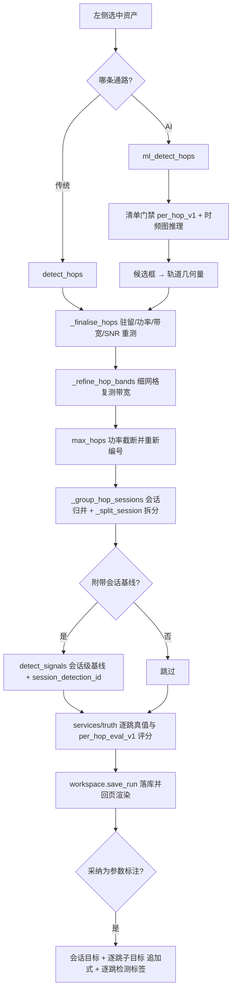

# 跳频参数页面

版本：0.1.1。更新日期：2026-10-06。

「跳频参数」是信号分析桌面应用的第六个标签页，负责把会话级检测合并成一条记录的跳频信号**拆回逐跳**：在同一份
STFT 时频图上做逐帧门限游程、时频脊线跟踪与细网格复测，输出每一跳的中心频率、单跳带宽、起止时刻、驻留时间、
功率与带内信噪比，再按时间连续性与信道分布归并为发射机会话，给出跳频点集合、跳速、信道间隔与占空比。算法
`hop_track_v1`、结果契约 `fh_hops_v1`；同页还能渲染 AI 逐跳通路（`ml_detect_hops`）的结果，两条通路的物理量
在同一份原始 PSD 上重测，因此可直接并排比较。方案定位见[技术方案](00电磁信号分析识别系统_Python技术方案.md)
§4.10（AI 逐跳见 §4.7），算法细节见[信号检测：跳频逐跳参数估计](algorithms/信号检测_跳频逐跳参数估计.md)，
与会话级口径的差异见[信号检测：传统能量检测](algorithms/信号检测_传统能量检测.md) §6，标注语义见
[数据库设计](数据库设计.md)。

---

## 1. 目标与边界

| 本页负责 | 本页不负责 |
| --- | --- |
| 逐跳量测：频带、起止、驻留、功率、带内信噪比、置信度 | 会话级"这一段是不是跳频信号"的判定（见「信号检测」页的 `hopping` 会话实例） |
| 逐跳结果的时间/频率二维展示与会话归并（跳速、占空比、信道间隔） | 解调、跳频序列预测与链路识别 |
| AI 逐跳通路（`per_hop_v1` 清单）与传统逐跳的同口径对照 | 会话级 AI 检测（`ml-detect` 走「信号检测」页） |
| 逐跳真值比对与逐跳评估（`per_hop_eval_v1`） | 训练与数据集构建（见「信号检测训练」页与 `training/`） |
| 结论采纳为参数标注（会话目标 + 逐跳子目标） | 改写或删除既有标注（采纳一律追加新版本） |

三条硬约束：

1. **一跳至少 4 个 STFT 帧。** 这是可分辨性的硬下限：帧间距由 `nfft` 与采样率决定，跳速高于
   `采样率 / (帧步长 × 4)` 时逐跳结论不成立，结果里用 `resolvable = false` 与 `reason` 明说，不把融合后的
   稀疏结果包装成完整逐跳结果。
2. **驻留与带宽不在"检测掩膜"上直接读。** 驻留在未平滑的原始帧功率上重测，单跳带宽取扣噪后的 99% 功率
   占用带宽；掩膜会被 OFDM/2FSK 的旁瓣撑宽，直接读掩膜宽度会系统性偏大。
3. **AI 只负责"跳在哪"，不负责"跳多大"。** 模型给出频带与粗糙时间，驻留、功率、带宽、SNR 一律由
   `hop_track_v1` 的同一套量测逻辑在原始 PSD 上复算，因此两种逐跳结果的物理量可以直接比大小；网络分数
   （`model_confidence`）不是概率、未标定，只作追溯用。

---

## 2. 页面导览

| 区块 | 内容 | 说明 |
| --- | --- | --- |
| 参数行 | STFT 点数 / 逐帧门限 / 时间平滑 / 最小带宽 / 最小驻留 / 最多跳数 / 粘合丢帧 / 附带会话基线 / 频率显示 | 见 §2.1 |
| 动作 | 「估计逐跳参数」/「采纳为参数标注」 | 采纳按钮默认禁用，出现可采纳运行记录后启用 |
| AI 行 | 逐跳模型清单（下拉）/ 附带传统逐跳 / 「AI 估计逐跳参数」/ 状态标签 | 只接受 `label_semantics = per_hop_v1` 的清单；下拉按用途 `hop` 过滤模型库 |
| 左图 | 平均功率谱密度与逐跳频带 | 逐跳频带按会话着色；标题回显本底、门限与频点宽度 |
| 右图 | 时频图与逐跳框 | 动态范围 80 dB；同色 = 同一会话 |
| 逐跳表 | 10 列（§2.3） | 只读，可选行 |
| 会话表 | 9 列（§2.3） | 只读 |
| 摘要框 | 数据/算法、STFT 与本底门限、可分辨性、结果计数、提示、模型行、真值与指标、会话明细、对照行 | 只读纯文本 |
| 任务横幅 | 「跳频参数」任务进度与「取消本次逐跳估计」 | 同一页同一时刻只允许一个任务 |

### 2.1 逐跳估计参数

| 控件 | 默认 | 合法范围 | 语义 |
| --- | --- | --- | --- |
| STFT 点数 | 512 | 128 / 256 / 512 / 1024 / 2048 / 4096（算法层 16～4096） | 时间频率折衷：点数越大频率越细，但每跳可用帧数越少；可分辨最快跳速 = 采样率 /（4 × 点数） |
| 逐帧门限 | 6.0 dB | 0.5～60 dB（算法层 0～80） | 逐帧判定"这一帧有没有信号"的门限（高于本底多少 dB），比会话级检测更保守 |
| 时间平滑 | 4 帧 | 1～64 | 线性 PSD 沿帧维滑动平均的窗口；单帧周期图起伏约 5.6 dB，平滑后降到约 2.8 dB |
| 最小带宽 | 0 Hz（自动 = 3 个频点） | 0～采样率 | 窄于该宽度的游程不构成一跳 |
| 最小驻留 | 0 s（自动 = 4 帧） | 0～记录时长 | 驻留短于该值的轨迹被丢弃；实际下限取 `max(设定值, 4·nfft/rate)` |
| 最多跳数 | 256 | 1～256 | 超出时按带内功率从大到小截断，再按时间与频率重新编号 |
| 粘合丢帧 | 自动（= 1） | 自动 / 0 / 1 / 2 / 4 / 8 / 16 | 轨迹允许粘合的时间丢帧间隔；0 = 保守模式 |
| 附带会话基线 | 勾选 | 勾选 / 不勾选 | 勾选时在同一次任务里跑一遍会话级能量检测（`summary.baseline`），并按频带重叠给会话填 `session_detection_id` |
| 频率显示 | 自动 | 自动 / 双边 / 仅正频率 | 自动 = 频谱关于 0 Hz 镜像（实数记录）时只显示非负频率、复数 IQ 保留双边；两张图共用同一频率范围 |

### 2.2 AI 逐跳行

| 控件 | 默认 | 语义 |
| --- | --- | --- |
| 逐跳模型清单 | 默认（不使用已登记模型）/ 已登记模型 / 浏览本地文件… | 三页共用的首项文案；本页**逐跳模型必选**，选「默认（不使用已登记模型）」后点「AI 估计逐跳参数」会被拦下并提示先选清单。按用途 `hop` 过滤模型库（数据管理 → 模型管理）里已登记且正常的逐跳模型，会话级模型不会出现在这里。本行**只有一个下拉**（不再单独放路径输入框与“选择…”按钮），选中即写入清单路径 |
| 附带传统逐跳 | 勾选 | 勾选时在同一次任务里用**同一份逐跳配置**跑一遍 `hop_track_v1`，结果放 `summary.traditional` |
| AI 估计逐跳参数 | 按钮 | 起 `ml_detect_hops` 任务；模型分数阈值与 IoU 阈值沿用「信号检测」页 AI 分组里的当前值（默认 0.25 / 0.5） |

图像尺寸、动态范围与 STFT 点数由清单声明（默认 1024 px / 60 dB / nfft 512），界面不覆盖——模型输入口径必须与
训练时一致。

### 2.3 逐跳表与会话表

| 表 | 列（来源字段） |
| --- | --- |
| 逐跳表（10 列） | 跳号（`id`）、会话（`session_id`）——按（起点时间，中心频率）排序后重新编号；中心频率（`center_hz`，扣噪 99% 功率占用带的中点，基带偏移）、单跳带宽（`bandwidth_hz`）、频段范围（`f_low_hz`～`f_high_hz`）、时间范围（`t_start_s`～`t_end_s`）、驻留（`dwell_s`，毫秒显示）、功率（`power_dbfs`）、逐跳 SNR（`snr_db`，`inband_snr_v1`，下限 −20 dB）、备注（`bin_count` 频点数、`band_nfft` 细化 FFT 点数、质心相对中点偏移；AI 通路追加 `model_confidence`/`model_label`） |
| 会话表（9 列） | 会话（`session_id`）、跳数（`hop_count`）、跳速（`hop_rate_hz`）、跳周期（`hop_period_s`）、驻留中位（`dwell_median_s`）、占空比（`duty_cycle`）、跳频点数（`len(hop_frequencies_hz)`）、跳频跨度（`hop_span_hz`）、会话带宽（`bandwidth_hz`） |

---

## 3. 逐跳口径

### 3.1 配置与默认值（`summary.config` 原样回显）

| 配置键 | 默认值 | 合法范围 | 说明 |
| --- | --- | --- | --- |
| `nfft` | 512 | 16～4096 整数 | STFT 每帧点数；频点宽度 = 采样率 / `nfft` |
| `threshold_db` | 6.0 | 0～80 | 相对噪声本底的门限 |
| `smooth_frames` | 4 | 1～64 | 时间平滑帧数 |
| `min_bandwidth_hz` | 0 → `3 ×` 频点宽度 | 0～采样率 | 最小带宽过滤 |
| `min_dwell_s` | 0 → `max(0, 4·nfft/rate)` | 0～记录时长 | 最小驻留过滤 |
| `merge_bins` | 0 → `max(1, nfft//512)` | 0～`nfft//4` | 逐帧游程的频域闭运算半径（桥接 2 个频点） |
| `max_gap_frames` | 1 | 0～16 | 轨迹允许粘合的丢帧间隔 |
| `max_gap_bins` | 0 → `merge_bins` | 0～`nfft//4` | 频点跳变门限 |
| `transition_ratio` | 1.5 | 1.1～4.0 | 过渡帧宽度比 |
| `max_hops` | 256 | 1～256 | 跳数上限 |

未知键一律拒绝；噪声本底用中位数与 1.4826·MAD 迭代 4 次估计（`_noise_floor_db`），门限 =
本底 + `threshold_db`，帧步长由 `_stft_psd` 按"至少半帧、并限制到约 512 帧"取定，因此**帧间距以
`summary.frame_interval_s` 为准，不要用 `nfft / 采样率` 反推**。

### 3.2 量测定义

| 量 | 口径 |
| --- | --- |
| 频带与中心 | 跟踪用粗网格几何游程给搜索带，量测在**原始（未平滑）线性 PSD** 上做；单跳带宽 = 扣噪后 99% 功率占用带（`_occupied_span`，两端各舍 0.5%）；`center_hz` = 占用带中点；另有 `centroid_hz`（带内功率重心）与掩膜带 `mask_f_low_hz`/`mask_f_high_hz`/`mask_bandwidth_hz` 一并保留 |
| 频带细化 | 轨迹时间不变，带宽在更细的 FFT 网格上原位复测：细网格取 `min(2048, 2^floor(log2(最短驻留采样点数 / 4)))`（下限 16 点），不高于粗网格时跳过 |
| 起止与驻留 | 在原始帧功率上取"带内功率越过门限"的时间连续段，选与轨迹重叠最多的一段（区分重复访频）；`t_end_s` 截到记录边界；驻留 < 最小驻留过滤即丢弃 |
| 功率 | 掩膜带内各帧功率的时间平均（dBFS） |
| 带内信噪比 | `inband_snr_v1`：信号功率 = 掩膜带内实测功率 − `N0 × 掩膜带宽`；噪声参考功率 = `N0 × 单跳占用带宽`；结果下限 −20 dB |
| 置信度 | `clip((snr_db + 5) / 25, 0, 1)`：由带内 SNR 换算，**与 AI 通路的模型分数不是一回事** |
| 追溯量 | `frame_count`（驻留帧数）、`bin_count`（游程覆盖的频点数）、`band_nfft`（最终用于带宽量测的 FFT 点数） |

### 3.3 会话归并

单跳按（起点时间，中心频率）排序后依次接续：

1. **时间可用性门限**：与某个进行中的会话重叠超过 1.5 帧 → 视为另一部发射机（不足两帧的重叠是跳变帧自身的
   展宽，不算证据）；间隔超过 `3.0 ×` 该会话驻留中位数 → 不再接续。
2. **频距优先**：接续评分取 `(频距, 间隔)`，先比频距再比时间——同一部发射机的跳频点落在一段固定跨度里，
   "最近的会话"是稳定判据；两部交错的发射机由此分开。
3. **异常信道间隔拆分**：把重复访问测得的中心按一个频点宽度聚类成信道集合；当独立信道 ≥ 3 且**最大间隔超过
   `3.0 × max(间隔中位数, 频点宽度)`** 时，从该间隔递归拆分（用中位数避免误拆不规则信道表）。

会话字段：`hop_count`、`sequence`（按时间排序的中心频率）、`hop_frequencies_hz`（聚类去重后的跳频点集合）、
`channel_spacing_hz`（最小信道间隔）、`hop_span_hz`、`hop_bandwidth_hz`（各跳带宽中位数）、`hop_period_s`
（跳起点间隔中位数）、`hop_rate_hz`（= 1 / 周期）、`duty_cycle`（驻留中位数 / 周期）、`dwell_median_s` /
`dwell_min_s` / `dwell_max_s`、会话频带（各跳 `f_low_hz` 最小到 `f_high_hz` 最大）、`power_dbfs`（各跳功率按
驻留时长加权摊到整段记录，与生成器同口径）、`snr_db`（扣会话频带噪声）、`session_detection_id`。

**跳速与驻留不是一回事**：跳速取跳起点间隔中位数（发射机的跳频周期），驻留是信号真正存在的时间；本项目
OFDM 图传样式每跳尾部有空闲，两者相差正好是一个占空比。单跳会话的 `hop_rate_hz` 为 `None`，不编造数字。

### 3.4 可分辨性与 `reason`

- 可分辨下限：`dwell_limit_s = min_dwell_frames × frame_interval_s`，`min_dwell_frames ≥ 4`（`_HOP_MIN_DWELL_FRAMES`）；
  结果里同时给出 `dwell_limit_s` 与理论最快跳速 `hop_rate_limit_hz = 1 / dwell_limit_s`。
- `resolvable = 有跳 且 最短驻留 ≥ dwell_limit_s`。
- `reason` 三种口径：无任何游程同时满足最小带宽与最短驻留（提示降低门限或增大分析点数）；有跳但不可分辨
  （提示帧间距与"跳速高于 X Hz 时驻留不足、逐跳不可分辨"）；否则为 `None`。
- 界面摘要固定显示「可分辨性」行（最短驻留过滤、可分辨门限、理论最快跳速、可分辨/不可分辨），`reason`
  非空时追加「提示」行。

### 3.5 逐跳评估（`per_hop_eval_v1`）

真值来源：优先读 `scope='hop'` 的目标参数版本，退化到生成器摘要（`evaluation/truth.py::hop_truth`，每跳的
频带取 `hop_bandwidth` 而非整信号占用带宽，SNR 按带宽折算 `snr + 10·log10(B_actual / B_hop)`），两条路径都
没有时显式标注「不适用」并给出原因，`metrics = None`。

| 项 | 口径 |
| --- | --- |
| 匹配 | 时间-频率二维框（`t0, t1, f0, f1`）的 IoU，匈牙利算法最大化总 IoU；默认 `iou_gate = 0.25`，可选时间/频率容差（给了才检查），容差低于分辨率时写入 `warnings`（不改变计算） |
| 混淆计数 | `true / detected / matched / missed / false_alarm`，`precision / recall / f1`（分母为 0 时为 `None`，不伪装成 0） |
| 参数误差 | `t_start_mae_s`、`t_end_mae_s`、`dwell_mae_s`、`center_mae_hz`、`center_rmse_hz`、`bandwidth_mape`、`hop_rate_mae_hz` |
| 序列与会话 | `hop_count_error`、`channel_set_consistency`（信道集合 Jaccard）、`sequence.lcs_ratio`、`sequence.normalized_edit_distance` |
| 分组报表 | 默认轴 `snr_db`（`[None, 0, 10, 20, None]`）、`hop_rate_hz`（`[None, 50, 150, None]`）、`bandwidth_hz`（`[None, 5e4, 5e5, None]`），每档给 `true/matched/missed/false_alarm` 与精确率、召回 |

**不可比较的三种原因**（`comparable = false`，`metrics`、`pairs`、`groups` 均为空，不计入任何分母）：

| 触发条件 | `reason` |
| --- | --- |
| 预测粒度是会话级（`predicted_kind = "session"`） | 预测粒度为会话级，不能与逐跳真值匹配 |
| 真值列表为空 | 真值无逐跳信息（该录制只能做会话级评估） |
| 录制覆盖度非 `complete` | 录制覆盖度 \<coverage\>，不计入逐跳分母 |

页面上，逐跳真值不可用显示为「逐跳真值：不适用 —— \<原因\>；结果仍然给出，不丢弃」，可用则追加一行指标与
两行对照：AI 逐跳 vs 传统逐跳、逐跳 vs 会话口径（`_comparison_line`）。

### 3.6 AI 逐跳通路（`ml_detect_hops`）

- **门禁**：清单 `label_semantics` 必须是 `per_hop_v1`；会话级模型会被直接拒绝（避免"8 跳报成 1 跳"），
  报错文案指向 `ml-detect` 或 `build_dataset.py --labels hop`。
- **输入**：与 `ml_detect` 同一条时频图管线（`spectral_context` + `detection_image`），`nfft` 强制与产出
  PSD 的 STFT 网格一致；候选框解码用 `score_threshold` / `iou_threshold`（默认 0.25 / 0.5，控件在
  「信号检测」页），候选上限 `max(64, min(512, max_hops))` 以免一跳一个框的模型在解码阶段被截断。
- **后段复用**：候选框映射回 `_finalise_hops` 需要的轨道几何量，之后驻留、功率、带宽、SNR 全由
  `_finalise_hops` / `_refine_hop_bands` 在原始 PSD 上重测；**不经过会话合并**。
- **额外字段**：每条逐跳明细多 `model_confidence` 与 `model_label`；传统通路没有这两个键，界面与报告按
  「不适用」显示。
- **三种口径同一次给出**：AI 逐跳、传统逐跳（`summary.traditional`，可关闭）、会话级基线
  （`summary.baseline`，可关闭），报告里三列并排。

---

## 4. 设计思路

### 4.1 为什么这样设计（取舍）

- **跟踪要时间分辨率，带宽要频率分辨率，一个网格满足不了两者。** 因此跟踪用粗网格（默认 512 点）拿到跳变
  时刻，带宽再在细网格（上限 2048 点）上原位复测，且细网格上限受最短驻留约束（一跳至少 4 帧）。
- **量测不读掩膜。** 检测掩膜为了"不漏"会把旁瓣与跳变帧一起框进来；驻留改用未平滑帧功率的时间连续段、
  带宽改用扣噪后的 99% 功率占用带，两处都回到原始 PSD，代价是要多一份 STFT 结果、换来物理量可比。
- **频距优先的会话归并。** 同一部发射机的跳频点落在一段固定跨度里，用"最近的会话"接续比用"最近的跳"更稳；
  时间只作为可用性门限，避免跳变帧的重叠把两部发射机焊在一起。
- **诚实性出口。** 不可分辨就说不可分辨（`resolvable`/`reason`）；单跳会话的跳速留空；真值不存在就标
  「不适用」；AI 只做定位、不碰物理量，使两条通路能真正对得上。
- **参数暴露到界面。** 逐跳的阈值与跟踪参数都从页面写进 `config` 并原样回显在 `summary.config` 里，报告
  可复核；界面上"最小带宽/最小驻留 = 0 = 自动"与算法层默认值保持同一换算。

### 4.2 代码级流程

调用链与边界：

1. 页面（`ui/pages/hops_page.py`）组配置 → `start_job("detect_hops" / "ml_detect_hops", owner="跳频参数", ...)`。
2. `main_window.run_task = ui/runner._run_task` 选超时；这两个动作不在放宽名单里，使用**默认 30 s 超时**，
   超过即终止而不是静默截断。任务按页面 owner 归属，同页单任务、跨页可并发，进度与取消在页内横幅。
3. 服务层（`services/detection.py::detect_hops` / `ml_detect_hops`）载入资产样本后调用
   `algorithms/detection/hops.py::detect_hops` 或 `algorithms/detection/ai.py::ml_detect_hops`。
4. 结果只保 JSON 摘要与绘图数组（频谱、原始/平滑时频图、逐跳框、逐跳 SNR 与功率），
   `services/truth.py::_attach_hop_truth` 附加真值、逐跳指标、会话基线指标与传统逐跳指标，最后落库为
   `detect_hops` / `ml_detect_hops` 运行记录。
5. 「采纳为参数标注」→ `adopt_result` 动作 → `data/adoption.py::adopt_hops`：会话条目取会话列表中首个带中心
   频率的（缺失时由各跳的频带与时间跨度合成），按"中心最近 + 时间重叠"匹配已有会话目标或新建
   `s<N>`（`scope='session'`、`for_detection=1`、`for_amc=0`）；每跳写入目标键 `<会话键>.h<跳序号>`
   （`scope='hop'`、`parent_target_id`、`hop_index`，缺省取下一个可用序号），时间夹在记录范围内、
   `snr_db` 口径 `inband_snr_v1`；资产所属集合若有 `per_hop_v1` 检测标注集，再对逐跳子目标追加检测标签
   （标注集粒度与目标 `scope` 必须匹配：`per_hop_v1` 只标 `scope='hop'`，跳频父会话本身不标）。
   逐跳结果为空时明确报错「逐跳结果为空，没有可采纳的内容」。

---

## 5. 操作流程

1. 在左侧选中一个跳频资产（生成页的 FH-2FSK 遥控 / FH-OFDM 图传样式自带逐跳真值与标注）。
2. 设 STFT 点数（默认 512），先用默认「逐帧门限 6 dB」与「时间平滑 4 帧」跑一次，**先看摘要的「可分辨性」行**
   ——它决定后面的逐跳结论是否成立；不可分辨时先按提示调整点数或接受会话级结论。
3. 需要清掉毛刺就调「最小带宽 / 最小驻留」；跳数超出上限时调「最多跳数」；两跳之间偶有丢帧可调「粘合丢帧」。
4. 点「估计逐跳参数」，读左图（逐跳频带按会话着色）、右图（跳框）、逐跳表与会话表；真值可用时读摘要的
   指标行（匹配/漏警/虚警/F1、中心与带宽误差、逐跳 SNR 误差）与「逐跳 vs 会话口径」对照行。
5. 需要与 AI 对照时在 AI 行选 `per_hop_v1` 清单（保持「附带传统逐跳」勾选），点「AI 估计逐跳参数」，两条
   通路的驻留/带宽/功率/SNR 是同一套量测，可直接比大小。
6. 确认结果后点「采纳为参数标注」：会话目标写 `is_hopping`、跳速与会话频带，逐跳子目标写各自的时间/频带/SNR，
   集合有逐跳标注集时同时追加检测标签。

---

## 6. 常见问题（FAQ）

- **为什么有跳却报「不可分辨」？** `resolvable` 要求每一跳（最短的那一跳）都至少有 4 个 STFT 帧。帧间距不一定
  等于 `nfft / 采样率`：`_stft_psd` 会把总帧数限制在约 512 帧，记录越长帧步长越大（会超过 `nfft/2`），因此
  **先读摘要里的帧间距与可分辨门限**。要分辨更快的跳，最有效的办法是缩短记录或用更低的采样率（把 `nfft`
  调小只在记录较短、步长仍由 `nfft/2` 决定时才有效）。
- **为什么"跳速"和我按驻留算出来的不一样？** 跳速取**跳起点间隔中位数**的倒数（发射机的跳频周期），驻留是
  信号真正存在的时间；本项目 OFDM 图传每跳尾部有空闲，两者相差一个占空比，因此会话表同时给这两个量。
- **为什么单跳带宽比"看起来的带宽"窄？** 单跳带宽是扣噪后的 99% 功率占用带，掩膜宽度（`mask_bandwidth_hz`）
  会被旁瓣撑宽；要看掩膜宽度请读逐跳备注与结果 JSON 里的掩膜字段。
- **两条相邻信道为什么被并成一条？** 跳变帧本身会同时覆盖两个信道（`transition_frames` 计数）。把「逐帧门限」
  提高、把「时间平滑」调小、或把「粘合丢帧」设为 0，都能减少这种融合；通道间隔太密时本页无法分开，属已知局限。
- **AI 通路的 `model_confidence` 是概率吗？** 不是。它是网络分数、未标定，只回答"这一跳存在吗"；逐跳表里的
  「逐跳 SNR」与置信度才是有物理含义的量（置信度 = `clip((snr+5)/25, 0, 1)`，由带内 SNR 换算）。
- **为什么会话级模型不能用到这一页？** 会话级模型一段传输只出一个框，直接在这里用会把 8 跳报成 1 跳；清单
  未声明 `per_hop_v1` 时软件直接拒绝并提示改用「信号检测」页。
- **"采纳为参数标注"会不会覆盖我已有的逐跳标注？** 不会，全部是追加式：会话目标与逐跳子目标各追加新版本，
  逐跳检测标签也按最新修订号追加。
- **真值为什么是"不适用"？** 逐跳真值只对生成器的跳频样式存在（`fh*`），导入数据或原生插件产出既没有逐跳
  目标参数、也没有生成器摘要，软件如实标注而不编造指标。

---

## 7. 与代码 / 测试的对应

| 功能 | 代码 | 测试 |
| --- | --- | --- |
| 页面控件、图表与摘要渲染 | `src/signal_analysis/ui/pages/hops_page.py` | `tests/analysis/test_detect_hops.py::test_gui_hops_tab_renders_result` |
| AI 逐跳入口组装（清单、配置、勾选项） | `ui/pages/hops_page.py::ml_hops_selected` | `tests/analysis/test_ml_detect_hops.py::test_gui_ml_hops_entry_builds_per_hop_request` |
| 逐跳跟踪、驻留/带宽/SNR 量测与会话归并 | `algorithms/detection/hops.py`（`detect_hops`、`_finalise_hops`、`_refine_hop_bands`、`_group_hop_sessions`） | `test_detect_hops.py`（契约冻结、参数与真值一致、两会话拆分、纯噪声与不可分辨 `reason`、`max_hops` 截断、确定性） |
| 与能量检测共用的一份时频/本底/占用带实现 | `algorithms/dsp/base.py`（`_stft_psd`、`_noise_floor_db`、`_occupied_span`） | `tests/analysis/test_numeric_modules.py::…`（同一实现断言）、`tests/analysis/test_detect.py` |
| 逐跳真值折算（生成器摘要） | `evaluation/truth.py::hop_truth` | `test_detect_hops.py::test_hop_truth_union_equals_session_level_truth_band`、`test_hop_truth_is_empty_without_generator_truth` |
| 逐跳评估契约与不可比较口径 | `evaluation/hops.py`（`evaluate_hop_tracks`、`match_hop_tracks`） | `tests/analysis/test_hop_eval.py`（完美匹配、漏警/虚警、IoU 门限、容差、匈式全局最优、不可比较原因、分辨率警告、信道序列指标） |
| AI 逐跳（门禁、后段复用、三口径） | `algorithms/detection/ai.py::ml_detect_hops` | `tests/analysis/test_ml_detect_hops.py`（会话级模型拒绝、逐跳分数回溯、漏警/虚警、数组契约超集、三粒度评分与报告） |
| 服务层与真值/基线指标 | `services/detection.py`、`services/truth.py::_attach_hop_truth` | `test_detect_hops.py::test_service_detect_hops_carries_truth_and_metrics`、`test_ml_detect_hops.py::test_service_payload_scores_all_three_granularities` |
| 采纳为参数标注（会话 + 逐跳目标） | `data/adoption.py::adopt_hops` | `tests/analysis/test_adoption.py::test_adopt_hops_creates_session_and_hop_versions`、`test_adopt_gui.py::test_adopt_buttons_enable_and_adopt_result` |
| CLI 入口 | `detect-hops` / `ml-detect-hops` | `test_detect_hops.py::test_cli_detect_hops_prints_contract`、`test_ml_detect_hops.py::test_cli_maps_ml_detect_hops_options` |
| 离线报告三列并排 | `src/common/reports.py`（逐跳评测表） | `test_ml_detect_hops.py::test_report_export_renders_three_hop_columns` |
| 逐跳模型的训练侧标签语义 | `training/build_dataset.py --labels hop`、`training/README.md` | `test_ml_detect_hops.py::test_ml_manifest_cli_can_declare_per_hop_semantics` |

## 8. 已知局限与后续方向

- **时间分辨率是硬约束。** 一跳不足 4 个 STFT 帧就没有逐跳结论；提高门限只能减少虚警，不能提高分辨率。
- **相邻跳频信道可能被融合或拆分。** 信道间隔小于手工设定的门限、或间隔远大于中位数时，都会影响归并结果；
  算法用中位数抗误拆，但不能保证与发射机的真实信道表一致。
- **同频连续跳表现为一次长驻留。** 相邻跳落在同一频点时，时频面上与"更长的驻留"无法区分（生成器真值侧同理），
  这是本方法的固有上限。
- **AI 逐跳的物理量来自传统量测。** 网络只改善"跳在哪"的判决，若模型把两跳合成一个框，后段的量测再准也只能
  得到一跳；逐跳数据集（`build_dataset.py --labels hop`）与导出框数上限（`--max-boxes`，逐跳建议 ≥ 128，
  默认 32）都还是训练侧的硬约束（详见[技术方案](00电磁信号分析识别系统_Python技术方案.md) §4.7 的实测口径）。
- **会话基线与传统逐跳都是"顺带"跑一遍。** 大记录上关闭「附带会话基线」或「附带传统逐跳」可明显缩短任务时间。
- **逐跳标注的量测口径以算法为准。** 采纳回写的参数是算法量测值（未满足 `min_dwell`/最小带宽的弱跳会被丢弃，
  掩膜与质心等追溯字段留在运行记录 JSON 里）；需要手工补齐或修改逐跳框请到「信号检测训练」页的检测标注子页，
  该页按标注集粒度显示目标：选 `per_hop_v1` 标注集时逐跳子目标可画框与负标注、跳频父会话不标。
