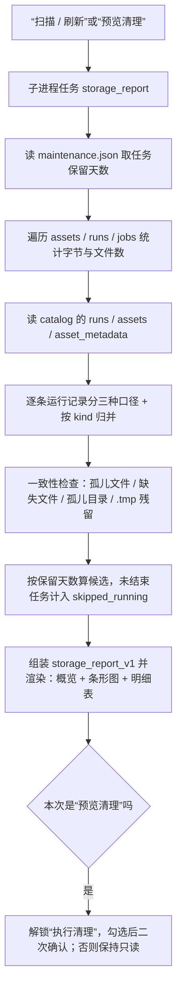
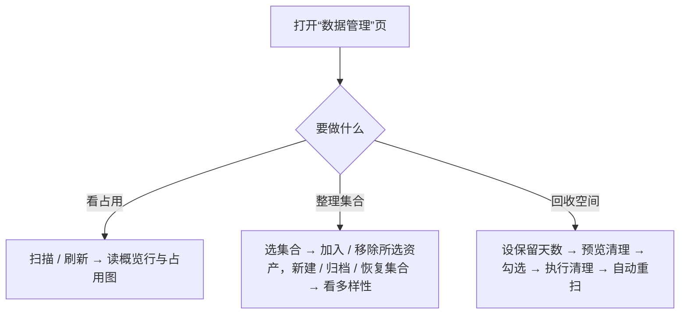

# 数据管理

版本：0.3.0。更新日期：2026-10-06。

「数据管理」是信号分析桌面应用的第九个标签页（在「AMC 识别训练」之后、「算法对比」之前），负责**当前工作区**
（`workspace_data/<项目>`）存储的**只读盘点**与**白名单清理**，并在「信号集合」子页维护集合成员、查看标注进度与
**多样性分析**。工作区每个环节都会落文件：导入与生成产生**信号资产**（`assets/`），检测 / 跳频 / 调制识别产生
**运行记录**（`runs/`），每个后台任务另落一份**任务工件**（`jobs/`），元数据进**索引数据库**（`catalog.sqlite3`）；
本页把“空间被谁吃掉了”与“磁盘和索引是否还对得上”两件事收敛到一处，并补齐集合成员的事后维护。

本页口径对应[电磁信号分析识别系统技术方案](00电磁信号分析识别系统_Python技术方案.md) §4.1（导入与文件资产）、
§4.3（可视化与标注）、§4.5（报告与恢复）；集合、目标、标签与数据版本的表结构见[数据库设计](数据库设计.md)
§4.4～§4.10；集合在导入、生成环节的用法见[信号导入页面](01信号导入页面.md)、[IQ 信号生成页面](02IQ信号生成页面.md)；
结果的浏览见[运行记录页面](11运行记录.md)。

---

## 1. 目标与边界

| 本页负责 | 本页不负责 |
| --- | --- |
| 按目录统计当前工作区（`workspace_data`）的占用（字节数与文件数） | 读取或重算资产内容（**不重算 SHA-256**，见 §3.1）；统计工作区以外的目录 |
| 核对索引与磁盘的一致性（五类问题，见 §5.2） | 修复索引：发现问题只报告，不自动改数据库 |
| 列出按保留天数可安全清理的条目并执行删除 | 删除已入库的资产与已入库的运行目录（**永不可删**） |
| 记录清理审计日志 | 写入运行记录（扫描与清理都不调用 `save_run`） |
| 「信号集合」子页：新建 / 归档 / 恢复集合、增删成员、查看标注进度与**多样性分析**（§4.1）；**导出 / 导入集合包**（含资产数据与标注，§4.4） | 创建或修改标注本身（入口在检测、识别与导入页）；去重、增量同步（每次导入都是完整的新集合） |
| 「模型管理」子页：查看训练产出的模型（训练时间、大小、参数与指标）、重命名、删除，把既有训练运行里的模型补登记进模型库（§4.2），**导出 / 导入模型包**（§4.4） | 训练本身（入口在两个训练页）；修改清单与 ONNX 内容；删除训练运行目录与实验记录；训练运行目录与实验历史的迁移（自行拷贝 `training/runs/`，见 §4.4） |

三条硬约束：

1. **只读优先。** 扫描本身完全不改工作区；删除必须经过“显式预览 → 逐条勾选 → 二次确认”三步。
2. **失败安全。** 删除前按当前磁盘与索引**重新计算**候选集，只删仍在候选集里的路径（防 TOCTOU）；只允许删
   `jobs/`、`assets/`、`runs/` 三个顶层目录下、已判定为过期或孤儿的内容。
3. **规模安全。** 单文件大小取 `stat().st_size`，不打开文件；目录遍历上限 `MAX_FILES = 200000`，超限时把结果标为
   截断并给出提示，宁可少报也不让页面挂死。

---

## 2. 工作区布局与页面导览

### 2.1 工作区目录

`workspace_data/<项目>/`（分析项目为 `workspace_data/analysis`）：

```text
project.json / catalog.sqlite3   # 项目标识；索引库（runs / assets / asset_metadata，以及集合、目标、标签、数据版本等表）
assets/ 与 assets/shards/        # 资产（独立文件 <asset_id>.<ext>，编码由 storage_format 决定）；分片文件 <shard_id>.bin
runs/<run_id>/                   # 结果：result.json（必）+ plots.npz（可选）
jobs/<job_id>/                   # 任务工件：request.json / response.json / status.json / worker.log / progress.json / cancel.flag
maintenance.json 与 .log         # 本页设置（任务保留天数）；清理审计日志（JSONL，每次追加一行）
training/                        # 训练数据与模型库（capacity 统计不纳入；模型库由 §4.2 维护）
```

`training/` 下的 `runs/`（实验记录与产物）与 `models/`（模型库）都不纳入容量统计与索引一致性检查：前者由训练页的
「实验与日志」管理，后者由「模型管理」子页维护（§4.2）。本页也不再导出 HTML / JSON 盘点快照；需要看别处的占用请直接
使用系统文件管理器（工具栏“打开工作目录”仍然可用）。

写入约定决定了一致性判据：资产先写 `*.tmp` 再原子替换；任务目录在子进程启动前就已建好并写入 `status.json`，所以
**目录先于状态存在**是正常状态，而 `*.tmp` 残留意味着上一次写入中断。本页用到的索引列见[数据库设计](数据库设计.md)：
`runs.result_json`（磁盘 `runs/<id>/result.json` 的**完整副本**）、`assets.path / storage_kind / shard_offset /
shard_length / storage_format`、`asset_metadata.metadata_json`、`asset_shards`。

### 2.2 界面区块

| 区块 | 内容 | 说明 |
| --- | --- | --- |
| 任务横幅 | 「数据管理」页的进度、阶段与取消按钮 | 同页同一时刻只允许一个任务；跨页可并发 |
| 工具栏 | 扫描 / 刷新 · 打开工作目录 | “打开工作目录”用系统文件管理器打开当前工作区根目录 |
| 清理行 | 任务保留（天，0～3650）· 预览清理 · 执行清理 · 提示文字 | 默认 30 天；改动保留天数后须重新预览才解锁删除 |
| 概览行与占用图 | 总占用 / 文件数、各类别占用、索引冗余与条数、警告提示；按类别画柱形图（MiB） | 概览为富文本一行一条，**不再显示工作区路径**；零值类别不画图，工作区为空时不画 |
| 明细页签 | **信号集合**、**模型管理**（前置）/ 运行记录 / 任务工件 / 一致性 / 可清理项 | 前两个可操作（§4），其余四个只读盘点；“一致性”“可清理项”页签标题带计数 |

### 2.3 明细表

| 表 | 列 | 说明 |
| --- | --- | --- |
| 运行记录 | 类型 / 占用 / 索引冗余 / 创建时间 / 源资产 / 结果文件 | “类型”用中文标签（§3.2 的 `runs_by_kind`）；缺文件时标“缺失” |
| 任务工件 | 任务 / 动作 / 状态 / 占用 / 结束时间 / 年龄(天) | 状态取自 `status.json`，缺失时记为“未知” |
| 一致性 | 问题 / 路径 / 占用 / 说明 | 五类问题合并成一张表；干净时显示“无 · 索引与磁盘一致” |
| 可清理项 | 选择 / 类别 / 路径 / 占用 / 判定依据 | 唯一可勾选的表；勾选后才启用“执行清理” |
| 模型管理 | 名称 / 类型 / 用途 / 训练时间 / 大小 / 参数摘要 / 来源实验 / 状态 | 模型库条目（§4.2）；双击一行即在对应推理页使用该模型 |

不再有独立的“信号资产”明细表——资产仍参与容量统计与一致性检查（§5.2），只是不在本页逐条展示；要看资产清单用
侧栏的「数据资产」。表内行数有上限（运行 1000、任务 500、一致性明细 200）；**总计始终按整棵目录树统计**，不受截断影响，截断时
界面用“500+”表示。空表显示一行占位，不留空白。扫描后“一致性”“可清理项”两个页签会带上计数（`一致性（N）`、`可清理项（M）`），
文本由 `_set_tab_text(widget, title)` 通过 `indexOf(widget)` 就地写入，因此页签增删或换序都不会写错位置，“信号集合”
页签标题恒定。

---

## 3. 容量口径与报告契约

### 3.1 容量口径

| 统计对象 | 字节定义 |
| --- | --- |
| 单个文件与目录 | 文件取 `stat().st_size`（**不重算 SHA-256**：100 MiB 级资产重算摘要会让扫描退化成分钟级）；目录（`assets` / `runs` / `jobs`）取目录下所有普通文件之和，**不跟随目录符号链接**（避免自指死循环） |
| `catalog.sqlite3` 与页面设置 | 前者取文件本身大小（含空闲页与索引）；后者为 `maintenance.json` + `maintenance.log` 之和 |
| 运行记录（逐条） | 三种口径分开给：`bytes` = 整个 `runs/<id>/`；`sqlite_bytes` = 该条 `runs.result_json` 长度；`plots_bytes` = 目录内除 `result.json` 之外的部分 |
| **索引冗余** | `Σ runs.result_json 长度 + Σ asset_metadata.metadata_json 长度`，即结果 JSON 在 SQLite 与磁盘各存一份的重复占用 |
| 分片资产 / SigMF 资产 | 分片文件由多条资产共享，单条只计自己的份额 `shard_length × 8` 字节（complex64 = 8 B/采样点）；`.sigmf-data` 与 `.sigmf-meta` 是**一条**资产，占用按两者之和计，缺任一个即视为“缺失” |
| 额外目录 / 总计 | 只统计当前工作区，`totals.bytes` 即 `assets` / `runs` / `jobs` / `catalog` / `settings` 五个类别之和（`totals.workspace_bytes` 与之相等，保留字段以便兼容） |

零除与异常一律按 0 处理：文件不可读、目录不存在、时间戳无法解析时不抛异常，只得到 `0` 或“未知”；`format_bytes()`
对负数、`NaN`、`Infinity`、`None`、非数字字符串统一返回 `0 B`，保证界面与报告里不出现 `NaN`/`inf`（报告还要通过
`json.dumps(..., allow_nan=False)`）。

### 3.2 报告契约 `storage_report_v1`

扫描是普通后台任务（`action = "storage_report"`），返回 JSON-safe 的报告对象：

| 字段 | 含义 |
| --- | --- |
| `kind` / `version` | 固定为 `storage_report` / `storage_report_v1` |
| `root` / `generated_at` | 工作区绝对路径 / UTC 生成时间 |
| `settings` | `job_retention_days`（本次生效值）；旧的 `extra_dirs` 键已废弃，读取时忽略 |
| `totals` | `bytes`、`files`、`workspace_bytes` |
| `categories[]` | `key, label, bytes, files, managed`；`key ∈ assets / runs / jobs / catalog / settings` |
| `runs_by_kind[]` | `kind, label, count, disk_bytes, sqlite_bytes`，按磁盘占用降序 |
| `tables.assets[]` | `id, name, path, bytes, sample_rate_hz, sample_count, created_at, source, label, exists, storage_kind, metadata_bytes`（仍随报告返回，供程序化读取；页面不再展示） |
| `tables.runs[]` | `id, kind, created_at, source_id, exists, bytes, sqlite_bytes, plots_bytes` |
| `tables.jobs[]` | `id, action, state, started, finished, error, bytes, age_days, has_status` |
| `tables.orphan_runs[]` | `path, bytes, reason`（源资产已删除的运行目录） |
| `tables.*_truncated` | 各明细表的截断标记（布尔） |
| `catalog` | `assets`、`runs` 条数与 `index_bytes`（索引冗余） |
| `consistency` | 五类问题的计数与明细（§5.2），另含 `assets`、`runs`、`truncated` |
| `cleanup` | `retention_days`、`targets[]`（`path, bytes, kind, reason`；`kind ∈ job / orphan_file / orphan_run`）、`bytes`、`skipped_running` |
| `warnings[]` | 需人工关注的提示（缺 `asset_metadata` 表、截断、缺失文件、孤儿运行记录） |

`runs_by_kind[].label` 用固定中文映射（通用统计、能量检测、逐跳参数、AI 检测、AI 逐跳、调制识别、原始 IQ 识别、
原生插件、IQ 生成、仿真），未知 `kind` 原样显示。`preview_cleanup()` 在同一份报告上只返回
`{version, kind: "storage_preview", generated_at, root, retention_days, targets, bytes, skipped_running}`，供 dry-run
与脚本调用。本页不再导出 HTML / JSON 快照。

---

## 4. 「信号集合」与「模型管理」子页

### 4.1 「信号集合」子页

左右分栏：左侧是集合列表与动作按钮，右侧是所选集合的只读概览与「多样性分析」。

| 控件 | 作用 | 行为要点 |
| --- | --- | --- |
| 集合列表 | 每项显示“集合名 · N 个资产 · 来源” | 来源为 手工 / 生成 / 导入 / 历史；**默认不列出已归档集合**，勾选“显示已归档”后才出现（附加“· 已归档”） |
| 显示已归档 | 切换列表是否包含已归档集合 | 只影响本子页列表，不改变其它页面选择器（始终只列未归档集合） |
| 新建集合… | 输入名称后创建手工集合 | 名称唯一（重名报“集合名称已存在”），来源 `manual` |
| 加入所选资产 | 把左侧「数据资产」当前选中的资产加入该集合 | 幂等：已在集合中时提示“该资产已在集合中” |
| 移除所选资产 | 只删成员关系 | 资产、目标、标注与数据版本都不受影响 |
| 归档集合 | 二次确认后归档 | 归档后不再出现在集合列表与其它页面的集合选择器中，成员关系保留；对已归档项禁用 |
| 恢复集合 | 把选中的已归档集合复原（`archive_collection(id, archived=False)`） | 仅当选中项已归档时可用；恢复后重新出现在列表与各选择器中 |
| 导出集合包… | 把选中集合打包成 zip（资产数据 + 目标/参考参数 + 标签 + 覆盖度 + 类别字典 + 标注集定义） | 默认写到 `<工作区>/exports/集合包-<集合名>-<UTC 时间>.zip`；空集合会被拒绝（没有可导出的资产）；详见 §4.4 |
| 导入集合包… | 从集合包重建集合 | 先体检（格式版本、资产索引与逐条摘要），再二次确认；导入**总是新建**集合与资产（新 id），重名自动加序号，已有集合与资产不被修改 |

提示行写明两条易被误解的语义：集合成员来自左侧「数据资产」的**当前选择**（本子页无资产选择器）；标注挂在目标上，
**全集合共享同一份当前标签**（同一资产属于多个集合不会出现两份不一致的真值）。右侧概览内容：

- 集合名与来源（已归档时附 `[已归档]`）；`资产 N · 目标 M（其中逐跳 H）`；来源分布（生成 / 导入 / 衍生 / 历史逐类计数）；
- **任务标注进度**：对该集合下每个任务标注集（检测 / AMC）给出 `已标注 x/y · 待标注 p · 重新标注 r`（有粒度时附
  `粒度 session_v1 / per_hop_v1`），下一行给覆盖度 `完整 c · 部分 p · 未标记 u`；没有任务标注集时说明“标注集随标注
  或配方生成创建”；
- **参数统计（信号级，按目标数）**：调制、样式、跳频、SNR 四个轴各取前 8 项计数。

「多样性分析」区（信号级，按“当前目标参数”最新版本统计）由维度下拉 + 柱形图 + 一行指标组成：

- 维度：**信号样式 / 调制 / SNR / 跳频 / 带宽 / 符号率**（枚举轴按数量降序、数值轴按分箱顺序绘制）；
- 每维度指标：`取值数 · 归一化多样性 · 最高占比 · 未知`，其中**归一化多样性** = `H / log(取值数)`
  （`H = -Σ p·ln p` 为 Shannon 熵，取值数 ≤ 1 时记 0，故取值全同时为 0、完全均匀时为 1）；
- 综合行：`综合多样性`（各有效维度归一化熵的平均，有效维度 = 取值数 > 1 的维度）、
  `有效维度 N/6`、`组合变体 K/M`（`K` 为“样式 | 调制 | 跳频”三元组去重数，`M` 为目标数，括号内为覆盖率）。

“已标注”统计集合内 `for_detection=1`（或 `for_amc=1`）的目标中当前标注集里已有标签者；“重新标注”是最高
`revision_no > 1` 的目标数；覆盖度取每个资产在 `asset_coverage` 里的最新修订，未登记的资产计入“未标记”。未知值
（如 `NULL` 调制）归入“未知”，不用 0 冒充；多样性里“未知”计入未知占比，但不参与取值数与熵的计算。

### 4.2 「模型管理」子页

训练产出的模型统一登记在**模型库** `<workspace>/training/models/<模型名>/`，本子页是它的查看与维护入口。

| 控件 | 作用 | 行为要点 |
| --- | --- | --- |
| 扫描既有模型 | 把训练目录里已成功完成、但还没登记的模型按默认命名补进模型库 | **幂等**：按来源实验（`source_run`）去重，重复点不会产生副本；默认命名冲突自动追加 `-2`；结果显示在提示行 |
| 打开模型库目录 | 用系统文件管理器打开 `training/models/` | 只读 |
| 模型表格 | 名称 / 类型 / 用途 / 训练时间 / 大小 / 参数摘要 / 来源实验 / 状态 | 按训练时间倒序；非“正常”状态整行标红；双击一行等价于「在页面中使用」 |
| 详情区 | 训练时间、大小与实际文件、SHA-256、契约、参数与指标摘要、清单路径 | 选中即显示；参数与指标来自训练产出的清单与 `metrics.json`，缺失的键不显示，不用 0 冒充 |
| 在页面中使用 | 切到用途对应的页面（`detect`→信号检测、`hop`→跳频参数、`amc`→调制识别）并填入清单路径 | 用途无法识别时只提示、不动作 |
| 重命名… | 改模型库目录名，并同步 `model.json` 里的 `name` | 重名或名称非法时报错；元数据损坏的条目不参与重命名 |
| 删除模型 | 二次确认后删除模型库目录 | **只删模型库条目**：训练运行目录、实验记录与其它模型都不受影响 |
| 导出模型包… | 把选中的模型（未选中则全部）打包成一个 zip | 默认写到 `<工作区>/exports/模型包-<UTC 时间>.zip`；包内含 `model.json`、清单、ONNX 与 `metrics.json`；详见 §4.4 |
| 导入模型包… | 从模型包登记模型 | 先体检（格式版本 + 逐文件摘要），确认后登记；导入前会在模型库内的临时目录做契约校验（类别/窗口/ONNX 摘要），通过才落库；重名自动加序号 |

每个模型是一个自包含目录（清单一旁就是它声明的 ONNX，`library` 字段仍相对同目录解析，可直接整目录拷贝或迁移）：

```text
training/models/<模型名>/
├── model.json      # 元数据：名称、类型、用途、训练时间、来源实验、参数与指标摘要
├── manifest.json   # 训练产出的检测/分类清单（原样复制）
├── <library>       # 清单声明的 ONNX（同盘优先硬链接，跨盘或链接失败时复制）
└── metrics.json    # 可选：验收/评估摘要副本
```

命名与状态两条口径：

- **命名**：默认 `<模型类型>-<训练用途>-<UTC 时间>`，例如 `cnn-amc-20261006T105213`、`rtdetr-detect-20261006T110000`；
  用途按任务的标注粒度取 `detect`（会话级）或 `hop`（逐跳）。两个训练页的「训练配置」都可在**开始训练前**手填名称，
  预检会拦下非法名与重名（重名不静默改名）。
- **状态**：`正常`；`文件缺失`（清单声明的 ONNX 不在）；`文件已变动`（实际大小与登记不符）；`元数据损坏`
  （`model.json` 缺失或不可解析）。后三种都会标红，可删除后重新登记。

入库时机有两处：训练与验收**成功后自动入库**（失败只写实验页日志，不影响已完成的训练），以及窗口启动/点「扫描既有模型」
时对历史运行做一次幂等补偿——因此升级前已有的训练产物不需要手工搬运。

### 4.3 数据模型速览

| 对象 | 表 | 与本页的关系 |
| --- | --- | --- |
| 录制资产 | `assets`（+`asset_shards`） | 集合成员只能是资产；本页只统计占用与文件存在性 |
| 信号集合 | `collections` / `collection_members` | 本子页新建 / 归档 / 恢复 / 增删成员 |
| 目标与参考参数 | `targets` / `target_versions` | 进度与参数统计的分母；来源可为生成器、导入、手工、外部、算法 |
| 字典与标注集 | `taxonomies` / `task_sets` | 决定“哪些资产参与该任务”与类别字典；进度按标注集统计 |
| 检测 / AMC 标签与覆盖度 | `detection_labels` / `amc_labels` / `asset_coverage` | 标签追加式版本化、本页只读进度；覆盖度取最新修订，未登记即“未标记” |
| 生成配方与数据版本 | `recipes` / `dataset_versions` | 生成集合可关联配方（复现用）；数据版本是固定成员、标签版本、划分与预处理的不可变清单，由训练侧构建 |

字段级定义、枚举取值与“当前版本”“采纳为参数标注”等语义见[数据库设计](数据库设计.md) §4.4～§4.10 与 §5。

---

### 4.4 迁移到另一台电脑：模型包与集合包

换机器（含 Linux → Windows）时不需要拷贝整个工作区，两个自包含的 zip 就够了：

| 包 | 内容 | 不含 | 导入后的效果 |
| --- | --- | --- | --- |
| **模型包** `simusignal-model-package.json` + `models/<名称>/…` | 每个模型一个目录：`model.json`、清单、ONNX、`metrics.json` | 训练运行目录、实验与评估记录 | 模型出现在「模型管理」，可在调制识别 / 信号检测 / 跳频参数页直接加载推理 |
| **集合包** `simusignal-collection-package.json` + `assets.jsonl` + `assets/<序号>-<资产 id>.npy` | 资产采样数据与元数据（采样率、来源、来源分组 `origin_group_id`）、目标与当前参考参数、当前 AMC/检测标签、覆盖度、类别字典、标注集定义、生成配方 | 数据版本（`dataset_versions`）、追加式的历史修订（只带当前状态）、检测/跳频的运行记录 | 集合连同标注重建（新 id、新集合），可直接作为训练集/验证集；来源分组保留，训练前的同源泄漏检查照常生效 |

三条口径：

1. **导入永远新建**：集合、资产、目标、标签都生成新 id，重名自动加序号（`集合甲 (2)`）；已有数据不会被覆盖或合并。
2. **校验先于落库**：包的格式版本必须一致；逐文件核对 SHA-256；模型还要经契约校验（`manifest` 的契约、类别、
   窗口长度与 ONNX 摘要）；集合包的资产索引与每条资产都要对得上。任何一步失败都中止并报出原因，不留半个条目。
3. **导入后状态**：集合与资产一律为**正常状态**（归档与否属于本机管理决定，不随包继承；源状态记录在包头部）。

**导入是整体事务**：集合包的配方、集合、标注集、资产、目标、标签与覆盖度合并在一个数据库事务里，任一步失败
全部回滚，同时删掉本次已写入的 `assets/` 文件——失败后工作区与导入前完全一致，可以直接重试。为此数据层提供了
`Workspace.batch()`（`src/common/storage.py`）：作用域内所有数据层调用共用一个连接、退出时统一提交，可重入；
普通调用仍逐条提交。合并提交同时把导入速度提了一个数量级（4001 条资产、155 MB：约 8 秒；改前逐条提交约
5 分 45 秒），因此界面导入时只会短暂显示等待光标，不需要分批或后台进度条。

命令行等价入口（可在无界面环境使用，输出 JSON）：

```bash
# 导出全部模型 / 只导出两个
python -m signal_analysis --workspace workspace_data/analysis model-export --output models.zip
python -m signal_analysis --workspace workspace_data/analysis model-export --output two.zip \
    --name ascs-amc-20261008T001729 --name cnn-amc-20261006T103044
python -m signal_analysis --workspace workspace_data/analysis collection-export \
    --collection check-signals --output check-signals.zip

# 在另一台电脑上：先体检，再导入（改名可加 --name）
python -m signal_analysis --workspace <目标工作区> package-inspect models.zip
python -m signal_analysis --workspace <目标工作区> model-import models.zip
python -m signal_analysis --workspace <目标工作区> collection-import check-signals.zip --name 导入的集合
```

Windows 注意：用 zip 传输（资源管理器原生可解压）；工作区路径尽量浅（避免 260 字符上限）；只做推理的机器
不需要 torch——冻结版应用已带 ONNX Runtime。包内一律用相对路径，Linux 打的包在 Windows 上可直接用
（反向亦然），清单里的 `training.dataset` 等绝对路径只是溯源元数据，导入时不读。

`training/runs/`（实验与日志、验收报告、checkpoint）不在两个包的范围里：需要历史时按目录整份拷贝即可，
但其中的绝对路径只在原机器有意义，跨机器只当只读记录看。

---

## 5. 设计思路（扫描、一致性、清理与集合整理）

### 5.1 扫描流程与超限 / 中断



扫描在**工作子进程**里执行（`ui/runner.py` 给 `storage_report` 的预算为 300 s、取消不设宽限期），因此有超时与取消：
超时或取消都会终止子进程并如实报告，不留半写状态。超限有两层：目录遍历文件数超过 `MAX_FILES = 200000` 时把结果标为
截断并写 `warnings`（明细表另有 1000 / 500 / 200 行上限）；子进程 `worker.log` 超过 1 MiB 也会终止任务。
**扫描不写运行记录**，所以扫描本身不会让工作区变大，也不会在「运行记录」页堆出无意义条目。并发规则：
`storage_cleanup` 是**独占动作**（它运行中其它任务拒绝启动，其它任务运行中它也拒绝启动，原因显示在页内横幅）；
`storage_report` 只读，可与其它页面的任务并发。

### 5.2 五类一致性检查

只有工作区目录参与检查，五类问题各有独立判据与出口：

| 问题 | 判据 | 结论 |
| --- | --- | --- |
| 未入库文件 | `assets/` 下存在文件，但 `assets.path` 里没有对应记录 | 磁盘虚高，可安全清理 |
| 原子写残留 | `assets/` 下文件名以 `.tmp` 结尾 | 写入中断留下，可安全清理 |
| 入库但文件缺失 | 有记录但 `assets/<id>.<ext>`（SigMF 为数据与元数据文件之一）不存在 | 该资产无法分析，**不可清理**，需重新导入 |
| 未入库运行目录 | `runs/` 下有目录，但 `runs.id` 里没有对应记录 | 归档失败残留，可安全清理 |
| 源资产已删除 | 运行记录的 `source_id` 在 `assets` 里已找不到 | 结果仍可读，但无法回溯原始信号 |

“未入库运行目录”与“源资产已删除”不同：前者是磁盘多了一个目录，后者是索引多了一条指向已删资产的记录；只有前者会成为
清理候选。本页只扫描当前工作区，不再有“额外目录”这一概念——工作区之外的 `training/data`、`training/runs` 或模型目录
既不统计容量，也不参与一致性检查，更不会产生清理候选。

### 5.3 安全清理

**可删对象**只有三类：过期任务（`job`，`status.json` 的 `state ∈ success/failed/cancelled` 且距 `finished`——缺失时
退回 `started`、再退回目录 mtime——已 ≥ 保留天数）、无主文件（`orphan_file`，即“未入库文件”与 `.tmp` 残留）、
无主目录（`orphan_run`，即“未入库运行目录”）。`state = running`、状态文件缺失或状态无法识别的任务一律**算作未结束**，
永不出现在候选里并计入 `cleanup.skipped_running`。保留天数 `0` 表示“所有已结束任务都可选”，默认 30 天，取值域
`0～3650`。**永远不会被删**：已入库资产（SigMF 含同一对文件）、已入库的运行目录、`catalog.sqlite3`、`project.json`、
`maintenance.json`、`maintenance.log` 与工作区根目录本身。`training/` 下的训练数据与模型库同样不在清理白名单内，
模型库条目只能从「模型管理」子页删除。

**三道护栏**：① **预览解锁**——只有本次报告来自“预览清理”时 `_cleanup_ready` 才为真，普通扫描、改动保留天数、完成
一次清理都立刻置回假。② **逐条勾选 + 二次确认**——确认框列出条目与总字节数，并提示“已入库的信号资产与运行目录不在
可删范围内；该操作不可撤销”。③ **服务端重算（防 TOCTOU）**——`apply_cleanup()` 按当前磁盘与索引重新算一遍候选集再与
请求求交集，不在最新候选里的项一律跳过；路径规范化拒绝绝对路径、含 `..` 的路径与首段不在 `jobs/assets/runs` 白名单内
的路径，服务层另限单次 ≤ 5000 条。

**审计与回报**：每次清理往 `maintenance.log` 追加一行 JSON
（`{"at":"...","requested":2,"removed":[{"path":"jobs/xxx","bytes":4096,"kind":"job"}],"skipped":[...],"errors":[...],"bytes":4096}`，
失败也不影响清理结果）；任务返回 `storage_cleanup`，含 `removed` / `skipped` / `errors` / `bytes` / `requested` /
`remaining`，界面汇总为“已删除 N 个条目，释放 X”并列出前 12 条路径。清理完成后自动重扫一次。

与「信号导入」「IQ 信号生成」页的分工：集合与成员在导入 / 生成时按“目标集合”自动建立（生成集合由配方自动创建），
本页只做事后整理；移出成员与归档 / 恢复集合只有本页提供（集合只能归档、不能删除）；标注仍在导入与生成环节写入，
本页只读进度。

> **已下线**：早期版本的“登记历史数据…”（后台动作 `migrate_legacy`）与 CLI 子命令 `migrate-legacy` 已随本次重构移除，
> 不再扫描 `datasets/` 与 `training/runs/` 建索引。旧索引里已有的 `source_kind='legacy'` 集合 / 标注集 / 数据版本 / 实验
> 记录**仍然可读可用**（枚举值与来源标签保留，旧文件原样不动），只是不再有新的登记入口。

---

## 6. 操作流程与常见问题

### 6.1 典型流程



**盘点与回收**：①“扫描 / 刷新”读总占用、各类别占用、索引冗余、条数与警告提示；②看“运行记录”表定位大头
（`runs/` 通常是最大项）；③回收空间：设“任务保留”天数 →“预览清理”→在“可清理项”勾选 →“执行清理”（二次确认）→ 自动重扫。

**整理集合**：①在左侧「数据资产」选中资产；②切到“信号集合”子页选中集合（没有就“新建集合…”）；③“加入所选资产”或
“移除所选资产”，读右侧概览核对标注进度，并用「多样性分析」切换维度看分布与指标；④不再使用就“归档集合”，
勾选“显示已归档”选中它再“恢复集合”即可复原。

### 6.2 常见问题（FAQ）

- **为什么表里只有 500 行、总计却更大？** 明细表有行数上限（运行 1000 / 任务 500 / 一致性 200），总计仍按
  整棵目录树统计，截断用“500+”标出。
- **“索引冗余”是什么？为什么有两份？** 每条运行的结果 JSON 既写磁盘 `runs/<id>/result.json`，又整份存进
  `runs.result_json`（供列表与报告）；索引冗余就是这部分的重复占用，本页**只报不治**。
- **分片资产为什么只算一小段字节？SigMF 为什么算一条资产？** 分片文件由多条资产共享，单条只能按自己的采样点份额
  （`shard_length × 8`）计；SigMF 的数据与元数据文件是一对，占用按两者之和计，缺任一个即报“缺失”。
- **保留天数设 0 是什么意思？清理会删掉我的资产吗？** 0 表示所有**已结束**任务都可选（运行中的任务无论设多少天都不进
  候选）；清理只删过期任务、无主文件与无主目录，已入库资产与运行目录永不在范围内。
- **“入库但文件缺失”怎么处理？** 这不是清理问题：该资产校验必然失败，需要重新导入；旧记录保留以便对照。
- **点了“执行清理”没反应？** 先点“预览清理”，再在“可清理项”里勾选条目；改动保留天数会立即撤销删除权限。
- **把资产移出集合会删掉标注吗？归档的集合去哪了？** 都不会删标注：移出只删成员关系；归档只是隐藏，勾选“显示已归档”
  后选中它点“恢复集合”即可复原，成员关系与标注一直保留。
- **还能量化别的目录（`training/data`、模型目录）吗？** 不能。本页只统计当前工作区 `workspace_data`，也不再导出盘点报告；
  工作区之外的目录请用系统文件管理器查看。
- **数据管理页能删运行记录吗？** 不能。本页只统计与清理任务工件和无主文件；“源资产已删除”的记录只报告。

---

## 7. 与代码 / 测试的对应

| 功能 | 代码 | 测试 |
| --- | --- | --- |
| 盘点与清理核心：口径、候选、护栏、审计 | `src/signal_analysis/storage/maintenance.py`（`build_report` / `preview_cleanup` / `apply_cleanup` / `read_settings` / `write_settings` / `format_bytes`） | `tests/analysis/test_maintenance.py`（口径与磁盘逐项相等、五类一致性问题、候选过滤、路径白名单、日志、设置往返） |
| 服务动作 `storage_report` / `storage_cleanup` | `src/signal_analysis/services/management.py`（均不调用 `save_run`；清理限制 ≤ 5000 条） | `test_maintenance.py`、`test_gui_analysis.py::test_data_management_scan_never_writes_runs` |
| 页面渲染与按钮门禁 | `src/signal_analysis/ui/pages/data_page.py`（`DataPageMixin`、`_set_tab_text`） | `test_gui_analysis.py::test_data_management_tab_scan_and_cleanup_gating`（占位行、按钮门禁、页签计数落在各自页签上、页签顺序） |
| 「信号集合」子页 | `data_page.py`（`_build_collections_tab` / `refresh_collections_panel` / `new_collection` / `add_selected_asset_to_collection` / `remove_selected_asset_from_collection` / `archive_selected_collection` / `restore_selected_collection` / `_render_diversity`） | `tests/analysis/test_collections_gui.py`（`test_collections_panel_add_remove_archive`、`test_collections_panel_diversity`） |
| 「模型管理」子页 | `src/signal_analysis/services/model_store.py`（`list_models` / `inspect_model` / `rename_model` / `delete_model` / `reconcile` / `publish_from_run`）、`src/signal_analysis/ui/pages/models_page.py`（`ModelsPageMixin`）、`ui/main_window.py::reconcile_models` / `refresh_model_choices`、`ui/model_picker.py::ModelPicker` | `tests/analysis/test_model_store.py`（命名、入库、幂等扫描、重命名与删除、损坏检测）、`tests/analysis/test_models_gui.py` |
| 集合存储与统计、标注进度、多样性、只读动作状态栏 | `data/collections.py`（成员幂等、按 `position` 排序、`collection_summary`、`target_axis_stats`、`collection_diversity`）、`data/labels.py::task_set_progress` / `set_asset_coverage`、`ui/main_window.py::result_status`（“未写入运行记录”） | `tests/analysis/test_collections_store.py`（含 `test_collection_diversity_metrics`）、`test_dataset_versions.py`（部分覆盖与未标注目标被排除）、`test_gui_analysis.py` |
| 模型包 / 集合包（导出、体检、导入） | `src/signal_analysis/services/transfer.py`（`export_models` / `import_models` / `export_collection` / `import_collection` / `inspect_package` / `find_collection`）、`ui/pages/models_page.py`（`export_model_package` / `import_model_package`）、`ui/pages/data_page.py`（`export_collection_package` / `import_collection_package`）、`cli.py`（`model-export` / `model-import` / `collection-export` / `collection-import` / `package-inspect`）、`src/common/storage.py`（`StorageBase.batch`：批量事务） | `tests/analysis/test_transfer.py`（模型包与集合包的往返一致、改名与重名后缀、篡改摘要拒绝、zip-slip 拒绝、包类型不匹配拒绝、来源分组保留、导入失败不留残留、批量事务回滚、CLI 返回码与输出、界面按钮端到端） |
| 任务超时 / 取消、独占规则与日志上限 | `ui/runner.py`（扫描 / 清理均为 300 s）、`src/common/gui.py`（`EXCLUSIVE_ACTIONS`）、`src/common/tasks.py`（`status.json`、`worker.log` 1 MiB） | `tests/analysis/test_task_manager.py`、`test_progress_channel.py` |

一致的断言还包括：`runs_by_kind` 的分组与标签；`index_bytes` 严格小于总占用；`.tmp` / 未入库 / 缺失 / 孤儿目录四类问题
各被识别一次；保留期内零候选、运行中任务进 `skipped_running`；`apply_cleanup` 对 `../`、绝对路径、运行中任务、已入库
运行目录一律跳过；审计日志每次追加一行且 `bytes` 与返回一致；报告可通过 `json.dumps(..., allow_nan=False)`；分片资产
按份额计量；SigMF 双文件按一条计。

---

## 8. 已知局限与后续方向

- **索引冗余只报不治。** 去掉索引冗余需要改运行记录存储结构并做兼容迁移，超出本页范围。
- **模型包 / 集合包是"整包替换式"迁移，没有增量同步。** 集合包每次导出都是完整快照（只带当前标注状态，
  不含追加式的历史修订与数据版本）；已导入后源端继续改动，需要重新导出再导入一次（导入侧会生成新集合，
  而不是合并进旧集合）。**集合只能归档 / 恢复，不能删除或改名；运行记录也不能在本页删除。** 删除还涉及成员、标注与数据版本的引用检查；
  运行目录是“已入库内容”，按护栏永不可删，要回收需先有运行记录侧的删除能力。同样，本页不做
  目录级去重与硬链接（同一份 IQ 复制成两个资产就是两份占用），也不统计工作区之外的目录；`training/` 下的训练数据与模型库
不在容量盘点范围内（模型库的查看与删除见 §4.2）。
- **后续方向：** 为集合提供改名与受控删除；把清理策略（自动保留
  天数、定时清理）与索引冗余治理列入独立方案。
