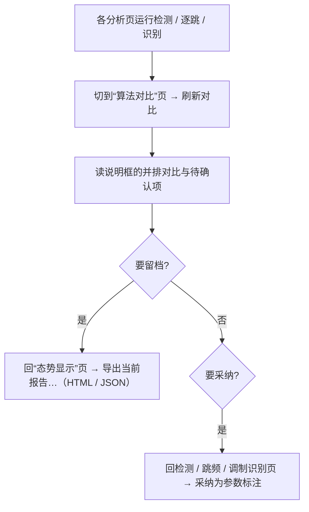

# 算法对比

版本：0.1.0。更新日期：2026-10-03。

「算法对比」是信号分析桌面应用的第十个标签页（在「数据管理」之后、「运行记录」之前），负责把**最近一次**运行在同一份
数据资产上的多路结果排到一张四列表里：检测侧的“算法结果 / 传统基线”、逐跳侧的“逐跳 / 传统逐跳 / 会话口径”、识别侧的
“模型预测 / 生成器真值”。它的定位是**汇总与核对**，不自己跑算法——数据来自各分析页留在页面上的结果（以及从运行记录
回放的历史结果），缺哪一路就在说明里写清原因，而不是拿估算值补齐。

算法在「态势显示」「信号检测」「跳频参数」「调制识别」页运行，结果落到工作区并计入运行记录；本页只读这些结果做并排
展示，报告导出由 `common.reports.export_report` 承担。口径依据见[技术方案](00电磁信号分析识别系统_Python技术方案.md)
§4.9（算法对比与报告）；各页面见[信号检测页面](04信号检测.md)、[跳频参数页面](06跳频参数.md)、
[调制识别页面](05调制识别.md)；历史结果浏览见[运行记录页面](11运行记录.md)。

---

## 1. 目标与边界

| 本页负责 | 本页不负责 |
| --- | --- |
| 并排展示同一份数据上的检测（AI / 传统）、逐跳（AI / 传统 / 会话）与调制识别（预测 / 真值）结果 | 采集数据、选择资产或配置算法参数（在各分析页完成） |
| 用同一套指标字段显示多路结果，缺值显示 `--` | 重新计算指标、重新匹配真值或改判结果 |
| 指出“缺少哪一路、为什么不能并排”，不编造内容 | 伪造缺失路径的分数（无真值时不生成指标表） |
| 提供刷新入口，把最近结果整理成表与说明 | 采纳结果（“采纳为参数标注”按钮在各分析页，见 §4.3） |
| 作为离线 HTML / JSON 报告的指标表来源 | 运行算法、写运行记录或管理数据库 |

三条硬约束：① **只搬运、不计算**——表里每个读数都来自已落库的结果对象；② **缺值不伪装**——没有真值、没跑基线、
模型清单不全时显示 `--` 或“不适用”并给出下一步操作，绝不用 0 或空串冒充成功；③ **口径必须同源**——只有“同一份数据、
同一套真值、同一套会话合并口径”才允许并排，不同口径（逐跳 vs 会话）显式标注列名并解释真实目标数为何不同。

---

## 2. 页面导览

| 区块 | 内容 | 说明 |
| --- | --- | --- |
| 顶部说明 | 页面定位与对比口径 | 只读 |
| 工具栏 | 「刷新对比」按钮 | 用当前页面留存的最近结果重新填表，并切到本页 |
| 对比表 | 四列：环节 / 对象 / 指标 / 取值 | 只读；行数 = 指标项 × 参与对比的路径条数 |
| 说明框 | 数据与算法信息、并排单行摘要、逐跳 / 识别补充、待确认项 | 只读；无结果时提示先运行一次检测或识别 |

本页没有资产选择器、算法下拉或参数输入：**输入就是各页面最近一次的结果**（`tab_results` 里的“信号检测”“跳频参数”
“调制识别”）。因此输入实际由这三页决定：

| 环节 | 数据与算法参数来源 | 参考真值来源 |
| --- | --- | --- |
| 信号检测 | 「信号检测」页的能量检测或 AI 检测（含“同时跑能量检测”勾选） | 目标当前参考参数版本；无参数时退回生成器摘要 |
| 跳频参数 | 「跳频参数」页的逐跳估计（是否并排对比传统逐跳与会话口径） | 生成器逐跳真值（仅跳频样式且记录了生成摘要时可用） |
| 调制识别 | 「调制识别」页的分类结果（内置基线 / 模型文件 / ONNX 清单） | 生成器摘要的样式与规范调制名 |

“环节”取 信号检测 / 跳频参数 / 调制识别；“对象”由结果自身决定：检测侧为 `AI 检测 · <模型 id>@<版本>` 或“能量检测”，
基线行固定“传统基线（能量检测）”；逐跳侧为 `AI 逐跳 · <模型 …>` 或“逐跳”，另有“传统逐跳（hop_track_v1）”与
“会话口径（能量检测基线）”；识别侧为 `调制识别 · <模型 …>` 与“生成器真值”。“取值”是格式化文本，缺失显示 `--`，
布尔显示“命中 / 未命中”“是 / 否”。

---

## 3. 对比口径

### 3.1 检测指标字段（`common.reports.detection_metrics`）

| 显示名 | 字段 | 说明 |
| --- | --- | --- |
| 真实目标数 / 匹配 / 漏警 / 虚警 | `true` / `matched` / `missed` / `false_alarm` | 按中心频率容差与带宽重叠做一对一匹配后的计数 |
| 精确率 / 召回 / F1 | `precision` / `recall` / `f1` | 两侧都为空时 `f1` 为 `None`（显示 `--`），不以 0 伪装 |
| 中心频率 MAE / Hz | `center_mae_hz` | 匹配对的中心频率绝对误差均值 |
| 带宽相对误差 | `bandwidth_mape` | 分数（非百分数）；真值带宽为 0 时不参与 |
| 带内信噪比 MAE / dB | `snr_mae_db` | 真值与实测都非空才计入 |

### 3.2 调制识别字段

| 显示名 | 字段 |
| --- | --- |
| 预测类别 / 类别名称 / 置信度 | `label` / `name` / `confidence` |
| 置信度差（首选−次选） / 可靠 / 判定说明 | `margin` / `reliable` / `reason` |

真值行另给“真值类别 / 样式”（`truth.class` / `truth.mode`）与“识别命中 / 未命中”；真值不可用时显示原因（例如导入数据
没有生成器摘要），按“不适用”计数而不丢弃样本。识别说明带模型标识、来源（内置基线 / 指定模型文件 / ONNX 分类器 /
内存模型）或契约名与标签集合，以及带内信噪比粗估。

### 3.3 逐跳的三条口径

| 列名 | 含义 |
| --- | --- |
| 逐跳（或 AI 逐跳 · 模型） | 按“一跳一条”匹配；AI 通路每条明细多带模型置信度，传统通路没有这两个键，按不适用显示 |
| 传统逐跳（`hop_track_v1`） | 同一次调用同步运行的传统逐跳，可与 AI 逐跳对照“模型定位 + 重测”与“纯能量逐跳” |
| 会话口径（能量检测基线） | 同一次调用复用一遍能量检测，按“一条链路一条”匹配；真实目标数与精确率 / 召回率天然不同，这正是逐跳输出要补充的信息 |

说明框另给逐跳规模（跳数、会话数）与时间分辨率结论（可分辨的跳速上限）；真值不可用时只给原因与“不适用”。逐跳明细与
会话汇总字段（跳号、会话、中心频率、单跳带宽、起止时刻、驻留、功率、逐跳信噪比、置信度；跳数、跳速、跳周期、
驻留中位、占空比、跳频点数、跳频跨度、会话带宽与带内信噪比）与报告导出共用同一套定义。

---

## 4. 结果路由、报告导出与采纳衔接

### 4.1 运行方式：本页没有自己的后台任务

本页**不启动后台任务**，所以没有本页的进度与取消：刷新是同一次界面事件里的同步渲染，不可取消也不会超时。真正的运行
在各数据来源页——算法放进工作子进程（页内横幅显示进度与取消按钮，跨页可并发、同页同一时刻只允许一个任务），完成后经
结果路由写回页面：

| 结果 `kind` | 写回的页面 | 本页动作 |
| --- | --- | --- |
| `detect` / `ml_detect` | 信号检测 | 重排检测行与基线行、重画说明 |
| `detect_hops` / `ml_detect_hops` | 跳频参数 | 重排逐跳三列与会话汇总 |
| `amc_classify` / `amc_iq_classify` | 调制识别 | 重排识别字段与真值命中行 |

从「运行记录」双击回放历史结果时同样会刷新本页，所以“对比”可以针对任意一次历史运行，而不只是最新一次（回放流程见
[运行记录页面](11运行记录.md)）。

### 4.2 报告导出契约

本页不提供导出按钮；离线报告由「态势显示」页的“导出当前报告…”按钮调用 `common.reports.export_report(result, 目标路径)`
生成，输入是最近一次显示过的结果对象（`kind`、`run_id`、`created_at`、`asset_id`、`source_id` 与契约字段都在其中）：

- `.json`：原样写出结果 JSON（`allow_nan=False`，中文不转义），供机器复用；
- `.html`：HTML 转义的离线报告，标题为 `SimuSignal · <结果类型中文> · <run_id>`，正文按结果类型加指标表，页尾用
  `<pre>` 保留完整原始 JSON。

| 结果 `kind` | 报告内容 |
| --- | --- |
| `detect` / `ml_detect` | “检测评测（与生成器真值逐项对照）”：`检测结果` 与 `传统基线` 两列并排；无 `baseline_metrics` 时只出一列 |
| `detect_hops` / `ml_detect_hops` | “逐跳评测”：逐跳列 + 传统逐跳列 + 会话口径列（缺哪路少哪列），另加“会话与跳参数”表与“逐跳明细”表 |
| `amc_classify` / `amc_iq_classify` | “调制识别结果”字段表；真值可用时补“真值类别 / 样式、识别命中、真值带内信噪比”，不可用时写“不适用”；有待确认项时列“尚未确认项” |

所有文本经 `html.escape` 转义，缺值一律 `--`；写出用临时文件再原子替换，不会覆盖到一半。数据版本与评估
（`dataset_versions` / `evaluations`，见[数据库设计](数据库设计.md) §4.10～§4.11）由训练侧与数据层维护，本页不读取也
不写入；把一次对比固化成“带数据版本引用的评估”属后续方向（§8）。

### 4.3 与“采纳为参数标注”的衔接

“采纳为参数标注”按钮在信号检测 / 跳频参数 / 调制识别三个页面上；结果写回时会把该次运行的 `run_id` 绑定到对应按钮，
所以也可以先回放历史结果再采纳。采纳把算法结论写成**新的目标参考参数版本**（`source=algorithm`，追加不覆盖），可能
新建目标或标签，并在状态栏汇总“新建目标 / 更新 / 标签”。本页只读展示，**不提供采纳入口**；对比后要采纳请回对应页面。

---

## 5. 操作流程

**典型步骤**：①在「信号检测」页跑一次检测（要并排就勾选“同时跑能量检测”）；②需要逐跳对比则在「跳频参数」页跑一次
（勾选“并排对比传统逐跳”可多一列）；③需要识别对比则在「调制识别」页跑一次；④切到「算法对比」页点“刷新对比”（或等
结果写回时自动重排），先看“对象”列区分路径再逐指标比较；⑤要留档回「态势显示」页导出报告，要采纳回对应分析页。

---

## 6. 常见问题（FAQ）

- **为什么表里只有一路、没有传统基线？** 检测侧只有勾选“同时跑能量检测”、逐跳侧只有勾选“并排对比传统逐跳”，才会在
  同一次运行里同步得到基线指标；没跑过基线时说明框会指出，不会补 0。
- **为什么所有指标都是 `--`？** 该数据没有生成器真值（导入数据或原生插件产出），无法评分：本页只列结果，按“不适用”计数。
- **“刷新对比”和重新跑算法是一回事吗？切换标签页后对比表为什么没变？** 不是一回事：刷新（以及标签切换后的重新显示）
  只重排页面上已有结果，不启动任何任务；要换算法或参数请回各页面重跑。
- **逐跳为什么真实目标数和会话口径不一样？** 两条口径的“一条实例”不同：逐跳按“一跳一条”，会话按“一条链路一条”，
  因此匹配数与精确率 / 召回率不同，这是刻意并排展示的信息。
- **AI 逐跳的“模型置信度”为什么有时不显示？** 只有 AI 逐跳通路的明细带模型分数，传统通路没有这两个键，按不适用处理
  （报告里也是“按需加列”）。
- **在哪个页面导出报告？** 在「态势显示」页点“导出当前报告…”，导出的是**最近一次显示过**的结果（含从运行记录回放的
  结果）；本页与「运行记录」页都没有导出按钮。
- **对比页会写运行记录吗？能选定某次历史运行吗？** 不会写记录；要针对历史运行，先在「运行记录」页双击回放，再刷新对比。
- **能一次比较同一算法的多组参数吗？数据版本 / 评估报告在哪看？** 前者当前不能（只展示每个环节最近一次的结果，没有参数
  扫描或结果列表）；后者由训练侧与数据层维护，本页不读取，本页只有“运行时指标”。

---

## 7. 与代码 / 测试的对应

| 功能 | 代码 | 测试 |
| --- | --- | --- |
| 页面结构、刷新入口、并排渲染与对象命名 | `src/signal_analysis/ui/pages/compare_page.py`（`ComparePageMixin.build_compare` / `compare_from_detect` / `_render_compare` / `_object_label`） | `tests/analysis/test_gui_analysis.py::test_compare_page_pairs_ai_with_baseline`（断言 20 行 = 10 指标 × 2 路径、四列表头、对象名） |
| 指标字段与格式 | `src/common/reports.py::detection_metrics` / `amc_metrics`、`ui/helpers.py::_comparison_line` | 同上；表格定义见 `common/reports.py` |
| 结果路由（各页 → `tab_results` → 本页） | `ui/main_window.py::display_result` / `result_ready` | `test_gui_analysis.py`（检测、AI 检测渲染用例） |
| 报告导出 | `src/common/reports.py::export_report`（`.json` / `.html`） | `test_gui_analysis.py::test_analysis_gui_workflow`（导出 JSON 并校验 `kind`） |
| 采纳为参数标注 | `data/adoption.py`、`services/datasets.py::adopt_result`、`main_window.py::_set_adopt_run` | `tests/analysis/test_adoption.py`、`test_adopt_gui.py` |
| 契约与指标定义 | `src/signal_analysis/evaluation/`（`metrics.py` / `hops.py` / `truth.py`） | `test_detect.py`、`test_detect_hops.py`、`test_hop_eval.py`、`test_amc.py` |

---

## 8. 已知局限与后续方向

- **只对比“最近一次”结果。** 没有资产选择器、算法与参数输入、多结果列表或参数扫描；换参数只能重跑后刷新。
- **没有图表与导出入口。** 页面只有一张表与一段说明；报告导出挂在「态势显示」页，粒度是“最近一次显示的结果”。
- **对比项不含数据版本与评估。** 不引用 `dataset_versions` / `evaluations`，无法回答“同一数据版本上两个模型的平均指标”。
- **耗时与资源对比缺失。** 耗时史目前只在运行记录里，本页不做耗时并排。- **后续方向：** 增加资产 / 算法 / 参数选择与“运行对比”后台任务（复用现有运行链路）；把对比结果固化为可引用数据版本
  与评估记录；提供“导出对比报告”入口；补耗时、显存与吞吐的并排列。
