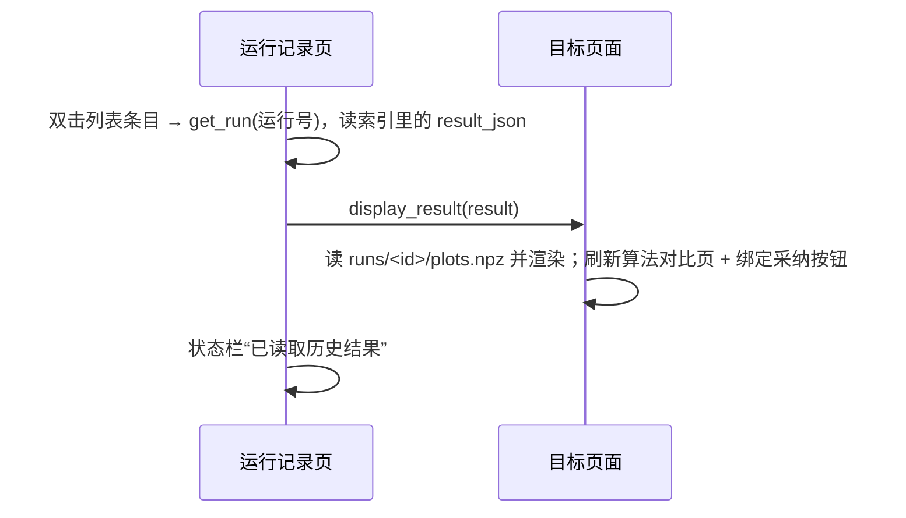

# 运行记录

版本：0.1.0。更新日期：2026-10-03。

「运行记录」是信号分析桌面应用的第十一个（最后一个）标签页，位于「算法对比」之后，负责**列出最近的运行并按需回放
历史结果**。页面极简：一个提示标签加一个列表，双击一条记录就把那次运行的结果重新渲染到它所属的分析页面，用来复核、
对照，或从历史结果出发继续“采纳为参数标注”。它只读运行记录，不运行算法、不删记录，也不重新计算任何指标。

它与「数据管理」页共用 `runs/` 目录但分工不同：本页是索引侧浏览，数据管理页只统计占用与清理任务工件；运行目录属于
“已入库内容”，在数据管理页里永不可删。结果结构与评估口径见
[技术方案](00电磁信号分析识别系统_Python技术方案.md) §4.5（报告与恢复）、§4.6～§4.10；结果所属页面的设计见
[态势显示](03态势显示.md)、[信号检测页面](04信号检测.md)、[调制识别页面](05调制识别.md)、[跳频参数页面](06跳频参数.md)；
索引表结构见[数据库设计](数据库设计.md) §4.13。

---

## 1. 目标与边界

| 本页负责 | 本页不负责 |
| --- | --- |
| 列出最近 100 条运行（时间、类型、运行号前 8 位） | 运行算法、重新计算指标或改判结果 |
| 双击把历史结果渲染回对应页面（含刷新对比与绑定采纳按钮） | 删除、重命名、归档或导出运行记录 |
| 在状态栏给出读取成功 / 失败的明确文案 | 统计占用、清理文件（见[数据管理页](09数据管理.md)） |
| 作为“按原配置复核”的入口（结果与运行号一并可查） | 断点续跑或自动重试失败任务（失败任务不留记录） |

三条硬约束：① **只读**——本页不写任何文件、不调用服务动作，回放不会产生新的运行记录；② **只列成功结果**——记录在磁盘
`result.json` 与索引行都写好之后才产生，失败或取消的任务不出现；③ **按需读取**——回放只读该条记录的结果 JSON 与它自己的
图数据，不重算算法，也不重新读取原始 IQ 资产。

---

## 2. 页面导览

| 区块 | 内容 | 说明 |
| --- | --- | --- |
| 提示标签 | “最近 100 次成功运行 · 双击查看或回放” | 固定文案，说明条目上限与交互方式 |
| 运行列表 | 每条一行：`创建时间（前 19 位，空格分隔） · 类型 · 运行号前 8 位` | 按创建时间倒序；运行号完整值存在条目的用户数据里 |
| 底部状态栏 | 窗口共用的状态栏与“正在运行 N 个任务”汇总 | 回放结果与错误都写在这里 |

| 列表字段 | 来源 | 说明 |
| --- | --- | --- |
| 创建时间 | `runs.created_at` | 取前 19 位并把 `T` 换成空格；这是**保存时刻**，不是任务开始时刻 |
| 类型 / 运行号 | `runs.kind` / `runs.id` | 类型原样显示英文标识（`analysis` / `detect` / `ml_detect` / `detect_hops` / `ml_detect_hops` / `amc_classify` / `amc_iq_classify` / `native`）；运行号只显示前 8 位，完整值用于回放与“来源运行”备注 |

条目上限固定为 100（查询带 `LIMIT 100`），没有分页、搜索或按类型筛选；更早的记录仍在索引与 `runs/` 里，只是不列出。

---

## 3. 存储关系与结果路由

### 3.1 `runs/<id>` 与 `runs.result_json`

一次成功运行同时落两处内容，二者是同一份 JSON 文本：

```text
runs/<run_id>/result.json    # 结果全文（必写；JSON，缩进 2，allow_nan=False）
runs/<run_id>/plots.npz      # 绘图数组（可选；只在需要画图的结果里写）
catalog → runs(id, kind, source_id, created_at, result_json)   # 上面那份文本的完整副本
```

写入顺序是“先把文件写好，再插索引行”；任何一步失败都会删除整个运行目录并抛出异常，所以**索引里有行就一定读得到结果**。
结果对象在写入时补上 `run_id`、`kind`、`created_at`、`source_id`（原始资产 ID）与 `environment`（应用版本、Python 版本、
平台）；回放读的是**索引里的** `result_json` 而不是磁盘文件。

实际会产生记录的 `kind` 只有八种：`analysis`、`detect`、`detect_hops`、`ml_detect`、`ml_detect_hops`、`amc_classify`、
`amc_iq_classify`、`native`（原生插件复制）。数据管理页的中文标签表里另有“IQ 生成 / 仿真”，但 IQ 生成当前**不写运行
记录**，属保留标签；只读动作（盘点、清理、历史登记、参数预览、导入、集合生成、数据版本构建）也都不写运行记录。

### 3.2 结果路由表

回放与任务完成共用同一套路由，按 `kind` 决定渲染到哪个页面（页面名一律经页面注册表解析）：

| 结果 `kind` | 渲染到 | 内容与附带动作 |
| --- | --- | --- |
| `analysis` | 态势显示 | 读 `plots.npz` 画波形、频谱、星座图（按目标参考参数的符号级散点，缺参数时留白提示）与瀑布图，写摘要 |
| `detect` / `ml_detect` | 信号检测 | 画检测框与曲线、填目标表；顺带刷新算法对比页并绑定“采纳为参数标注”到本次运行 |
| `detect_hops` / `ml_detect_hops` | 跳频参数 | 画逐跳框与会话汇总、填逐跳表；顺带刷新算法对比页并绑定采纳按钮 |
| `amc_classify` / `amc_iq_classify` | 调制识别 | 填预测、置信度、可靠性等字段与真值命中；顺带刷新算法对比页并绑定采纳按钮 |
| `native` | 态势显示 | 不画图：清空图表并显示插件 id 与派生资产 id，提示去选择输出资产 |

只读动作与生成 / 导入结果不会出现在运行记录里，因此不需要路由；若索引里存在未知 `kind`，回放会当作无图结果处理并只更新
状态栏。

---

## 4. 双击回放流程、状态栏与错误处理



1. **读取**：`get_run(run_id)` 从索引取出 JSON 并反序列化；找不到时抛“运行记录不存在”。
2. **渲染**：`display_result(result)` 把结果写进对应页面的控件并按 §3.2 处理附带动作；`last_result` 随之更新，所以
   「态势显示」页的“导出当前报告…”导出的是**最近一次显示过**的结果（含回放的历史结果）。回放**不会**自动跳到目标页签
   （与 `display_result` 的注释文字不一致，属实现现状），要看到结果需手动切页。
3. **状态文案**：成功后状态栏显示“已读取历史结果”；失败显示“无法读取历史结果：<原因>”，不会静默失败。只捕获
   `ValueError`（记录不存在）与 `OSError`（例如该次运行的 `plots.npz` 已被外部删除），其它异常交由窗口层的任务错误处理。

**刷新时机**：列表只在两处刷新——窗口构造完成时，以及**任意任务完成后**（结果路由统一入口）。没有“刷新”按钮，也不监听
标签切换；由本进程之外的 CLI 新写入的记录，要等下一次任务完成或重启窗口才会出现。

---

## 5. 操作流程与常见问题

### 5.1 典型流程

①先在各分析页跑一次任务，完成后列表自动刷新，新记录在最上；②要看历史某次就双击该条记录，结果渲染回对应页面后手动
切过去查看；③要复用结论就在对应页面点“采纳为参数标注”（来源运行记为该次运行），要留档则在「态势显示」页导出当前报告
（HTML / JSON）。

### 5.2 常见问题（FAQ）

- **列表顺序与时间口径？** 按保存时刻倒序，最新在最上；上限 100 条（查询固定上限），更早的记录仍在索引与 `runs/` 里。
  显示的是结果保存时刻（`created_at`），不是任务开始时间——任务的开始 / 结束时间在任务工件的 `status.json` 里。
- **为什么没有失败或取消的任务？** 记录在结果完整写下之后才产生；失败与取消（含超时、日志超限、子进程崩溃）都不写
  记录，只留任务工件，可由数据管理页查看与清理。
- **能从历史结果继续“采纳为参数标注”吗？** 可以。回放检测 / 逐跳 / 识别结果时会把该次运行绑定到对应页面的采纳按钮，
  采纳后的标签与参数版本会注明来源运行。
- **回放会重新跑算法吗？** 不会，也不会重新读取原始 IQ：它只读结果 JSON 与该次运行的 `plots.npz`。
- **能删除或重命名记录吗？** 当前都不能（§7）。

---

## 6. 与代码 / 测试的对应

| 功能 | 代码 | 测试 |
| --- | --- | --- |
| 列表构建、刷新与双击回放 | `src/signal_analysis/ui/pages/history_page.py`（`build_history` / `refresh_history` / `open_history`）、`ui/main_window.py`（构造时与 `result_ready` 中调用）→ `display_result` | `tests/analysis/test_gui_analysis.py::test_analysis_gui_workflow`（分析完成后 `history.count() == 1`） |
| 结果路由 | `main_window.py::display_result` / `result_ready` | `test_gui_analysis.py::test_detection_tab_workflow`、`test_ml_detection_render_fills_table` |
| 存储与读取、只读动作不写记录 | `src/common/storage.py`（`save_run` / `get_run` / `list_runs`）、`data/assets.py::save_run`（补 `asset_id`）、`services/management.py`、`ui/runner.py`、`src/common/tasks.py`（`status.json`、`worker.log` 1 MiB） | `tests/analysis/test_storage_io.py`、`test_amc.py`、`test_detect.py`、`test_gui_analysis.py::test_data_management_scan_and_export_never_write_runs`、`test_task_manager.py` |

---

## 7. 已知局限与后续方向

- **不能删除或重命名、列表固定 100 条且无筛选。** 界面没有删除入口与备注字段，也无法按资产、类型或时间范围过滤；运行
  目录在数据管理页被列为“已入库内容”，永不可删。要回收需等待后续提供“按运行号删除并同步索引”的能力，注明来源只能在
  标签或采纳备注里写“来源运行 <id>”。
- **回放不切换标签页。** 需手动切页，交互上容易被误解为“没有反应”。回放会一次性读入该次运行的 `plots.npz`（不按需分块），
  图数据很大时占内存；原始 IQ 资产不在回放路径里。
- **刷新是被动的。** 只有构造窗口与任意任务完成后才刷新，外部工具写入的记录不会自动出现。
- **后续方向：** 提供删除 / 重命名与按资产、类型、时间范围筛选；列表改用中文类型标签并显示源资产与耗时；补齐耗时史
  （总方案提到的“耗时史”目前仅体现为本列表的记录条数）；提供“按原配置重跑”快捷入口。
