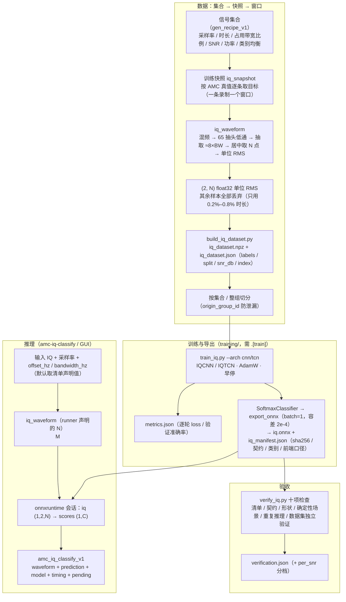
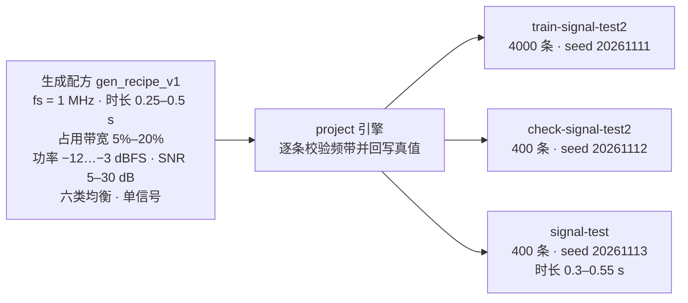
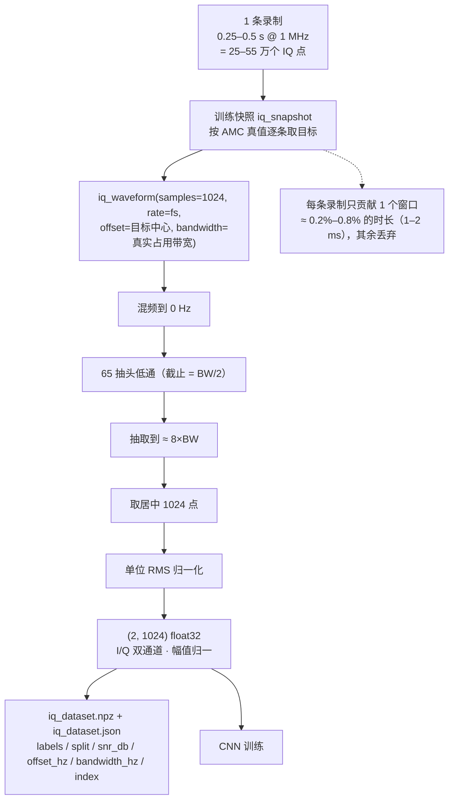
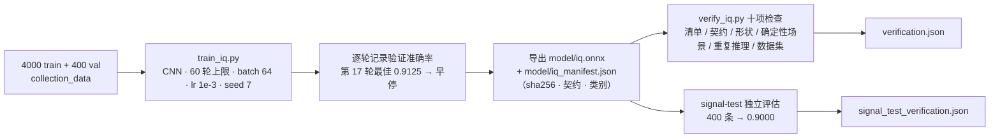

# 调制识别（原始 IQ 端到端：CNN/TCN）算法设计

| 项目 | 取值 |
| --- | --- |
| 波形契约 | `iq_waveform_v1`（`(2, N)` float32、通道排布 `iq_channels_first_v1`、归一化 `unit_rms`） |
| 结果契约 | `amc_iq_classify_v1` |
| 分类网络 | `IQCNN`（步长一维卷积）/ `IQTCN`（膨胀因果卷积残差块）；模型目录 `algorithms/amc/ai_model/`（声明结构/参数/版本），实现在 `training/amc_models/`（`training/iq_cnn.py` 为兼容转发层） |
| 训练实现 | `training/train_iq.py`（**不随 wheel 分发**，需要 `.[train]`） |
| 数据集 | `training/build_iq_dataset.py`（每个样本：`(2, N)` 波形 + 调制标签 + SNR 等 metadata） |
| 验收 | `training/verify_iq.py`（清单 / 契约 / 形状 / 确定性场景端到端 / 重复推理 / 数据集独立验证，共十项） |
| 推理入口 | CLI `signal-analysis amc-iq-classify`；GUI「调制识别」页加载 IQ 清单后按 `iq_waveform_v1` 契约推理 |
| GUI 训练入口 | 「AMC 识别训练」页（只支持 `iq` 任务与 CNN/TCN，见 [08AMC识别训练](../08AMC识别训练.md)） |
| 文档日期 | 2026-10-04（2026-10-05 重构：本文档只讲原始 IQ 通路） |

> **本文档 = 原始 IQ 时序通路：不做任何人工特征，`(2, N)` 波形直接喂给 CNN/TCN，
> 网络自己学调制特征。** 这是与特征通路并列的**第二条通路**，不是替代关系：
>
> - 特征通路（34 维确定性物理量 + 启发式 / 线性岭回归 / FT-Transformer 判别器）见
>   [调制识别_传统特征与启发式判定](调制识别_传统特征与启发式判定.md)——
>   **默认路径与可审计兜底**在那条路上；
> - 两条通路的输入契约、类别字典、结果契约都不同，**清单不能互串、数字不能直接比较**
>   （输入信息不同，不是同一道题）；前端（混频/低通/抽取）共用同一份实现。

共享数值实现：`algorithms/dsp/preprocess.py` 的校验、混频、低通和抽取由两条通路共用；IQ 通路的波形窗口由 `algorithms/amc/iq_model.py::iq_waveform` 唯一定义（训练与推理同源），结果组装在 `algorithms/amc/iq_model.py::amc_iq_classify`。详细模块依赖与数值基线复核见[基础工程实现与文件说明](../基础工程实现与文件说明.md)的「数值模块与算法边界」。

**两条通路对照**（本文档与特征通路的分工索引）：

| | 特征通路（另一文档） | 原始 IQ 通路（本文档） |
| --- | --- | --- |
| 输入 | `amc_feature_vector_v1`，34 维确定性物理量 | `iq_waveform_v1`，`(2, N)` float32 单位 RMS 波形 |
| 类别字典 | **冻结** A09 六类 | 由清单声明：`a09` 六类或 `custom` 自定义（≤ 64 类） |
| 解释性 | 每次判决可展开成 34 个物理量 | 无逐项物理量，只能看概率与波形摘要 |
| 传统对照 | 有（数字/模拟启发式、线性判别） | 无（没有确定特征可对照） |
| 模型结构 | 线性判别 / FT-Transformer | `IQCNN`（步长卷积）/ `IQTCN`（膨胀因果卷积） |
| 训练脚本 | `training/train_amc.py`（`--arch linear\|transformer`） | `training/train_iq.py`（`--arch cnn\|tcn`） |
| 结果契约 | `amc_classify_v1` | `amc_iq_classify_v1` |
| 推理入口 | `amc-classify` | `amc-iq-classify` |
| 依赖 | 仅 numpy（线性基线） | `.[ml]`（推理）/ `.[train]`（训练） |

---

## 1. 算法思路

### 1.1 定位与边界

原始 IQ 通路的做法与特征通路相反：**不做任何人工特征**，把单位 RMS 的 `(2, N)` 复基带窗口
直接喂给一维卷积网络，让网络自己学调制特征。它存在的理由有三条：

1. **有足够多样数据时，端到端可能超过人工特征**——尤其是生成器没建模过的效应
   （频偏、IQ 不平衡、多径）难以写出闭式特征，但网络可以学；
2. **类别字典不受 A09 六类限制**：清单可声明 `custom` 类别（≤ 64 类），
   便于把第三方数据（如 TorchSig）映射进来做实验；
3. **作为特征通路的对照**：两条通路跑同一任务，差距本身就是"人工特征值多少"的信息。

代价也直接：**没有逐项物理解释**（只有概率与波形摘要，没有 34 个物理量可复核）、
**没有传统对照**（产品里对 IQ 结果不显示启发式对照行）、
且**必须与自己的基线比**（同一数据划分上的 `cnn` vs `tcn`），不能拿特征通路的数字直接对比。

**两条通路不能互相"调包"**：清单里的 `input.contract` 是硬门禁，特征清单拿给 `amc-iq-classify`
会被拒绝，IQ 清单拿给 `amc-classify` 同样被拒绝。这是刻意的——两者的 `samples`、通道数、
前端口径含义完全不同，一旦静默兼容，产出的分类结果就无法解释。

同样，**两个通路的数字不可直接比较**：输入信息不同（34 维压缩量 vs 原始波形），
IQ 通路的对手只有它自己的基线（同一数据划分上的 CNN vs TCN，以及后续的更强骨干）。

### 1.2 两个基线：IQCNN 与 IQTCN

| | `IQCNN` | `IQTCN` |
| --- | --- | --- |
| 结构 | 步长卷积堆叠（默认 32/64/128 通道，卷积核 7） | 膨胀因果残差块（默认 64 通道、5 级、核 3） |
| 感受野 | 由层数与步长决定 | 指数增长，适合长窗口 |
| 依据 | 一维 CNN 调制识别 [1] | 通用序列卷积优于 RNN 的实证 [2] |
| 产出 | ONNX（输入 `iq (1,2,N)`、输出 `scores (1,C)`） | 同左 |

> **2026-10-07 更正**：`IQTCN.forward` 此前未调用残差块堆叠（实际等价于"1×1 卷积 + 池化 + MLP"），
> 残差块参数从不训练、也不进导出图；现已修复（并补"残差块必须参与前向与反传"的结构回归测试），
> 架构版本 `model_revision` 由 1 升为 2（`cnn` 保持 1；兼容别名 `ARCH_REVISIONS`），见 §5.1 复测。

**模型容量**（以本次实例的 `IQCNN`、6 类、$N=1024$ 为例）：三级步长卷积
2→32→64→128（核长 7/5/3，每级 BatchNorm + GELU），时间维"平均池化 ⊕ 最大池化"拼成
256 维，接 `256→256→6` 全连接与**图内 softmax**：**可训练参数 103,270 个**
（导出时 BatchNorm 折叠进卷积，ONNX 里剩 102,822 个张量元素，文件约 419 KB）。
结构超参此前只能在 `train_iq.py` 的命令行上给；现在 AMC 训练页的
「覆盖默认结构参数（高级）」可直接设置目录里的结构参数（通道/核长/dropout，权重衰减与早停轮数
在其下方单独给出），不勾选即沿用模型目录声明的默认值（详见 [AMC 识别训练](../08AMC识别训练.md) §4.3）。

设计约束（都是踩过的坑，写进 `training/amc_models/`）：

* **softmax 写进图内**：图外再算 softmax 会让"ONNX 输出"与"产品展示的概率"失去唯一的定义处；
* **导出按 batch = 1 探测**：产品侧 `iq_scores` 永远喂 `(1, 2, N)`，若按批导出静态形状，
  运行时会因维度不符失败；
* **类别顺序即输出下标顺序**：`classes[i]` 必须与模型第 $i$ 个输出对应，清单里写死，
  不允许运行时按名字重排；
* **数值一致性门槛**：验收用 `2e-4` 容差比对 torch 与 ONNX 的同输入 logits，
  超过这个量级说明导出不忠实（训练脚本还会用 ONNX 入口重算一遍验证集，两条路径准确率必须相等）。

---

## 2. 公式与结构

### 2.1 输入契约与前端

输入张量 $x\in\mathbb{R}^{2\times N}$，通道 0 为 $I$、通道 1 为 $Q$，排布 `iq_channels_first_v1`，
归一化 `unit_rms`：

$$
\hat{x} = \frac{x}{\sqrt{\frac{1}{2N}\sum_{c=0}^{1}\sum_{n=0}^{N-1} x_{c,n}^2}}
$$

窗口长度 $64 \le N \le 65536$，默认 $N=1024$，且**必须与清单** `input.samples` **一致**。
生成方式（`algorithms/amc/iq_model.py::iq_waveform`）：

1. 取请求频带内的**中段**：若可用分析点数为 $M\ge N$，起点为 $\lfloor (M-N)/2 \rfloor$；
2. $M<N$ 时**直接报错**，不补零。补零会制造一段"人工噪声"，让网络在信噪比不可用的情况下
   给出高置信度结果，比"拒答"危险得多；
3. 归一化到单位 RMS，使输入功率无关、只保留调制结构。

前端（混频/抗混叠滤波/抽取）与特征通路**共用同一份实现**：抽取比 `samples_per_band = 8.0`、
低通抽头 `lowpass_taps = 65`，因此对同一带宽，两条通路的分析率
$f_\text{analysis}=f_s/8$ 与滤波器完全一致，差别只在"交给判别器的东西"。

波形摘要（结果与数据集都记录）字段：`sample_rate_hz`、`offset_hz`、`bandwidth_hz`、
`analysis_rate_hz`、`decimation`、`samples_per_band`、`lowpass_taps`、`source_samples`、
`analysis_samples`、`window_start`、`power_dbfs`、`rms`、`peak`、`crest_factor`；
`snr_estimate_db` 是**带内信噪比粗估**（与检测通路同一套带内功率口径），
只作为上下文提示，**不参与判别**。

**一条录制只出一个窗口**（训练与推理同一条规则）：整条 IQ 先按上面三步得到 $M$ 个分析点，
再取**居中**的 $N$ 点（起点 $\lfloor (M-N)/2 \rfloor$）；$M<N$ 直接报错，不补零。
没有滑窗、没有多窗口投票，**其余样本全部丢弃**。窗口覆盖的时长 $= N / \text{分析率}$，
与占用带宽成反比：本次实例（$f_s = 1$ MHz、占用带宽 50–200 kHz、$N = 1024$、
抽取 1–2 倍）里分析率落在 1 MHz 或 500 kHz，一个窗口覆盖 **1.02 ms 或 2.05 ms**
（若不做整数抽取、直接按 8×带宽重采样，则是 0.64–2.56 ms）；而录制时长 0.25–0.5 s，
**每条录制实际只用了 0.2%～0.8%**。对数字调制，这还等价于一个固定的符号数：
每符号采样点数 ≈ $8(1+\alpha) ≈ 10.8$（α 默认 0.35），所以每个窗口始终约 **95 个符号**——
不同带宽下观察窗"看到的符号数"是一致的，这正是 8×带宽抽取想要的性质。
结果与数据集里的 `window_start` / `decimation` / `source_samples` / `analysis_samples`
就是用来逐条核对"到底用了哪一段"的。多窗口与跨窗融合见 §7 第 7 条与 §8.7。

### 2.2 分类网络结构

**`IQCNN`**（`training/amc_models/cnn.py`）：三级带步长的一维卷积
$2\to32\to64\to128$（核长逐级 7→5→3，每级
`Conv1d(stride=2, padding=kernel//2) + BatchNorm1d + GELU`），
时间维**全局平均池化 ⊕ 最大池化**拼接成 256 维，接两层全连接
`Linear(256→256) + GELU + Dropout(0.1) + Linear(256→C)`，最后 softmax 输出 $C$ 类概率。

**`IQTCN`**：入口 `Conv1d(2→64, 1)` 作 stem，随后 5 个**膨胀因果残差块**
（dilation $=1,2,4,8,16$，核长 3）。每块的因果卷积左侧填充 $(k-1)\cdot d$、右侧不越界：

$$y[n]=\sum_{i=0}^{k-1} w_i\,u[n-i\cdot d],\qquad \text{pad}_\text{left}=(k-1)d$$

块内结构：`F.pad(left) → Conv1d(dilation) → BatchNorm1d → GELU → Dropout`，两层后与残差相加
（`out + residual`）；时间维池化与 `IQCNN` 相同。感受野随层数指数增长，适合长窗口。

两者都**不含任何归一化层**：窗口归一化由 `iq_waveform` 在推理前统一完成，
训练数据也是同一个函数产出的，不给"训练-推理口径分叉"留口子。

**第三方模型（`custom/` 包装）**：模型目录里另有 `mcldnn` 与 `petcgdnn` 两个条目，实现层
（`training/amc_models/mcldnn.py`、`petcgdnn.py`）只做包装，**不改动 `custom/` 下的原文件**：

| 模型 | 原文件 | 结构要点 | 参数（6 类、1024 点） | 包装层做的事 |
| --- | --- | --- | --- | --- |
| `mcldnn` | `custom/MCLDNN.py` | I/Q 图像分支 + 双因果卷积分支 → 2D 卷积融合 → 双层 LSTM → 全连接 | 405,554（`dropout_rate` 0.5） | 直接按 `(B, 2, N)` 喂（原实现的 `(B, N, 2)` 兼容分支只认 N=128），类别数与 dropout 由目录给 |
| `petcgdnn` | `custom/PETCGDNN.py` | PET 学一个旋转角 θ 用 sin/cos 混 I/Q → 两级 2D 卷积 → GRU → 全连接 | 73,018（`hidden_size` 128） | 把数据集窗口长度作为 `frame_length`（PET 的 `Linear 2N→1` 与长度绑定），不暴露成可调参数 |

两者都遵守同一套契约（输入 `(B, 2, N)`、输出 logits、softmax 只在导出时进图），
因此训练、验证评分、导出与验收不需要任何分支。代价是**速度**：LSTM/GRU 沿时间步展开，
1024 点窗口上实测训练步约 0.87 s（`mcldnn`）与 0.68 s（`petcgdnn`）每批 8 条，
比 CNN/TCN 慢一到两个数量级，长窗口批量训练前先按此预算估时间。

### 2.3 训练目标与超参（`train_classifier`）

$$\mathcal{L}=-\frac{1}{B}\sum_{i=1}^{B}\ln p_{i,y_i}\quad(\text{CrossEntropyLoss})$$

| 超参 | 默认值（模型目录 `algorithms/amc/ai_model/cnn.py` 声明，CLI 可覆盖） |
| --- | --- |
| 优化器 | AdamW（学习率 $10^{-3}$、权重衰减 $10^{-4}$） |
| 学习率调度 | CosineAnnealingLR |
| 轮数 / 批大小 | 30 / 64（页面轮数上限 60；§8 实例用 60） |
| 早停 | 验证准确率 patience 8，恢复最优轮权重 |
| 随机种子 | 0（CLI `--seed`） |
| 结构 | `cnn`：通道 32/64/128、核长 7 → 7/5/3；`tcn`：通道 64、5 级、核长 3 |

训练循环是"最朴素的确定性循环"（种子固定后逐轮可复现），逐轮 loss / 验证准确率写进
`metrics.json`；结构超参可在 AMC 训练页「覆盖默认结构参数（高级）」手工覆盖
（与 CLI 共用模型目录的参数 schema，见 [AMC 识别训练](../08AMC识别训练.md) §4.3）。

### 2.4 导出与 ONNX 约定

导出时用 `SoftmaxClassifier` 包装，把 **softmax 写进图内**，并做三重自检：

$$\text{ONNX}: \texttt{iq}(1,2,N)\ \text{float32}\ \longrightarrow\ \mathrm{CNN/TCN}\to\mathrm{softmax}\ \longrightarrow\ \texttt{scores}(1,C)$$

* 以 **batch = 1** 的随机探针导出与探测（产品侧只喂 `(1, 2, N)`，静态形状必须一致）；
* torch 与 onnxruntime 同输入输出最大偏差 $\le$ `TOLERANCE = 2e-4`；
* 概率和与 1 的偏差 $\le 10^{-4}$（否则说明 softmax 没写进图）；
* opset 默认 17；输入/输出节点名固定为 `iq` / `scores`。

清单由 `contracts/iq.py::write_iq_manifest` 写出：`sha256`、契约、类别顺序、
前端口径（`samples_per_band` / `lowpass_taps` / 归一化）与声明式默认中心/带宽，
字段清单见 §4.3。

---

## 3. 流程图（端到端）



**流程阶段对照表**（与上图同一条链路）：

| 阶段 | 做什么 | 产物 / 字段 | 实现 |
| --- | --- | --- | --- |
| 1 集合生成 | 生成器按配方产出 IQ 集合（单信号、类别均衡、SNR 覆盖） | 信号集合（保留在工作区，可复现） | [02IQ信号生成页面](../02IQ信号生成页面.md) 的生成流程 |
| 2 取窗 | 按真值逐条取目标 → 混频/低通/抽取/居中取 N 点/单位 RMS；**一条录制只出一个窗口** | `(2, N)` float32 + 波形摘要 | `algorithms/amc/iq_model.py::iq_waveform`（训练与推理同源） |
| 3 数据集 | 抽好的窗口落盘，按集合切分写卡 | `iq_dataset.npz` + `iq_dataset.json` | `training/build_iq_dataset.py` |
| 4 训练 | IQCNN / IQTCN 训练（AdamW + 早停，恢复最优轮） | `metrics.json` | `training/train_iq.py`、`training/amc_models/` |
| 5 导出 | softmax 写进图、batch=1 探测、`2e-4` 容差自检 | `iq.onnx` + `iq_manifest.json` | `training/amc_models/trainer.py::export_onnx` |
| 6 验收 | 十项检查 + 数据集独立验证（+ 按 SNR 分档） | `verification.json` | `training/verify_iq.py` |
| 7 推理 | 按清单口径取窗 → ONNX 会话 → 结果契约 | `amc_iq_classify_v1` | CLI `amc-iq-classify`；GUI「调制识别」页 |

---

## 4. 输入与输出参数

### 4.1 波形契约与取窗规则

| 项目 | 取值 |
| --- | --- |
| 契约 | `iq_waveform_v1`：`(2, N)` float32、通道排布 `iq_channels_first_v1`、归一化 `unit_rms` |
| 窗口长度 | $64 \le N \le 65536$，默认 1024；**必须与清单 `input.samples` 一致** |
| 通道 | 固定 2（通道 0 = I、通道 1 = Q），不接受单通道 |
| 取窗 | 取请求频带内居中 $N$ 点（起点 $\lfloor (M-N)/2 \rfloor$）；$M<N$ 直接报错，**不补零** |
| 波形摘要 | §2.1 字段表；`window_start` / `decimation` / `source_samples` / `analysis_samples` 可逐条核对"用了哪一段" |

```python
iq_waveform(samples, sample_rate, offset_hz=0.0, bandwidth_hz=None, *,
            window_samples=...) -> (tensor, meta)
```

训练（快照 / 数据集）与推理（`amc_iq_classify`）**都调用这一个函数**，
"窗口长度 / 取中规则 / 归一化 / 抽取比"在训练与推理之间只有一份实现。

### 4.2 数据集与标签（`build_iq_dataset.py`）

数据集由 `training/build_iq_dataset.py` 产出：每个样本的场景参数随机化
（中心频率抖动、带宽比例、时长、带内 SNR、功率），标签是**生成器已知的调制样式**
（不是"猜"出来的），因此不存在标注噪声。关键设计：

* **样本窗口由推理端入口产出**：构建数据集时直接调用
  `algorithms/amc/iq_model.py::iq_waveform`，保证"窗口长度 / 取中规则 / 归一化 / 抽取比"
  在训练与推理之间只有一份实现，从根上避免"训练与推理不一致"；
* **凑不满就换场景重抽**，绝不补零（同 §4.1）；
* **类内分层划分**：每类的 train/val 按同一比例切分，避免某类整类落进验证集；
* **字节级可复现**：同种子同参数两次生成的数据集逐字节相同，便于复盘；
* **确定性场景网格**：`--snr-range` 与 `--per-class` 决定 SNR 覆盖，数据集卡里按来源与
  SNR 分段统计，避免"看起来每类一样多、实际全在 20 dB"。

**一条目标 = 一个样本，不做滑窗扩充。** 训练快照
（`services/training_snapshot.py::iq_snapshot`）对每条 AMC 标注目标调用一次 `iq_waveform`，
因此"1 条单信号录制 = 1 个 $(2,N)$ 样本"；一条录制里有多个被标注目标（多信号、跳频逐跳）时，
每个目标各出一个窗口。刻意不滑窗有两个原因：同一条录制内的窗口高度相关（同一信道、同一片
噪声，只是符号序列不同），信息增量有限；把它们分散到 train/val 又会造成数据泄漏。
防泄漏由**集合级切分 + `origin_group_id` 整组约束**保证（`inputs_plan` 拒绝两集合同源的配置，
数据版本分支则按整组划分）。

训练侧实际保存的 metadata（"模型不需要，但复盘必须有"）：

| 存放位置 | 字段 | 用途 |
| --- | --- | --- |
| 数据集卡 `iq_dataset.json` | `contract`（窗口长度/通道/归一化/类别顺序）、`splits`、`statistics.labels`、`seed` | 训练脚本的契约校验与划分统计 |
| 数据集 `iq_dataset.npz` | `labels`、`split`、`snr_db`、`offset_hz`、`bandwidth_hz`、`sample_rate_hz`、`index` | 逐样本溯源与**按 SNR 分档报告**（只做分析，不进网络） |
| 目标参数版本 `target_versions` | `waveform_mode`、`modulation`、`symbol_rate_baud`、`hop_rate_hz`、`is_hopping`、`snr_db`（口径 `inband_snr_v1`）、`power_dbfs`、`sample_start/end`、`f_low/high`、`nominal_center/bandwidth_hz` | 生成真值、取窗频带、后续复算与错误分析 |
| 资产 `assets` | `sample_rate`、`sha256`、`storage_*`、（导入数据的）`rf_center_hz` | 采样率与完整性校验；射频载频只对导入数据存在，不虚构 |
| 运行目录 `training_inputs.json`、`experiment.json` | 两个集合的 ID/名称/样本数、页面配置原样 | 训练溯源与复现 |

一句话区分：**频点/带宽是"取数条件"**（决定窗口怎么抽），**不喂网络**；
**采样率、SNR、功率是 metadata**（后两者还被归一化消掉），**只有波形本身进模型**；
真正需要"跨样本一致"的只有**窗口长度、通道排布、归一化、前段抽取比**这四项契约。

**类别字典可以是自定义的**（`--class-set custom --classes ...`），这是与特征通路最大的语义差别：
A09 六类是交付口径，而 IQ 通路允许把数据里真实存在的类别（例如加入扩频、OFDM）训进来。
代价是**结果不再可跨模型直接比较**，所以 `amc_iq_classify_v1` 里必须原样带上
`class_set` 与 `labels`（已实现，不允许在展示层丢掉）。

**外部数据必须显式映射**：TorchSig [11] 的 `class_name` 属于它自己的体系，
把它的"信号实例/调制族"直接当成项目的跳频会话或 A09 类别是错的。
`build_iq_dataset.py` 要求 `--torchsig-map` 给出 `TorchSig 类名 → 项目类别`，
未映射的类名**原样**记进 `unmapped_classes` 并跳过该记录（不猜、不兜底），
映射目标不在类别字典内则直接报错；混合样本用 `source` 字段区分，卡片按来源分段统计。

```bash
# 只用项目生成器（纯 NumPy，不需要 torch）
.venv/bin/python training/build_iq_dataset.py --output training/data/iq \
    --per-class 200 --samples 1024 --seed 7
# 接入 TorchSig 时必须显式映射类名
.venv/bin/python training/build_iq_dataset.py --output training/data/iq \
    --torchsig-map training/iq_map.example.json --class-set custom --classes ...
```

### 4.3 ONNX 契约与清单字段（`iq_waveform_v1`）

| 字段 | 约束（`read_iq_manifest` 强校验） |
| --- | --- |
| `schema_version` | 必须为 1 |
| `task` | `"amc_iq"` |
| `contract` | 必须为 `iq_waveform_v1`（`IQ_ONNX_CONTRACT` 与 `IQ_WAVEFORM_CONTRACT` 同值） |
| `runtime` | 必须为 `onnxruntime`；`runtime_min_version` 高于本机版本则拒绝 |
| `id` / `version` | 非空文本（默认 id `iq-cnn-default`） |
| `sha256` | 64 位十六进制，且与 `library` 实际摘要**必须一致** |
| `library` | **清单目录内的相对路径**；绝对路径/越界/缺失/空文件均报错 |
| `opset` | 整数（默认 17） |
| `input` | `{name: iq, samples: N, channels: 2, layout: iq_channels_first_v1}`；`samples` 必须与导出时一致 |
| `output` | `{name: scores, classes: [...]}`；类别顺序即输出下标顺序，**不允许运行时按名字重排** |
| `class_set` | `"a09"` 或 `"custom"`（与 `classes` 绑定） |
| `preprocess` | `normalization = unit_rms`、`samples_per_band = 8.0`、`lowpass_taps = 65`、`default_offset_hz`、`default_bandwidth_hz`（声明式默认值，推理时可被 `config` 覆盖） |
| `training` | 训练元信息 |
| 与其它清单 | **不能互串**：检测清单（`tf_image_v1`）与特征通路清单（`amc_feature_vector_v1`）拿给 IQ 入口都会被拒；反之亦然 |

### 4.4 训练与验收接口

| 对象 | 说明 |
| --- | --- |
| `train_iq.py` | `--data --arch {cnn,tcn,mcldnn,petcgdnn} --epochs 30 --batch-size 64 --learning-rate 1e-3 --weight-decay 1e-4 --patience 8 --dropout --channels --kernel --model-params --seed --min-snr --onnx-dir --identifier --version --opset --threads --default-offset-hz --default-bandwidth-hz --note`（另有 `--device`、`--events`）；`--arch` 的候选来自模型目录（登记几个就有几个），旧 `--channels/--kernel/--dropout` 与 `--model-params` 等价、同一参数写在两处会报错 |
| `train_classifier(train_x, train_y, val_x, val_y, *, classes, arch="cnn", params=None, …, device="cpu", progress=None)` | 返回 `{model, arch, best_accuracy, best_epoch, epochs_run, history}`；参数由模型目录校验（旧 `channels/kernel/dropout` 关键字保留为兼容入口）；只依赖 torch，不引入训练框架 |
| `export_onnx(model, path, *, classes, samples, opset=17)` | 导出并自检（图内 softmax、batch=1 探测、容差 `2e-4`、概率和） |
| `verify_iq.py` | `--manifest --data --rate --duration --seed --threads --json`；`--data` 给出后额外报验证集指标与 `per_snr` |
| GUI「覆盖默认结构参数（高级）」 | 目录声明的结构参数（通道/核长/dropout）走 `--model-params`；权重衰减/早停轮数是公共训练配置，走 `--weight-decay/--patience`；与 CLI 共用同一套校验（`services/training_jobs.py::iq_tuning_args`） |
| `training/amc_models/_custom.py` | 按文件路径加载 `custom/` 下的第三方模型（原文件不改、不加 `sys.path`、不做 `sys.modules` 伪注入），缺文件直接报错 |
| AMC 训练页模型列表 | 「刷新模型列表」按训练环境查询目录（`services/training_jobs.py::query_catalog`），页面显示架构、窗口约束与依赖状态；配置带 `catalog_version` 与训练源码握手 |

```bash
# 训练 CNN/TCN 并导出 ONNX + 清单
.venv/bin/python training/train_iq.py --data training/data/iq --arch cnn \
    --epochs 30 --onnx-dir training/runs/iq
# 验收：清单/图形状/确定性场景端到端/可复现/数据集独立验证
.venv/bin/python training/verify_iq.py --manifest training/runs/iq/iq_manifest.json \
    --data training/data/iq
```

### 4.5 推理入口（`amc-iq-classify`）

```python
amc_iq_classify(samples, sample_rate, config=None, model=None, runner=None, threads=None) -> dict
```

* `model`：IQ 清单路径（`contract = iq_waveform_v1`）；`runner`：已加载的会话（可注入、可复用）；
* `config` 只接受 `offset_hz` / `bandwidth_hz`（缺省取清单声明的默认中心/带宽）——
  窗口长度、通道排布、归一化与低通**全部由清单固定**，不给调用方静默改口径的机会。

CLI：`signal-analysis amc-iq-classify <asset_id> --model <清单> [--offset-hz HZ] [--bandwidth-hz HZ] [--threads N]`。
GUI：「调制识别」页加载验收通过的清单（历史 → 「加载验收通过的模型」），对选中资产推理；
结果里的 `waveform` 段给出 `window_start` / `decimation` / `analysis_rate_hz`，
可逐条核对"取的是哪一段"；`timing` 段给出 `preprocess_ms` / `inference_ms` / `total_ms`。

### 4.6 结果契约 `amc_iq_classify_v1`（11 个键，**恰好**）

| 键 | 类型 | 说明 |
| --- | --- | --- |
| `contract` | str | `"amc_iq_classify_v1"` |
| `algorithm` | str | `amc_iq_onnx_v1:<模型 id>` |
| `classes` / `class_set` / `labels` | list/dict | 清单声明的类别与中文标签；`class_set` 为 `a09` 或 `custom` |
| `waveform` | dict | §2.1 的波形摘要（含 `snr_estimate_db`） |
| `snr_estimate_db` | float / null | 带内信噪比粗估 |
| `prediction` | dict | 见下 |
| `model` | dict | 模型 id / 版本 / sha256 / 来源 |
| `timing` | dict | `preprocess_ms` / `inference_ms` / `total_ms` |
| `pending` | list[str] | 待确认项（见下） |

**`prediction`**：`label` / `label_text` / `confidence` / `margin` / `scores`（各类概率）/
`reliable` / `reason` / `snr_note`（固定声明"粗估、仅提示、不是验收口径"）。
`reliable` 规则与特征通路共用：信噪比无法估计 → `True`；`snr < 5 dB` → `False`；
`confidence < 0.5` → `False`；否则 `True`。

**`pending`（必须原样出现）**：

```
"原始 IQ 通路的识别准确率合格门限尚未确认（技术方案待确认项）"
"IQ 模型仅在本项目合成数据与转写数据上训练过，尚未用独立实采数据验证泛化"
"同一分析频带内的多信号重叠会让 IQ 窗口混叠，需先由检测切分"
```

GUI、CLI、HTML 报表的每一个 IQ 分类结果都会带上这三条，**不允许在展示层丢掉**。

---

## 5. 实测（冒烟规模，**不是性能结论**）

用 `--samples 512 --per-class 24` 生成的 180 条样本（144 训练 / 36 验证）、
`--arch cnn --epochs 30` 实跑：

| 项 | 数值 |
| --- | --- |
| 训练集内准确率（144 条） | 0.9722 |
| 独立验证集准确率 / 宏平均 F1（36 条，每类 6 条） | 0.5833 / 0.5727 |
| ONNX 入口验证集准确率 | 0.5833（与 torch 路径一致） |
| `training/verify_iq.py` | 10 项检查全通过（契约/确定性场景端到端/重复推理一致/数据集独立验证） |

训练集 0.97 对验证集 0.58 正是**小样本过拟合**的教科书现象，也说明这条通路目前只证明
"链路是通的、导出是忠实的"，**不能作为任何精度声明**。有意义的结论需要
**每类数千条**以上（可用 TorchSig 补充多样性）并覆盖全部 SNR 档位，
最后在**独立实采数据**上与特征通路分别报告。

> 更大规模的完整往返（4000 条训练集合 → CNN → 400 条独立验证集合 → 400 条全新位置
> 测试集合，准确率 0.9125 / 0.9000）见 **§8 项目实例**，那里把集合设计、
> 取窗、训练配置、验收链路与复验步骤都摊开了。

### 5.1 `IQTCN` 前向缺陷更正后的复测（2026-10-07）

修复（见 §1.2 更正说明）后的复测，**只回答"修正后链路与训练行为正常"**，不构成性能结论：

| 项 | 数值 |
| --- | --- |
| 同种子 CNN 复跑（4400 条、1024 点、3 轮、CPU） | `metrics.json` 与 `iq.onnx` 和修正前**逐字节一致**（CNN 无副作用） |
| TCN 冒烟（512 点、每类 24、120 轮，与本节同规模） | 最佳验证准确率 0.4667（第 39 轮）；训练集损失降到 0.03，仍是小样本过拟合 |
| TCN 单轮（§8 的 4400 条、1024 点、1 轮） | 独立验证集 0.7550（同数据集 CNN 3 轮为 0.8275），`verify_iq.py` 10 项检查通过 |

`tcn` 的架构版本由模型目录（`algorithms/amc/ai_model/tcn.py` 的 `model_revision`）声明，
并写入 `metrics.json` 与清单（`arch`/`model_revision`；`training/iq_cnn.py` 仍保留
`ARCH_REVISIONS` 兼容别名）；**修正前的 TCN 数字一律作废**，与后续结果对比时按版本区分口径。

### 5.2 第三方模型接入后的冒烟验证（2026-10-07）

`mcldnn` / `petcgdnn` 接入后按同一条链路复验（`build_iq_dataset.py --samples 1024
--per-class 30` 生成 180 条六类样本，126 训练 / 54 验证；`train_iq.py` 3 轮、批 8、种子 7；
`verify_iq.py --data` 验收）：

| 模型 | 参数 | `model_params` | 独立验证集准确率 | `verify_iq.py` | 产品侧推理入口 |
| --- | --- | --- | --- | --- | --- |
| `cnn`（同划分基线） | 103,270 | `{"channels": [32,64,128], "kernel": 7, "dropout": 0.1}` | 0.5741 | 未跑 | — |
| `mcldnn` | 405,554 | `{"dropout_rate": 0.5}` | 0.2407 | 10 项全通过 | `amc_iq_classify` 返回 `amc_iq_classify_v1`、6 类、窗口 1024 点 |
| `petcgdnn` | 73,018 | `{"hidden_size": 128}` | 0.2222 | 10 项全通过 | 同上 |

**0.24 / 0.22 不是模型能力的结论**：这是 126 条样本、3 轮、未调参的连通性冒烟，
与 §5 的 CNN 冒烟同性质（同划分的 CNN 3 轮也只到 0.5741）；有意义的结果需要每类数千条、
更多轮次并与 `cnn`/`tcn` 同规模对比。本轮的结论只有三条：

1. 目录 → 实现 → 训练 → 导出 → 验收 → 推理**闭环通**，`verify_iq.py` 的端到端检查调用的
   就是 GUI AMC 页同一个入口（`amc_iq_classify`）；
2. ONNX 数值一致性、`(1, 2, 1024)` 契约与图内 softmax 对**包装后的第三方模型**同样成立；
3. 训练记录（`model_params` / `num_params` / `arch` / `model_revision`）对目录里的任意模型
   都能写全——修复了训练记录写死 `channels/kernel/dropout` 字段导致的 `KeyError`
   （见[模型训练工作台验证记录](../模型训练验证记录.md)）。

---

## 6. 设计局限

* **无实采验证**：训练与验证都用本项目生成器（理想信道 + AWGN + RRC 成形），
  没有多径、频偏漂移、IQ 不平衡、非线性的实测数据，泛化性未知 [3]；
  所有冒烟数字都来自合成数据，测试与验收用的是**同一分布**，"生成器指纹"无法被排除；
* **概率未标定**：`reliable` 与 `confidence` 只是工程值（与特征通路同一个未标定问题，
  温度标定 / 保序回归见《传统特征与启发式判定》§7.3、§8.6）；
* **类别字典不冻结的代价**：模型之间不可直接比较，需要靠 `class_set` + `labels` 追溯；
* **尺度归一化依赖生成器假设**：分析率 = 8×占用带宽，只有在"符号率 ≈ 带宽/(1+α)"
  （单载波 + 根升余弦成形）时才等价于"每符号采样点数固定"（默认 ≈ 10.8）。
  对扩频、OFDM、强带限或过采样的信号，带宽与符号率脱钩，模型看到的符号尺度会偏离
  训练分布，需要补一条符号率/`SPS` 归一化；
* **无数据增强**：时移、相位旋转、小频偏、噪声注入这些**保标签**的增强尚未接入，
  而这恰恰是提升泛化性成本最低的一步；
* **无超参搜索**：通道数/核长/层数都是经验值，没有网格或贝叶斯搜索证据
  （页面只提供"手工覆盖"，不是自动寻优）；
* **单窗口判决**：一次只看一个 $N$ 点窗口，没有跨窗口的时序融合（跳频、突发信号的时序结构
  被丢弃）。代价是实打实的——本次实例里每条 0.25–0.5 s 的录制只用了 0.2%–0.8%
  （居中 1024 点，约 1–2 ms、95 个符号），既浪费信息，又可能在分段/突发信号上取到无信号段；
* **多信号重叠场景必须先由检测切分**：同一分析频带内的多信号重叠会让 IQ 窗口混叠，
  模型没有任何机制处理它（`pending` 第 3 条原样提示）；
* **没有不合格门限**：识别准确率的合格线仍为待确认项，结果里的 `pending` 原样提示，
  因此**不做通过/不通过判定**。

---

## 7. 可以改进的地方

按性价比排序：

1. **数据增强（保标签）**：随机时移 + 随机相位 + 小频偏 + 重采样 + 噪声注入——
   参考 [1][3][4] 的实测数据增强做法；
2. **规模与 SNR 覆盖**：每类数千条、全 SNR 档位；低 SNR 可用课程学习（先高 SNR 后低 SNR）；
3. **更强骨干**：ResNet 风格的残差一维卷积 [6]、CLDNN（CNN + LSTM + DNN）[4]，
   或直接把时频图骨干迁移过来做双分支融合（波形 + 时频图），
   这是 RadioML 2018 之后的主流方向 [3]；
4. **校准与拒识**：温度标定（见《传统特征与启发式判定》§8.3）后再谈阈值，
   并加上开集拒识（未知调制不应被强判成六类之一）；
5. **实采验证**：这是**收益最大也最必须**的一步，没有它，
   任何提升都能被"生成器指纹"解释掉；
6. **蒸馏回特征通路**：把 IQ 通路的知识蒸馏到 34 维判别器 [10]，
   在保持可解释性的前提下拿收益；
7. **多窗口提取与跨窗融合**：快照按非重叠/半重叠切出 $K$ 个窗口（训练样本 $K$ 倍，
   底层录制一份都不用多存），推理侧对应地做概率平均或多数投票——这是把"每条录制
   只用 0.2%–0.8%"这一浪费收回来最直接的一步；
8. **长度自适应与短录制友好**：录制短于 $N$ 时允许"缩窗 + 前端插值到 $N$"或按实际长度
   给网络（卷积对长度本就鲁棒），避免直接报错；配套在页面上给出"可识别最短时长"提示。

---

## 8. 项目实例：一次 Raw-IQ AMC 的完整往返（2026-10-04）

本节把上述口径落到一次**可复现的实跑**上：三套信号集合（训练 / 验证 / 全新位置测试）
→ 训练 CNN → 独立验收 → 跨集合报告。集合、模型、运行目录都**保留在工作区**里，
可按 §8.8 自行复验；下面所有数字都取自实测文件，不是估算。

### 8.1 目标与判据

| 项 | 内容 |
| --- | --- |
| 训练集合 | `train-signal-test2`（4000 条） |
| 验证集合 | `check-signal-test2`（400 条，独立采样、独立种子） |
| 测试集合 | `signal-test`（400 条，**全新位置**：新种子、新时长区间，训练与验收都没看过） |
| 判据 | 验证集与测试集整体准确率 **≥ 0.80** |
| 模型 | `IQCNN`（§1.2 结构），6 类 `fm / ssb / ask2 / qpsk / qam16 / qam64` |
| 结果 | `check-signal-test2` **0.9125**（宏平均 F1 0.911）；`signal-test` **0.9000**（宏平均 F1 0.897），验收十项检查 10/10 |

### 8.2 集合怎么设计（参数与理由）

三套集合共用一份配方结构（`gen_recipe_v1`，`engine=project`），刻意只在**种子、条数、时长**
上错开：

| 配方参数 | 取值 | 为什么这么取 |
| --- | --- | --- |
| `record.sample_rate_hz` | 1 MHz（固定） | 与分析带宽同量级即可，采样率再高只是存得更多（前端会按占用带宽抽取） |
| `record.duration_s` | 0.25–0.5 s（测试集 0.3–0.55 s） | 够长以便居中取窗；测试集刻意换区间，避免"时长指纹"被学走 |
| `signals.count` | 1（固定） | 一条录制 = 一个目标 = 一个窗口，标注唯一、溯源干净（多信号留待后续） |
| `signals.mode` | `balanced`，**A09 六类含 `fm`** | 上一版把 `am` 混进来，而 `am` 不属于 A09 字典 → 90 条被标成 `out_of_taxonomy` **静默丢弃** |
| `signals.bandwidth_ratio` | 0.05–0.2（→ 50–200 kHz） | 窗口时长与占用带宽成反比：抽取后分析率 500 kHz–1 MHz，观察窗 1.0–2.05 ms、约 95 个符号，足够看清符号结构又不会长到包含多次信道变化 |
| `signals.power_dbfs` | −12 … −3 | 幅度会被单位 RMS 归一化消掉，功率只影响量化/裁剪余量 |
| `signals.snr_db` | **5–30 dB** | 实测定出来的：−5…30 整体只有 0.72–0.78，且 <5 dB 时 16QAM/64QAM 几乎不可分（0.48–0.65）——低 SNR 样本会把梯度拉去纠缠"没救"的区域 |
| `labels.amc` | true（`detection=session_v1`） | 只标调制，不叠加逐跳检测标注（单信号录制不需要） |
| `base_seed` | 训练 20261111 / 验证 20261112 / 测试 20261113 | 三套数据**同分布不同实现**；同种子等于自己考自己 |

条数取 4000 / 400 / 400：每类约 667 / 67 / 67 条，配合"一条录制一个窗口"就是同样多的训练样本。



### 8.3 从录制到训练样本（取窗）



三套集合因此产出：`collection_data/` 里 **4400 个样本**（4000 train + 400 val，
按**集合**切分而非随机切样本，`splits.strategy = collection`）；
`signal_test_data/` 里 800 个样本 = 「`check-signal-test2` 400 条（填充 train 划分）」
+ 「`signal-test` 400 条（val 划分）」——离线验收脚本只评估 val 划分，
所以被考的就是**模型从没见过的 400 条 `signal-test`**。

### 8.4 训练配置与"到底学了多少"

| 配置 | 取值 | 来源 |
| --- | --- | --- |
| `task` / `arch` | `iq` / `cnn` | 页面选择 |
| 训练 / 验证集合 | `train-signal-test2` / `check-signal-test2` | 页面选择 |
| `device` | `cpu` | 页面选择（无 GPU 也能跑） |
| `epochs` / `batch` / `lr` / `seed` | 60（上限）/ 64 / 1e-3 / 7 | 页面设置；**上一版把 lr 写成 1e-7（界面最小值），loss 卡在 1.78 不动** |
| 通道 / 核长 / dropout / 权重衰减 / 早停轮数 | 默认 32·64·128 / 7·5·3 / 0.1 / 1e-4 / 8 | 模型目录（`algorithms/amc/ai_model/`）声明结构参数默认值，训练配置沿用 `train_iq.py` 默认值（本次未覆盖，覆盖方式见 [AMC 识别训练](../08AMC识别训练.md) §4.3） |

* 可训练参数 **103,270**（另 451 个 BatchNorm 缓冲量）；导出时 BN 折进卷积，
  ONNX 里 **102,822** 个张量元素、`iq.onnx` **419 KB**；
* 25 轮触发早停，**最佳在第 17 轮（验证 0.9125）**，逐轮 loss/准确率都留在 `metrics.json`；
* 训练集内 loss 从 0.82 降到 0.16，而第 1 轮验证准确率就有 0.78——
  **这个任务在 1024 点窗口上本身不难，难点全在"集合要干净、要够大、要同分布"**。

### 8.5 验收与独立测试链路



`verify_iq.py` 的十项检查是：清单版本与契约、输入波形契约、ONNX 输入形状、ONNX 输出形状、
单载波参数字典、重复推理一致（可复现/无时间依赖）、单音 FM 会话、双音（取第一目标）、
双信号（取第一目标）、数据集独立验证——**10/10 通过**。
它证明的是"图是忠实的、契约是吻合的"，与人眼看着差不多不是一个层次。

### 8.6 结果

| 集合 | 条数 | 准确率 | 宏平均 F1 |
| --- | --- | --- | --- |
| `check-signal-test2`（独立验证） | 400 | **0.9125** | 0.911 |
| `signal-test`（全新位置） | 400 | **0.9000** | 0.897 |

逐类（P / R / F1）：

| 类 | 验证集（67 条/类） | 测试集（67 条/类） |
| --- | --- | --- |
| `fm` | 1.00 / 1.00 / 1.00 | 1.00 / 1.00 / 1.00 |
| `ssb` | 0.94 / 0.99 / 0.96 | 0.94 / 0.97 / 0.96 |
| `ask2` | 1.00 / 1.00 / 1.00 | 1.00 / 1.00 / 1.00 |
| `qpsk` | 1.00 / 0.97 / 0.99 | 1.00 / 0.99 / 0.99 |
| `qam16` | 0.85 / 0.67 / 0.75 | 0.84 / 0.58 / 0.69 |
| `qam64` | 0.71 / 0.85 / 0.77 | 0.66 / 0.86 / 0.75 |

按 SNR 分档（测试集；`verify_iq.py` 的 `per_snr` 给出）：

| SNR 档 | 条数 | 准确率 |
| --- | --- | --- |
| 5–10 dB | 92 | 0.772 |
| 10–20 dB | 155 | 0.923 |
| ≥ 20 dB | 153 | 0.954 |

**结论**：误差**全部**集中在 16QAM ↔ 64QAM 这一对——矩阵里 26 条 16QAM 被判成 64QAM、
7 条反向，其余四类近乎完美；而且主要集中在 5–10 dB 档。这与物理一致：
两者只差"幅度有几级"，低 SNR 下星座内圈/外圈本就难分。
继续往上走应走 §7 的数据增强与更多低 SNR 样本，**不是**继续加大网络。

### 8.7 这次实测暴露并修掉的问题

| 现象 | 根因 | 处理 |
| --- | --- | --- |
| 旧版 200/50 条训练，验证 0.58、loss 卡在 1.78 | ① 配方混入 `am`，落在 A09 六类字典之外 → 90 条被标 `out_of_taxonomy` **静默丢弃**（200 条只剩 171 个训练样本）；② 学习率写成 1e-7 | 新配方只用六类；生成结果与训练页现在显示"跳过的标签状态 / 实际样本数"，不再静默 |
| 数字调制偶发"生成失败" | `_place_signals` 按**实际占用带宽**摆位，而真值校验用**标称带宽**，SPS 取整后两者不一致 | 摆位改为按名义带宽留保护带并回写真值（回归 3.6 万次摆位 0 失败） |
| 页面上看不出走的是传统特征通路还是原始 IQ 通路 | 状态文本从不随模型切换刷新 | AMC 页新增状态指示器（通路名 · 模型 id@version · 结构），模型不可读时红字提示 |
| CNN 超参只能改命令行 | 页面无入口 | 训练页新增「覆盖默认结构参数（高级）」，与 CLI 共用同一套校验 |
| 14 GB 集合，训练只用了 34 MB | 一条录制只取一个窗口（§2.1） | 记录在案；改进方向见 §7 第 7、8 条 |

### 8.8 自己复验的步骤

1. **看集合**：[02IQ信号生成页面](../02IQ信号生成页面.md) 的集合列表里应有
   `train-signal-test2`（4000）、`check-signal-test2`（400）、`signal-test`（400）；
2. **看模型**：`workspace_data/analysis/training/runs/20261004T070315-d05e05ef/`；
   要选的那个清单是 `model/iq_manifest.json`（**不要**选 `iq.onnx`、`metrics.json`、
   `verification.json`）；
3. **加载**：[08AMC识别训练](../08AMC识别训练.md) 训练页历史 → 「加载验收通过的模型」
   → 自动跳到调制识别页并填入 `iq_waveform_v1` 契约；
4. **识别**：调制识别页选择分析带宽（留空 = 全带宽、中心固定 0），对选中的资产跑一次；
   结果里的 `waveform` 段落给出 `window_start` / `decimation` / `analysis_rate_hz`，
   可逐条核对"取的是哪一段"；
5. **重新验收**：`python training/verify_iq.py --manifest <上面的清单> --data <运行目录>/collection_data`
   （`--data` 给出后才额外报验证集指标），应复现"十项检查全通过 + 验证集准确率 0.9125"。

> `workspace_data/` 不进版本库：集合与模型都在本机目录库里；重跑一遍生成与训练即可复现同名对象
> （同种子同参数逐字节可复现，见 §4.2）。

---

## 9. 当前相关参考文献

**无线电/调制识别领域的深度模型**

1. O'Shea, T. J., Corgan, J., Clancy, T. C. *Convolutional radio modulation recognition networks.* EANN, 2016. —— `IQCNN` 的直接依据。
2. Bai, S., Kolter, J. Z., Koltun, V. *An empirical evaluation of generic convolutional and recurrent networks for sequence modeling.* arXiv:1803.01271, 2018. —— 膨胀因果卷积（`IQTCN` 的依据），并说明长序列上卷积常优于 RNN。
3. O'Shea, T. J., Roy, T., Clancy, T. C. *Over-the-air deep learning based radio signal classification.* IEEE J. Sel. Topics Signal Process. **12**(1):168–179, 2018. —— RadioML 数据集与"深度模型 + 真实数据"的标杆。
4. West, N. E., O'Shea, T. J. *Deep architectures for modulation recognition.* IEEE DySPAN, 2017.
5. Rajendran, S., Meert, W., Giustiniano, D., Lenders, V., Pollin, S. *Deep learning models for wireless signal classification with distributed low-cost spectrum sensors.* IEEE Trans. Cogn. Commun. Netw. **4**(3):433–445, 2018.
6. He, K., Zhang, X., Ren, S., Sun, J. *Deep residual learning for image recognition.* CVPR, 2016. —— 残差连接（`IQTCN` 残差块与"更强骨干"的依据）。
7. Dobre, O. A., Abdi, A., Bar-Ness, Y., Su, W. *Survey of automatic modulation classification techniques: classical approaches and new trends.* IET Communications **1**(2):137–156, 2007. —— 传统特征方法的综述（与特征通路的对照）。

**训练与部署**

8. Loshchilov, I., Hutter, F. *Decoupled weight decay regularization (AdamW).* ICLR, 2019. —— `train_classifier` 的优化器。
9. ONNX Runtime documentation, Microsoft, 2024. —— 会话、线程数、算子集。
10. Hinton, G., Vinyals, O., Dean, J. *Distilling the knowledge in a neural network.* NeurIPS Workshop, 2015. —— 把 IQ 通路蒸馏回特征通路是后续可选项。

**数据与工具链**

11. TorchSig, MIT License 数据集生成库（**本仓库已作为可选补充数据源接入**：`training/build_torchsig.py` 把它转成本项目自描述的 `torchsig_bundle_v1`，`ingest_torchsig.py` / `build_iq_dataset.py` 再转成检测/识别数据集；它的产物只落本地目录，不随产品分发，训练侧也不依赖它）。
12. DeepSig RadioML 2018.01A，**CC BY-NC-SA 4.0**——**不可商用、不可随产品分发**，本项目**未使用**。
