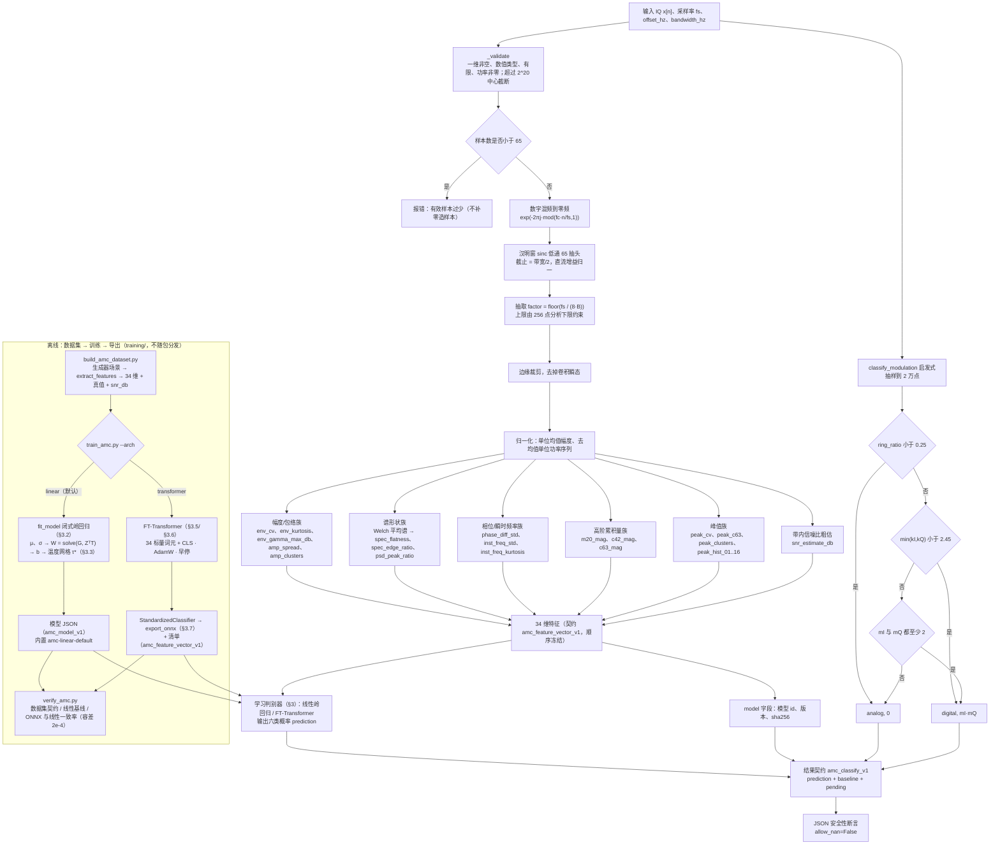

# 调制识别（特征通路：传统特征、启发式判定与判别器）算法设计

| 项目 | 取值 |
| --- | --- |
| 特征契约 | `amc_feature_vector_v1`（34 维，顺序冻结） |
| 特征实现 | `src/signal_analysis/algorithms/amc/features.py::extract_features` |
| 启发式判定 | `src/signal_analysis/algorithms/amc/heuristic.py::classify_modulation`，标识 `heuristic_digital_analog_v1` |
| 判别器标识 | `amc_linear_v1`（线性 JSON 模型，默认内置）/ `amc_onnx_v1`（ONNX 分类器，可为线性或 FT-Transformer） |
| 模型契约 | `amc_model_v1`（线性 JSON）/ `amc_feature_vector_v1`（ONNX 清单） |
| 判别器实现 | `src/signal_analysis/algorithms/amc/feature_model.py::fit_model` / `predict` / `onnx_scores` |
| 训练实现 | `training/amc_transformer.py`、`training/train_amc.py`（**不随 wheel 分发**） |
| 数据集与验收 | `training/build_amc_dataset.py`（34 维特征 + 真值）/ `training/verify_amc.py`（数据集契约 / 线性基线 / ONNX 一致性） |
| 内置模型 | id `amc-linear-default`，version `0.1.0`（随包分发的合成数据线性基线） |
| 类别字典 | FM、SSB、2ASK、QPSK、16QAM、64QAM（A09 六类） |
| 结果契约 | `amc_classify_v1` |
| 调用入口 | CLI `signal-analysis amc-classify`；GUI「调制识别」页；结果里的 `prediction`（学习判别器）与 `baseline`（启发式对照）字段 |
| 文档日期 | 2026-09-13（2026-10-05 重构：并入原〈AI 特征学习〉的特征通路内容） |

> **本文档 = 特征通路全貌：确定性 34 维特征 + 两类判决（人工启发式 + 学习判别器）。**
> 特征提取（§2.3–§2.8）**不是**神经网络——逐项有闭式定义、可复算、可人工判读；
> 判决层有两套：`classify_modulation` 规则树只回答"数字/模拟"（落进 `baseline` 字段，**永远不区分类别**），
> 学习判别器（线性岭回归 / FT-Transformer，§3）给出六类概率（落进 `prediction` 字段）。
> 线性基线与 Transformer 共用同一份特征、同一份数据集、同一条验证划分，
> 因此可以直接同口径对比——两者的差距就是"判别器的贡献"，不掺任何特征工程的差异。
>
> **注意术语**：这里的"传统/人工"只指**特征与启发式判据**；六类的最终输出
> （`prediction`）始终由 §3 的学习判别器给出，启发式输出**从不**被当作六类结论。
>
> **原始 IQ 时序通路（CNN/TCN）不在本文档**：那条通路不产出 34 维特征、也没有对应的人工判据
> （产品里对 IQ 结果**不显示**传统对照行，界面与报告按"不适用"呈现）；
> 它的设计、契约与可改进方向见[调制识别_AI特征学习](调制识别_AI特征学习.md)。
> 两条通路的前端（搬移零频、低通抽取）共用一份实现，但分析结果**不可同口径比较**（输入信息不同）。

实现分工：34 维特征与启发式判定分别位于 `algorithms/amc/features.py` 与 `algorithms/amc/heuristic.py`；中心裁剪、混频、低通、抽取与 SNR 粗估位于 `algorithms/dsp/preprocess.py`，由特征通路和原始 IQ 通路共用。模型训练、推理和结果组装在 `algorithms/amc/feature_model.py`。启发式直接处理 IQ，不消费 34 维向量。详细模块依赖与数值基线复核见[基础工程实现与文件说明](../基础工程实现与文件说明.md)的「数值模块与算法边界」。

---

## 1. 算法思路

### 1.1 四层结构

传统调制识别在工程上通常分两层，本项目把"判决"再拆成两套并存（一条通路、两个判决、一份特征）：

**第一层——裁剪与标准化（预处理）**
把"检测器给出的频带"搬移到零频，低通滤掉带外，再按带宽抽取到与带宽匹配的分析率。
这一步的目的只有一个：**让特征与符号速率、载频、采样率都解耦**，
否则同一个调制样式换个采样率就会得到完全不同的数字。

**第二层——物理特征（本项目的 34 维）**
按"信号长什么样"分四类描述：

| 族 | 物理表现 | 特征（按契约顺序） |
| --- | --- | --- |
| 幅度/包络 | AM/ASK 有幅度起伏，FM/PSK 恒包络 | `env_cv`、`env_kurtosis`、`env_gamma_max_db`、`amp_spread`、`amp_clusters` |
| 谱形状 | 单边带在频带中心表示下是矩形谱；多电平信号的谱边沿更"软" | `spec_flatness`、`spec_edge_ratio`、`psd_peak_ratio` |
| 相位/瞬时频率 | PSK 有离散相位台阶，FM 有连续相位游走 | `phase_diff_std`、`inst_freq_std`、`inst_freq_kurtosis` |
| 高阶累积量（星座几何） | 复对称性、幅度调制阶数、"六阶"对 16/64QAM 的区分能力 | `m20_mag`、`c42_mag`、`c63_mag` |
| 峰值（近似符号时刻） | 幅度模板的"台阶数"直接对应电平数 | `peak_cv`、`peak_c63`、`peak_clusters`、`peak_hist_01…16` |
| 可信度 | 供下游判断"这次结果能不能信" | `snr_estimate_db` |

**第三层——人工判据（启发式）**
`classify_modulation` 是一个**只回答"数字 / 模拟"和"星座规模粗略量级"** 的规则树，
设计目的是给 GUI 参数面板一个立即可用的判读，以及给 AMC 结果提供一个"传统对照"。
它**不是**六类分类器，也**不**声称能区分 16QAM 与 64QAM。

判定顺序（三条规则，命中即返回）：

1. **近恒包络 → 模拟。** 星座图呈环状（FM/FSK/CW）或密实圆盘（默认 AM）时，
   幅度变异系数 $\text{ring\_ratio}<0.25$ → `("analog", 0)`。
2. **I/Q 边缘分布低峰度 → 数字。** 离散电平结构（PSK/QAM/ASK）使边缘分布呈"平顶"，
   $\min(k_I,k_Q)<2.45$ → `("digital", estimate)`。
3. **两个边缘分布都多峰 → 数字**（例如带载波线的 OOK）→ `("digital", estimate)`。

三条都不命中（连续云状星座：噪声、SSB、OFDM 样信号）→ 落回 `("analog", 0)`。

**第四层——学习判别器（六类输出）**
34 维特征同时喂给学习判别器：默认**线性岭回归**（闭式解、确定性、秒级），
可选 **FT-Transformer**（ONNX 分类器）。它输出六类概率，才是结果里的 `prediction`。
两者与启发式共用同一份特征，因此可以同口径对比；线性模型需要的参数很少
（$34\times6$ 权重 + 6 偏置 + 68 个标准化参数），Transformer 也只有约 10 万级参数——
这不是"大模型"通路，而是给传统特征配一个便宜的学习判决头。细节见 §3。

### 1.2 两个判决，一个特征，一个结果契约

| | 启发式规则树 | 线性基线 | FT-Transformer |
| --- | --- | --- | --- |
| 算法标识 | `heuristic_digital_analog_v1` | `amc_linear_v1` | `amc_onnx_v1` |
| 输入 | 原始 IQ（抽样 ≤ 2 万点） | 34 维特征 | 34 维特征 |
| 输出 | `digital`/`analog` + 簇数粗估 | 六类概率 + logits + 最近质心 | 六类概率 |
| 结果字段 | `baseline` | `prediction` + `model` | `prediction` + `model` |
| 参数 | 无（阈值/规则） | $34\times6$ 权重 + 6 偏置 + 68 标准化参数 | 约 10 万级 |
| 拟合方式 | 人工阈值 | **闭式解**（岭回归，无迭代、无随机种子） | AdamW 迭代训练 |
| 定位 | 显示用对照，**不区分类别** | **默认路径 / 可复现基线 / 交付兜底** | 精度上限探索（可选，需训练） |

三者共用同一份 34 维特征（启发式除外——它直接吃 IQ）；
结果契约 `amc_classify_v1` 一次性把 `prediction`、`baseline`、`model` 都装进去（§5.9）。

### 1.3 为什么默认不让网络直接看 IQ

把原始 IQ 直接喂给深度网络（CNN/LSTM/ResNet）是 RadioML 路线的标准做法，本项目**默认没走这条路**，原因有三：

1. **数据量不够**。合成数据可以无限生成，但生成器只能覆盖它建模过的物理效应
   （本项目生成器：理想信道 + 白噪声 + RRC 成形），网络很容易学成"认生成器的指纹"，
   到真实数据上直接失效。34 维物理特征**先验更强、自由度更低**，小样本下更稳。
2. **可解释性与可复核**。任何一次判决都可以展开成 34 个物理量，与启发式判据、
   与文献里的累积量参考表逐项核对。端到端网络做不到这一点。
3. **与检测路径同构**。检测是"网络判决 + 物理测量"，识别是"网络判决 + 物理特征"，
   同一套工程范式（清单强校验、契约冻结、失败即报错）可以复用。

> **这三条是"默认路径选特征"的理由，不是"禁止用 IQ"。** 原始 IQ 通路已经做成
> **另一条显式通路**（CNN/TCN 端到端，见[调制识别_AI特征学习](调制识别_AI特征学习.md)）：
> 输入契约不同（34 维向量 vs `(2, N)` 波形）、类别字典由模型声明，
> 且**必须与自己的基线比**，不能与本文的 34 维特征通路直接比数字
> （输入信息不同，不是同一道题）。

### 1.4 为什么线性基线能到 0.82

34 维特征里已经包含了**强判别性**的量：

- `c63_mag` 直接把 QPSK(≈4) / 16QAM(≈2.1) / 64QAM(≈1.8) 拉开；
- `m20_mag` 把实信号（AM/2ASK）与其他分开；
- `spec_flatness` / `spec_edge_ratio` 把 SSB 的"盒状谱"识别出来；
- `amp_clusters` / `peak_clusters` / 16 桶模板给出电平数。

在这个特征空间里，六类**近似线性可分**（这也是文献里"累积量特征 + 线性判别"能做起来的
根本原因）。因此闭式岭回归就能给出宏平均 F1 0.8246 的基线；
Transformer 的增益空间主要在**低 SNR 与 16/64QAM 混淆**这两块。

---

## 2. 公式

### 2.1 预处理：混频、低通、抽取

输入序列 $x[n]$（长度 $N$，采样率 $f_s$），分析频带中心 $f_c$、带宽 $B$。

**（a）样本数护栏**

$$N\ \ge\ \texttt{LOWPASS\_TAPS}=65\qquad(\text{否则报错，不"补零造样本"})$$

$$N\ \le\ \texttt{MAX\_ANALYSIS\_SAMPLES}=2^{20}\quad(\text{超出则中心截断，保证确定性})$$

**（b）中心截断**（$N>2^{20}$ 时）：

$$n_0=\Big\lfloor\frac{N-2^{20}}{2}\Big\rfloor,\qquad x\leftarrow x[n_0:\,n_0+2^{20}]$$

**（c）数字混频到零频**（用 `mod` 避免大步长时的相位精度损失）：

$$\phi[n]=\mathrm{mod}\Big(\frac{f_c}{f_s}\,n,\ 1\Big),\qquad
x_{\text{bb}}[n]=x[n]\cdot e^{-j2\pi\phi[n]}$$

**（d）汉明窗 sinc 低通**（$L=65$ 抽头，截止 $\frac{B/2}{f_s}$ 归一化阻抗）：

$$c=\min\Big(\max\big(\tfrac{B}{2f_s},\ \tfrac{1}{L}\big),\ 0.5\Big)$$

$$h[k]=\frac{2c\cdot\mathrm{sinc}\big(2c\,(k-\tfrac{L-1}{2})\big)\cdot \mathrm{hamming}[k]}
{\sum_{i}2c\cdot\mathrm{sinc}\big(2c\,(i-\tfrac{L-1}{2})\big)\cdot\mathrm{hamming}[i]}$$

分母归一化使直流增益为 1（即"通带内幅度不变"）。

**（e）按带宽抽取**

$$x_{\text{filt}}[n]=(x_{\text{bb}}*h)[n]\quad(\texttt{mode="same"})$$

$$F=\Big\lfloor\frac{f_s}{8.0\cdot B}\Big\rfloor,\qquad
F\leftarrow\max\big(1,\ \min(F,\ \lfloor N_{\text{filt}}/256\rfloor)\big),\qquad
x_{\text{w}}[m]=x_{\text{filt}}[mF]$$

$$f_{\text{w}}=\frac{f_s}{F}\quad(\text{分析率})$$

> 常数 `8.0` 就是"**每单位占用带宽保留 8 个采样点**"这一约定（`SAMPLES_PER_BAND`），
> 它决定"每符号约多少点"的量级。**该常数必须与训练数据一致**，否则同一模型在
> 不同抽取比下的特征分布会整体漂移。
> `F` 的上限还保证至少留下 256 个分析点（`MIN_WORK_SAMPLES`）。

**（f）边缘裁剪**（去掉卷积瞬态）：

$$E=\min\Big(\Big\lfloor\frac{L/2}{F}\Big\rfloor+1,\ \Big\lfloor\frac{M}{10}\Big\rfloor\Big),\qquad
x_{\text{w}}\leftarrow x_{\text{w}}[E:\,M-E]\quad(\text{仅当 }M-2E\ge32)$$

### 2.2 归一化与派生量

$$P=\frac{1}{M}\sum_{m}\lvert x_{\text{w}}[m]\rvert^{2}\ (\text{平均功率}),\qquad
\text{mag}[m]=\frac{\lvert x_{\text{w}}[m]\rvert}{\sqrt P},\qquad
x_c[m]=\frac{x_{\text{w}}[m]-\overline{x_{\text{w}}}}{\sqrt P}$$

（$x_c$ 是"去均值 + 单位功率"序列，供累积量使用。）

$$P_{\text{dBFS}}=10\log_{10}P$$

### 2.3 幅度/包络特征（4 项）

$$\texttt{env\_cv}=\frac{\mathrm{std}(\text{mag})}{\overline{\text{mag}}}$$

令去均值包络 $e=\text{mag}-\overline{\text{mag}}$，与代码中的 `envelope` 对应：

$$\texttt{env\_kurtosis}=\frac{\mathbb{E}[e^4]}{\max(\mathbb{E}[e^2]^2,10^{-24})}-3\quad(\text{超额峰度})$$

**包络谱峰值**（对包络去均值后加 Hanning 窗做一次 FFT，取 ESID）：

$$\texttt{env\_gamma\_max\_db}=10\log_{10}\frac{\max_k\lvert E[k]\rvert^2}{\overline{\lvert E[k]\rvert^2}}$$

数字调制因符号速率会在包络谱上留下线谱，因此这一项对"数字 vs 模拟"有直接判别力。

$$\texttt{amp\_spread}=\frac{p_{90}(\text{mag})-p_{10}(\text{mag})}{p_{50}(\text{mag})},\qquad
\texttt{amp\_clusters}=\#\text{modes}\big(\text{hist}(\text{mag})\big)$$

`amp_clusters` 用 32 桶直方图、3 点平滑、阈值 $0.2\times$ 峰值、最小间隔 2 桶，
输出 1–8（`_histogram_modes`）。它就是"**幅度上有几个电平**"的直接读数。

### 2.4 谱形状特征（3 项，Welch 平均谱上统计）

Welch 参数：$\text{nfft}$ 从 64 起按 $4\times$ 倍增直到不超过 $\text{count}$ 且 $<2048$，
帧数上限 64，Hanning 窗，50% 重叠：

$$\text{nfft}=\max\Big(64,\ \min(2048,\ \text{nfft},\ M)\Big),\qquad
\texttt{hop}=\max(1,\text{nfft}/2)$$

$$S[k]=\frac{\sum_{j}\lvert \mathrm{FFT}(\text{seg}_j\cdot w)\rvert^2}
{\#\text{frames}\cdot f_{\text{w}}\sum_n w^2[n]}$$

只在**占用带内部**（$\lvert f\rvert\le B/2$，少于 4 根谱线则退化为全谱）统计：

$$\texttt{spec\_flatness}=\frac{\exp\!\big(\overline{\ln S[k]}\big)}{\overline{S[k]}}
\quad(\text{几何平均}/\text{算术平均}\in(0,1])$$

$$\texttt{psd\_peak\_ratio}=\frac{\max_k S[k]}{\overline{S[k]}}$$

$$\texttt{spec\_edge\_ratio}=\frac{\overline{S[k],\ \lvert f\rvert\in \text{最外 }10\%}}
{\overline{S[k],\ \lvert f\rvert\in \text{中间 }25\%\!-\!75\%}}$$

> 低通阻带会下溢到 0，因此**只统计带内谱线**；把阻带算进几何平均会把平坦度拉垮。
> `spec_flatness` 越低（谱越"不平"）、`edge_ratio` 越高（边沿越陡、越"盒状"），
> 越像单边带；多电平 QAM 的谱边沿更软（RRC 滚降）。

### 2.5 相位与瞬时频率特征（3 项）

相邻相位差（**缠绕到 $(-\pi,\pi]$**）：

$$\Delta[m]=\mathrm{wrap}\big(\angle x_{\text{w}}[m]-\angle x_{\text{w}}[m-1]\big),\qquad
\texttt{phase\_diff\_std}=\frac{\mathrm{std}(\Delta)}{\pi}$$

瞬时频率（以占用带宽为归一化单位）：

$$\texttt{inst}[m]=\frac{\Delta[m]\cdot f_{\text{w}}}{2\pi B},\qquad
\texttt{inst\_freq\_std}=\mathrm{std}(\texttt{inst})$$

$$\texttt{inst\_freq\_kurtosis}=\frac{\mathbb{E}[(\texttt{inst}-\bar{\texttt{inst}})^4]}
{\mathbb{E}[(\texttt{inst}-\bar{\texttt{inst}})^2]^2}-3$$

PSK/QAM 的相位跳变使瞬时频率呈冲击性 → 峰度高；FM 是连续游走 → 峰度低。

### 2.6 高阶累积量（3 项）

在 $x_c$（去均值、单位功率、复序列）上按矩定义累积量（**不引入 $1/\sqrt{\cdot}$ 的归一化分支**，
保持与"实信号/复信号"两种情形一致）：

$$\hat m_{20}=\mathbb{E}\big[x_c^2\big]\ \text{（复数）},\qquad
\hat m_{21}=\mathbb{E}\big[\lvert x_c\rvert^{2}\big],\qquad
\hat m_{42}=\mathbb{E}\big[\lvert x_c\rvert^{4}\big],\qquad
\hat m_{63}=\mathbb{E}\big[\lvert x_c\rvert^{6}\big]$$

$$\boxed{\ \texttt{m20\_mag}=\lvert \hat m_{20}\rvert\ }$$

$$\boxed{\ \texttt{c42\_mag}=\big\lvert \hat m_{42}-\lvert \hat m_{20}\rvert^{2}-2\hat m_{21}^{2}\big\rvert\ }$$

$$\boxed{\ \texttt{c63\_mag}=\big\lvert \hat m_{63}-9\,\hat m_{42}\hat m_{21}+12\,\hat m_{21}^{3}\big\rvert\ }$$

三者在代码注释里给出了**实测量级参考**（用于人工判读与回归）：

| 特征 | 典型值 | 含义 |
| --- | --- | --- |
| `m20_mag` | AM/2ASK 接近 1 | 实信号（复平面上分布在一条直线上）|
| `c42_mag` | 2ASK 高；QPSK ≈ 1；16/64QAM ≈ 0.6 | 幅度调制阶数 |
| `c63_mag` | QPSK ≈ 4；16QAM ≈ 2.1；64QAM ≈ 1.8 | 六阶累积量，区分 QAM 阶数 |

> **注意**：这几个参考值是**理想无 ISI** 下的理论近似。低 SNR 且带 RRC 成形时，
> ISI 会把 16QAM 与 64QAM 的 `c63_mag` 差别压到 2 倍以内（见 §7.2），
> 这正是线性判别最难的一段。

### 2.7 峰值样本特征（3 + 16 项）

**峰值样本**（近似符号时刻）：对 `mag` 做 3 点平滑，取局部极大值，最小间隔 5 个分析点。

$$\texttt{peak\_cv}=\frac{\mathrm{std}(\text{peak})}{\overline{\text{peak}}}$$

在单位功率、去均值的峰值序列 $\tilde p$ 上：

$$\texttt{peak\_c63}=\big\lvert \hat m_{63}-9\hat m_{42}\hat m_{21}+12\hat m_{21}^3\big\rvert
\quad(\tilde p)$$

$$\texttt{peak\_clusters}=\#\text{modes}\big(\text{hist}(\tilde p)\big)\quad(1\!-\!8)$$

**16 桶峰值幅度模板**（`_amplitude_template`）：以**99 分位幅度**为参照点（对噪声尖峰不敏感），
裁剪到 $[0,1.2]$，桶内计数除以总计数，得到**概率质量**（各桶之和为 1）：

$$\text{ref}=p_{99}(\text{peak}),\qquad
u_i=\mathrm{clip}\Big(\frac{\text{peak}_i}{\text{ref}},0,1.2\Big),\qquad
\texttt{peak\_hist\_}j=\frac{\#\{u\in \text{桶}j\}}{n}$$

$$\text{样本数}<8\ \Rightarrow\ \texttt{peak\_hist}=\frac{1}{16}\ \text{（均匀分布，对模型中立）}$$

> 设计意图很重要：**样本不足时给"均匀分布"而不是"某个默认形状"**，
> 避免把"没数据"伪装成"有证据"。

### 2.8 带内信噪比粗估（1 项）

取前 $2^{16}$ 个样本，加 Hanning 窗做一次 FFT：

$$\text{in}=\overline{\lvert X[k]\rvert^2}_{\,k\in\text{带内}},\qquad
\text{out}=\overline{\lvert X[k]\rvert^2}_{\,k\in\text{带外（含循环回绕处理）}}$$

$$\texttt{snr\_estimate\_db}=\begin{cases}
10\log_{10}\dfrac{\text{in}-\text{out}}{\text{out}}, & \text{in}>\text{out}\\[4pt]
0.0, & \text{in}\le\text{out}\\[4pt]
\text{null}, & \text{任一侧谱线}<4
\end{cases}$$

> 这是**工程粗估**（占用带内/外平均 PSD 之比），与检测路径的 `inband_snr_v1` 量纲一致
> 但估计方式不同（这里不做 $N_0B$ 折算、不做迭代本底）。结果里专门带一句
> `snr_note` 说明"仅用于可信度提示，不是验收口径"。`snr_estimate_db` 也作为第 34 维特征
> 进入模型，让线性判别能补偿各阶量随 SNR 的漂移。

### 2.9 启发式判定（`classify_modulation`）

先按 $\text{step}=\lceil N/20000\rceil$ 抽样到不超过 20000 点，再：

$$\text{ring\_ratio}=\frac{\mathrm{std}(\lvert x\rvert)}{\overline{\lvert x\rvert}}$$

$$\text{若 }\mathrm{std}(x_I)=0\ \wedge\ \mathrm{std}(x_Q)=0\ \Rightarrow\ \texttt{("analog",0)}$$

**规则 1：**

$$\text{ring\_ratio}<0.25\ \Rightarrow\ \texttt{("analog", 0)}$$

（近恒包络：FM/FSK/CW；以及默认 AM —— 其星座是密实圆盘。）

**边缘峰度**（对零均值序列）：

$$k(v)=\frac{\mathbb{E}[v^4]}{\mathbb{E}[v^2]^2},\qquad
k_I=\begin{cases}k(x_I),&\mathrm{std}(x_I)>10^{-12}\\ 99.0,&\text{否则}\end{cases}
\quad(\text{同理 }k_Q)$$

**边缘峰数** $m_I,m_Q$ 由 `_marginal_modes` 给出：以 $3\,\mathrm{std}$ 为半宽做 64 桶直方图 →
5 点滑动平滑 → 峰值需 $\ge 0.12\times$ 全局峰 → 两个候选峰之间必须存在低于
$0.75\times$ 较矮峰高度的谷才算"分离"。

$$\texttt{estimate}=\max\big(2,\ \min(m_I\,m_Q,\ 256)\big)$$

**规则 2：** $\min(k_I,k_Q)<2.45\ \Rightarrow\ \texttt{("digital", estimate)}$
（平顶边缘分布 = 离散电平。）

**规则 3：** $m_I\ge2\ \wedge\ m_Q\ge2\ \Rightarrow\ \texttt{("digital", estimate)}$

**否则：** $\texttt{("analog", 0)}$（连续云状：噪声、SSB、类 OFDM。）

### 2.10 结果字段

`amc_classify` 的结果键**恰好**为（代码里有 `assert set(result) == set(_RESULT_KEYS)` 兜底）：

```python
("contract", "algorithm", "classes", "labels", "features", "feature_contract",
 "band", "snr_estimate_db", "prediction", "baseline", "model", "pending")
```

并要求 `json.dumps(result, ensure_ascii=False, allow_nan=False)` 必须成功——
**任何 NaN/Inf 都会当场炸出来**，而不是流到报告里。

---

## 3. 判别器：线性岭回归与 FT-Transformer

> 本节 = 原《AI 特征学习》的**特征通路判别器**部分（2026-10-05 并入）。
> 两个判别器共用 §2 的同一份 34 维特征与同一份数据集划分，
> 因此"线性 vs Transformer"的差距可以干净地归因到判别函数本身。

### 3.1 标准化

线性基线（`fit_model`，$N$ 为样本数、$D=34$）：

$$\mu_d=\frac{1}{N}\sum_{i=1}^{N}x_{i,d},\qquad
\sigma_d=\max\Big(\mathrm{std}_d,\ \texttt{STANDARDIZE\_FLOOR}=10^{-2}\Big)$$

$$z_{i,d}=\frac{x_{i,d}-\mu_d}{\sigma_d}$$

> 下限 $10^{-2}$ 的作用：**近常量特征（例如空桶占满的 `peak_hist_*`）不被放大成噪声**。
> 同时 $z$ 的量级不随特征物理量纲变化，岭正则才对所有维度公平。

Transformer（`_standardizer`）用的是 $\sigma_d=\max(\mathrm{std}_d,10^{-3})$，
**下限不同**（$10^{-3}$ vs $10^{-2}$）——两个分支各自独立训练，
**不要假设它们的标准化参数一致**（这也是清单里 `standardize` 只作留档的原因）。

### 3.2 岭回归（闭式解）

把六类做成 one-hot 目标矩阵 $T\in\{0,1\}^{N\times C}$（$C=6$，顺序恒为
`AMC_CLASSES`）：$T_{i,c}=1$ 当且仅当第 $i$ 个样本属于第 $c$ 类。

$$\boxed{\ G=Z^{\!\top}Z+\lambda I_D,\qquad W=G^{-1}\big(Z^{\!\top}T\big)\ }$$

$$\boxed{\ b=\frac{1}{N}\sum_{i=1}^{N}\big(T_i-Z_iW\big)\ }$$

$\lambda=\texttt{DEFAULT\_L2}=10^{-3}$，$Z\in\mathbb{R}^{N\times D}$、$W\in\mathbb{R}^{D\times C}$、
$b\in\mathbb{R}^{C}$。代码用 `np.linalg.solve(G, ZᵀT)`（不解显式逆）。

> **为什么要岭正则**：34 维里有强共线的组（`spec_edge_ratio` 与 `psd_peak_ratio`、
> `amp_clusters` 与 `peak_clusters`、16 桶模板和为 1）。无正则时 $Z^\top Z$ 近奇异，
> 权重会爆到 $10^{3}$ 量级；$\lambda=10^{-3}$ 把它压到稳定区间，
> 且**不引入随机性**（同一个数据集必定得到同一组权重）。
> 偏置取"残差均值"而非直接求和，是为了让它在类别先验不平衡时仍居中。

### 3.3 判别与温度校准

$$z_i=\frac{x_i-\mu}{\sigma},\qquad \ell_i=z_iW+b,\qquad
p_i=\mathrm{softmax}\big(\tau\cdot \ell_i\big)$$

$$\text{softmax}(v)_c=\frac{e^{v_c-\max_j v_j}}{\sum_{k}e^{v_k-\max_j v_j}}$$

温度 $\tau$ 在**训练集**上按对数损失网格搜索（`_TEMPERATURE_GRID`）：

$$\tau^\star=\arg\min_{\tau\in\{0.5,1,2,3,4,6,8,12,16,24\}}
-\frac{1}{N}\sum_{i=1}^{N}\ln\max\big(p_{i,y_i}(\tau),\ 10^{-12}\big)$$

### 3.4 最小类质心（探索性）

$$z^{\text{centroid}}_c=\frac{1}{|\mathcal{C}_c|}\sum_{i\in\mathcal{C}_c}z_i,
\qquad
\texttt{nearest\_centroid}(x)=\arg\min_c\big\lVert z-z_c^{\text{centroid}}\big\rVert_2^2$$

质心**不是**判决依据（判决只用 $\ell$），只作为"这个样本离哪一类训练分布更近"的探索信息。

### 3.5 FT-Transformer 分类器

**（a）标量化分词元**：34 个特征各成一个"句子里的词"，第 $d$ 个特征的标量
$x_d\in\mathbb{R}$ 经

$$\text{token}_d=W_d\,x_d+b_d,\qquad W_d\in\mathbb{R}^{1\times d_{\text{model}}}$$

不再加特征位置编码（位置由 $W_d$ 本身承担），另加一个可学习的分类词元：

$$\text{CLS}\sim\mathcal{N}\big(0,\ 0.02^2\big)\ (\text{trunc\_normal})$$

**（b）pre-norm 编码器**（`norm_first=True`，$\ell=1,\dots,L$）：

$$\hat u^{\ell}=\mathrm{MHA}\big(\mathrm{LN}(u^{\ell-1})\big)+u^{\ell-1},\qquad
u^{\ell}=\mathrm{FFN}\big(\mathrm{LN}(\hat u^{\ell})\big)+\hat u^{\ell}$$

$$\mathrm{FFN}(v)=W_2\,\mathrm{gelu}\big(W_1v+b_1\big)+b_2$$

$$\mathrm{MHA}(V)=\mathrm{Concat}(\text{head}_1,\dots,\text{head}_H)W^O,\qquad
\text{head}_h=\mathrm{softmax}\Big(\frac{Q_hK_h^{\!\top}}{\sqrt{d_k}}\Big)V_h$$

超参：$d_{\text{model}}=64$、$H=4$（$d_k=16$）、$d_{ff}=4\,d_{\text{model}}=256$、
$L=2$、dropout 0.1。

**（c）分类头**：

$$\boxed{\ p=\mathrm{softmax}\Big(W_{\text{cls}}\,\mathrm{LN}(u^L_{\text{CLS}})+b_{\text{cls}}\Big)\ }$$

### 3.6 训练目标与超参（`train_classifier`）

$$\mathcal{L}=-\frac{1}{B}\sum_{i=1}^{B}\ln p_{i,y_i}
\quad(\text{CrossEntropyLoss})$$

| 超参 | 取值 |
| --- | --- |
| 优化器 | AdamW |
| 学习率 | $3\times10^{-3}$ |
| 权重衰减 | $10^{-4}$ |
| 学习率调度 | CosineAnnealingLR |
| 轮数 / 批大小 | 60 / 128 |
| 早停 | 验证损失 patience 12 |
| 随机种子 | 0（CLI `--seed`） |
| 结构 | `--d-model 64`、`--heads 4`、`--layers 2` |

### 3.7 导出与"标准化必须在图内"

导出时把标准化写成**图的一部分**（`StandardizedClassifier` 把 $\mu$、$\sigma$ 注册为 buffer）：

$$\text{ONNX}: \texttt{features}(N,34)\ \text{float32}
\ \longrightarrow\ \mathrm{Linear}\to\mathrm{softmax}\ \longrightarrow\
\texttt{scores}(N,6)\ \text{（概率）}$$

$$\text{scores}=\mathrm{softmax}\Big(W_{\text{cls}}\,\mathrm{LN}\big(\mathrm{enc}(\text{tokens})\big)\Big)
\quad\text{其中 tokens 由 } \frac{x-\mu}{\sigma}\ \text{生成（在图内）}$$

**关键约束**（`write_amc_manifest` 的 docstring 原文）：
> "模型必须位于清单目录内并使用相对路径；`standardize` 用于留档与核对，
> **真正的标准化必须已写入导出图**。"

因此 **`.onnx` 的输入 `features` 是"未标准化的原始 34 维特征"**；
Python 侧不做任何预处理（`onnx_scores` 只做 `np.asarray([feature_vector(features)], dtype=np.float32)`）。
opset 默认 17（`DEFAULT_ONNX_OPSET`）。

### 3.8 推理侧的鲁棒读取（`onnx_scores`）

$$\text{values}=\text{output}\ \text{（reshape 到 } -1\text{）},\qquad
\text{值域}\ge0\ \wedge\ \big|\textstyle\sum-1\big|<10^{-3}
\ \Rightarrow\ \text{直接当概率}$$

$$\text{否则}\ \Rightarrow\ p=\mathrm{softmax}(\text{values})$$

输出维度必须等于 6，否则报错。这一层判断是为了兼容"导出图里带了 softmax"与
"导出图输出 logits"两种常见情况，而**不改变契约**（对外永远是概率）。
可信度判定（`reliable`）与结果字段见 §5.9。

---

## 4. 流程图（端到端）



**流程阶段对照表**（与上图同一条链路，按"阶段 → 做什么 → 产物/字段 → 实现"展开）：

| 阶段 | 做什么 | 产物 / 字段 | 实现 |
| --- | --- | --- | --- |
| 1 数据生成 | 生成器按场景生成 IQ，**逐条**抽出 34 维特征与真值（特征与推理同源） | `amc_dataset.json` + `features.jsonl` | `training/build_amc_dataset.py` |
| 2 训练（默认） | 闭式岭回归 + 训练集温度网格校准（确定性、秒级） | 模型 JSON（`amc_model_v1`），内置 `amc-linear-default` | `training/train_amc.py`（默认 `--arch linear`） |
| 3 训练（可选） | FT-Transformer（AdamW + 交叉熵 + 早停），标准化写入导出图 | `amc_transformer.onnx` + 清单（`amc_feature_vector_v1`） | `training/train_amc.py --arch transformer` |
| 4 验收 | 数据集契约 / 线性基线 / ONNX 与线性判定一致率（容差 `2e-4`） | 退出码 0（通过）/ 1（失败）/ 2（缺 onnxruntime） | `training/verify_amc.py` |
| 5 推理 | 预处理 → 34 维特征 → 学习判别器 → `prediction` | 结果契约 `amc_classify_v1` | CLI `amc-classify`；GUI「调制识别」页 |
| 6 传统对照 | 规则树直接吃 IQ，抽样 ≤ 2 万点 | `baseline`（digital/analog + 簇数） | `algorithms/amc/heuristic.py` |

---

## 5. 输入与输出参数

### 5.1 函数签名

```python
extract_features(samples, sample_rate, offset_hz=0.0, bandwidth_hz=None) -> (features: dict, info: dict)
classify_modulation(samples, max_points=20000) -> (classification: str, cluster_estimate: int)
amc_classify(samples, sample_rate, config=None, model=None, threads=None) -> dict
```

| 参数 | 说明 |
| --- | --- |
| `samples` | 一维实/复数值数组；实数输入会被当复数处理（`imag = 0`） |
| `sample_rate` | 采样率（Hz） |
| `offset_hz` | 分析频带中心（基带偏移，Hz），默认 0 |
| `bandwidth_hz` | 分析频带带宽（Hz）。**`None` 表示整段采样带宽，且强制中心为 0、不做抽取** |
| `model` | `None` → 内置线性基线；dict → 内联模型；路径 → ONNX 清单或模型 JSON |
| `threads` | onnxruntime 线程数（仅清单模型有效） |

`config` 只接受两个键，出现其他键直接报错：`offset_hz`、`bandwidth_hz`。

### 5.2 特征列表（`amc_feature_vector_v1`，共 34 维，顺序即契约）

| # | 名称 | 说明 | 取值性质 |
| --- | --- | --- | --- |
| 1 | `env_cv` | 归一化包络变异系数 | $\ge0$，FM/PSK 低、AM/ASK 高 |
| 2 | `env_kurtosis` | 包络超额峰度 | 双电平最低 |
| 3 | `env_gamma_max_db` | 包络谱峰值（相对均值 dB） | 数字调制有线谱 |
| 4 | `spec_flatness` | 带内谱平坦度（几何/算术均值比） | $(0,1]$ |
| 5 | `spec_edge_ratio` | 最外 10% / 中间 50% 功率比 | $\ge0$ |
| 6 | `psd_peak_ratio` | 峰均比 | $\ge1$ |
| 7 | `inst_freq_std` | 归一化瞬时频率标准差 | $\ge0$ |
| 8 | `inst_freq_kurtosis` | 瞬时频率超额峰度 | PSK/QAM 高 |
| 9 | `phase_diff_std` | 相邻相位差标准差 $/\pi$ | $[0,\approx1]$ |
| 10 | `m20_mag` | $\lvert\hat m_{20}\rvert$ | AM/2ASK 接近 1 |
| 11 | `c42_mag` | $\lvert\hat C_{42}\rvert$ | 2ASK 高、QPSK ≈1、QAM ≈0.6 |
| 12 | `c63_mag` | $\lvert\hat C_{63}\rvert$ | QPSK ≈4、16QAM ≈2.1、64QAM ≈1.8 |
| 13 | `amp_spread` | $(p_{90}-p_{10})/p_{50}$ | $\ge0$ |
| 14 | `amp_clusters` | 全样本幅度直方图峰数 | 整数 1–8 |
| 15 | `peak_cv` | 峰值幅度变异系数 | $\ge0$ |
| 16 | `peak_c63` | 峰值序列的 $\lvert\hat C_{63}\rvert$ | 电平数敏感 |
| 17 | `peak_clusters` | 峰值幅度直方图峰数 | 整数 1–8 |
| 18–33 | `peak_hist_01` … `peak_hist_16` | 16 桶峰值幅度模板（概率密度，和为 1） | $\ge0$，$\sum=1$ |
| 34 | `snr_estimate_db` | 带内信噪比粗估（dB） | 数值，粗估；无法估计时**特征填 60.0 哨兵、`info` 填 `None`** |

> **特征比模型更稳定**：改特征顺序或含义即换代（`_validate_model` 会逐项比对），
> 因此契约名带版本号 `_v1`。加特征属于破坏性变更。

### 5.3 `info`（结果里的 `band` 字段）

| 键 | 说明 |
| --- | --- |
| `center_hz` / `bandwidth_hz` | 实际使用的分析频带（`bandwidth_hz=None` 时为采样带宽且中心为 0） |
| `sample_rate_hz` | 输入采样率 |
| `analysis_rate_hz` | 抽取后的分析率 $f_{\text{w}}$ |
| `decimation` | 抽取比 $F$ |
| `sample_count` / `analysis_samples` | 输入点数 / 参与特征计算的分析点数 |
| `peak_samples` | 检测到的峰值（近似符号时刻）样本数 |
| `power_dbfs` | 分析段平均功率（dB） |
| `snr_estimate_db` | 带内信噪比粗估（`null` 表示无法估计） |

### 5.4 线性模型 JSON（`amc_model_v1`）字段

| 字段 | 说明 |
| --- | --- |
| `contract` | `"amc_model_v1"` |
| `feature_contract` | `"amc_feature_vector_v1"` |
| `schema_version` | 1 |
| `classes` / `labels` | 六类顺序 / 中文标签 |
| `features` | 34 个特征名，**顺序必须与 `AMC_FEATURES` 完全一致**，否则 `_validate_model` 报错 |
| `l2` | 岭系数 |
| `temperature` | 校准后的温度 $\tau^\star$ |
| `standardize.mean` / `standardize.scale` | 各 34 个数；`scale > 0` 且全部有限 |
| `weights` | $34\times6$ 嵌套数组，有限 |
| `bias` | 长度 6，有限 |
| `centroids` | 六类质心（标准化空间，34 维） |
| `training.samples` / `support` | 样本总数 / 逐类支撑数 |
| `training.accuracy_in_sample` | **训练集内**准确率（不是泛化指标） |
| `training.confusion_in_sample` | 训练集内混淆矩阵 $6\times6$ |
| `training.snr_db.min` / `.max` | 训练集 SNR 实际覆盖范围 |
| `training.note` | 固定提示："in-sample 指标仅用于自检；正式指标须用独立验证集（evaluate_model）" |
| `training.provenance` | 训练脚本追加的来源信息（可选） |

### 5.5 ONNX 分类器清单（`amc_feature_vector_v1`）字段

| 字段 | 约束（`read_amc_manifest` 强校验） |
| --- | --- |
| `schema_version` | 必须为 1 |
| `task` | `"amc"` |
| `contract` | 必须为 `amc_feature_vector_v1` |
| `runtime` | 必须为 `onnxruntime` |
| `runtime_min_version` | 默认 `1.17`；运行时版本更低则拒绝 |
| `id` / `version` | 非空文本 |
| `sha256` | 64 位十六进制，且与 `library` 实际摘要**必须一致** |
| `library` | **清单目录内的相对路径**；绝对路径/越界/缺失/空文件均报错 |
| `opset` | 整数（默认 17） |
| `input.name` / `input.size` | 输入节点名（默认 `features`）/ 必须为 34 |
| `output.name` / `output.classes` | 输出节点名（默认 `scores`）/ **必须与六类字典一致** |
| `features` | **必须与 `AMC_FEATURES` 逐项一致** |
| `standardize.mean` / `.scale` | 各 34 个有限数 |
| `standardize.note` | 固定："标准化应已写入导出图；此处仅留档核对" |
| `training` | 训练元信息 |
| `manifest.notes` | 说明 |
| 文件大小 | 清单 $\le$ 64 KiB |

### 5.6 训练与验收接口

| 对象 | 说明 |
| --- | --- |
| `fit_model(records, *, l2=1e-3, provenance=None) -> dict` | `records` 为 `{"features": dict, "label": str, "snr_db": float\|None}` 序列；**至少覆盖两个类别**；标签必须在六类字典内，否则报错 |
| `build_amc_dataset.py` | `--output --per-class 400 --seed 0 --rate 2e5 --duration-range --snr-range(-5,30) --min-bandwidth-ratio 0.05 --max-bandwidth-ratio 0.30 --guard-ratio 0.02 --center-jitter 0.05 --bandwidth-jitter 0.10 --power-dbfs -6 --train-fraction 0.8 --modes` |
| `train_amc.py` | `--data --output --arch {linear,transformer} --l2 --min-snr --seed --epochs --batch-size --d-model --heads --layers --learning-rate --onnx-dir` |
| `train_classifier(...)` | 传入已划分好的 `train_x/train_y/val_x/val_y` 与 `classes`，返回训练好的 `StandardizedClassifier` |
| `export_onnx(model, path, *, standardize, feature_count, classes, opset=17)` | 导出**自带标准化**的 `.onnx` |
| `write_amc_manifest(output, model, *, classes, features, standardize, identifier, version, opset, input_name, output_name, training, notes)` | 返回 `(manifest, library_path)`；**模型必须在清单目录内** |
| `verify_amc.py` | `--data --model --manifest --limit 200 --threads --json` |

```bash
# 1) 数据集（每类 400 共 2400 条，约 1 分钟）
.venv/bin/python training/build_amc_dataset.py --output training/data/amc --per-class 400 --seed 11
# 2) 线性基线（默认，确定性、秒级）
.venv/bin/python training/train_amc.py --data training/data/amc
# 3) 可选：FT-Transformer + ONNX（需要 pip install -e ".[train]"）
.venv/bin/python training/train_amc.py --data training/data/amc --arch transformer \
    --epochs 30 --output training/runs/amc/model.json --onnx-dir training/runs/amc
# 4) 验收：数据集契约 + 线性基线 +（有清单时）ONNX 与线性模型一致率
#    清单实际文件名是 amc_onnx.json（不要照抄成 amc.json）
.venv/bin/python training/verify_amc.py --data training/data/amc \
    --manifest training/runs/amc/amc_onnx.json
```

### 5.7 推理入口与模型选择

```python
amc_classify(samples, sample_rate, config=None, model=None, threads=None) -> dict
```

| `config` 键 | 说明 |
| --- | --- |
| `offset_hz` | 分析频带中心（Hz），默认 0 |
| `bandwidth_hz` | 分析频带带宽（Hz），`None` 表示整段采样带宽 |

**其他任何键都会报错**（`_resolve_config`：`AMC 配置不支持以下字段：…`）。

| `model` 取值 | `algorithm` | `model.source` |
| --- | --- | --- |
| `None` | `amc_linear_v1` | `builtin`（内置 `amc_default.json`） |
| dict（内联模型） | `amc_linear_v1` | `inline`（或 dict 里的 `source`） |
| 线性模型 JSON 路径 | `amc_linear_v1` | `file` |
| ONNX 清单路径（`contract == amc_feature_vector_v1`） | `amc_onnx_v1` | `onnx` |

其中 `model` 在 ONNX 分支额外带 `simplify` 后的 `sha256` 与实际清单路径。

CLI：`signal-analysis amc-classify <asset_id> [--model PATH] [--offset-hz HZ] [--bandwidth-hz HZ] [--threads N]`。
**`amc-classify` 没有 `--report` 参数**（报表走 `export RUN_ID PATH`）。
GUI：「调制识别」页可手填分析中心/带宽，或先用"信号检测"跑一次再点"取用检测结果频带"；
默认模型缺失时页面提示先用 `train_amc.py` 生成，不影响传统检测路径。

### 5.8 评测输出（`evaluate_model`）

| 键 | 说明 |
| --- | --- |
| `confusion` | $6\times6$ 混淆矩阵 |
| `per_class` | 逐类 precision / recall / f1（真值与预测里都不出现的类，F1 为 `null` 且**不拉低宏平均**） |
| `accuracy` | 总体准确率 |
| `macro_f1` | 宏平均 F1 |
| `per_snr` | 按 5 dB 分桶的准确率，键形如 `"+5~+10 dB"` |
| `model_id` | 模型 id（便于报告里标注"这行数字来自哪个模型"） |

### 5.9 结果契约 `amc_classify_v1`（12 个键，**恰好**）

| 键 | 类型 | 说明 |
| --- | --- | --- |
| `contract` | str | `"amc_classify_v1"` |
| `algorithm` | str | 线性/JSON 模型 → `"amc_linear_v1"`；ONNX 清单 → `"amc_onnx_v1"` |
| `classes` | list[str] | 恒为 A09 六类顺序 `["fm","ssb","ask2","qpsk","qam16","qam64"]` |
| `labels` | dict | 类名 → 中文标签（FM 调频 / SSB 单边带 / 2ASK 幅度键控 / QPSK 四相键控 / 16QAM / 64QAM） |
| `features` | dict | 34 维特征（§5.2） |
| `feature_contract` | str | `"amc_feature_vector_v1"` |
| `band` | dict | §5.3 |
| `snr_estimate_db` | float / null | 与特征第 34 维同源 |
| `prediction` | dict | 见下 |
| `baseline` | dict | 传统启发式对照，见下 |
| `model` | dict | 模型元信息，见下 |
| `pending` | list[str] | **尚未确认项**（恒含"识别准确率的合格门限尚未确认"） |

**`prediction`**

| 键 | 说明 |
| --- | --- |
| `label` | 预测类别（`fm` … `qam64`） |
| `label_text` | 中文标签 |
| `confidence` | 最高类概率 |
| `margin` | 最高类与次高类概率之差（单类模型时为 `null`） |
| `scores` | 六类概率字典（和约为 1） |
| `logits` | 判别函数原始输出（JSON 模型时给出） |
| `nearest_centroid` | 最近训练类质心（JSON 模型时给出，探索性信息） |
| `reliable` | 是否可信（见下） |
| `reason` | 判为不可信的原因（可信时为 `null`） |
| `snr_note` | 固定说明："带内信噪比按占用带内/外平均功率谱密度之比粗估，仅用于可信度提示，不是验收口径" |

**`reliable` 判定规则（按顺序）**

| 条件 | `reliable` | `reason` |
| --- | --- | --- |
| `snr_db is None` | `True` | "带内信噪比无法估计…未做低信噪比标注" |
| `snr_db < 5.0` dB | `False` | "粗略估计的带内信噪比 X dB 低于 5 dB，识别结果仅供参考" |
| `confidence < 0.5` | `False` | "最高类概率仅 X.XX，类别区分度不足" |
| 其他 | `True` | `null` |

**`baseline`**

| 键 | 说明 |
| --- | --- |
| `algorithm` | 恒为 `"heuristic_digital_analog_v1"` |
| `classification` | `"digital"` / `"analog"`（启发式抛错时为 `null`） |
| `cluster_estimate` | 星座规模粗略量级（`m_I\cdot m_Q`，上限 256） |
| `note` | 固定说明"传统启发式只给出数字/模拟与簇数估计，不区分类别"，或异常原因 |

**`model`**

| 键 | 说明 |
| --- | --- |
| `id` / `version` | 默认 `amc-linear-default` / `0.1.0` |
| `source` | `"builtin"` / `"inline"` / `"file"` / `"onnx"` |
| `model_path` | JSON 模型的实际路径（`null` 表示内联） |
| `sha256` | 模型文件摘要 |
| `accuracy_in_sample` | 训练集内准确率（**不是**泛化指标，见 §7.1） |

### 5.10 真值来源与统计口径

| 对象 | 说明 |
| --- | --- |
| 真值来源 | 生成器的 `mode` **本身就是类别名**；`mode_to_class` 只认六类，其余返回 `None` |
| 只在单信号资产上比对 | `services/truth.py::_attach_amc_truth` |
| 六类之外 | `am` 与两种跳频样式（`fh_rc`、`fh_video`）**不映射到任何类别**，按"**不适用**"计入统计，**不丢样本、不静默跳过** |
| 指标函数 | `evaluation.classification_metrics`（混淆矩阵、逐类 P/R/F1、总体准确率、宏平均 F1）；某一类在真值与预测里**都不出现**时其 F1 为 `null` 且**不拉低宏平均** |

---

### 5.11 结果里的 `pending`（**必须原样出现**）

```
"识别准确率的合格门限尚未确认（技术方案待确认项）"
"AMC 使用单信号频带特征，多信号重叠场景需先由检测切分"
```

GUI、CLI、HTML 报表的每一个 AMC 结果都会带上这两条，**不允许在展示层丢掉**。

---

## 6. 实测指标（内置线性基线，合成数据验证集 480 条）

| 指标 | 数值 |
| --- | --- |
| 总体准确率 / 宏平均 F1 | 0.8250 / 0.8246 |
| 每类 F1 | FM 0.954 · SSB 0.888 · 2ASK 0.982 · QPSK 0.835 · 16QAM 0.608 · 64QAM 0.682 |
| 分档准确率 | −5~0 dB 0.444 · 0~5 dB 0.662 · 5~10 dB 0.793 · 10~15 dB 0.970 · 15~20 dB 0.967 · 20 dB 以上 1.000 |

**老实说的话**：9～10 dB 以上可用（≥0.97），低信噪比下主要错误是 **16QAM ↔ 64QAM**（16QAM 有 26/80
被判成 64QAM）以及 QPSK 被判成 QAM；原因是低 SNR 下 RRC 成形带来的 ISI 把 16/64QAM 的 `C63` 差别
压到 2 倍以内，而线性判别只能给一个全局超平面。可选 **Transformer + ONNX** 支线就是为改善这一段准备的
（逐特征 token + CLS token）。

**数字全部来自合成数据自评**（`build_amc_dataset.py --per-class 800 --seed 11` 分层验证集），
**没有真实采集数据、没有 SDR 实测**；报告必须按 SNR 分档、按调制样式分列，
避免单一总分掩盖 16/64QAM 这个真问题。

> 识别准确率的**合格门限仍是技术方案的待确认项**：本页所有数字都只描述
> 这个分布下的表现，不构成验收结论。GUI / CLI / 报表里的每一个识别结果都带着这条提示。

---

## 7. 设计局限

### 7.1 判定与统计口径

1. **启发式只回答"数字/模拟"，不区分类别。**
   `classify_modulation` 的输出是 `("digital"|"analog", cluster_estimate)`，
   它**永远**无法区分 16QAM 与 64QAM。结果里的 `baseline.note` 明确写着这一点，
   目的是防止用户把"数字"当成"识别成功"。

2. **合格门限未确认，所以不给"通过/不通过"。**
   所有数字**只描述**各自数据集划分下的表现（特征通路：`build_amc_dataset.py --seed 11`），
   **不构成验收结论**。`pending` 字段逐条列出尚未确认项，GUI / CLI / 报表里每一个识别结果
   都带着这条提示。

3. **`accuracy_in_sample` 与验证集准确率是两个数，绝不可混用。**
   内置模型 `training.accuracy_in_sample = 0.851042`，验证集 0.8250。
   前者是**训练集内**、且**掺了温度校准**（温度就是在同一批数据上选的）的数字，
   只有自检价值；模型对象里 `training.note` 已写死这一点。

4. **`am` 与跳频样式不在字典内。**
   `mode_to_class` 对 `am`、`fh_rc`、`fh_video` 返回 `None`。它们按"**不适用**"计入统计，
   不参与准确率分母，也**不当作识别错误**。这是刻意设计（跳频是"一段会话一个实例"的检测对象，
   `am` 只作为数据库示例），但意味着**准确率只覆盖六类**。

5. **只用单信号频带特征。**
   多信号重叠时，频带内混叠会同时污染所有特征族。结果 `pending` 里明确写着
   "AMC 使用单信号频带特征，多信号重叠场景需先由检测切分"。

6. **前置特征提取的误差会原样传入。**
   `bandwidth_hz` 给不准 → 抽取比 $F$ 不准 → 16 桶模板与 `amp_clusters` 失真
   → 判别器偏离训练分布。结果里**没有**"输入特征是否可信"的标志
   （只有 `snr_estimate_db` 这一个粗估），因此"检测给错频带"这件事在识别侧是静默的。

### 7.2 特征与低 SNR

7. **低 SNR 下 16QAM/64QAM 的 `c63_mag` 区别被压掉。**
   仓库内实测（每类 800 个合成场景、分层验证集）：总体准确率 **0.8250**、宏平均 F1 **0.8246**；
   ≥10 dB 时 ≥0.97；−5～0 dB 降到 **0.444**、0～5 dB **0.662**、5～10 dB **0.793**。
   逐类 F1：FM 0.954 / SSB 0.888 / 2ASK 0.982 / QPSK 0.835 / **16QAM 0.608 / 64QAM 0.682**。
   主要误差是 **16QAM ↔ 64QAM**（16QAM 有 26/80 被判成 64QAM）以及低 SNR 下 QPSK 被判成 QAM。
   原因是带 RRC 成形的 ISI 把两者的 `c63_mag` 差别压到 2 倍以内，
   而**线性判别只能给一个全局超平面**。

8. **`snr_estimate_db` 是粗估，不是验收口径；它既是特征也是提示，语义重叠。**
   它不做 $N_0B$ 折算、不做迭代本底估计，只比"带内/带外平均 PSD"。
   作为第 34 维参与判别（让模型补偿各阶量随 SNR 的漂移），同时用于 `reliable` 判定。
   无定义时**特征里填 60.0 哨兵值、`info` 里填 `None`** → 可信度判定走"无法估计"分支
   判为 `reliable = True`——这是刻意的宽松选择，但意味着高噪声下若占用带几乎覆盖采样带宽，
   结果仍会被标为可靠。

9. **`m20/c42/c63` 的参考量级是理想条件下的近似。**
   代码注释里的"2ASK 高 / QPSK ≈1 / QAM ≈0.6"这类数字来自无 ISI、相干接收、功率已知的
   理想情形；真实信道上受 ISI、频偏、IQ 不平衡、相位噪声影响会整体漂移。
   当前实现**不做频偏补偿、不做 IQ 不平衡校正、不做信道均衡**。

10. **幅度模板对"每符号采样点数"敏感。**
    `SAMPLES_PER_BAND = 8.0` 是硬约定。若上游给的带宽严重偏大（例如把 AM 的能量占用带
    当作消息带宽），抽取比 $F$ 会偏小、`amp_clusters` 与 16 桶模板都会失真。
    这是"检测误差传导到识别"的具体路径，结果里**没有**"带宽可信度"这一标志。

11. **`peak_*` 系列特征依赖峰值检测的启发式参数**（3 点平滑、最小间隔 5）。
    符号速率很低或很高、或存在强噪声尖峰时，峰值位置会偏移；
    峰值数量少时模板退化为均匀分布（这是设计上的"中立"，但也意味着**信息量下降**）。

12. **实数输入的语义边界。**
    实数 IQ（`imag == 0`）会被当复数处理，此时 `m20_mag` 会趋近 1（复平面上退化成一条线）。
    这恰好是 AM/2ASK 的判别依据，但**对"真实带通采样得到的实数序列"是错误语义**——
    调用方需要自己先做希尔伯特变换或正交下变频。结果里没有"输入是实数"的标志位。

### 7.3 判别器

13. **温度校准是 in-sample 的，不是标定。**
    `_calibrate_temperature` 在训练集上网格搜索最小化平均对数损失。
    正确做法是**在独立验证集上做温度标定**（或保序回归，文献 [40][42]）；
    当前实现只能压一压过度自信的倾向，**不能**把 `confidence` 解释为概率。

14. **线性判别只有一个全局超平面。**
    $W$ 是 $34\times6$ 的常数矩阵，无法表达"低 SNR 时用规则 A、高 SNR 时用规则 B"。
    实际数据里 `c63_mag` 的判据随 SNR 漂移（这也是把 `snr_estimate_db` 塞进第 34 维的原因），
    线性模型只能用"折中斜率"处理，这直接反映在 16QAM/64QAM 的 F1 上。

15. **Transformer 在 34 维上极易过拟合。**
    约 10 万参数配 34 维输入、每类几百到几千样本，必须靠早停 + dropout + 权重衰减兜住；
    文献 [28] 明确指出这类表格数据上深度模型往往不如树模型。
    当前配置（$L=2$、$d=64$、patience 12）是为"小数据能训起来"选的保守配置，
    数据量上去以后需要重新调。

### 7.4 部署与验证

16. **标准化"只写在图内"是留档式的，无法强校验。**
    唯一保证是"导出图里已经带标准化"（`StandardizedClassifier` 的 buffer）。
    清单里的 `standardize` 只是**留档**，`read_amc_manifest` 只校验它有 34 个有限数，
    **无法验证**它是否真的等于图内参数。`onnx_scores` 直接把**未标准化**的特征喂进图，
    所以如果导出时漏了 `StandardizedClassifier` 包装，模型照样能跑，
    只是精度会莫名其妙地差。**这是本分支最危险的失效模式**，只能靠
    `verify_amc.py` 的端到端比对发现。

17. **`verify_amc.py` 只验证契约，不验证精度。**
    它检查数据集卡与特征契约、特征顺序、线性模型形状、ONNX 清单自洽性、
    ONNX 与线性模型在有限样本上的一致性（容差 `2e-4`，`--limit 200`）。
    它**不**回答"这个模型够不够用"。

18. **ONNX 分支需要额外依赖。**
    `onnxruntime`（`pip install .[ml]`）缺失时：GUI 控件禁用并提示安装方式、
    CLI 以错误码 2 退出，**不回退、不猜**。传统/线性路径完全不受影响。

19. **无真实采集数据验证。**
    所有数字都来自本项目生成器（理想信道、白噪声、无多径、无频偏、无 IQ 不平衡）。
    没有在 SDR 实测或标准数据集上验证过；也没有在 Windows / 麒麟上验证过冻结产物。

---

## 8. 可以改进的地方与相关文献

### 8.1 补上缺失的参数估计（收益最直接）

| 缺什么 | 怎么补 | 文献 |
| --- | --- | --- |
| 符号速率 $R_s$ | 循环平稳 $\alpha$-profile 峰值，或包络谱线谱位置 | Gardner 1991 [13]；Ciblat 2002 [15] |
| 滚降系数 $\alpha$ | 对 PSD 边沿做 RRC 模板拟合 | Proakis [25]；Rice [26] |
| 载波频偏 | 非数据辅助（NDA）频偏估计：$M$ 次方法 / 相位差法 | Ciblat 2002 [15] |
| IQ 不平衡 | 基于循环平稳的镜像抑制比估计与校正 | -- |

补上 $R_s$ 后可以把"每符号点数"从常量 8.0 变成**实际测量值**，
让 `amp_clusters`、16 桶模板、`inst_freq_*` 都落在一致的尺度上。

### 8.2 特征侧：循环谱与特征扩展（性价比通常高于换判别器）

循环平稳特征对**平稳噪声免疫**（噪声在非零循环频率上无能量），因此在低 SNR 下通常优于
基于单次功率谱的特征：

- Gardner, W. A., Napolitano, A., Paura, L. *Cyclostationarity: half a century of research.* Signal Processing **86**(4), 2006 [14]；
- Dobre 2009 的循环平稳检测-分类联合框架 [10]；
- **循环累积量**对 QAM 阶数更敏感，可显著改善 16/64QAM 这一段。

其余可选动作：

- **恢复 34 维之外的物理量**：符号速率、滚降系数、循环谱特征——Gardner 1991 [13]；Dobre 2007 [9]。
  加特征属于契约破坏性变更，需要 `amc_feature_vector_v2` 并重训两个判别器分支；
- **特征增强**：把 `c42/c63` 改成"多个子段上的中位数"以降低方差
  —— Rousseeuw & Croux 1993 *Alternatives to the median absolute deviation.*
  JASA **88**(424):1273–1283；
- **特征选择/降维**：34 → 15–20 维可显著降低过拟合 —— Guyon & Elisseeff 2003 [39]；
  LDA / PCA 白化也是对线性判别友好的预处理 —— Hastie 2009 [38]。

### 8.3 判别器侧

先做"对标与标定"（成本最低、收益最直接）：

1. **独立验证集上做温度标定/保序回归**，替换当前 in-sample 校准 —— Guo 2017 [40]、Zadrozny & Elkan 2002 [42]；
2. **先把树模型跑成第三基线**（随机森林 / LightGBM），
   因为文献 [28] 预测它在 34 维上很可能优于线性与 Transformer；
   如果真是这样，"上 Transformer"的意义需要重新论证；
3. **报告必须分档**：按 SNR 桶（`per_snr` 已有）、按调制样式、按目标数分列，
   避免单一总分掩盖 16/64QAM 这个真问题。

| 方向 | 具体做法 | 文献 |
| --- | --- | --- |
| 树集成 | LightGBM / XGBoost + 特征重要性审计 | Friedman 2001 [43]、Chen & Guestrin *XGBoost.* KDD 2016 |
| 核方法 | RBF-SVM + 概率输出 | Cortes & Vapnik 1995 [19]、Platt 1999 [41] |
| 集成 | 线性 + 树 + Transformer 软投票/堆叠 | Wolpert, D. *Stacked generalization.* Neural Networks **5**(2):241–259, 1992 |
| 蒸馏 | Transformer → 线性/树，保留精度、丢掉依赖 | Hinton 2015 [44] |
| 深度但更省 | TabNet / 1D-CNN 替代全 Transformer；MLP + 特征交互（DCN-V2） | Arik & Pfister *TabNet.* AAAI 2021；Wang, R. et al. *DCN V2.* WWW 2021 |
| 不确定性 | MC dropout / 深度集成给"不知道" | Gal & Ghahramani *Dropout as a Bayesian approximation.* ICML 2016；Lakshminarayanan et al. *Simple and scalable predictive uncertainty estimation using deep ensembles.* NeurIPS 2017 |

### 8.4 提升鲁棒性的预处理

- **盲均衡 / 恒模算法（CMA）**去除 ISI：Godard, D. *Self-recovering equalization and carrier tracking in two-dimensional data communication systems.* IEEE Trans. Commun. **28**(11):1867–1875, 1980；
- **多普勒/频偏跟踪**：数字锁相环（DPLL）或 Kay 的相位差估计器 —— Kay, S. M. *A fast and accurate single frequency estimator.* IEEE Trans. ASSP **37**(12):1987–1990, 1989；
- **去相位噪声**：基于相位谱线宽度的估计与前馈校正。

### 8.5 数据与验收规范

- 参考量级：每类 400 条可跑通链路（约 1 分钟）；要有意义的模型建议**每类数千到上万条**，
  并覆盖每个 SNR 档位（`build_amc_dataset.py --per-class --snr-range --seed`）；
- **建立固定验证集**（seed 固定、写进数据集卡），禁止用训练集数字对外；
  **分层划分**必须按类（已实现），并按 SNR 分档报告（`evaluate_model` 已按 5 dB 分桶给出 `per_snr`）；
- 指标口径对齐 `evaluation.classification_metrics`（宏平均 F1、缺失类不拉低宏平均），
  但**注意"不适用"样本必须单列**——把它们算进分母会系统性低估准确率；
- 引入**真实采集数据**做独立验证集，与合成数据结果**分列报告**；
- 置信度**标定之后**再谈阈值：当前 `reliable` 里的 `confidence < 0.5`
  与 `snr < 5 dB` 都是工程经验值，没有 ROC/PR 曲线支撑。

### 8.6 标定与领域自适应

- 用少量实测数据做**特征分布漂移检测**（对抗验证 / 密度比估计）
  —— Rabanser, S. et al. *Failing loudly: an empirical study of methods for detecting dataset shift.* NeurIPS, 2019；
- 用**保序回归或 Platt scaling** 把 `confidence` 变成可比概率
  —— Platt, J. *Probabilistic outputs for support vector machines.* Advances in Large Margin Classifiers, 1999；[41][42]；
- **领域自适应**：少量实测数据微调
  —— Ganin et al. *Domain-adversarial training of neural networks.* JMLR 2016；
  Sun & Saenko *Deep CORAL.* ECCV Workshops 2016；
- **少样本/自监督**：Snell et al. *Prototypical networks.* NeurIPS 2017；
  Chen et al. *SimCLR.* ICML 2020（在特征向量上做对比学习是低成本选项）。

### 8.7 部署

- **INT8 量化** ONNX 分类器（Jacob 2018 [45]），并用 `verify_amc.py --manifest`
  的端到端比对卡住数值漂移；
- **多模型版本共存**：`model.id` + `version` + `sha256` 已经进了结果与清单，
  报表里可以标注"这一行来自哪个模型"，便于 A/B；
- **把线性基线的 weights 纳入审计**：它是可读的 $34\times6$ 矩阵，
  可以做逐类权重分析和漂移检测（新数据的特征均值 vs `standardize.mean`）
  —— 文献 [28] 关于表格数据可解释性的讨论。

---

## 9. 当前相关参考文献

**调制识别经典特征集**

1. Azzouz, E. E., Nandi, A. K. *Automatic identification of digital modulations.* Signal Processing **47**(1):55–69, 1995. —— 本项目包络/瞬时频率统计特征的源头。
2. Azzouz, E. E., Nandi, A. K. *Automatic Modulation Recognition of Communication Signals.* Kluwer Academic, 1996. —— 系统化的"模拟/数字"判定树与特征集。
3. Nandi, A. K., Azzouz, E. E. *Algorithms for automatic modulation recognition of communication signals.* IEEE Trans. Commun. **46**(4):431–436, 1998.
4. Nandi, A. K., Azzouz, E. E. *Automatic analogue modulation recognition.* Signal Processing **46**(2):211–222, 1995.

**高阶累积量与矩**

5. Swami, A., Sadler, B. M. *Hierarchical digital modulation classification using cumulants.* IEEE Trans. Commun. **48**(3):416–429, 2000. —— $C_{40}/C_{42}/C_{63}$ 判别表的经典来源。
6. Reichert, J. *Automatic classification of communication signals using higher order statistics.* IEEE ICASSP, 1992.
7. Mendel, J. M. *Tutorial on higher-order statistics (spectra) in signal processing and system theory.* Proc. IEEE **79**(3):278–305, 1991.
8. Nikias, C. L., Petropulu, A. P. *Higher-Order Spectra Analysis: A Nonlinear Signal Processing Framework.* Prentice Hall, 1993.
9. Dobre, O. A., Abdi, A., Bar-Ness, Y., Su, W. *Survey of automatic modulation classification techniques: classical approaches and new trends.* IET Communications **1**(2):137–156, 2007. —— 综述（含累积量方法的复杂度与鲁棒性讨论）。
10. Dobre, O. A., Rajan, S., Inkol, R. *Joint signal detection and classification based on first-order cyclostationarity for cognitive radios.* Springer, 2009. —— 循环平稳特征。

**小波与谱形状特征**

11. Ho, K. C., Prokopiw, W., Chan, Y. T. *Modulation identification of digital signals by the wavelet transform.* IEE Proc. Radar Sonar Navig. **147**(4):169–176, 2000.
12. Prakasam, P., Madheswaran, M. *Digital modulation identification model using wavelet transform and statistical parameters.* J. Comput. Syst. Netw. Commun., 2008.

**循环平稳与符号速率估计**

13. Gardner, W. A. *Exploitation of spectral redundancy in cyclostationary signals.* IEEE Signal Process. Mag. **8**(2):14–36, 1991.
14. Gardner, W. A., Napolitano, A., Paura, L. *Cyclostationarity: half a century of research.* Signal Processing **86**(4):639–697, 2006.
15. Ciblat, P., Loubaton, P., Serpedin, E., Giannakis, G. B. *Performance analysis of blind carrier frequency offset estimators for noncircular transmissions through frequency-selective channels.* IEEE Trans. Signal Process. **50**(1):130–140, 2002.

**星座图与聚类方法**

16. Mobasseri, B. G. *Digital modulation classification using constellation shape.* Signal Processing **80**(2):251–277, 2000.
17. Boudreau, D., Dubois, C., Patenaude, F. *A fast automatic modulation recognition algorithm and its implementation in a software radio.* IEEE MILCOM, 2000.

**判决树与统计学习对照**

18. Breiman, L., Friedman, J., Olshen, R., Stone, C. *Classification and Regression Trees.* Wadsworth, 1984. —— 判决树的经典形式（本项目的启发式就是一棵极浅的树）。
19. Cortes, C., Vapnik, V. *Support-vector networks.* Machine Learning **20**(3):273–297, 1995.
20. Ho, T. K. *The random subspace method for constructing decision forests.* IEEE TPAMI **20**(8):832–844, 1998.

**窗函数与谱估计（谱形状特征的基础）**

21. Harris, F. J. *On the use of windows for harmonic analysis with the discrete Fourier transform.* Proc. IEEE **66**(1):51–83, 1978.
22. Welch, P. D. *The use of fast Fourier transform for the estimation of power spectra.* IEEE Trans. Audio Electroacoust. **15**(2):70–73, 1967.

**相位去缠绕与瞬时频率**

23. Itoh, K. *Analysis of the phase unwrapping problem.* Applied Optics **21**(14):2470, 1982.
24. Boashash, B. *Estimating and interpreting the instantaneous frequency of a signal — Part 1/2.* Proc. IEEE **80**(4):520–538 / 540–568, 1992.

**数字通信基础（ISI 与 RRC）**

25. Proakis, J. G., Salehi, M. *Digital Communications.* 5th ed., McGraw-Hill, 2008.
26. Rice, M. *Digital Communications: A Discrete-Time Approach.* Prentice Hall, 2009.

**类别字典与统计口径的甲方依据**

27. 本项目 `docs/电磁信号分析识别系统_Python技术方案.md` §4.8 —— A09 六类字典与"**不适用必须计数**"的原始要求。

**判别器、表格数据与概率校准（2026-10-05 并入）**

28. Grinsztajn, L., Oyallon, E., Varoquaux, G. *Why do tree-based models still outperform deep learning on typical tabular data?* NeurIPS Datasets & Benchmarks, 2022. —— 34 维表格数据上"树模型常常优于深度模型"的方法论依据。
29. Gorishniy, Y., Rubachev, I., Khrulkov, V., Babenko, A. *Revisiting deep learning models for tabular data (FT-Transformer).* NeurIPS, 2021. —— §3.5 的直接依据：每个数值特征一个标量词元 + CLS 词元。
30. Vaswani, A. et al. *Attention is all you need.* NeurIPS, 2017. —— 编码器/多头注意力。
31. Devlin, J., Chang, M.-W., Lee, K., Toutanova, K. *BERT.* NAACL, 2019. —— CLS 词元用法的来源。
32. Dosovitskiy, A. et al. *An image is worth 16×16 words (ViT).* ICLR, 2021. —— 另一个"标量化 + Transformer"的范式参照。
33. Xiong, R. et al. *On layer normalization in the transformer architecture (Pre-LN).* ICML, 2020. —— `norm_first=True` 的依据（训练更稳，可省 warmup）。
34. Loshchilov, I., Hutter, F. *Decoupled weight decay regularization (AdamW).* ICLR, 2019.
35. Loshchilov, I., Hutter, F. *SGDR: stochastic gradient descent with warm restarts.* ICLR, 2017. —— CosineAnnealingLR。
36. Hendrycks, D., Gimpel, K. *Gaussian error linear units (GELUs).* arXiv:1606.08415, 2016.
37. Hoerl, A. E., Kennard, R. W. *Ridge regression: biased estimation for nonorthogonal problems.* Technometrics **12**(1):55–67, 1970. —— §3.2 岭回归原始文献。
38. Hastie, T., Tibshirani, R., Friedman, J. *The Elements of Statistical Learning.* 2nd ed., Springer, 2009. —— 岭回归与 LDA 的系统论述。
39. Guyon, I., Elisseeff, A. *An introduction to variable and feature selection.* JMLR **3**:1157–1182, 2003.
40. Guo, C., Pleiss, G., Sun, Y., Weinberger, K. Q. *On calibration of modern neural networks.* ICML, 2017. —— Transformer 分支置信度未标定的直接依据。
41. Platt, J. *Probabilistic outputs for support vector machines and comparisons to regularized likelihood methods.* Advances in Large Margin Classifiers, 1999.
42. Zadrozny, B., Elkan, C. *Transforming classifier scores into accurate multiclass probability estimates.* KDD, 2002. —— 面向多类的保序回归/温度标定。
43. Friedman, J. H. *Greedy function approximation: a gradient boosting machine.* Ann. Statist. **29**(5):1189–1232, 2001.
44. Hinton, G., Vinyals, O., Dean, J. *Distilling the knowledge in a neural network.* NeurIPS Workshop, 2015. —— 把 Transformer 蒸馏回线性模型是后续可选项。
45. Jacob, B. et al. *Quantization and training of neural networks for efficient integer-arithmetic-only inference.* CVPR, 2018. —— INT8 量化部署。
46. ONNX Runtime documentation, Microsoft, 2024. —— 会话、线程数、算子集。
