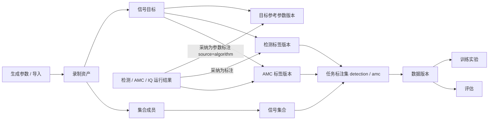

# 信号集合与标注统一方案

日期：2026-10-01。

> 说明：本文是阶段性中间稿，设计已转出到[数据库设计](数据库设计.md)（数据模型）、[基础工程实现与文件说明](基础工程实现与文件说明.md)（模块与页面）、[模型训练工作台](模型训练工作台.md)（生成、清单与训练）与[电磁信号分析识别系统_Python技术方案](电磁信号分析识别系统_Python技术方案.md)（接口与页面语义）。如与其他文档冲突，以转出后的文档为准。

## 1. 约束与取舍

| 编号 | 约束 | 对设计的影响 |
| --- | --- | --- |
| C1 | 当前单人标注，无审核环节，支持重新标注 | 标注追加式版本化：重新标注产生新版本，旧版本保留，数据版本固定所用版本；不做多人协作、状态流转、审核 |
| C2 | 一个资产可属于多个集合 | 集合成员为多对多关系；标注不挂在集合成员上，避免同一资产在不同集合出现不同“真值” |
| C3 | 需要跳频逐跳精确评估 | 目标必须带采样点级时间范围和父子关系；逐跳与会话两种粒度分开评估 |
| C4 | 训练数据超过 2 万条 | 不能“一样本一文件、一资产一行”；需要分片存储、游标分页和按需派生 |
| C5 | “信号识别”指时频图检测，AMC 指通信制式识别 | 两类任务的标签格式、类别字典、数据版本独立 |
| C6 | 每个信号的元数据分别标识检测与 AMC 格式 | 信号目标上有任务适用标记，标签在任务专用表中分别存放 |
| C7 | 用项目生成器和 TorchSig 准备数据时可输入参数并保证多样性 | 引入“生成参数”（界面是表单，内部是不可变配方 JSON），参数可配置、可复现、可统计覆盖度 |

设计上明确排除（本期不做）：

- 覆盖式写入或“结论只留最新一条”：无法固定训练所用的标注版本；改为追加式版本 + 数据版本引用版本号。
- 逐字段 `field_meta_json`：只保留版本级别的 `source`（来源）。
- 多人审核、冲突裁决、标注分配、协作与服务端：单人标注下不需要（§4.1）。
- `storage_kind=recipe`（只存配方、按需重建）：依赖生成器版本长期稳定且无法逐位复现；`assets` 只存真实 IQ（§3.1）。

## 2. 核心概念

| 对象 | 说明 |
| --- | --- |
| 录制资产 `assets` | 一段不可变 IQ 记录，可在独立 NPY 或分片文件中。**训练样本不等于资产** |
| 信号目标 `targets` | 录制内一个信号：整条记录、跳频会话、单跳或片段。稳定身份，不含可变字段 |
| 目标参考参数 `target_versions` | 目标的物理参数（频率、带宽、时间、SNR 等）的追加式版本 |
| 信号集合 `collections` | 资产的逻辑分组，多对多，不复制 IQ |
| 任务标注集 `task_sets` | 集合 × 任务（`detection` 或 `amc`）× 类别字典。同一集合可同时有两个 |
| 检测标签 / AMC 标签 | 各自一张表，各自追加式版本化 |
| 数据版本 `dataset_versions` | 固定成员、标签版本、划分、预处理的不可变清单 |
| 生成参数（内部配方 `gen_recipe_v1`） | `recipes` | 数据生成的参数分布、随机种子、分层配额，可复现 |
| 评估 `evaluations` | 绑定数据版本和模型的评估结果 |



## 3. 存储设计

### 3.1 录制资产与分片（C4）

`assets` 保留现有九列，不改旧 ID 和路径，新增：

| 字段 | 说明 |
| --- | --- |
| `source_kind` | `imported / generated / derived / legacy` |
| `sample_kind`、`dtype` | 复数或实数、存储类型 |
| `storage_kind` | `file`（独立 NPY，现状）或 `shard`（分片内偏移） |
| `shard_id`、`shard_offset`、`shard_length` | `storage_kind=shard` 时的定位（单位：采样点） |
| `origin_group_id` | 同一次采集或同一生成场景的分组键，用于划分防泄漏 |
| `parent_asset_id` | 裁剪、变换得到的衍生资产的直接父资产 |
| `rf_center_hz`、`capture_started_at` | 采集射频调谐中心、实际采集时间，未知可空 |
| `created_by`、`updated_at`、`archived_at` | 审计与逻辑归档 |

新增 `asset_shards(id, path, sha256, record_count, size_bytes, sealed_at)`：

- 批量生成或批量导入写入分片（连续的 complex64 原始数据，读取时用内存映射定位），封存后不可变；单分片内可含多条录制，读取按偏移定位。
- 每个资产仍有自己的 `sha256`，分片另有整体哈希。
- 少量文件（默认阈值 20 个文件，可在导入页调整）写独立 NPY，便于人工检查与单条拷贝；达到阈值自动写分片，导入页也可强制独立/强制分片。
- 小文件数量：按每分片 1000 条计，10 万条只需约 100 个分片文件，避免 10 万个小文件。
- 单分片目标大小（如 1 GB）的滚动切分、文件夹大批次（>500）的分块提交列为导入页第二步（§7.1）。

容量估算（只是公式，非实测）：复数 IQ 每采样点 8 字节。默认检测生成参数下，1 MHz × 0.2～0.5 s 的单条录制约 1.6～4 MB；`build_torchsig.py` 默认单条 262144 点约 2 MB。2 万条约 32～80 GB。AMC 窗口 1024 点 × 2 通道 float32 约 8 KB，2 万条约 160 MB。因此：

- **AMC**：保存录制（或配方），训练窗口在构建数据版本时派生，不入 `assets`。
- **检测**：现有 `build_dataset.py` 把每张 1024×1024 float32 图落成 `images/*.npy`（约 4 MB/张），2 万张约 80 GB。图像是 IQ 与预处理参数的确定性函数，因此数据版本里图像只作可选缓存，默认训练时按需渲染。是否改为 uint8 缓存会改变训练输入量化，属于契约变更，需单独验证后再启用，本方案不默认启用。

可选的 `storage_kind=recipe`（只存配方与种子，按需重建）**首期不做**：它依赖生成器版本长期稳定，且无法保证与旧数据逐位一致。

### 3.2 集合（C2）

```sql
CREATE TABLE collections (
    id TEXT PRIMARY KEY, name TEXT NOT NULL UNIQUE, description TEXT NOT NULL DEFAULT '',
    source_kind TEXT NOT NULL,          -- manual | generated | imported | legacy
    recipe_id TEXT,                     -- 生成集合关联的配方
    created_by TEXT, created_at TEXT NOT NULL, updated_at TEXT NOT NULL, archived_at TEXT
);
CREATE TABLE collection_members (
    collection_id TEXT NOT NULL REFERENCES collections(id),
    asset_id TEXT NOT NULL REFERENCES assets(id),
    position INTEGER NOT NULL, added_by TEXT, added_at TEXT NOT NULL,
    PRIMARY KEY (collection_id, asset_id)
);
CREATE INDEX idx_members_asset ON collection_members(asset_id, collection_id);
CREATE INDEX idx_members_order ON collection_members(collection_id, position);
```

- 标注挂在资产的目标上，集合只是成员关系；同一资产在多个集合里共享同一份标注，不会出现两份不一致的真值。
- 任务标注集按集合划定“哪些资产参与该任务”，并决定使用哪个类别字典。
- “零散资产”定义为不在任何未归档集合中的资产，用查询表达。
- 从集合移出只删除成员行；永久删除资产是独立操作，需检查其他集合、标注、数据版本与运行的引用。

### 3.3 信号目标（C3）

```sql
CREATE TABLE targets (
    id TEXT PRIMARY KEY, asset_id TEXT NOT NULL REFERENCES assets(id),
    target_key TEXT NOT NULL,           -- 资产内稳定键，如 s0、s0.h3
    scope TEXT NOT NULL,                -- whole_record | session | hop | segment
    parent_target_id TEXT REFERENCES targets(id),   -- hop 指向 session
    hop_index INTEGER,                  -- hop 在会话内序号（从 0 起）
    created_at TEXT NOT NULL,
    UNIQUE (asset_id, target_key)
);
```

`target_versions`（追加式，只增不改）：

| 字段 | 说明 |
| --- | --- |
| `id, target_id, version_no, supersedes_id` | 版本链 |
| `source, created_at, note` | `source` ∈ `generator / import / manual / external / algorithm`；目标的当前参数取最大 `version_no` |
| `sample_start, sample_end` | 半开区间 `[start, end)`，单位采样点，可空（整条记录） |
| `f_low_hz, f_high_hz` | 相对基带零点的占用频带，可为负；`center_hz`、`bandwidth_hz` 存边界派生值并校验一致 |
| `nominal_center_hz, nominal_bandwidth_hz` | 生成器或发射配置中的名义值，与实测占用分开 |
| `signal_type, waveform_mode` | 上层属性与生成样式（如 `fh_rc`）；不强行等同于 AMC 类别 |
| `modulation` | 规范调制名，未知为 `NULL` |
| `symbol_rate_baud, hop_rate_hz, is_hopping` | 符号率、跳速、是否跳频（`NULL` 表示未知） |
| `snr_db, snr_definition, power_dbfs` | 口径默认 `inband_snr_v1`；功率为数字满刻度 |
| `params_json` | 样式专有参数（滚降、调制指数、跳频点表等） |

约束：未知一律为 `NULL`，不使用 0 代替；`modulation=NULL` 是“尚未知晓”，与“字典之外”不同。

逐跳信息：跳频会话一行 `scope=session`，每跳一行 `scope=hop`，带 `parent_target_id` 与 `hop_index`。每跳的 `sample_start/end`、`f_low/f_high` 来自生成器的跳频调度（现有数据集 `samples.jsonl` 的 `hops` 字段已有逐跳真值）；实采数据需人工或外部元数据给出，缺失时只能评估会话级。

目标与参考参数的生成规则：

- **生成资产**：存储层按生成摘要一次写全会话目标与参考参数（`source=generator`）；真值行与 `signal_truth`/`hop_truth` 同源，跳频样式同时写 `scope=hop` 的逐跳目标。
- **导入资产**：目标来自导入页或 CSV 标注清单的显式目标行（`source=import`，目标行必须给出调制，仅登记 AMC）；未声明目标的资产保持“待标注”，不自动建占位目标（占位目标只用于 §9 的旧库回填）。
- **算法结论**：由“采纳为参数标注”以 `source=algorithm` 追加新版本，不覆盖既有版本（§4.2）。

### 3.4 检测标签与 AMC 标签（C5、C6）

每个目标有两个适用标记，分别声明该目标是否参与对应任务：

```sql
ALTER TABLE targets ADD COLUMN for_detection INTEGER NOT NULL DEFAULT 0;  -- 参与检测标注
ALTER TABLE targets ADD COLUMN for_amc       INTEGER NOT NULL DEFAULT 0;  -- 参与 AMC 标注
```

适用标记的置位规则：

- **生成**：会话/整条目标写 `for_detection=1`；`for_amc=1` 当生成样式有规范调制名（跳频样式为 0）。
- **导入**：仅登记 AMC——`for_amc=1` 当且仅当给出调制，`for_detection` 恒为 0（检测标注由检测页“采纳为参数标注”或逐跳标注产生）。调制为自由文本，A09 六类之外的规范名（如 AM、2FSK）同样保留，AMC 侧记 `out_of_taxonomy`。
- **旧库回填的未知占位目标**：两个标记置 1，物理参数全 `NULL`。
- 重新标注后需要改变适用标记时，用 `update_target_flags` 补开或关闭。

两类标签的格式不同，分表存放，均追加式版本化：

```sql
CREATE TABLE task_sets (
    id TEXT PRIMARY KEY, collection_id TEXT NOT NULL REFERENCES collections(id),
    task TEXT NOT NULL CHECK (task IN ('detection','amc')),
    name TEXT NOT NULL, taxonomy_id TEXT NOT NULL REFERENCES taxonomies(id),
    label_semantics TEXT,               -- 仅检测：session_v1 | per_hop_v1
    created_by TEXT, created_at TEXT NOT NULL,
    UNIQUE (collection_id, task, name)
);

CREATE TABLE taxonomies (
    id TEXT PRIMARY KEY, task TEXT NOT NULL, name TEXT NOT NULL, version TEXT NOT NULL,
    classes_json TEXT NOT NULL,         -- 有序类别表（顺序即模型输出下标）
    mapping_json TEXT,                  -- 外部类名映射，如 TorchSig → 项目类别
    UNIQUE (task, name, version)
);

CREATE TABLE detection_labels (
    id TEXT PRIMARY KEY, task_set_id TEXT NOT NULL REFERENCES task_sets(id),
    target_id TEXT NOT NULL REFERENCES targets(id),
    revision_no INTEGER NOT NULL, supersedes_id TEXT,
    source TEXT NOT NULL,               -- generator | manual | external | algorithm
    created_at TEXT NOT NULL,
    label_semantics TEXT NOT NULL,      -- session_v1 | per_hop_v1（与 task_sets 一致）
    class_name TEXT,                    -- 检测类别，当前为 emitter
    target_version_id TEXT NOT NULL REFERENCES target_versions(id),  -- 框范围取自该参数版本
    include INTEGER NOT NULL DEFAULT 1, -- 0 表示该目标明确不作为检测目标
    note TEXT,
    UNIQUE (task_set_id, target_id, revision_no)
);

CREATE TABLE amc_labels (
    id TEXT PRIMARY KEY, task_set_id TEXT NOT NULL REFERENCES task_sets(id),
    target_id TEXT NOT NULL REFERENCES targets(id),
    revision_no INTEGER NOT NULL, supersedes_id TEXT,
    source TEXT NOT NULL,               -- generator | manual | external | algorithm
    created_at TEXT NOT NULL,
    class_name TEXT,                    -- 字典内类别
    class_state TEXT NOT NULL,          -- known | unknown | out_of_taxonomy
    window_start INTEGER, window_end INTEGER,          -- 提取范围（采样点），空则用目标范围
    analysis_center_hz REAL, analysis_bandwidth_hz REAL, -- 空则用目标参数
    target_version_id TEXT NOT NULL REFERENCES target_versions(id),
    note TEXT,
    UNIQUE (task_set_id, target_id, revision_no)
);
```

说明：

- **检测标签不存归一化框坐标**。框由目标的物理范围经项目唯一的 `band_to_box` 生成，随图像参数（`nfft`、图像尺寸）不同而不同，在构建数据版本时计算；与 `ingest_torchsig.py` 的做法一致（不使用外部 `yolo_label`）。
- **AMC 标签保存提取范围**。多目标录制按目标的时间与频率范围提取 IQ 窗口，一个混合 IQ 不会得到一个单类标签。
- **AMC 类别字典固定为 A09 六类**：FM、SSB、2ASK、QPSK、16QAM、64QAM。`taxonomies` 仍保留版本字段，但本期不扩展类别；字典之外的信号记为 `out_of_taxonomy`。
- **当前标签**：同一任务标注集内，每个目标取最大 `revision_no` 的版本。重新标注即追加新版本，不修改旧行。
- 纯噪声录制：在检测任务里通过“完整覆盖且无目标”表达，见 §4.3。

### 3.5 其他表

| 表 | 关键字段 | 说明 |
| --- | --- | --- |
| `recipes` | `id, name, engine, recipe_json, recipe_sha256, created_by, created_at` | 生成参数（内部配方），不可变；修改即新建（见 §6） |
| `dataset_versions` | `id, task_set_id, version_no, manifest_path, manifest_sha256, status, sample_count, asset_count, split_json, preprocessing_json, taxonomy_snapshot_json, created_at` | 训练/评估所用的不可变清单；`ready` 后才可训练 |
| `experiments` | `id, task, dataset_version_id, config_json, status, output_path, model_sha256, created_at, finished_at` | 为现有实验目录建索引，权重仍在文件系统 |
| `evaluations` | `id, dataset_version_id, experiment_id, model_sha256, contract, config_json, metrics_json, result_path, created_at` | 逐项结果放 `result_path` 文件，避免大表 |
| `coverage_cache` | `collection_id, recipe_id, axis, bin, count` | 覆盖度统计缓存（可重建） |

### 3.6 索引与分页（C4）

- 资产列表：`(created_at, id)`；集合内 `(collection_id, position, asset_id)`。
- 深页浏览使用键集分页（以上一页最后一行的排序键为起点），页码跳转用偏移分页。500 条每页、数万条集合两者都可行；后续若数据量再大，优先换键集分页。
- 统计：所有统计在全体筛选结果上用聚合 SQL 计算，不依赖当前页。目标表上为 `modulation`、`waveform_mode`、`snr_db`、`bandwidth_hz` 建索引。
- 批量写入按批提交（每批数百条），不逐条事务。

## 4. 单人标注与重新标注（C1）

### 4.1 并发模型

当前只有一人标注，数据库放本机，开启 WAL、短事务即可。标注表追加式、ID 使用 UUID，这两点不依赖协作规模；将来若需要多人，可以在此基础上增加作者、审核与合并，不必推翻表结构。

### 4.2 重新标注规则

1. 没有草稿、提交、审核状态。保存即生效，同一目标在同一任务标注集内的最新 `revision_no` 为当前标签。
2. 重新标注 = 追加新版本，`supersedes_id` 指向上一版本，旧版本不修改、不删除，可查看与回退（回退也是追加一个内容相同的新版本）。
3. 数据版本固定其构建时使用的版本号，之后的重新标注不影响已有数据版本与实验；界面提示“标注已变更，数据版本可能过期”。
4. 算法结论、模型预测不写入标签表，保存在 `runs`/`evaluations`。界面上的“采纳为参数标注”（`adoption.py`）只追加 `source=algorithm` 的目标参考参数版本与标签，不覆盖任何既有版本：
   - 检测结果：会话级框归并到该资产的会话/整条目标，逐跳框归并到对应 `hop` 子目标；同一资产同类目标只更新一次，新建目标只发生在没有可匹配目标时；
   - AMC/IQ 结果：按 A09 字典映射为 `known`，字典外记 `out_of_taxonomy` 并保留原始标签名；
   - 采纳产生的版本成为该目标的当前参数与当前标注，之后的检测/AMC/IQ 比较与真值评分自动跟随新版本（§5.1）。
5. 目标参考参数（`target_versions`）同样追加式：重新标注时若修改了频带或时间范围，先追加新的参数版本，标签再引用它。

### 4.3 未知、负样本与覆盖

- 资产刚导入、没有任何标签：状态“待标注”，不能当负样本。
- 录制完整检查过、确认无目标：检测任务下记一条 `coverage=complete` 的“空标注”记录。为此在 `task_sets` 下增加 `asset_coverage(task_set_id, asset_id, coverage, negative_kind, source, created_at)`（追加式，取最新一条）；`coverage` ∈ `unknown / partial / complete`，`negative_kind` 仅当 `complete` 且无目标时有效。
- 数据版本只纳入 `coverage=complete` 的录制用于检测训练；`partial` 的录制不能用于漏检统计。

## 5. 逐跳精确评估（C3）

### 5.1 真值来源

| 数据 | 逐跳真值 | 说明 |
| --- | --- | --- |
| 项目生成器 | 有（跳频调度） | 由生成参数（内部配方）与样本种子确定，采样点级 |
| TorchSig | **无** | `ingest_torchsig.py` 已明确 TorchSig 没有跳频族，`--labels hop` 直接报错 |
| 实采导入 | 人工标注 | 在检测标注页逐跳标注（见 §7.4）；未做逐跳标注的录制只能做会话级评估，并在结果里标明 |

真值读取口径（所有任务一致）：

- 真值优先读目标的当前参考参数版本：会话/整条/片段目标 → 会话级真值，`scope=hop` 目标 → 逐跳真值；没有可用参数时才退化为生成器摘要。
- 生成资产的会话与逐跳目标由生成摘要一次写全，与摘要真值逐位一致，因此两条路径结果相同；重新标注（含采纳）后比较与评分随当前版本变化。
- 导入的实采数据以显式目标行或逐跳人工标注为准；无参数的目标在评估中直接跳过，不猜测。

### 5.2 评估契约 `per_hop_eval_v1`

保持 `session_v1` 与 `per_hop_v1` 分开，评估结果中注明粒度，不混评。

1. **匹配**：预测的每一跳与真值的每一跳做一对一匹配（匈牙利算法），代价用时间-频率 IoU。匹配门限、时间容差、频率容差作为配置随评估保存。
2. **容差下限不能低于分析分辨率**：时间分辨率由 STFT 的 `nfft` 与步长决定，频率分辨率由采样率与 `nfft` 决定。评估结果记录这两个值，容差小于分辨率时给出警告。
3. **指标**：
   - 跳检测：Precision、Recall、F1、漏检跳数、多检跳数；
   - 时间：每跳起止时刻误差、驻留时长误差、换频切换段处理说明；
   - 频率：每跳中心频率误差、带宽误差；
   - 会话：跳数误差、跳速误差（跳/秒）、频点集合一致率；
   - 序列：跳频图案（频道序号序列）的一致率，用最长公共子序列或编辑距离给出，未知频道表不计。
4. **分组报表**：按 SNR 档、跳速档、带宽档分组，报告总数、可评数、跳过数及原因。
5. **不可比较**：真值无逐跳信息、预测粒度为会话级、录制 `coverage` 不足，均列出原因，不计入分母。

需要在实现前用现有生成器回测确定默认容差；本文不预设数值。

## 6. 训练数据生成与多样性（C7）

### 6.1 现有脚本已支持的参数

| 脚本 | 用途 | 已有可调参数 |
| --- | --- | --- |
| [training/build_dataset.py](../training/build_dataset.py) | 检测数据（项目生成器） | `--count --seed --rate --rate-range --duration-range --modes --max-signals --snr-range --snr-bias --noise-only-ratio --guard-hz --min-gap-hz --min-bandwidth-ratio --max-bandwidth-ratio --cfo-ratio --hop-rate-range --labels(session/hop) --nfft --image-size --dynamic-range --train-fraction` |
| [training/build_iq_dataset.py](../training/build_iq_dataset.py)、[build_amc_dataset.py](../training/build_amc_dataset.py) | AMC 数据（IQ 窗口、特征） | `--per-class --samples --seed --rate --duration-range --snr-range --min/max-bandwidth-ratio --guard-ratio --center-jitter --bandwidth-jitter --power-dbfs --modes --class-set/--classes --torchsig-bundle --torchsig-map --torchsig-per-class` |
| [training/build_torchsig.py](../training/build_torchsig.py) | TorchSig 生成 IQ 与元数据（bundle） | `--count --seed --sample-rate --num-iq-samples --nfft --signals-range --snr-range --bandwidth-ratio-range --duration-ratio-range --frequency-span-ratio --cochannel-overlap --signal-generators --impairment-level(0/1/2)` |

结论：**可以输入参数**，项目生成器和 TorchSig 两边都支持。`build_torchsig.py` 的脚本文档声明其验证环境为 Linux；当前工作区是 Windows，未验证能否在本机直接运行。实际使用时应在 Linux、WSL 或远程机生成 bundle，再导入本项目。

### 6.2 对多样性的缺口

| 缺口 | 现状（已核对脚本） | 影响 |
| --- | --- | --- |
| 随机抽样无分层 | 每个参数是一个区间，在一个顺序随机数流里独立抽样，没有“类别 × SNR × 带宽”配额 | 某些组合样本很少，且不会被发现 |
| 样本不可单独复现 | `build_iq_dataset.py` 等用单个 `default_rng(seed)` 顺序抽样 | 无法从中间续跑、并行生成，样本 i 依赖前面所有样本 |
| AMC 场景单一 | 单信号；功率固定（`--power-dbfs` 默认 -6）；AMC 构建脚本没有频偏、相位噪声、多径、IQ 不平衡参数；符号率不是独立参数 | 模型泛化能力受限 |
| 调制参数取值少 | 如滚降因子仅在 0.2/0.35/0.5 中取 | 覆盖不足 |
| TorchSig 类别不可配额 | 类别分布由上游抽样决定，只能用 `--signal-generators` 选族 | 类别不均衡 |
| TorchSig 多信号记录在 AMC 中被丢弃 | `build_iq_dataset.py` 对多信号记录整条跳过 | 浪费生成成本；多信号录制应走目标级提取 |
| TorchSig 扰动只有 3 档 | `--impairment-level 0/1/2` | 无法细调单项扰动 |
| 参数不入库 | 只写在数据卡片，分布无法跨批比较 | 无法量化“这批数据比上批多样在哪” |
| TorchSig 没有跳频 | 见 §5.1 | 逐跳数据只能由项目生成器产生 |

### 6.3 生成参数 `gen_recipe_v1`（内部格式）

生成参数在**界面**上是表单（“IQ 信号生成 → 信号集合生成”）；内部存储格式是**不可变的配方 JSON**（`gen_recipe_v1`），由执行器在生成时自动存进 `recipes` 表并绑定到集合，同时把“配方号 + 样本序号”写进每条资产的元数据，用来保证可复现。JSON 导入导出只放在“高级”里，页面不需要手写或编辑 JSON。示意：

```json
{
  "contract": "gen_recipe_v1",
  "engine": "project",
  "base_seed": 7,
  "count": 20000,
  "record": {
    "sample_rate_hz": {"choice": [200000, 500000, 1000000]},
    "duration_s": {"uniform": [0.2, 0.5]}
  },
  "signals": {
    "count": {"choice": [0, 1, 2, 3], "weights": [0.12, 0.4, 0.3, 0.18]},
    "mode": {"balanced": ["fm", "ssb", "ask2", "qpsk", "qam16", "qam64", "fh_rc", "fh_video"]},
    "bandwidth_ratio": {"loguniform": [0.02, 0.3]},
    "snr_db": {"uniform": [-5, 30]},
    "power_dbfs": {"uniform": [-12, -3]},
    "symbol_rate_baud": {"loguniform": [5000, 100000]}
  },
  "hopping": {"hop_rate_hz": {"loguniform": [10, 200]}},
  "impairments": {
    "cfo_ratio": {"uniform": [0, 0.001]},
    "phase_noise": {"choice": ["off", "low", "high"]},
    "iq_imbalance": {"gain_db": {"uniform": [0, 1]}, "phase_deg": {"uniform": [0, 5]}},
    "multipath": {"choice": ["off", "two_ray", "rayleigh"], "delay_spread_s": {"uniform": [0, 2e-5]}}
  },
  "stratify": {"axes": ["mode", "snr_db:5", "bandwidth_ratio:4"], "min_per_cell": 20},
  "holdout": [{"axis": "snr_db", "range": [25, 30], "split": "test"}],
  "labels": {"detection": "per_hop_v1", "amc": true}
}
```

要点（示意中的数值只说明格式，不是推荐值）：

1. **分布写法**统一为 `fixed / choice(+weights) / uniform / loguniform / balanced`，字段名对应现有脚本参数，由执行器翻译成调用；没有对应参数的项（如相位噪声、IQ 不平衡、多径、独立符号率）需要**先在生成器里实现**，配方里用到但生成器不支持的项，校验阶段直接报错，不静默忽略。
2. **样本级种子**：第 i 个样本的种子由 `base_seed` 与 `i` 派生，而不是共享一个顺序随机流。每个样本独立可复现，支持断点续跑与并行。这会改变随机序列，新配方生成的数据与旧脚本同参数生成的数据不逐位相同，需在文档中说明。
3. **分层配额**：`stratify` 把所选轴分箱，要求每个格子至少有 `min_per_cell` 个样本；不足的格子由执行器补抽，无法补足时报告而不是硬凑（尚未实现：当前预览只报告不足的格子，生成按公式抽取、不补抽）。
4. **留出轴**：`holdout` 把指定参数范围的样本只分配到测试集（例如高 SNR 段、未见过的带宽段），用于测泛化。
5. **参数预览**：生成前先对配方做“仅抽参数、不合成 IQ”的试抽样（例如 1 万组），在界面画出各轴分布和分层格子计数，确认后再启动生成。这一步代价很低。
6. **覆盖度报告**：生成后写入 `coverage_cache`，集合统计页展示各轴直方图、最少格子计数、空格子列表，不同集合可并排比较。
7. **执行方式**：项目引擎的执行器（`collection_gen.py`）是主程序内的后台任务（纯 NumPy、与主程序同一 Python 环境、带进度与取消），逐条合成 → 写分片 → 加入集合，并按生成摘要自动写目标参考参数与初始标注（检测 / AMC）。TorchSig 引擎只能在 Linux 下跑：执行器用所选 Python 环境跑 `training/build_torchsig.py` 生成 bundle（外部进程），再按 §6.5 导入；Windows 上只提供“导入 TorchSig bundle…”。覆盖度回写 `coverage_cache` 与分层补抽尚未实现。

### 6.4 生成器新增能力（本期）

项目生成器需新增下列能力，其中频偏在检测脚本已有 `--cfo-ratio`，AMC 脚本没有。

**实现状态（2026-10-01）**：五项全部**未实现**，但接口已预留——`src/signal_analysis/impairments.py` 逐项声明参数形状、施加阶段（逐信号 / 记录级）、固定施加顺序与对真值的影响，并写明实现时必须遵守的约定；生成页“损伤”区按这份声明渲染、未实现的项置灰（`implemented=False`），配方里用到未实现的项在启动前由 `check_generator_support` 直接报错，**不静默忽略**；执行器在 `collection_gen.synthesize_record` 里留好了调用位置。某项实现后只需把 `implemented` 改成 `True` 并补 `apply`/`validate`，界面与校验自动生效。

| 能力 | 层级 | 主要参数 | 对真值与标签的影响 |
| --- | --- | --- | --- |
| 频偏 | 单信号 | 相对频偏或 Hz | 实际占用频带中心随频偏平移，`center_hz` 取含频偏的实际值，`nominal_center_hz` 保持名义值 |
| 相位噪声 | 单信号（发射端） | 档位或噪声谱参数 | 不改变占用频带，只影响星座质量；参数写入摘要 |
| IQ 不平衡 | 记录级（接收端） | 幅度不平衡 dB、相位偏差 deg | 会在 $-f$ 处产生镜像分量。镜像**不标为目标**，配方需限定不平衡范围，并在评估中记录镜像存在的样本 |
| 多径 | 单信号或记录级信道 | 径数、时延扩展、功率分布、衰落类型 | 改变信号功率与频谱形状，带内 SNR 与占用带宽按实测重算；真值带宽仍为信号占用带宽 |
| 独立符号率 | 单信号（数字样式） | `symbol_rate_baud` | 带宽与符号率、滚降存在关系；两者同时给出时校验一致，不一致直接报错，不静默取其一 |

约定：

1. **默认全部关闭，关闭时输出与当前逐位一致**，并通过仓库已有的数值等价检查（`scripts/check_numeric_equivalence.py`，实现前需确认其覆盖范围）。改动遵循 [数值算法模块拆分与回归说明](数值算法模块拆分与回归说明.md) 的回归流程。
2. **施加顺序固定并写入摘要**（建议）：基带调制与成形 → 频偏 → 相位噪声 → 多径 → 叠加噪声 → IQ 不平衡。噪声功率按多径之后的信号功率计算，使指定 SNR 的口径（`inband_snr_v1`）不变。
3. 每项损伤设上限并校验，组合后占用频带必须仍在采样带宽内，超出则重抽或报错。
4. 生成摘要（`generation`）版本升级，损伤参数进入目标的 `params_json`，旧摘要仍可读取。
5. 配方用到未实现的损伤项时，校验阶段报错（已实现：`impairments.ensure_supported` 与执行器启动前检查）。
6. TorchSig 引擎的扰动仍只有 `impairment-level` 三档，不在此列。

### 6.5 TorchSig 数据的接入

现状是 bundle → 直接转成训练格式，IQ 不入资产库。新流程：

```text
build_torchsig.py（Linux/WSL/远程）→ bundle → 导入：IQ 写分片资产
  → components 写入 targets / target_versions（source=external）
  → class_name 经 taxonomy.mapping_json 映射到 AMC 类别
  → 加入集合，并建立检测 / AMC 任务标注集
```

- TorchSig 多信号录制保留全部目标；AMC 训练按目标提取窗口，不再整条丢弃。
- 类别映射是显式的、带版本的字典；未映射的类名保留并统计，不猜。
- 时间轴使用 `start_in_samples / duration_in_samples`（采样点字段），避免 TorchSig 里 `start/stop` 是比例的单位坑。
- 标称 SNR 保存到 `snr_nominal_db`（写入 `params_json`），带内 SNR 用 `measure_band` 重测后写 `snr_db`，口径 `inband_snr_v1`。
- 生成配方里 `engine=torchsig` 时，参数翻译为 `build_torchsig.py` 的参数（分布压成区间），并强制 `cochannel_overlap=0` 与检测数据集“框在频率轴不重叠”的不变量保持一致；TorchSig 没有跳频，检测标注固定会话级（配方里选逐跳直接报错）。

**实现状态（2026-10-01）**：已实现。`integrations/torchsig.py` 负责：bundle 读取（纯 NumPy，任何平台）、IQ 写分片与入集合、`components` → 目标参考参数（时间用采样点字段、频带由边界派生、带内 SNR 用 `measure_band` 重测、标称值存 `params_json`）、A09 类别映射（映射 JSON `{TorchSig 类名: A09 类别}`；映射不到的保留原类名，AMC 标注记 `out_of_taxonomy`）。Linux 下 `run_generation` 外部进程生成 bundle 后直接导入；Windows 下只开放“导入 torchsig_bundle_v1 目录”。

## 7. 页面设计

### 7.1 信号导入页

以**文件清单**为中心：① 清单一行一个文件，添加时自动识别（NPY 读头部、SigMF 读元数据、二进制按类型与字节序算点数）；采样率不设默认值，缺什么标红、状态不为“就绪”的行不参与导入。清单只读，编辑统一经“信号参数编辑”面板应用到所选文件（信号名称/采样率/调制/类型/字节序；混合格式时类型与字节序禁用）；调制留空不修改、“未知”清除目标，其余值登记为整条 AMC 目标。② 归属：目标集合（新建或追加）；可勾选为新资产生成初始标注（来源 `import`）；采集时间不手填，由清单“采集时间”列逐文件携带，缺省记导入时间。③ 信号名称：显式名 > “调制 · 文件名前 5 字符” > 文件名；导入仅支持 AMC 标注（`for_detection=0`）。④ CSV 标注清单：每行一个目标（文件名、信号名称、粒度、起止时间与单位、调制、采集时间），同一文件多行即多目标（信号名称与采集时间按文件各行须一致）；旧列（频率上下限、SNR、备注）不再解析并在报告里提示“已忽略”；提供模板导出；未匹配/非法行带行号逐条列出（不静默丢弃）；时间可在采样点/秒/毫秒间换算。

适用标记：`for_detection` 只在给出频带时置 1；`for_amc` 只在给出调制时置 1（A09 之外的规范名如 AM 也保留，AMC 侧记 `out_of_taxonomy`）。逐跳目标需要父会话与跳序号，导入路径明确拒绝并指向检测页逐跳标注与“采纳为参数标注”。

失败项保留在清单里（带原因，修正后可重新导入），成功行移出；新建集合后左侧自动切到该集合，并提供“去数据管理查看”。写入方式：默认按文件数自动选（≥ 20 写分片，可调），高级区可强制独立/强制分片。批次上限 500 个文件；服务层 `import_files` 接受逐文件 `files` 载荷，并兼容命令行/脚本的 `paths` 请求。

### 7.2 信号生成页

两个子页：**单个信号生成**（多信号合成界面，原样保留）与**信号集合生成**（§6.3）。集合生成的页面是表单（参数较多，明细在“配置…”弹框里）：

- 基本：数量、种子、引擎（项目 / TorchSig）、目标集合（新建或追加）；
- 信号与采样：每条的信号数范围、调制类型多选与类别均衡、SNR 范围、带宽占比、功率、采样率、时长、跳速；
- 损伤：按 `impairments` 声明显示并置灰（实现后自动启用）；
- 标注：检测（默认**逐跳** `per_hop_v1`，可选会话级）与 AMC，生成后自动写入初始标注（来源 `generator`）；
- 操作：“参数预览”（只抽参数、不合成 IQ）与“开始生成”（进度 + 取消）；高级里是“载入 / 导出生成参数 JSON…”“导入 TorchSig bundle…”“TorchSig 环境…”。

执行方式：项目引擎在主程序的后台任务内逐条合成（分片资产 + 目标参考参数 + 初始标注；生成时自动把配方存入集合，追加到已有集合不改它原来的配方）；TorchSig 引擎仅 Linux 下生成（外部进程生成 bundle → 导入），Windows 上直接提示只提供 bundle 导入。

### 7.3 数据管理页

分为“集合管理 / 零散资产 / 存储维护”。集合管理含成员增删、任务标注集、完成率（按任务分别统计：待标注、已标注、其中重新标注过的数量）、参数分类统计（调制、SNR、带宽、符号率、跳速、来源、覆盖度）。统计标明口径：按目标数，或按含此类目标的录制数。

### 7.4 训练页（拆分）

| 页面 | 标注对象 | 训练输入 | 结果分析 |
| --- | --- | --- | --- |
| 信号检测训练 | 时频框（会话或逐跳）、完整负样本 | 时频图 + 框 | Precision/Recall/F1、框指标、漏检误检；跳频图逐跳评估 |
| AMC 制式识别训练 | 目标 + 类别 + 提取范围 | IQ 窗口 | Accuracy、Macro-F1、混淆矩阵、按 SNR/类别分组、误分类明细 |

**逐跳人工标注**（检测页）：实采跳频录制先在时频图上框出会话，再在会话内逐跳加框，可用跳速、驻留时长或频点表辅助切分后人工校正。每跳保存为 `hop` 目标，父目标为会话，`hop_index` 按时间排序。保存前校验：同一会话内各跳按时间顺序排列，跳的频带在会话频带内。

两页共用：左侧集合选择、数据版本构建、训练任务、日志、实验索引。训练页只负责训练与验收，数据来源只有两种：**使用所选集合**（先把集合导出为数据集：检测 → `AnnotationDataset`，AMC → `iq_dataset`；导出时构建不可变数据版本并记录在卡片里）与**已有数据集**；页面上没有任何“生成数据”入口，TorchSig bundle 在生成页导入为集合后同样走这条路。AMC 页的类别固定为 A09 六类。

### 7.5 左侧信号面板

集合选择（含零散资产）→ 分页列表（100/200/500 每页，跳页，显示总数）→ 只读详情。详情显示目标列表，每个目标显示其检测与 AMC 的适用标记、标注状态、参考参数及来源。侧栏只含集合筛选、分页列表、只读详情与工作目录；导入、解析参数与信号名称编辑均在“信号导入”页。

## 8. 数据版本与训练

- 构建数据版本时选定任务标注集，取每个目标的当前（最新）标签版本并在清单中记录版本号；检测任务只取 `coverage=complete` 的录制，生成 `manifest.jsonl`：每行一个训练样本，含 `sample_id, asset_id, asset_sha256, origin_group_id, target_id, label_revision_id, 提取范围, split`。
- **划分按 `origin_group_id` 分组**，同一次采集或同一生成场景不会跨训练/验证/测试；再在分组内分层保证类别比例。配方的 `holdout` 优先于随机划分。
- 资产数、目标数、训练样本数分别统计。
- 清单流式写入临时文件，校验后置 `ready`；取消不留下半成品。
- 训练只读 `ready` 版本；之后修改集合或标签不影响已启动的实验。
- 预处理（`nfft`、图像尺寸、动态范围、IQ 窗口长度）写入数据版本，推理时用同一份实现。

## 9. 迁移与兼容

1. 公共层 `Workspace` 当前只接受 `user_version` 0/1 且初始化写回 1（[src/common/storage.py](../src/common/storage.py)）。先扩展为带迁移顺序的版本机制，并按 `project`（信号分析 / 通信仿真）区分数据库。
2. 迁移前备份数据库；迁移可重复执行，以“已存在的行”判断是否跳过。
3. 旧 `assets` 保持 ID、路径、哈希、备注不变，进入零散资产。
4. 有 `generation` 元数据的资产：写目标与参考参数，`source=generator`；无元数据的写“未知”占位，不猜测。
5. 旧检测标注目录：登记为集合 + 检测任务标注集，合并 `samples.jsonl` 与 `annotations.json`；已有 `source_asset_id` 直接建立关联。
6. 历史仅有时频图的数据：登记为历史数据版本，保留训练能力，明确标注“无原始 IQ”。
7. 旧 IQ NPZ（处理后窗口）：登记为衍生样本，不伪造成原始录制。
8. 旧 `experiment.json` 与 `runs` 保持可读，能确定引用的补索引，其余标为 legacy。
9. 新存储作为唯一可编辑标注源；旧 JSON 由导出适配器提供给训练脚本，不长期双向同步。

## 10. 实施顺序

| 阶段 | 内容 | 主要落点 |
| --- | --- | --- |
| 0 | 迁移框架、版本检查、决策确认（§11） | `common/storage.py` |
| 1 | 资产扩展与分片、集合、目标与参考参数版本、计数与分页接口 | `signal_analysis/storage.py` |
| 2 | 导入页（文件清单、CSV 标注清单）、左侧集合分页与详情、数据管理的集合区 | `signal_analysis/gui.py`、`services.py` |
| 3 | 生成器新增能力（§6.4）及数值等价回归；可与阶段 1、2 并行 | `algorithms/generation/iqgen.py` 等核心数值模块、`scripts/check_numeric_equivalence.py` |
| 4 | 生成参数、参数预览、覆盖度、样本级种子、TorchSig 导入 | `services/collection_gen.py`（主程序内后台任务）、`integrations/torchsig.py`、`training/build_torchsig.py`（仅 Linux） |
| 5 | 检测/AMC 标签表与重新标注、生成页接集合（表单 + 执行器）、训练页职责收窄（只训练与验收，数据来自所选集合或已有数据集）、逐跳人工标注、训练页按任务拆分 | `data/annotations.py`、`data/adoption.py`、`ui/pages/collection_gen_page.py`、`services/training_export.py`、`ui/pages/training_page.py` |
| 6 | 数据版本、按组划分、训练消费 | `training/desktop_worker.py` |
| 7 | 评估：AMC、检测、逐跳 `per_hop_eval_v1`，采纳结论 | `evaluation.py`、`services.py` |
| 8 | 历史数据迁移与引用清理 | `maintenance.py` |

## 11. 已确认事项与待确认事项

| 事项 | 结论 | 对设计的影响 |
| --- | --- | --- |
| 协作规模 | 先按一人标注 | 不做多人协作、标注包合并、服务端（§4） |
| 审核规则 | 不需要审核，支持重新标注 | 追加式版本，无状态流转（§4.2） |
| 实采跳频逐跳真值 | 人工标注 | 检测标注页需提供逐跳标注功能（§7.4） |
| AMC 类别范围 | 不超出 A09 六类调制 | 类别字典固定六类，字典外记 `out_of_taxonomy`（§3.4） |
| 训练图像缓存 | 默认按需渲染，不保存全量 float32 图像 | 数据版本只存清单（§3.1、§8） |
| TorchSig 运行环境 | Linux、WSL 或远程机 | 生成 bundle 后导入（§6.5） |
| 新增生成器能力 | 本期实现相位噪声、IQ 不平衡、多径、独立符号率（频偏在 AMC 脚本补齐） | 见 §6.4，纳入阶段 3 |
| 导入页形态 | 以文件清单为中心：逐文件解析参数、缺参数标红门禁、只读清单 + “信号参数编辑”面板、CSV 标注清单作为多目标主入口；导入仅登记 AMC 标注 | 不做全局统一解析参数区；多目标编辑对话框后置（§7.1） |
| 清单调制取值 | 下拉给 A09 六类 + AM + 未知，并允许自由输入其他规范名 | 字典外原名保留，AMC 侧记 `out_of_taxonomy`（§3.4） |
| 分片切换 | 默认按文件数 20 自动切换，阈值可调，可强制独立/强制分片 | 少量文件写独立 NPY，大批次写分片（§3.1） |

### 11.1 数据规模与磁盘预算（参考文献）

文献没有给出“推荐样本数”，只公布了基准数据集的规模。下表是这些规模，以及据此推出的本项目取值；推导部分是本方案的取舍，不是文献结论。

| 文献 | 任务 | 规模 | 单条大小 |
| --- | --- | --- | --- |
| RadioML 2016（O'Shea & West） | AMC | 11 类 | 128 复采样点 |
| RadioML 2018.01A（DeepSig 数据集页） | AMC | 24 类，页面标注 200 万条；Sig53 论文按 250 万条描述，两处口径不一致 | 1024 复采样点 |
| Sig53（Boegner 等，arXiv:2207.09918） | AMC | 53 类；带损伤训练集 530 万、验证集 10.6 万；干净训练集 100 万 | 4096 复采样点 |
| WBSig53（Boegner 等，arXiv:2211.10335） | 宽带检测/识别 | 共 55 万条、约 200 万个信号；带损伤训练集 25 万、验证集 2.5 万；干净集同规模；每条 1～6 个信号 | 262144 复采样点（512×512 频谱图） |
| Nguyen 等 2021（WBSig53 文献引用） | 实采宽带检测 | 1.4 TB 实采数据 | — |

文献里与分片、随机生成相关的发现：

- Sig53 论文用 EfficientNet-B0 在 RadioML 2018 上按 80/20 划分，不加增强就很快过拟合。说明样本数再大，若场景多样性不足也不行。
- Sig53 的在线生成训练（每步都是新样本，共 3200 万条不重复样本）比静态数据集高约 2 个百分点：EfficientNet-B4 从 67.46% 到 69.73%，XCiT-Tiny12 从 70.22% 到 71.16%。

据此给出本项目取值：

| 项 | 检测 | AMC（A09 六类） |
| --- | --- | --- |
| 文献基准量级 | 训练 25 万 + 验证 2.5 万（WBSig53 单个子集） | 每类约 8.3 万（RadioML 2018：200 万 / 24）到约 10 万（Sig53：530 万 / 53） |
| **上限取值** | 训练 25 万 + 验证 2.5 万 | 每类 10 万，共训练 60 万；验证按 Sig53 约 2% 取，共约 1.2 万 |
| **起步取值**（文献量级的约 1/10） | 训练 2.5 万 + 验证 2500 | 每类 1 万，共训练 6 万；验证每类 2000，共 1.2 万 |
| 与仓库 README 现有建议对比 | — | README 建议每类 2000～10000，与起步取值同量级 |

“起步取 1/10”是工程取舍：用来先跑通流程和学习曲线，再决定是否升到上限。文献里的 AMC 基准是 24～53 类，六类时每类所需样本数是否相应减少，文献没有结论。

磁盘估算（复数按 complex64，每采样点 8 字节；单条大小取仓库当前脚本默认参数）：

| 项 | 起步 | 上限 |
| --- | --- | --- |
| 检测录制：1 MHz × 0.2～0.5 s，1.6～4.0 MB/条 | 2.75 万条，约 44～110 GB | 27.5 万条，约 440 GB～1.1 TB |
| AMC 训练窗口：2 × 1024 × float32，8 KiB/条 | 7.2 万条，约 0.55 GiB | 61.2 万条，约 4.7 GiB |
| AMC 完整录制：200 kHz × 0.12～0.30 s，192～480 KB/条 | 7.2 万条，约 14～35 GB | 61.2 万条，约 117～294 GB |
| 合计（检测录制 + AMC 完整录制） | 约 58～145 GB | 约 557 GB～1.4 TB |
| 建议预留（合计 × 1.3，余量为本方案假设，用于缓存、模型、实验日志和重建） | **约 75～190 GB** | **约 0.7～1.8 TB** |

参照：WBSig53 单条 262144 点约 2 MiB，55 万条约 1.05 TiB；Sig53 训练集 530 万条 × 32 KiB 约 162 GiB。这些是按公式推算，不是数据集的官方文件大小。仓库里 `build_torchsig.py` 的文档也写明 TorchSig 生成大规模数据需要约 1 TB 磁盘。

由此得到的设计建议：

1. **分片目标大小**：1 GB；单分片滚动切分列为导入页第二步（§3.1）。
2. **AMC 改为“训练集按配方在线生成，验证集和测试集固定落盘”**：依据是 Sig53 的在线生成结果，且 AMC 完整录制在上限规模需约 117～294 GB。这需要启用 §3.1 暂不做的 `storage_kind=recipe`（依赖配方执行器，列入后续）；验证、测试仍存为分片资产，保证评估可复现；配方的样本级种子（§6.3）正是为此设计的。
3. **检测不建议在线生成**：单条约 2 MiB 的渲染和谱图转换成本高，且逐跳评估依赖固定真值，先全部落盘。
4. **起步阶段磁盘**：建议可用空间 ≥ 200 GB；升到上限前再按上表重估。

## 12. 验收场景

1. 同一资产加入两个集合，任一集合修改标注，另一集合看到同一份当前标注。
2. 对同一目标重新标注后，新版本成为当前标注，旧版本可查询；已建立的数据版本仍引用原版本。
3. 实采跳频录制逐跳标注后可做逐跳评估；未做逐跳标注的录制在评估中显示为会话级。
4. 生成 2 万条配方集合：按分片存储，文件数远小于条数；左侧可翻到最后一页；统计不受当前页限制。
5. 参数预览的分布与实际生成一致（执行器与预览共用同一份抽样实现，逐信号槽位用样本级种子派生）；分层格子不足时预览给出明确报告（生成暂不补抽）。
6. 同一配方、同一种子两次生成结果一致（逐位验证见 `test_collection_gen.py`）；取消后已写数据可读、可重新生成；损伤参数全部关闭时，生成结果与现有生成器一致（损伤实现后需通过数值等价检查）。
7. 跳频录制可评估逐跳：漏检、多检、起止时间与频率误差、跳速和频道序列一致率；无逐跳真值的录制被标为“不可比较”而不是记为漏检。
8. TorchSig 多信号录制保留全部目标，AMC 按目标提取窗口；未映射类名被统计而不丢失。
9. 同源录制的所有窗口只出现在同一个划分；留出轴的样本只在测试集。
10. 修改集合或标签后，已运行的实验仍绑定原数据版本。
11. 旧数据库、旧标注目录和旧实验迁移后仍可读，无原始 IQ 的历史数据不会被当作完整录制。
12. 混合格式批次：同一清单内 NPY、CSV、二进制与 SigMF 各自填写解析参数并成功导入；缺采样率/类型/字节序的行被标红且不参与导入；失败文件留在清单、修正后可再次导入。
13. CSV 标注清单：匹配上的行按毫秒/秒换算成采样点并写入目标参考参数（`source=import`），未匹配或非法行逐条列出；同一文件多行产生多目标，`for_detection`/`for_amc` 按“有频带/有调制”分别置位；“采集时间”列逐文件生效（同一文件须一致），缺省写导入时间。
14. 检测/AMC/IQ 结果“采纳为参数标注”：追加 `source=algorithm` 版本与标签而不覆盖旧版本，之后的比较与真值评分自动跟随新版本。

## 13. 实现状态（截至 2026-10-01）

### 已实现（含回归测试）

| 阶段 | 内容 | 落点 | 测试 |
| --- | --- | --- | --- |
| 0 | 迁移框架：按项目声明有序迁移（`PRAGMA user_version`）、升级前自动备份到 `backups/`、迁移可重复执行、拒绝更高版本库 | `src/common/storage.py` | `tests/analysis/test_schema_migration.py` |
| 1 | schema v3：资产扩展列与来源分类、分片 `asset_shards`（`ShardWriter` 追加/封存/逐条哈希校验）、集合与成员、目标与参考参数版本、字典/标注集、覆盖、配方、数据版本、实验与评估表；计数与偏移/键集分页 | `src/signal_analysis/storage.py` | `tests/analysis/test_collections_store.py`、`test_schema_migration.py` |
| 2 | 导入页（文件清单：自动识别、缺参数门禁、只读清单 + “信号参数编辑”面板、信号名称自动命名、CSV 标注清单（信号名称列、旧检测列已忽略）、仅 AMC 目标、失败项保留、分片自动阈值与强制三态）；侧栏集合选择与分页、只读目标详情；数据管理页“信号集合”子页（新建/加入/移除/归档、进度与覆盖度、参数统计）与“登记历史数据”按钮；服务层 `import_inspect` / `import_manifest` / `import_files`（逐文件 `files` 载荷，兼容 `paths` 请求） | `src/signal_analysis/ui/`、`services/`、`data/sigmf.py` | `tests/analysis/test_collections_gui.py`、`test_import_gui.py` |
| 4 | 配方 `gen_recipe_v1`：结构校验（不静默忽略未知分布）、样本级种子（`sample_seed`，支持逐信号槽位盐）、仅抽参数预览与分层格子报告；**执行器**按配方批量合成（逐条写分片、集合、目标参考参数、初始标注，进度写 `progress.json`、取消写 `cancel.flag` 后优雅收尾返回部分结果）；生成时自动把配方存入集合并绑定；生成页表单（“信号集合生成”子页）+ 配置弹框 + 高级 JSON 导入导出 | `src/signal_analysis/algorithms/generation/recipes.py`、`services/collection_gen.py`、`ui/pages/collection_gen_page.py` | `tests/analysis/test_recipes.py`、`test_collection_gen.py`、`test_recipes_gui.py` |
| 4（TorchSig） | TorchSig 引擎：Linux 下外部进程生成 bundle 后导入；任何平台可“导入 TorchSig bundle…”；目标参考参数（采样点时间、派生频带、实测 SNR、标称值入 `params_json`）、A09 类别映射（未映射记字典外）、纯噪声记录作为负样本；Windows 直接提示只能 Linux 生成 | `src/signal_analysis/integrations/torchsig.py` | `tests/analysis/test_collection_gen.py`、`test_generate_collection_gui.py` |
| 4（损伤预留） | 损伤接口预留：`impairments.py` 声明频偏/相位噪声/多径/IQ 不平衡与独立符号率（全部 `implemented=False`）；界面置灰、配方用到即报错；执行器留调用位置与施加顺序 | `src/signal_analysis/impairments.py` | `tests/analysis/test_collection_gen.py` |
| 5（数据层） | 检测/AMC 标签追加式版本、`supersedes_id`、`include=0` 负标注、类别状态（known/unknown/out_of_taxonomy）、`adopt_label` 采纳算法结论；覆盖度 `asset_coverage`；完成率统计 | `src/signal_analysis/storage.py` | `tests/analysis/test_labels_store.py` |
| 5（界面与采纳） | 生成页接集合（新建/追加 + 自动标注，来源 `generator`）；逐跳标注默认开启：跳频父会话不标、逐跳子目标标（`datasets.detection_label_applies` 同时用于初始标注与数据版本纳入判定）；A09 映射修正（2ASK/16QAM/64QAM 等规范名 → 类别，不只认生成器样式名）；识别三个页面加“采纳为参数标注”（`adoption.py`）；检测/AMC/IQ 比较真值读目标参考参数 | `src/signal_analysis/gui.py`、`datasets.py`、`adoption.py`、`services.py` | `tests/analysis/test_generate_collection_gui.py`、`test_adoption.py`、`test_adopt_gui.py` |
| 6 | 数据版本构建：清单 `dataset_manifest_v1` 流式写入 + 哈希校验、按 `origin_group_id` 整组划分、`holdout` 留出轴、检测任务只纳入 `coverage=complete`（未标注目标整条排除并在卡片记录原因）、纯噪声负样本、`bootstrap_labels_from_versions` 初始标注 | `src/signal_analysis/datasets.py` | `tests/analysis/test_dataset_versions.py` |
| 6（训练消费起步） | 训练页去生成入口：数据来源只有“使用所选集合”与“已有数据集”；`training_export.py` 把集合导出为检测 `AnnotationDataset`（时频图 + 归一化框，沿用标注集语义）或 AMC `iq_dataset`（`iq_waveform_v1` 窗口，仅 `known` 类别），导出时构建不可变数据版本并写入卡片 | `src/signal_analysis/services/training_export.py`、`ui/pages/training_page.py`、`services/training_jobs.py`、`training/desktop_worker.py` | `tests/analysis/test_training_export.py`、`test_training_workbench.py` |
| 7 | `per_hop_eval_v1`：时间-频率 IoU + 匈牙利一对一匹配、跳检测 P/R/F1、起止/驻留时间误差、频率误差、跳数与跳速误差、频道集合一致率、跳频图案 LCS/编辑距离、SNR/跳速/带宽分组报表、分辨率警告与不可比较原因 | `src/signal_analysis/evaluation.py` | `tests/analysis/test_hop_eval.py` |
| 8 | 旧数据迁移：旧标注数据集 → 集合 + 检测标注集 + 历史数据版本（`raw_iq=false`、卡片注明无原始 IQ）、旧 `experiment.json` 登记（能确定的引用补数据版本索引）、数据盘点识别分片资产按份额计量；服务动作 `migrate_legacy` 与 CLI `migrate-legacy`（幂等） | `src/signal_analysis/maintenance.py`、`services.py`、`cli.py` | `tests/analysis/test_legacy_migration.py` |

服务层动作：`import`（单文件）/ `import_inspect` / `import_manifest` / `import_files`、
`recipe_preview` / `recipe_save`（配方预览与不可变入库；生成时由 `generate_collection` 自动存配方）、
`generate_collection`（项目/TorchSig 集合生成）、`torchsig_import` / `torchsig_probe`、
`export_training_data`、`dataset_build` / `dataset_verify` / `dataset_bootstrap_labels`、
`migrate_legacy`、`adopt_result`（`src/signal_analysis/services.py`）；导入、盘点与采纳这类
只读/辅助动作刻意不写运行记录。集合生成与训练导出是长任务：工作进程每 0.2 秒回写一次
`progress.json`（进度条变确定模式），取消先写 `cancel.flag`，执行器在两条录制之间收尾
（封存已写数据、写完标注）后返回部分结果。

### 实现口径说明

1. **集合成员位置**从 0 开始，`0` 是合法位置（`test_collections_store.py` 有显式断言，避免“0 被当假值”导致的并列位置）。
2. **统计口径**：`target_axis_stats` 支持 `scope=signal`（排除逐跳子目标），避免调制统计被逐跳目标淹没。
3. **数据版本清单行格式**：检测任务每行为“资产 × 目标”，另有无目标负样本行；AMC 每行为一个目标提取窗口。训练页“使用所选集合”会先构建数据版本再按清单导出数据集（检测 → `AnnotationDataset`、AMC → `iq_dataset`）。
4. **配方执行器（项目引擎）已接入**：`collection_gen.py` 逐条合成 → 分片 → 集合 → 目标 → 初始标注；失败的一条只跳过并计数（不静默改参数），取消后返回部分结果。仍未实现：分层配额补抽、`coverage_cache` 回写、JSON 之外的 `storage_kind=recipe` 在线生成。

### 仍待实现

- 阶段 3：生成器新增相位噪声、IQ 不平衡、多径、独立符号率（默认关闭且逐位不变），及数值等价回归；接口形状已在 `impairments.py` 声明，实现时替换 `implemented=True` 并补 `apply`；
- 阶段 4 收尾：分层配额补抽、覆盖度回写 `coverage_cache`；TorchSig 引擎的参数校验细节（如 `frequency_span_ratio`）；
- 阶段 5：训练页按检测/AMC 进一步拆分成两页、实采跳频的逐跳人工标注 UI；
- 阶段 6：训练消费向前一步：数据版本清单与 `training/desktop_worker.py` 直接对接（当前经 `training_export` 转成训练脚本已有的两种目录格式）；
- 阶段 7：评估结果入库的界面展示（`evaluations` 表与 `register_evaluation` 已可用）；
- 导入页第二步：文件夹导入 >500 文件的分块提交与进度、单分片按 1 GB 自动滚动切分、“多目标”编辑对话框（多目标当前由 CSV 清单覆盖）。
