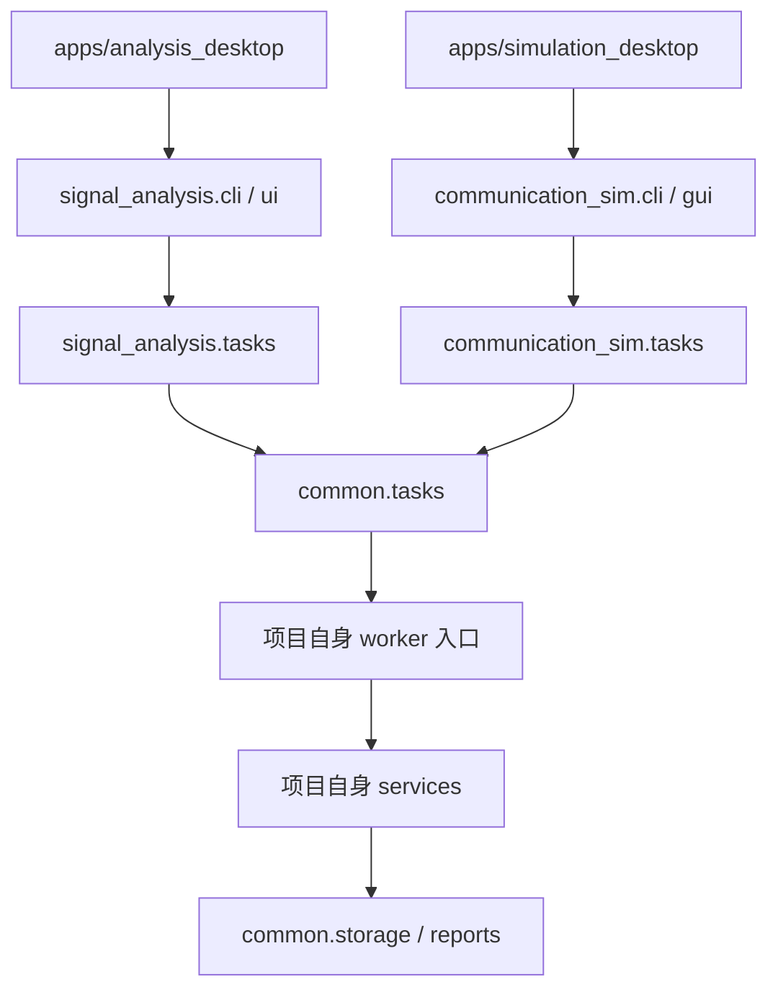

# 分项目工程实现与文件说明

版本：0.2.0。更新日期：2026-09-13。

## 1. 与方案总览一致的实现结构

当前已按“两个独立应用、一个通用基础库”拆分。原 `src/simusignal` 合并包和统一桌面入口已移除，没有保留跨项目标签页切换。2026-10 起进一步按“界面 / 服务 / 领域 / 存储 / 算法 / 契约”分层重组：`signal_analysis` 下为 `ui`、`services`、`data`、`storage`、`algorithms`、`contracts`、`inference`、`evaluation`、`integrations` 九个包（无兼容 shim，测试与文档同步更新）。

```text
src/
  common/                         # 通用任务、存储、报告和桌面基础组件
  signal_analysis/                # 分析项目业务、界面、CLI、worker 绑定
    ui/                           # 桌面界面：main_window + pages/ 子页 + constants/helpers/widgets/runner
    services/                     # 业务编排：execute 分派 + 导入/真值/检测/识别/生成/数据集/维护 + 集合生成・训练输入快照执行器
    data/                         # 领域层：Workspace mixin（资产/目标/集合/标签/版本）+ IO/SigMF/数据集/标注/采纳
    storage/                      # 设施层：schema/工具/迁移/维护
    algorithms/                   # 传统算法核心：dsp/detection/amc/generation（Cython 编译 8 项）
    contracts/                    # 训练与推理共享契约：清单/解码/图像/AMC/IQ/预处理
    inference/                    # onnxruntime 推理会话与模型加载
    evaluation/                   # 评分口径：truth / metrics / hops
    integrations/                 # 外部集成：原生插件、TorchSig
  communication_sim/              # 仿真项目业务、界面、CLI、worker 绑定
apps/
  analysis_desktop/                # main.py、发布 pyproject.toml、README
  simulation_desktop/              # main.py、发布 pyproject.toml、README
training/                          # 数据集构建、训练与验收脚本（不随 wheel 分发）
  detectors/                      # 第三方检测框架适配器（YOLOX / RT-DETR / Ultralytics + 内置 tiny）
tests/
  common/                         # 依赖边界、项目隔离、共用能力
  analysis/                       # 分析算法、数据、插件、检测/识别、分析 GUI
  simulation/                     # 仿真模型和仿真 GUI
benchmarks/
  run_smoke.py                     # 分别验证两个项目的基础流程耗时
packaging/
  projects.json                    # 独立构建目标、入口、排除包
scripts/
  build_wheels.py                  # 按独立项目清单构建 wheel
  build_desktop.py                 # 按项目 wheel 构建独立桌面应用
  check_binary.py                  # 分析核心二进制回归
examples/native_plugin/            # 分析项目的通用 C ABI 示例
docs/                             # 总览、两项目方案、接口方案和本文件
  algorithms/                     # 信号检测（会话级/逐跳）与调制识别的传统与 AI 算法设计文档（五篇）
  01信号导入页面.md                # 导入页操作指南：数据格式、信号命名、面板编辑与流程
  02IQ信号生成页面.md              # 生成页操作指南：单条/批量生成、配方字段、噪声口径与集合接线
  03态势显示.md ~ 11运行记录.md     # 各标签页的详细设计（统计口径、检测、调制识别、跳频、两个训练页、数据管理、算法对比、运行记录）
  09数据管理.md                    # 工作区容量口径、一致性检查与安全清理规则（含“信号集合”子页）
```

| 方面 | 分析项目 | 仿真项目 |
| --- | --- | --- |
| 启动模块 | `python -m signal_analysis gui` | `python -m communication_sim gui` |
| 安装命令入口 | `signal-analysis` | `communication-sim` |
| 发布包名称 | `signal-analysis` | `communication-sim` |
| 桌面产物 | `SignalAnalysis` | `CommunicationSim` |
| 默认数据目录 | `workspace_data/analysis` | `workspace_data/simulation` |
| 业务依赖 | NumPy、官方 SigMF；可选 `onnxruntime`（`.[ml]`）与训练依赖（`.[train]`）；原生插件适配 | SimPy；无需分析模块 |
| GUI | 十一个标签页：信号导入、IQ 信号生成、态势显示、信号检测、调制识别、跳频参数、信号检测训练、AMC 识别训练、数据管理、算法对比、运行记录 | 仿真页面与本项目运行历史 |
| 数据库 | 信号资产表、本项目运行记录 | 本项目运行记录，不创建信号资产表 |
| 原生示例接口 | 保留清单与 DLL/SO 复制演示 | 不引入分析插件入口 |

共用源码随两个发布包分别收集。正式部署建议使用各自虚拟环境或各自目录式桌面包；根 `pyproject.toml` 是双项目开发环境，不是两套正式发布清单。

## 2. 依赖和运行路径



`common` 不导入 `signal_analysis` 或 `communication_sim`。各项目任务绑定层向共用进程管理器传递自己的模块名，worker 入口显式注入自己的 `execute`，不在共用层集中识别业务。

分析项目不导入仿真包或 SimPy；仿真项目不导入分析包。数值核心与原生信号插件只存在于分析包。两个桌面均复用公共窗口框架，但各自创建业务界面，仿真窗口没有信号数据侧栏。

## 3. 逐文件说明

### 工程、入口、发布与基准

| 文件 | 职责 |
| --- | --- |
| [README.md](../../README.md) | 两项目启动、操作、测试、独立构建和旧数据说明 |
| [pyproject.toml](../../pyproject.toml) | 双项目开发依赖、两个 console scripts 和测试配置 |
| [setup.py](../../setup.py) | 分析数值核心 Cython 编译和核心源码排除；由独立构建脚本复用 |
| [requirements-linux-py312.lock](../../requirements-linux-py312.lock) | Linux/Python 3.12 开发环境依赖快照；其他平台单独验证 |
| [.gitignore](../../.gitignore) | 忽略虚拟环境、工作数据、编译动态库及构建文件 |
| [apps/analysis_desktop/main.py](../../apps/analysis_desktop/main.py) | 分析程序及其冻结 worker 的专用入口 |
| [apps/analysis_desktop/pyproject.toml](../../apps/analysis_desktop/pyproject.toml) | 分析正式包元数据、NumPy / SigMF 依赖和包收集范围 |
| [apps/analysis_desktop/README.md](../../apps/analysis_desktop/README.md) | 分析项目独立使用与构建说明 |
| [apps/simulation_desktop/main.py](../../apps/simulation_desktop/main.py) | 仿真程序及其冻结 worker 的专用入口 |
| [apps/simulation_desktop/pyproject.toml](../../apps/simulation_desktop/pyproject.toml) | 仿真正式包元数据、SimPy 依赖和包收集范围 |
| [apps/simulation_desktop/README.md](../../apps/simulation_desktop/README.md) | 仿真项目独立使用与构建说明 |
| [packaging/projects.json](../../packaging/projects.json) | 项目包名、入口目录、产物名及必须排除的另一项目模块 |
| [scripts/build_wheels.py](../../scripts/build_wheels.py) | 暂存本项目业务与 common，读取本项目清单，单独构建 wheel |
| [scripts/build_desktop.py](../../scripts/build_desktop.py) | 验证 wheel 归属，分别构建桌面并排除另一项目 |
| [scripts/check_binary.py](../../scripts/check_binary.py) | 按统一清单检查八个数值扩展、核心明文排除与内置模型；复制测试到隔离目录，验证数值、生成器、检测、AMC、IQ 与 AI 量测实际加载 wheel，可用 `--baseline` 精确核对结果 |
| [benchmarks/run_smoke.py](../../benchmarks/run_smoke.py) | 按项目运行小规模分析或仿真任务，输出真实耗时；不作合同性能承诺 |
| [benchmarks/ai_detect_sweep.py](../../benchmarks/ai_detect_sweep.py) | AI 检测扫档基准：固定模型与数据集，按阈值/SNR 扫出固定虚警率下的检测率与分档召回；`--selfcheck` 先重放同一批候选再比对，两次结果不一致即报错（防止“扫档数字不可复现”），输出契约 `ai_detect_sweep_v1` |

### 共用基础库

| 文件 | 职责 |
| --- | --- |
| [`src/common/__init__.py`](../../src/common/__init__.py) | 公共代码版本；不加载业务包 |
| [src/common/storage.py](../../src/common/storage.py) | UTC 时间、文件摘要、项目目录标识、SQLite 运行索引、通用产物保存及异常清理；**按项目的版本化迁移框架**：项目以 `schema_migrations()` 声明有序迁移（版本 = `PRAGMA user_version`），升级已有库前自动备份到 `backups/`，迁移幂等可重跑，版本高于程序支持的库直接拒绝打开 |
| [src/common/tasks.py](../../src/common/tasks.py) | 注入项目入口的独立进程、JSON 请求响应、超时、取消、崩溃及日志阈值；每个任务一个独立工作目录 `jobs/<id>/`（request/response/status/progress/cancel.flag/worker.log），父进程按 0.2 s 轮询 `progress.json` 回调进度（轮询读不到就当这一轮没有，等下一轮；**worker 侧的原子替换带重试**——Windows 上父进程的读句柄会让 `os.replace` 报 `WinError 5`）；`cancel_grace > 0` 时取消先写 `cancel.flag`，等 worker 在边界收尾并返回部分结果（导入、集合生成、训练导出使用）；协议本身不限制并发（并发规则在 `common/gui.py`） |
| [src/common/reports.py](../../src/common/reports.py) | JSON/HTML 报告、HTML 转义和暂存替换 |
| [src/common/gui.py](../../src/common/gui.py) | 共用窗口外壳、主题、**按页任务模型**、取消与报告导出；**不创建任何标签页**，标签页由各项目在自己的 `MainWindow.__init__` 中注册并排序，并提供 `result_status()` 钩子供只读页面改写完成文案。任务模型：`UiTask`（独立标识/归属页面/独立取消事件与进度）+ `TaskManager`（同页同一时刻只允许一个任务、跨页可并发、线程池上限 4；`storage_cleanup`/`migrate_legacy` 为独占动作，与任何运行中任务互斥）+ 页内 `TaskBanner`（`register_task_banner(owner, banner)` 注册：进度或阶段、定制取消按钮、结束文案；同页重复启动在横幅内给出拒绝原因）。底部状态区两行——上行 `self.status_detail`（`ElidedLabel` 业务摘要，空文本即隐藏，超长按中间省略、完整文本仍可用 `text()` 取到，经 `set_status_detail()` 写入），下行左侧 `self.status`（任务状态）与右侧 `self.task_summary`（“正在运行 N 个任务”/“无运行中任务”）。兼容接口保留：`active_job`（无任务→None，否则最近启动的运行任务，暴露 `.cancelled`）、`cancel_job()`、`set_busy()`、`job_buttons()`；`start_job()` 新增 `owner/label/cancel_text` 并返回 `(task, reason)` |

### 分析项目

| 文件 | 职责 |
| --- | --- |
| [`src/signal_analysis/__init__.py`](../../src/signal_analysis/__init__.py) | 分析包版本 |
| [`src/signal_analysis/__main__.py`](../../src/signal_analysis/__main__.py) | 分析 `python -m` 入口 |
| [src/signal_analysis/cli.py](../../src/signal_analysis/cli.py) | 分析命令及默认数据目录，含 generate 规格生成、detect、detect-hops、ml-detect、ml-detect-hops、amc-classify、amc-iq-classify、ml-manifest、amc-manifest、amc-iq-manifest 与 migrate-legacy（幂等登记历史数据），不注册 simulate 命令 |
| [src/signal_analysis/ui/main_window.py](../../src/signal_analysis/ui/main_window.py) | 独立分析界面的十一个标签页（页面方法已拆为 `ui/pages/` 下的 mixin，本文件保留窗口本体、注册表和共享路由；页面按名称注册，取下标一律使用 `_page_index("页面名")`）：训练部分注册相邻的**信号检测训练**与 **AMC 识别训练**，两页只在侧栏选中具体集合时可用（全部资产/零散资产时置灰并在停留时跳回「信号导入」），共享执行器但各有 owner/横幅，由 `TrainingCoordinator` 序列化训练；侧栏支持按信号名称查找与「未标注检测信息／未标注AMC信息」过滤；其余页面包括信号导入、IQ 信号生成、态势显示、信号检测、调制识别、跳频参数、数据管理、算法对比和运行记录；页面行为、任务归属与共享路由见各页面模块和[信号检测训练页面设计（07）](07信号检测训练.md)／[AMC 识别训练页面设计（08）](08AMC识别训练.md) |
| [src/signal_analysis/ui/training_coordinator.py](../../src/signal_analysis/ui/training_coordinator.py)、[training_runner.py](../../src/signal_analysis/ui/training_runner.py)、[training_process.py](../../src/signal_analysis/ui/training_process.py) | 窗口级训练运行槽、TaskManager external 任务关联与按任务 ID 路由；QProcess 生命周期、`TRAIN_EVENT` 解析（阶段/轮次进度归一化为 `done/total`，换阶段显式清零）、实验持久化及 POSIX 进程组（会话只由 worker 建立） / Windows Job Object 与后代进程收尾 |
| [src/signal_analysis/ui/constants.py](../../src/signal_analysis/ui/constants.py)、[helpers.py](../../src/signal_analysis/ui/helpers.py)、[widgets.py](../../src/signal_analysis/ui/widgets.py)、[runner.py](../../src/signal_analysis/ui/runner.py)、[dialogs.py](../../src/signal_analysis/ui/dialogs.py) | 界面常量（模式/导出/导入清单列定义/播放参数）、格式化与导出辅助（频率/时长/指标、资产格式与导出物描述、镜像判断）、复用控件（Hz 自适应 Spin 与工厂）、任务运行器（按动作超时/取消宽限：生成与演示 600 s，集合生成/TorchSig/批量导入与识别 3600 s（其中长任务给 120 s 协作取消宽限），盘点与清理 300 s；批量导入超过单批上限 500 时按块编排——仍是单任务单取消事件，每块 500 个文件独立子进程与分片，进度换算为整批口径（第 n/N 块）、逐块合并计数与 `shard_ids`）与一个弹框（信号与采样配置 `SignalParamsDialog`） |
| [src/signal_analysis/ui/pages/](../../src/signal_analysis/ui/pages) | 顶层页面与子页实现：九个窗口 mixin（`import_page.py`、`generator_page.py`、`analysis_page.py`、`detect_page.py`、`hops_page.py`、`amc_page.py`、`compare_page.py`、`data_page.py`、`history_page.py`），训练页面共享基类 `training_common.py` 与任务专属 `detection_training_page.py` / `amc_training_page.py`，另有 `collection_gen_page.py`（信号集合生成子页及配置弹框） |
| [src/signal_analysis/storage/maintenance.py](../../src/signal_analysis/storage/maintenance.py) | 工作区数据盘点与安全清理（只依赖标准库，不引入 NumPy）：按目录统计字节与文件数（不重算 SHA-256、不跟随目录符号链接）、按 `kind` 归并运行记录并量化索引冗余、一致性检查（未入库文件、入库但文件缺失、未入库运行目录、原子写残留、源资产已删除）、按保留天数生成清理候选（运行中任务计入跳过）、清理前重算候选防 TOCTOU 与路径白名单护栏、审计日志 `maintenance.log`；**标注数据集登记** `register_annotation_dataset`（幂等）：旧标注目录登记为集合 + 检测标注集 + 数据版本（卡片记录 `source_kind`、`raw_iq`），`source_asset_id` 能对上的样本建立集合成员关联，对不上的计数报告；旧 `experiment.json` 补索引、分片资产按记录份额计量；口径与规则见[数据管理页面设计（09）](09数据管理.md) |
| [src/signal_analysis/tasks.py](../../src/signal_analysis/tasks.py) | 绑定分析 worker、提前验证项目数据目录 |
| [src/signal_analysis/services/](../../src/signal_analysis/services) | 生成、IQ 生成、导入（单文件 `import`、头部识别 `import_inspect`、标注清单解析 `import_manifest`、批量 `import_files`（逐文件 `files` 载荷：名称/采样率/类型/字节序/目标行覆盖（仅 AMC 调制；旧检测字段忽略并逐文件回报）；`rf_center_hz`/`label` 保留供 CLI；采集时间逐文件或请求级、缺省记本批导入时间））、分析、detect、detect_hops、ml_detect、ml_detect_hops、amc_classify、amc_iq_classify、storage_report、storage_cleanup、原生复制与**集合/标注/配方/数据版本/历史迁移/采纳**业务（`recipe_preview`、`recipe_save`、`generate_collection`（项目/TorchSig 集合生成）、`torchsig_import`、`torchsig_probe`、`dataset_build`、`dataset_verify`、`dataset_bootstrap_labels`、`migrate_legacy`、`adopt_result`），负责附加生成器真值与检测基线（真值优先读目标参考参数）、生成时把资产加入集合并按开关写初始标注，不分派仿真；只读、导入与采纳动作刻意不写运行记录。包内按动作域拆分 `imports`/`truth`/`detection`/`amc`/`generation`/`datasets`/`management`（`execute` 仍是唯一入口），集合生成/训练输入与快照/训练计划执行器（`collection_gen`/`training_inputs`/`training_snapshot`/`training_jobs`）同包；导入在**文件边界**协作取消（已完成部分照常封存为分片与集合，结果含 `cancelled`/`unprocessed`）；`progress.py` 提供 worker 侧进度与取消通道 `Reporter`（写 `progress.json`、查 `cancel.flag`）：写入带**并发重试**（父进程轮询持读句柄时 Windows 的原子替换会失败，重试几十毫秒错开，超预算才如实抛出），集合生成/TorchSig 导入共用，`collection_gen` 处再导出保持旧导入面 |
| [src/signal_analysis/data/](../../src/signal_analysis/data) | 分析资产表与 schema v3（数据模型与迁移见[数据库设计](数据库设计.md)）：独立 NPY 与分片（`ShardWriter` 追加/封存/逐条哈希校验、读取按偏移定位）、来源分类与分组键、集合与成员（多对多、零散资产查询）、目标与追加式参考参数版本（`carryover_fields` 供页面沿用未编辑字段）、类别字典与任务标注集、检测/AMC 标签（追加式版本、`supersedes_id`、采纳算法结论；`append_amc_annotation` 在同一事务内写参数版本与 AMC 标签）、覆盖度、配方、数据版本、实验与评估表；计数、偏移/键集分页与集合统计接口。**实现拆为 mixin 包**：`workspace.py` 组合类 + `assets`/`targets`/`collections`/`labels`/`versions` 领域 mixin；schema 常量与 DDL 在 `storage/schema.py`、校验工具在 `storage/utils.py`、迁移与回填在 `storage/migrations.py` |
| [src/signal_analysis/algorithms/generation/recipes.py](../../src/signal_analysis/algorithms/generation/recipes.py) | 生成参数 `gen_recipe_v1`（内部存储格式）：结构校验（分布语法、分层/留出、不静默忽略未知参数）、样本级种子 `sample_seed`（支持逐信号槽位盐）、按样本抽记录的 `draw_record`、仅抽参数不合成 IQ 的预览与分层格子报告、启动前的生成器能力校验 `check_generator_support`（未实现的损伤/独立符号率、TorchSig 不支持的参数均直接报错） |
| [src/signal_analysis/services/collection_gen.py](../../src/signal_analysis/services/collection_gen.py) | 集合生成执行器（项目引擎，方案 §7.2）：按配方逐条合成（信号按占用带宽互不重叠放置，放不下则跳过计数）、写分片、加入集合、自动建标注集并写初始标注（检测覆盖度 = complete，纯噪声记录为负样本）、生成时把配方存入集合并绑定；进度写 `progress.json`、取消写 `cancel.flag` 后收尾返回部分结果；失败只计数不静默改参数 |
| [src/signal_analysis/ui/pages/collection_gen_page.py](../../src/signal_analysis/ui/pages/collection_gen_page.py) | “信号集合生成”子页（表单 + 按引擎区分的配置弹框）：`_ParamsDialog` 提供公共区间骨架，`ProjectParamsDialog`（调制轮换、功率、跳速、**损伤**——按 `impairments` 声明渲染、未实现置灰）与 `TorchSigParamsDialog`（信号族、扰动档位、类别映射）各自独立，由 `params_dialog()` 按“生成引擎”下拉挑一个，“配置…”按钮打开对应的那一个；页面上只有“基本 / 信号与采样 / 标注 / 操作”四个区块；高级里是 JSON 导入导出、TorchSig 环境设置与 bundle 导入；默认检测标注为逐跳 `per_hop_v1` |
| [src/signal_analysis/algorithms/generation/impairments.py](../../src/signal_analysis/algorithms/generation/impairments.py) | 损伤项**预留接口**（全部未实现）：逐项声明参数形状、施加阶段（逐信号 / 记录级）、固定施加顺序与对真值的影响；`ensure_supported` 拒绝未实现的项（不静默忽略），`apply_impairments` 是执行器的调用位置 |
| [src/signal_analysis/integrations/torchsig.py](../../src/signal_analysis/integrations/torchsig.py) | TorchSig 接入：环境设置与探测（`torchsig_env.json`、`torchsig_probe`）、Linux 下外部进程生成 bundle → 导入；bundle 导入（纯 NumPy，任何平台）：IQ 写分片、`components` → 目标参考参数（采样点时间、派生频带、`inband_snr_v1` 实测值 + 标称值入 `params_json`）、A09 类别映射（未映射保留并统计为字典外）；Windows 直接提示只能 Linux 生成 |
| [src/signal_analysis/services/training_inputs.py](../../src/signal_analysis/services/training_inputs.py)、[training_snapshot.py](../../src/signal_analysis/services/training_snapshot.py)、[training_jobs.py](../../src/signal_analysis/services/training_jobs.py) | 训练输入：`inputs_plan` 校验训练集/验证集集合（标注集、样本、检测粒度、类别字典、同源防泄漏）并装配样本行（训练集→`train`、验证集→`val`），GUI 预检与 worker 首阶段共用；`snapshot` 把行实体化成训练脚本认识的目录——检测 → `AnnotationDataset`（时频图 + 归一化框，沿用标注集语义），AMC → `iq_dataset`（`iq_waveform_v1` 窗口，仅已确认类别，未知与字典外不计入并写 `skipped`）。不构建数据版本、不写 `datasets/`；`training_jobs.iq_plan` 继续为本目录里的 `train_iq.py`/`verify_iq.py` 生成执行阶段 |
| [src/signal_analysis/data/datasets.py](../../src/signal_analysis/data/datasets.py) | 数据版本构建：清单 `dataset_manifest_v1` 流式写入 + 哈希校验、按 `origin_group_id` 整组划分、`holdout` 留出轴、检测任务只纳入 `coverage=complete`（未标注目标整条排除并在卡片记录原因）、纯噪声负样本、`bootstrap_labels_from_versions` 初始标注；`detection_label_applies` 统一“逐跳粒度下跳频父会话不标 / 其余会话照标”的适用规则（初始标注与数据版本纳入判定共用）；调制名→A09 映射修正（2ASK/16QAM/64QAM 等规范名）；清单读取/校验供训练消费 |
| [src/signal_analysis/data/adoption.py](../../src/signal_analysis/data/adoption.py) | “采纳为参数标注”（方案 §7、C6）：按运行类型分派检测/逐跳/AMC/IQ 结论，只追加 `source=algorithm` 的目标参数版本与标签（检测按频带/时间匹配归并到会话或 hop 子目标；AMC/IQ 按 A09 字典映射 `known`，字典外记 `out_of_taxonomy` 并保留原始标签），不覆盖任何既有版本 |
| [src/signal_analysis/data/io.py](../../src/signal_analysis/data/io.py) | NPY/CSV/交织 IQ 二进制/SigMF 的读写分派、资产格式名校验（`resolve_storage_format`）、禁用 pickle、文件及样本规模限制 |
| [src/signal_analysis/data/sigmf.py](../../src/signal_analysis/data/sigmf.py) | 官方 sigmf 1.11.1 双文件读写适配，采样率和格式约束、暂存导出及失败清理；元数据通过 storage 的 asset_metadata 表保存 |
| [tests/analysis/test_sigmf_io.py](../../tests/analysis/test_sigmf_io.py) | 官方库互读、大小端及整数缩放、CLI 自动采样率、资产元数据和异常边界 |
| [src/signal_analysis/core_api.py](../../src/signal_analysis/core_api.py) | 源码与二进制共用的稳定数值接口 |
| [src/signal_analysis/algorithms/dsp/](../../src/signal_analysis/algorithms/dsp) | `base.py`（公共校验、STFT/PSD、噪声本底、掩膜、占用区间与共享常量）、`spectrum.py`（统计摘要、波形／频谱／时频／原始星座数组、符号级星座抽取 `constellation_points`／`_matched_filter` 与单帧频谱行）、`preprocess.py`（AMC 与原始 IQ 分类共用的中心裁剪、混频、低通、抽取及 SNR 粗估）——前三者参与 Cython 编译；`image.py`（时频图张量 `tf_image_v1`、坐标映射与带内辐射量测量，纯 Python） |
| [src/signal_analysis/algorithms/detection/](../../src/signal_analysis/algorithms/detection) | `energy.py`（会话级能量检测、双门限频带量测、时间支撑与会话合并，可编译）、`hops.py`（逐跳配置、时频脊线跟踪、频带复测、驻留量测、会话与可分辨性判定，可编译）、`postprocess.py`（共享后处理）、`ai.py`（AI 检测：时频图 → ONNX → 冻结契约 + 能量基线并排对比，含 `ml_detect_hops`） |
| [src/signal_analysis/algorithms/amc/](../../src/signal_analysis/algorithms/amc) | `features.py`（34 维传统特征与固定顺序向量转换，可编译）、`heuristic.py`（数字／模拟启发式判定，可编译）、`feature_model.py`（A09 六类模型训练、加载、推理与结果组装）、`iq_model.py`（原始 IQ 分类：`iq_waveform_v1`、清单读写、ONNX 打分与 `amc_iq_classify_v1`）、`amc_default.json`（随包分发的默认模型，包数据） |
| [src/signal_analysis/algorithms/generation/iqgen.py](../../src/signal_analysis/algorithms/generation/iqgen.py) | 九种调制样式与自定义白噪声的 IQ 生成、信号规划、噪声底及逐跳采样边界；可编译（编译清单 `packaging/numeric_core.json` 共 8 项，全部位于 `algorithms.*`；旧 `_numeric*` 模块与 `_numeric.py` 兼容层已删除，`core_api` 为稳定数值接口） |
| [src/signal_analysis/evaluation/](../../src/signal_analysis/evaluation) | 纯 NumPy 的评分口径：生成器真值折算（`signal_truth`、逐跳的 `hop_truth`）、会话级检测匹配/误差统计（`evaluate_detections`）与逐跳评估契约 `per_hop_eval_v1`（时间-频率 IoU + 匈牙利一对一匹配、跳检测/时间/频率/会话指标、频道序列 LCS/编辑距离、分组报表与不可比较原因；包内拆为 `truth` / `metrics` / `hops` 三模块、包根保持旧导入面）；持有冻结的 `detect_result_v1`、`fh_hops_v1` 契约，GUI、CLI、基准与训练脚本共用同一份 |
| [src/signal_analysis/integrations/plugins.py](../../src/signal_analysis/integrations/plugins.py) | 原生复制清单、平台/摘要检查、ctypes 调用及缓冲区所有权 |
| [src/signal_analysis/contracts/](../../src/signal_analysis/contracts) | 训练与推理共享契约（`__init__` 汇总导出，只依赖 NumPy 与标准库）：`manifest.py`（清单定义/校验/生成）、`decode.py`（`normalized_boxes_v1` 解码与按 IoU 去重）、`image.py`（图像尺寸/坐标映射/`band_to_box`）、`amc.py`（A09 类别与特征契约）、`iq.py`（`iq_waveform_v1` 与 IQ 清单读写）、`preprocess.py`（AMC/IQ 共享预处理常量） |
| [src/signal_analysis/inference/runtime.py](../../src/signal_analysis/inference/runtime.py) | onnxruntime 惰性加载与可用性探测（含最低版本校验）、按计算线程数建会话；未安装时给可执行提示，不回退演示结果。另提供原始 IQ 分类器的 `IQModelRunner`（强制 `(1, 2, N)` 输入形状与清单窗口长度） |

### 训练与数据集（不进发布包）

训练脚本只依赖项目自身生成器与 `signal_analysis.contracts` / `signal_analysis.inference` 的契约模块，训练依赖（torch / onnx）为额外可选项 `.[train]`；`train_yolox.py`、`tiny_detector.py`、`amc_transformer.py` 在未安装训练依赖时由测试显式跳过，不进入 wheel 与桌面包。第三方检测框架（YOLOX / RT-DETR / Ultralytics）**不是必需依赖**：适配器只在被调用时检查自身是否安装，未安装即给出安装提示；`--dataset-only` 与 `--onnx` 两条路径都不需要框架的 Python 包。AGPL-3.0 的框架受硬门禁约束（需显式 `--allow-copyleft`，清单标 `distributable: false`），不进入发行包。

| 文件 | 职责 |
| --- | --- |
| [training/desktop_worker.py](../../training/desktop_worker.py) | 桌面训练的外部进程入口：首阶段用 `services.training_inputs` 校验集合并装配样本行、用 `services.training_snapshot` 写本次运行的输入快照（`collection_data/`，同时写 `training_inputs.json` 溯源），随后编排训练与验收脚本；检测走 YOLO26s／RT-DETRv2 原生导出 + 契约图对账，AMC 走 `train_iq.py`／`verify_iq.py` |
| [training/README.md](../../training/README.md) | 训练-推理契约（唯一真相）、跳频会话语义、数据集构建、训练、验收、实测指标、许可证与命令速查 |
| [training/build_dataset.py](../../training/build_dataset.py) | 检测数据集：生成器真值直接变成时频图与边框标签，图像构造复用推理端同一模块；`--labels {session,hop}` 选择会话级或逐跳标签，后者在跳频会话上用 `evaluation.hop_truth` 出一跳一个框 |
| [training/tiny_detector.py](../../training/tiny_detector.py) | 自研最小无锚框检测头，在不引入第三方检测库的前提下产出契约合规的 ONNX |
| [training/train_yolox.py](../../training/train_yolox.py) | 检测模型训练 + ONNX 导出，用项目自身评测口径在验证集打分并写模型清单；开训前做标签量化守卫（最小标签边不得小于输出网格步长、单样本框数不得超过 `--max-boxes`） |
| [training/verify_onnx.py](../../training/verify_onnx.py) | 检测模型验收（C02）：清单/摘要、输入输出契约、端到端推理与跨导出的数值一致性；清单为 `per_hop_v1` 时自动改跑逐跳链路（`ml_detect_hops` + `fh_hops_v1` 评分） |
| [training/export_contract.py](../../training/export_contract.py) | 第三方检测框架的统一接入入口：`--list-frameworks` / `--list-layouts` 自描述，三条路径（`--dataset-only` 导出原生数据集、`--onnx` 把已导出的图改写成契约图 + 写清单、默认 torch 路径供 `tiny` 自训练） |
| [training/detectors/](../../training/detectors) | 检测器适配器包：`registry.py`（注册表 + 许可证门禁）、`base.py`（适配器基类与导出流程）、`contract.py`（`normalized_boxes_v1` 输出布局表）、`dataset.py`（数据集卡与记录加载）、`labels.py`（YOLO/COCO 标签导出，纯标准库写灰度 PNG）、`torch_export.py`（PyTorch 侧契约头 + ONNX 导出）、`onnx_contract.py`（纯 ONNX 图改写：烘输入预处理 + 输出几何转换）、`tiny.py` / `yolox.py` / `rtdetr.py` / `ultralytics.py`（四个框架适配器） |
| [training/build_amc_dataset.py](../../training/build_amc_dataset.py) | A09 数据集：单信号场景 → 定长特征向量，记录含场景参数、分析窗口、真值与未取整信息 |
| [training/train_amc.py](../../training/train_amc.py) | 线性判别基线（确定性，写入内置模型）与可选 Transformer + ONNX 分支 |
| [training/amc_transformer.py](../../training/amc_transformer.py) | 与线性基线共用同一特征向量契约的深度模型分支（可选） |
| [training/verify_amc.py](../../training/verify_amc.py) | A09 验收：数据集契约、线性基线分层指标、ONNX 分类器一致率；退出码区分通过/失败/缺运行时 |
| [training/torchsig_bundle.py](../../training/torchsig_bundle.py) | 自描述中间格式 `torchsig_bundle_v1` 的读写（`manifest.json` + 每条记录 `iq.npy`/`meta.json`），把外部生成器与项目数据契约隔离；只用 NumPy，不导入 TorchSig；生成页“导入 TorchSig bundle…”按同一份格式自行读取（产品侧不依赖训练目录） |
| [training/build_torchsig.py](../../training/build_torchsig.py) | 调 TorchSig 生成 IQ 与实例级元数据并写成 bundle（**唯一需要 TorchSig 的环节**，依赖 `.[torchsig]`，仅 Linux；生成页“信号集合生成”在 Linux 下以外部进程调用它） |
| [training/ingest_torchsig.py](../../training/ingest_torchsig.py) | bundle → `tf_image_v1` 检测数据集（时频图 + `normalized_boxes_v1` 框），校验框数与图像可达性；逐跳标签直接拒绝 |
| [training/iq_cnn.py](../../training/iq_cnn.py) | 原始 IQ 分类的两个基线：`IQCNN`（步长卷积）与 `IQTCN`（膨胀因果残差），softmax 写进图内、按 batch=1 导出 ONNX；模块级导入 torch（只在 `.[train]` 下使用） |
| [training/build_iq_dataset.py](../../training/build_iq_dataset.py) | `iq_waveform_v1` 数据集：随机场景 → 定长 IQ 窗口（每个窗口由推理端 `iq_waveform` 产出）、类内分层划分、同种子字节可复现；凑不满窗口重抽而不补零；可选按**显式类名映射**混入 TorchSig bundle（未映射类名原样记录并跳过） |
| [training/train_iq.py](../../training/train_iq.py) | IQ 分类训练 + ONNX 导出 + 清单，再用 ONNX 入口重算验证集（两条路径准确率必须一致），打印分 SNR 档位与混淆矩阵 |
| [training/verify_iq.py](../../training/verify_iq.py) | 原始 IQ 通路验收：清单/图形状/4 个确定性场景端到端/重复推理一致/数据集独立验证；退出码区分通过/失败/缺运行时 |
| [training/iq_map.example.json](../../training/iq_map.example.json) | `--torchsig-map` 的占位示例：左边是 bundle 里真实出现的 TorchSig 类名（需自行替换），右边是项目类别 |

### 算法设计文档（`docs/algorithms/`）

五篇文档按“传统算法 / AI 算法 × 信号检测 / 调制识别”矩阵编写（信号检测分**会话级**与**逐跳**两篇），每篇包含算法思路、公式、流程图、
输入与输出参数、设计局限与可改进方向与参考文献（跳频逐跳一篇另含与会话结果的关系和实测结果）；公式与常量均以已实现代码为准核对，与本文档的
算法标识、契约名保持一致。

| 文件 | 对应算法标识 | 契约 |
| --- | --- | --- |
| [docs/algorithms/信号检测_传统能量检测.md](algorithms/信号检测_传统能量检测.md) | `energy_detect_v1` | `detect_result_v1`、`inband_snr_v1` |
| [docs/algorithms/信号检测_跳频逐跳参数估计.md](algorithms/信号检测_跳频逐跳参数估计.md) | `hop_track_v1`；同一契约的 AI 通路 `ml_detect_hops:<模型 id>`（见 AI 篇 §7） | `fh_hops_v1`、`inband_snr_v1` |
| [docs/algorithms/信号检测_AI时频图检测.md](algorithms/信号检测_AI时频图检测.md) | `ml_detect:<模型 id>`（会话级）、`ml_detect_hops:<模型 id>`（逐跳，§7） | `tf_image_v1`、`time_frequency_grayscale_v1`、`normalized_boxes_v1`、`detect_result_v1`、`fh_hops_v1` |
| [docs/algorithms/调制识别_传统特征与启发式判定.md](algorithms/调制识别_传统特征与启发式判定.md) | `heuristic_digital_analog_v1`；学习判别器 `amc_linear_v1` / `amc_onnx_v1` | `amc_feature_vector_v1`、`amc_model_v1`、`amc_classify_v1` |
| [docs/algorithms/调制识别_AI特征学习.md](algorithms/调制识别_AI特征学习.md) | 原始 IQ 通路 `amc_iq_onnx_v1:<模型 id>`（CNN/TCN） | `iq_waveform_v1`、`amc_iq_classify_v1` |

### 工程与运维文档

| 文件 | 内容 |
| --- | --- |
| [docs/数据库设计.md](数据库设计.md) | 信号分析工作区的数据模型权威设计：概念与实体关系图（mermaid）、schema v3 表与字段、追加式版本与标注语义、适用标记与采纳规则、真值读取口径、索引与分页、迁移与兼容、容量摘要、数据层验收场景与实现状态 |
| [docs/09数据管理.md](09数据管理.md) | “数据管理”标签页的目标与边界、工作区数据布局、容量口径（含索引冗余与零除）、`storage_report_v1` 字段表与扫描流程、五类一致性判据、安全清理三道护栏与审计日志、“信号集合”子页（成员增删、标注进度、登记历史数据）、控件说明、与服务层/命令行入口的对应及已知局限 |
| [docs/01信号导入页面.md](01信号导入页面.md) | “信号导入”标签页的目标与边界、页面导览与只读清单列、四种数据格式与换算规则、信号名称自动命名与“仅 AMC”设计取舍、操作流程（含 mermaid）、FAQ、代码/测试对应与已知局限 |
| [docs/02IQ信号生成页面.md](02IQ信号生成页面.md) | “IQ 信号生成”标签页的目标与边界、单条/批量两个子页的页面导览、点数/参数/噪声口径、`gen_recipe_v1` 配方字段与集合生成数据语义、操作流程（含 mermaid）、FAQ、代码/测试对应与已知局限 |
| [docs/03态势显示.md](03态势显示.md) ~ [docs/11运行记录.md](11运行记录.md) | 各标签页的详细设计：统计与图形口径、能量/AI 检测、A09 调制识别、跳频逐跳、两个训练页（标注、训练配置、数据流、实验与日志）、数据管理、算法对比、运行记录 |

### 仿真项目

| 文件 | 职责 |
| --- | --- |
| [`src/communication_sim/__init__.py`](../../src/communication_sim/__init__.py) | 仿真包版本 |
| [`src/communication_sim/__main__.py`](../../src/communication_sim/__main__.py) | 仿真 `python -m` 入口 |
| [src/communication_sim/cli.py](../../src/communication_sim/cli.py) | 仿真命令、运行列表和报告，不注册分析或插件命令 |
| [src/communication_sim/gui.py](../../src/communication_sim/gui.py) | 独立场景参数、时间轴、事件表、回放和历史 |
| [src/communication_sim/tasks.py](../../src/communication_sim/tasks.py) | 绑定仿真 worker、验证仿真目录 |
| [src/communication_sim/services.py](../../src/communication_sim/services.py) | 仿真运行与归档，不加载分析业务 |
| [src/communication_sim/storage.py](../../src/communication_sim/storage.py) | 仿真项目目录及独立运行库，复用通用存储 |
| [src/communication_sim/simulation.py](../../src/communication_sim/simulation.py) | SimPy 通用队列模型、场景校验、时序与完成统计 |

### 测试与沿用示例

| 文件 | 验证内容 |
| --- | --- |
| [tests/common/test_boundaries.py](../../tests/common/test_boundaries.py) | 静态/运行时依赖边界、项目目录隔离、仿真无资产表、旧数据库保护和共用回滚 |
| [tests/analysis/test_numeric.py](../../tests/analysis/test_numeric.py) | 已知统计、PSD 能量、负频率、短输入、缓存上限、数学校验、数字/模拟判定、星座数组及单帧频谱行对齐 |
| [tests/analysis/test_numeric_modules.py](../../tests/analysis/test_numeric_modules.py) | 新旧入口对象一致、AMC／IQ 与传统／AI 量测共用实现、数值层不加载模型或 GUI、二进制测试实际加载扩展 |
| [tests/common/test_numeric_packaging.py](../../tests/common/test_numeric_packaging.py) | 逐模块检查扩展缺失、核心明文混入及 Cython 中间源码泄漏均被拒绝 |
| [tests/analysis/test_storage_io.py](../../tests/analysis/test_storage_io.py) | 导入、对象数组拒绝、资产篡改、备注、结果归档、失败引用及 HTML 报告的检测/识别指标表（含缺值 `--` 与转义） |
| [tests/analysis/test_schema_migration.py](../../tests/analysis/test_schema_migration.py) | 迁移框架：新库直达最新 schema、旧 v1 库升级 + 自动备份、旧 ID/路径不变、生成摘要→目标、无摘要→未知占位、重启幂等与更高版本库拒绝 |
| [tests/analysis/test_collections_store.py](../../tests/analysis/test_collections_store.py) | 集合多对多成员与位置顺序（含 0 位置缺陷回归）、零散资产与归档集合、偏移/键集分页、分片写入/封存/篡改拒绝、集合统计与作用域过滤 |
| [tests/analysis/test_labels_store.py](../../tests/analysis/test_labels_store.py) | 标签追加式版本与 `supersedes_id`、`include=0` 负标注、AMC 三态校验、采纳算法结论、覆盖度最新行与完成率统计、`carryover_fields` 沿用未编辑字段、`append_amc_annotation` 事务性（校验失败不留下版本/标签） |
| [tests/analysis/test_dataset_versions.py](../../tests/analysis/test_dataset_versions.py) | 数据版本：分组划分不跨划分、留出轴强制进测试集、覆盖度/未标注排除、纯噪声负样本、AMC 窗口、清单哈希校验与服务层动作 |
| [tests/analysis/test_hop_eval.py](../../tests/analysis/test_hop_eval.py) | `per_hop_eval_v1`：完美匹配、漏检/多检与时间频率误差、IoU 门限与容差、匈牙利一对一配对、分组报表、频道序列 LCS、不可比较原因与分辨率警告 |
| [tests/analysis/test_recipes.py](../../tests/analysis/test_recipes.py) | 生成参数 `gen_recipe_v1`：结构校验与错误路径、样本级种子可复现、balanced/uniform 抽样、预览一致性与分层格子报告 |
| [tests/analysis/test_collection_gen.py](../../tests/analysis/test_collection_gen.py) | 集合生成执行器：`draw_record` 可复现与逐信号均衡、启动前能力校验（损伤/符号率/TorchSig 参数）、生成→集合→目标→逐跳标注、会话级与追加复用配方、逐位可复现与失败计数、取消与时间上限的部分结果、TorchSig 仅 Linux 与 bundle 导入（目标字段与映射） |
| [tests/analysis/test_training_snapshot.py](../../tests/analysis/test_training_snapshot.py) | 训练输入：`inputs_plan` 的预检（缺标注集、同集合、无样本、检测粒度不一致、同源防泄漏）与 `snapshot` 的产物（检测逐跳语义 + 快照可被 `detectors.dataset` 读取、AMC 仅已确认类别 + 可被 `train_iq` 读取、不登记数据版本） |
| [tests/analysis/test_legacy_migration.py](../../tests/analysis/test_legacy_migration.py) | 旧标注目录→集合/标注集/历史数据版本（幂等、`raw_iq=false`、成员关联与缺失计数）、旧实验登记与数据版本匹配、分片资产盘点口径、服务动作接线 |
| [tests/analysis/test_collections_gui.py](../../tests/analysis/test_collections_gui.py) | GUI：集合筛选与分页控件、侧栏目标详情与标注状态、集合子页新建/加入/移除/归档、历史登记按钮幂等 |
| [tests/analysis/test_import_gui.py](../../tests/analysis/test_import_gui.py) | GUI 与服务层：文件清单自动识别（NPY 形状/SigMF 元数据/二进制字节数）、缺参数标红与就绪门禁、表格只读与“信号参数编辑”（多选、混合格式禁用类型/字节序、信号名称三态自动命名）、CSV 标注清单（信号名称列、旧检测列“已忽略”报告、同名一致性、毫秒换算）、仅 AMC 标志（`for_detection=0`）、采集时间（清单携带/同行一致/缺省导入时间）、失败项保留在清单、分片自动阈值（20）与强制三态、`import_files` 逐文件载荷与 `paths` 请求兼容、逐跳目标拒绝的指引文案 |
| [tests/analysis/test_adoption.py](../../tests/analysis/test_adoption.py) | 采纳后端：检测/逐跳/AMC/IQ 结论→追加式目标参数版本与标签、按频带时间归并到既有目标、字典外类别保留原名、不支持的结果类型报错 |
| [tests/analysis/test_adopt_gui.py](../../tests/analysis/test_adopt_gui.py) | GUI：三个识别页的“采纳为参数标注”按钮启用时机（无结果禁用、任务中禁用、完成后按页面启用）与采纳后侧栏/集合面板刷新 |
| [tests/analysis/test_generate_collection_gui.py](../../tests/analysis/test_generate_collection_gui.py) | GUI：表单生成（新建/追加集合、自动目标与检测/AMC 标注、逐跳默认）、未填集合名称就地报错、训练页按训练集/验证集两个集合直读且无生成入口、TorchSig 环境弹框与 bundle 导入 |
| [tests/analysis/test_recipes_gui.py](../../tests/analysis/test_recipes_gui.py) | GUI：生成页两个子页、配置弹框按引擎区分（项目引擎含置灰损伤、TorchSig 无损伤/跳频、未知引擎回退）、“配置…”按当前引擎打开对应弹框并回写两套设置、预览渲染、导出/载入 JSON 回填表单与非法 JSON 拒绝、表单校验就地报错、TorchSig 仅 Linux 提示 |
| [tests/analysis/test_maintenance.py](../../tests/analysis/test_maintenance.py) | 数据盘点与安全清理（不需 GUI）：容量口径与磁盘一致、按 `kind` 归并、索引冗余小于总占用、四类一致性问题、SigMF 对文件按一条资产计、保留期与运行中任务过滤、路径白名单（`../`/绝对路径/白名单外目录/已入库运行目录一律跳过）、审计日志追加、`format_bytes` 边界与设置往返，以及报告可通过 `json.dumps(..., allow_nan=False)` |
| [tests/analysis/test_detect.py](../../tests/analysis/test_detect.py) | 能量检测的三参数、带内信噪比口径、幅值/时长边界与跳频会话合并（一段会话一个实例） |
| [tests/analysis/test_detect_hops.py](../../tests/analysis/test_detect_hops.py) | 跳频逐跳参数估计（54 项）：配置校验、游程/跟踪几何、驻留重测、细网格频带复算、会话归并、可分辨性与 `reason`、真值并集与会话级一致、服务层“不适用”与 CLI/GUI/报告路由、时频图方向与频率显示 |
| [tests/analysis/test_ml_detect.py](../../tests/analysis/test_ml_detect.py) | AI 检测路径：清单校验、图像契约、框解码、带内辐射量同口径及基线与 AI 并排对比 |
| [tests/analysis/test_ml_detect_hops.py](../../tests/analysis/test_ml_detect_hops.py) | AI 逐跳通路：清单语义门禁、真值框→跳的几何一致性、逐跳字段完备、`model_confidence` 可追溯、基线与传统逐跳开关、服务层与 CLI/GUI/报告路由 |
| [tests/analysis/test_dataset_labels.py](../../tests/analysis/test_dataset_labels.py) | 数据集标签语义（`session_v1` / `per_hop_v1`）与训练侧量化守卫：粗网格、亚像素标签、框数超限的拒绝，以及验收按匹配粒度评分 |
| [tests/analysis/test_amc.py](../../tests/analysis/test_amc.py) | A09 六类特征契约、短记录拒绝、模型保存/加载校验、真值与“不适用”计数、CLI/GUI 路由及算法对比页内容 |
| [tests/analysis/test_iq.py](../../tests/analysis/test_iq.py) | 原始 IQ 通路：波形契约与归一化、短窗口拒绝（不补零）、窗口范围、清单往返与路径/类别/前端拒绝、`iq_scores` 与 `amc_iq_classify` 端到端、低信噪比与低置信度标、`IQModelRunner` 形状与运行时版本门禁、服务层真值“不适用”、CLI/GUI 路由与渲染 |
| [tests/analysis/test_torchsig_ingest.py](../../tests/analysis/test_torchsig_ingest.py) | `torchsig_bundle_v1` 读写与校验、ingest 拒绝路径（框数/亚像素标签/逐跳标签）与 `tf_image_v1` 契约字段；**不需要安装 TorchSig** |
| [tests/analysis/test_iq_training_tools.py](../../tests/analysis/test_iq_training_tools.py) | IQ 数据集与训练工具链（16 项）：数据集卡与推理契约一致、窗口可从记录场景复现、字节可复现、宽类别字典、参数拒绝、类名映射缺失/非法、混合 TorchSig 的跳过计数与 layout 冲突、旁举例映射文件仍指向冻结类别、`train_iq` 的契约校验/划分/分档、脚本不在模块级导入 torch、模型形状、小规模训练能学到且导出一致 |
| [tests/analysis/test_ai_detect_sweep.py](../../tests/analysis/test_ai_detect_sweep.py) | AI 检测扫档基准：固定虚警率下的检测率口径、按 SNR 分档、输出契约 `ai_detect_sweep_v1` 与 `--selfcheck` 重放一致性 |
| [tests/analysis/test_training_tools.py](../../tests/analysis/test_training_tools.py) | 训练脚本的数据集/清单可运行性与缺依赖时的跳过行为 |
| [tests/analysis/test_tasks_native.py](../../tests/analysis/test_tasks_native.py) | 进程、取消、清单、原生调用、错误 ABI、崩溃和超时 |
| [tests/analysis/test_progress_channel.py](../../tests/analysis/test_progress_channel.py) | 进度通道：并发轮询期间写入不失败（Windows `WinError 5` 回归用例）、只对共享类错误重试、超预算如实抛出、节流与 `force`、额外字段、无任务目录与 `cancel.flag` 语义 |
| [tests/analysis/test_iqgen.py](../../tests/analysis/test_iqgen.py) | 9 种调制样式与自定义噪声的长度/有限性/功率/带宽/带内 SNR/跳频/复现性与非法参数 |
| [tests/analysis/test_dataio_iq.py](../../tests/analysis/test_dataio_iq.py) | NPY/CSV/交织 IQ 二进制回环、int16 量化、大小端与截断拒绝 |
| [tests/analysis/test_gui_analysis.py](../../tests/analysis/test_gui_analysis.py) | 十一个标签页（首位“信号导入”）、生成/分析、图形、星座图口径（只按目标参考参数的符号级散点，缺参数留白并写明原因）、固定显示范围、实时播放与滚动瀑布图、备注、报告、IQ 生成页、检测工作流与算法对比页、检测页频率显示与时频图方向（亮斑坐标必须与检测中心频率/时刻一致，转置绘制会立即失败）、数据管理页的扫描/预览门禁与“扫描与导出不写运行记录” |
| [tests/simulation/test_simulation.py](../../tests/simulation/test_simulation.py) | 边界时间、消息因果、在途计数、队列串行和可重复性 |
| [tests/simulation/test_gui_simulation.py](../../tests/simulation/test_gui_simulation.py) | 独立仿真窗口、无分析控件、真实 worker、事件回放及历史 |
| [examples/native_plugin/demo_api.h](../../examples/native_plugin/demo_api.h) | 沿用简化 C ABI，不作为正式算法 SDK |
| [examples/native_plugin/demo_plugin.c](../../examples/native_plugin/demo_plugin.c) | 沿用 float32 数组复制和容量检查 |
| [examples/native_plugin/CMakeLists.txt](../../examples/native_plugin/CMakeLists.txt) | Windows DLL / Linux SO 示例构建 |
| [examples/native_plugin/host.py](../../examples/native_plugin/host.py) | 可独立运行的标准库调用示例 |
| [examples/native_plugin/README.md](../../examples/native_plugin/README.md) | 构建及分析项目接入说明 |

## 4. 当前能力边界

回归基线（本机 Windows / CPython 3.13 / `.venv` / Ryzen 7 7840H）：`$env:QT_QPA_PLATFORM="offscreen"; .venv\Scripts\python.exe -m pytest tests -q` → **792 passed、14 skipped、约 40 s**（默认 `-n auto` 并行，收集约 8 s；串行约 3 min）。分层与串行开关见[README 的“按项目测试和基准”](../../README.md)：快速档 `-m "not gui and not native and not torchsig"` 约 21 s，界面档 `-m gui` 约 25 s。`progress.json` 的原子替换退避自 2026-10 起为 5 ms 起步翻倍、约 0.7 s 预算（此前 6 次共 0.3 s，在并行负载下仍会偶发 `WinError 5`）。重点套件：界面任务体系（`test_task_manager.py`：跨页并发、独占动作、页内横幅与取消）、统一存储、集合与标注（`test_collections_store.py`、`test_labels_store.py`、`test_dataset_versions.py`、`test_hop_eval.py`、`test_legacy_migration.py`、`test_schema_migration.py`）、导入页与服务层（`test_import_gui.py`：含边界协作取消与批量分块编排）、集合生成与执行器（`test_generate_collection_gui.py`、`test_collection_gen.py`、`test_recipes.py`、`test_recipes_gui.py`）、训练页与训练输入（`test_training_page_split.py`、`test_training_snapshot.py`、`test_training_workbench.py`）、采纳（`test_adoption.py`、`test_adopt_gui.py`），以及检测、跳频逐跳、AI 检测与 A09 调制识别各通路套件。

能力边界：原生插件测试在缺少 CMake / Unix C 编译器时跳过，不计作通过；冻结桌面产物在 Linux 与 Windows 均需在目标环境另行验收，构建与检查流程见[核心模块二进制化与原生插件接口方案](核心模块二进制化与原生插件接口方案.md)、`scripts/build_wheels.py` 与 `scripts/build_desktop.py`；仿真模型为纯 Python，`scripts/check_binary.py` 只针对分析项目的编译 wheel。

打包注意：调制识别的内置模型 `amc_default.json` 是运行时资源而不是源码，必须同时写进发布清单的 `[tool.setuptools.package-data]`（`apps/analysis_desktop/pyproject.toml`）与冻结收集范围（`packaging/projects.json` 的 `collect_data`）；只靠 `--collect-submodules` 收 `.py` 会漏掉它，且直到用户机器上运行才暴露。

SigMF 导出与导入已接入，详细格式限制见技术方案 §4.1。内部资产为 NPY 或分片记录，导入的完整原始 SigMF 元数据存 `asset_metadata`；外部 SigMF 标注仅原样留存，区间目标的申报与标注走目标与标签表（见[数据库设计](数据库设计.md) §4.5、§5.2）。

分析侧能力（均有测试覆盖）：多信号 IQ 生成、通用统计与时频展示、能量检测与三参数估计、跳频逐跳参数估计（含 AI 逐跳通路 `ml_detect_hops`）、可选 AI（ONNX）检测、A09 六类调制识别、双路径并排对比与报告指标表，以及信号集合与标注（资产分片、集合、目标参考参数、检测/AMC 标签、数据版本、历史迁移）与“信号导入”/生成页的集合接线（接口与实测数据见技术方案 §4.6～§4.10、[数据库设计](数据库设计.md) §11）。**仍未实现：逐跳人工标注 UI、教学测评与人工识别训练（A05）、符号速率估计、AM 消息侧带还原与功率标定元数据（§5.3）**；仿真仍为通用消息队列，没有专用星地波形、跳频、同步、TDMA、编码或语音模型。

检测与调制识别的交付口径（与界面、CLI、报告保持一致）：

* 检测结果沿用冻结契约 `detect_result_v1`，参数为**中心频率、占用带宽、起止时间**，并附功率与带内信噪比（`inband_snr_v1`）；无生成器真值时只给结果不评指标。
* 跳频信号按“一段会话一个检测实例”合并（时间间隔 ≤ 3×最大子带带宽且时间重叠 ≤ 较短者时长的 20%），与生成器 `snr_inband_db` 的会话口径一致。需要**逐跳**信息（跳频点、跳时刻、驻留、跳速、占空比）时用另一条通路 `detect-hops`（契约 `fh_hops_v1`、算法 `hop_track_v1`，同一份时频图上的逐帧游程 + 时频脊线跟踪）：会话级与逐跳口径的带内信噪比定义相同、粒度不同，报告里并排列出两套指标；跳频真值只在生成器产出且记录了生成摘要时存在，否则显式标“不适用”。逐跳通路还有对应的 **AI 版本** `ml-detect-hops`（算法标识 `ml_detect_hops:<模型 id>`，只接受清单声明 `label_semantics = per_hop_v1` 的模型）：网络在时频图上直接给出逐跳候选框，框之后的驻留/功率/带宽/SNR 重测与会话归并**复用同一套逐跳逻辑**，因此两种逐跳结果的物理量可直接并排比较，报告里另外给出 AI 逐跳/传统逐跳/会话级三列指标；每条 AI 逐跳明细多一个 `model_confidence`（网络分数，非概率）用于追溯。
* 含载波的调幅信号在频谱上是对称双边带，占用带宽约为消息带宽的两倍；结果保留能量占用带及其中心，不当作消息带宽，也不单独取载波峰。
* 调制识别类别字典固定为 FM/SSB/2ASK/QPSK/16QAM/64QAM，特征契约 `amc_feature_vector_v1`、结果契约 `amc_classify_v1`；`am` 与跳频样式计为“不适用”而不强行归类，无法映射的样本不丢弃、不静默跳过。
* 调制识别另有一条**原始 IQ 通路**（§4.8.1）：输入契约 `iq_waveform_v1`（`(2, N)`、单位 RMS、`64 ≤ N ≤ 65536`）、结果契约 `amc_iq_classify_v1`，类别字典由模型清单声明（`a09` 或 `custom`，≤ 64 类）。两条通路的输入契约是硬门禁、**不能互换**；窗口长度必须与清单一致，过短/过长直接报错而**不补零**；该通路没有确定性特征，因此不提供传统启发式对照行（界面显示“不适用”）。结果同样带 `pending`（合格门限未确认），低信噪比/低置信度只标注“仅供参考”。
* 实测只报原始数字：仓库内合成数据验证集准确率 0.8250、宏平均 F1 0.8246，带内 SNR ≥ 10 dB 时 ≥ 0.97，10 dB 以下 16QAM 与 64QAM 互相混淆是主要误差源；**准确率合格门限仍为待确认项**，因此不做通过/不通过判定。
* 检测的三条路径（会话级 `detect`、逐跳 `detect-hops`、AI 逐跳 `ml-detect-hops`）与三条识别路径（传统特征、特征学习、原始 IQ）的算法思路、公式、流程图、输入输出参数、参考文献、设计局限与可改进方向见 [`docs/algorithms/`](algorithms/) 下五篇设计文档；本文档只记录交付口径与能力边界。
* **外部数据源只作为补充。** TorchSig（MIT）可选接入：`build_torchsig.py` 把它转成自描述的 `torchsig_bundle_v1`，再由 `ingest_torchsig.py`（→ `tf_image_v1` 检测数据集）或 `build_iq_dataset.py --torchsig-bundle --torchsig-map`（→ `iq_waveform_v1` 分类数据集）消费；bundle 与其生成物只落本地目录，**不随产品分发**，训练侧读端也不依赖 TorchSig。它的类别语义不继承：映射必须显式给出，未映射的类名原样记入数据集卡的 `unmapped_classes` 并跳过该记录，映射目标非法则报错。

分析项目新增信号 IQ 生成能力：9 种调制样式（AM/FM/SSB/2ASK/QPSK/16QAM/64QAM/FH-2FSK 遥控/FH-OFDM 图传）与自定义白噪声（`mode="noise"`，全带白噪声，只填功率，可单独生成纯噪声记录）按目标带宽自动推导调制参数，支持多信号合成、全带白噪声底（最强调制信号的带内 SNR）与 NPY/CSV/交织 IQ 二进制导出，作为检测/参数估计/调制识别算法的测试信号源；生成的 IQ 为复基带记录，不含载频，"频点"指基带偏移。噪声按**双侧**功率谱密度 $N_0$ 折算带内信噪比，填写值指最强调制信号（实测平均功率最大者；自定义噪声行不参与）的带内 SNR，其余信号由 $SNR_i=P_i/(N_0 B_i)$ 导出、可能低于填写值（各信号 SNR 不能独立指定），各信号的 `snr_inband_db` 一并写入摘要，自定义噪声行记 `null`。

原生接口仍为 `demo_copy_f32` 演示 ABI，完整 `algorithm_*` SDK 待开发。数值核心编译范围由 `packaging/numeric_core.json` 固定为七个职责模块及 `_numeric` 兼容入口，含传统特征与共用预处理，仿真模型仍为 Python。

文件限制仍为 512 MiB / 16,000,000 个采样，GUI 资产浏览最多 500 条；PSD 为复输入双边谱，幅度无绝对标定；波形及 STFT 为有限缓存预览。备注没有修订历史，暂不提供正式备份恢复或任务断点续算。

## 5. 数据隔离

每个目录创建 `project.json`，其中 `project` 为对应业务包名。用户显式指定同一目录给另一项目时会收到错误，不会混用数据库。仿真数据库只有运行索引，不建立分析资产表。

通用运行表用 `source_id` 表示可选来源；分析层在保存前验证资产是否存在，并在分析结果中保留 `asset_id`，文件摘要、短事务、异常产物清理和任务状态记录。

## 数值模块与算法边界

数值算法按语义拆分在 `src/signal_analysis/algorithms/` 下；`core_api` 是稳定接口面（拆分不改导出清单、函数签名与结果契约）：

| 模块 | 内容与边界 |
| --- | --- |
| [algorithms/dsp/](../../src/signal_analysis/algorithms/dsp)（`base` / `spectrum` / `preprocess`） | 通用输入校验、STFT/PSD、噪声底、掩膜、99% 占用区间、共享常量与舍入；AMC 专用中心截断、混频、65 抽头低通、抽取与带内 SNR 粗估 |
| [algorithms/detection/energy.py](../../src/signal_analysis/algorithms/detection/energy.py) | `detect_signals`（`energy_detect_v1`）、检测配置、会话合并 |
| [algorithms/detection/hops.py](../../src/signal_analysis/algorithms/detection/hops.py) | `detect_hops`（`hop_track_v1`）：脊线跟踪、驻留与频带复测、会话归并、可分辨性出口 |
| [algorithms/amc/](../../src/signal_analysis/algorithms/amc)（`features` / `heuristic` / 特征模型） | 34 维传统特征顺序、启发式数字／模拟判定、AI 特征模型与清单 |
| [algorithms/generation/iqgen.py](../../src/signal_analysis/algorithms/generation/iqgen.py) | `plan_signal` / `generate_iq`：九种调制样式、自定义白噪声、噪声与逐跳采样边界 |
| [algorithms/generation/recipes.py](../../src/signal_analysis/algorithms/generation/recipes.py)、`impairments.py` | 配方校验/抽样/预览与生成器能力声明；损伤项声明（未实现项直接报错） |

依赖与书写规则：

- 数值模块**不反向导入** `core_api`、模型层或训练脚本；只有跨职责复用的数值基础进 `dsp/*`，单算法的默认参数与辅助函数留在各自模块。
- 传统通路与 AI 通路共享同一套量测，不复制公式：逐跳复用 `detection/hops.py` 的配置、驻留量测、频带复测与会话归并；AMC 的 34 维特征与原始 IQ 网络共用同一份 `dsp/preprocess.py`。
- 算法模块统一使用**中文文档字符串**（用途、参数及单位、返回结构与数组形状、算法与边界），复杂链路说明门限、量纲、原位修改与回退行为；注释依据实际代码，不把工程粗估写成验收测量。

复核方法：改动算法后在**同一 Python/NumPy 环境**执行 [scripts/check_numeric_equivalence.py](../../scripts/check_numeric_equivalence.py)（`--record` 生成基线，再次执行做对比）。基线覆盖固定种子调用、摘要、数组形状与 dtype、逐字节 SHA-256、接口签名与异常类型/消息，比数值容差更严格；编译构建走 `scripts/build_wheels.py analysis --compile-core`，再用 [scripts/check_binary.py](../../scripts/check_binary.py) 与 `packaging/numeric_core.json` 检查唯一扩展与核心明文排除。该基线只用于**同环境**重构复核，不作为跨 NumPy 版本的数值基准。

首次拆分（工作区 `build/numeric_refactor/`，构建目录不入库）的验证记录：94 个函数/常量定义去除文档字符串后语法树一致；源码重构前后 148 项数值基线精确一致；源码完整回归 617 通过、13 跳过；隔离二进制回归 393 通过、7 跳过（Windows x64 / CPython 3.13 / NumPy 2.5.3）。未在该轮重新构建 Linux/麒麟二进制与桌面冻结包。
