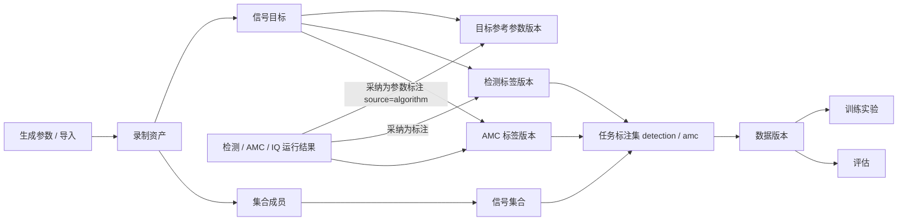
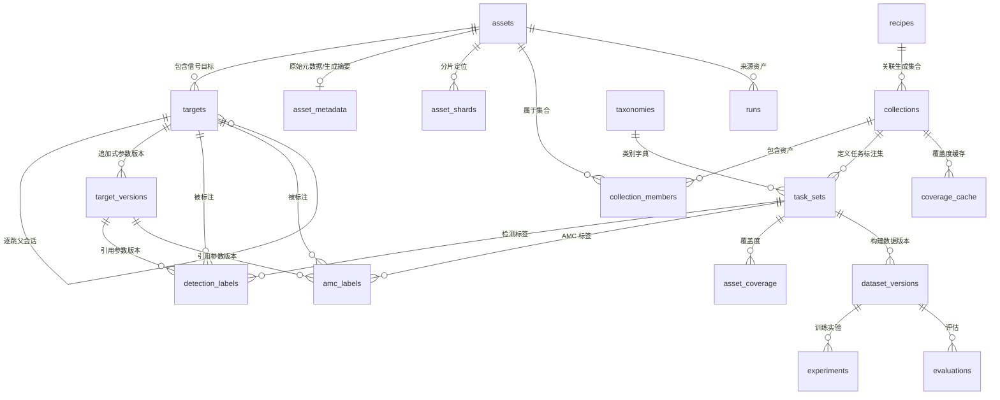

# 数据库设计（信号分析工作区）

更新日期：2026-10-01。

本文是信号分析工作区（`signal_analysis`）数据模型的权威设计：对象、表、字段、约束、版本语义、迁移与数据层验收口径。界面与行为说明见[基础工程实现与文件说明](基础工程实现与文件说明.md)与[电磁信号分析识别系统_Python技术方案](电磁信号分析识别系统_Python技术方案.md)；数据生成、训练与清单消费见[模型训练工作台](模型训练工作台.md)；清理与盘点口径见[数据管理页面](数据管理页面.md)。

## 1. 设计目标与约束

| 编号 | 约束 | 对设计的影响 |
| --- | --- | --- |
| C1 | 单人标注，无审核环节，支持重新标注 | 标注追加式版本化：新版本成为当前标注，旧版本保留；数据版本固定所用版本；不做协作、状态流转、审核 |
| C2 | 一个资产可属于多个集合 | 集合成员多对多；标注挂在资产的目标上，同一资产在不同集合共享同一份真值 |
| C3 | 需要跳频逐跳精确评估 | 目标带采样点级时间范围与父子关系；会话与逐跳两种粒度分开评估 |
| C4 | 训练数据可能超过 2 万条 | 分片存储 + 偏移/键集分页；训练样本由数据版本清单派生，**训练样本不等于资产行** |
| C5 | “信号识别”指时频图检测，AMC 指通信制式识别 | 两类任务的标签格式、类别字典、数据版本独立 |
| C6 | 每个信号分别标识检测与 AMC 适用性 | `targets.for_detection` / `for_amc` + 任务专用标签表 |
| C7 | 生成数据需可配置、可复现、可统计 | 生成参数（内部配方）表 + 覆盖度缓存；生成产物自带目标参考参数 |

明确排除（本期不做）：

- 覆盖式写入或“结论只留最新一条”：无法固定训练所用的标注版本；改为追加式版本 + 数据版本引用版本号。
- 逐字段 `field_meta_json`：只保留版本级别的 `source`（来源）。
- 多人审核、冲突裁决、标注分配、协作与服务端：单人标注下不需要。
- `storage_kind=recipe`（只存配方、按需重建）：依赖生成器版本长期稳定且无法逐位复现；`assets` 只存真实 IQ。

## 2. 概念模型

| 对象 | 表 | 说明 |
| --- | --- | --- |
| 录制资产 | `assets` | 一段不可变 IQ 记录，可在独立 NPY 或分片文件中 |
| 信号目标 | `targets` | 录制内一个信号：整条记录、跳频会话、单跳或片段；稳定身份，不含可变字段 |
| 目标参考参数 | `target_versions` | 目标的物理参数（频率、带宽、时间、SNR 等）的追加式版本 |
| 信号集合 | `collections` / `collection_members` | 资产的逻辑分组，多对多，不复制 IQ |
| 任务标注集 | `task_sets` / `taxonomies` | 集合 × 任务（`detection` / `amc`）× 类别字典 |
| 检测标签 / AMC 标签 | `detection_labels` / `amc_labels` | 各自一张表，各自追加式版本化 |
| 覆盖度 | `asset_coverage` | 录制是否完整检查过、是否为确认无目标的负样本 |
| 数据版本 | `dataset_versions` | 固定成员、标签版本、划分、预处理的不可变清单 |
| 生成参数（内部配方） | `recipes` | 数据生成的参数分布、随机种子、分层配额，可复现 |
| 实验与评估 | `experiments` / `evaluations` | 训练实验索引与评估结果 |
| 运行记录 | `runs`（公共层） | 分析、检测、识别等运行结果；算法结论保存在这里，不写标签表 |



## 3. 实体关系



关系要点：

- **多对多**：资产 ↔ 集合（`collection_members`，带顺序 `position`）；标注不挂在成员上，因此同一资产在任何集合里看到同一份当前标注。
- **父子**：`targets.parent_target_id` 只用于 `scope='hop'` 指向所属会话（`scope='session'`），`hop_index` 从 0 起、按时间排序。
- **引用固定版本**：`detection_labels` / `amc_labels` 都必须引用某个 `target_versions` 行，框范围与提取范围取自该版本；数据版本清单记录标签版本号，后续重新标注不影响已建数据版本。
- **追加式**：`target_versions`、`detection_labels`、`amc_labels`、`asset_coverage` 只增不改；每个目标/资产取最大 `version_no` / `revision_no` 为“当前”。
- **结果与真值分离**：算法输出只进 `runs`/`evaluations`；“采纳为参数标注”才以 `source=algorithm` 追加目标参数版本与标签（§5.3）。

## 4. 表设计明细

### 4.1 `assets`（录制资产）

保留既有九列（`id, name, path, sha256, sample_rate, sample_count, created_at, source, label`），新增：

| 字段 | 说明 |
| --- | --- |
| `source_kind` | `imported / generated / derived / legacy`（来源分类；`source` 保留原始来源字符串） |
| `sample_kind`、`dtype` | 复数或实数、存储类型（当前统一 `complex` / `complex64`） |
| `storage_kind` | `file`（独立 NPY）或 `shard`（分片内偏移） |
| `shard_id`、`shard_offset`、`shard_length` | `storage_kind=shard` 时的定位（单位：采样点） |
| `origin_group_id` | 同一次采集或同一生成场景的分组键，用于划分防泄漏 |
| `parent_asset_id` | 裁剪、变换得到的衍生资产的直接父资产 |
| `rf_center_hz`、`capture_started_at` | 采集射频调谐中心、采集时间；采集时间不手工填写：标注清单 CSV 可逐文件携带（同一文件各行须一致），缺省记本批导入时间 |
| `created_by`、`updated_at`、`archived_at` | 审计与逻辑归档（`archived_at` 非空即归档，不物理删除） |

### 4.2 `asset_shards`（分片）

```sql
CREATE TABLE asset_shards (
    id TEXT PRIMARY KEY, name TEXT NOT NULL DEFAULT '', path TEXT NOT NULL UNIQUE,
    sha256 TEXT NOT NULL DEFAULT '', record_count INTEGER NOT NULL DEFAULT 0,
    size_bytes INTEGER NOT NULL DEFAULT 0, created_at TEXT NOT NULL, sealed_at TEXT
);
```

- 批量生成或批量导入写入分片（连续 complex64 原始数据，读取按偏移内存映射），封存后不可变；单分片可含多条录制。
- 每个资产仍有自己的 `sha256`；分片另有整体哈希与 `record_count`。
- **写入方式**：导入页默认按文件数自动切换——**≥ 20 个文件写分片**（阈值可调），少量文件写独立 NPY（便于人工检查与单条拷贝），也可强制独立/强制分片。
- 单条导入始终可用独立 NPY；分片按 1 GB 滚动切分列为后续（§12）。

### 4.3 `asset_metadata`（原始元数据 / 生成摘要）

`asset_metadata(asset_id, metadata_json)` 与 `assets` 一对一，和资产在同一事务中写入。保存导入的完整原始 SigMF 元数据或生成摘要（`generation`）；旧资产无记录时读取返回空对象。

### 4.4 `collections` / `collection_members`（信号集合）

```sql
CREATE TABLE collections (
    id TEXT PRIMARY KEY, name TEXT NOT NULL UNIQUE, description TEXT NOT NULL DEFAULT '',
    source_kind TEXT NOT NULL,          -- manual | generated | imported | legacy
    recipe_id TEXT,                     -- 生成集合关联的配方
    created_by TEXT, created_at TEXT NOT NULL, updated_at TEXT NOT NULL, archived_at TEXT
);
CREATE TABLE collection_members (
    collection_id TEXT NOT NULL REFERENCES collections(id),
    asset_id TEXT NOT NULL REFERENCES assets(id),
    position INTEGER NOT NULL, added_by TEXT, added_at TEXT NOT NULL,
    PRIMARY KEY (collection_id, asset_id)
);
CREATE INDEX idx_members_asset ON collection_members(asset_id, collection_id);
CREATE INDEX idx_members_order ON collection_members(collection_id, position);
```

- `position` **从 0 开始**，`0` 是合法位置；新增成员取 `MAX(position)+1`。
- 任务标注集按集合划定“哪些资产参与该任务”，并决定使用哪个类别字典。
- “零散资产”定义为不在任何未归档集合中的资产，用查询表达。
- 从集合移出只删除成员行；永久删除资产是独立操作，需检查其他集合、标注、数据版本与运行的引用。

### 4.5 `targets` / `target_versions`（信号目标与参考参数）

```sql
CREATE TABLE targets (
    id TEXT PRIMARY KEY, asset_id TEXT NOT NULL REFERENCES assets(id),
    target_key TEXT NOT NULL,           -- 资产内稳定键，如 s0、s0.h3
    scope TEXT NOT NULL,                -- whole_record | session | hop | segment
    parent_target_id TEXT REFERENCES targets(id),   -- hop 指向 session
    hop_index INTEGER,                  -- hop 在会话内序号（从 0 起）
    for_detection INTEGER NOT NULL DEFAULT 0,
    for_amc INTEGER NOT NULL DEFAULT 0,
    created_at TEXT NOT NULL,
    UNIQUE (asset_id, target_key)
);
```

`target_versions`（追加式，只增不改）：

```sql
CREATE TABLE target_versions (
    id TEXT PRIMARY KEY, target_id TEXT NOT NULL REFERENCES targets(id),
    version_no INTEGER NOT NULL, supersedes_id TEXT,
    source TEXT NOT NULL,               -- generator | import | manual | external | algorithm
    created_at TEXT NOT NULL, note TEXT,
    sample_start INTEGER, sample_end INTEGER,
    f_low_hz REAL, f_high_hz REAL, center_hz REAL, bandwidth_hz REAL,
    nominal_center_hz REAL, nominal_bandwidth_hz REAL,
    signal_type TEXT, waveform_mode TEXT, modulation TEXT,
    symbol_rate_baud REAL, hop_rate_hz REAL, is_hopping INTEGER,
    snr_db REAL, snr_definition TEXT, power_dbfs REAL, params_json TEXT,
    UNIQUE (target_id, version_no)
);
```

| 字段组 | 约定 |
| --- | --- |
| `sample_start, sample_end` | 半开区间 `[start, end)`，单位采样点，可空（整条记录）；`end` 不得超过资产 `sample_count` |
| `f_low_hz, f_high_hz` | 相对基带零点的占用频带，可为负；`center_hz`、`bandwidth_hz` 为边界派生值并在写入时校验一致，派生值舍入到 6 位小数（与评估口径一致） |
| `nominal_center_hz, nominal_bandwidth_hz` | 生成器或发射配置中的名义值，与实测占用分开 |
| `signal_type, waveform_mode` | 上层属性与生成样式（如 `fh_rc`）；不强行等同于 AMC 类别 |
| `modulation` | 规范调制名，未知为 `NULL`；为自由文本，A09 之外的规范名（如 `AM`）同样保留 |
| `symbol_rate_baud, hop_rate_hz, is_hopping` | 符号率、跳速、是否跳频（`NULL` 表示未知） |
| `snr_db, snr_definition, power_dbfs` | 口径默认 `inband_snr_v1`；功率为数字满刻度 |
| `params_json` | 样式专有参数（滚降、调制指数、跳频点表等） |

约束：**未知一律为 `NULL`，不使用 0 代替**；`modulation=NULL` 是“尚未知晓”，与“字典之外”不同。

逐跳信息：跳频会话一行 `scope='session'`，每跳一行 `scope='hop'`，带 `parent_target_id` 与 `hop_index`。生成资产的逐跳时间与频率来自生成器跳频调度；实采数据由人工标注或外部元数据给出，缺失时只能做会话级评估。

### 4.6 `taxonomies` / `task_sets`（类别字典与任务标注集）

```sql
CREATE TABLE task_sets (
    id TEXT PRIMARY KEY, collection_id TEXT NOT NULL REFERENCES collections(id),
    task TEXT NOT NULL,                 -- detection | amc
    name TEXT NOT NULL, taxonomy_id TEXT NOT NULL REFERENCES taxonomies(id),
    label_semantics TEXT,               -- 仅检测：session_v1 | per_hop_v1
    created_by TEXT, created_at TEXT NOT NULL,
    UNIQUE (collection_id, task, name)
);
CREATE TABLE taxonomies (
    id TEXT PRIMARY KEY, task TEXT NOT NULL, name TEXT NOT NULL, version TEXT NOT NULL,
    classes_json TEXT NOT NULL,         -- 有序类别表（顺序即模型输出下标）
    mapping_json TEXT,                  -- 外部类名映射，如 TorchSig → 项目类别
    UNIQUE (task, name, version)
);
```

- AMC 类别字典固定为 A09 六类：FM、SSB、2ASK、QPSK、16QAM、64QAM；字典之外的信号记为 `out_of_taxonomy`。
- 检测任务当前类别为 `emitter`；`label_semantics` 决定标签是会话级（`session_v1`）还是逐跳（`per_hop_v1`）。

### 4.7 `detection_labels` / `amc_labels`（任务标签）

```sql
CREATE TABLE detection_labels (
    id TEXT PRIMARY KEY, task_set_id TEXT NOT NULL REFERENCES task_sets(id),
    target_id TEXT NOT NULL REFERENCES targets(id),
    revision_no INTEGER NOT NULL, supersedes_id TEXT,
    source TEXT NOT NULL,               -- generator | manual | external | algorithm
    created_at TEXT NOT NULL,
    label_semantics TEXT NOT NULL,      -- 与 task_sets 一致
    class_name TEXT,                    -- 检测类别，当前为 emitter
    target_version_id TEXT NOT NULL REFERENCES target_versions(id),
    include INTEGER NOT NULL DEFAULT 1, -- 0 表示明确不作为检测目标（负标注）
    note TEXT,
    UNIQUE (task_set_id, target_id, revision_no)
);
CREATE TABLE amc_labels (
    id TEXT PRIMARY KEY, task_set_id TEXT NOT NULL REFERENCES task_sets(id),
    target_id TEXT NOT NULL REFERENCES targets(id),
    revision_no INTEGER NOT NULL, supersedes_id TEXT,
    source TEXT NOT NULL, created_at TEXT NOT NULL,
    class_name TEXT,                    -- 字典内类别名
    class_state TEXT NOT NULL,          -- known | unknown | out_of_taxonomy
    window_start INTEGER, window_end INTEGER,
    analysis_center_hz REAL, analysis_bandwidth_hz REAL,
    target_version_id TEXT NOT NULL REFERENCES target_versions(id),
    note TEXT,
    UNIQUE (task_set_id, target_id, revision_no)
);
```

说明：

- **检测标签不存归一化框坐标**。框由目标的物理范围经项目唯一的 `band_to_box` 生成，随图像参数（`nfft`、图像尺寸）不同而不同，在构建数据版本时计算；与 `ingest_torchsig.py` 的做法一致（不使用外部 `yolo_label`）。
- **AMC 标签保存提取范围**（`window_start/end`、`analysis_center_hz/analysis_bandwidth_hz`，空则用目标范围）。多目标录制按目标提取 IQ 窗口，一个混合 IQ 不会得到一个单类标签。
- `class_state`：`known`（映射到字典）、`unknown`（尚未标注）、`out_of_taxonomy`（有调制名但不在字典，保留原名，不丢样本）。
- **当前标签**：同一任务标注集内每个目标取最大 `revision_no`；重新标注即追加新版本，不修改旧行。

### 4.8 `asset_coverage`（覆盖度与负样本）

```sql
CREATE TABLE asset_coverage (
    task_set_id TEXT NOT NULL REFERENCES task_sets(id),
    asset_id TEXT NOT NULL REFERENCES assets(id),
    coverage TEXT NOT NULL,             -- unknown | partial | complete
    negative_kind TEXT,                 -- 仅 complete 且无目标时有效
    source TEXT NOT NULL, created_at TEXT NOT NULL,
    PRIMARY KEY (task_set_id, asset_id, created_at)
);
```

- 资产刚导入、没有任何标签：状态“待标注”，**不能当负样本**。
- 录制完整检查过、确认无目标：在检测任务下记 `coverage=complete` 的“空标注”记录。
- 数据版本只纳入 `coverage=complete` 的录制用于检测训练；`partial` 的录制不能用于漏检统计。

### 4.9 `recipes`（生成参数，内部格式 `gen_recipe_v1`）

```sql
CREATE TABLE recipes (
    id TEXT PRIMARY KEY, name TEXT NOT NULL, engine TEXT NOT NULL,
    recipe_json TEXT NOT NULL, recipe_sha256 TEXT NOT NULL,
    created_by TEXT, created_at TEXT NOT NULL
);
```

配方不可变，修改即新建；结构、抽样与预览规则见[模型训练工作台](模型训练工作台.md)。

### 4.10 `dataset_versions`（数据版本）

```sql
CREATE TABLE dataset_versions (
    id TEXT PRIMARY KEY, task_set_id TEXT NOT NULL REFERENCES task_sets(id),
    version_no INTEGER NOT NULL, manifest_path TEXT, manifest_sha256 TEXT,
    status TEXT NOT NULL,               -- building | ready | failed
    sample_count INTEGER NOT NULL DEFAULT 0, asset_count INTEGER NOT NULL DEFAULT 0,
    split_json TEXT, preprocessing_json TEXT, taxonomy_snapshot_json TEXT,
    card_json TEXT, created_at TEXT NOT NULL,
    UNIQUE (task_set_id, version_no)
);
```

- 清单契约 `dataset_manifest_v1`，逐行一个训练样本；行字段、划分规则与训练消费方式见[模型训练工作台](模型训练工作台.md)的“数据版本与清单”。
- 清单流式写入临时文件，校验后置 `ready`；取消不留下半成品；训练只读 `ready` 版本，之后的重新标注不影响已建版本与已启动实验。

### 4.11 `experiments` / `evaluations`（实验与评估）

```sql
CREATE TABLE experiments (
    id TEXT PRIMARY KEY, task TEXT NOT NULL, dataset_version_id TEXT,
    config_json TEXT, status TEXT NOT NULL, output_path TEXT,
    model_sha256 TEXT, created_at TEXT NOT NULL, finished_at TEXT
);
CREATE TABLE evaluations (
    id TEXT PRIMARY KEY, dataset_version_id TEXT, experiment_id TEXT,
    model_sha256 TEXT, contract TEXT NOT NULL, config_json TEXT,
    metrics_json TEXT, result_path TEXT, created_at TEXT NOT NULL
);
```

权重与大结果留在文件系统，表里只存索引、摘要与哈希。

### 4.12 `coverage_cache`（覆盖度缓存）

`coverage_cache(collection_id, recipe_id, axis, bin, count)`，可重建；用于集合统计页展示各轴直方图、最少格子计数与空格子。

### 4.13 `runs`（公共运行记录）

公共层表：`id, kind, created_at, source_id, result_json, plots_path…`。分析、检测、跳频、调制识别等结果都写这里，**算法结论不直接进标签表**；`source_id` 指向来源资产（有资产时）。

## 5. 版本与标注语义

### 5.1 追加式版本与当前版本

1. 没有草稿、提交、审核状态。保存即生效，同一目标在同一任务标注集内的最新 `revision_no` 为当前标签。
2. 重新标注 = 追加新版本，`supersedes_id` 指向上一版本；旧版本不修改、不删除，可查看与回退（回退也是追加一个内容相同的新版本）。
3. 数据版本固定其构建时使用的版本号，之后的重新标注不影响已有数据版本与实验；界面提示“标注已变更，数据版本可能过期”。
4. 目标参考参数同样追加式：重新标注若修改频带或时间范围，先追加新的参数版本，标签再引用它。

### 5.2 目标的生成与适用标记

| 来源 | 目标与参数 | 适用标记 |
| --- | --- | --- |
| 生成资产 | 存储层按生成摘要一次写全会话目标与参考参数（`source=generator`）；真值行与 `signal_truth` / `hop_truth` 同源，跳频样式同时写逐跳目标 | `for_detection=1`；`for_amc=1` 当生成样式有规范调制名（跳频与演示样式为 0） |
| 导入资产 | 目标来自导入页或 CSV 标注清单的显式目标行（`source=import`）；未声明目标的资产保持“待标注”，**不自动建占位目标** | `for_detection=1` 当且仅当给出频率范围；`for_amc=1` 当且仅当给出调制 |
| 旧库回填 | 无生成元数据的存量资产写“未知”占位目标（物理参数全 `NULL`） | 两个标记置 1 |
| 采纳 | 由“采纳为参数标注”以 `source=algorithm` 追加（§5.3） | 按结果内容重算：检测带频带 → `for_detection=1`；识别有类别/调制 → `for_amc=1` |

需要改变既有目标的适用标记时，用 `update_target_flags` 补开或关闭。

### 5.3 采纳为参数标注

算法结论、模型预测不写入标签表，保存在 `runs` / `evaluations`。界面上的“采纳为参数标注”只追加 `source=algorithm` 的目标参考参数版本与标签，**不覆盖任何既有版本**：

- 检测结果：会话级框归并到该资产的会话/整条目标，逐跳框归并到对应 `hop` 子目标；同一资产同类目标只更新一次，新建目标只发生在没有可匹配目标时（匹配按中心频率距离与带宽门限、时间重叠）。
- AMC/IQ 结果：按 A09 字典映射为 `known`，字典外记 `out_of_taxonomy` 并保留原始标签名。
- 采纳产生的版本成为该目标的当前参数与当前标注，之后的检测/AMC/IQ 比较与真值评分自动跟随新版本（§6）。

### 5.4 未知、负样本与覆盖

见 §4.8。补充约定：`include=0` 的检测标签表示该目标明确不作为检测目标（负标注）；纯噪声录制通过“完整覆盖且无目标”表达。

### 5.5 类别状态约定

| 状态 | 含义 | 处理 |
| --- | --- | --- |
| `known` | 调制名映射到类别字典 | 参与该任务统计与训练 |
| `unknown` | 尚未标注或调制未知 | 计入“待标注”，不进训练 |
| `out_of_taxonomy` | 有调制名但不在字典（如 `AM`、跳频样式） | 保留原名并统计，不丢样本；AMC 训练默认不纳入 |

## 6. 真值与评估读取口径

- 真值优先读目标的**当前参考参数版本**：会话/整条/片段目标 → 会话级真值；`scope='hop'` 目标 → 逐跳真值；没有可用参数时才退化为生成器摘要。
- 生成资产的会话与逐跳目标由生成摘要一次写全，与摘要真值逐位一致，因此两条路径结果相同；重新标注（含采纳）后比较与评分随当前版本变化。
- 导入的实采数据以显式目标行或逐跳人工标注为准；无参数的目标在评估中直接跳过，不猜测。
- 逐跳评估契约 `per_hop_eval_v1`（时间-频率 IoU + 一对一匹配、起止/驻留/频率误差、跳速与频道序列一致率、分组报表、不可比较原因）见[信号检测：跳频逐跳参数估计](algorithms/信号检测_跳频逐跳参数估计.md)。

## 7. 索引与分页

| 场景 | 索引 / 方式 |
| --- | --- |
| 资产列表 | `(created_at, id)`；深页浏览用键集分页，页码跳转用偏移分页 |
| 集合内资产 | `(collection_id, position, asset_id)`；`(asset_id, collection_id)` 反向查询 |
| 目标与标签 | `targets(asset_id)`；`target_versions(target_id, version_no)`；标签表 `(task_set_id, target_id, revision_no)` |
| 统计筛选 | `target_versions` 上为 `modulation`、`waveform_mode`、`snr_db`、`bandwidth_hz` 建索引 |
| 分页口径 | 左侧资产列表 100/200/500 每页；统计在全体筛选结果上用聚合 SQL 计算，不依赖当前页 |
| 写入 | 批量写入按批提交（每批数百条），不逐条事务 |

## 8. 迁移与兼容

1. 公共层按 `project`（信号分析 / 通信仿真）区分数据库，用 `schema_migrations()` 声明有序迁移；版本为 `PRAGMA user_version`。
2. 升级前自动备份数据库到工作区 `backups/`；迁移可重复执行，以“已存在的行”判断是否跳过；拒绝打开高于当前代码版本的库。
3. 信号分析当前版本为 **schema v3**（v1=runs，v2=assets/asset_metadata，v3=全部新表与资产扩展列）。
4. 旧 `assets` 保持 ID、路径、哈希、备注不变，进入零散资产。
5. 有 `generation` 元数据的资产：写目标与参考参数（`source=generator`）；无元数据的写“未知”占位目标，不猜测。
6. 旧检测标注目录：登记为集合 + 检测任务标注集 + 历史数据版本（`raw_iq=false`，卡片注明无原始 IQ），合并 `samples.jsonl` 与 `annotations.json`，`source_asset_id` 能对上资产的建立成员关联、对不上的计数报告；可重复执行（幂等）。
7. 旧 `experiment.json` 与 `runs` 保持可读，能确定引用的补数据版本索引，其余标为 legacy。
8. 旧 IQ NPZ（处理后窗口）登记为衍生样本，不伪造成原始录制。
9. 新存储是唯一可编辑标注源；旧 JSON 只由导出适配器提供给训练脚本，不长期双向同步。

## 9. 容量与存储形态（摘要）

复数 IQ 每采样点 8 字节（complex64）。默认检测生成参数下，1 MHz × 0.2～0.5 s 的单条录制约 1.6～4 MB；`build_torchsig.py` 默认单条 262144 点约 2 MB。2 万条约 32～80 GB。AMC 窗口 1024 点 × 2 通道 float32 约 8 KB，2 万条约 160 MB。

- **AMC**：保存录制（或配方），训练窗口在构建数据版本时派生，不入 `assets`。
- **检测**：`build_dataset.py` 把每张 1024×1024 float32 图落成 `images/*.npy`（约 4 MB/张）。图像是 IQ 与预处理参数的确定性函数，数据版本里图像只作可选缓存，默认训练时按需渲染；是否改用 uint8 缓存涉及训练输入契约变更，需单独验证后再启用。
- 分片：按每分片 1000 条计，10 万条约 100 个分片文件，避免海量小文件；单分片目标大小 1 GB 的滚动切分为后续项。
- 上限取值、磁盘预留与文献依据见[模型训练工作台](模型训练工作台.md)与[训练硬件与时间参考](训练硬件与时间参考.md)。

## 10. 数据层验收场景

1. 同一资产加入两个集合，任一集合修改标注，另一集合看到同一份当前标注。
2. 对同一目标重新标注后，新版本成为当前标注，旧版本可查询；已建立的数据版本仍引用原版本。
3. 修改集合或标签后，已运行的实验仍绑定原数据版本。
4. 混合格式批次：同一导入清单内 NPY、CSV、二进制与 SigMF 各自填写解析参数并成功导入；缺采样率/类型/字节序的行被标红且不参与导入；失败文件留在清单、修正后可再次导入。
5. CSV 标注清单：匹配上的行按毫秒/秒换算成采样点并写入目标参考参数（`source=import`），未匹配或非法行逐条列出；同一文件多行产生多目标，`for_detection`/`for_amc` 按“有频带/有调制”分别置位；
   “采集时间”列逐文件生效（同一文件各行须一致，冲突行退回），缺省写导入时间，页面不提供手填入口。
6. 检测/AMC/IQ 结果“采纳为参数标注”：追加 `source=algorithm` 版本与标签而不覆盖旧版本，之后的比较与真值评分自动跟随新版本。
7. 旧数据库、旧标注目录和旧实验迁移后仍可读；无原始 IQ 的历史数据不会被当作完整录制。
8. 生成 2 万条配方集合：按分片存储，文件数远小于条数；左侧可翻到最后一页；统计不受当前页限制。

## 11. 实现状态

| 能力 | 落点 | 测试 |
| --- | --- | --- |
| 迁移框架：按项目声明有序迁移、升级前备份、可重复执行、拒绝更高版本库 | `src/common/storage.py` | `tests/analysis/test_schema_migration.py` |
| schema v3：资产扩展列与来源分类、分片 `asset_shards`（追加/封存/逐条哈希校验）、集合与成员、目标与参考参数版本、字典/标注集、覆盖、配方、数据版本、实验与评估表；计数与偏移/键集分页 | `src/signal_analysis/storage.py` | `tests/analysis/test_collections_store.py`、`test_schema_migration.py` |
| 标签数据层：追加式版本、`supersedes_id`、`include=0` 负标注、类别状态、采纳写入、覆盖度与完成率 | `src/signal_analysis/storage.py` | `tests/analysis/test_labels_store.py` |
| 数据版本构建：清单流式写入 + 哈希校验、按 `origin_group_id` 整组划分、`holdout` 留出、`coverage=complete` 限定、纯噪声负样本、初始标注 | `src/signal_analysis/datasets.py` | `tests/analysis/test_dataset_versions.py` |
| 逐跳评估：`per_hop_eval_v1` 匹配、误差与分组报表、不可比较原因 | `src/signal_analysis/evaluation.py` | `tests/analysis/test_hop_eval.py` |
| 旧数据迁移：旧标注目录 → 集合/标注集/历史数据版本、旧实验登记、分片资产按份额计量 | `src/signal_analysis/storage/maintenance.py`、`services/`、`cli.py` | `tests/analysis/test_legacy_migration.py` |
| 采纳为参数标注：检测/逐跳/AMC/IQ → 追加式版本与标签 | `src/signal_analysis/adoption.py` | `tests/analysis/test_adoption.py`、`test_adopt_gui.py` |
| 导入页数据入口：文件清单自动识别、目标行与 CSV 清单、标志位规则、失败保留、分片阈值 | `src/signal_analysis/ui/`、`services/` | `tests/analysis/test_import_gui.py` |
| 集合生成（表单 + 执行器，自动目标与标注）与训练页集合导出 | `src/signal_analysis/services/collection_gen.py`、`ui/pages/collection_gen_page.py`、`services/training_export.py`、`services/` | `tests/analysis/test_generate_collection_gui.py`、`test_collection_gen.py` |

## 12. 演进与待实现

- **生成器损伤扩展**（频偏、相位噪声、IQ 不平衡、多径、独立符号率）：参数进入 `params_json` 与生成摘要；默认关闭且逐位不变，需通过数值等价回归（阶段 3）。
- **配方执行器**：按配方批量生成、样本级种子并行/续跑、覆盖度回写 `coverage_cache`；配方预览与执行器共享同一抽样实现（阶段 4）。
- **TorchSig 批量导入**：bundle → 分片资产 + `targets`/`target_versions`（`source=external`）+ 显式类名映射（阶段 4）。
- **训练侧消费数据版本清单**：目前 `datasets.read_manifest` 已提供读取接口，训练脚本接线待做（阶段 6）。
- **评估结果入库界面**：`evaluations` 表与 `register_evaluation` 已可用，界面展示待做（阶段 7）。
- **逐跳人工标注 UI**：实采跳频在检测页逐跳加框，保存为 `hop` 目标（阶段 5）。
- **导入页第二步**：文件夹导入 >500 文件的分块提交与进度、单分片按 1 GB 自动滚动切分、“多目标”编辑对话框。
