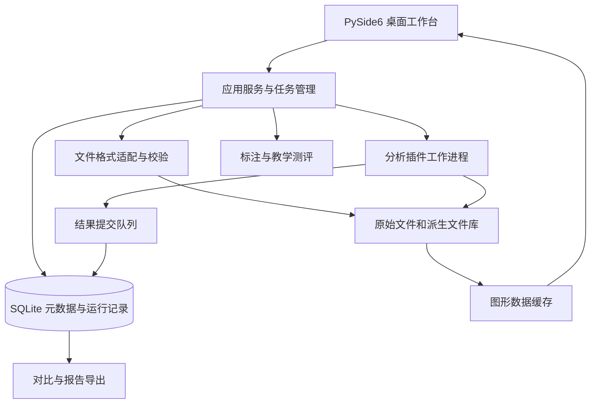

# 电磁信号分析识别系统 Python 技术方案

更新日期：2026-09-07。

基础代码已实现 NPY/CSV 导入、数学演示、均值/RMS/峰值、PSD/STFT、四类图形、资产备注、运行历史、报告和原生复制插件。正式检测、参数估计、调制识别、区间标注及教学测评尚未实现。逐文件说明及测试记录见[基础工程实现与文件说明](基础工程实现与文件说明.md)；下文为完整目标方案。

当前独立实现位于 `src/signal_analysis`，桌面入口为 `apps/analysis_desktop/main.py`。通过 `python -m signal_analysis gui` 单独启动，具有独立数据目录与发布清单，未包含另一项目业务页面。

## 1. 目标与依据

依据：[电磁信号智能侦测与分析识别系统技术方案.docx](电磁信号智能侦测与分析识别系统技术方案.docx)。
实现以 Python 为主的在线/离线桌面分析平台，完成文件导入、科学数据可视化、分析算法接入、结果对比、标注管理和教学测评。业务层、任务层和算法层分离，保证数据及运行结果可以追溯。

本文提供通用数据分析与软件架构设计，算法部分定义能力边界、输入输出及验证责任，不展开实装侦察算法优化。原文中的统计识别及深度网络属于待验证的算法方案，不能仅凭文字描述认定达到工程性能。

### 1.1 需求追踪

| 编号 | 原文要求 | 本方案对应模块 | 验收证据 |
| --- | --- | --- | --- |
| A01 | 外部采集设备数据导入 | 格式适配器、导入任务 | 各约定格式的参考样本及导入报告 |
| A02 | 至少时频图、瀑布图两种显示及标注 | 可视化、标注工作台 | 图表交互、单位与标注回读测试 |
| A03 | 集成检测、参数估计、自动调制识别 | 分析插件运行器 | 接口一致性、运行记录及结果评估 |
| A04 | 人工选择不同内置算法辅助识别 | 算法对比工作台 | 相同输入下的独立结果和耗时 |
| A05 | 随机调取信号、人工识别并与标注比对 | 信号识别训练模块 | 随机样本展示、隐藏标注、答案输入、正误与正确答案显示 |
| A06 | Windows、麒麟跨平台 | 构建与部署 | 两类目标机独立安装和功能测试 |
| A07 | 数字调制信号不少于三个参数 | 参数结果模型 | 载频、带宽、符号速率的适用性及误差报告 |
| A08 | 数据集不少于 20,000 条 | 文件资产库、元数据库 | 导入、分页、查询、备份恢复测试 |
| A09 | 正文列出六类识别及双路径方案 | 类别字典、算法插件 | 六类覆盖及两路结果；性能另行约定 |
| A10 | 一般不少于 72 小时连续运行 | 任务和恢复机制 | 固定负载下的稳定性测试记录 |
| A11 | 软件、源代码、规定文档及第三方测试报告 | 交付管理 | 交付清单逐项签收 |
| A12 | 用户 DLL/SO 算法接入 | 原生适配器和工作进程 | 各目标平台加载与运行参考样例 |
| A13 | 原生插件故障隔离 | 工作进程监控 | 超时、ABI 错误、本机崩溃不使主程序退出 |
| A14 | 保留接口并提供示例 | C ABI、SDK、接入手册 | 用户可独立编译并接入示例 |
| A15 | 打包后仍可扩展算法 | 外置插件目录和版本管理 | 新增插件无需重打主程序 |
| C01～C03 | 核心二进制化、行为一致及源码交付 | 核心扩展构建与发布 | 无核心源码环境运行、双模式回归和独立源码包 |

A09 的六类按原文主体采用 FM、SSB、2ASK、QPSK、16QAM、64QAM。原文数据库示例另出现 AM；详细设计时统一类别字典。

### 1.2 设计基线与待确认内容

- **设计建议：** 第一条交付链路为离线文件导入、分析、展示、归档。保留设备适配接口；设备直连需协议、SDK、测试机和吞吐量要求。
- **要求：** 单机、Windows 与麒麟；原文配置包括 16 核 1.9 GHz、内存 16 GB 以上、600 GB 磁盘、显存 4 GB 以上及 1920×1080 显示。
- **待确认：** 操作系统具体版本、处理器架构、GPU 型号、文件大小分布、数据到达方式、模型权重和参考标签。
- **待确认：** 识别准确率、检测误报漏报、参数误差和处理速度的合格门限。“准确率 95%”之类待确认。

## 2. 总体架构

UI 主线程处理交互和绘制；导入、缓存计算和算法运行进入后台任务。分析运行器采用可终止的独立工作进程，文件读写由受控任务承担；不在 GUI 回调中处理整段 IQ 数据。

采用 Python 对象与消息队列进行本机调用，大数组通过只读文件引用或受控共享内存交接，小型状态和结果通过结构化消息交接，避免反复序列化大数组。

## 3. Python 技术选型

| 用途 | 建议 | 约束 |
| --- | --- | --- |
| UI | PySide6 / Qt Widgets | 先验证目标机 Qt 插件、字体、缩放及显卡环境 |
| 图表 | PyQtGraph；静态报告 Matplotlib | 绘图数据按视口裁剪，不加载全量历史数据 |
| 数据计算 | NumPy / SciPy | 封装数组类型和单位，版本经测试后锁定 |
| 数据管理 | sqlite3 + SQL 迁移脚本 | 单写入服务，文件资产不放进数据库大字段 |
| 长文件访问 | 二进制或 NPY，使用只读内存映射 | 明确 dtype、字节序、偏移和长度 |
| 算法运行 | Python 适配器 + ctypes 原生适配器 | 统一任务与结果结构；原生库在独立工作进程加载 |
| 核心模块编译 | Cython 扩展 `.pyd` / `.so` | 公开 API 稳定；按目标 CPython、系统及架构构建 |
| 神经网络运行 | PyTorch 参考环境；ONNX Runtime 为部署候选 | 转换后必须验证结果一致性；目标机不可用时不能宣称兼容 |
| 打包 | PyInstaller 目录式发布 | 每个操作系统和 CPU 架构分别构建、验收 |

Qt、NumPy 内存映射及 ONNX Runtime 的能力可参考官方说明；上述选型组合属于工程建议。[Qt for Python](https://doc.qt.io/qtforpython-6)、[NumPy memmap](https://numpy.org/doc/stable/reference/generated/numpy.memmap.html)、[ONNX Runtime](https://onnxruntime.ai/docs/execution-providers/)。

原文的 ResCNN-BiLSTM-Attention 作为待接入模型条目保留。

## 4. 模块设计

### 4.1 导入与文件资产

导入流程：选择格式 → 读取或补齐元数据 → 校验长度及数值 → 暂存文件 → 计算摘要 → 提交文件资产 → 写入元数据库。相同内容可以复用文件资产，不同采集描述保留独立记录。

首批格式建议支持“有明确元数据的交织 IQ 二进制”和 NPY；SigMF 可作为交换格式候选。不能依靠 `.bin`、`.dat` 扩展名推断采样率、I/Q 排列、量化比例或字节序。SigMF 提供采样数据与 JSON 元数据的组织方式。[SigMF 官方规范](https://sigmf.org/)。

导入校验覆盖截断文件、I/Q 长度不匹配、非法采样率、NaN/Inf、缺失元数据、中文路径及重复文件。失败条目记录具体原因，批次中其他合法条目可以继续。

原始数据保持不可变；预处理、裁剪及模型输入均作为派生资产记录其来源和配置。归一化数据不能用于回推未经标定的绝对电平。

### 4.2 分析插件

| 插件类型 | 接收 | 返回 | 工程边界 |
| --- | --- | --- | --- |
| 检测 | 数据片段引用、元数据、配置 | 状态、候选片段、分数、质量标志 | 分数是否具有概率意义须说明 |
| 参数估计 | 数据片段、参数定义 | 参数值、单位、有效性、失败原因 | 无法估计时返回空值，不以零值伪装成功 |
| 统计识别 | 数据引用、已验证配置 | 类别、分数、版本 | 适用范围及参考验证由模型说明给出 |
| 深度模型识别 | 数据引用、模型资产 | 类别分数、模型版本、运行信息 | 输入形状、类别顺序及预处理须与模型绑定 |

统一返回状态：`success / partial / unsupported / failed / cancelled`。插件声明名称、版本、输入约束、配置结构及资源需求；参数校验失败时不启动计算。

自动分析使用版本化工作流；辅助分析使用用户选定的插件列表。两种入口复用同一执行器。插件失败、超时或缺少权重时清楚显示失败状态，不能回退到随机输出或演示结果。

原文提出“双路径融合”。界面应先保留两路独立输出；若没有经过验证的统一判决规则，则把不一致结果标记为待复核，不能直接比较来自不同算法的原始分数大小并宣称最优。

#### 用户 DLL/SO 扩展

增加 `PythonPluginAdapter` 与 `NativePluginAdapter` 两种后端，复用算法选择、参数配置、运行记录及结果模型。后者通过 ctypes 调用符合约定 C ABI 的用户动态库，版本探测及加载也在工作进程中进行。库只能暴露 C++ 类或具有其他接口时，需要 C 包装或专用适配器。

插件包包含清单、平台动态库、依赖、参数说明及参考样例。生产 SDK 应明确 ABI 版本、实例生命周期、IQ 数据布局、结果所有权、错误码和资源释放；不在 ABI 上传递 Qt、Python 对象或 C++ STL。输入数组与结构化结果通过桥接器映射到已有数据及结果模型。

SDK 设计和示例范围见[补充方案](核心模块二进制化与原生插件接口方案.md)。当前[通用 float32 数据复制示例](../examples/native_plugin/README.md)已通过 `src/signal_analysis/plugins.py`、`src/common/tasks.py` 接入工作台，支持清单校验、子进程调用和派生资产保存；正式算法生命周期 SDK 仍需开发。

### 4.3 可视化和标注

工作台提供数据目录、参数区、图表区和任务区。时域波形、时频图及滚动瀑布图共享当前文件与选区；图表上标明时间基准、频率坐标、幅度或功率单位。

图形采用分辨率分级缓存：目录显示缩略图，打开文件读取当前时间区间，放大后读取较细的数据。瀑布图使用有界历史缓存。显示刷新频率与计算吞吐量分别统计。

STFT 图形可由 SciPy 的接口生成；窗口、时间轴、频率排列和标度应写入图形元数据，并验证复数输入的显示行为。[SciPy ShortTimeFFT](https://docs.scipy.org/doc/scipy/reference/generated/scipy.signal.ShortTimeFFT.html)。

标注记录区间、类别、备注、标注者及修订版本。原始标注、算法预测和人工复核结果分别保存；批量修改应产生新版本并可撤销。

### 4.4 数据评估与信号识别训练

机器模型评估与人工识别训练分别设计：前者输出模型评估报告；后者从数据集中随机调取信号，以时频图等形式展示，接收用户输入的调制类型，与标准标注比对并显示正误及正确答案。

模型评估应固定数据清单和版本，避免同源文件的相邻片段同时进入用于模型开发和独立验收的数据集合。标签来自参考来源或人工复核，模型预测不能自动充当真值。

识别训练支持原文所述的样本筛选、随机抽取、图形展示、屏蔽标准标注、人工输入及标注比对。工程建议：为便于复现训练过程，可保存随机种子、样本及标注版本、人工答案与比对结果。

### 4.5 报告与恢复

报告包含数据摘要、插件及模型版本、配置、参数值及单位、质量标志、各路结果、耗时、人工备注和图表。支持 HTML、CSV 和图片；如验收必须 Word/PDF，增加模板化导出并检查字体和分页。

任务状态持久化；意外退出后，将未完成任务标记为中断，允许按原配置重跑。文件与数据库分别完成写入后才将任务标记为成功，保留孤立暂存文件的检查与清理机制。

## 5. 数据与接口设计

### 5.1 领域对象

| 对象 | 必需字段 |
| --- | --- |
| SignalAsset | asset_id、相对路径、摘要、dtype、字节序、通道数、采样率、采样点数、元数据版本 |
| SignalSegment | asset_id、起始采样索引、采样点数、片段 ID |
| AnalysisJob | job_id、片段 ID、插件 ID/版本、模型摘要、配置摘要、状态、开始/结束时间 |
| ParameterValue | 参数名、value 或 null、unit、validity、reason、定义版本 |
| AnalysisResult | job_id、检测结果、参数集合、类别结果、质量标志、报告引用 |
| AnnotationRevision | 标注 ID、片段 ID、类别、区间、来源、修订号 |
| ExerciseAttempt（工程建议） | 训练记录 ID、样本 ID、标注版本、人工答案、正误比对结果、提交时间 |

`SignalAsset` 的设备中心频率、标定信息和采集时间允许缺失，但必须明确缺失状态。频率偏移、设备中心频率和射频频率使用不同字段，禁止只用一个含义不清的 `frequency` 字段。

调用关系定义为 `import_file → asset_id`、`submit_analysis → job_id`、`cancel_job → status`、`get_results → result`、`export_report → artifact_id`。算法只接收数据访问接口及配置，不直接修改标注表或 UI。

### 5.2 数据库关系

原文的五张核心表继续保留业务含义。工程设计增加 `analysis_run`、`signal_segment`、`model_artifact`、`dataset_version`；训练过程如需持久化追溯，可增加 `exercise_session` 和 `exercise_attempt`，不建立原文未要求的试卷及成绩单业务。

一个原始文件可以有多个片段；一个片段可以有多次运行；一次运行可以有多个插件结果。检测、参数和识别结果关联运行 ID，解决原文“原始文件与检测结果一对一”无法支持重复分析的问题。

对采集时间、数据集版本、类别、运行状态等常用条件建立索引。分页只加载元数据和缩略图，不加载 IQ 内容。数据库采用事务，集中写入；本地文件与数据库备份形成同一资产清单，恢复时验证摘要及引用完整性。Python 标准库提供 SQLite 访问及备份接口。[Python sqlite3](https://docs.python.org/3/library/sqlite3.html)。

## 6. 性能与容量

“20,000 条”是记录规模，不等于固定容量。设每条有 N 个复采样、每个 complex64 为 8 字节，则未压缩 IQ 容量为 `20,000 × N × 8` 字节。

| 示例口径 | 仅原始 IQ 的容量，十进制 |
| --- | --- |
| 原文模型输入示例：每条 1,024 个复采样 | 163.84 MB |
| 容量规划示例：每条 1,000,000 个复采样 | 160 GB |

两者相差近千倍，且尚未计入源文件副本、缓存、模型、报告和备份。因此不能仅根据条数判断 600 GB 磁盘足够。建立磁盘配额、缓存回收和导入前容量检查。

**验证目标：** 在约定的 20,000 条元数据测试库上，常用条件首屏查询 P95 不超过 1 秒；用户点击后 200 ms 内显示任务受理状态。算法完成时延、绘图时延和文件大小相关，应在目标机上建立独立基准后设定门限。

基准记录硬件、数据大小、缓存冷热状态、并发度、CPU/内存峰值、处理耗时和失败率。不要以只含 1,024 点的样本测试推导长文件或设备流处理能力。

## 7. 跨平台部署

至少定义 Windows x86_64 和指定麒麟版本/架构两个测试目标；若存在麒麟 ARM64 或其他处理器，分别验证，不统称为一个“国产化版本”。

部署包包含应用、运行时、已批准的依赖、配置模板、模型清单、示例数据及离线帮助。程序目录与可写的数据目录分离。初次启动检查目录权限、数据库迁移、图形组件和模型运行能力。

原文提出“拷贝到任意计算机运行”和“自动适配”。工程上应改为在明确支持矩阵中的机器免手工安装 Python；Windows 与 Linux 产物分别构建，系统动态库、驱动及 CPU 指令集仍是兼容性条件。[PyInstaller 构建限制](https://www.pyinstaller.org/en/stable/)、[PyInstaller 运行方式](https://www.pyinstaller.org/en/stable/operating-mode.html)。

GPU 加速作为经验证的可选运行配置；CPU 功能可运行并不证明其达到 GPU 模式下的吞吐量。模型不可运行时明确报错，不以部分功能启动冒充完整平台验收。

核心源码预留 Cython 编译边界，运行包收集编译后的核心扩展；源码按合同单独交付，保留重建材料。用户插件使用外置版本目录，安装后新增插件无需重新打包主程序。动态依赖和工作进程入口必须在冻结后的应用中验证，不能直接照搬开发环境的 `python worker.py` 启动方式。

完整编译、ABI 与源码交付约定遵循[二进制与原生插件补充方案](核心模块二进制化与原生插件接口方案.md)。PySide6 负责界面，不影响这两类二进制模块的选型。

## 8. 验收

| 项目 | 方法 | 判据来源 |
| --- | --- | --- |
| 导入 | 正常、截断、错误字节序、缺失元数据、重复样本 | 格式规范及参考输出 |
| 两种核心图形 | 同源片段联动、标注保存恢复、单位检查 | A02，固定参考样本 |
| 三个参数 | 分别统计适用样本、有效输出率与误差 | A07；误差门限待确认 |
| 六类识别 | 独立参考集合，报告每类结果和混淆矩阵 | A09；准确率门限待确认 |
| 检测 | 在约定有信号/无信号集合统计结果 | 误报漏报门限待确认 |
| 多算法 | 输入一致、结果可追溯、失败独立显示 | A03/A04 |
| 人工识别训练 | 随机调取样本、隐藏标注、输入答案、与标注比对后显示正误和正确答案 | A05 |
| 数据规模 | ≥20,000 条真实元数据记录及对应资产检查 | A08；另记录字节规模 |
| 稳定性 | 72 小时固定负载，观察内存、失败及恢复 | A10；负载模型须预先锁定 |
| 平台 | 每个目标平台独立安装、运行、导出及恢复 | A06 |
| 交付 | 源码构建、依赖清单、报告和手册核查 | A11 |
| 用户动态库 | 在约定 Windows/麒麟目标机加载用户参考库 | A12，正确结果及平台依赖记录 |
| 原生故障 | 版本错误、缺符号、依赖缺失、超时及崩溃 | A13，主程序仍可创建新任务 |
| SDK 示例 | 用户依据头文件和说明独立构建接入 | A14，布局与生命周期一致 |
| 安装后扩展 | 已打包应用新增和更新外置插件 | A15，任务版本可追溯 |
| 核心编译 | 开发模式与二进制模式回归、无源码运行 | C01～C03，源码包可重建 |

“不适用”和“无法估计”必须计数；不得通过剔除失败样本夸大精度或识别率。多类别总体准确率按正确样本数除以总样本数计算；同时报告各类别统计，避免原文二分类公式被机械套用于六类汇总。
