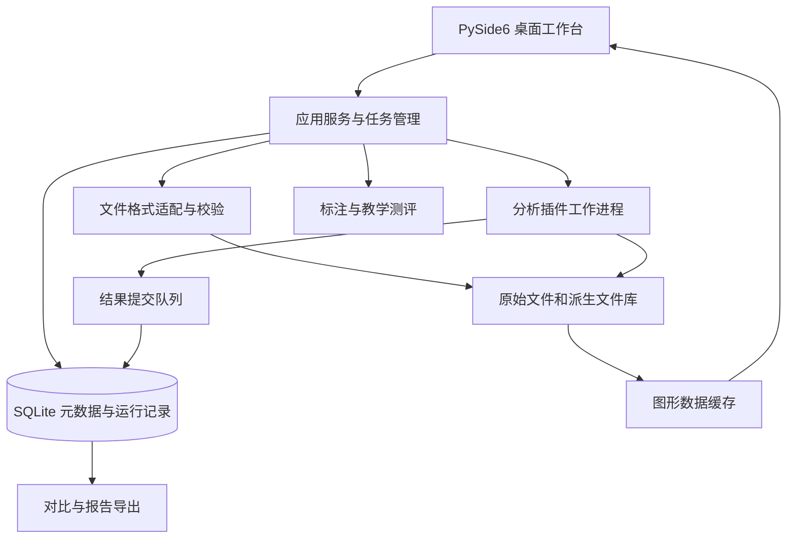

# 电磁信号分析识别系统 Python 技术方案

更新日期：2026-09-11。

本次补充：① 使用官方 `sigmf==1.11.1` 实现生成信号的 SigMF 双文件导出和导入，详见 §4.1；该功能已超出此前“交换格式候选”的规划状态。② 能量检测与三参数估计、可选 AI（ONNX Runtime）检测、A09 六类调制识别以及“算法对比”页与离线报告指标表均已实现并接线，接口契约、真值评分口径与实测指标见新增的 §4.6～§4.9；区间标注、教学测评与功率标定元数据仍未实现。

基础代码已实现 NPY/CSV/交织 IQ 二进制导入（二进制须显式指定数据类型与字节序）、数学演示、均值/RMS/峰值、PSD/STFT、四类图形（波形、功率谱、时频图或星座图、瀑布图）、资产备注、运行历史、报告、原生复制插件，以及信号 IQ 生成器（AM/FM/SSB/2ASK/QPSK/16QAM/64QAM/跳频 FH-2FSK 遥控、FH-OFDM 图传，多信号合成与带限噪声，作为检测、参数估计与调制识别算法的测试信号源）。分析提供一键概览与可调速实时播放两种方式；数字或模拟的判定为启发式，可在界面上手动纠正。检测与参数估计（能量基线）、AI 检测（ONNX Runtime，可选）、A09 六类调制识别（线性基线随包分发）、双路径并排对比与 HTML 报告指标表均已实现并冻结契约；**区间标注、教学测评、AM 解调后的消息侧带与功率标定元数据仍未实现**。逐文件说明及测试记录见[基础工程实现与文件说明](基础工程实现与文件说明.md)；下文为完整目标方案。

当前独立实现位于 `src/signal_analysis`，桌面入口为 `apps/analysis_desktop/main.py`。通过 `python -m signal_analysis gui` 单独启动，具有独立数据目录与发布清单，未包含另一项目业务页面。

## 1. 目标与依据

依据：[电磁信号智能侦测与分析识别系统技术方案.docx](电磁信号智能侦测与分析识别系统技术方案.docx)。
实现以 Python 为主的在线/离线桌面分析平台，完成文件导入、科学数据可视化、分析算法接入、结果对比、标注管理和教学测评。业务层、任务层和算法层分离，保证数据及运行结果可以追溯。

本文提供通用数据分析与软件架构设计，算法部分定义能力边界、输入输出及验证责任，不展开实装侦察算法优化。原文中的统计识别及深度网络属于待验证的算法方案，不能仅凭文字描述认定达到工程性能。

### 1.1 需求追踪

| 编号 | 原文要求 | 本方案对应模块 | 验收证据 |
| --- | --- | --- | --- |
| A01 | 外部采集设备数据导入 | 格式适配器、导入任务 | 各约定格式的参考样本及导入报告 |
| A02 | 至少时频图、瀑布图两种显示及标注 | 可视化、标注工作台 | 图表交互、单位与标注回读测试 |
| A03 | 集成检测、参数估计、自动调制识别 | 分析插件运行器 | 接口一致性、运行记录及结果评估 |
| A04 | 人工选择不同内置算法辅助识别 | 算法对比工作台 | 相同输入下的独立结果和耗时 |
| A05 | 随机调取信号、人工识别并与标注比对 | 信号识别训练模块 | 随机样本展示、隐藏标注、答案输入、正误与正确答案显示 |
| A06 | Windows、麒麟跨平台 | 构建与部署 | 两类目标机独立安装和功能测试 |
| A07 | 数字调制信号不少于三个参数 | 参数结果模型 | 载频、带宽、符号速率的适用性及误差报告 |
| A08 | 数据集不少于 20,000 条 | 文件资产库、元数据库 | 导入、分页、查询、备份恢复测试 |
| A09 | 正文列出六类识别及双路径方案 | 类别字典、算法插件 | 六类覆盖及两路结果；性能另行约定 |
| A10 | 一般不少于 72 小时连续运行 | 任务和恢复机制 | 固定负载下的稳定性测试记录 |
| A11 | 软件、源代码、规定文档及第三方测试报告 | 交付管理 | 交付清单逐项签收 |
| A12 | 用户 DLL/SO 算法接入 | 原生适配器和工作进程 | 各目标平台加载与运行参考样例 |
| A13 | 原生插件故障隔离 | 工作进程监控 | 超时、ABI 错误、本机崩溃不使主程序退出 |
| A14 | 保留接口并提供示例 | C ABI、SDK、接入手册 | 用户可独立编译并接入示例 |
| A15 | 打包后仍可扩展算法 | 外置插件目录和版本管理 | 新增插件无需重打主程序 |
| C01～C03 | 核心二进制化、行为一致及源码交付 | 核心扩展构建与发布 | 无核心源码环境运行、双模式回归和独立源码包 |

A09 的六类按原文主体采用 FM、SSB、2ASK、QPSK、16QAM、64QAM。原文数据库示例另出现 AM；详细设计时统一类别字典。`am` 与跳频样式不在字典内，遇到时计为“不适用”而不强行归类。

**当前进度（详细接口与实测数据见 §4.6～§4.9）：**

| 条目 | 现状 | 说明 |
| --- | --- | --- |
| A03 | 已实现 | 能量检测 + 中心频率/占用带宽/起止时间/带内信噪比 + A09 六类调制识别，界面与 CLI 同源 |
| A04 | 已实现（部分） | “算法对比”页可并排展示传统基线与 AI 检测、预测与真值；耗时史仍只在运行记录里 |
| A07 | 部分实现 | 中心频率、占用带宽、带内信噪比已有误差口径；**符号速率未做独立估计** |
| A09 | 已实现 | 六类字典、传统与模型两路结果；性能合格门限仍为待确认项 |
| A05 / A06 / A08 / A10 / A11 | 尚未实现 | 人工识别训练、双平台实测、两万条规模、72 小时长稳与交付签收均未开始 |

### 1.2 设计基线与待确认内容

- **设计建议：** 第一条交付链路为离线文件导入、分析、展示、归档。保留设备适配接口；设备直连需协议、SDK、测试机和吞吐量要求。
- **要求：** 单机、Windows 与麒麟；原文配置包括 16 核 1.9 GHz、内存 16 GB 以上、600 GB 磁盘、显存 4 GB 以上及 1920×1080 显示。
- **待确认：** 操作系统具体版本、处理器架构、GPU 型号、文件大小分布、数据到达方式、模型权重和参考标签。
- **待确认：** 识别准确率、检测误报漏报、参数误差和处理速度的合格门限。“准确率 95%”之类待确认。

## 2. 总体架构

UI 主线程处理交互和绘制；导入、缓存计算和算法运行进入后台任务。分析运行器采用可终止的独立工作进程，文件读写由受控任务承担；不在 GUI 回调中处理整段 IQ 数据。

采用 Python 对象与消息队列进行本机调用，大数组通过只读文件引用或受控共享内存交接，小型状态和结果通过结构化消息交接，避免反复序列化大数组。

## 3. Python 技术选型

| 用途 | 建议 | 约束 |
| --- | --- | --- |
| UI | PySide6 / Qt Widgets | 先验证目标机 Qt 插件、字体、缩放及显卡环境 |
| 图表 | PyQtGraph；静态报告 Matplotlib | 绘图数据按视口裁剪，不加载全量历史数据 |
| 数据计算 | NumPy / SciPy | 封装数组类型和单位，版本经测试后锁定 |
| SigMF 读写 | 官方 `sigmf==1.11.1` | 正式依赖；由适配层限定输入类型与容量，自动读取采样率 |
| 数据管理 | sqlite3 + SQL 迁移脚本 | 单写入服务，文件资产不放进数据库大字段 |
| 长文件访问 | 二进制或 NPY，使用只读内存映射 | 明确 dtype、字节序、偏移和长度 |
| 算法运行 | Python 适配器 + ctypes 原生适配器 | 统一任务与结果结构；原生库在独立工作进程加载 |
| 核心模块编译 | Cython 扩展 `.pyd` / `.so` | 公开 API 稳定；按目标 CPython、系统及架构构建 |
| 神经网络运行 | PyTorch 参考环境；ONNX Runtime 为部署候选 | 转换后必须验证结果一致性；目标机不可用时不能宣称兼容 |
| 打包 | PyInstaller 目录式发布 | 每个操作系统和 CPU 架构分别构建、验收 |

Qt、NumPy 内存映射及 ONNX Runtime 的能力可参考官方说明；上述选型组合属于工程建议。[Qt for Python](https://doc.qt.io/qtforpython-6)、[NumPy memmap](https://numpy.org/doc/stable/reference/generated/numpy.memmap.html)、[ONNX Runtime](https://onnxruntime.ai/docs/execution-providers/)。

原文的 ResCNN-BiLSTM-Attention 作为待接入模型条目保留。

## 4. 模块设计

### 4.1 导入与文件资产

导入流程：选择格式 → 读取或补齐元数据 → 校验长度及数值 → 暂存文件 → 计算摘要 → 提交文件资产 → 写入元数据库。相同内容可以复用文件资产，不同采集描述保留独立记录。

格式支持“有明确元数据的交织 IQ 二进制”、NPY 和 SigMF 双文件。SigMF 已通过官方 Python 库 `sigmf==1.11.1` 接入生成导出及文件导入，不自行实现 SigMF 编解码。不能依靠 `.bin`、`.dat` 扩展名推断采样率、I/Q 排列、量化比例或字节序。[SigMF 官方规范](https://sigmf.org/)、[官方 Python 库](https://github.com/sigmf/sigmf-python)。

基础版已实现：NPY（禁 pickle）、无表头 CSV（一列实数或两列 I,Q）及交织 IQ 二进制（`.bin/.raw/.iq`，int16 按 1/32768 缩放或 float32，大小端可选）；二进制文件不按扩展名猜测，必须由调用方显式给出数据类型与字节序。单文件上限 512 MiB、最多 16,000,000 个复采样。

导入校验覆盖截断文件、I/Q 长度不匹配、非法采样率、NaN/Inf、缺失元数据、中文路径及重复文件。失败条目记录具体原因，批次中其他合法条目可以继续。

#### 测试信号 IQ 生成

**SigMF 读写（已实现）：** 生成页选择“SigMF 双文件”，或在 CLI `generate` 的 JSON 规格中设置 `"export": {"format": "sigmf"}`，在 `exports/` 下保存同名 `.sigmf-meta` 和 `.sigmf-data`。由官方 `fromarray()` / `tofile()` 写出 `cf32_le`（I、Q 各为小端 float32，每个复采样 8 字节），不进行 int16 量化或削顶。元数据记录采样率、基带描述、起始采样索引；生成摘要（包括种子和推导参数）以 JSON 文本保存在标准 `core:description` 字段中，不创建非标准 `core:*` 字段，不虚构射频载频或采集时间。

导入可以选择双文件中的任意一个，另一文件必须同目录同名。官方 `fromfile()` / `read_samples()` 完成读取、校验和整数缩放；GUI 自动采用元数据采样率，忽略手动采样率框；CLI 的 `--sample-rate` 对 SigMF 可省略，显式提供时必须与元数据一致，其他格式仍须提供。支持单通道、连续 IQ 的 `cf32_le/be`、`cf64_le/be`、`ci16_le/be`；内部统一为 complex64，因此 cf64 导入会转换精度，ci16 由官方库归一化。暂不支持归档、集合、多通道、外部 dataset 引用、附加文件头/尾或必需的未知扩展。元数据上限 4 MiB、数据上限 512 MiB，并沿用 16,000,000 复采样上限；缺失采样率、文件缺失、截断、非法数值和已声明但不匹配的校验和均报错。

内部 IQ 资产仍存为 NPY；新增 `asset_metadata` 关联表保存导入的完整原始 SigMF 元数据或生成摘要，不把外部标注自动转为经复核的业务真值。原有资产无附加元数据时返回空对象。导出不覆盖已有文件，官方库先写暂存双文件，再以独占创建方式复制到目标位置，元数据最后写入；普通异常清理本次文件。双文件不保证跨文件原子提交，进程被强制终止时可能留下不完整文件，应在导出成功后再分发。

为检测、参数估计与调制识别算法提供可复现的测试信号源（A03/A04/A07/A09 的参考数据来源之一）：界面“IQ 信号生成”页与 CLI `generate` 命令按规格生成复基带 IQ 信号，支持 AM、FM、SSB、2ASK、QPSK、16QAM、64QAM，以及跳频信号（FH-2FSK 遥控样例、FH-OFDM 图传样例，均为通用测试波形，未验证具体设备协议）。IQ 为复基带记录，不设置载频；“频点”指基带频率偏移。可设置持续时间、采样率、随机种子、每信号平均功率（dBFS）与目标带宽；按调制样式自动推导消息带宽、频偏、符号速率、滚降成形、跳速与频点集合等参数，使实际占用带宽贴合目标带宽（跳频信号的目标带宽即整体频带范围，另可指定单跳带宽与跳频中心跨度）。支持一次 IQ 中包含最多 16 种信号并独立设置参数，以及带限背景噪声；噪声按**带内信噪比**口径折算（$N_0=P/B_n$，信号带内噪声取 $N_0\times$ 其实际占用带宽，填写值指最强信号的带内 SNR），纯噪声时按指定的平均功率（dBFS）。生成结果登记为数据资产，并可导出 NPY、CSV（两列 I,Q）或交织 IQ 二进制（int16/float32、大小端可选）。相同种子产生完全一致的信号，便于复现评测。

#### 信号生成原理与算法

生成入口为 `generate_iq(sample_rate, duration, signals, noise, seed)`，算法标识 `iq_generator_v1`，全部以 NumPy 实现（位于编译核心 `_numeric` 模块，随机性来自 `numpy.random.default_rng`）。总体流程：

1. 校验并解析参数：采样点数 `N = round(fs × T)`，限制 `1 ≤ N ≤ 16,000,000`，信号数最多 16；每个信号先经 `plan_signal` 完成参数校验与自动推导（GUI 参数对话框复用同一规则集）。
2. 用种子初始化父随机流，为每个信号派生独立子流，按调制样式合成复基带波形。
3. 每个信号搬移频点后按实测平均功率归一化到目标 dBFS，再线性叠加。
4. 按噪声规则生成带限复噪声并叠加。
5. 转存 `complex64` 并返回摘要（各信号实际参数、实际功率 `power_dbfs_actual`、噪声参数、`peak_dbfs` 等）。

**复基带与通用变换：** 时间轴为 $t[n]=n/f_s$。“频点”`offset` 是基带频率偏移，搬移公式：

$$
s[n]=b[n]\cdot e^{j2\pi f_0 n/f_s}
$$

其中 $b[n]$ 为调制后位于零频附近的基带波形。功率归一化在信号构造完成后统一进行，实测平均功率 $\bar{P}=\frac{1}{N}\sum|s[n]|^2$，目标平均功率为 $P_{\mathrm{dBFS}}$ 时乘以

$$
a=10^{P_{\mathrm{dBFS}}/20}/\sqrt{\bar{P}}
$$

归一化后该信号的平均功率恰为设定值；合成总功率为各分量功率之和（不同频段分量近似正交），峰值另计。

**带限噪声（消息与背景共用）：** 生成复白高斯噪声 $w[n]=w_r[n]+jw_i[n]$，$w_r,w_i\sim\mathcal{N}(0,1)$ 独立同分布；经 FFT 将频谱中超出目标频带的成分置零，再 IFFT 回时域，并按实测平均功率归一化到单位功率。噪声带宽按双边定义，滤波器截止取 `bandwidth/2`。带宽过小导致滤波后功率为零时报错，不输出退化数据。

**AM：** 消息为带宽 $B_m$ 的实数带限高斯噪声（默认 $B_m=B/2$，即实际占用带宽 $2B_m=B$），按峰值归一化后线性调制载波包络：

$$
s[n]=\left(1+m\cdot\frac{m(t[n])}{\max|m(t)|}\right)e^{j2\pi f_0 n/f_s}
$$

调制深度 $m\in[0.01,1]$，默认 0.8；实际带宽按 $2B_m$ 记录。

**FM：** 消息为带宽 $B_m$ 的实数带限高斯噪声（默认 $B_m=B/4$，且 $B_m<B/2$），先按 RMS 归一化再积分成相位：

$$
\phi[n]=\frac{2\pi\Delta f}{f_s}\sum_{k=0}^{n}\frac{m[k]}{\sigma_m},\qquad s[n]=e^{j(\phi[n]+2\pi f_0 n/f_s)}
$$

其中 $\Delta f$ 为 **RMS 频偏**（不是峰值频偏）。对高斯消息，实测 99% 功率占用带宽约 $B_{99}\approx 5.3\,\Delta f$（工程标定值，不套用单音 Carson 公式），自动模式取 $\Delta f=0.19B$ 使占用带宽贴合目标带宽；手动模式按 `5.3 × Δf` 回显实际带宽。

**SSB：** 直接在频域构造：白噪声频谱仅保留单边带区间（USB 为 $[f_0,f_0+B]$，LSB 为 $[f_0-B,f_0]$），IFFT 后归一化。实际带宽即 $B$，无载波分量。

**线性数字调制（2ASK/QPSK/16QAM/64QAM）：** 符号率按目标带宽推导：

$$
R_s=\frac{B}{1+\alpha},\qquad \mathrm{sps}=\left\lceil f_s/R_s\right\rceil,\qquad R_s^{\mathrm{actual}}=f_s/\mathrm{sps}
$$

$\alpha$ 为滚降系数（默认 0.35，范围 0.05～1）。星座均按单位平均功率归一化：QPSK 取 $\{\pm1\pm j\}/\sqrt{2}$；16QAM 取 $\{\pm1,\pm3\}^2/\sqrt{10}$；64QAM 取 $\{\pm1,\pm3,\pm5,\pm7\}^2/\sqrt{42}$。符号随机独立等概，经根升余弦（RRC）脉冲成形，滤波器按 8 个符号跨度截断并归一化为单位能量，时域以

$$
h(t)=\frac{\sin(\pi t(1-\alpha))+4\alpha t\cos(\pi t(1+\alpha))}{\pi t\left(1-(4\alpha t)^2\right)}
$$

计算（$t$ 以符号周期为单位），$t=0$ 处取 $1-\alpha+4\alpha/\pi$，$t=\pm 1/(4\alpha)$ 处取极限特值。RRC 成形实际带宽 $R_s(1+\alpha)$；2ASK 可选矩形脉冲（rect，实际带宽 $R_s$）。2ASK 符号取 $\{0,1\}$。

**跳频信号：** 频点集合可由用户显式给出 2～64 个频点，或自动在 `offset ± S/2` 内均布 `hop_count` 个频点（默认 8），其中 `hop_span`（跳频中心跨度 $S$）默认 $S=B-B_{\mathrm{hop}}$；单跳带宽 `hop_bandwidth`（$B_{\mathrm{hop}}$）默认 $S/\text{频点数}$，全部自动时取不动点解 $B_{\mathrm{hop}}=B/(\text{频点数}+1)$、$S=B\cdot\text{频点数}/(\text{频点数}+1)$，恒满足 $B=S+B_{\mathrm{hop}}$（$B$ 为整体频带范围 `bandwidth`，摘要中 `bandwidth_actual=S+B_{\mathrm{hop}}$）。频点间隔小于单跳带宽（频域重叠）或 $S+B_{\mathrm{hop}}>B$ 时报错。跳数 $H=\max(1,\min(\mathrm{round}(R_h N/f_s),N))$，时间轴均分为 $H$ 跳，每跳从频点集合随机（可重复）取一个频点并附加随机初相。

- **FH-2FSK（遥控）：** 跳速默认 100 hop/s。每跳内为 2FSK：双极性符号 $d[k]\in\{-1,+1\}$ 随机等概，按每跳带宽推导符号速率（默认 $R_s=B_{\mathrm{hop}}/2$）与频偏（默认 $\Delta f=B_{\mathrm{hop}}/4$），相位累积

$$
\phi[n]=\frac{2\pi\Delta f}{f_s}\sum_{k=0}^{n}d[k],\qquad s[n]=e^{j(\phi_0+2\pi f_h n/f_s+\phi[n])}
$$

- **FH-OFDM（图传通用测试样例）：** 目标驻留节奏默认 50 段/秒，参数名仍为 `hop_rate`。每段内拼接带循环前缀的 OFDM 符号，不代表真实图传协议帧：FFT 点数 $N_{\mathrm{FFT}}=\max(N_{\mathrm{sc}}+4,\ \mathrm{round}(f_s N_{\mathrm{sc}}/B_{\mathrm{hop}}))$，循环前缀 $N_{\mathrm{CP}}=\max(1,\mathrm{round}(c_p N_{\mathrm{FFT}}))$（$c_p$ 默认 0.25，上限 0.5）。激活子载波为 $\pm N_{\mathrm{sc}}/2$ 范围内除直流外的 $N_{\mathrm{sc}}-1$ 个子载波（默认 $N_{\mathrm{sc}}=64$），每个子载波独立 QPSK 调制，经 IFFT 并乘 $\sqrt{N_{\mathrm{FFT}}/N_{\mathrm{active}}}$ 后添加循环前缀；该中间系数不代表单位平均功率，最终仍按整段实测功率统一缩放。子载波间隔 $\Delta f_{\mathrm{sc}}=f_s/N_{\mathrm{FFT}}$，占用带宽 $(N_{\mathrm{sc}}-1)\Delta f_{\mathrm{sc}}$。

**噪声功率计算（带内信噪比口径 `inband_snr_v1`）：** 背景噪声为带宽 $B_n$ 的复带限高斯噪声（默认 $B_n=f_s$，即全带；范围 $0<B_n\leq f_s$），噪声总功率 $P_{\mathrm{noise}}$ 在 $B_n$ 内均匀分布，功率谱密度

$$
N_0=\frac{P_{\mathrm{noise}}}{B_n}
$$

有信号时，界面/规格中的 SNR 指**最强信号**（按实测平均功率 $P_{\mathrm{ref}}$ 判定，索引记入 `noise.snr_reference_index`；并列时取列表中靠前者）在同一占用带宽内的带内信噪比，噪声功率谱密度由参考信号反推：

$$
N_0=\frac{P_{\mathrm{ref}}}{B_{\mathrm{ref}}\cdot 10^{\mathrm{SNR}/10}},\qquad
P_{\mathrm{noise}}=N_0 B_n
$$

其中 $B_{\mathrm{ref}}$ 为参考信号的实际占用带宽 `bandwidth_actual`，SNR 默认 20 dB、范围 -60～120 dB。噪声以单位功率带限噪声乘以 $\sqrt{P_{\mathrm{noise}}}$ 叠加进记录。为免实测与填写值不符，噪声频带必须**完整覆盖**参考信号的占用频带（SSB 为单边带区间，其余样式以频点为中心；跳频信号按整体频带范围 $S+B_{\mathrm{hop}}$ 计），否则直接报错并提示所需的最小噪声带宽。

各信号（含参考信号本身）的带内 SNR 独立记录在摘要 `signals[].snr_inband_db`：

$$
\mathrm{SNR}_k=\frac{P_k}{N_0\cdot B_k^{\mathrm{overlap}}},\qquad B_k^{\mathrm{overlap}}=\left[\min(f_k^{\mathrm{high}},\tfrac{B_n}{2})-\max(f_k^{\mathrm{low}},-\tfrac{B_n}{2})\right]^+
$$

即只统计与噪声频带重叠的部分；完全落在噪声频带之外时该字段为 `null`（不输出 inf/nan）。因此多信号场景下只有参考信号的 SNR 等于填写值，其余信号按功率与占用带宽自然折算。跳频信号按整段会话的占用频带 $S+B_{\mathrm{hop}}$ 计，与"一段会话一个检测实例"的评测标签保持一致。

纯噪声（无信号）时直接按指定平均功率：

$$
P_{\mathrm{noise}}=10^{P_{\mathrm{noise,dBFS}}/10}
$$

（默认 -20 dBFS）。摘要记录噪声带宽、总功率 `power_dbfs`、功率谱密度 `power_dbfs_per_hz`、折算后的 `snr_db` 与口径标识 `snr_definition`，便于检测与参数估计环节复核。

**复现性约定：** 固定种子时，父流 `default_rng(seed)` 按信号**列表顺序**依次派生子流 `default_rng(parent.integers(0, 2**32))`，噪声使用父流后续状态；因此同一 `(seed, 信号列表及顺序, 噪声参数)` 产生逐位一致的采样。改变信号顺序会改变子流分配，不一定保持各信号波形不变。所有自动推导参数（消息带宽、频偏、符号速率、跳速、频点集合、FFT/CP 等）在生成前确定并写入摘要，使同一记录可复算和校验。

原始数据保持不可变；预处理、裁剪及模型输入均作为派生资产记录其来源和配置。归一化数据不能用于回推未经标定的绝对电平。

#### 频率切换、驻留时间与典型系统对比

本节用于理解当前测试波形与实际通信系统的差异，不新增真实协议仿真功能。**当前 FH-OFDM 定位为随机跳频 OFDM 通用测试样例；“图传”是场景标签，不是具体无人机协议的符合性声明。**

##### 概念与比较范围

| 概念 | 含义 | 不应混同的概念 |
| --- | --- | --- |
| OFDM 调制 | 在多个正交子载波上传输符号 | 不自动决定是否跳频、下一频点或驻留时间 |
| 周期跳频 | 按约定时间节奏改变工作频率 | 与随机选频不同，周期性描述时间、随机性描述频点选择 |
| 自动换信道 | 根据环境或配置选择工作信道 | 不能据此推断为固定毫秒周期的连续跳频 |
| 频域资源调度 | 在工作信道或载波内部为用户分配子载波、资源单元或资源块 | 不等于整条射频载波换到另一个中心频率 |
| 自适应选频 | 根据反馈更新频点选择或候选集合 | 不一定改变驻留时间；自适应驻留是另一项能力 |

OFDM 有效符号时长由子载波间隔决定，含循环前缀的完整符号还需加上前缀时长。协议时隙是资源调度的时间结构；驻留时间是一次选频后保持该频点的时间；视频帧周期由视频帧率决定。四者处于不同层次，不能由视频帧率或链路延迟推导跳频周期。

比较口径：无人机图传仅以 **DJI FPV** 的公开资料举例，不能泛化至其他机型；Wi‑Fi 比较 **802.11n/ac/ax 的 HT/VHT/HE 数据部分**，不包含早期 FHSS、802.11ah 或 Wi‑Fi 7；4G 比较**常规 LTE 单载波、15 kHz 子载波间隔**，不包含载波聚合、特殊物联网模式或 5G。设备能力和地区会限制实际可用信道与带宽。

##### 四类系统参数对照

表中“标准”表示指定比较范围内的标准参数，“设备”表示具名设备公开指标，“仿真”表示当前代码配置。未公开项不使用本仿真值代填。

| 指标 | 无人机图传：DJI FPV 公开示例 | Wi‑Fi：802.11n/ac/ax | 4G：常规 LTE 单载波 | 本仿真：FH-OFDM |
| --- | --- | --- | --- | --- |
| 调制与接入 | 所引用户资料不足以确定完整物理层及调制档位，不用本仿真的 QPSK 参数代替 | n/ac 为 OFDM；ax 支持 OFDM/OFDMA，数据星座随 MCS 变化（标准，见 W1/W2） | 下行 OFDMA；上行共享信道采用含 DFT 预编码的 SC-FDMA（标准，见 L1） | 独立随机 QPSK 子载波，无多用户接入协议 |
| 信道带宽 | 最大通信带宽 40 MHz（设备上限，不是每次传输必然占满，见 D1） | n：20/40 MHz；ac/ax：20/40/80/160 MHz，含适用的非连续 80+80 模式；受频段及设备限制（标准，见 W3） | 1.4/3/5/10/15/20 MHz，具体频段支持子集（标准，见 L2/L3） | 无固定标准带宽；`hop_bandwidth` 为每段名义带宽，默认由中心跨度除以频点数获得 |
| 子载波间隔 | 公开资料不足以确定 | n/ac：312.5 kHz；ax HE 数据部分：78.125 kHz（标准，见 W2/W3） | 本比较范围为 15 kHz（标准，见 L1 §5.2、§6.2） | `sample_rate / fft_size`，随生成配置变化 |
| OFDM 有效符号时长，不含 CP | 公开资料不足以确定 | n/ac：3.2 μs；ax HE：12.8 μs（标准，见 W2/W3） | 约 66.67 μs，即 1/(15 kHz)（由标准间隔推导） | `fft_size / sample_rate` |
| 时隙与帧 | 公开资料不足以确定协议时隙；视频帧周期不代表射频驻留周期 | 包交换与信道接入；数据包及发送机会长度依业务和配置变化，不设统一的跳频驻留时隙 | 常规结构：10 ms 无线帧、1 ms 子帧、0.5 ms 时隙；上下行安排区分 FDD/TDD（标准，见 L1 §4） | 将记录近似等分为驻留段；每段填充 OFDM 符号，没有协议帧头和收发时隙调度 |
| 频率变化方式 | 手动/自动信道模式；自动模式选择较优信道或频段，不能据此确定周期跳频规律（见 D2） | 在工作信道内通信，可进行信道调整；ax 的 RU 分配不等于中心频率跳变（见 W1/W4） | 资源块分配、适用的上行频率跳变发生在载波内；不能描述为整条宽带载波随机换频（见 L1 §5.3.4） | 每段独立随机选频点，允许重复，随机重置初相 |
| 每频点驻留时间 | 公开资料不足以确定统一数值，不能声称固定 20 ms | 不适用统一周期跳频驻留值；包长、信道停留时间与接入退避时隙是不同概念 | 无统一的整载波跳频驻留值；0.5 ms 时隙不能当作整载波驻留时间 | 默认目标 50 段/秒，通常约 20 ms/段；受记录长度及取整影响 |
| 自适应能力 | 自动选频不证明驻留时间也自适应；具体内部算法未由所引资料公开（见 D2/D3） | 可有速率、资源与信道配置调整，受代际和实现限制；不等于自适应跳频驻留（见 W1/W4） | 资源分配可随调度变化；资源格与帧结构本身不定义整载波驻留自适应（见 L1 §5.3.4、§6.2） | 不依据 SNR、干扰、丢包或业务负载反馈调整参数 |
| 采样率含义 | 厂商通信带宽不是 IQ 文件采样率 | 信道带宽不是任意采集设备的实际 IQ 采样率 | 信道带宽不是任意采集设备的实际 IQ 采样率 | GUI 默认 1 MS/s；需要覆盖所保存记录的整体频带，并留余量 |

无人机列只反映上述具名设备公开资料的边界。不能从“具有自动信道模式”推导其使用等概率选频、固定时隙或某种子载波布局，也不能把本样例的默认值用作设备识别的真实标签。

##### 当前驻留规律、符号填充与参数来源

依据 `src/signal_analysis/_numeric.py` 的 `_fh_hop_boundaries`、`_fh_video_link` 和 `_hop_points`，设采样点数为 N、采样率为 f_s，实际记录时长为 T，目标驻留节奏为 R_h：

$$
T=\frac{N}{f_s},\qquad
H=\max\left(1,\min\left(\operatorname{round}(R_hT),N\right)\right)
$$

$$
n_h=\operatorname{round}\left(\frac{hN}{H}\right),\quad h=0,\ldots,H,\qquad
T_h=\frac{n_{h+1}-n_h}{f_s}\approx\frac{T}{H}
$$

H 是驻留段数量，不是实际中心频率改变次数。每段长度因取整最多相差一个采样点；短记录的实际驻留时间不一定等于 1/R_h。这里的 `round` 对应代码中的 NumPy 取整。

| 当前配置 | 工程默认值或计算规则 | 含义与边界 |
| --- | --- | --- |
| `hop_rate` | 50 段/秒 | 通常约 20 ms/段；属于本仿真配置，不是无人机、Wi‑Fi 或 LTE 标准参数 |
| `hop_count` | 自动频点数默认 8，可配置 2～64 | 自动频点等间隔分布；每段独立抽取，允许连续同频 |
| `subcarriers` | 默认 64，对应默认实际激活 63 个子载波 | 直流置零，其余激活位置使用随机 QPSK；不是 Wi‑Fi 或 LTE 的导频/数据布局 |
| `cp_ratio` | 默认 0.25；CP 采样数按 FFT 点数乘比例取整，最少 1 点 | CP 与 FFT 点数一起决定完整符号时长，不定义驻留时隙 |
| 初相与反馈 | 每段随机初相；无自适应反馈 | 不保证跨段相位连续，未实现协议协商、重传或链路调度 |
| `sample_rate` | GUI 默认 1,000,000 个复采样/秒 | 来自 `gui.py` 的 IQ 生成页，不是实际射频采集硬件指标 |

连续两个驻留段若选到相同频点，频谱上可能看到约两段时长的同频占用，但内部仍重新生成符号及初相。这属于随机重复，不是根据链路质量延长驻留时间。

令带 CP 的一个 OFDM 符号占用 L 个采样：

$$
L=N_{\mathrm{FFT}}+N_{\mathrm{CP}},\qquad T_{\mathrm{symbol}}=\frac{L}{f_s}
$$

当前先划分驻留段，再在可容纳的段内填入整数个完整符号；尾部不足一个符号的部分补零。**这些零值不是已建模的协议保护时隙，也不能用来推导真实收发切换时间。** 现有代码对“驻留段短于一个完整符号”的情况未妥善处理，可能发生数组长度不匹配；本节记录此限制，不声称所有通过基础参数校验的组合都能生成，也不在本次文档修改中修复代码。

##### 带宽口径与复 IQ 采样边界

必须分别记录或解释：单跳名义带宽、跳频中心跨度、整体频带范围。当前实现中 `bandwidth` 即整体频带范围，频点自动均布在 `offset ± hop_span/2` 两端之间（`hop_span` 为跳频中心跨度，恒满足 `bandwidth = hop_span + hop_bandwidth`）。等宽频点集合包含两端时，整体规划带宽约为：

$$
B_{\mathrm{total}}=\max_h\left(f_h+\frac{B_h}{2}\right)-\min_h\left(f_h-\frac{B_h}{2}\right)
$$

$$
B_{\mathrm{total}}\approx B_{\mathrm{span}}+B_{\mathrm{hop}}
$$

显式指定频点时，应直接按频点集合计算范围，不把输入 `bandwidth` 或摘要中的 `bandwidth_actual` 当作已测量的整体占用带宽。当前 `occupied_bandwidth` 也是由激活子载波数与间隔计算的估计量；有限符号、矩形截断与段切换带来的旁瓣不包含在简单的频带边缘公式中。

对保存所有频点且使用固定频率参考的一份复 IQ 记录，规划频带应满足：

$$
\max_h\left(|f_h|+\frac{B_h}{2}\right)<\frac{f_s}{2}
$$

默认 1 MS/s 对应约 -500 kHz 至 +500 kHz 的一个数字频率区间，总宽度为 1 MHz，并非两侧各 1 MHz。工程中还应保留滤波过渡带和频谱余量。这里检查的是所保存的复基带频率，不是直接对 GHz 级射频载频套用采样率条件。

即使每个时刻只占一个频点，固定参考的完整记录仍需覆盖所有频点的位置；若逐段搬回零频另存，则需保留各段原频点与时间信息，不能把结果当成原频率布局的连续记录。提高采样率只扩大可表示频率范围，不会补齐真实协议结构；固定采样点数下，记录时长会随采样率增大而缩短。上述采样关系属于复数离散时间频率区间的约束，不是针对某机型的采集参数建议。

##### 本节参考资料

以下固定版本用于追溯表格数据，不表示每个设备支持标准中的全部可选能力。网页核对日期：2026-09-10。

- **D1（设备参数）：** [DJI FPV 官方支持页](https://www.dji.com/support/product/dji-fpv)，`Video Transmission` / `Communication Bandwidth`：最大通信带宽 40 MHz，仅用于此具名设备示例。
- **D2（用户操作说明）：** [DJI FPV 用户手册 v1.2（2021-06-15）](https://dl.djicdn.com/downloads/DJI_FPV/20210615UM/DJI_FPV_User_Manual_v1.2_EN.pdf)，`Goggles → Main Screen → Transmission` 的信道模式说明；[官方手册下载入口](https://www.dji.com/downloads/products/dji-fpv)。手册描述自动/手动信道选择，不提供本仿真所用的固定驻留参数。
- **D3（接口语义）：** [DJI Mobile SDK：ChannelSelectionMode](https://developer.dji.com/iframe/mobile-sdk-doc/android/reference/dji/common/airlink/ChannelSelectionMode.html)，`Auto` 描述根据信号环境选择物理信道。此通用接口资料不是 DJI FPV 的协议规范或该机型 SDK 兼容性声明。
- **W1（厂商技术说明）：** [Cisco：Wi‑Fi 6 Powers Real-World Wireless Enterprise Applications](https://blogs.cisco.com/networking/wi-fi-6-powers-real-world-wireless-enterprise-applications)，说明 OFDMA 将信道资源划分为 RU 供多用户使用。
- **W2（厂商技术说明）：** [Cisco：Wi‑Fi 6 Deep Dive，2019-10](https://www.cisco.com/c/dam/global/en_au/assets/pdf/wi-fi_6_deep_dive_webinar_oct_2019.pdf)，`Higher Capacity: Sub-Carrier Spacing`（PDF 第 11 页）及相邻 OFDMA 页面：比较 312.5/78.125 kHz 子载波间隔、3.2/12.8 μs 有效符号时长。
- **W3（厂商标准对照）：** [Rohde & Schwarz：1EF114 — IEEE 802.11be EVM Measurements](https://scdn.rohde-schwarz.com/ur/pws/dl_downloads/dl_application/application_notes/1ef114/1EF114_1e_802_11be_EVM.pdf)，Version 1e（2024-08），§2.1（PDF 第 5 页）WLAN 代际参数对照表；本节仅取其中 802.11n/ac/ax 列的带宽及符号参数，不引入 802.11be 参数。
- **W4（实现示例）：** [Cisco：Dynamic Bandwidth Selection](https://blogs.cisco.com/networking/enhancing-hdx-introducing-dynamic-bandwidth-selection-automatically-choosing-the-best-channel-width)，说明信道宽度与配置调整属于具体实现能力，不代表固定驻留跳频。
- **L1（规范）：** [ETSI TS 136 211 V15.14.0 / 3GPP TS 36.211 Release 15（2021-10）](https://www.etsi.org/deliver/etsi_ts/136200_136299/136211/15.14.00_60/ts_136211v151400p.pdf)，§4.1/§4.2 帧结构，§5.2 上行资源结构，§5.3.3 变换预编码，§5.3.4 上行资源映射，§6.2 下行资源结构。仅用于表中明确限定的常规 LTE 参数。
- **L2（规范）：** [ETSI TS 136 101 V15.14.0 / 3GPP TS 36.101 Release 15（2021-05）](https://www.etsi.org/deliver/etsi_ts/136100_136199/136101/15.14.00_60/ts_136101v151400p.pdf)，§5.6 信道带宽与各频段支持关系；[ETSI 对应版本目录](https://www.etsi.org/deliver/etsi_ts/136100_136199/136101/15.14.00_60/)。
- **L3（仪器厂商说明）：** [Keysight：LTE Physical Layer Overview](https://helpfiles.keysight.com/csg/89600B/Webhelp/Subsystems/lte/content/lte_overview.htm)，`Bandwidths`、帧结构及资源说明，用于辅助阅读 LTE 标准。

#### 各调制类型的 I/Q 数学含义与波形判读

本节说明单个信号的 I/Q 表现；多信号合成记录的 I、Q 分别是各信号分量与背景噪声之和。
**统一参考与相位旋转。** 采用复基带定义 $x(t)=I(t)+jQ(t)$，其对应的实通带信号为：

$$
s_{\mathrm{RF}}(t)=\operatorname{Re}\{x(t)e^{j2\pi f_ct}\}
=I(t)\cos(2\pi f_ct)-Q(t)\sin(2\pi f_ct)
$$

这里 $f_c$ 仅用于解释实通带与 IQ 的关系，不表示生成文件新增了载频参数。设未搬移的基带为 $b(t)=u(t)+jv(t)$，频点偏移为 $f_0$，相位参考差为 $\phi_0$，则：

$$
\theta(t)=2\pi f_0t+\phi_0,\qquad x(t)=b(t)e^{j\theta(t)}
$$

$$
I(t)=u(t)\cos\theta(t)-v(t)\sin\theta(t),\qquad
Q(t)=u(t)\sin\theta(t)+v(t)\cos\theta(t)
$$

这是 I/Q 平面内的旋转，满足 $I^2+Q^2=u^2+v^2$。因此 Q 是否为零与参考相位、频率有关，不能仅由调制名称决定。下文的“零频偏、零相位差”指 $f_0=0$、$\phi_0=0$；普通 AM、FM 和线性数字调制的当前实现没有独立的初始相位配置项。统一的实数功率缩放不会使原本为零的 Q 路变为非零。

**AM：Q 为零、只有底噪或包含信号的条件。** 令实数消息为 $m(t)$，调制深度为 $\mu$，把消息归一化到绝对值不超过 1，则普通带载波 AM 为：

$$
a(t)=A[1+\mu m(t)],\qquad
s_{\mathrm{RF}}(t)=a(t)\cos(2\pi f_ct)
$$

同频同相的复基带为 $b(t)=a(t)$，所以 $I(t)=a(t)$、$Q(t)=0$。当前代码中的实数消息虽由随机带限波形产生，但它是调制内容，不是另行叠加的背景噪声；它本身不会产生 Q 分量。

存在频偏或相位差时：

$$
I(t)=a(t)\cos\theta(t),\qquad Q(t)=a(t)\sin\theta(t)
$$

例如零频偏下，$\phi_0=\pi/4$ 时两路均为 $a(t)/\sqrt{2}$；$\phi_0=\pi/2$ 时 I 为零、Q 为 $a(t)$。当前单个 AM 信号在 `offset=0` 且关闭背景噪声时 Q 为零；同样条件下开启复背景噪声，Q 只有噪声；`offset` 非零时 Q 通常含有 AM 分量。

**FM：信息在相位变化中，两路通常均非零。** 用 $\psi(t)$ 表示消息积分得到的调制相位，$A$ 为恒定幅度，则：

$$
b(t)=Ae^{j\psi(t)},\qquad
I(t)=A\cos[\psi(t)+\theta(t)],\qquad
Q(t)=A\sin[\psi(t)+\theta(t)]
$$

即使零频偏、零相位差，变化的 $\psi(t)$ 也通常使两路均包含信号。理想无噪声 FM 满足 $I^2+Q^2=A^2$，但每一路的幅度都随时间变化；恒包络指复包络模长恒定，不是 I、Q 各自恒定。不能要求任意有限记录的两路平均功率严格相等。

**SSB：Q 是构成单边频谱的信号分量。** 对实数消息 $m(t)$，记其希尔伯特变换为 $\widehat m(t)$，理想零频偏单边带可表示为：

$$
b_{\mathrm{USB}}(t)=A[m(t)+j\widehat m(t)],\qquad
b_{\mathrm{LSB}}(t)=A[m(t)-j\widehat m(t)]
$$

因此 I 与消息对应，Q 与消息的希尔伯特变换对应，通常不是零或底噪；Q 的正负号与本节的复数及通带符号约定一致。去掉 Q 会使信号变为实数，恢复共轭对称的双边频谱，不能保持一般的单边带信号。

当前 SSB 采用频域保留单边频带再 IFFT 的方式，不是直接调用希尔伯特变换；上式用于解释理想单边带的 I/Q 关系，有限 FFT 中的直流及边界频点需单独理解。解析信号与希尔伯特变换的数学关系可参考 [SciPy 官方说明：scipy.signal.hilbert](https://docs.scipy.org/doc/scipy/reference/generated/scipy.signal.hilbert.html)。

**2ASK：当前采用实数 OOK 符号，零频偏、零相位差时 Q 为零。** 线性数字调制统一写为：

$$
b(t)=C\sum_k c_k p(t-kT_s)
$$

其中 $C$ 为实数缩放系数，$p(t)$ 为实数成形脉冲，$T_s$ 为符号周期。当前 2ASK 使用 $c_k\in\{0,1\}$，所以 $b(t)$ 为实数；其频偏、相位差及噪声对 Q 路的影响与 AM 的实包络情况相同。RRC 成形的相邻脉冲会重叠，采样值不局限于 0 和 1，也可能因振铃出现负值；这不意味着生成了独立的 Q 分量。矩形脉冲对应保持各符号电平的波形。

**QPSK：符号本身同时具有 I、Q 分量。** 当前星座为：

$$
c_k=\frac{a_k+jb_k}{\sqrt{2}},\qquad a_k,b_k\in\{-1,+1\}
$$

零频偏、零相位差时，成形后的两路为：

$$
I(t)=\frac{C}{\sqrt{2}}\sum_k a_kp(t-kT_s),\qquad
Q(t)=\frac{C}{\sqrt{2}}\sum_k b_kp(t-kT_s)
$$

两路均承载符号信息。未成形的理想星座符号模长为 1，但当前 RRC 成形波形的连续采样幅度通常变化，不能将其视为严格恒包络。直接绘制所有采样点会看到符号间的过渡轨迹；只有结合接收匹配滤波、定时与相位参考，才可按理想星座点判读。

**16QAM、64QAM：I、Q 分别承载多电平符号。** 沿用实数脉冲成形模型，星座为：

$$
\text{16QAM:}\quad c_k=\frac{a_k+jb_k}{\sqrt{10}},\qquad a_k,b_k\in\{-3,-1,1,3\}
$$

$$
\text{64QAM:}\quad c_k=\frac{a_k+jb_k}{\sqrt{42}},\qquad a_k,b_k\in\{-7,-5,-3,-1,1,3,5,7\}
$$

I、Q 分别是实部与虚部符号序列经过成形后的波形，通常两路均非零。分母使等概星座的理论平均符号功率为 1，不表示所有符号具有相同模长，也不表示任意有限成形记录已具有单位平均功率；当前生成器还会按整段实测功率统一缩放。成形后的采样值并不限于上述离散电平。

**2FSK 与 OFDM 的 I/Q 特征（适用于已有跳频样例的基础调制）。** 2FSK 用不同的相位变化速率表示符号，仍可写为 $b(t)=Ae^{j\psi(t)}$，其 I、Q 是同一相位的余弦和正弦分量，通常均非零；理想无噪声的恒包络性质不等于任一路恒定。频点搬移和初始相位变化仍服从上述 I/Q 旋转公式。

OFDM 是多个复数子载波分量之和，I、Q 通常均含有信号；只有频域系数满足使时域为实数的共轭对称条件时，才可能使 Q 恒为零。已有 OFDM 样例使用独立复 QPSK 子载波，不施加该共轭对称约束，因此不能期待 Q 为零。子载波叠加使包络发生变化，子载波符号的恒模性质不意味着合成 OFDM 波形恒包络。本节仅解释基础调制的数学性质，不将这些样例等同于具体通信协议。

**背景噪声与功率判读。** 叠加复噪声后：

$$
x_{\mathrm{obs}}(t)=x(t)+n_I(t)+jn_Q(t),\qquad
I_{\mathrm{obs}}=I+n_I,\quad Q_{\mathrm{obs}}=Q+n_Q
$$

只有原信号的 Q 恒为零时，观测 Q 才能解释为纯背景噪声。对零均值、I/Q 等功率的复噪声：

$$
E[n_I]=E[n_Q]=0,\qquad
P_n=E[n_I^2+n_Q^2]=2\sigma^2
$$

每路噪声功率在相同参考下比总复噪声功率低 $10\log_{10}2\approx3.01$ dB。这是统计关系，有限记录的两路实测功率不必严格各占一半。零均值不等于零功率；当两路均含有信号时，也不能直接用 Q 路功率作为总噪声功率。

| 类型 | 零频偏、零相位差且未加噪声时的 Q 路 | 波形判读要点 |
| --- | --- | --- |
| AM | 为零 | 实包络；频偏或相位旋转后 Q 可含信号 |
| 2ASK（当前 OOK） | 为零 | 实符号与实脉冲成形；成形采样不局限于两个电平 |
| FM | 通常非零 | 信息在相位变化中，复包络恒模 |
| SSB | 通常非零 | Q 与 I 共同构成单边频谱 |
| QPSK | 通常非零 | 两路承载符号信息，RRC 成形后不严格恒模 |
| 16QAM、64QAM | 通常非零 | 两路承载多电平信息，模长可变 |
| 2FSK（已有 FH-2FSK 样例的基础调制） | 通常非零 | 相位变化速率表示符号 |
| OFDM（已有 FH-OFDM 样例的基础调制） | 通常非零 | 复子载波叠加，未施加实信号共轭对称约束 |

#### 功率单位与标定转换

**当前实现：** IQ 生成器采用 dBFS 设置每信号平均功率；dBm 输入、显示及双向转换属于后续扩展。

| 单位 | 参考基准与含义 | 适用场景 |
| --- | --- | --- |
| dBFS | 相对于约定数字满量程参考功率的比值 | 归一化 IQ 生成、数字信号处理与幅度管理 |
| dBm | 以 1 mW 为参考的物理绝对功率，定义为 `10 × log10(P / 1 mW)` | 设备端口功率，或具有明确物理参考的仿真 |

当前实现对整段复数 IQ 记录统计平均模平方。设 `x[n] = I[n] + jQ[n]`，`N` 为采样点数，数字参考功率约定为 1：

$$
P_{\mathrm{digital}}=\frac{1}{N}\sum_{n=0}^{N-1}\left(I_n^2+Q_n^2\right)
$$

$$
P_{\mathrm{dBFS}}=10\log_{10}\left(P_{\mathrm{digital}}/1\right)
$$

平均模平方为 1 时对应 0 dBFS，为 0.1 时对应 -10 dBFS。该数值是整段复数信号的平均功率，不是峰值功率，也不是 I、Q 每一路分别具有的功率。零功率在数学上对应负无穷 dBFS。复包络峰值对应 `10 × log10(max(I² + Q²))`，应与平均功率分别标注。

这里的满量程参考是本工程的复数 IQ 约定，不能直接套用所有设备的定义。例如，本约定下单位模复数单音的平均功率为 0 dBFS，而峰值为 1 的实正弦在完整周期上的平均功率约为 -3.01 dBFS；某些设备以满幅实正弦作为 0 dBFS 参考。对接时须核对参考定义，避免引入 3 dB 等标度差异。

**后续转换设计：** 设 `P_FS,dBm` 为在上述数字参考定义下，0 dBFS 对应的物理功率，则：

$$
P_{\mathrm{dBm}}=P_{\mathrm{dBFS}}+P_{\mathrm{FS,dBm}}
$$

$$
P_{\mathrm{dBFS}}=P_{\mathrm{dBm}}-P_{\mathrm{FS,dBm}}
$$

参考值必须来自设备标定或显式仿真假定。转换要求参考端口、适用频率、增益及链路配置一致，且链路处于线性、未削顶状态；配置变化后，应重新确认参考值。只有采样率、位宽和 IQ 数值不能唯一确定 dBm，即使已知阻抗也仍需数字幅度到物理电压或功率的映射。没有有效参考值时，不应输出确定的 dBm 数值。

换算示例：**假定** 0 dBFS 对应 +10 dBm，则 -20 dBFS 对应 -10 dBm；反向由 -10 dBm 减去参考值 +10 dBm，得到 -20 dBFS。+10 dBm 仅为示例，不是系统默认值。

**合成与导出边界：** 多信号及噪声叠加后，总平均功率和峰值可能增加；单个信号的平均功率低于 0 dBFS，并不能保证合成后的 I、Q 单路幅度不超出整数导出范围。当前 int16 导出将 I、Q 分别量化并限幅，削顶会改变波形及实际功率，不能将生成前的目标功率直接视为文件中实测功率。复包络峰值与单路限幅条件也应区分。后续若增加整体缩放，应保存缩放系数；幅度乘以非零系数 `a` 后，平均功率变化为 `20 × log10(|a|)` dB。发生削顶的失真不能仅靠该系数恢复。

参考文献：[Analog Devices — Who Ate My dBs?](https://www.analog.com/en/resources/analog-dialogue/raqs/raq-issue-129.html)。该资料以 ADC 为例，说明满量程电压、参考阻抗及前端损耗如何影响 dBFS 与 dBm 的对应关系；其设备参数不能直接作为本工程的默认标定值。

### 4.2 分析插件

| 插件类型 | 接收 | 返回 | 工程边界 |
| --- | --- | --- | --- |
| 检测 | 数据片段引用、元数据、配置 | 状态、候选片段、分数、质量标志 | 分数是否具有概率意义须说明 |
| 参数估计 | 数据片段、参数定义 | 参数值、单位、有效性、失败原因 | 无法估计时返回空值，不以零值伪装成功 |
| 统计识别 | 数据引用、已验证配置 | 类别、分数、版本 | 适用范围及参考验证由模型说明给出 |
| 深度模型识别 | 数据引用、模型资产 | 类别分数、模型版本、运行信息 | 输入形状、类别顺序及预处理须与模型绑定 |

统一返回状态：`success / partial / unsupported / failed / cancelled`。插件声明名称、版本、输入约束、配置结构及资源需求；参数校验失败时不启动计算。

自动分析使用版本化工作流；辅助分析使用用户选定的插件列表。两种入口复用同一执行器。插件失败、超时或缺少权重时清楚显示失败状态，不能回退到随机输出或演示结果。

原文提出“双路径融合”。界面应先保留两路独立输出；若没有经过验证的统一判决规则，则把不一致结果标记为待复核，不能直接比较来自不同算法的原始分数大小并宣称最优。

#### 用户 DLL/SO 扩展

增加 `PythonPluginAdapter` 与 `NativePluginAdapter` 两种后端，复用算法选择、参数配置、运行记录及结果模型。后者通过 ctypes 调用符合约定 C ABI 的用户动态库，版本探测及加载也在工作进程中进行。库只能暴露 C++ 类或具有其他接口时，需要 C 包装或专用适配器。

插件包包含清单、平台动态库、依赖、参数说明及参考样例。生产 SDK 应明确 ABI 版本、实例生命周期、IQ 数据布局、结果所有权、错误码和资源释放；不在 ABI 上传递 Qt、Python 对象或 C++ STL。输入数组与结构化结果通过桥接器映射到已有数据及结果模型。

SDK 设计和示例范围见[补充方案](核心模块二进制化与原生插件接口方案.md)。当前[通用 float32 数据复制示例](../examples/native_plugin/README.md)已通过 `src/signal_analysis/plugins.py`、`src/common/tasks.py` 接入工作台，支持清单校验、子进程调用和派生资产保存；正式算法生命周期 SDK 仍需开发。

### 4.3 可视化和标注

工作台提供数据目录、参数区、图表区和任务区。时域波形、时频图及滚动瀑布图共享当前文件与选区；图表上标明时间基准、频率坐标、幅度或功率单位。波形幅度与时窗、频谱频宽与动态范围为固定范围，可在工具栏调整，未手动调整时按数据自动定标，播放过程中保持不变。数字信号判定为真时，时频图位置改绘星座图，并以手动选择覆盖自动判定；实数输入默认只显示非负频率，复数 IQ 默认保留双边频谱。

图形采用分辨率分级缓存：目录显示缩略图，打开文件读取当前时间区间，放大后读取较细的数据。瀑布图使用固定时长的滚动窗口，窗口长度可选（10 ms～20 s），播放时新数据自顶端进入并随时间流动；窗口内只保留该时长对应的历史帧，帧间距按窗口时长与 FFT 点数确定，短窗口需在一次界面刷新内补齐多帧。显示刷新频率与计算吞吐量分别统计。

STFT 图形可由 SciPy 的接口生成；窗口、时间轴、频率排列和标度应写入图形元数据，并验证复数输入的显示行为。[SciPy ShortTimeFFT](https://docs.scipy.org/doc/scipy/reference/generated/scipy.signal.ShortTimeFFT.html)。

标注记录区间、类别、备注、标注者及修订版本。原始标注、算法预测和人工复核结果分别保存；批量修改应产生新版本并可撤销。

### 4.4 数据评估与信号识别训练

机器模型评估与人工识别训练分别设计：前者输出模型评估报告；后者从数据集中随机调取信号，以时频图等形式展示，接收用户输入的调制类型，与标准标注比对并显示正误及正确答案。

**现状：** 机器侧评估已随检测与调制识别落地（`evaluation.py` 的真值匹配与指标、`training/verify_amc.py` 的分层验证集指标，见 §4.6、§4.8）；**人工识别训练（A05）尚未实现**。

模型评估应固定数据清单和版本，避免同源文件的相邻片段同时进入用于模型开发和独立验收的数据集合。标签来自参考来源或人工复核，模型预测不能自动充当真值。

识别训练支持原文所述的样本筛选、随机抽取、图形展示、屏蔽标准标注、人工输入及标注比对。工程建议：为便于复现训练过程，可保存随机种子、样本及标注版本、人工答案与比对结果。

### 4.5 报告与恢复

报告包含数据摘要、插件及模型版本、配置、参数值及单位、质量标志、各路结果、耗时、人工备注和图表。支持 HTML、CSV 和图片；如验收必须 Word/PDF，增加模板化导出并检查字体和分页。

任务状态持久化；意外退出后，将未完成任务标记为中断，允许按原配置重跑。文件与数据库分别完成写入后才将任务标记为成功，保留孤立暂存文件的检查与清理机制。

### 4.6 检测与参数估计（已实现，`energy_detect_v1`）

界面“信号检测”页与 CLI `detect`：STFT 时频图 → 噪声本底估计 → 自适应门限 → 形态学闭运算合并 → 逐目标给出中心频率、占用带宽、起止时间、功率与带内信噪比，同时给出平均 PSD 与中位数 PSD 作为检测依据与对照。结果结构 `detect_result_v1` 冻结，GUI、CLI、报告三处共用同一份字段。

真值口径与评分：生成器摘要里的 `signals[]` 经 `evaluation.signal_truth` 折算为真值带（每个信号取实际占用区间），`evaluate_detections` 按中心频率容差与带宽重叠匹配，输出匹配数、漏警、虚警、精确率、召回、F1、中心频率 MAE、带宽相对误差与带内信噪比 MAE。**没有生成器真值时只给检测结果，不计算指标**（导入数据与原生插件产出属于此类）。

算法细节（思路、公式、流程图、输入输出参数、参考文献、设计局限与可改进方向）见[信号检测：传统能量检测](algorithms/信号检测_传统能量检测.md)。

几个必须写明的物理约定：

* **AM 的双边带结构。** 含载波的调幅信号在频谱上是载波峰加对称的上下边带，能量检测得到的占用带宽约为消息带宽的两倍；报告与表格给出的是**能量占用带**（并对齐其中心），不把它当成消息带宽，也不把载波峰单独当作中心频率，两者差异在结果里显式保留。
* **FH 会话合并。** 跳频信号按“**一段会话一个检测实例**”合并：同一载波上时间相邻且频率相邻的子带归并为一个 `hopping` 目标，记录子带数、跳频范围与总时长；合并判据为时间间隔 ≤ 3×最大子带带宽且时间重叠 ≤ 较短者时长的 20%，阈值写入结果配置便于复核。
* **带内信噪比。** 统一使用 `inband_snr_v1` 口径（$N_0=P_{\mathrm{noise}}/B_{\mathrm{noise}}$，信号带内噪声按 $N_0\times$ 实际占用带宽折算），与 IQ 生成、数据集和教学口径一致；无定义时写 `null`，不写 0、不写 inf/nan。
* **参数失败不装成功。** 目标数上限、最小带宽与最小时长是硬性门槛而非建议值；未检出时结果为空列表，不返回占位目标。

### 4.7 AI 检测（可选，ONNX Runtime）

同一时频图输入上可另接一个 ONNX 检测器：模型清单声明输入图像契约（尺寸、STFT 点数、动态范围、归一化方式，图像契约 `tf_image_v1`，行=频率且行 0 为最高频）与输出框格式（`normalized_boxes_v1`），推理时按清单校验，**不允许静默改变输入**。未安装 `onnxruntime`（额外依赖 `.[ml]`）时界面入口禁用、CLI 给出明确错误码而不是回退到演示结果。

AI 路径默认在同一次运行中同步跑一遍能量检测基线，两者使用同一份真值与同一套会话合并口径，因此在 §4.9 的对比表里可以直接并排引用，而不是拿不同预处理下的分数互相比较。训练、导出（ONNX + 清单）与验收脚本位于仓库 `training/` 目录（不随 wheel 分发，训练依赖 `.[train]`，即 torch / onnx）。

算法细节（时频图构造、坐标契约、框解码、同口径带内辐射量、参考文献、设计局限与可改进方向）见[信号检测：AI 时频图检测](algorithms/信号检测_AI时频图检测.md)。

### 4.8 调制识别（A09 六类，已实现，`amc_classify_v1`）

类别字典固定为 **FM、SSB、2ASK、QPSK、16QAM、64QAM**；`am` 与跳频样式不在字典内。界面“调制识别”页与 CLI `amc-classify` 在检测给出的频带（或手工填写的中心频率/占用带宽）上把信号搬移到零频、抽取到与带宽匹配的分析率，提取 34 维确定性特征（包络统计、谱平坦度、瞬时频率与相位统计、高阶累积量 $C_{40}/C_{42}/C_{63}$、峰值幅度直方图模板、带内信噪比粗估），特征顺序由契约 `amc_feature_vector_v1` 冻结（特征比模型更稳定，改动即换代）。

模型侧：模型文件契约 `amc_model_v1`（含特征清单、标准化参数、权重、温度标定、训练来源），随包分发一个合成数据训练的线性基线 `amc-linear-default`，也可指定自训练模型 JSON 或 `amc-manifest` 生成的 ONNX 分类器清单（推理需 `.[ml]`）。结果同时给出传统启发式对照（数字/模拟、簇数估计）。

诚实性约束（对应 A09 的“不适用必须计数”）：

* **合格门限未确认。** 结果字段 `pending` 明确列出“识别准确率的合格门限尚未确认（技术方案待确认项）”，因此只报原始指标，不做通过/不通过判定；低信噪比（< 5 dB）或最高类概率偏低时标注“仅供参考”。
* **不适用要计数。** 生成数据带真值时逐条给出 `truth` 与 `truth_hit`；导入数据或原生插件产出没有真值，返回 `available=false` 并说明原因；`am`、跳频等无法映射到六类的样式按“不适用”计入统计，**不丢样本、不静默跳过**。
* **报原始数字。** 仓库内实测（每类 800 个合成场景、分层验证集）：准确率 0.8250、宏平均 F1 0.8246；带内 SNR ≥ 10 dB 时 ≥ 0.97，−5～5 dB 区间降到 0.44～0.66，主要误差来自 10 dB 以下 16QAM 与 64QAM 的互相混淆（两者 F1 分别为 0.608 与 0.682）。这些数字只代表本仓库合成数据的自评，不构成对真实信道的性能承诺。

数据集与训练：`training/build_amc_dataset.py` 生成 `amc_dataset.json` 与 `features.jsonl`（记录含场景参数、分析窗口、真值与特征，`scene` 可用于逐步复现波形），`training/train_amc.py` 训练并写出验证指标，`training/verify_amc.py` 校验契约、验证集指标与 ONNX 一致性，退出码区分为通过 / 失败 / 缺少 onnxruntime。

算法细节见[调制识别：传统特征与启发式判定](algorithms/调制识别_传统特征与启发式判定.md)（34 维特征定义与人工判据）与[调制识别：AI 特征学习](algorithms/调制识别_AI特征学习.md)（线性判别与 Transformer/ONNX 分支、温度标定、参考文献与可改进方向）。两条路径共用同一份特征契约，差别只在判别层，因此可同口径比较。

### 4.9 算法对比与报告

界面新增“算法对比”页（A04）：把同一数据资产上的“能量检测基线 / AI 检测”与“调制识别预测 / 生成器真值”整理成四列并排表（环节、对象、指标、取值），缺哪一路就少哪一列并在说明里指出原因；模型标识、契约名、阈值与待确认项一并显示，避免把不同口径的分数放在一起比较。

离线报告（HTML）除原始 JSON 外，按结果类型补一张指标表：检测类结果给“检测结果 / 传统基线”两列（无真值时不生成表），调制识别结果给预测字段表、真值命中表与“尚未确认项”列表。缺值统一显示 `--`，**不以 0 或空串伪装成功**；所有文本经过转义，可直接作为交付物。

## 5. 数据与接口设计

### 5.1 领域对象

| 对象 | 必需字段 |
| --- | --- |
| SignalAsset | asset_id、相对路径、摘要、dtype、字节序、通道数、采样率、采样点数、元数据版本 |
| SignalSegment | asset_id、起始采样索引、采样点数、片段 ID |
| AnalysisJob | job_id、片段 ID、插件 ID/版本、模型摘要、配置摘要、状态、开始/结束时间 |
| ParameterValue | 参数名、value 或 null、unit、validity、reason、定义版本 |
| AnalysisResult | job_id、检测结果、参数集合、类别结果、质量标志、报告引用 |
| AnnotationRevision | 标注 ID、片段 ID、类别、区间、来源、修订号 |
| ExerciseAttempt（工程建议） | 训练记录 ID、样本 ID、标注版本、人工答案、正误比对结果、提交时间 |

`SignalAsset` 的设备中心频率、标定信息和采集时间允许缺失，但必须明确缺失状态。频率偏移、设备中心频率和射频频率使用不同字段，禁止只用一个含义不清的 `frequency` 字段。

调用关系定义为 `import_file → asset_id`、`submit_analysis → job_id`、`cancel_job → status`、`get_results → result`、`export_report → artifact_id`。算法只接收数据访问接口及配置，不直接修改标注表或 UI。

### 5.2 数据库关系

原文的五张核心表继续保留业务含义。工程设计增加 `analysis_run`、`signal_segment`、`model_artifact`、`dataset_version`；训练过程如需持久化追溯，可增加 `exercise_session` 和 `exercise_attempt`，不建立原文未要求的试卷及成绩单业务。

当前基础实现另已增加 `asset_metadata(asset_id, metadata_json)` 表，与 `assets` 一对一关联，和资产在同一数据库事务中提交；初始化时使用 `CREATE TABLE IF NOT EXISTS` 兼容既有数据库，不修改原 `assets` 列。保存原始 SigMF 元数据或生成摘要，读取旧资产时无附加记录返回空对象。

一个原始文件可以有多个片段；一个片段可以有多次运行；一次运行可以有多个插件结果。检测、参数和识别结果关联运行 ID，解决原文“原始文件与检测结果一对一”无法支持重复分析的问题。

对采集时间、数据集版本、类别、运行状态等常用条件建立索引。分页只加载元数据和缩略图，不加载 IQ 内容。数据库采用事务，集中写入；本地文件与数据库备份形成同一资产清单，恢复时验证摘要及引用完整性。Python 标准库提供 SQLite 访问及备份接口。[Python sqlite3](https://docs.python.org/3/library/sqlite3.html)。

### 5.3 功率标定元数据与转换扩展（尚未实现）

内部继续采用归一化复数 IQ 和 dBFS，后续在输入、显示或报告边界根据有效标定信息进行 dBm 转换。缺少标定信息的现有资产仍可进行数字功率分析，dBm 标为不可用，不隐式假定 0 dBFS 等于 0 dBm。

后续转换功能需随资产或关联的标定记录保存以下信息：

- 数字满量程参考定义、平均功率统计区间，以及 0 dBFS 对应的功率（dBm）。
- 物理参考端口、适用频率或频段、设备增益及相关衰减配置；由电压推导功率时还需明确阻抗及电压幅度约定。
- 参考值来源：设备标定或仿真假定，并记录来源说明、标定版本或时间，避免将仿真值当作实测值。
- 导出时的量化比例、额外幅度缩放系数及是否发生削顶；明确功率值对应缩放前还是文件内的数据。

转换与导出说明应与 §4.1 的参考定义一致；缩放后须同步更新功率说明，削顶数据须标明失真状态。上述内容仅为后续设计约定，本次不新增公共接口、数据库字段或迁移，也不表示现有文件已保存这些标定信息。

## 6. 性能与容量

“20,000 条”是记录规模，不等于固定容量。设每条有 N 个复采样、每个 complex64 为 8 字节，则未压缩 IQ 容量为 `20,000 × N × 8` 字节。

| 示例口径 | 仅原始 IQ 的容量，十进制 |
| --- | --- |
| 原文模型输入示例：每条 1,024 个复采样 | 163.84 MB |
| 容量规划示例：每条 1,000,000 个复采样 | 160 GB |

两者相差近千倍，且尚未计入源文件副本、缓存、模型、报告和备份。因此不能仅根据条数判断 600 GB 磁盘足够。建立磁盘配额、缓存回收和导入前容量检查。

**验证目标：** 在约定的 20,000 条元数据测试库上，常用条件首屏查询 P95 不超过 1 秒；用户点击后 200 ms 内显示任务受理状态。算法完成时延、绘图时延和文件大小相关，应在目标机上建立独立基准后设定门限。

基准记录硬件、数据大小、缓存冷热状态、并发度、CPU/内存峰值、处理耗时和失败率。不要以只含 1,024 点的样本测试推导长文件或设备流处理能力。

## 7. 跨平台部署

至少定义 Windows x86_64 和指定麒麟版本/架构两个测试目标；若存在麒麟 ARM64 或其他处理器，分别验证，不统称为一个“国产化版本”。

部署包包含应用、运行时、已批准的依赖、配置模板、模型清单、示例数据及离线帮助。程序目录与可写的数据目录分离。初次启动检查目录权限、数据库迁移、图形组件和模型运行能力。

分析正式包声明 `sigmf==1.11.1` 依赖；桌面构建根据发布清单收集 `sigmf` 和 `jsonschema_specifications` 的模块及资源，保证离线 Schema 校验所需文件进入产物。Linux 锁定文件中的 SigMF 依赖增量仍需在对应 Linux 环境复验；Windows 源码测试不等于麒麟或打包程序验收。

原文提出“拷贝到任意计算机运行”和“自动适配”。工程上应改为在明确支持矩阵中的机器免手工安装 Python；Windows 与 Linux 产物分别构建，系统动态库、驱动及 CPU 指令集仍是兼容性条件。[PyInstaller 构建限制](https://www.pyinstaller.org/en/stable/)、[PyInstaller 运行方式](https://www.pyinstaller.org/en/stable/operating-mode.html)。

GPU 加速作为经验证的可选运行配置；CPU 功能可运行并不证明其达到 GPU 模式下的吞吐量。模型不可运行时明确报错，不以部分功能启动冒充完整平台验收。

核心源码预留 Cython 编译边界，运行包收集编译后的核心扩展；源码按合同单独交付，保留重建材料。用户插件使用外置版本目录，安装后新增插件无需重新打包主程序。动态依赖和工作进程入口必须在冻结后的应用中验证，不能直接照搬开发环境的 `python worker.py` 启动方式。

完整编译、ABI 与源码交付约定遵循[二进制与原生插件补充方案](核心模块二进制化与原生插件接口方案.md)。PySide6 负责界面，不影响这两类二进制模块的选型。

## 8. 验收

| 项目 | 方法 | 判据来源 |
| --- | --- | --- |
| 导入 | 正常、截断、错误字节序、缺失元数据、重复样本 | 格式规范及参考输出 |
| 两种核心图形 | 同源片段联动、标注保存恢复、单位检查 | A02，固定参考样本 |
| 三个参数 | 分别统计适用样本、有效输出率与误差 | A07；误差门限待确认 |
| 六类识别 | 独立参考集合，报告每类结果和混淆矩阵 | A09；准确率门限待确认 |
| 检测 | 在约定有信号/无信号集合统计结果 | 误报漏报门限待确认 |
| 多算法 | 输入一致、结果可追溯、失败独立显示 | A03/A04 |
| 人工识别训练 | 随机调取样本、隐藏标注、输入答案、与标注比对后显示正误和正确答案 | A05 |
| 数据规模 | ≥20,000 条真实元数据记录及对应资产检查 | A08；另记录字节规模 |
| 稳定性 | 72 小时固定负载，观察内存、失败及恢复 | A10；负载模型须预先锁定 |
| 平台 | 每个目标平台独立安装、运行、导出及恢复 | A06 |
| 交付 | 源码构建、依赖清单、报告和手册核查 | A11 |
| 用户动态库 | 在约定 Windows/麒麟目标机加载用户参考库 | A12，正确结果及平台依赖记录 |
| 原生故障 | 版本错误、缺符号、依赖缺失、超时及崩溃 | A13，主程序仍可创建新任务 |
| SDK 示例 | 用户依据头文件和说明独立构建接入 | A14，布局与生命周期一致 |
| 安装后扩展 | 已打包应用新增和更新外置插件 | A15，任务版本可追溯 |
| 核心编译 | 开发模式与二进制模式回归、无源码运行 | C01～C03，源码包可重建 |

“不适用”和“无法估计”必须计数；不得通过剔除失败样本夸大精度或识别率。多类别总体准确率按正确样本数除以总样本数计算；同时报告各类别统计，避免原文二分类公式被机械套用于六类汇总。
