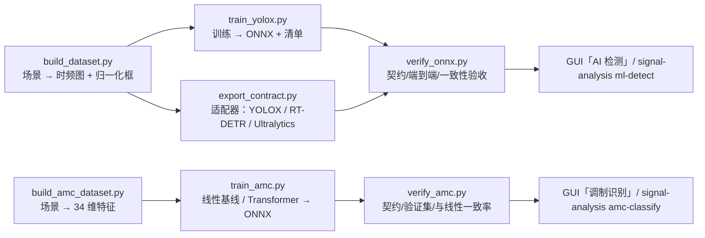

# training/ — AI 检测与调制识别模型的训练、导出与验收

本目录是 **AI 信号检测（P3）与 A09 六类调制识别（P4）的训练侧**，只包含脚本与文档，**不打包进 wheel**
（`pyproject.toml` 里 `[tool.setuptools.packages.find] where = ["src"]`），因此：

* 运行期依赖保持轻量：产品只需要 `.[ml]`（onnxruntime），训练才需要 `.[train]`（torch / onnx）；
* 训练数据、第三方权重与其许可证与产品发行隔离，便于做合规审查。

整条链路只有一条原则：**训练与推理必须共用同一套坐标/图像/特征契约**。所有坐标变换与特征提取都调用
`src/signal_analysis/ml/` 里的函数，绝不自己手写一套。



`training/detectors/` 是对外框架的适配器层（只做"补输入预处理 + 补输出几何转换"，
见 §7）；`tiny` 是本仓库自带的最小检测头，用于在没有第三方框架时跑通全链路。

---

## 1. 训练-推理契约（唯一真相）

| 项目 | 取值 | 定义位置 |
| --- | --- | --- |
| 输入契约 | `tf_image_v1` | `ml/manifest.py::INPUT_CONTRACT` |
| 图像排布 | `time_frequency_grayscale_v1`：**行 = 频率、行 0 = +fs/2、列 = 时间、列 0 = t=0** | `ml/tensor.py::detection_image` |
| 归一化 | `clip((dB − 底噪) / 动态范围, 0, 1)`，float32 单通道 | 同上 |
| 输出契约 | `normalized_boxes_v1`：`(N, 6) = [x_center, y_center, width, height, confidence, class]` | `ml/decode.py::BOX_COLUMNS` |
| 坐标含义 | 前四列是**边框坐标**：`x_center/width` 按时间跨度归一化，`y_center/height` 按采样率归一化；`confidence ∈ [0, 1]`；`class` 为清单 `labels` 的下标 | 同上 |
| 标签生成 | 只允许 `band_to_box(meta, f_low_hz, f_high_hz, t_start_s, t_end_s)` | `ml/tensor.py` |
| 真值来源 | `evaluation.signal_truth(generation)` | `evaluation.py` |
| 结果契约 | 推理输出仍是冻结的 `detect_result_v1`，可直接与能量检测器并排评分 | `evaluation.py::evaluate_detections` |

`y` 的约定值得特别说明：图像行自上而下频率递减，因此 `y_center` 用「距最高频率」的归一化量表示
（`y_center = (fs/2 − f_center) / fs`）。这正是 `band_to_box` / `box_to_band` 的实现，**不要**在
数据集脚本里另写一份「y 用频率比例」的公式，否则框会整体上下翻转。

### 跳频信号的会话语义

按本项目的既有约定，**跳频信号是"一段会话一个实例"**：真值给出一条会话记录，
`t_start_s = 0`、`t_end_s = duration`，频率维覆盖所有去重后的跳频信道 ± 半跳带宽。
所以稳态记录里**标签框的时间维恒为整帧宽**（`width = 1.0`），网络主要学习的是频率维定位；
这与推理端 `_merge_sessions` 的会话合并口径一致。若将来需要更细的时间定位（例如同一会话内的
多段突发），应先扩展 `signal_truth` 的时间语义，再重训模型——属于后续工作。

---

## 2. 构建数据集：只用本项目生成器

```bash
.venv/bin/python training/build_dataset.py \
    --output training/data/detector --count 2000 --seed 7 \
    --image-size 1024 --nfft 512 --duration-range 0.2,0.5 --max-signals 3 \
    --snr-range -5,30 --noise-only-ratio 0.12
```

产物：

| 文件 | 内容 |
| --- | --- |
| `dataset.json` | 契约字段、场景生成参数、统计（目标数分布、带宽比例、带内信噪比范围） |
| `images/%06d.npy` | float32 `(H, W)`，取值 `[0, 1]` |
| `samples.jsonl` | 每行：`image`、`boxes`（标签）、`truth`（真值摘要）、`scene`、`split` |

关键设计：

* **标签与真值同源**：标签由 `signal_truth` → `band_to_box` 生成，与推理端的解码互逆；
* **场景可逐字节复现**：每行都保存了生成器的原始输入（`scene.signals` / `scene.noise` /
  `scene.seed` / `scene.duration_s`），训练脚本的端到端验证与 `verify_onnx.py` 都靠它
  重新生成完全相同的波形（`tests/analysis/test_training_tools.py` 对此有断言）；
* **标签互不重叠**：场景先在 ±fs/2 内划分互斥频段槽，再把各种调制的实际占用带宽压在槽内
  （SSB 占一侧、FM 的 `deviation ≤ 0.19 × 槽宽`、跳频用 `hop_bandwidth = 槽宽/(跳数+1)`），
  因此 NMS 与匹配评测不受"标签互相打架"干扰；
* **纯噪声场景**占 `--noise-only-ratio`，标签为空，用来压制虚警；
* 只用 NumPy 与项目代码，不需要 torch。

数据量参考：跑通链路 200～500 条；要得到有意义的模型，建议 **2 万～10 万条**，并保证每种
调制样式 / 跳频样式、每个带内信噪比档位都有足够样本。

常用参数：

| 参数 | 默认 | 说明 |
| --- | --- | --- |
| `--count` | 1000 | 样本数 |
| `--rate` / `--duration-range` | 1e6 / 0.2,0.5 | 采样率与时长区间（秒） |
| `--image-size` / `--nfft` / `--dynamic-range` | 1024 / 512 / 60 | 必须与推理清单一致的三件套 |
| `--modes` | 全部 9 种 | `am,fm,ssb,ask2,qpsk,qam16,qam64,fh_rc,fh_video` |
| `--max-signals` / `--snr-range` | 3 / −5,30 | 单场景信号数上限与带内信噪比区间 |
| `--train-fraction` | 0.8 | 按顺序切分（样本 i.i.d.，顺序切分即可） |

---

## 3. 训练

```bash
.venv/bin/python -m pip install -e ".[train]"          # torch / torchvision / onnx
.venv/bin/python training/train_yolox.py \
    --data training/data/detector --output training/runs/tiny --epochs 20 --batch 8
```

`--arch tiny`（默认）使用 `training/tiny_detector.py` 中**自研的最小无锚框检测头**
（Apache-2.0）：若干次步长 2 卷积 → 网格目标性 + 框回归 + 类别，`forward` 里用
`sigmoid / softplus / topk / gather` 直接完成解码，输出形状固定为 `(1, K, 6)`，
因此 `torch.onnx.export` 之后**无需任何后处理**就能被 `parse_model_output` 解码。

它的定位是**冒烟基线与链路验收**，不是可用精度的模型。真要做精度，请按 §7 用
`training/export_contract.py` 接入 YOLOX / RT-DETR（首选）或 Ultralytics（仅内网基线）。

训练脚本会：

1. 校验数据集契约（`input_contract` / `layout` / `output_layout` 与推理端一致才继续）；
2. 训练并打印每轮平均 loss；
3. **用项目自身的评测口径做端到端验证**：从 `scene` 重建波形 → 注入 torch 会话跑
   `ml_detect` → `evaluate_detections`，得到召回 / 精确率 / 中心频率 MAE（与 GUI、CLI 完全同一条路径）；
4. 导出 `detector.onnx` 并调用 `write_model_manifest` 生成 `detector.json`（清单里含 sha256、
   图像契约、训练参数与验证指标）；
5. 写出 `validation.json`（逐场景指标与 loss 曲线），便于回归比较。

注意：**`.onnx` 与清单必须放在同一目录**（清单里保存的是相对路径），脚本默认都是
`--output` 目录；`--save-state` 可额外保存 torch `state_dict`。

---

## 4. 验收（C02）

```bash
.venv/bin/python training/verify_onnx.py --manifest training/runs/tiny/detector.json \
    --json training/runs/tiny/verify.json

# 数值一致性：与另一版本（FP16 / 不同 opset / 重导出）比对同一张时频图的原始输出
.venv/bin/python training/verify_onnx.py --manifest a/detector.json --reference a/detector_fp16.onnx
```

检查项：

1. 清单自洽：版本、契约、标签、摘要（sha256）——`read_model_manifest` 的强校验；
2. `onnxruntime` 可用且版本满足清单要求（缺失时给出 `.[ml]` 安装提示，退出码 2）；
3. **图上契约**：ONNX 输入必须是 `(1, 1, H, W)` 且 H/W 等于清单 `input.image_size`，
   输入节点名必须是 `images`；输出必须含 6 列——这些从 Python 侧清单看不出来，只有读图才能验证；
4. 端到端：确定性场景（单载波数字、**跳频会话**、双信号、纯噪声）跑 `ml_detect`，
   结果必须 JSON 安全（`allow_nan=False`），并用 `evaluate_detections` 给出召回/精确率；
5. 可复现：同一批样本重复推理，检测结果必须完全一致；
6. 数值一致性：`--reference` 时在同一张时频图上比较两个模型的原始输出，报最大绝对偏差。

---

## 5. 在产品里使用

```bash
.venv/bin/python -m pip install -e ".[ml]"                       # onnxruntime
.venv/bin/signal-analysis ml-detect <asset_id> training/runs/tiny/detector.json
```

GUI：**信号检测 → AI 检测**（选择 `detector.json`，可与能量基线叠加对照，表格里同时给出
AI 框与灰色虚线基线框）。没有安装 onnxruntime 时 AI 控件自动禁用并提示安装方式，传统检测不受影响。

---

## 6. 调制识别（A09 六类，P4）

与检测并列的第二条链路：**单信号频带内的调制样式识别**，类别字典按技术方案原文固定为六类：
**FM、SSB、2ASK、QPSK、16QAM、64QAM**（`signal_analysis.ml.amc.AMC_CLASSES`）。`am` 与两种跳频样式
**不在**字典内：跳频是"一段会话一个实例"的检测对象，`am` 只作为数据库示例出现；遇到这两类时结果
标为"不适用"并照常计数，不丢弃样本。

### 6.1 训练-推理契约

| 项目 | 取值 | 定义位置 |
| --- | --- | --- |
| 特征契约 | `amc_feature_vector_v1`，顺序由 `AMC_FEATURES` 固定（34 维，全为有限浮点数） | `ml/amc.py::extract_features` |
| 特征内容 | 包络统计、谱平坦度/边缘、瞬时频率与相位统计、`|M20|/|C42|/|C63|`、全样本与峰值幅度分布、16 桶峰值幅度直方图模板、带内信噪比粗估 | 同上 |
| 线性模型契约 | `amc_model_v1`：`z=(x−mean)/scale`、`p=softmax(T·(zW+b))`，无隐藏状态 | `ml/amc.py::fit_model` |
| ONNX 契约 | `amc_feature_vector_v1`：输入 `features (N,34)` float32 **未标准化**，输出 `scores (N,6)` 概率，标准化写入导出图 | `ml/amc.py::write_amc_manifest` |
| 结果契约 | `amc_classify_v1`：特征、频带、六类概率、可信度提示与传统启发式对照 | `ml/amc.py::amc_classify` |
| 真值来源 | 生成器 `mode` 直接就是类别名；只在**单信号**资产上与真值比对 | `services.py::_attach_amc_truth` |

### 6.2 构建数据集、训练与验收

```bash
# 1) 数据集：只用本项目生成器（每类 400 共 2400 条，约 1 分钟，约 34 维特征 + 真值）
.venv/bin/python training/build_amc_dataset.py --output training/data/amc --per-class 400 --seed 11

# 2) 训练线性基线并写成内置模型（确定性，秒级）
.venv/bin/python training/train_amc.py --data training/data/amc

# 3) 可选：Transformer + ONNX（需要 .[train]）
.venv/bin/python -m pip install -e ".[train]"
.venv/bin/python training/train_amc.py --data training/data/amc --arch transformer \
    --epochs 30 --output training/runs/amc/model.json --onnx-dir training/runs/amc

# 4) 验收：数据集契约 + 线性基线 + （有清单时）ONNX 与线性模型一致率
.venv/bin/python training/verify_amc.py --data training/data/amc
.venv/bin/python training/verify_amc.py --data training/data/amc --manifest training/runs/amc/amc.json
```

数据集产物：`amc_dataset.json`（契约、场景参数、分层划分与统计）与 `features.jsonl`（每行：
`label`、`mode`、`snr_db`、`features`、`analysis`（检测器口径的中心/带宽，带抖动）、`truth`（真值中心/带宽/
功率/带内信噪比）、`scene`（可逐字节重建波形）、`split`）。场景按类**分层**划分 train/val，
分析窗在真值上叠加中心/带宽抖动，模拟"检测器给出的频带估计"，因此特征与推理口径一致。

关键设计：

* **特征与推理同源**：数据集里的特征直接来自 `ml.amc.extract_features`，训练脚本不再重算，
  避免"训练特征 ≠ 推理特征"；
* **带内信噪比是唯一验收口径**（`inband_snr_v1`）：数据集的 `snr_db` 与检测/识别结果里的
  `snr_estimate_db` 语义一致，分信噪比指标按 5 dB 分档统计；
* **可复现**：`--seed` 固定后场景、划分与模型权重完全确定（线性模型只由最小二乘 + 温度标定决定）。

### 6.3 实测指标（内置基线，合成数据验证集 480 条）

| 指标 | 数值 |
| --- | --- |
| 总体准确率 / 宏平均 F1 | 0.8250 / 0.8246 |
| 每类 F1 | FM 0.954 · SSB 0.888 · 2ASK 0.982 · QPSK 0.835 · 16QAM 0.608 · 64QAM 0.682 |
| 分档准确率 | −5~0 dB 0.444 · 0~5 dB 0.662 · 5~10 dB 0.793 · 10~15 dB 0.970 · 15~20 dB 0.967 · 20 dB 以上 1.000 |

**老实说的话**：9～10 dB 以上可用（≥0.97），低信噪比下主要错误是 **16QAM ↔ 64QAM**（16QAM 有 26/80
被判成 64QAM）以及 QPSK 被判成 QAM；原因是低 SNR 下 RRC 成形带来的 ISI 把 16/64QAM 的 `C63` 差别
压到 2 倍以内，而线性判别只能给一个全局超平面。可选 **Transformer + ONNX** 支线就是为改善这一段准备
的（自监督式的逐特征 token + 类别 token）。

> 识别准确率的**合格门限仍是技术方案的待确认项**：本页所有数字都只描述
> `build_amc_dataset.py --seed 11` 这个分布下的表现，不构成验收结论。GUI / CLI / 报表里的每一个识别
> 结果都带着这条提示。

### 6.4 在产品里使用

```bash
.venv/bin/signal-analysis amc-classify <asset_id>                       # 内置线性基线
.venv/bin/signal-analysis amc-classify <asset_id> --offset-hz 0 --bandwidth-hz 30000
.venv/bin/signal-analysis amc-classify <asset_id> --model training/runs/amc/model.json
.venv/bin/signal-analysis amc-classify <asset_id> --model training/runs/amc/amc.json   # ONNX 清单
```

GUI：**调制识别**标签页（可手填分析中心/带宽，或先用“信号检测”跑一次再点“取用检测结果频带”；右侧
给出六类概率柱状图、34 维特征表、可信度提示与传统启发式对照）。默认模型缺失时页面会提示先用
`train_amc.py` 生成，不影响传统检测路径。

---

## 7. 接入 YOLOX / RT-DETR / Ultralytics 的适配器框架

`training/detectors/` 把这套"胶水"做成了**可插拔适配器 + 统一命令行**，
`training/export_contract.py` 是所有框架的唯一入口。设计原则是
**"框架负责训练与导出，我们只负责补输入预处理 + 补输出几何转换"**——
权重一个字节都不动，因此两条路径都能用 `verify_onnx.py` 验收。

```bash
# 看看有哪些框架、各自什么许可证、现在能不能用
.venv/bin/python training/export_contract.py --list-frameworks
# 看看输出布局表（决定 --layout 填什么）
.venv/bin/python training/export_contract.py --list-layouts
```

### 7.1 两条路径

| 路径 | 什么时候用 | 命令骨架 |
| --- | --- | --- |
| `--dataset-only` | **先对齐标注口径**，不需要装任何第三方框架 | `--framework <arch> --data <数据集> --dataset-only --dataset-output <目录> --dataset-format {yolo,coco}` |
| `--onnx`（主路径） | 框架自己训练、自己导出 ONNX，我们做契约改写 | `--framework <arch> --onnx <原生图> --layout <布局> --imgsz <边长> --max-boxes <N> --output <目录>` |
| 默认（torch，仅 `tiny`） | 内置最小检测头跑通全链路 | `--framework tiny --mode torch --data <数据集> --output <目录> --probe` |

`--onnx` 路径**不导入框架的 Python 包**（图已经是导出的成品），只需要 `onnx` / `onnxruntime`。
`--max-boxes` 必须 ≤ 原生候选框数，否则直接报错而不是导出形状错误的图。

### 7.2 适配器清单

| `--arch` | 框架 | 许可证 | 期望的原生输出布局（`--layout`） | 输入预处理（均已对上游源码核对） |
| --- | --- | --- | --- | --- |
| `tiny` | 本仓库 `tiny_detector.py` | Apache-2.0 | `normalized_cxcywh` | 无（已是 `[0,1]` 单通道） |
| `rtdetr` | RT-DETR（lyuwenyu） | Apache-2.0 | `normalized_cxcywh` | 通道复制 ×3；**量纲按分支显式声明**，见下表 |
| `yolox` | YOLOX（Megvii） | Apache-2.0 | `pixel_cxcywh`（`decode_in_inference=True`） | 通道复制 ×3；**不做除以 255**，`0–255` BGR 原值 |
| `ultralytics` | Ultralytics YOLO11 / YOLO26 | **AGPL-3.0** | `pixel_xyxy`（需 `nms=False` 端到端头） | 通道复制 ×3，`×255`（只做 `.div_(255)`，**无 ImageNet 均值方差**） |

核对依据：Ultralytics `engine/predictor.py::BasePredictor.preprocess` 是
BHWC→BCHW → `im.flip(1)`（BGR→RGB）→ `.div_(255)`，没有均值方差；
YOLOX `data/data_augment.py::preproc` 是 pad 114 → 等比 resize → HWC→CHW，
float32 且仍是 `0–255` 的 BGR（`/255` + 归一化只存在于 `ValTransform(legacy=True)`
这条旧分支，官方 `demo/onnx_inference.py` 用 `legacy=False`）。
`tests/analysis/test_detector_adapters.py::test_declared_preprocess_matches_upstream_source`
把这些取值钉住了，改错会直接测试失败。

RT-DETR 的输入量纲**在三个常用实现之间不一致**，所以不给默认值：
缺 `--input-scale` 时 `training/export_contract.py` 直接报错并打印选项，
避免套一个猜的默认值把口径错到底。

| RT-DETR 分支 | dataloader 预处理 | 该填的参数 |
| --- | --- | --- |
| `rtdetr_paddle`（PaddleDetection） | `NormalizeImage(mean=[.485,.456,.406], std=[.229,.224,.225], is_scale=True)`，先 `/255` 再减均值除方差 | `--input-scale 255 --input-mean .485 .456 .406 --input-std .229 .224 .225` |
| `rtdetr_pytorch`（v1） | `ToImageTensor` + `ConvertDtype`：只转 float32，**数值仍是 0–255** | `--input-scale 1` |
| `rtdetrv2_pytorch`（v2） | `ConvertPILImage(dtype='float32', scale=True)`：缩放成 0–1 | `--input-scale 255` |

预处理一律由适配器声明、由 `torch` / `onnx` 两条改写器**写进导出图**，
Python 侧只喂 `[0, 1]` 单通道时频图，绝不偷偷改语义。
另外：三个框架都期待 3 通道，我们的单通道灰度复制成 3 份后 BGR/RGB 等价（无需翻转）；
方形时频图且 `--imgsz` 等于图像边长时，letterbox / resize 是恒等变换（无需补边）。

### 7.3 检查清单（对任何框架都成立）

- [ ] **标签**：直接用 `build_dataset.py` 的数据集，或至少用 `band_to_box` 生成标签；
      `training/detectors/labels.py` 只从 `record["boxes"]` 取框，**不做任何 y 翻转**
      （第三方图像 row 0 在顶部，与 `detection_image` 的 row 0 = `+fs/2` 一致）；
- [ ] **输入**：导出图最终输入为 `images`，形状 `(1, 1, H, W)`，float32，取值 `[0, 1]`。
      框架自带的归一化（均值方差、`/255`、LetterBox）必须由 `--channel-repeat` /
      `--input-scale` / `--input-mean` / `--input-std` 声明，改写器会作为网络第一层烘进图里。
      **一定去上游源码确认，不要凭印象**：Ultralytics 只做 `.div_(255)`（无均值方差），
      YOLOX 连 `/255` 都不做，RT-DETR 各分支口径互不相同；
- [ ] **输出**：单输出 `detections`，形状 `(1, N, 6)`，列为 `[cx, cy, w, h, score, class]`，
      归一化 cxcywh。改写器负责 xyxy→cxcywh、像素→归一化、按置信度降序取 TopK；
      **多输出**（如 RT-DETR 的 boxes/scores/labels 三个输出）需要先在自己的导出脚本里
      `concat` 成单输出；
- [ ] **类别数**：当前单类 `emitter`（`class` 恒 0）；多类时按索引写进清单 `labels`；
- [ ] **opset ≥ 17、batch = 1**；动态轴可以选择性保留（`verify_onnx.py` 允许动态形状）；
- [ ] **清单**：改写器会自动 `write_model_manifest(...)`，里面记录框架、许可证、
      是否可分发、预处理三件套与数据集划分；
- [ ] **验收**：`verify_onnx.py --manifest ...`，需要时用 `--reference` 做数值一致性回归；
- [ ] **训练图像参数三件套**（`image_size` / `spectrogram_nfft` / `dynamic_range_db`）必须写进清单，
      推理端会强制与清单一致（不一致直接报错，而不是静默改变输入）。

### 7.4 排查顺序

1. `--probe`（torch 路径）或先跑一遍原生图，用 `--list-layouts` 的 `examples` 对号入座，
   确认真实输出形状与最后一维列数；
2. 形状对但数值不对 → 十有八九是 `--input-scale` / `--input-mean` / `--input-std` 声明错了，
   回 §7.2 的分支表逐项核对（`rtdetr` 缺 `--input-scale` 会直接报错，这是刻意设计）；
3. `--max-boxes` 报"候选框不足" → 调到 ≤ 原生候选框数（YOLO26 端到端头固定 300）；
4. `--allow-copyleft` 被要求 → 见 §8。

---

## 8. 许可证与数据集注意事项

| 组件 | 许可证 | 本项目中的用法 |
| --- | --- | --- |
| YOLOX | Apache-2.0 | **推荐**，交付/闭源友好 |
| RT-DETR（官方 / PaddleDetection 实现） | Apache-2.0 | **推荐** |
| Ultralytics YOLO11 | AGPL-3.0 | **仅可作内网基线对照** |
| Ultralytics YOLO26 | AGPL-3.0 | **仅可作内网基线对照**。若确要用 Ultralytics，选 YOLO26 而不是 YOLO11：`nms=False` 的端到端头直接输出 `(1, 300, 6)`（无需 NMS），且去掉 DFL 后 CPU 端 ONNX 推理显著更快 |
| TorchSig（库） | MIT | 可用于数据生成/增强（本目录未使用） |
| RadioML 2018.01A | CC BY-NC-SA 4.0 | **不可商用、不可随产品分发** |
| Sig53 等公开数据集 | CC BY-NC-SA 4.0 | 同上 |
| 本项目生成器合成的数据 | 本项目 `LICENSE` | 可自由使用与分发 |

结论：**训练数据只用本项目生成器合成**，权重优先选 Apache-2.0 的方案（RT-DETR / YOLOX）；
即便交付不要求闭源商用，也不要把 AGPL 权重或 NC 数据集带进发行包。
框架层已经把这个约束编码成硬门禁：`COPYLEFT` 许可证的适配器不显式加
`--allow-copyleft` 一律拒绝，清单里也会写 `distributable: false` 并追加告警。

---

## 9. 常用命令速查

```bash
# 1) 依赖
.venv/bin/python -m pip install -e ".[train]"     # 训练（torch/onnx）
.venv/bin/python -m pip install -e ".[ml]"        # 推理（onnxruntime）

# 2) 小规模跑通（几秒钟）
.venv/bin/python training/build_dataset.py --output /tmp/ds --count 8 \
    --image-size 128 --nfft 128 --duration-range 0.1,0.15
.venv/bin/python training/train_yolox.py --data /tmp/ds --output /tmp/run --epochs 2
.venv/bin/python training/verify_onnx.py --manifest /tmp/run/detector.json

# 3) 正式训练
.venv/bin/python training/build_dataset.py --output training/data/detector --count 40000 --seed 7
.venv/bin/python training/train_yolox.py --data training/data/detector \
    --output training/runs/tiny --epochs 40 --batch 16 --lr 5e-4

# 4) 回归测试（训练工具链本身）
QT_QPA_PLATFORM=offscreen .venv/bin/python -m pytest \
    tests/analysis/test_training_tools.py tests/analysis/test_detector_adapters.py -q

# 4b) 第三方检测框架接入（不需要安装框架，只要 onnx / onnxruntime）
.venv/bin/python training/export_contract.py --list-frameworks
.venv/bin/python training/export_contract.py --list-layouts
# 先导出框架原生数据集（YOLO / COCO），对齐标注口径
.venv/bin/python training/export_contract.py --framework rtdetr \
    --data /tmp/ds --dataset-only --dataset-output /tmp/ds_coco --dataset-format coco
# 把框架自己导出的 ONNX 改写成契约图 + 清单
# 注意：rtdetr 的输入量纲各分支不同，必须显式声明（见 §7.2 分支表）
.venv/bin/python training/export_contract.py --framework rtdetr \
    --onnx /tmp/rtdetr.onnx --layout normalized_cxcywh --imgsz 1024 \
    --max-boxes 32 --output /tmp/run_rtdetr --input-scale 255
# Ultralytics（AGPL-3.0）必须显式放行，产物仅限内网评测
.venv/bin/python training/export_contract.py --framework ultralytics --allow-copyleft \
    --onnx /tmp/yolo26s.onnx --layout pixel_xyxy --imgsz 640 --max-boxes 32 \
    --output /tmp/run_yolo26s

# 5) 调制识别（A09 六类）：数据集 → 线性基线 → 验收
.venv/bin/python training/build_amc_dataset.py --output training/data/amc --per-class 400 --seed 11
.venv/bin/python training/train_amc.py --data training/data/amc
.venv/bin/python training/verify_amc.py --data training/data/amc
```
